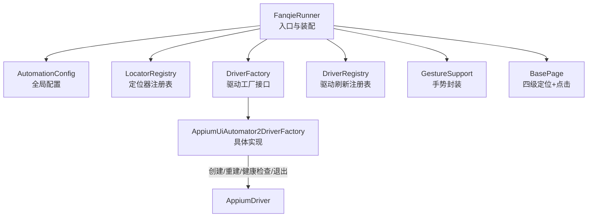
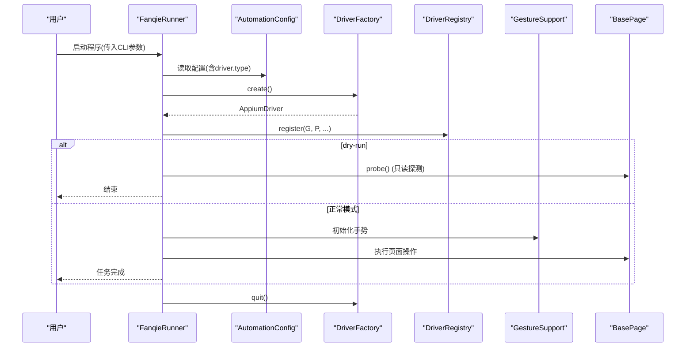
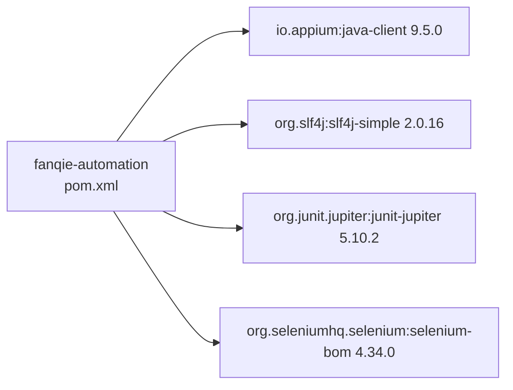

# API参考

<cite>
**本文引用的文件**
- [FanqieRunner.java](file://automation/src/main/java/com/fanqie/auto/FanqieRunner.java)
- [DriverFactory.java](file://automation/src/main/java/com/fanqie/auto/core/DriverFactory.java)
- [AppiumUiAutomator2DriverFactory.java](file://automation/src/main/java/com/fanqie/auto/core/AppiumUiAutomator2DriverFactory.java)
- [AutomationConfig.java](file://automation/src/main/java/com/fanqie/auto/config/AutomationConfig.java)
- [LocatorRegistry.java](file://automation/src/main/java/com/fanqie/auto/config/LocatorRegistry.java)
- [DriverRegistry.java](file://automation/src/main/java/com/fanqie/auto/core/DriverRegistry.java)
- [BasePage.java](file://automation/src/main/java/com/fanqie/auto/page/BasePage.java)
- [GestureSupport.java](file://automation/src/main/java/com/fanqie/auto/core/GestureSupport.java)
- [pom.xml](file://automation/pom.xml)
</cite>

## 目录
1. [简介](#简介)
2. [项目结构](#项目结构)
3. [核心组件](#核心组件)
4. [架构总览](#架构总览)
5. [详细组件分析](#详细组件分析)
6. [依赖关系分析](#依赖关系分析)
7. [性能考量](#性能考量)
8. [故障排查指南](#故障排查指南)
9. [结论](#结论)
10. [附录：配置项与命令行参数速查](#附录配置项与命令行参数速查)

## 简介
本API参考面向自动化测试框架的开发者与集成者，覆盖以下能力：
- 命令行接口（CLI）完整参数说明、默认值与使用示例
- 配置接口（AutomationConfig）全部配置项的数据类型、取值范围与示例
- DriverFactory扩展点：如何新增自定义驱动类型并接入上层流程
- Java API文档：关键类结构、方法签名、参数与返回值说明
- 代码级流程图与时序图，帮助理解数据流与控制流
- 集成指南与最佳实践，确保稳定运行与可维护性

## 项目结构
本项目采用分层组织方式：
- 入口与装配：FanqieRunner 负责解析命令行参数、装配组件、启动任务
- 配置层：AutomationConfig 集中管理所有运行时配置；LocatorRegistry 管理控件定位策略
- 核心层：DriverFactory/DriverRegistry/GestureSupport/BasePage 等提供设备会话、手势、页面交互能力
- 页面与任务：页面对象封装业务操作，任务编排主流程
- 构建与依赖：pom.xml 定义版本矩阵与打包插件

图表来源
- [FanqieRunner.java:41-238](file://automation/src/main/java/com/fanqie/auto/FanqieRunner.java#L41-L238)
- [DriverFactory.java:17-54](file://automation/src/main/java/com/fanqie/auto/core/DriverFactory.java#L17-L54)
- [AppiumUiAutomator2DriverFactory.java:44-118](file://automation/src/main/java/com/fanqie/auto/core/AppiumUiAutomator2DriverFactory.java#L44-L118)
- [AutomationConfig.java:112-178](file://automation/src/main/java/com/fanqie/auto/config/AutomationConfig.java#L112-L178)
- [LocatorRegistry.java:52-148](file://automation/src/main/java/com/fanqie/auto/config/LocatorRegistry.java#L52-L148)
- [DriverRegistry.java:19-56](file://automation/src/main/java/com/fanqie/auto/core/DriverRegistry.java#L19-L56)
- [GestureSupport.java:26-67](file://automation/src/main/java/com/fanqie/auto/core/GestureSupport.java#L26-L67)
- [BasePage.java:40-91](file://automation/src/main/java/com/fanqie/auto/page/BasePage.java#L40-L91)

章节来源
- [FanqieRunner.java:41-238](file://automation/src/main/java/com/fanqie/auto/FanqieRunner.java#L41-L238)
- [pom.xml:15-83](file://automation/pom.xml#L15-L83)

## 核心组件
- FanqieRunner：唯一 main() 入口，解析 CLI、装配组件、执行任务、优雅退出
- AutomationConfig：统一配置加载与类型化访问器，支持外部配置文件覆盖
- LocatorRegistry：控件定位策略与候选文案集合，支持中文 UTF-8 安全加载
- DriverFactory：抽象驱动工厂，定义 create/recreate/healthCheck/quit/getDriver
- AppiumUiAutomator2DriverFactory：基于 Appium 2 + UiAutomator2 的具体实现
- DriverRegistry：集中刷新所有持有 driver 的组件引用，避免 session 失效
- BasePage：四级定位降级链（语义→几何→时序→系统），统一点击与兜底
- GestureSupport：比例坐标手势封装，翻页、滑动、激活/终止应用

章节来源
- [FanqieRunner.java:41-238](file://automation/src/main/java/com/fanqie/auto/FanqieRunner.java#L41-L238)
- [AutomationConfig.java:18-178](file://automation/src/main/java/com/fanqie/auto/config/AutomationConfig.java#L18-L178)
- [LocatorRegistry.java:16-148](file://automation/src/main/java/com/fanqie/auto/config/LocatorRegistry.java#L16-L148)
- [DriverFactory.java:17-54](file://automation/src/main/java/com/fanqie/auto/core/DriverFactory.java#L17-L54)
- [AppiumUiAutomator2DriverFactory.java:15-118](file://automation/src/main/java/com/fanqie/auto/core/AppiumUiAutomator2DriverFactory.java#L15-L118)
- [DriverRegistry.java:10-56](file://automation/src/main/java/com/fanqie/auto/core/DriverRegistry.java#L10-L56)
- [BasePage.java:18-91](file://automation/src/main/java/com/fanqie/auto/page/BasePage.java#L18-L91)
- [GestureSupport.java:12-67](file://automation/src/main/java/com/fanqie/auto/core/GestureSupport.java#L12-L67)

## 架构总览
整体控制流：
- 启动时打印设备核对清单与环境自检
- 根据 driver.type 选择具体 DriverFactory 实现
- 创建 AppiumDriver，初始化日志、手势、状态检测、等待支持
- 注册 DriverAware 组件到 DriverRegistry，便于 session 重建后统一刷新
- Dry-run 模式仅探测 UI，不执行点击
- 正常模式装配 Page 与 Task，执行主任务并统计结果

图表来源
- [FanqieRunner.java:41-238](file://automation/src/main/java/com/fanqie/auto/FanqieRunner.java#L41-L238)
- [DriverFactory.java:17-54](file://automation/src/main/java/com/fanqie/auto/core/DriverFactory.java#L17-L54)
- [AppiumUiAutomator2DriverFactory.java:44-118](file://automation/src/main/java/com/fanqie/auto/core/AppiumUiAutomator2DriverFactory.java#L44-L118)
- [BasePage.java:77-91](file://automation/src/main/java/com/fanqie/auto/page/BasePage.java#L77-L91)
- [GestureSupport.java:71-86](file://automation/src/main/java/com/fanqie/auto/core/GestureSupport.java#L71-L86)

## 详细组件分析

### 命令行接口（CLI）
- 入口类：FanqieRunner.main(String[] args)
- 支持的参数与行为：
  - --doctor：仅运行环境自检，不创建 session
  - --dry-run：连接设备并 dump UI 树，不执行任何点击
  - --config <path>：使用外部 properties 文件覆盖默认配置
  - --cycles <N>：覆盖外层循环次数（flow.outer.cycles）
  - --pages <N>：覆盖每轮页面数（flow.pages.per.cycle）
  - --reset-progress：清除累计进度，从零开始
- 未识别参数会输出用法提示并退出

使用示例（概念性）：
- 仅环境自检：java -jar fanqie-automation.jar --doctor
- 只读探测UI：java -jar fanqie-automation.jar --dry-run
- 指定配置与覆盖：java -jar fanqie-automation.jar --config /path/to/automation.properties --cycles 3 --pages 6

章节来源
- [FanqieRunner.java:41-87](file://automation/src/main/java/com/fanqie/auto/FanqieRunner.java#L41-L87)
- [FanqieRunner.java:241-249](file://automation/src/main/java/com/fanqie/auto/FanqieRunner.java#L241-L249)

### 配置接口（AutomationConfig）
- 作用：集中加载 automation.properties，并提供类型化 getter
- 支持从 classpath 默认配置与外部路径覆盖
- 主要配置分组与说明（节选，完整见附录）：
  - Appium 相关：server URL、平台名、自动化名称、设备 UDID、包名、noReset、超时、安装跳过等
  - 驱动类型：driver.type（当前支持 uiautomator2，预留 harmony_hdc）
  - 时序：轮询间隔、状态检测超时、动作超时、应用启动超时、广告视频超时、心跳间隔等
  - 流程：每轮页数、最大轮次、目标免广告分钟、奖励兜底估值、墙钟熔断、连续错误上限、恢复重试上限
  - 阅读页翻页：策略（tap/swipe）、点击比例、滑动比例与时长
  - 验证与调试：截图校验翻页、dryRun 开关
- 数据类型：String/int/long/double/boolean，缺失时使用内置默认值

章节来源
- [AutomationConfig.java:18-178](file://automation/src/main/java/com/fanqie/auto/config/AutomationConfig.java#L18-L178)
- [AutomationConfig.java:180-297](file://automation/src/main/java/com/fanqie/auto/config/AutomationConfig.java#L180-L297)

### DriverFactory 扩展点
- 接口职责：创建/重建/探活/退出/获取 driver
- 设计目的：为未来鸿蒙 NEXT 路线（如 HdcUiTestDriverFactory）提供替换点，上层零感知
- 扩展步骤：
  1) 新建类实现 DriverFactory 接口
  2) 在 FanqieRunner.createDriverFactory 中增加 case 分支，按 config.driverType() 选择新实现
  3) 保持 create/recreate/healthCheck/quit/getDriver 契约一致
- 注意事项：
  - create 需立即设置 implicitlyWait=0，避免隐式等待破坏短轮询
  - healthCheck 用轻量命令（如窗口尺寸）探测 session 有效性
  - quit 必须幂等，防止重复退出抛异常

章节来源
- [DriverFactory.java:17-54](file://automation/src/main/java/com/fanqie/auto/core/DriverFactory.java#L17-L54)
- [FanqieRunner.java:251-268](file://automation/src/main/java/com/fanqie/auto/FanqieRunner.java#L251-L268)
- [AppiumUiAutomator2DriverFactory.java:44-118](file://automation/src/main/java/com/fanqie/auto/core/AppiumUiAutomator2DriverFactory.java#L44-L118)

### AppiumUiAutomator2DriverFactory（具体实现）
- 关键决策：
  - 不设置 appActivity/app，改用 mobile: activateApp 按包名激活
  - noReset=true 保护登录态与书架数据
  - 创建后立即 implicitlyWait(Duration.ZERO)，保证显式等待主导
  - 华为/鸿蒙特殊 capability：自动授权、忽略隐藏API策略、抑制杀死 adb server、放宽服务器启动/安装超时
- 生命周期：
  - create：构建 capabilities，创建 AndroidDriver，记录 sessionId
  - recreate：先 quit 再 create
  - healthCheck：捕获 NoSuchSessionException/WebDriverException
  - quit：幂等清理，finally 置空 driver 引用
  - getDriver：返回当前 driver（可能为 null）

章节来源
- [AppiumUiAutomator2DriverFactory.java:15-118](file://automation/src/main/java/com/fanqie/auto/core/AppiumUiAutomator2DriverFactory.java#L15-L118)
- [AppiumUiAutomator2DriverFactory.java:120-178](file://automation/src/main/java/com/fanqie/auto/core/AppiumUiAutomator2DriverFactory.java#L120-L178)

### 页面与定位（BasePage）
- 四级定位降级链：
  - L1 语义属性匹配：text → content-desc → resource-id，命中多个时用 boundsHint 裁决
  - L2 结构化几何推断：在 boundsHint 区域内查找 clickable=true 且面积较小的节点（受 allowGeometryFallback 约束）
  - L3 时序兜底：达到 adVideoTimeoutMs 后强制尝试 L2（同样受约束）
  - L4 系统兜底：navigate().back() 或重启 App
- 点击实现：取节点 bounds 中心坐标，若不可点击则回溯最近可点击祖先，通过 GestureSupport.tapAtPixel 执行
- 便捷方法：按 text/content-desc/resourceId 快速点击；心跳钩子

章节来源
- [BasePage.java:18-91](file://automation/src/main/java/com/fanqie/auto/page/BasePage.java#L18-L91)
- [BasePage.java:93-250](file://automation/src/main/java/com/fanqie/auto/page/BasePage.java#L93-L250)
- [BasePage.java:300-336](file://automation/src/main/java/com/fanqie/auto/page/BasePage.java#L300-L336)

### 手势封装（GestureSupport）
- 屏幕尺寸缓存：避免频繁 RPC，session 重建后失效
- 翻页策略：tap 或 swipe（mobile: swipeGesture），比例由配置决定
- 通用手势：tapAtRatio/tapAtPixel、上下左右滑动
- 应用生命周期：activateApp/terminateApp（避免硬编码 Activity）

章节来源
- [GestureSupport.java:26-67](file://automation/src/main/java/com/fanqie/auto/core/GestureSupport.java#L26-L67)
- [GestureSupport.java:71-178](file://automation/src/main/java/com/fanqie/auto/core/GestureSupport.java#L71-L178)
- [GestureSupport.java:180-200](file://automation/src/main/java/com/fanqie/auto/core/GestureSupport.java#L180-L200)

### 定位器注册表（LocatorRegistry）
- 管理逻辑控件的定位策略（LocatorSpec）：primaryBy + fallbackBys + boundsHint + allowGeometryFallback
- 候选文案：从 locators.properties 以 UTF-8 安全加载，支持多候选 | 分隔
- 关键控件：书架 Tab、书籍条目、广告入口、观看广告、关闭按钮、继续获取、下一章、通用关闭等
- 误点防护：adWatch/adContinue 禁止几何兜底，避免浪费每日配额

章节来源
- [LocatorRegistry.java:16-81](file://automation/src/main/java/com/fanqie/auto/config/LocatorRegistry.java#L16-L81)
- [LocatorRegistry.java:95-148](file://automation/src/main/java/com/fanqie/auto/config/LocatorRegistry.java#L95-L148)
- [LocatorRegistry.java:150-200](file://automation/src/main/java/com/fanqie/auto/config/LocatorRegistry.java#L150-L200)

### 驱动刷新注册表（DriverRegistry）
- 管理所有实现 DriverAware 的组件，session 重建后批量刷新 driver 引用
- 线程安全：CopyOnWriteArrayList
- 单个组件刷新失败不影响其余组件

章节来源
- [DriverRegistry.java:10-56](file://automation/src/main/java/com/fanqie/auto/core/DriverRegistry.java#L10-L56)

## 依赖关系分析
- Maven 依赖：
  - io.appium:java-client 9.5.0（compile）
  - org.slf4j:slf4j-simple 2.0.16（compile）
  - org.junit.jupiter:junit-jupiter 5.10.2（test）
- 版本矩阵锁定：Selenium BOM 4.34.0，避免传递依赖漂移导致兼容性问题
- 构建插件：
  - maven-compiler-plugin：release=11，UTF-8 编码
  - maven-surefire-plugin：3.2.5，UTF-8 测试运行
  - exec-maven-plugin：mainClass=com.fanqie.auto.FanqieRunner
  - maven-shade-plugin：fat-jar，合并 META-INF/services

图表来源
- [pom.xml:15-83](file://automation/pom.xml#L15-L83)
- [pom.xml:100-173](file://automation/pom.xml#L100-L173)

章节来源
- [pom.xml:15-83](file://automation/pom.xml#L15-L83)
- [pom.xml:100-173](file://automation/pom.xml#L100-L173)

## 性能考量
- 隐式等待清零：创建 driver 后立即 implicitlyWait(Duration.ZERO)，避免阻塞短轮询
- 短轮询与显式等待：统一通过 WebDriverWait 控制等待，提高响应速度
- 屏幕尺寸缓存：GestureSupport 缓存尺寸，减少 RPC
- 移动端手势优化：优先使用 mobile: clickGesture/swipeGesture，降低注入失败风险
- 长任务保活：newCommandTimeout 配合心跳，避免静默期断连
- 墙钟熔断：maxWallClockMs 限制最长运行时间，防止无限占用设备

[本节为通用指导，无需特定文件来源]

## 故障排查指南
- Session 创建失败诊断：
  - 常见原因：APK 安装弹窗未确认、仅充电模式下 ADB 调试未开启、USB 调试未启用、未授权电脑、Appium Server 未启动、adb 未识别设备
  - 建议逐项检查并按提示处理
- 健康检查失败：
  - 捕获 NoSuchSessionException/InvalidSessionIdException，表示 session 已断开或无效
- 中文乱码：
  - Properties 加载必须使用 UTF-8 Reader，否则 text 匹配全失效
- 误点防护：
  - adWatch/adContinue 禁止几何兜底，避免浪费每日配额
- 优雅退出：
  - ShutdownHook 与 finally 双重保障，确保 logger.stop() 与 driver.quit() 幂等执行

章节来源
- [AppiumUiAutomator2DriverFactory.java:180-208](file://automation/src/main/java/com/fanqie/auto/core/AppiumUiAutomator2DriverFactory.java#L180-L208)
- [LocatorRegistry.java:67-81](file://automation/src/main/java/com/fanqie/auto/config/LocatorRegistry.java#L67-L81)
- [FanqieRunner.java:131-143](file://automation/src/main/java/com/fanqie/auto/FanqieRunner.java#L131-L143)

## 结论
本框架通过清晰的层次划分与可扩展的 DriverFactory 抽象，实现了稳定的 UI 自动化能力。配置集中、定位稳健、手势可靠，并提供完善的 CLI 与诊断工具。遵循本文档的配置与集成指南，可快速搭建并运行自动化任务，同时具备向新平台（如鸿蒙 NEXT）平滑迁移的能力。

[本节为总结，无需特定文件来源]

## 附录：配置项与命令行参数速查

### 命令行参数速查
- --doctor：仅环境自检
- --dry-run：只读探测 UI
- --config <path>：外部配置文件路径
- --cycles <N>：覆盖外层循环次数
- --pages <N>：覆盖每轮页面数
- --reset-progress：清除累计进度

章节来源
- [FanqieRunner.java:41-87](file://automation/src/main/java/com/fanqie/auto/FanqieRunner.java#L41-L87)
- [FanqieRunner.java:241-249](file://automation/src/main/java/com/fanqie/auto/FanqieRunner.java#L241-L249)

### 配置项速查（节选）
- Appium 相关
  - appium.server.url：字符串，默认 http://127.0.0.1:4723
  - appium.platform.name：字符串，默认 Android
  - appium.automation.name：字符串，默认 UiAutomator2
  - appium.device.udid：字符串，留空自动选择设备
  - appium.app.package：字符串，默认 com.dragon.read
  - appium.no.reset：布尔，默认 true
  - appium.new.command.timeout.sec：整数，默认 1800
  - appium.uia2.server.launch.timeout.ms：长整型，默认 60000
  - appium.uia2.server.install.timeout.ms：长整型，默认 120000
  - appium.skip.server.installation：布尔，默认 false
  - appium.skip.device.initialization：布尔，默认 false
  - appium.keep.screen.on：布尔，默认 true
- 驱动类型
  - driver.type：字符串，默认 uiautomator2（预留 harmony_hdc）
- 时序
  - timing.poll.interval.ms：长整型，默认 250
  - timing.state.detect.timeout.ms：长整型，默认 3000
  - timing.action.timeout.ms：长整型，默认 8000
  - timing.app.launch.timeout.ms：长整型，默认 30000
  - timing.ad.video.timeout.ms：长整型，默认 45000
  - timing.ad.close.ready.timeout.ms：长整型，默认 15000
  - timing.max.state.dwell.ms：长整型，默认 90000
  - timing.heartbeat.interval.sec：整数，默认 30
- 流程
  - flow.pages.per.cycle：整数，默认 5
  - flow.max.ad.rounds.per.entry：整数，默认 4
  - flow.max.total.ad.rounds：整数，默认 40
  - flow.target.free.minutes：整数，默认 120
  - flow.reward.fallback.minutes：整数，默认 30
  - flow.max.wall.clock.ms：长整型，默认 10800000
  - flow.outer.cycles：整数，默认 2
  - flow.max.consecutive.errors：整数，默认 3
  - flow.max.recovery.retry：整数，默认 3
- 阅读页翻页
  - reader.turn.strategy：字符串，tap 或 swipe
  - reader.next.tap.ratio.x/y：双精度，默认 0.85/0.50
  - reader.prev.tap.ratio.x：双精度，默认 0.15
  - reader.swipe.percent：双精度，默认 0.6
  - reader.swipe.duration.ms：长整型，默认 300
- 验证与调试
  - verify.page.turned.by.screenshot：布尔，默认 false
  - runtime.dry.run：布尔，默认 false

章节来源
- [AutomationConfig.java:112-178](file://automation/src/main/java/com/fanqie/auto/config/AutomationConfig.java#L112-L178)
- [AutomationConfig.java:180-297](file://automation/src/main/java/com/fanqie/auto/config/AutomationConfig.java#L180-L297)