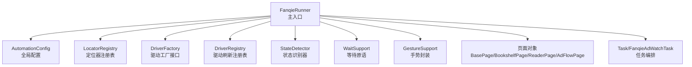
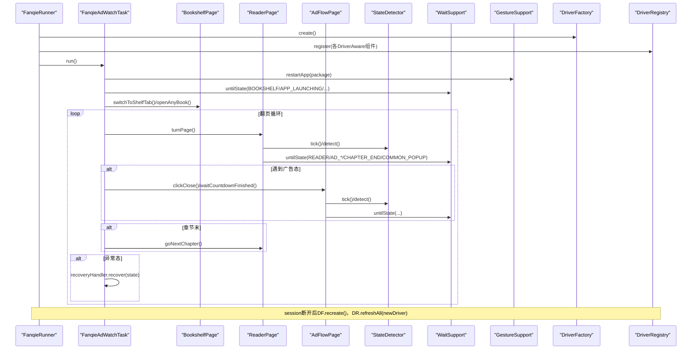
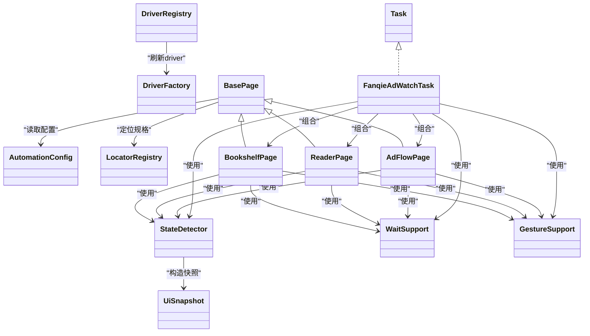

# Java API参考

<cite>
**本文引用的文件**
- [FanqieRunner.java](file://automation/src/main/java/com/fanqie\auto/FanqieRunner.java)
- [AutomationConfig.java](file://automation/src/main/java/com/fanqie/auto/config/AutomationConfig.java)
- [LocatorRegistry.java](file://automation/src/main/java/com/fanqie/auto/config/LocatorRegistry.java)
- [DriverFactory.java](file://automation/src/main/java/com/fanqie/auto/core/DriverFactory.java)
- [DriverRegistry.java](file://automation/src/main/java/com/fanqie/auto/core/DriverRegistry.java)
- [GestureSupport.java](file://automation/src/main/java/com/fanqie/auto/core/GestureSupport.java)
- [WaitSupport.java](file://automation/src/main/java/com/fanqie/auto/core/WaitSupport.java)
- [StateDetector.java](file://automation/src/main/java/com/fanqie/auto/core/StateDetector.java)
- [UiSnapshot.java](file://automation/src/main/java/com/fanqie/auto/core/UiSnapshot.java)
- [BasePage.java](file://automation/src/main/java/com/fanqie/auto/page/BasePage.java)
- [BookshelfPage.java](file://automation/src/main/java/com/fanqie/auto/page/BookshelfPage.java)
- [ReaderPage.java](file://automation/src/main/java/com/fanqie/auto/page/ReaderPage.java)
- [AdFlowPage.java](file://automation/src/main/java/com/fanqie/auto/page/AdFlowPage.java)
- [Task.java](file://automation/src/main/java/com/fanqie/auto/task/Task.java)
- [FanqieAdWatchTask.java](file://automation/src/main/java/com/fanqie/auto/task/FanqieAdWatchTask.java)
</cite>

## 目录
1. [简介](#简介)
2. [项目结构](#项目结构)
3. [核心组件](#核心组件)
4. [架构总览](#架构总览)
5. [详细组件分析](#详细组件分析)
6. [依赖关系分析](#依赖关系分析)
7. [性能考虑](#性能考虑)
8. [故障排查指南](#故障排查指南)
9. [结论](#结论)
10. [附录：公共API速查](#附录公共api速查)

## 简介
本参考文档面向开发者，系统化梳理该自动化项目的Java公共API与核心类职责，覆盖类结构、方法签名、参数说明、返回值、异常处理、线程安全与性能特性。通过分层抽象（配置、定位器、驱动工厂、状态检测、等待原语、手势封装、页面对象、任务编排），实现“动态解析UI树、不写死坐标”的稳健自动化方案，并内置四级降级点击链与多轮恢复机制，保障在复杂App UI变化下的稳定性。

## 项目结构
- 配置层：全局配置加载与类型化访问；定位器注册表集中管理控件定位策略与候选文案。
- 核心层：驱动工厂接口与实现、驱动刷新注册表、状态识别器、等待原语、手势封装、快照与节点模型。
- 页面层：书架、阅读、广告流程等页面对象，封装具体业务交互。
- 任务层：统一任务接口与当前番茄小说广告观看任务编排。
- 入口：唯一main入口负责装配、启动、优雅退出与命令行参数解析。

**图示来源**
- [FanqieRunner.java:41-238](file://automation/src/main/java/com/fanqie/auto/FanqieRunner.java#L41-L238)
- [AutomationConfig.java:18-305](file://automation/src/main/java/com/fanqie/auto/config/AutomationConfig.java#L18-L305)
- [LocatorRegistry.java:26-299](file://automation/src/main/java/com/fanqie/auto/config/LocatorRegistry.java#L26-L299)
- [DriverFactory.java:17-54](file://automation/src/main/java/com/fanqie/auto/core/DriverFactory.java#L17-L54)
- [DriverRegistry.java:19-56](file://automation/src/main/java/com/fanqie/auto/core/DriverRegistry.java#L19-L56)
- [StateDetector.java:29-170](file://automation/src/main/java/com/fanqie/auto/core/StateDetector.java#L29-L170)
- [WaitSupport.java:26-233](file://automation/src/main/java/com/fanqie/auto/core/WaitSupport.java#L26-L233)
- [GestureSupport.java:26-227](file://automation/src/main/java/com/fanqie/auto/core/GestureSupport.java#L26-L227)
- [BasePage.java:40-515](file://automation/src/main/java/com/fanqie/auto/page/BasePage.java#L40-L515)
- [Task.java:12-25](file://automation/src/main/java/com/fanqie/auto/task/Task.java#L12-L25)
- [FanqieAdWatchTask.java:42-314](file://automation/src/main/java/com/fanqie/auto/task/FanqieAdWatchTask.java#L42-L314)

**章节来源**
- [FanqieRunner.java:41-238](file://automation/src/main/java/com/fanqie/auto/FanqieRunner.java#L41-L238)

## 核心组件
- 配置与定位器
  - AutomationConfig：从classpath或外部properties加载配置，提供类型化getter（字符串、整数、长整型、浮点、布尔）与业务域配置（Appium、时序、流程、阅读翻页策略、验证调试）。
  - LocatorRegistry：集中管理逻辑控件的定位规格（primaryBy + fallbackBys + boundsHint + allowGeometryFallback），并提供候选文案列表与正则（如奖励提取、短剧过滤、阅读进度等）。
- 驱动与刷新
  - DriverFactory：定义创建/重建/健康检查/关闭/获取driver的接口，预留鸿蒙HDC路线扩展点。
  - DriverRegistry：统一管理实现了DriverAware接口的组件，支持一次性刷新driver引用，内部使用CopyOnWriteArrayList保证并发安全。
- 状态识别与等待
  - StateDetector：基于一次getPageSource构造UiSnapshot，纯内存多级匹配（resource-id → text → content-desc → APP_LAUNCHING → 几何特征 → UNKNOWN），并缓存屏幕尺寸与快照。
  - WaitSupport：统一显式等待原语（untilState/untilStateGone/untilAnyTextPresent/untilSnapshotMatches/runWithRetry），避免散落sleep。
- 手势与快照
  - GestureSupport：所有坐标按屏幕比例计算，封装tap/swipe/activate/terminate/restart等动作，使用mobile命令提升稳定性。
  - UiSnapshot：安全解析XML（防御XXE），构建不可变节点列表，提供纯内存查询API（text/desc/id/区域可点击/正则提取/最近可点击祖先）。
- 页面对象
  - BasePage：实现四级降级点击链（L1语义→L2几何→L3时序→L4系统），含boundsHint裁决与误点防护开关。
  - BookshelfPage：切换书架Tab、动态选书（排除短剧/视频）、换书轮换。
  - ReaderPage：翻页、下一章跳转、底部广告入口检测与点击。
  - AdFlowPage：广告流程高风险区，严格限制几何兜底范围（仅关闭按钮允许激进兜底），提供倒计时等待与奖励分钟数提取。
- 任务编排
  - Task：统一任务接口（run/getName）。
  - FanqieAdWatchTask：完整业务流程编排（启动→导航书架→打开书籍→翻页循环→广告子循环→章节末→恢复→统计收尾），含墙钟熔断、每日配额熔断、多本书轮换。

**章节来源**
- [AutomationConfig.java:18-305](file://automation/src/main/java/com/fanqie/auto/config/AutomationConfig.java#L18-L305)
- [LocatorRegistry.java:26-299](file://automation/src/main/java/com/fanqie/auto/config/LocatorRegistry.java#L26-L299)
- [DriverFactory.java:17-54](file://automation/src/main/java/com/fanqie/auto/core/DriverFactory.java#L17-L54)
- [DriverRegistry.java:19-56](file://automation/src/main/java/com/fanqie/auto/core/DriverRegistry.java#L19-L56)
- [StateDetector.java:29-170](file://automation/src/main/java/com/fanqie/auto/core/StateDetector.java#L29-L170)
- [WaitSupport.java:26-233](file://automation/src/main/java/com/fanqie/auto/core/WaitSupport.java#L26-L233)
- [GestureSupport.java:26-227](file://automation/src/main/java/com/fanqie/auto/core/GestureSupport.java#L26-L227)
- [UiSnapshot.java:21-284](file://automation/src/main/java/com/fanqie/auto/core/UiSnapshot.java#L21-L284)
- [BasePage.java:40-515](file://automation/src/main/java/com/fanqie/auto/page/BasePage.java#L40-L515)
- [BookshelfPage.java:23-513](file://automation/src/main/java/com/fanqie/auto/page/BookshelfPage.java#L23-L513)
- [ReaderPage.java:19-271](file://automation/src/main/java/com/fanqie/auto/page/ReaderPage.java#L19-L271)
- [AdFlowPage.java:21-430](file://automation/src/main/java/com/fanqie/auto/page/AdFlowPage.java#L21-L430)
- [Task.java:12-25](file://automation/src/main/java/com/fanqie/auto/task/Task.java#L12-L25)
- [FanqieAdWatchTask.java:20-314](file://automation/src/main/java/com/fanqie/auto/task/FanqieAdWatchTask.java#L20-L314)

## 架构总览
下图展示运行时关键交互：Runner装配各组件，Task编排流程，页面对象调用底层能力（状态检测、等待、手势），并通过DriverRegistry在session重建时刷新driver引用。

**图示来源**
- [FanqieRunner.java:127-238](file://automation/src/main/java/com/fanqie/auto/FanqieRunner.java#L127-L238)
- [FanqieAdWatchTask.java:99-314](file://automation/src/main/java/com/fanqie/auto/task/FanqieAdWatchTask.java#L99-L314)
- [ReaderPage.java:69-96](file://automation/src/main/java/com/fanqie/auto/page/ReaderPage.java#L69-L96)
- [AdFlowPage.java:116-262](file://automation/src/main/java/com/fanqie/auto/page/AdFlowPage.java#L116-L262)
- [StateDetector.java:97-170](file://automation/src/main/java/com/fanqie/auto/core/StateDetector.java#L97-L170)
- [WaitSupport.java:56-119](file://automation/src/main/java/com/fanqie/auto/core/WaitSupport.java#L56-L119)
- [DriverRegistry.java:43-55](file://automation/src/main/java/com/fanqie/auto/core/DriverRegistry.java#L43-L55)

## 详细组件分析

### 配置与定位器
- AutomationConfig
  - 作用：集中管理超时、轮次、阈值、Appium参数、流程控制、阅读翻页策略、验证调试开关。
  - 关键方法：getString/getInt/getLong/getDouble/getBoolean；appium.*、timing.*、flow.*、reader.*、verify.*、runtime.*等域getter。
  - 异常与健壮性：非法数值返回默认值并告警；外部配置文件加载失败不影响运行。
- LocatorRegistry
  - 作用：维护每个逻辑控件的LocatorSpec（primaryBy、fallbackBys、boundsHint、allowGeometryFallback），以及各类候选文案与正则。
  - 关键方法：getCandidates、各域文本/正则getter、getShelfTab/getAdEntry/getAdWatch/getAdClose/getAdContinue/getChapterNext/getCommonDismiss。
  - 设计要点：ad.watch/ad.continue禁止几何兜底防误点浪费配额；ad.close允许几何兜底以尽快退出广告。

**章节来源**
- [AutomationConfig.java:67-305](file://automation/src/main/java/com/fanqie/auto/config/AutomationConfig.java#L67-L305)
- [LocatorRegistry.java:95-299](file://automation/src/main/java/com/fanqie/auto/config/LocatorRegistry.java#L95-L299)

### 驱动与刷新
- DriverFactory
  - 接口方法：create()/recreate()/healthCheck()/quit()/getDriver()。
  - 线程安全：healthCheck用于心跳探测；quit幂等。
- DriverRegistry
  - 作用：集中刷新所有DriverAware组件的driver引用，避免旧session导致的NoSuchSessionException。
  - 线程安全：内部使用CopyOnWriteArrayList，遍历刷新时单个组件异常不影响其他组件。

**章节来源**
- [DriverFactory.java:17-54](file://automation/src/main/java/com/fanqie/auto/core/DriverFactory.java#L17-L54)
- [DriverRegistry.java:19-56](file://automation/src/main/java/com/fanqie/auto/core/DriverRegistry.java#L19-L56)

### 状态识别与等待
- StateDetector
  - 作用：高性能状态识别，tick只做一次getPageSource并缓存快照；detect纯内存多级匹配。
  - 关键方法：tick()/detect()/setLogger()/getLastPageSourceMs()/getCachedSnapshot()。
  - 性能：避免逐状态RPC；屏幕尺寸缓存与自愈（横屏/折叠屏旋转后自动重取）。
- WaitSupport
  - 作用：统一显式等待原语，支持多目标状态一次等待、状态消失等待、任意文案出现等待、自定义条件等待、指数退避重试。
  - 关键方法：untilState()/untilStateGone()/untilAnyTextPresent()/untilSnapshotMatches()/runWithRetry()。
  - 异常：超时抛出TimeoutException；重试失败抛RuntimeException。

**章节来源**
- [StateDetector.java:29-170](file://automation/src/main/java/com/fanqie/auto/core/StateDetector.java#L29-L170)
- [WaitSupport.java:26-233](file://automation/src/main/java/com/fanqie/auto/core/WaitSupport.java#L26-L233)

### 手势与快照
- GestureSupport
  - 作用：所有坐标按屏幕比例计算，封装tapAtRatio/tapAtPixel/swipe系列、activate/terminate/restart等。
  - 关键方法：turnPageNext()/turnPagePrev()/tapAtRatio()/tapAtPixel()/swipeUp()/swipeDown()/swipeLeft()/swipeRight()/activateApp()/terminateApp()/restartApp()。
  - 性能：屏幕尺寸缓存减少RPC；使用mobile命令更稳定。
- UiSnapshot
  - 作用：安全解析XML（防御XXE），构建不可变节点列表，提供纯内存查询API。
  - 关键方法：findByTextContains()/findByContentDescContains()/findByResourceId()/findClickableInRegion()/extractByRegex()/nearestClickableAncestor()。
  - 安全：DocumentBuilderFactory每次新建实例；解析失败返回空快照并标记parseFailed。

**章节来源**
- [GestureSupport.java:26-227](file://automation/src/main/java/com/fanqie/auto/core/GestureSupport.java#L26-L227)
- [UiSnapshot.java:21-284](file://automation/src/main/java/com/fanqie/auto/core/UiSnapshot.java#L21-L284)

### 页面对象
- BasePage
  - 作用：四级降级点击链（L1语义→L2几何→L3时序→L4系统），含boundsHint裁决与误点防护。
  - 关键方法：clickBySpec()/resolve()/resolveByGeometry()/clickByTimeoutFallback()/systemBack()/systemRestartApp()。
  - 误点防护：ad.watch/ad.continue禁止几何兜底；ad.close允许几何兜底。
- BookshelfPage
  - 作用：切换书架Tab、动态选书（排除短剧/视频）、换书轮换（排除已用书籍）。
  - 关键方法：switchToShelfTab()/openAnyBook()/openNextBook()/getLastOpenedBookId()。
- ReaderPage
  - 作用：翻页、下一章跳转、底部广告入口检测与点击。
  - 关键方法：turnPage()/turnPagePrev()/goNextChapter()/hasBottomRewardEntry()/clickBottomRewardEntry()。
- AdFlowPage
  - 作用：广告流程高风险区，严格限制几何兜底范围（仅关闭按钮允许激进兜底），提供倒计时等待与奖励分钟数提取。
  - 关键方法：clickWatchAd()/waitCountdownFinished()/clickClose()/clickContinueGetFreeTime()/readGainedMinutes()/clickDismissContinuePrompt()。

**章节来源**
- [BasePage.java:40-515](file://automation/src/main/java/com/fanqie/auto/page/BasePage.java#L40-L515)
- [BookshelfPage.java:23-513](file://automation/src/main/java/com/fanqie/auto/page/BookshelfPage.java#L23-L513)
- [ReaderPage.java:19-271](file://automation/src/main/java/com/fanqie/auto/page/ReaderPage.java#L19-L271)
- [AdFlowPage.java:21-430](file://automation/src/main/java/com/fanqie/auto/page/AdFlowPage.java#L21-L430)

### 任务编排
- Task
  - 接口：run()/getName()。
- FanqieAdWatchTask
  - 作用：完整业务流程编排（启动→导航书架→打开书籍→翻页循环→广告子循环→章节末→恢复→统计收尾），含墙钟熔断、每日配额熔断、多本书轮换。
  - 关键方法：run()/launchAndNavigateToShelf()/ensureBackToReader()/rotateBookIfNeeded()/navigateBackToShelf()。
  - 异常与恢复：遇到异常状态交由RecoveryHandler恢复；多次失败终止任务。

**章节来源**
- [Task.java:12-25](file://automation/src/main/java/com/fanqie/auto/task/Task.java#L12-L25)
- [FanqieAdWatchTask.java:20-314](file://automation/src/main/java/com/fanqie/auto/task/FanqieAdWatchTask.java#L20-L314)

## 依赖关系分析
- 耦合与内聚
  - 配置与定位器低耦合，被各层广泛读取。
  - 核心层（DriverFactory/DriverRegistry/StateDetector/WaitSupport/GestureSupport/UiSnapshot）高内聚，为页面对象与任务提供稳定能力。
  - 页面对象组合核心能力完成具体业务交互。
  - 任务编排聚合页面对象与核心能力，协调流程。
- 直接/间接依赖
  - FanqieRunner依赖所有核心与页面组件进行装配。
  - 页面对象依赖StateDetector/WaitSupport/GestureSupport/LocatorRegistry/AutomationConfig。
  - 任务依赖页面对象与状态机（AdWatchStateMachine，虽未在本节详述但由Runner装配）。
- 外部集成点
  - AppiumDriver（通过DriverFactory/DriverRegistry注入）。
  - 设备端mobile命令（GestureSupport.executeScript）。
- 循环依赖规避
  - 通过延迟注入（如RecoveryHandler.setBookshelfPage）避免构造期循环依赖。

**图示来源**
- [BasePage.java:40-515](file://automation/src/main/java/com/fanqie/auto/page/BasePage.java#L40-L515)
- [BookshelfPage.java:23-513](file://automation/src/main/java/com/fanqie/auto/page/BookshelfPage.java#L23-L513)
- [ReaderPage.java:19-271](file://automation/src/main/java/com/fanqie/auto/page/ReaderPage.java#L19-L271)
- [AdFlowPage.java:21-430](file://automation/src/main/java/com/fanqie/auto/page/AdFlowPage.java#L21-L430)
- [FanqieAdWatchTask.java:42-314](file://automation/src/main/java/com/fanqie/auto/task/FanqieAdWatchTask.java#L42-L314)
- [DriverRegistry.java:19-56](file://automation/src/main/java/com/fanqie/auto/core/DriverRegistry.java#L19-L56)
- [StateDetector.java:29-170](file://automation/src/main/java/com/fanqie/auto/core/StateDetector.java#L29-L170)
- [UiSnapshot.java:21-284](file://automation/src/main/java/com/fanqie/auto/core/UiSnapshot.java#L21-L284)
- [LocatorRegistry.java:26-299](file://automation/src/main/java/com/fanqie/auto/config/LocatorRegistry.java#L26-L299)
- [AutomationConfig.java:18-305](file://automation/src/main/java/com/fanqie/auto/config/AutomationConfig.java#L18-L305)

**章节来源**
- [FanqieRunner.java:147-201](file://automation/src/main/java/com/fanqie/auto/FanqieRunner.java#L147-L201)

## 性能考虑
- 状态识别性能
  - StateDetector.tick()仅一次getPageSource，同一tick内缓存复用，避免重复抓取。
  - detect()纯内存多级匹配，杜绝O(状态数)次RPC。
  - 屏幕尺寸缓存与自愈，避免横屏/折叠屏旋转导致比例判定失真。
- 等待与重试
  - WaitSupport统一显式等待，避免散落sleep；runWithRetry采用指数退避降低瞬时压力。
- 手势操作
  - GestureSupport使用mobile命令（设备端单次执行）比W3C多点注入更稳；屏幕尺寸缓存减少getSize RPC。
- 资源与开销
  - UiSnapshot解析XML防御XXE，解析失败不抛异常，返回空快照；截图验证默认关闭以减少累积开销。
- 任务级保护
  - FanqieAdWatchTask支持墙钟时间预算熔断与每日配额熔断，防止无限期占用设备。

[本节为通用性能指导，无需特定文件来源]

## 故障排查指南
- 环境自检失败
  - 现象：EnvDoctor.checkAll()返回false，Runner以非零码退出。
  - 处理：根据提示修复设备设置（USB调试、监控ADB安装应用、充电白名单等）。
- 会话断开/NoSuchSessionException
  - 现象：driver操作抛出会话异常。
  - 处理：DriverFactory.recreate()重建会话，DriverRegistry.refreshAll(newDriver)刷新所有组件引用。
- 广告关闭失败
  - 现象：无法点击关闭按钮导致卡死。
  - 处理：AdFlowPage.clickClose()启用L1→L2→L3→L4全链路；必要时systemRestartApp重启App。
- 翻页无效/状态未变化
  - 现象：翻页后仍停留在书架或阅读器菜单。
  - 处理：ReaderPage.turnPage()一次等待多目标状态；若超时再主动tick+detect确认；必要时触发恢复。
- 选书误入短剧/视频页
  - 现象：打开条目后进入竖屏播放页而非阅读器。
  - 处理：BookshelfPage.findBookItem()与FanqieAdWatchTask.isVideoPage()结合短剧正则过滤；回首页重新切换书架Tab换书。
- 奖励分钟数高估
  - 现象：将“剩余N分钟”误计为本次奖励。
  - 处理：AdFlowPage.readGainedMinutes()仅认带奖励语义的文案；无命中返回0交由兜底估值。

**章节来源**
- [FanqieRunner.java:101-114](file://automation/src/main/java/com/fanqie/auto/FanqieRunner.java#L101-L114)
- [AdFlowPage.java:180-262](file://automation/src/main/java/com/fanqie/auto/page/AdFlowPage.java#L180-L262)
- [ReaderPage.java:69-96](file://automation/src/main/java/com/fanqie/auto/page/ReaderPage.java#L69-L96)
- [BookshelfPage.java:339-431](file://automation/src/main/java/com/fanqie/auto/page/BookshelfPage.java#L339-L431)
- [FanqieAdWatchTask.java:404-421](file://automation/src/main/java/com/fanqie/auto/task/FanqieAdWatchTask.java#L404-L421)
- [AdFlowPage.java:317-363](file://automation/src/main/java/com/fanqie/auto/page/AdFlowPage.java#L317-L363)

## 结论
本项目通过分层抽象与四级降级点击链，构建了高鲁棒性的UI自动化框架。配置与定位器解耦业务规则，核心层提供高性能状态识别与等待原语，页面对象聚焦具体交互，任务编排串联全流程并内置多重熔断与恢复机制。建议在扩展新App或新任务时，优先复用核心能力，按需新增页面对象与任务实现，保持上层零感知变更。

[本节为总结性内容，无需特定文件来源]

## 附录：公共API速查
- 配置与定位器
  - AutomationConfig：getString/getInt/getLong/getDouble/getBoolean；appium.*、timing.*、flow.*、reader.*、verify.*、runtime.*等getter。
  - LocatorRegistry：getCandidates；shelfTabTexts/bookItemIds/readerProgressRegex/bookShortDramaRegex/bookNovelRegex；adEntryTexts/adWatchTexts/adCloseTexts/adCloseDescs/adContinueTexts/chapterNextTexts/commonDismissTexts/readerMenuTexts/splashSkipTexts/dailyQuotaExhaustedTexts；getShelfTab/getAdEntry/getAdWatch/getAdClose/getAdContinue/getChapterNext/getCommonDismiss。
- 驱动与刷新
  - DriverFactory：create()/recreate()/healthCheck()/quit()/getDriver()。
  - DriverRegistry：register(aware)/refreshAll(newDriver)。
- 状态识别与等待
  - StateDetector：tick()/detect()/setLogger(logger)/getLastPageSourceMs()/getCachedSnapshot()。
  - WaitSupport：untilState(targets)/untilState(timeoutMs, targets)/untilStateGone(state)/untilAnyTextPresent(candidates)/untilAnyTextPresent(candidates, timeoutMs)/untilSnapshotMatches(predicate)/untilSnapshotMatches(predicate, timeoutMs)/runWithRetry(supplier, maxAttempts, backoffMs)/runWithRetry(action, maxAttempts, backoffMs)。
- 手势与快照
  - GestureSupport：turnPageNext()/turnPagePrev()/tapAtRatio(x,y)/tapAtPixel(x,y)/swipeUp()/swipeDown()/swipeLeft()/swipeRight()/activateApp(package)/terminateApp(package)/restartApp(package)。
  - UiSnapshot：findByTextContains(candidates)/findByContentDescContains(candidates)/findByResourceId(id, exact)/findClickableInRegion(xMin,xMax,yMin,yMax,maxAreaRatio)/extractByRegex(regex)/nearestClickableAncestor(node)/nodes()/size()/rawXml()/parseElapsedMs()/xmlLength()/isParseFailed()/getScreenWidth()/getScreenHeight()。
- 页面对象
  - BasePage：clickBySpec(spec, snapshot)/resolve(spec, snapshot)/resolveByGeometry(spec, snapshot)/clickByTimeoutFallback(spec, snapshot, elapsedMs)/systemBack()/systemRestartApp()/clickByTextCandidates(candidates, snapshot)/clickByContentDescCandidates(candidates, snapshot)/clickByResourceId(id, exact, snapshot)/heartbeat(tag)。
  - BookshelfPage：switchToShelfTab()/openAnyBook()/openNextBook(excludeIds)/getLastOpenedBookId()。
  - ReaderPage：turnPage()/turnPagePrev()/goNextChapter()/hasBottomRewardEntry(snapshot)/clickBottomRewardEntry()。
  - AdFlowPage：clickWatchAd()/waitCountdownFinished()/clickClose()/clickContinueGetFreeTime()/readGainedMinutes(snapshot)/clickDismissContinuePrompt()。
- 任务编排
  - Task：run()/getName()。
  - FanqieAdWatchTask：run()/setCyclesOverride(cycles)/setPagesOverride(pages)/getName()。

**章节来源**
- [AutomationConfig.java:67-305](file://automation/src/main/java/com/fanqie/auto/config/AutomationConfig.java#L67-L305)
- [LocatorRegistry.java:95-299](file://automation/src/main/java/com/fanqie/auto/config/LocatorRegistry.java#L95-L299)
- [DriverFactory.java:17-54](file://automation/src/main/java/com/fanqie/auto/core/DriverFactory.java#L17-L54)
- [DriverRegistry.java:19-56](file://automation/src/main/java/com/fanqie/auto/core/DriverRegistry.java#L19-L56)
- [StateDetector.java:29-170](file://automation/src/main/java/com/fanqie/auto/core/StateDetector.java#L29-L170)
- [WaitSupport.java:26-233](file://automation/src/main/java/com/fanqie/auto/core/WaitSupport.java#L26-L233)
- [GestureSupport.java:26-227](file://automation/src/main/java/com/fanqie/auto/core/GestureSupport.java#L26-L227)
- [UiSnapshot.java:21-284](file://automation/src/main/java/com/fanqie/auto/core/UiSnapshot.java#L21-L284)
- [BasePage.java:40-515](file://automation/src/main/java/com/fanqie/auto/page/BasePage.java#L40-L515)
- [BookshelfPage.java:23-513](file://automation/src/main/java/com/fanqie/auto/page/BookshelfPage.java#L23-L513)
- [ReaderPage.java:19-271](file://automation/src/main/java/com/fanqie/auto/page/ReaderPage.java#L19-L271)
- [AdFlowPage.java:21-430](file://automation/src/main/java/com/fanqie/auto/page/AdFlowPage.java#L21-L430)
- [Task.java:12-25](file://automation/src/main/java/com/fanqie/auto/task/Task.java#L12-L25)
- [FanqieAdWatchTask.java:42-314](file://automation/src/main/java/com/fanqie/auto/task/FanqieAdWatchTask.java#L42-L314)