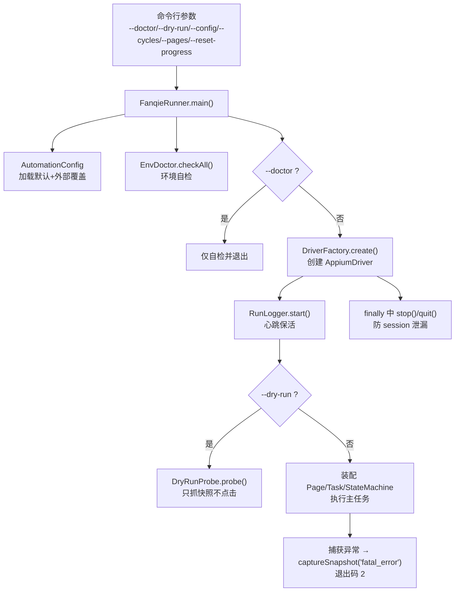
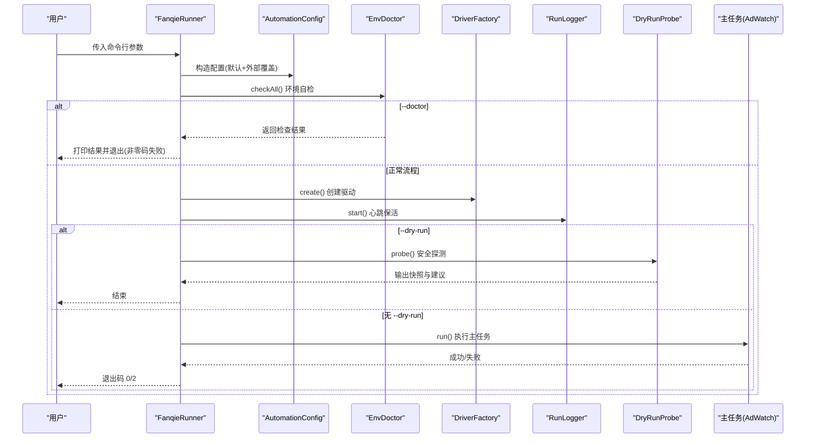
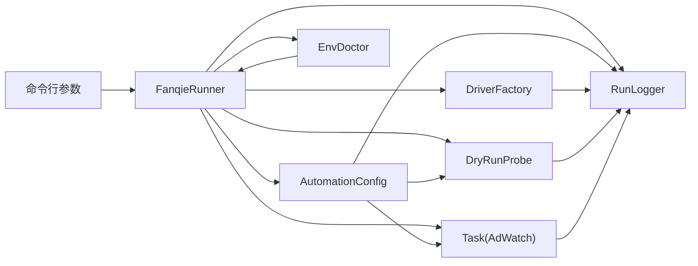
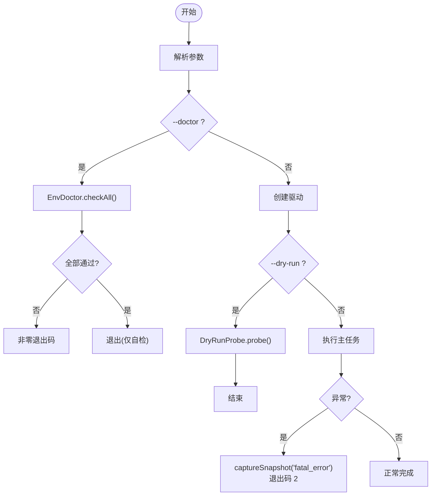

# 命令行接口

<cite>
**本文引用的文件**
- [FanqieRunner.java](file://automation/src/main/java/com/fanqie/auto/FanqieRunner.java)
- [AutomationConfig.java](file://automation/src/main/java/com/fanqie/auto/config/AutomationConfig.java)
- [DryRunProbe.java](file://automation/src/main/java/com/fanqie/auto/DryRunProbe.java)
- [EnvDoctor.java](file://automation/src/main/java/com/fanqie/auto/core/EnvDoctor.java)
- [RecoveryHandler.java](file://automation/src/main/java/com/fanqie/auto/task/RecoveryHandler.java)
- [RunLogger.java](file://automation/src/main/java/com/fanqie/auto/core/RunLogger.java)
- [automation.properties](file://automation/src/main/resources/automation.properties)
</cite>

## 目录
1. [简介](#简介)
2. [项目结构](#项目结构)
3. [核心组件](#核心组件)
4. [架构总览](#架构总览)
5. [详细参数说明](#详细参数说明)
6. [依赖关系分析](#依赖关系分析)
7. [性能与行为特征](#性能与行为特征)
8. [故障诊断与错误处理](#故障诊断与错误处理)
9. [结论](#结论)
10. [附录：常用命令组合](#附录：常用命令组合)

## 简介
本章节面向使用 FanqieRunner 的用户，提供完整、可执行的命令行接口文档。内容覆盖 --doctor、--dry-run、--config、--cycles、--pages、--reset-progress 等参数的格式、默认值、作用机制、使用示例与注意事项，并给出常见组合模式与排错方法。所有说明均基于代码实现与配置加载逻辑整理而成。

## 项目结构
FanqieRunner 是唯一的 main() 入口，负责解析命令行参数、装配配置与环境自检、创建驱动与日志、执行主任务或安全探测（dry-run），并在异常时进行快照落盘与优雅退出。配置文件通过 AutomationConfig 统一加载，支持从 classpath 默认文件与外部路径叠加覆盖。

图表来源
- [FanqieRunner.java:41-239](file://automation/src/main/java/com/fanqie/auto/FanqieRunner.java#L41-L239)
- [AutomationConfig.java:25-42](file://automation/src/main/java/com/fanqie/auto/config/AutomationConfig.java#L25-L42)
- [EnvDoctor.java:48-71](file://automation/src/main/java/com/fanqie/auto/core/EnvDoctor.java#L48-L71)
- [DryRunProbe.java:91-197](file://automation/src/main/java/com/fanqie/auto/DryRunProbe.java#L91-L197)
- [RunLogger.java:191-247](file://automation/src/main/java/com/fanqie/auto/core/RunLogger.java#L191-L247)

章节来源
- [FanqieRunner.java:25-36](file://automation/src/main/java/com/fanqie/auto/FanqieRunner.java#L25-L36)
- [AutomationConfig.java:10-17](file://automation/src/main/java/com/fanqie/auto/config/AutomationConfig.java#L10-L17)

## 核心组件
- 命令行解析与流程控制：FanqieRunner.main()
- 配置加载与覆盖：AutomationConfig（默认 properties + 外部覆盖）
- 环境自检：EnvDoctor（adb/Appium/设备/应用安装检查）
- 安全探测：DryRunProbe（只连接、启动、抓取 UI 快照，不点击广告/领取按钮）
- 运行期日志与保活：RunLogger（心跳、状态转移、截图/快照落盘）
- 恢复与自愈：RecoveryHandler（多级恢复策略，失败后保留现场）

章节来源
- [FanqieRunner.java:41-239](file://automation/src/main/java/com/fanqie/auto/FanqieRunner.java#L41-L239)
- [AutomationConfig.java:25-42](file://automation/src/main/java/com/fanqie/auto/config/AutomationConfig.java#L25-L42)
- [EnvDoctor.java:48-71](file://automation/src/main/java/com/fanqie/auto/core/EnvDoctor.java#L48-L71)
- [DryRunProbe.java:26-40](file://automation/src/main/java/com/fanqie/auto/DryRunProbe.java#L26-L40)
- [RunLogger.java:191-247](file://automation/src/main/java/com/fanqie/auto/core/RunLogger.java#L191-L247)
- [RecoveryHandler.java:32-43](file://automation/src/main/java/com/fanqie/auto/task/RecoveryHandler.java#L32-L43)

## 架构总览
下图展示命令行参数如何影响运行流程，以及各组件之间的协作关系。

图表来源
- [FanqieRunner.java:41-239](file://automation/src/main/java/com/fanqie/auto/FanqieRunner.java#L41-L239)
- [AutomationConfig.java:25-42](file://automation/src/main/java/com/fanqie/auto/config/AutomationConfig.java#L25-L42)
- [EnvDoctor.java:48-71](file://automation/src/main/java/com/fanqie/auto/core/EnvDoctor.java#L48-L71)
- [DryRunProbe.java:91-197](file://automation/src/main/java/com/fanqie/auto/DryRunProbe.java#L91-L197)

## 详细参数说明

### --doctor
- 作用：仅运行环境自检（ADB、Appium Server、设备在线、应用安装等），不创建 Appium session，不执行任何自动化操作。
- 格式：--doctor（布尔开关）
- 默认值：false
- 行为要点：
  - 会调用 EnvDoctor.checkAll() 并打印检查结果；若任一硬性检查失败，将以非零退出码退出。
  - 在 --doctor 模式下不会进入后续 Driver 创建与任务执行流程。
- 使用示例：
  - java -cp ... com.fanqie.auto.FanqieRunner --doctor
- 注意事项：
  - 适合在部署前快速验证运行环境是否就绪。
  - 若自检失败，请根据输出指引逐项修复后再重试。

章节来源
- [FanqieRunner.java:58-60](file://automation/src/main/java/com/fanqie/auto/FanqieRunner.java#L58-L60)
- [FanqieRunner.java:101-114](file://automation/src/main/java/com/fanqie/auto/FanqieRunner.java#L101-L114)
- [EnvDoctor.java:48-71](file://automation/src/main/java/com/fanqie/auto/core/EnvDoctor.java#L48-L71)

### --dry-run
- 作用：安全探测模式。仅连接 Appium、启动 App、在书架页与阅读页抓取 UI 快照并输出统计与建议，不执行任何点击（尤其不会点击广告/观看视频/领取时长）。
- 格式：--dry-run（布尔开关）
- 默认值：false（也可通过配置 runtime.dry.run 开启）
- 行为要点：
  - 会跳过主任务执行，直接委托 DryRunProbe.probe() 完成安全探测。
  - 输出包含节点属性统计、关键词节点列表、结论建议，并将 XML 快照保存到 logs/snapshots/。
- 使用示例：
  - java -cp ... com.fanqie.auto.FanqieRunner --dry-run
- 注意事项：
  - 用于调试定位器与页面结构，避免消耗真实每日配额。
  - 若需要同时指定外部配置，可与 --config 配合使用。

章节来源
- [FanqieRunner.java:61-63](file://automation/src/main/java/com/fanqie/auto/FanqieRunner.java#L61-L63)
- [FanqieRunner.java:162-171](file://automation/src/main/java/com/fanqie/auto/FanqieRunner.java#L162-L171)
- [DryRunProbe.java:26-40](file://automation/src/main/java/com/fanqie/auto/DryRunProbe.java#L26-L40)
- [DryRunProbe.java:91-197](file://automation/src/main/java/com/fanqie/auto/DryRunProbe.java#L91-L197)
- [AutomationConfig.java:295-297](file://automation/src/main/java/com/fanqie/auto/config/AutomationConfig.java#L295-L297)

### --config <path>
- 作用：使用外部 properties 文件覆盖默认配置值。适用于在不重新编译的情况下调整超时、轮次、翻页策略等。
- 格式：--config <绝对或相对路径>
- 默认值：未提供时使用 classpath 中的 automation.properties；缺失项回退到内置默认值。
- 行为要点：
  - 先加载 classpath 默认配置作为兜底，再用外部文件覆盖。
  - 非法数值将记录警告并使用默认值。
- 使用示例：
  - java -cp ... com.fanqie.auto.FanqieRunner --config ./my-config.properties
- 注意事项：
  - 确保外部文件编码为 UTF-8，避免中文乱码。
  - 可通过该参数覆盖 timing.*、flow.*、reader.*、runtime.* 等键。

章节来源
- [FanqieRunner.java:67-69](file://automation/src/main/java/com/fanqie/auto/FanqieRunner.java#L67-L69)
- [AutomationConfig.java:30-42](file://automation/src/main/java/com/fanqie/auto/config/AutomationConfig.java#L30-L42)
- [AutomationConfig.java:44-63](file://automation/src/main/java/com/fanqie/auto/config/AutomationConfig.java#L44-L63)
- [AutomationConfig.java:67-108](file://automation/src/main/java/com/fanqie/auto/config/AutomationConfig.java#L67-L108)

### --cycles <N>
- 作用：覆盖 flow.outer.cycles，即外层循环次数（例如多轮任务）。
- 格式：--cycles <整数>
- 默认值：取自配置 flow.outer.cycles（默认值为 2）
- 行为要点：
  - 仅在提供合法整数值时生效；非法值会在控制台提示并忽略。
  - 覆盖发生在任务装配完成后、执行前。
- 使用示例：
  - java -cp ... com.fanqie.auto.FanqieRunner --cycles 5
- 注意事项：
  - 结合 --pages 可同时控制每轮页数与总轮数。
  - 长时间运行建议配合墙钟熔断（flow.max.wall.clock.ms）以避免无限占用设备。

章节来源
- [FanqieRunner.java:70-75](file://automation/src/main/java/com/fanqie/auto/FanqieRunner.java#L70-L75)
- [FanqieRunner.java:203-205](file://automation/src/main/java/com/fanqie/auto/FanqieRunner.java#L203-L205)
- [AutomationConfig.java:250-252](file://automation/src/main/java/com/fanqie/auto/config/AutomationConfig.java#L250-L252)

### --pages <N>
- 作用：覆盖 flow.pages.per.cycle，即每轮处理的书籍页数。
- 格式：--pages <整数>
- 默认值：取自配置 flow.pages.per.cycle（默认值为 5）
- 行为要点：
  - 仅在提供合法整数值时生效；非法值会在控制台提示并忽略。
  - 覆盖发生在任务装配完成后、执行前。
- 使用示例：
  - java -cp ... com.fanqie.auto.FanqieRunner --pages 3
- 注意事项：
  - 与 --cycles 组合可灵活控制总工作量。
  - 阅读页翻页策略由 reader.turn.strategy 等配置决定。

章节来源
- [FanqieRunner.java:76-81](file://automation/src/main/java/com/fanqie/auto/FanqieRunner.java#L76-L81)
- [FanqieRunner.java:203-205](file://automation/src/main/java/com/fanqie/auto/FanqieRunner.java#L203-L205)
- [AutomationConfig.java:216-218](file://automation/src/main/java/com/fanqie/auto/config/AutomationConfig.java#L216-L218)

### --reset-progress
- 作用：清除 progress.properties 中的累计进度，从零开始新一轮任务。
- 格式：--reset-progress（布尔开关）
- 默认值：false
- 行为要点：
  - 在执行主任务前打印当前恢复的进度信息；若指定该参数，则调用 stateMachine.resetProgress() 清零。
- 使用示例：
  - java -cp ... com.fanqie.auto.FanqieRunner --reset-progress
- 注意事项：
  - 谨慎使用，会丢失已累积的免广告时长计数。
  - 常用于测试或重置长期运行的累计状态。

章节来源
- [FanqieRunner.java:64-66](file://automation/src/main/java/com/fanqie/auto/FanqieRunner.java#L64-L66)
- [FanqieRunner.java:207-214](file://automation/src/main/java/com/fanqie/auto/FanqieRunner.java#L207-L214)

## 依赖关系分析
命令行参数对系统的影响路径如下：
- --doctor：影响 EnvDoctor 的执行与退出码，不进入后续流程。
- --dry-run：影响 Runner 分支，直接走 DryRunProbe，跳过主任务。
- --config：影响 AutomationConfig 的值源，进而影响所有读取配置的组件（时序、流程、阅读策略等）。
- --cycles / --pages：在任务装配后覆盖 Task 的行为参数。
- --reset-progress：在任务执行前重置累计进度。

图表来源
- [FanqieRunner.java:41-239](file://automation/src/main/java/com/fanqie/auto/FanqieRunner.java#L41-L239)
- [AutomationConfig.java:25-42](file://automation/src/main/java/com/fanqie/auto/config/AutomationConfig.java#L25-L42)
- [EnvDoctor.java:48-71](file://automation/src/main/java/com/fanqie/auto/core/EnvDoctor.java#L48-L71)
- [DryRunProbe.java:91-197](file://automation/src/main/java/com/fanqie/auto/DryRunProbe.java#L91-L197)

章节来源
- [FanqieRunner.java:41-239](file://automation/src/main/java/com/fanqie/auto/FanqieRunner.java#L41-L239)

## 性能与行为特征
- 心跳保活：RunLogger 独立线程定期探活，避免长静默导致会话超时；内部吞异常，不影响主流程。
- 安全约束：--dry-run 严格限制无害操作，绝不点击广告/领取按钮，避免消耗真实配额。
- 超时保护：配置项 timing.* 与 flow.max.wall.clock.ms 提供多层超时与熔断保护，防止无限期运行。
- 资源释放：try-finally 与 ShutdownHook 保证 logger.stop() 与 driver.quit() 幂等执行，防止 session 泄漏。

章节来源
- [RunLogger.java:191-247](file://automation/src/main/java/com/fanqie/auto/core/RunLogger.java#L191-L247)
- [DryRunProbe.java:26-40](file://automation/src/main/java/com/fanqie/auto/DryRunProbe.java#L26-L40)
- [AutomationConfig.java:180-248](file://automation/src/main/java/com/fanqie/auto/config/AutomationConfig.java#L180-L248)
- [FanqieRunner.java:127-143](file://automation/src/main/java/com/fanqie/auto/FanqieRunner.java#L127-L143)
- [FanqieRunner.java:232-238](file://automation/src/main/java/com/fanqie/auto/FanqieRunner.java#L232-L238)

## 故障诊断与错误处理
- 环境自检失败：--doctor 或正常流程中 EnvDoctor.checkAll() 任一硬性检查失败将导致非零退出码；请根据输出指引逐项修复（如 adb 不可用、设备离线、Appium 未启动、应用未安装等）。
- 未知参数：遇到未识别参数会打印用法并退出。
- 参数类型错误：--cycles 与 --pages 接收非整数时会提示并忽略该覆盖。
- 运行异常：主流程捕获异常后记录错误、截取快照（fatal_error）、以退出码 2 退出。
- 恢复失败：当多级恢复手段全部失败，RecoveryHandler 会记录错误、保存现场快照并标记会话死亡，随后退出。

图表来源
- [FanqieRunner.java:56-87](file://automation/src/main/java/com/fanqie/auto/FanqieRunner.java#L56-L87)
- [FanqieRunner.java:101-114](file://automation/src/main/java/com/fanqie/auto/FanqieRunner.java#L101-L114)
- [FanqieRunner.java:162-171](file://automation/src/main/java/com/fanqie/auto/FanqieRunner.java#L162-L171)
- [FanqieRunner.java:228-231](file://automation/src/main/java/com/fanqie/auto/FanqieRunner.java#L228-L231)
- [RecoveryHandler.java:228-252](file://automation/src/main/java/com/fanqie/auto/task/RecoveryHandler.java#L228-L252)

章节来源
- [FanqieRunner.java:56-87](file://automation/src/main/java/com/fanqie/auto/FanqieRunner.java#L56-L87)
- [EnvDoctor.java:48-71](file://automation/src/main/java/com/fanqie/auto/core/EnvDoctor.java#L48-L71)
- [RecoveryHandler.java:228-252](file://automation/src/main/java/com/fanqie/auto/task/RecoveryHandler.java#L228-L252)
- [RunLogger.java:233-247](file://automation/src/main/java/com/fanqie/auto/core/RunLogger.java#L233-L247)

## 结论
FanqieRunner 的命令行接口设计简洁明确：--doctor 用于环境自检，--dry-run 用于安全探测，--config 用于外部配置覆盖，--cycles 与 --pages 用于运行时工作负载控制，--reset-progress 用于重置累计进度。结合自动化配置与健壮的恢复机制，可在不同场景下稳定运行并提供完善的诊断能力。

## 附录：常用命令组合
- 仅环境自检：
  - java -cp ... com.fanqie.auto.FanqieRunner --doctor
- 安全探测（不点击任何广告/领取按钮）：
  - java -cp ... com.fanqie.auto.FanqieRunner --dry-run
- 使用外部配置并设置轮次与页数：
  - java -cp ... com.fanqie.auto.FanqieRunner --config ./my-config.properties --cycles 3 --pages 5
- 重置累计进度后执行：
  - java -cp ... com.fanqie.auto.FanqieRunner --reset-progress
- 安全探测 + 外部配置（推荐用于调试定位器）：
  - java -cp ... com.fanqie.auto.FanqieRunner --dry-run --config ./my-config.properties

[本节为概念性总结，无需列出具体源码引用]