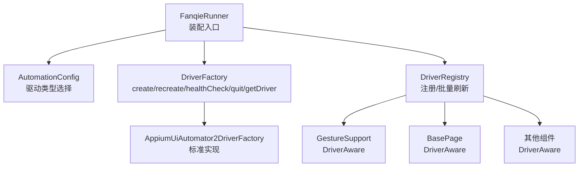
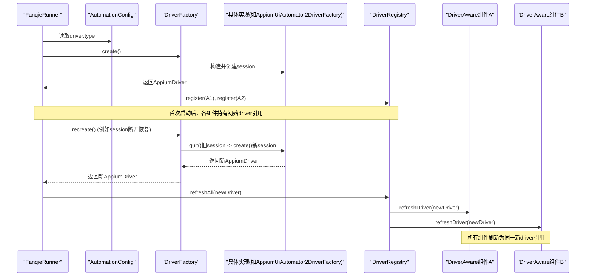
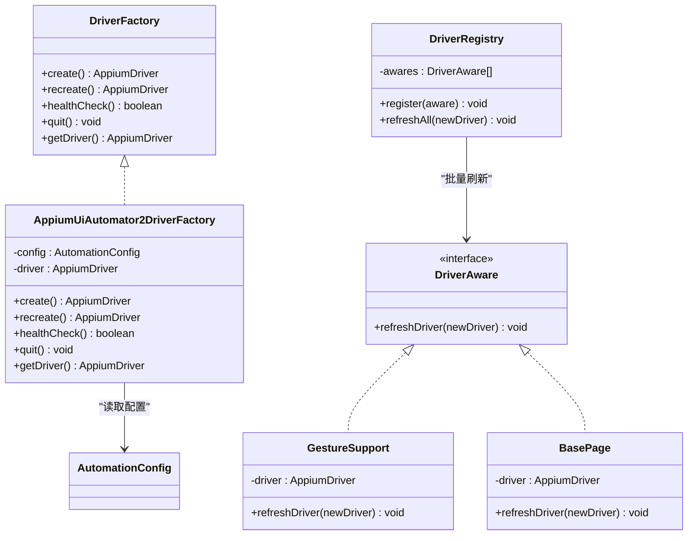

# 扩展接口

<cite>
**本文引用的文件**
- [DriverFactory.java](file://automation/src/main/java/com/fanqie/auto/core/DriverFactory.java)
- [AppiumUiAutomator2DriverFactory.java](file://automation/src/main/java/com/fanqie/auto/core/AppiumUiAutomator2DriverFactory.java)
- [DriverAware.java](file://automation/src/main/java/com/fanqie/auto/core/DriverAware.java)
- [DriverRegistry.java](file://automation/src/main/java/com/fanqie/auto/core/DriverRegistry.java)
- [AutomationConfig.java](file://automation/src/main/java/com/fanqie/auto/config/AutomationConfig.java)
- [FanqieRunner.java](file://automation/src/main/java/com/fanqie/auto/FanqieRunner.java)
- [GestureSupport.java](file://automation/src/main/java/com/fanqie/auto/core/GestureSupport.java)
- [BasePage.java](file://automation/src/main/java/com/fanqie/auto/page/BasePage.java)
- [DriverRegistryTest.java](file://automation/src/test/java/com/fanqie/auto/core/DriverRegistryTest.java)
</cite>

## 目录
1. [简介](#简介)
2. [项目结构](#项目结构)
3. [核心组件](#核心组件)
4. [架构总览](#架构总览)
5. [详细组件分析](#详细组件分析)
6. [依赖关系分析](#依赖关系分析)
7. [性能与稳定性考量](#性能与稳定性考量)
8. [故障排查指南](#故障排查指南)
9. [结论](#结论)
10. [附录：扩展开发清单](#附录扩展开发清单)

## 简介
本文件面向希望扩展自动化框架的开发者，聚焦 DriverFactory 接口的实现方法与扩展点，说明如何创建自定义驱动类型、实现 DriverAware 接口以支持 session 重建后的引用刷新、以及如何在系统中注册自定义组件。文档同时解释扩展点的生命周期管理与依赖注入机制，并提供完整的扩展开发指南（接口规范、实现示例路径、集成步骤与测试方法）。

## 项目结构
围绕扩展能力的关键代码集中在 core 包与 runner 装配层：
- 工厂与驱动抽象：DriverFactory、AppiumUiAutomator2DriverFactory
- 驱动感知与刷新：DriverAware、DriverRegistry
- 配置与装配：AutomationConfig、FanqieRunner
- 典型 DriverAware 实现：GestureSupport、BasePage 等
- 单元测试：DriverRegistryTest

图表来源
- [FanqieRunner.java:120-201](file://automation/src/main/java/com/fanqie/auto/FanqieRunner.java#L120-L201)
- [AutomationConfig.java:166-178](file://automation/src/main/java/com/fanqie/auto/config/AutomationConfig.java#L166-L178)
- [DriverFactory.java:17-54](file://automation/src/main/java/com/fanqie/auto/core/DriverFactory.java#L17-L54)
- [AppiumUiAutomator2DriverFactory.java:33-118](file://automation/src/main/java/com/fanqie/auto/core/AppiumUiAutomator2DriverFactory.java#L33-L118)
- [DriverRegistry.java:19-56](file://automation/src/main/java/com/fanqie/auto/core/DriverRegistry.java#L19-L56)

章节来源
- [FanqieRunner.java:120-201](file://automation/src/main/java/com/fanqie/auto/FanqieRunner.java#L120-L201)
- [AutomationConfig.java:166-178](file://automation/src/main/java/com/fanqie/auto/config/AutomationConfig.java#L166-L178)

## 核心组件
- DriverFactory：定义驱动会话的创建、重建、健康检查、退出与获取当前实例的统一契约。
- AppiumUiAutomator2DriverFactory：标准 Appium 2 + UiAutomator2 的实现，封装 capabilities 构建、隐式等待设置、异常诊断输出等。
- DriverAware：被持有 AppiumDriver 引用且需要随 session 重建而刷新的组件需实现此接口。
- DriverRegistry：集中管理所有 DriverAware 组件，在 recreate 成功后批量调用 refreshDriver，保证引用一致性。
- AutomationConfig：提供 driver.type 配置项，用于选择具体 DriverFactory 实现。
- FanqieRunner：装配流程入口，按配置创建 DriverFactory，注册所有 DriverAware 组件，并在必要时触发刷新。

章节来源
- [DriverFactory.java:17-54](file://automation/src/main/java/com/fanqie/auto/core/DriverFactory.java#L17-L54)
- [AppiumUiAutomator2DriverFactory.java:33-118](file://automation/src/main/java/com/fanqie/auto/core/AppiumUiAutomator2DriverFactory.java#L33-L118)
- [DriverAware.java:5-20](file://automation/src/main/java/com/fanqie/auto/core/DriverAware.java#L5-L20)
- [DriverRegistry.java:19-56](file://automation/src/main/java/com/fanqie/auto/core/DriverRegistry.java#L19-L56)
- [AutomationConfig.java:166-178](file://automation/src/main/java/com/fanqie/auto/config/AutomationConfig.java#L166-L178)
- [FanqieRunner.java:120-201](file://automation/src/main/java/com/fanqie/auto/FanqieRunner.java#L120-L201)

## 架构总览
下图展示了从运行器到驱动工厂、再到各组件的生命周期与刷新链路。

图表来源
- [FanqieRunner.java:120-201](file://automation/src/main/java/com/fanqie/auto/FanqieRunner.java#L120-L201)
- [AppiumUiAutomator2DriverFactory.java:78-118](file://automation/src/main/java/com/fanqie/auto/core/AppiumUiAutomator2DriverFactory.java#L78-L118)
- [DriverRegistry.java:43-55](file://automation/src/main/java/com/fanqie/auto/core/DriverRegistry.java#L43-L55)

## 详细组件分析

### DriverFactory 接口与扩展点
- 职责：统一创建/销毁/探活/获取驱动实例；屏蔽底层差异（如未来鸿蒙 HDC 路线）。
- 关键方法：
  - create：创建新 session，内部捕获异常并输出中文诊断。
  - recreate：先 quit 再 create，用于断线恢复。
  - healthCheck：轻量心跳探测（如窗口尺寸查询），捕获会话异常。
  - quit：优雅退出，幂等安全。
  - getDriver：获取当前驱动实例（可能为空）。
- 扩展方式：新增一个实现类，并在 FanqieRunner.createDriverFactory 中增加分支选择。

章节来源
- [DriverFactory.java:17-54](file://automation/src/main/java/com/fanqie/auto/core/DriverFactory.java#L17-L54)
- [FanqieRunner.java:251-268](file://automation/src/main/java/com/fanqie/auto/FanqieRunner.java#L251-L268)

### AppiumUiAutomator2DriverFactory 实现要点
- 不硬编码 appActivity/app，改用运行时 activateApp 激活应用。
- 严格 noReset，保护用户数据与登录态。
- 创建后立即设置隐式等待为零，避免阻塞短轮询。
- 针对华为/鸿蒙设备设置多项能力（权限、超时、抑制杀进程等）。
- 失败时输出结构化中文诊断信息，便于定位问题。

章节来源
- [AppiumUiAutomator2DriverFactory.java:15-32](file://automation/src/main/java/com/fanqie/auto/core/AppiumUiAutomator2DriverFactory.java#L15-L32)
- [AppiumUiAutomator2DriverFactory.java:44-76](file://automation/src/main/java/com/fanqie/auto/core/AppiumUiAutomator2DriverFactory.java#L44-L76)
- [AppiumUiAutomator2DriverFactory.java:120-178](file://automation/src/main/java/com/fanqie/auto/core/AppiumUiAutomator2DriverFactory.java#L120-L178)
- [AppiumUiAutomator2DriverFactory.java:180-208](file://automation/src/main/java/com/fanqie/auto/core/AppiumUiAutomator2DriverFactory.java#L180-L208)

### DriverAware 接口与刷新机制
- 适用场景：任何直接持有 AppiumDriver 引用且需要在 session 重建后更新的组件。
- 约定：实现 refreshDriver(newDriver)，由 DriverRegistry 在 recreate 成功后批量回调。
- 线程安全：DriverRegistry 使用并发安全的列表存储与遍历。

章节来源
- [DriverAware.java:5-20](file://automation/src/main/java/com/fanqie/auto/core/DriverAware.java#L5-L20)
- [DriverRegistry.java:19-56](file://automation/src/main/java/com/fanqie/auto/core/DriverRegistry.java#L19-L56)

### DriverRegistry 刷新流程
- register：注册 DriverAware 组件，null 安全且去重。
- refreshAll：遍历已注册组件，逐个调用 refreshDriver，单个失败不影响其余组件。
- 日志：记录成功刷新数量，便于审计。

章节来源
- [DriverRegistry.java:25-55](file://automation/src/main/java/com/fanqie/auto/core/DriverRegistry.java#L25-L55)

### 典型 DriverAware 实现
- GestureSupport：刷新 driver 并清空屏幕尺寸缓存，确保后续手势坐标计算正确。
- BasePage：刷新内部 driver 引用，供页面操作使用。

章节来源
- [GestureSupport.java:26-50](file://automation/src/main/java/com/fanqie/auto/core/GestureSupport.java#L26-L50)
- [BasePage.java:40-73](file://automation/src/main/java/com/fanqie/auto/page/BasePage.java#L40-L73)

### 配置与装配
- AutomationConfig.driverType：决定使用哪个 DriverFactory 实现；未知值回退到 uiautomator2。
- FanqieRunner：根据配置创建工厂，注册所有 DriverAware 组件，并在任务执行前后进行资源清理。

章节来源
- [AutomationConfig.java:166-178](file://automation/src/main/java/com/fanqie/auto/config/AutomationConfig.java#L166-L178)
- [FanqieRunner.java:120-201](file://automation/src/main/java/com/fanqie/auto/FanqieRunner.java#L120-L201)
- [FanqieRunner.java:251-268](file://automation/src/main/java/com/fanqie/auto/FanqieRunner.java#L251-L268)

## 依赖关系分析
- FanqieRunner 依赖 AutomationConfig 选择驱动类型，并依赖 DriverFactory 创建与管理会话。
- DriverRegistry 依赖 DriverAware 集合，负责刷新传播。
- 各业务组件通过构造函数或字段注入持有 driver 引用，并通过 DriverAware 参与刷新。

图表来源
- [DriverFactory.java:17-54](file://automation/src/main/java/com/fanqie/auto/core/DriverFactory.java#L17-L54)
- [AppiumUiAutomator2DriverFactory.java:33-118](file://automation/src/main/java/com/fanqie/auto/core/AppiumUiAutomator2DriverFactory.java#L33-L118)
- [DriverAware.java:5-20](file://automation/src/main/java/com/fanqie/auto/core/DriverAware.java#L5-L20)
- [DriverRegistry.java:19-56](file://automation/src/main/java/com/fanqie/auto/core/DriverRegistry.java#L19-L56)
- [GestureSupport.java:26-50](file://automation/src/main/java/com/fanqie/auto/core/GestureSupport.java#L26-L50)
- [BasePage.java:40-73](file://automation/src/main/java/com/fanqie/auto/page/BasePage.java#L40-L73)

## 性能与稳定性考量
- 隐式等待归零：创建驱动后立即设置隐式等待为零，避免长轮询阻塞，保障短间隔探测的性能。
- 健康检查：使用轻量命令进行心跳探测，快速识别无效会话。
- 刷新隔离：DriverRegistry 对每个组件刷新 try-catch 隔离，单点失败不影响整体刷新。
- 幂等退出：quit 多次调用安全，防止重复关闭导致异常。

章节来源
- [AppiumUiAutomator2DriverFactory.java:61-67](file://automation/src/main/java/com/fanqie/auto/core/AppiumUiAutomator2DriverFactory.java#L61-L67)
- [AppiumUiAutomator2DriverFactory.java:85-100](file://automation/src/main/java/com/fanqie/auto/core/AppiumUiAutomator2DriverFactory.java#L85-L100)
- [DriverRegistry.java:43-55](file://automation/src/main/java/com/fanqie/auto/core/DriverRegistry.java#L43-L55)

## 故障排查指南
- Session 创建失败：查看工厂输出的结构化诊断信息，逐项核对设备设置、USB 调试、Appium Server 状态等。
- Session 断开：通过 healthCheck 检测，必要时调用 recreate 并刷新所有 DriverAware 组件。
- 刷新异常：DriverRegistry 会记录失败组件名与原因，定位具体实现中的 refreshDriver 逻辑。

章节来源
- [AppiumUiAutomator2DriverFactory.java:180-208](file://automation/src/main/java/com/fanqie/auto/core/AppiumUiAutomator2DriverFactory.java#L180-L208)
- [DriverRegistry.java:43-55](file://automation/src/main/java/com/fanqie/auto/core/DriverRegistry.java#L43-L55)

## 结论
DriverFactory 与 DriverAware 构成了可扩展的驱动抽象与刷新机制。通过配置化选择驱动类型、集中式注册与批量刷新，系统能够在不同平台与驱动后端之间平滑切换，同时保证组件引用的强一致性与健壮性。新增驱动类型只需实现 DriverFactory 并在装配处注册即可，上层业务无需改动。

## 附录：扩展开发清单

### 1) 创建自定义驱动类型
- 新建类实现 DriverFactory 接口，覆盖 create/recreate/healthCheck/quit/getDriver。
- 在 FanqieRunner.createDriverFactory 中增加对应分支，或通过配置项选择。
- 参考现有实现：[AppiumUiAutomator2DriverFactory.java](file://automation/src/main/java/com/fanqie/auto/core/AppiumUiAutomator2DriverFactory.java)

章节来源
- [DriverFactory.java:17-54](file://automation/src/main/java/com/fanqie/auto/core/DriverFactory.java#L17-L54)
- [FanqieRunner.java:251-268](file://automation/src/main/java/com/fanqie/auto/FanqieRunner.java#L251-L268)
- [AppiumUiAutomator2DriverFactory.java:33-118](file://automation/src/main/java/com/fanqie/auto/core/AppiumUiAutomator2DriverFactory.java#L33-L118)

### 2) 实现 DriverAware 接口
- 若组件持有 AppiumDriver 引用，需实现 refreshDriver(newDriver)。
- 刷新时应更新内部 driver 引用，并清理相关缓存（如屏幕尺寸缓存）。
- 参考实现：[GestureSupport.java](file://automation/src/main/java/com/fanqie/auto/core/GestureSupport.java)、[BasePage.java](file://automation/src/main/java/com/fanqie/auto/page/BasePage.java)

章节来源
- [DriverAware.java:5-20](file://automation/src/main/java/com/fanqie/auto/core/DriverAware.java#L5-L20)
- [GestureSupport.java:26-50](file://automation/src/main/java/com/fanqie/auto/core/GestureSupport.java#L26-L50)
- [BasePage.java:40-73](file://automation/src/main/java/com/fanqie/auto/page/BasePage.java#L40-L73)

### 3) 注册自定义组件
- 在 FanqieRunner 装配阶段，将实现了 DriverAware 的组件通过 DriverRegistry.register 注册。
- 确保在 recreate 成功后，DriverRegistry.refreshAll 能批量刷新这些组件。
- 参考装配位置：[FanqieRunner.java](file://automation/src/main/java/com/fanqie/auto/FanqieRunner.java)

章节来源
- [FanqieRunner.java:147-201](file://automation/src/main/java/com/fanqie/auto/FanqieRunner.java#L147-L201)
- [DriverRegistry.java:25-55](file://automation/src/main/java/com/fanqie/auto/core/DriverRegistry.java#L25-L55)

### 4) 集成步骤
- 配置驱动类型：在 AutomationConfig 对应的 properties 中设置 driver.type。
- 装配工厂：FanqieRunner 根据配置创建 DriverFactory。
- 注册组件：将所有 DriverAware 组件注册到 DriverRegistry。
- 运行与验证：执行主任务，观察健康检查与刷新日志。

章节来源
- [AutomationConfig.java:166-178](file://automation/src/main/java/com/fanqie/auto/config/AutomationConfig.java#L166-L178)
- [FanqieRunner.java:120-201](file://automation/src/main/java/com/fanqie/auto/FanqieRunner.java#L120-L201)

### 5) 测试方法
- 使用 DriverRegistryTest 验证刷新行为：
  - 每个注册的 DriverAware 恰好收到一次 refreshDriver 回调。
  - 传入的新 driver 引用被正确透传。
  - 单个组件刷新异常不影响其余组件。
- 可仿照测试替身编写自己的 DriverAware 替身进行离线验证。

章节来源
- [DriverRegistryTest.java:14-143](file://automation/src/test/java/com/fanqie/auto/core/DriverRegistryTest.java#L14-L143)