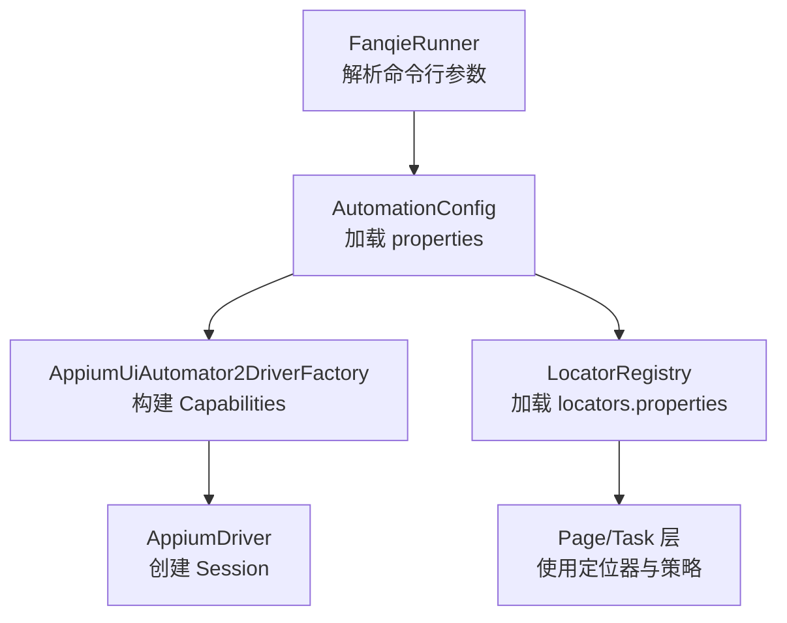
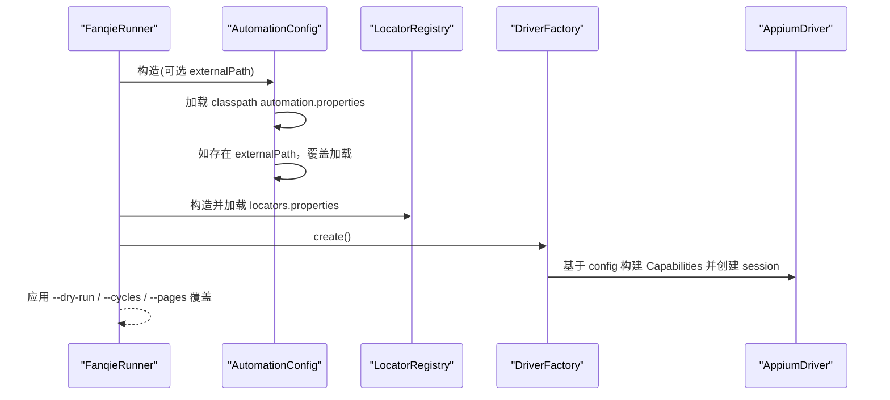
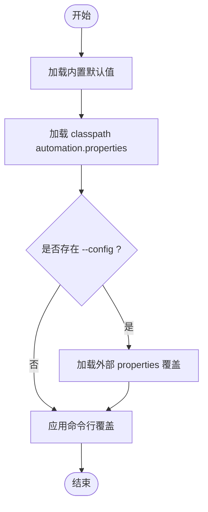
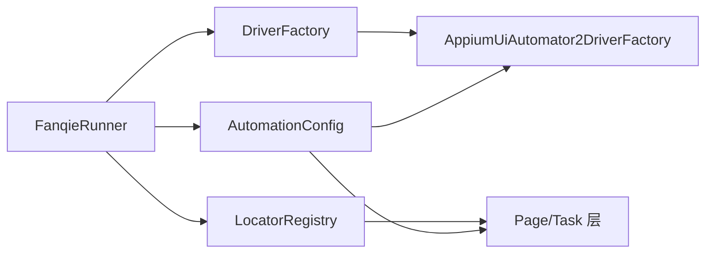

# 配置接口

<cite>
**本文引用的文件**
- [AutomationConfig.java](file://automation/src/main/java/com/fanqie/auto/config/AutomationConfig.java)
- [LocatorRegistry.java](file://automation/src/main/java/com/fanqie/auto/config/LocatorRegistry.java)
- [AppiumUiAutomator2DriverFactory.java](file://automation/src/main/java/com/fanqie/auto/core/AppiumUiAutomator2DriverFactory.java)
- [DriverFactory.java](file://automation/src/main/java/com/fanqie/auto/core/DriverFactory.java)
- [FanqieRunner.java](file://automation/src/main/java/com/fanqie/auto/FanqieRunner.java)
- [ConfigTest.java](file://automation/src/test/java/com/fanqie/auto/config/ConfigTest.java)
- [automation.properties](file://automation/src/main/resources/automation.properties)
- [locators.properties](file://automation/src/main/resources/locators.properties)
</cite>

## 目录
1. [简介](#简介)
2. [项目结构](#项目结构)
3. [核心组件](#核心组件)
4. [架构总览](#架构总览)
5. [详细组件分析](#详细组件分析)
6. [依赖关系分析](#依赖关系分析)
7. [性能与稳定性考量](#性能与稳定性考量)
8. [故障排查指南](#故障排查指南)
9. [结论](#结论)
10. [附录：完整配置项清单与示例](#附录完整配置项清单与示例)

## 简介
本文件面向自动化运行时的“配置接口”，围绕 AutomationConfig 类展开，系统说明其所有配置项、数据类型、取值范围、默认值、加载优先级与覆盖机制，并给出设备连接、驱动、页面、行为等类别的配置说明与最佳实践。同时补充 LocatorRegistry 的定位器配置（文案候选集）以及 FanqieRunner 的命令行覆盖方式，帮助你在不修改代码的前提下灵活调整运行行为。

## 项目结构
- 配置加载与类型化访问：AutomationConfig
- 定位器与文案候选集：LocatorRegistry
- 驱动装配与能力映射：AppiumUiAutomator2DriverFactory + DriverFactory
- 启动入口与参数覆盖：FanqieRunner
- 配置文件资源：automation.properties、locators.properties
- 单元测试验证加载与覆盖：ConfigTest

图表来源
- [FanqieRunner.java:41-121](file://automation/src/main/java/com/fanqie/auto/FanqieRunner.java#L41-L121)
- [AutomationConfig.java:25-63](file://automation/src/main/java/com/fanqie/auto/config/AutomationConfig.java#L25-L63)
- [AppiumUiAutomator2DriverFactory.java:44-76](file://automation/src/main/java/com/fanqie/auto/core/AppiumUiAutomator2DriverFactory.java#L44-L76)
- [LocatorRegistry.java:52-65](file://automation/src/main/java/com/fanqie/auto/config/LocatorRegistry.java#L52-L65)

章节来源
- [FanqieRunner.java:41-121](file://automation/src/main/java/com/fanqie/auto/FanqieRunner.java#L41-L121)
- [AutomationConfig.java:25-63](file://automation/src/main/java/com/fanqie/auto/config/AutomationConfig.java#L25-L63)
- [LocatorRegistry.java:52-65](file://automation/src/main/java/com/fanqie/auto/config/LocatorRegistry.java#L52-L65)

## 核心组件
- AutomationConfig：统一从 automation.properties 加载配置并提供类型化 Getter；支持外部路径覆盖；提供 driverType、时序、流程、阅读页翻页策略、验证与调试等全量配置。
- LocatorRegistry：从 locators.properties 加载 UI 控件的文案候选集与正则，构造各逻辑控件的定位规格（主定位器、备选定位器、区域提示、是否允许几何兜底）。
- AppiumUiAutomator2DriverFactory：将 AutomationConfig 中的设备与驱动相关配置映射为 UiAutomator2Options capabilities，创建并管理 Appium session。
- FanqieRunner：解析 --config、--dry-run、--cycles、--pages 等命令行参数，按优先级装配配置与组件，并在需要时进行覆盖。

章节来源
- [AutomationConfig.java:10-17](file://automation/src/main/java/com/fanqie/auto/config/AutomationConfig.java#L10-L17)
- [LocatorRegistry.java:16-25](file://automation/src/main/java/com/fanqie/auto/config/LocatorRegistry.java#L16-L25)
- [AppiumUiAutomator2DriverFactory.java:15-32](file://automation/src/main/java/com/fanqie/auto/core/AppiumUiAutomator2DriverFactory.java#L15-L32)
- [FanqieRunner.java:25-36](file://automation/src/main/java/com/fanqie/auto/FanqieRunner.java#L25-L36)

## 架构总览
配置加载与覆盖的优先级如下：
1) 内置默认值（Java 代码中硬编码的默认值）
2) classpath 下的 automation.properties（UTF-8 读取）
3) 外部 properties 文件（通过 --config 指定，覆盖 classpath 默认值）
4) 命令行参数（--dry-run、--cycles、--pages），在运行时覆盖任务级配置

图表来源
- [FanqieRunner.java:41-121](file://automation/src/main/java/com/fanqie/auto/FanqieRunner.java#L41-L121)
- [AutomationConfig.java:25-63](file://automation/src/main/java/com/fanqie/auto/config/AutomationConfig.java#L25-L63)
- [AppiumUiAutomator2DriverFactory.java:44-76](file://automation/src/main/java/com/fanqie/auto/core/AppiumUiAutomator2DriverFactory.java#L44-L76)

## 详细组件分析

### AutomationConfig 配置项总览
- 设备与驱动连接（appium.*）
  - appium.server.url：Appium Server 地址，字符串，默认 http://127.0.0.1:4723
  - appium.platform.name：平台名，字符串，默认 Android
  - appium.automation.name：自动化引擎名，字符串，默认 UiAutomator2
  - appium.device.udid：设备序列号，字符串，默认空（自动选择第一个在线设备）
  - appium.app.package：应用包名，字符串，默认 com.dragon.read
  - appium.no.reset：是否保留应用数据，布尔，默认 true
  - appium.new.command.timeout.sec：新命令超时秒数，整数，默认 1800
  - appium.uia2.server.launch.timeout.ms：UiAutomator2 Server 启动超时毫秒，长整型，默认 60000
  - appium.uia2.server.install.timeout.ms：UiAutomator2 Server 安装超时毫秒，长整型，默认 120000
  - appium.skip.server.installation：跳过服务器安装，布尔，默认 false
  - appium.skip.device.initialization：跳过设备初始化，布尔，默认 false
  - appium.keep.screen.on：保持屏幕常亮，布尔，默认 true
- 驱动类型（driver.type）
  - driver.type：驱动类型标识，字符串，默认 uiautomator2；未知值回退到 uiautomator2
- 时序配置（timing.*）
  - timing.poll.interval.ms：轮询间隔毫秒，长整型，默认 250
  - timing.state.detect.timeout.ms：状态检测超时毫秒，长整型，默认 3000
  - timing.action.timeout.ms：动作超时毫秒，长整型，默认 8000
  - timing.app.launch.timeout.ms：应用启动超时毫秒，长整型，默认 30000
  - timing.ad.video.timeout.ms：广告视频超时毫秒，长整型，默认 45000
  - timing.ad.close.ready.timeout.ms：广告关闭就绪超时毫秒，长整型，默认 15000
  - timing.max.state.dwell.ms：最大状态驻留毫秒，长整型，默认 90000
  - timing.heartbeat.interval.sec：心跳间隔秒数，整数，默认 30
- 流程配置（flow.*）
  - flow.pages.per.cycle：每轮翻页次数，整数，默认 5
  - flow.max.ad.rounds.per.entry：每次进入的最大广告轮次，整数，默认 4
  - flow.max.total.ad.rounds：总广告轮次上限，整数，默认 40
  - flow.target.free.minutes：目标免费分钟数，整数，默认 120
  - flow.reward.fallback.minutes：奖励兜底估值分钟，整数，默认 30
  - flow.max.wall.clock.ms：墙钟时间预算毫秒，长整型，默认 10800000（3小时）；<=0 表示不启用熔断
  - flow.outer.cycles：外层循环次数，整数，默认 2
  - flow.max.consecutive.errors：最大连续错误次数，整数，默认 3
  - flow.max.recovery.retry：最大恢复重试次数，整数，默认 3
- 阅读页翻页策略（reader.*）
  - reader.turn.strategy：翻页策略，字符串，tap/swipe，默认 tap
  - reader.next.tap.ratio.x/y：下一页点击比例坐标，浮点，默认 x=0.85, y=0.50
  - reader.prev.tap.ratio.x：上一页点击比例坐标，浮点，默认 x=0.15
  - reader.swipe.percent：滑动比例，浮点，默认 0.6
  - reader.swipe.duration.ms：滑动时长毫秒，长整型，默认 300
- 验证与调试（verify.* / runtime.*）
  - verify.page.turned.by.screenshot：截图验证翻页，布尔，默认 false
  - runtime.dry.run：干跑模式，布尔，默认 false

章节来源
- [AutomationConfig.java:112-164](file://automation/src/main/java/com/fanqie/auto/config/AutomationConfig.java#L112-L164)
- [AutomationConfig.java:176-212](file://automation/src/main/java/com/fanqie/auto/config/AutomationConfig.java#L176-L212)
- [AutomationConfig.java:216-260](file://automation/src/main/java/com/fanqie/auto/config/AutomationConfig.java#L216-L260)
- [AutomationConfig.java:264-287](file://automation/src/main/java/com/fanqie/auto/config/AutomationConfig.java#L264-L287)
- [AutomationConfig.java:291-297](file://automation/src/main/java/com/fanqie/auto/config/AutomationConfig.java#L291-L297)

### 配置加载优先级与覆盖机制
- 加载顺序
  1) 内置默认值（Java 代码中每个 getter 的默认值）
  2) classpath 下的 automation.properties（UTF-8 Reader 加载）
  3) 外部 properties 文件（--config 指定），覆盖 classpath 默认值
  4) 命令行参数（--dry-run、--cycles、--pages），在运行时覆盖任务级配置
- 非法值处理
  - 非数字或格式错误的数值会被记录警告并回退到默认值，不会抛出异常中断运行
- 缺失键处理
  - 缺失键直接返回内置默认值，保证健壮性

图表来源
- [AutomationConfig.java:25-63](file://automation/src/main/java/com/fanqie/auto/config/AutomationConfig.java#L25-L63)
- [FanqieRunner.java:41-121](file://automation/src/main/java/com/fanqie/auto/FanqieRunner.java#L41-L121)
- [ConfigTest.java:60-81](file://automation/src/test/java/com/fanqie/auto/config/ConfigTest.java#L60-L81)

章节来源
- [AutomationConfig.java:25-63](file://automation/src/main/java/com/fanqie/auto/config/AutomationConfig.java#L25-L63)
- [FanqieRunner.java:41-121](file://automation/src/main/java/com/fanqie/auto/FanqieRunner.java#L41-L121)
- [ConfigTest.java:60-81](file://automation/src/test/java/com/fanqie/auto/config/ConfigTest.java#L60-L81)

### 设备连接配置（Appium）
- 关键项
  - server.url、platform.name、automation.name：决定 Appium 服务端与平台
  - device.udid：为空则自动选择设备；建议固定以稳定多设备环境
  - app.package：目标应用包名
  - no.reset：必须为 true，保护用户数据与登录态
  - new.command.timeout.sec：配合心跳保活，避免长任务断连
  - uia2ServerLaunchTimeoutMs / InstallTimeoutMs：华为/鸿蒙首启慢场景放宽超时
  - skipServerInstallation / skipDeviceInitialization：首轮成功后可开启加速
  - keepScreenOn：长任务建议开启
- 能力映射
  - AppiumUiAutomator2DriverFactory 将上述配置映射为 UiAutomator2Options，设置 autoGrantPermissions、ignoreHiddenApiPolicyError、suppressKillServer、disableIdLocatorAutocompletion 等优化项

章节来源
- [AutomationConfig.java:112-164](file://automation/src/main/java/com/fanqie/auto/config/AutomationConfig.java#L112-L164)
- [AppiumUiAutomator2DriverFactory.java:126-177](file://automation/src/main/java/com/fanqie/auto/core/AppiumUiAutomator2DriverFactory.java#L126-L177)

### 驱动配置（DriverFactory）
- 驱动类型
  - driver.type：当前仅实现 uiautomator2；预留 harmony_hdc 扩展位
  - 未知值会记录警告并回退到 uiautomator2
- 工厂抽象
  - DriverFactory 接口定义 create/recreate/healthCheck/quit/getDriver，便于未来替换实现

章节来源
- [AutomationConfig.java:176-178](file://automation/src/main/java/com/fanqie/auto/config/AutomationConfig.java#L176-L178)
- [DriverFactory.java:17-54](file://automation/src/main/java/com/fanqie/auto/core/DriverFactory.java#L17-L54)
- [FanqieRunner.java:251-267](file://automation/src/main/java/com/fanqie/auto/FanqieRunner.java#L251-L267)

### 页面配置（LocatorRegistry）
- 文案候选集
  - 书架 Tab、书籍条目 ID、阅读进度正则、容器 ID、短剧/小说识别正则
  - 广告入口、观看广告、关闭按钮、继续获取、下一章、通用关闭弹窗、开屏跳过、每日配额耗尽等文案候选
- 定位规格
  - 每个逻辑控件由 LocatorSpec 描述：primaryBy、fallbackBys、boundsHint、allowGeometryFallback
  - 安全约束：ad.watch 与 ad.continue 禁止几何兜底（误点浪费配额）；ad.close 允许几何兜底（漏点后果更大）
- 中文编码
  - 使用 UTF-8 Reader 加载 locators.properties，避免 ISO-8859-1 导致的乱码问题

章节来源
- [LocatorRegistry.java:52-65](file://automation/src/main/java/com/fanqie/auto/config/LocatorRegistry.java#L52-L65)
- [LocatorRegistry.java:95-137](file://automation/src/main/java/com/fanqie/auto/config/LocatorRegistry.java#L95-L137)
- [LocatorRegistry.java:152-256](file://automation/src/main/java/com/fanqie/auto/config/LocatorRegistry.java#L152-L256)
- [LocatorRegistry.java:271-298](file://automation/src/main/java/com/fanqie/auto/config/LocatorRegistry.java#L271-L298)

### 行为配置（时序、流程、阅读页、验证）
- 时序
  - pollIntervalMs：短轮询设计（默认 250ms），需配合隐式等待为零的策略
  - action/state/app/ad 相关超时：根据网络与设备性能调优
  - heartbeatIntervalSec：心跳保活间隔
- 流程
  - pagesPerCycle、maxAdRoundsPerEntry、maxTotalAdRounds：控制广告轮次与翻页节奏
  - targetFreeMinutes、rewardFallbackMinutes：目标与兜底策略
  - maxWallClockMs：墙钟熔断保护，防止无限期占用设备
  - outerCycles、maxConsecutiveErrors、maxRecoveryRetry：外层循环与容错
- 阅读页
  - turnStrategy：tap/swipe 两种翻页策略
  - next/prev 点击比例与 swipe 参数：适配不同机型与 UI 布局
- 验证与调试
  - verifyPageTurnedByScreenshot：截图验证翻页
  - dryRun：只连接并抓取 UI 快照，不执行任何点击

章节来源
- [AutomationConfig.java:182-212](file://automation/src/main/java/com/fanqie/auto/config/AutomationConfig.java#L182-L212)
- [AutomationConfig.java:216-260](file://automation/src/main/java/com/fanqie/auto/config/AutomationConfig.java#L216-L260)
- [AutomationConfig.java:264-287](file://automation/src/main/java/com/fanqie/auto/config/AutomationConfig.java#L264-L287)
- [AutomationConfig.java:291-297](file://automation/src/main/java/com/fanqie/auto/config/AutomationConfig.java#L291-L297)

## 依赖关系分析
- FanqieRunner 依赖 AutomationConfig、LocatorRegistry、DriverFactory 实现、EnvDoctor、RunLogger 等
- AutomationConfig 被 DriverFactory、Page/Task 层广泛使用
- LocatorRegistry 被 Page/Task 层用于 UI 定位与状态判定
- AppiumUiAutomator2DriverFactory 依赖 AutomationConfig 构建 Capabilities

图表来源
- [FanqieRunner.java:116-201](file://automation/src/main/java/com/fanqie/auto/FanqieRunner.java#L116-L201)
- [AppiumUiAutomator2DriverFactory.java:33-76](file://automation/src/main/java/com/fanqie/auto/core/AppiumUiAutomator2DriverFactory.java#L33-L76)
- [LocatorRegistry.java:52-65](file://automation/src/main/java/com/fanqie/auto/config/LocatorRegistry.java#L52-L65)

章节来源
- [FanqieRunner.java:116-201](file://automation/src/main/java/com/fanqie/auto/FanqieRunner.java#L116-L201)
- [AppiumUiAutomator2DriverFactory.java:33-76](file://automation/src/main/java/com/fanqie/auto/core/AppiumUiAutomator2DriverFactory.java#L33-L76)
- [LocatorRegistry.java:52-65](file://automation/src/main/java/com/fanqie/auto/config/LocatorRegistry.java#L52-L65)

## 性能与稳定性考量
- 隐式等待为零：创建 driver 后立即设置 implicitlyWait=0，确保短轮询不被隐式等待阻塞
- 心跳保活：newCommandTimeout 与 heartbeatIntervalSec 配合，避免长任务断连
- 超时放宽：UiAutomator2 Server 启动/安装超时针对华为/鸿蒙设备放宽
- 几何兜底限制：ad.watch 与 ad.continue 禁用几何兜底，避免误点浪费配额
- 墙钟熔断：maxWallClockMs 防止无限期运行，保障设备资源

章节来源
- [AppiumUiAutomator2DriverFactory.java:63-67](file://automation/src/main/java/com/fanqie/auto/core/AppiumUiAutomator2DriverFactory.java#L63-L67)
- [AppiumUiAutomator2DriverFactory.java:142-158](file://automation/src/main/java/com/fanqie/auto/core/AppiumUiAutomator2DriverFactory.java#L142-L158)
- [LocatorRegistry.java:186-233](file://automation/src/main/java/com/fanqie/auto/config/LocatorRegistry.java#L186-L233)
- [AutomationConfig.java:194-248](file://automation/src/main/java/com/fanqie/auto/config/AutomationConfig.java#L194-L248)

## 故障排查指南
- 常见会话创建失败诊断
  - APK 安装弹窗未确认（华为「监控 ADB 安装应用」）
  - 仅充电模式下允许 ADB 调试未开启
  - USB 调试未开启或未授权
  - Appium Server 未启动或端口不可达
  - adb 无法识别设备
- 配置相关问题
  - 外部配置文件路径错误或权限不足：会记录警告并回退到 classpath 默认值
  - 非法数值：记录警告并回退默认值，不影响运行
  - 中文乱码：确保 locators.properties 使用 UTF-8 编码

章节来源
- [AppiumUiAutomator2DriverFactory.java:184-208](file://automation/src/main/java/com/fanqie/auto/core/AppiumUiAutomator2DriverFactory.java#L184-L208)
- [AutomationConfig.java:44-63](file://automation/src/main/java/com/fanqie/auto/config/AutomationConfig.java#L44-L63)
- [AutomationConfig.java:71-108](file://automation/src/main/java/com/fanqie/auto/config/AutomationConfig.java#L71-L108)
- [LocatorRegistry.java:67-81](file://automation/src/main/java/com/fanqie/auto/config/LocatorRegistry.java#L67-L81)

## 结论
AutomationConfig 提供了统一的配置入口与健壮的默认值机制，结合外部 properties 与命令行参数，实现了灵活的运行时覆盖。配合 LocatorRegistry 的定位器配置与 AppiumUiAutomator2DriverFactory 的能力映射，系统在跨设备、跨版本环境下具备良好稳定性与可扩展性。建议在生产环境中优先使用外部配置文件覆盖默认值，并通过 --dry-run 与 --doctor 进行环境与行为验证。

## 附录：完整配置项清单与示例

### 配置文件格式
- 文件格式：Java Properties（key=value）
- 编码：UTF-8（尤其 locators.properties 中的中文文案）
- 位置：
  - automation.properties：classpath 下默认配置
  - locators.properties：classpath 下定位器文案与正则
  - 外部 properties：通过 --config 指定，覆盖 classpath 默认值

章节来源
- [AutomationConfig.java:44-63](file://automation/src/main/java/com/fanqie/auto/config/AutomationConfig.java#L44-L63)
- [LocatorRegistry.java:67-81](file://automation/src/main/java/com/fanqie/auto/config/LocatorRegistry.java#L67-L81)

### 属性定义与默认值（节选）
- 设备与驱动
  - appium.server.url：http://127.0.0.1:4723
  - appium.platform.name：Android
  - appium.automation.name：UiAutomator2
  - appium.device.udid：空（自动选择）
  - appium.app.package：com.dragon.read
  - appium.no.reset：true
  - appium.new.command.timeout.sec：1800
  - appium.uia2.server.launch.timeout.ms：60000
  - appium.uia2.server.install.timeout.ms：120000
  - appium.skip.server.installation：false
  - appium.skip.device.initialization：false
  - appium.keep.screen.on：true
- 驱动类型
  - driver.type：uiautomator2
- 时序
  - timing.poll.interval.ms：250
  - timing.state.detect.timeout.ms：3000
  - timing.action.timeout.ms：8000
  - timing.app.launch.timeout.ms：30000
  - timing.ad.video.timeout.ms：45000
  - timing.ad.close.ready.timeout.ms：15000
  - timing.max.state.dwell.ms：90000
  - timing.heartbeat.interval.sec：30
- 流程
  - flow.pages.per.cycle：5
  - flow.max.ad.rounds.per.entry：4
  - flow.max.total.ad.rounds：40
  - flow.target.free.minutes：120
  - flow.reward.fallback.minutes：30
  - flow.max.wall.clock.ms：10800000
  - flow.outer.cycles：2
  - flow.max.consecutive.errors：3
  - flow.max.recovery.retry：3
- 阅读页
  - reader.turn.strategy：tap
  - reader.next.tap.ratio.x：0.85
  - reader.next.tap.ratio.y：0.50
  - reader.prev.tap.ratio.x：0.15
  - reader.swipe.percent：0.6
  - reader.swipe.duration.ms：300
- 验证与调试
  - verify.page.turned.by.screenshot：false
  - runtime.dry.run：false

章节来源
- [AutomationConfig.java:112-297](file://automation/src/main/java/com/fanqie/auto/config/AutomationConfig.java#L112-L297)

### 配置示例（文本形式）
- 最小可用配置（仅覆盖必要项）
  - appium.server.url=http://127.0.0.1:4723
  - appium.device.udid=你的设备UDID
  - appium.app.package=com.dragon.read
  - appium.no.reset=true
  - appium.keep.screen.on=true
- 华为/鸿蒙优化配置
  - appium.uia2.server.launch.timeout.ms=60000
  - appium.uia2.server.install.timeout.ms=120000
  - appium.new.command.timeout.sec=1800
  - appium.skip.server.installation=false
  - appium.skip.device.initialization=false
- 流程与行为
  - flow.pages.per.cycle=5
  - flow.max.ad.rounds.per.entry=4
  - flow.max.total.ad.rounds=40
  - flow.target.free.minutes=120
  - flow.reward.fallback.minutes=30
  - flow.max.wall.clock.ms=10800000
  - timing.poll.interval.ms=250
  - timing.action.timeout.ms=8000
  - reader.turn.strategy=tap
  - runtime.dry.run=false

章节来源
- [AutomationConfig.java:112-297](file://automation/src/main/java/com/fanqie/auto/config/AutomationConfig.java#L112-L297)

### 最佳实践建议
- 生产环境优先使用外部 properties 覆盖默认值，避免重新编译
- 固定设备 UDID，提升多设备环境稳定性
- 长任务开启 keepScreenOn 与较大 newCommandTimeout，配合心跳保活
- 首次运行使用 --dry-run 与 --doctor 验证环境与行为
- 合理设置 wall clock 熔断，防止无限期占用设备
- 谨慎调整 ad.watch 与 ad.continue 的几何兜底（禁止），避免误点浪费配额

章节来源
- [FanqieRunner.java:41-121](file://automation/src/main/java/com/fanqie/auto/FanqieRunner.java#L41-L121)
- [AppiumUiAutomator2DriverFactory.java:142-177](file://automation/src/main/java/com/fanqie/auto/core/AppiumUiAutomator2DriverFactory.java#L142-L177)
- [LocatorRegistry.java:186-233](file://automation/src/main/java/com/fanqie/auto/config/LocatorRegistry.java#L186-L233)