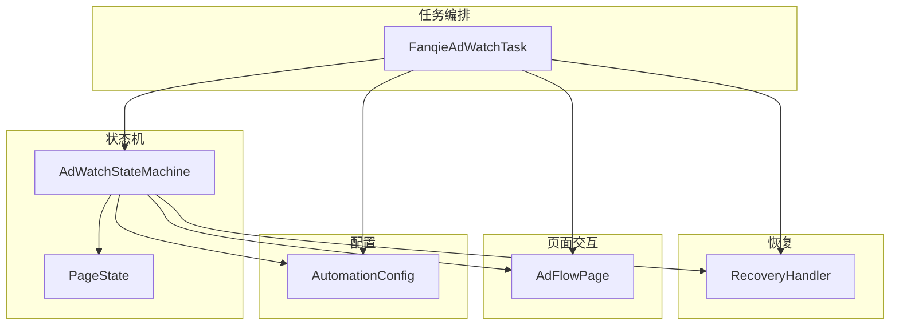
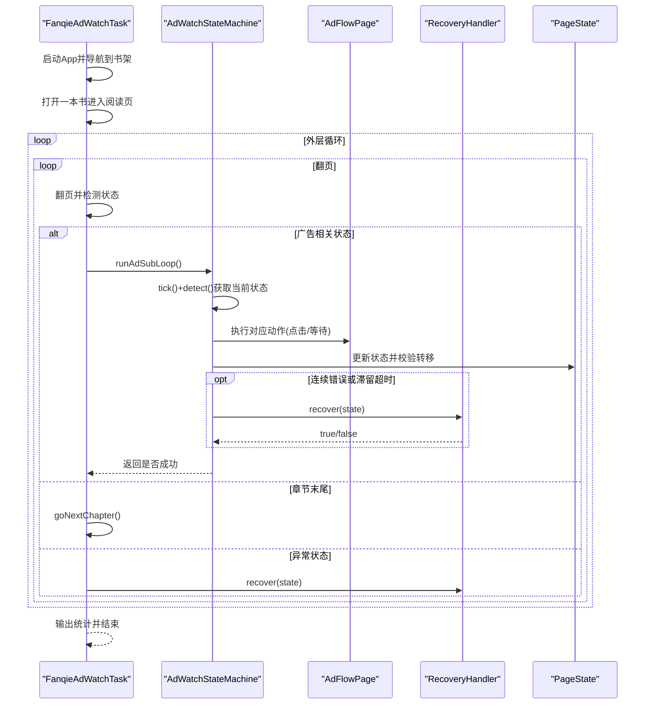
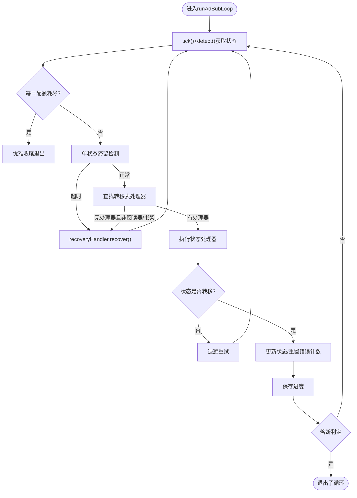
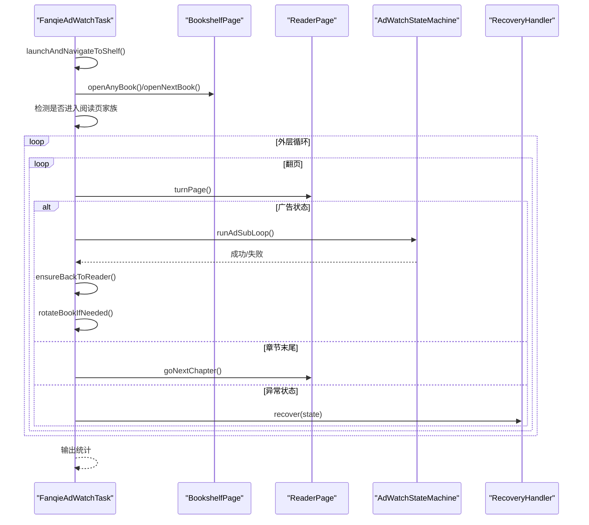
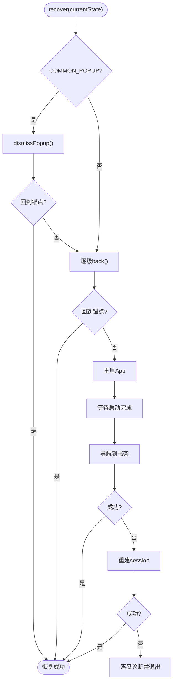
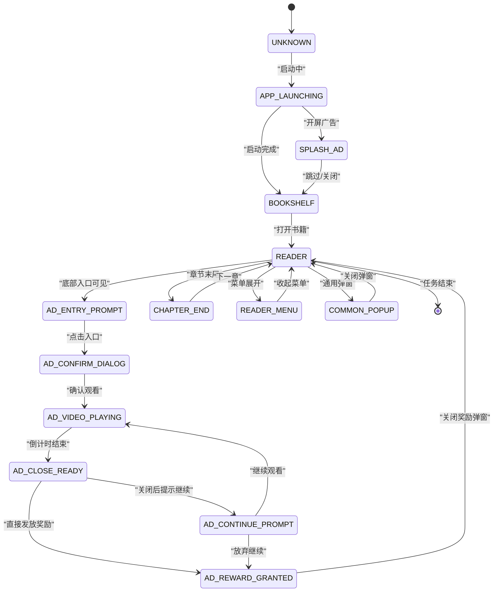
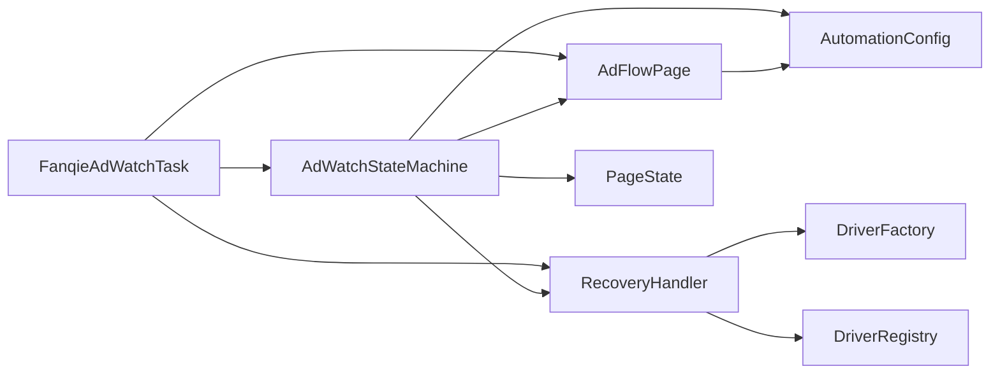

# 业务逻辑

<cite>
**本文引用的文件**
- [AdWatchStateMachine.java](file://automation/src/main/java/com/fanqie/auto/task/AdWatchStateMachine.java)
- [FanqieAdWatchTask.java](file://automation/src/main/java/com/fanqie/auto/task/FanqieAdWatchTask.java)
- [RecoveryHandler.java](file://automation/src/main/java/com/fanqie/auto/task/RecoveryHandler.java)
- [Task.java](file://automation/src/main/java/com/fanqie/auto/task/Task.java)
- [PageState.java](file://automation/src/main/java/com/fanqie/auto/core/PageState.java)
- [AdFlowPage.java](file://automation/src/main/java/com/fanqie/auto/page/AdFlowPage.java)
- [AutomationConfig.java](file://automation/src/main/java/com/fanqie/auto/config/AutomationConfig.java)
</cite>

## 目录
1. [简介](#简介)
2. [项目结构](#项目结构)
3. [核心组件](#核心组件)
4. [架构总览](#架构总览)
5. [详细组件分析](#详细组件分析)
6. [依赖关系分析](#依赖关系分析)
7. [性能考量](#性能考量)
8. [故障排查指南](#故障排查指南)
9. [结论](#结论)

## 简介
本文件聚焦广告观看流程的业务逻辑层，系统性说明状态机驱动的广告子循环、任务编排与异常恢复机制。重点覆盖：
- AdWatchStateMachine 的状态定义、转移条件与处理器实现
- FanqieAdWatchTask 的任务编排与页面操作协调
- RecoveryHandler 的异常检测、恢复策略与进度持久化
- Task 接口的统一抽象与生命周期管理
并配套业务流程图、状态转换图与错误处理流程图，帮助读者快速理解端到端运行路径与容错设计。

## 项目结构
业务逻辑层位于 task 包，围绕“任务编排—状态机—恢复”三层协作：
- 任务编排：FanqieAdWatchTask 负责启动 App、进入阅读页、翻页与触发广告子循环
- 状态机：AdWatchStateMachine 以 PageState 为驱动，通过转移表决定下一步动作
- 恢复：RecoveryHandler 提供五级自愈，确保任意失败回到已知锚点（书架/阅读页）
- 支撑：AdFlowPage 封装高风险点击与等待；AutomationConfig 集中配置；PageState 定义状态语义

图表来源
- [FanqieAdWatchTask.java:42-80](file://automation/src/main/java/com/fanqie/auto/task/FanqieAdWatchTask.java#L42-L80)
- [AdWatchStateMachine.java:62-157](file://automation/src/main/java/com/fanqie/auto/task/AdWatchStateMachine.java#L62-L157)
- [RecoveryHandler.java:44-76](file://automation/src/main/java/com/fanqie/auto/task/RecoveryHandler.java#L44-L76)
- [AdFlowPage.java:38-65](file://automation/src/main/java/com/fanqie/auto/page/AdFlowPage.java#L38-L65)
- [PageState.java:11-97](file://automation/src/main/java/com/fanqie/auto/core/PageState.java#L11-L97)
- [AutomationConfig.java:18-306](file://automation/src/main/java/com/fanqie/auto/config/AutomationConfig.java#L18-L306)

章节来源
- [FanqieAdWatchTask.java:42-80](file://automation/src/main/java/com/fanqie/auto/task/FanqieAdWatchTask.java#L42-L80)
- [AdWatchStateMachine.java:62-157](file://automation/src/main/java/com/fanqie/auto/task/AdWatchStateMachine.java#L62-L157)
- [RecoveryHandler.java:44-76](file://automation/src/main/java/com/fanqie/auto/task/RecoveryHandler.java#L44-L76)
- [AdFlowPage.java:38-65](file://automation/src/main/java/com/fanqie/auto/page/AdFlowPage.java#L38-L65)
- [PageState.java:11-97](file://automation/src/main/java/com/fanqie/auto/core/PageState.java#L11-L97)
- [AutomationConfig.java:18-306](file://automation/src/main/java/com/fanqie/auto/config/AutomationConfig.java#L18-L306)

## 核心组件
- Task：统一任务抽象，定义 run() 与 getName()，便于扩展到其他应用或任务类型
- FanqieAdWatchTask：业务编排器，串联启动、导航、翻页、广告子循环、书籍轮换与收尾
- AdWatchStateMachine：状态机核心，基于转移表驱动广告子循环，具备幂等执行、四重熔断、退避重试与进度持久化
- RecoveryHandler：五级恢复策略，从弹窗关闭到重建 session，最终落盘诊断
- AdFlowPage：广告流程页面对象，封装高风险点击与等待，提供四级降级关闭策略
- AutomationConfig：全局配置中心，集中超时、轮次、阈值等参数
- PageState：状态枚举，定义广告流程各阶段及辅助判断方法

章节来源
- [Task.java:12-25](file://automation/src/main/java/com/fanqie/auto/task/Task.java#L12-L25)
- [FanqieAdWatchTask.java:42-80](file://automation/src/main/java/com/fanqie/auto/task/FanqieAdWatchTask.java#L42-L80)
- [AdWatchStateMachine.java:62-157](file://automation/src/main/java/com/fanqie/auto/task/AdWatchStateMachine.java#L62-L157)
- [RecoveryHandler.java:44-76](file://automation/src/main/java/com/fanqie/auto/task/RecoveryHandler.java#L44-L76)
- [AdFlowPage.java:38-65](file://automation/src/main/java/com/fanqie/auto/page/AdFlowPage.java#L38-L65)
- [AutomationConfig.java:18-306](file://automation/src/main/java/com/fanqie/auto/config/AutomationConfig.java#L18-L306)
- [PageState.java:11-97](file://automation/src/main/java/com/fanqie/auto/core/PageState.java#L11-L97)

## 架构总览
整体采用“编排—状态机—恢复”的分层架构：
- 编排层（FanqieAdWatchTask）负责宏观流程控制：启动 App、进入阅读页、翻页、遇到广告态时委托状态机处理
- 状态机层（AdWatchStateMachine）以 PageState 驱动，维护当前状态、轮次与分钟数，按转移表执行具体动作
- 恢复层（RecoveryHandler）在异常或未知状态下逐级恢复，保障系统始终能回到已知锚点
- 页面交互层（AdFlowPage）封装高风险 UI 操作，提供稳健的点击与等待策略
- 配置层（AutomationConfig）集中管理所有超时、轮次、阈值等参数

图表来源
- [FanqieAdWatchTask.java:99-314](file://automation/src/main/java/com/fanqie/auto/task/FanqieAdWatchTask.java#L99-L314)
- [AdWatchStateMachine.java:173-312](file://automation/src/main/java/com/fanqie/auto/task/AdWatchStateMachine.java#L173-L312)
- [AdFlowPage.java:116-262](file://automation/src/main/java/com/fanqie/auto/page/AdFlowPage.java#L116-L262)
- [RecoveryHandler.java:100-253](file://automation/src/main/java/com/fanqie/auto/task/RecoveryHandler.java#L100-L253)
- [PageState.java:11-97](file://automation/src/main/java/com/fanqie/auto/core/PageState.java#L11-L97)

## 详细组件分析

### AdWatchStateMachine：状态机设计与实现
- 状态定义：基于 PageState 枚举，涵盖 APP_LAUNCHING、SPLASH_AD、BOOKSHELF、READER、AD_ENTRY_PROMPT、AD_CONFIRM_DIALOG、AD_VIDEO_PLAYING、AD_CLOSE_READY、AD_CONTINUE_PROMPT、AD_REWARD_GRANTED、CHAPTER_END、COMMON_POPUP、UNKNOWN、RECOVERY_NEEDED
- 转移表驱动：每个状态对应一个 StateHandler，执行后返回新状态，由主循环重新决策
- 幂等性保证：每次动作前重新 detect()，动作后校验状态是否转移，未转移则退避重试
- 四重熔断：目标分钟达成、单入口轮次上限、全局轮次上限、墙钟时间预算耗尽
- 每日配额耗尽识别：去抖 + 上下文约束，命中后优雅收尾
- 奖励计数幂等：使用 roundId + lastCountedRoundId 避免重复计数或漏计
- 进度持久化：断点续跑，记录 earnedMinutes、totalAdRounds、usedBooks、lastUpdateDate

图表来源
- [AdWatchStateMachine.java:173-312](file://automation/src/main/java/com/fanqie/auto/task/AdWatchStateMachine.java#L173-L312)
- [AdWatchStateMachine.java:355-394](file://automation/src/main/java/com/fanqie/auto/task/AdWatchStateMachine.java#L355-L394)
- [AdWatchStateMachine.java:679-734](file://automation/src/main/java/com/fanqie/auto/task/AdWatchStateMachine.java#L679-L734)

章节来源
- [AdWatchStateMachine.java:62-157](file://automation/src/main/java/com/fanqie/auto/task/AdWatchStateMachine.java#L62-L157)
- [AdWatchStateMachine.java:173-312](file://automation/src/main/java/com/fanqie/auto/task/AdWatchStateMachine.java#L173-L312)
- [AdWatchStateMachine.java:398-653](file://automation/src/main/java/com/fanqie/auto/task/AdWatchStateMachine.java#L398-L653)
- [AdWatchStateMachine.java:679-734](file://automation/src/main/java/com/fanqie/auto/task/AdWatchStateMachine.java#L679-L734)

### FanqieAdWatchTask：任务编排机制
- 启动与导航：冷启 App，等待到达书架或中间状态，必要时主动切换书架 Tab
- 选书与防误入：打开书籍后检测是否为视频/短剧页，若是则返回首页并重新选书
- 外层循环与内层翻页：每轮检查全局熔断与墙钟预算，翻页后根据状态决策
- 广告子循环触发：遇到广告相关状态时调用 stateMachine.runAdSubLoop()
- 书籍轮换：当本书广告轮次达上限且全局目标未达成，回书架换下一本未使用书籍
- 收尾与统计：输出累计免广告时长与总广告轮次

图表来源
- [FanqieAdWatchTask.java:99-314](file://automation/src/main/java/com/fanqie/auto/task/FanqieAdWatchTask.java#L99-L314)
- [FanqieAdWatchTask.java:322-396](file://automation/src/main/java/com/fanqie/auto/task/FanqieAdWatchTask.java#L322-L396)
- [FanqieAdWatchTask.java:537-590](file://automation/src/main/java/com/fanqie/auto/task/FanqieAdWatchTask.java#L537-L590)

章节来源
- [FanqieAdWatchTask.java:99-314](file://automation/src/main/java/com/fanqie/auto/task/FanqieAdWatchTask.java#L99-L314)
- [FanqieAdWatchTask.java:322-396](file://automation/src/main/java/com/fanqie/auto/task/FanqieAdWatchTask.java#L322-L396)
- [FanqieAdWatchTask.java:537-590](file://automation/src/main/java/com/fanqie/auto/task/FanqieAdWatchTask.java#L537-L590)

### RecoveryHandler：异常恢复机制
- 五级恢复策略：
  1. COMMON_POPUP 关闭：按候选文案由弱到强尝试
  2. 逐级 back()：最多 maxRecoveryRetry 次，每次 back 后重新 detect()
  3. 重启 App：terminateApp + activateApp
  4. 导航到书架：重启后若状态非 BOOKSHELF，主动切换书架 Tab
  5. 重建 session：连续失败达 maxConsecutiveErrors 次时重建 driver，刷新所有组件引用
- 落盘诊断：所有恢复手段失败后，捕获快照并标记会话死亡
- 进度持久化：与状态机配合，确保断点续跑不丢失已完成的轮次与分钟数

图表来源
- [RecoveryHandler.java:100-253](file://automation/src/main/java/com/fanqie/auto/task/RecoveryHandler.java#L100-L253)
- [RecoveryHandler.java:269-321](file://automation/src/main/java/com/fanqie/auto/task/RecoveryHandler.java#L269-L321)

章节来源
- [RecoveryHandler.java:100-253](file://automation/src/main/java/com/fanqie/auto/task/RecoveryHandler.java#L100-L253)
- [RecoveryHandler.java:269-321](file://automation/src/main/java/com/fanqie/auto/task/RecoveryHandler.java#L269-L321)

### Task接口：统一任务抽象
- 设计目的：解耦核心引擎与具体任务实现，便于扩展到其他应用或任务类型
- 方法定义：run() 执行任务，getName() 返回任务名称用于日志
- 当前实现：FanqieAdWatchTask 作为唯一实现，遵循接口契约

章节来源
- [Task.java:12-25](file://automation/src/main/java/com/fanqie/auto/task/Task.java#L12-L25)

### 状态转换图

图表来源
- [PageState.java:11-97](file://automation/src/main/java/com/fanqie/auto/core/PageState.java#L11-L97)
- [AdWatchStateMachine.java:398-653](file://automation/src/main/java/com/fanqie/auto/task/AdWatchStateMachine.java#L398-L653)

## 依赖关系分析
- FanqieAdWatchTask 依赖 AdWatchStateMachine、RecoveryHandler、AdFlowPage、BookshelfPage、ReaderPage
- AdWatchStateMachine 依赖 PageState、AdFlowPage、ReaderPage、BookshelfPage、RecoveryHandler、AutomationConfig
- RecoveryHandler 依赖 DriverFactory、DriverRegistry、GestureSupport、WaitSupport、LocatorRegistry
- AdFlowPage 依赖 LocatorRegistry、GestureSupport、WaitSupport、StateDetector
- 所有组件通过 AutomationConfig 获取运行时参数，确保配置集中管理

图表来源
- [FanqieAdWatchTask.java:42-80](file://automation/src/main/java/com/fanqie/auto/task/FanqieAdWatchTask.java#L42-L80)
- [AdWatchStateMachine.java:62-157](file://automation/src/main/java/com/fanqie/auto/task/AdWatchStateMachine.java#L62-L157)
- [RecoveryHandler.java:44-76](file://automation/src/main/java/com/fanqie/auto/task/RecoveryHandler.java#L44-L76)
- [AdFlowPage.java:38-65](file://automation/src/main/java/com/fanqie/auto/page/AdFlowPage.java#L38-L65)
- [AutomationConfig.java:18-306](file://automation/src/main/java/com/fanqie/auto/config/AutomationConfig.java#L18-L306)

章节来源
- [FanqieAdWatchTask.java:42-80](file://automation/src/main/java/com/fanqie/auto/task/FanqieAdWatchTask.java#L42-L80)
- [AdWatchStateMachine.java:62-157](file://automation/src/main/java/com/fanqie/auto/task/AdWatchStateMachine.java#L62-L157)
- [RecoveryHandler.java:44-76](file://automation/src/main/java/com/fanqie/auto/task/RecoveryHandler.java#L44-L76)
- [AdFlowPage.java:38-65](file://automation/src/main/java/com/fanqie/auto/page/AdFlowPage.java#L38-L65)
- [AutomationConfig.java:18-306](file://automation/src/main/java/com/fanqie/auto/config/AutomationConfig.java#L18-L306)

## 性能考量
- 视频等待稀疏轮询：waitCountdownFinished 使用较稀疏间隔降低 CPU 与 RPC 压力
- 心跳日志优化：基于上次心跳时间戳判定，避免取模近似导致的漏打/重复打
- 退避重试：连续错误时指数退避，减少无效操作
- 墙钟熔断：防止无限期占用设备，支持长跑场景
- 进度持久化：断点续跑避免重复已完成轮次，提升整体效率

[本节为通用性能讨论，不直接分析具体文件]

## 故障排查指南
- 常见异常状态：UNKNOWN、COMMON_POPUP、RECOVERY_NEEDED
- 恢复策略：优先关闭弹窗，其次 back()，再重启 App，最后重建 session
- 诊断信息：连续错误计数、状态滞留超时、每日配额耗尽标志
- 进度文件：progress.properties 记录 earnedMinutes、totalAdRounds、usedBooks、lastUpdateDate
- 日志关键字：[StateMachine]、[Task]、[Recovery]、[AdFlowPage]

章节来源
- [AdWatchStateMachine.java:173-312](file://automation/src/main/java/com/fanqie/auto/task/AdWatchStateMachine.java#L173-L312)
- [RecoveryHandler.java:100-253](file://automation/src/main/java/com/fanqie/auto/task/RecoveryHandler.java#L100-L253)
- [AdWatchStateMachine.java:679-734](file://automation/src/main/java/com/fanqie/auto/task/AdWatchStateMachine.java#L679-L734)

## 结论
本业务逻辑层通过状态机驱动、任务编排与多级恢复机制，实现了稳定可靠的广告观看自动化流程。AdWatchStateMachine 以转移表为核心，确保任意状态跳变均可被吸收；FanqieAdWatchTask 协调页面操作，完成完整流程；RecoveryHandler 提供渐进式恢复，保障系统健壮性。配合进度持久化与熔断保护，系统可在长时间运行中保持稳定与高效。

[本节为总结性内容，不直接分析具体文件]