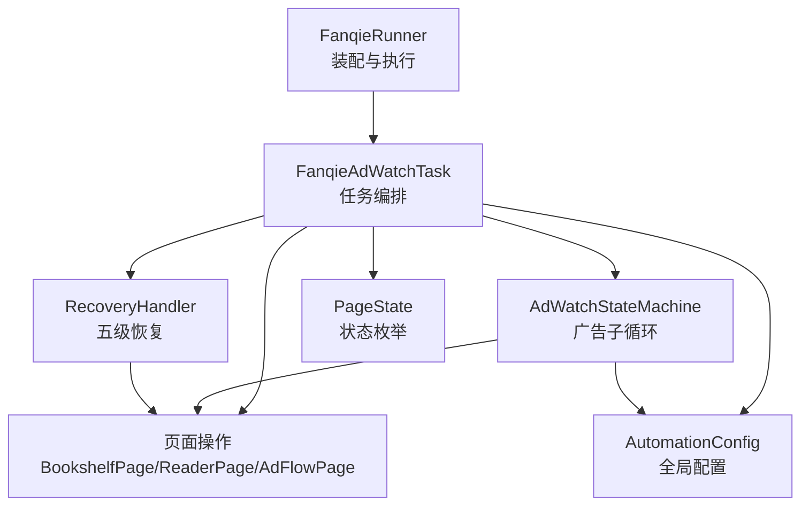
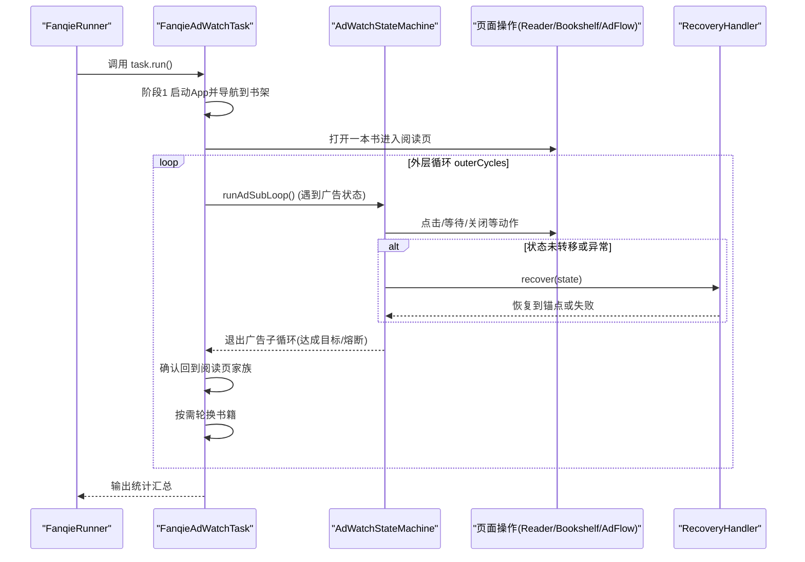
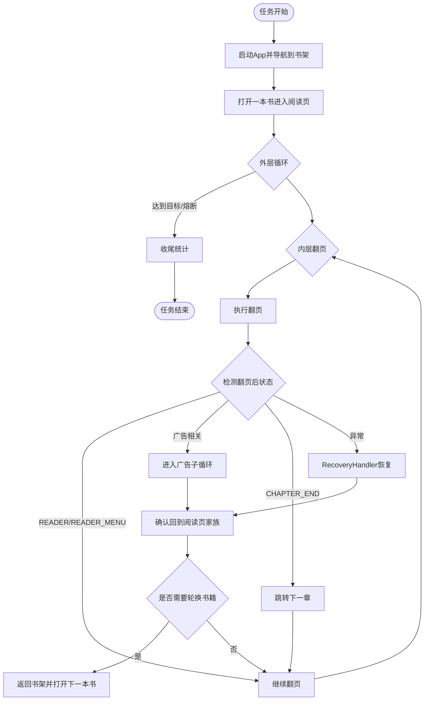
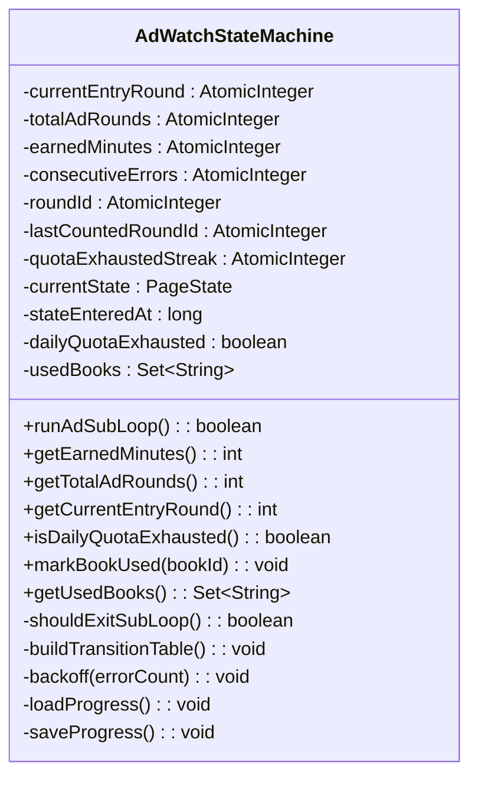
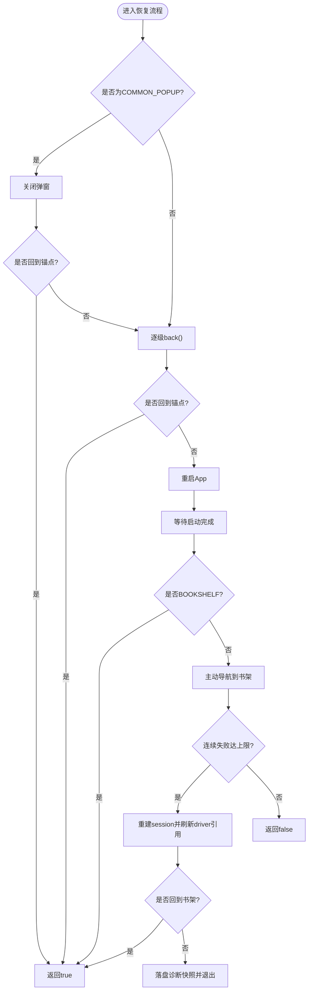
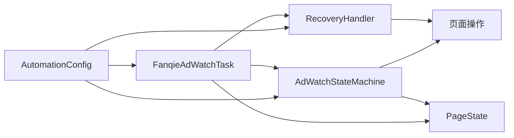

# 任务编排

<cite>
**本文引用的文件**
- [FanqieAdWatchTask.java](file://automation/src/main/java/com/fanqie/auto/task/FanqieAdWatchTask.java)
- [Task.java](file://automation/src/main/java/com/fanqie/auto/task/Task.java)
- [AdWatchStateMachine.java](file://automation/src/main/java/com/fanqie/auto/task/AdWatchStateMachine.java)
- [RecoveryHandler.java](file://automation/src/main/java/com/fanqie/auto/task/RecoveryHandler.java)
- [FanqieRunner.java](file://automation/src/main/java/com/fanqie/auto/FanqieRunner.java)
- [AutomationConfig.java](file://automation/src/main/java/com/fanqie/auto/config/AutomationConfig.java)
- [PageState.java](file://automation/src/main/java/com/fanqie/auto/core/PageState.java)
</cite>

## 目录
1. [简介](#简介)
2. [项目结构](#项目结构)
3. [核心组件](#核心组件)
4. [架构总览](#架构总览)
5. [详细组件分析](#详细组件分析)
6. [依赖关系分析](#依赖关系分析)
7. [性能与稳定性考量](#性能与稳定性考量)
8. [故障排查指南](#故障排查指南)
9. [结论](#结论)
10. [附录：配置与扩展指南](#附录配置与扩展指南)

## 简介
本文件围绕“番茄小说广告观看”任务的编排与执行，系统性说明 FanqieAdWatchTask 如何协调状态机、页面操作、恢复机制与配置策略，完成从启动 App、进入阅读页、翻页与广告子循环、到最终统计收尾的完整流程。文档同时解释 Task 接口的统一抽象与生命周期管理、调度策略（循环控制、进度管理、资源释放）、与状态机的集成方式（启动条件、状态监控、异常处理），以及关键配置参数与自定义任务扩展方法。

## 项目结构
- 入口与装配：FanqieRunner 负责解析命令行参数、环境自检、创建 Driver、装配各组件并执行主任务。
- 任务编排：FanqieAdWatchTask 实现 Task 接口，编排外层循环（轮次）与内层翻页，并在遇到广告或异常时交由 AdWatchStateMachine 与 RecoveryHandler 处理。
- 状态机：AdWatchStateMachine 以转移表驱动广告子循环，维护四重熔断、奖励计数幂等、每日配额去抖识别、进度持久化与断点续跑。
- 恢复机制：RecoveryHandler 提供五级自愈策略，确保任意失败回到已知锚点（书架/阅读页）。
- 配置中心：AutomationConfig 集中管理超时、轮次、阈值、翻页策略等所有可调参数。
- 状态枚举：PageState 定义页面状态集合，作为状态机驱动的核心语义。

图表来源
- [FanqieRunner.java:147-221](file://automation/src/main/java/com/fanqie/auto/FanqieRunner.java#L147-L221)
- [FanqieAdWatchTask.java:98-314](file://automation/src/main/java/com/fanqie/auto/task/FanqieAdWatchTask.java#L98-L314)
- [AdWatchStateMachine.java:173-312](file://automation/src/main/java/com/fanqie/auto/task/AdWatchStateMachine.java#L173-L312)
- [RecoveryHandler.java:100-253](file://automation/src/main/java/com/fanqie/auto/task/RecoveryHandler.java#L100-L253)
- [AutomationConfig.java:180-260](file://automation/src/main/java/com/fanqie/auto/config/AutomationConfig.java#L180-L260)
- [PageState.java:11-97](file://automation/src/main/java/com/fanqie/auto/core/PageState.java#L11-L97)

章节来源
- [FanqieRunner.java:41-239](file://automation/src/main/java/com/fanqie/auto/FanqieRunner.java#L41-L239)
- [FanqieAdWatchTask.java:20-41](file://automation/src/main/java/com/fanqie/auto/task/FanqieAdWatchTask.java#L20-L41)

## 核心组件
- Task 接口：统一抽象任务生命周期，仅暴露 run() 与 getName()，便于未来扩展到其他应用或任务类型。
- FanqieAdWatchTask：业务编排器，负责启动 App、导航到书架、打开书籍、外层循环控制、翻页与广告子循环调度、轮换书籍与收尾统计。
- AdWatchStateMachine：广告子循环的状态机，基于转移表驱动，维护轮次、分钟数、熔断、退避重试、进度持久化与每日配额识别。
- RecoveryHandler：五级恢复策略，保证任意失败回到已知锚点，必要时重建 session 并落盘诊断。
- AutomationConfig：集中式配置加载器，提供超时、轮次、阈值、翻页策略等全部可调参数。
- PageState：页面状态枚举，驱动状态机决策与跨层一致性判断（如阅读页家族、广告流程态）。

章节来源
- [Task.java:12-25](file://automation/src/main/java/com/fanqie/auto/task/Task.java#L12-L25)
- [FanqieAdWatchTask.java:42-96](file://automation/src/main/java/com/fanqie/auto/task/FanqieAdWatchTask.java#L42-L96)
- [AdWatchStateMachine.java:62-157](file://automation/src/main/java/com/fanqie/auto/task/AdWatchStateMachine.java#L62-L157)
- [RecoveryHandler.java:44-88](file://automation/src/main/java/com/fanqie/auto/task/RecoveryHandler.java#L44-L88)
- [AutomationConfig.java:18-108](file://automation/src/main/java/com/fanqie/auto/config/AutomationConfig.java#L18-L108)
- [PageState.java:11-97](file://automation/src/main/java/com/fanqie/auto/core/PageState.java#L11-L97)

## 架构总览
任务编排采用“编排器 + 状态机 + 恢复器”的分层设计：
- 编排器（FanqieAdWatchTask）负责宏观流程控制与边界条件（循环次数、翻页次数、熔断检查、书籍轮换）。
- 状态机（AdWatchStateMachine）负责微观广告流程推进，通过转移表对当前状态进行决策与动作，具备幂等性、退避重试与熔断保护。
- 恢复器（RecoveryHandler）兜底异常路径，逐级尝试关闭弹窗、返回、重启、导航、重建 session，保障系统鲁棒性。

图表来源
- [FanqieRunner.java:219-221](file://automation/src/main/java/com/fanqie/auto/FanqieRunner.java#L219-L221)
- [FanqieAdWatchTask.java:167-314](file://automation/src/main/java/com/fanqie/auto/task/FanqieAdWatchTask.java#L167-L314)
- [AdWatchStateMachine.java:173-312](file://automation/src/main/java/com/fanqie/auto/task/AdWatchStateMachine.java#L173-L312)
- [RecoveryHandler.java:100-253](file://automation/src/main/java/com/fanqie/auto/task/RecoveryHandler.java#L100-L253)

## 详细组件分析

### Task 接口与生命周期管理
- 统一抽象：Task 接口仅提供 run() 与 getName()，使核心引擎不依赖具体任务实现，便于扩展到其他应用或任务类型。
- 生命周期：
  - 初始化：FanqieRunner 装配配置、Driver、页面对象、状态机与恢复器后，构造 FanqieAdWatchTask。
  - 执行：task.run() 完成三个阶段——启动与导航、打开书籍进入阅读页、外层循环与翻页、广告子循环与收尾统计。
  - 清理：finally 中由 Runner 统一停止日志与退出 Driver，防止会话泄漏；状态机在退出时保存进度。

章节来源
- [Task.java:12-25](file://automation/src/main/java/com/fanqie/auto/task/Task.java#L12-L25)
- [FanqieRunner.java:147-239](file://automation/src/main/java/com/fanqie/auto/FanqieRunner.java#L147-L239)
- [FanqieAdWatchTask.java:98-314](file://automation/src/main/java/com/fanqie/auto/task/FanqieAdWatchTask.java#L98-L314)

### FanqieAdWatchTask：任务编排与调度策略
- 启动与导航：冷启 App，等待到达书架或中间状态（开屏广告、通用弹窗），必要时主动切换到书架 Tab。
- 选书与校准：循环选书，若误入视频/短剧页则返回首页并重新点击书架 Tab 换书；记录已试书籍避免重复。
- 外层循环：按 outerCycles 控制轮次，每轮开始前检查全局熔断（目标分钟、总轮次、墙钟预算、每日配额耗尽）。
- 内层翻页：按 pagesPerCycle 控制翻页次数，每次翻页后根据状态决策：
  - 正常阅读：继续翻页。
  - 广告相关：进入 AdWatchStateMachine 广告子循环，结束后确认回到阅读页家族，并按需轮换书籍。
  - 章节末尾：跳转下一章。
  - 异常状态：交由 RecoveryHandler 恢复，成功后确认回到阅读页家族。
- 底部广告入口检测：即使翻页后为阅读页，仍检测底部奖励入口并进入广告子循环。
- 收尾统计：输出累计免广告时长与总广告轮次。

图表来源
- [FanqieAdWatchTask.java:167-314](file://automation/src/main/java/com/fanqie/auto/task/FanqieAdWatchTask.java#L167-L314)
- [FanqieAdWatchTask.java:322-396](file://automation/src/main/java/com/fanqie/auto/task/FanqieAdWatchTask.java#L322-L396)
- [FanqieAdWatchTask.java:537-590](file://automation/src/main/java/com/fanqie/auto/task/FanqieAdWatchTask.java#L537-L590)

章节来源
- [FanqieAdWatchTask.java:98-314](file://automation/src/main/java/com/fanqie/auto/task/FanqieAdWatchTask.java#L98-L314)
- [FanqieAdWatchTask.java:322-623](file://automation/src/main/java/com/fanqie/auto/task/FanqieAdWatchTask.java#L322-L623)

### AdWatchStateMachine：广告子循环与状态机集成
- 转移表驱动：为每个 PageState 注册处理器，当前状态决定下一步动作，不假设固定步骤顺序。
- 四重熔断：
  - 目标分钟达成（主退出条件）。
  - 单入口视频轮次上限。
  - 全局视频轮次上限。
  - 墙钟时间预算耗尽。
- 幂等性与重试：动作前重新 detect() 确认状态，动作后校验是否发生预期转移；未转移则退避重试并累计连续错误，超限触发恢复。
- 奖励计数幂等：使用 roundId + lastCountedRoundId 保证每真实一轮至多计一次且不漏计；当无法提取奖励分钟数时按兜底值累加。
- 每日配额识别：连续多个 tick 命中配额文案且满足弹窗上下文约束，判定配额耗尽并优雅收尾。
- 进度持久化：每轮结束后保存 earnedMinutes、totalAdRounds、usedBooks 与更新时间戳，支持断点续跑与跨天清空 usedBooks。

图表来源
- [AdWatchStateMachine.java:62-157](file://automation/src/main/java/com/fanqie/auto/task/AdWatchStateMachine.java#L62-L157)
- [AdWatchStateMachine.java:173-312](file://automation/src/main/java/com/fanqie/auto/task/AdWatchStateMachine.java#L173-L312)
- [AdWatchStateMachine.java:355-394](file://automation/src/main/java/com/fanqie/auto/task/AdWatchStateMachine.java#L355-L394)
- [AdWatchStateMachine.java:679-734](file://automation/src/main/java/com/fanqie/auto/task/AdWatchStateMachine.java#L679-L734)

章节来源
- [AdWatchStateMachine.java:173-312](file://automation/src/main/java/com/fanqie/auto/task/AdWatchStateMachine.java#L173-L312)
- [AdWatchStateMachine.java:398-653](file://automation/src/main/java/com/fanqie/auto/task/AdWatchStateMachine.java#L398-L653)
- [AdWatchStateMachine.java:679-800](file://automation/src/main/java/com/fanqie/auto/task/AdWatchStateMachine.java#L679-L800)

### RecoveryHandler：五级恢复策略
- 第1级：COMMON_POPUP 关闭弹窗（按候选文案由弱到强尝试）。
- 第2级：逐级 back()，每次 back 后重新 detect() 确认是否回到锚点。
- 第3级：重启 App（terminateApp + activateApp），等待启动完成。
- 第4级：重启后若状态非 BOOKSHELF，主动导航到书架 Tab。
- 第5级：连续失败达上限时重建 session，刷新所有组件 driver 引用，再尝试回到书架。
- 安全底线：超过 maxRecoveryRetry 则停止并保留现场，绝不盲目连点；落盘诊断快照并标记会话死亡。

图表来源
- [RecoveryHandler.java:100-253](file://automation/src/main/java/com/fanqie/auto/task/RecoveryHandler.java#L100-L253)

章节来源
- [RecoveryHandler.java:100-253](file://automation/src/main/java/com/fanqie/auto/task/RecoveryHandler.java#L100-L253)

### 配置参数与运行周期
- 运行周期与翻页：
  - flow.outer.cycles：外层循环次数（默认 2）。
  - flow.pages.per.cycle：每轮翻页次数（默认 5）。
- 广告轮次与目标：
  - flow.max.ad.rounds.per.entry：单入口视频轮次上限（默认 4）。
  - flow.max.total.ad.rounds：全局视频轮次上限（默认 40）。
  - flow.target.free.minutes：目标免广告分钟数（默认 120）。
  - flow.reward.fallback.minutes：奖励兜底估值分钟数（默认 30）。
- 超时与心跳：
  - timing.poll.interval.ms：轮询间隔（默认 250ms）。
  - timing.state.detect.timeout.ms：状态检测超时（默认 3000ms）。
  - timing.action.timeout.ms：动作超时（默认 8000ms）。
  - timing.app.launch.timeout.ms：App 启动超时（默认 30000ms）。
  - timing.ad.video.timeout.ms：广告视频超时（默认 45000ms）。
  - timing.ad.close.ready.timeout.ms：广告可关闭超时（默认 15000ms）。
  - timing.max.state.dwell.ms：单状态滞留超时（默认 90000ms）。
  - timing.heartbeat.interval.sec：心跳间隔（默认 30s）。
- 其他：
  - flow.max.consecutive.errors：最大连续错误次数（默认 3）。
  - flow.max.recovery.retry：最大恢复重试次数（默认 3）。
  - reader.turn.strategy：翻页策略（tap/swipe）。
  - runtime.dry.run：干跑模式开关。

章节来源
- [AutomationConfig.java:180-260](file://automation/src/main/java/com/fanqie/auto/config/AutomationConfig.java#L180-L260)

## 依赖关系分析
- FanqieRunner 装配并注入各组件，形成依赖链：Driver → GestureSupport/StateDetector/WaitSupport → Page 层 → Task → StateMachine → RecoveryHandler。
- 状态机依赖页面操作与恢复器，恢复器依赖页面操作与 DriverFactory/DriverRegistry。
- 配置中心被所有组件共享，确保行为一致性与可配置性。
- 状态枚举 PageState 作为状态机驱动的核心语义，贯穿检测层与业务层。

图表来源
- [FanqieRunner.java:147-201](file://automation/src/main/java/com/fanqie/auto/FanqieRunner.java#L147-L201)
- [FanqieAdWatchTask.java:42-81](file://automation/src/main/java/com/fanqie/auto/task/FanqieAdWatchTask.java#L42-L81)
- [AdWatchStateMachine.java:62-157](file://automation/src/main/java/com/fanqie/auto/task/AdWatchStateMachine.java#L62-L157)
- [RecoveryHandler.java:44-88](file://automation/src/main/java/com/fanqie/auto/task/RecoveryHandler.java#L44-L88)
- [AutomationConfig.java:18-108](file://automation/src/main/java/com/fanqie/auto/config/AutomationConfig.java#L18-L108)
- [PageState.java:11-97](file://automation/src/main/java/com/fanqie/auto/core/PageState.java#L11-L97)

章节来源
- [FanqieRunner.java:147-201](file://automation/src/main/java/com/fanqie/auto/FanqieRunner.java#L147-L201)
- [FanqieAdWatchTask.java:42-81](file://automation/src/main/java/com/fanqie/auto/task/FanqieAdWatchTask.java#L42-L81)
- [AdWatchStateMachine.java:62-157](file://automation/src/main/java/com/fanqie/auto/task/AdWatchStateMachine.java#L62-L157)
- [RecoveryHandler.java:44-88](file://automation/src/main/java/com/fanqie/auto/task/RecoveryHandler.java#L44-L88)

## 性能与稳定性考量
- 幂等性：状态机在执行动作前重新 detect() 确认状态，避免“点了已经消失的按钮”；动作后校验状态转移，未转移则退避重试。
- 退避重试：连续错误时指数退避（500ms→1s→2s），降低瞬时抖动导致的失败放大。
- 熔断保护：四重熔断防止死循环空转，墙钟预算用于长跑场景优雅收尾。
- 进度持久化：每轮结束后保存进度，支持断点续跑与跨天清空 usedBooks，避免重复工作。
- 每日配额去抖：连续多个 tick 命中配额文案才判定，避免瞬时误判导致过早退出。
- 资源释放：Runner 统一 stop logger 与 quit driver，防止会话泄漏；恢复器在极端情况下落盘诊断并标记会话死亡。

[本节为通用指导，不直接分析具体文件]

## 故障排查指南
- 常见异常状态：UNKNOWN、RECOVERY_NEEDED、COMMON_POPUP，均交由 RecoveryHandler 恢复。
- 恢复失败定位：查看 RunLogger 输出的连续错误计数与错误记录（如 state_dwell_timeout、no_handler_*、handler_exception_*）。
- 进度文件：progress.properties 包含 earnedMinutes、totalAdRounds、usedBooks 与更新时间戳，可用于断点续跑与问题回溯。
- 日志关键字：
  - “熔断触发”：检查目标分钟、轮次上限、墙钟预算是否合理。
  - “每日配额耗尽”：检查 locators.dailyQuotaExhaustedTexts 与 commonDismissTexts/adCloseTexts 匹配情况。
  - “恢复失败”：检查弹窗文案候选集、back() 行为、重启与导航逻辑。

章节来源
- [AdWatchStateMachine.java:217-305](file://automation/src/main/java/com/fanqie/auto/task/AdWatchStateMachine.java#L217-L305)
- [RecoveryHandler.java:212-253](file://automation/src/main/java/com/fanqie/auto/task/RecoveryHandler.java#L212-L253)
- [AdWatchStateMachine.java:679-734](file://automation/src/main/java/com/fanqie/auto/task/AdWatchStateMachine.java#L679-L734)

## 结论
FanqieAdWatchTask 通过“编排器 + 状态机 + 恢复器”的分层架构，实现了稳定可靠的广告观看自动化流程。Task 接口提供统一抽象，状态机以转移表驱动并具备幂等性与熔断保护，恢复器提供五级自愈策略确保任意失败回到已知锚点。配置中心集中管理所有可调参数，支持灵活调整运行周期、页面数量、重试次数与超时策略。整体设计兼顾可扩展性、鲁棒性与可观测性，适合长期运行与持续优化。

[本节为总结，不直接分析具体文件]

## 附录：配置与扩展指南

### 配置示例（来自 AutomationConfig 默认值）
- 运行周期：outerCycles=2，pagesPerCycle=5。
- 广告轮次：maxAdRoundsPerEntry=4，maxTotalAdRounds=40，targetFreeMinutes=120。
- 超时：appLaunchTimeoutMs=30000，actionTimeoutMs=8000，adVideoTimeoutMs=45000，adCloseReadyTimeoutMs=15000，maxStateDwellMs=90000。
- 其他：rewardFallbackMinutes=30，maxConsecutiveErrors=3，maxRecoveryRetry=3，turnStrategy=tap。

章节来源
- [AutomationConfig.java:214-260](file://automation/src/main/java/com/fanqie/auto/config/AutomationConfig.java#L214-L260)

### 自定义任务扩展开发指南
- 实现 Task 接口：新增类实现 run() 与 getName()，遵循 FanqieAdWatchTask 的生命周期模式（初始化、执行、清理）。
- 装配与注册：在 FanqieRunner 中实例化新任务，并通过 DriverRegistry 注册 DriverAware 组件，确保 session 重建时 driver 引用同步更新。
- 复用组件：注入 AutomationConfig、LocatorRegistry、StateDetector、WaitSupport、GestureSupport、RunLogger 及页面操作对象，复用现有能力。
- 状态机集成：如需复杂流程，可参考 AdWatchStateMachine 的转移表设计与熔断策略，确保幂等性与退避重试。
- 恢复机制：集成 RecoveryHandler，确保任意失败回到已知锚点，必要时重建 session 并落盘诊断。

章节来源
- [Task.java:12-25](file://automation/src/main/java/com/fanqie/auto/task/Task.java#L12-L25)
- [FanqieRunner.java:147-201](file://automation/src/main/java/com/fanqie/auto/FanqieRunner.java#L147-L201)
- [AdWatchStateMachine.java:398-653](file://automation/src/main/java/com/fanqie/auto/task/AdWatchStateMachine.java#L398-L653)
- [RecoveryHandler.java:100-253](file://automation/src/main/java/com/fanqie/auto/task/RecoveryHandler.java#L100-L253)