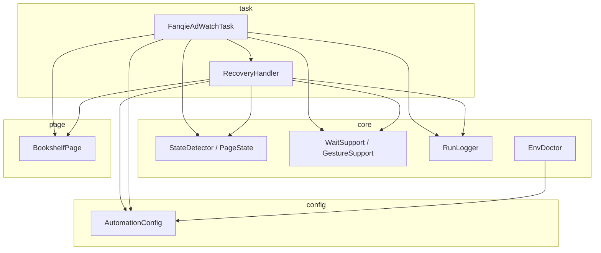
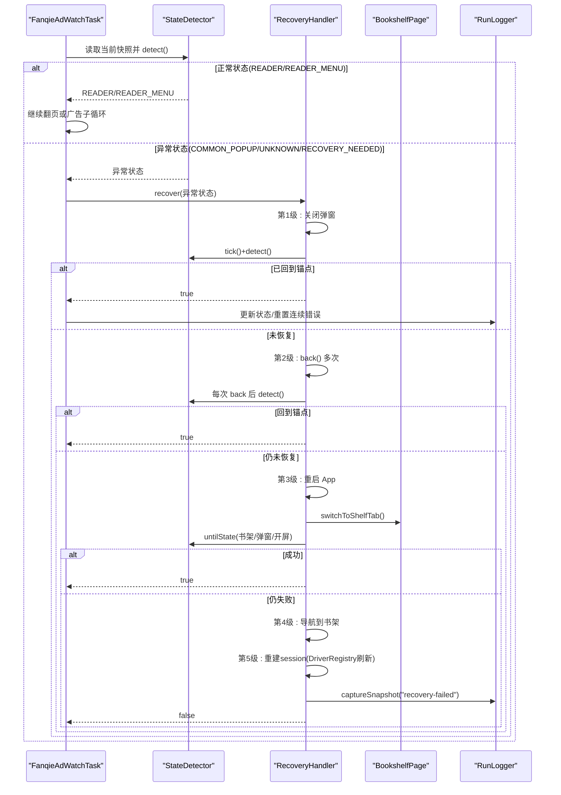
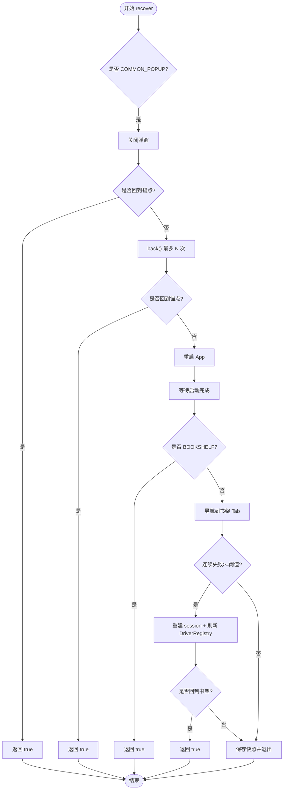
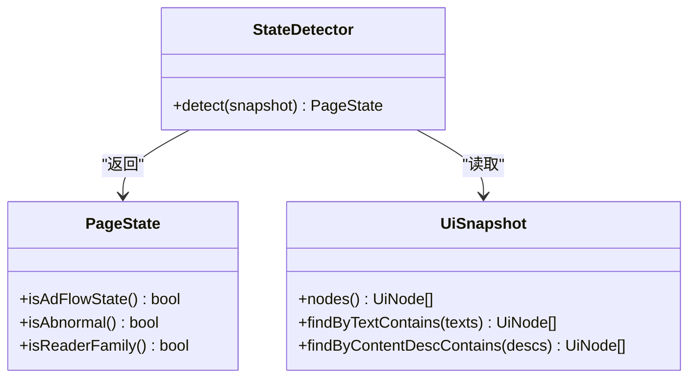
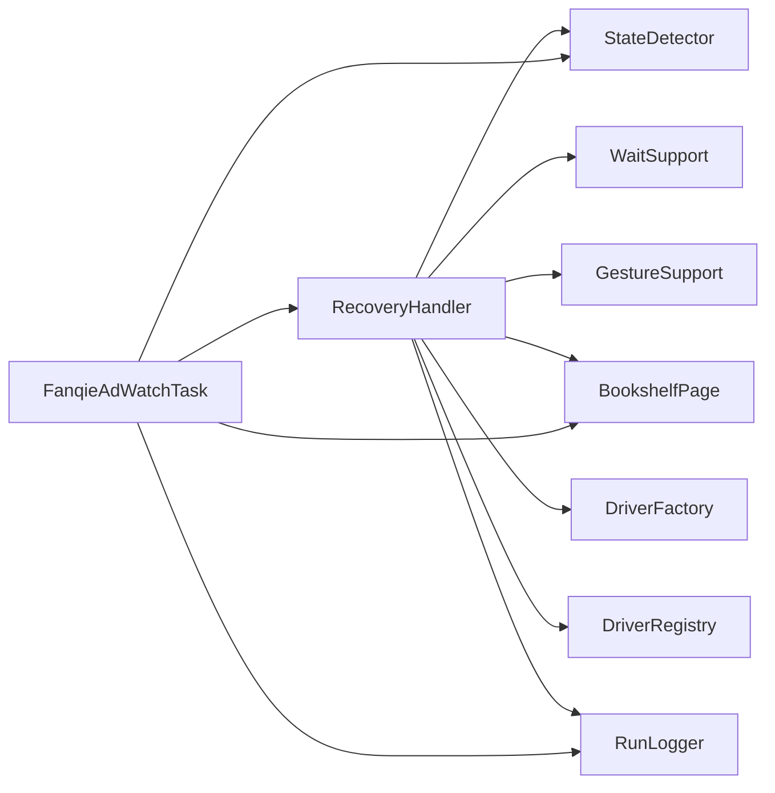

# 异常恢复

<cite>
**本文引用的文件**
- [RecoveryHandler.java](file://automation/src/main/java/com/fanqie/auto/task/RecoveryHandler.java)
- [FanqieAdWatchTask.java](file://automation/src/main/java/com/fanqie/auto/task/FanqieAdWatchTask.java)
- [PageState.java](file://automation/src/main/java/com/fanqie/auto/core/PageState.java)
- [AutomationConfig.java](file://automation/src/main/java/com/fanqie/auto/config/AutomationConfig.java)
- [RunLogger.java](file://automation/src/main/java/com/fanqie/auto/core/RunLogger.java)
- [BookshelfPage.java](file://automation/src/main/java/com/fanqie/auto/page/BookshelfPage.java)
- [EnvDoctor.java](file://automation/src/main/java/com/fanqie/auto/core/EnvDoctor.java)
- [StateDetectorTest.java](file://automation/src/test/java/com/fanqie/auto/core/StateDetectorTest.java)
</cite>

## 目录
1. [简介](#简介)
2. [项目结构](#项目结构)
3. [核心组件](#核心组件)
4. [架构总览](#架构总览)
5. [详细组件分析](#详细组件分析)
6. [依赖关系分析](#依赖关系分析)
7. [性能考量](#性能考量)
8. [故障诊断指南](#故障诊断指南)
9. [结论](#结论)
10. [附录](#附录)

## 简介
本文件围绕自动化任务中的“异常恢复机制”进行系统化说明，重点解释 RecoveryHandler 的多级恢复策略与错误检测、状态同步、进度保护等关键能力。文档覆盖五级恢复体系（弹窗关闭、页面导航、应用重启、设备重连、系统恢复），并提供错误分类表、恢复流程图、常见异常场景处理示例以及自定义恢复策略的开发方法。

## 项目结构
该自动化工程采用分层组织：
- core 层：状态机、快照、等待、手势、日志、环境自检等通用能力
- page 层：页面对象封装（书架、阅读器、广告流程）
- task 层：业务编排与恢复调度（任务执行、广告子循环、恢复触发点）
- config 层：全局配置加载与默认值兜底

图表来源
- [FanqieAdWatchTask.java:99-314](file://automation/src/main/java/com/fanqie/auto/task/FanqieAdWatchTask.java#L99-L314)
- [RecoveryHandler.java:100-253](file://automation/src/main/java/com/fanqie/auto/task/RecoveryHandler.java#L100-L253)
- [PageState.java:11-97](file://automation/src/main/java/com/fanqie/auto/core/PageState.java#L11-L97)
- [AutomationConfig.java:180-260](file://automation/src/main/java/com/fanqie/auto/config/AutomationConfig.java#L180-L260)
- [RunLogger.java:46-142](file://automation/src/main/java/com/fanqie/auto/core/RunLogger.java#L46-L142)
- [EnvDoctor.java:48-71](file://automation/src/main/java/com/fanqie/auto/core/EnvDoctor.java#L48-L71)

章节来源
- [FanqieAdWatchTask.java:99-314](file://automation/src/main/java/com/fanqie/auto/task/FanqieAdWatchTask.java#L99-L314)
- [RecoveryHandler.java:100-253](file://automation/src/main/java/com/fanqie/auto/task/RecoveryHandler.java#L100-L253)
- [PageState.java:11-97](file://automation/src/main/java/com/fanqie/auto/core/PageState.java#L11-L97)
- [AutomationConfig.java:180-260](file://automation/src/main/java/com/fanqie/auto/config/AutomationConfig.java#L180-L260)
- [RunLogger.java:46-142](file://automation/src/main/java/com/fanqie/auto/core/RunLogger.java#L46-L142)
- [EnvDoctor.java:48-71](file://automation/src/main/java/com/fanqie/auto/core/EnvDoctor.java#L48-L71)

## 核心组件
- RecoveryHandler：实现五级恢复策略，从弹窗关闭到重建 session，最终落盘诊断并退出，保证任意步骤失败都能回到已知锚点（READER/BOOKSHELF）。
- FanqieAdWatchTask：业务编排入口，在翻页、广告子循环、选书等环节遇到异常状态时调用 RecoveryHandler 进行恢复。
- PageState：定义所有页面状态及判定方法（如 isReaderFamily、isAbnormal），驱动状态机与恢复决策。
- AutomationConfig：集中管理超时、轮次、阈值等配置，避免魔法数字，支持外部覆盖。
- RunLogger：运行期可观测性（心跳保活、状态转移记录、截图与 XML 快照落盘、统计汇总）。
- BookshelfPage：提供书架切换、书籍打开、多本书轮换等能力，为恢复后重新进入阅读页提供支撑。
- EnvDoctor：启动前环境自检（adb、Appium Server、设备在线、App 安装），减少运行时异常。

章节来源
- [RecoveryHandler.java:23-43](file://automation/src/main/java/com/fanqie/auto/task/RecoveryHandler.java#L23-L43)
- [FanqieAdWatchTask.java:20-41](file://automation/src/main/java/com/fanqie/auto/task/FanqieAdWatchTask.java#L20-L41)
- [PageState.java:11-97](file://automation/src/main/java/com/fanqie/auto/core/PageState.java#L11-L97)
- [AutomationConfig.java:180-260](file://automation/src/main/java/com/fanqie/auto/config/AutomationConfig.java#L180-L260)
- [RunLogger.java:46-142](file://automation/src/main/java/com/fanqie/auto/core/RunLogger.java#L46-L142)
- [BookshelfPage.java:65-128](file://automation/src/main/java/com/fanqie/auto/page/BookshelfPage.java#L65-L128)
- [EnvDoctor.java:48-71](file://automation/src/main/java/com/fanqie/auto/core/EnvDoctor.java#L48-L71)

## 架构总览
下图展示了任务执行与恢复调用的整体流程，包括状态检测、异常分支、多级恢复与回退路径。

图表来源
- [FanqieAdWatchTask.java:197-314](file://automation/src/main/java/com/fanqie/auto/task/FanqieAdWatchTask.java#L197-L314)
- [RecoveryHandler.java:100-253](file://automation/src/main/java/com/fanqie/auto/task/RecoveryHandler.java#L100-L253)
- [BookshelfPage.java:65-128](file://automation/src/main/java/com/fanqie/auto/page/BookshelfPage.java#L65-L128)
- [RunLogger.java:239-261](file://automation/src/main/java/com/fanqie/auto/core/RunLogger.java#L239-L261)

## 详细组件分析

### RecoveryHandler 多级恢复策略
- 第1级：弹窗关闭（COMMON_POPUP）
  - 通过 LocatorRegistry.commonDismissTexts() 按“由弱到强”的顺序尝试关闭弹窗（先试无副作用文案，最后才试可能触发返回或确认的文案）。
  - 关闭后使用 detector.tick()+detect() 验证是否回到锚点（READER/BOOKSHELF）。
- 第2级：逐级 back()
  - 最多 maxRecoveryRetry 次，每次 back 后等待 UI 稳定并重新 detect；若遇到弹窗则再次尝试关闭。
- 第3级：重启 App
  - 调用 gestures.restartApp(appPackage)，等待启动完成（untilState 包含 BOOKSHELF/SPLASH_AD/COMMON_POPUP/APP_LAUNCHING）。
- 第4级：导航到书架
  - 若重启后非 BOOKSHELF，主动调用 BookshelfPage.switchToShelfTab() 确保落在书架。
- 第5级：重建 session
  - 当连续失败达到 maxConsecutiveErrors 时，通过 DriverFactory.recreate() 重建 session，并使用 DriverRegistry.refreshAll(newDriver) 刷新所有组件引用，防止旧 driver 导致 NoSuchSessionException。
- 安全底线：超过 maxRecoveryRetry 停止并保留现场（截图+XML快照），绝不盲目连点。

图表来源
- [RecoveryHandler.java:100-253](file://automation/src/main/java/com/fanqie/auto/task/RecoveryHandler.java#L100-L253)
- [AutomationConfig.java:254-260](file://automation/src/main/java/com/fanqie/auto/config/AutomationConfig.java#L254-L260)

章节来源
- [RecoveryHandler.java:100-253](file://automation/src/main/java/com/fanqie/auto/task/RecoveryHandler.java#L100-L253)
- [AutomationConfig.java:254-260](file://automation/src/main/java/com/fanqie/auto/config/AutomationConfig.java#L254-L260)

### 错误检测机制
- 状态识别基于 UiSnapshot 与 StateDetector.detect()，将 UI 节点映射到 PageState。
- 关键状态：
  - 异常状态：UNKNOWN、COMMON_POPUP、RECOVERY_NEEDED
  - 广告相关：AD_ENTRY_PROMPT、AD_CONFIRM_DIALOG、AD_VIDEO_PLAYING、AD_CLOSE_READY、AD_CONTINUE_PROMPT、AD_REWARD_GRANTED
  - 阅读家族：READER、READER_MENU（可自愈子态）
  - 其他：BOOKSHELF、SPLASH_AD、APP_LAUNCHING、CHAPTER_END
- 测试覆盖多种边界情况（全屏开屏广告、带跳过文案但存在右上角关闭、纯文案兜底收窄、节点极少判定为 APP_LAUNCHING、畸形快照返回 UNKNOWN）。

图表来源
- [PageState.java:11-97](file://automation/src/main/java/com/fanqie/auto/core/PageState.java#L11-L97)
- [StateDetectorTest.java:52-153](file://automation/src/test/java/com/fanqie/auto/core/StateDetectorTest.java#L52-L153)

章节来源
- [PageState.java:11-97](file://automation/src/main/java/com/fanqie/auto/core/PageState.java#L11-L97)
- [StateDetectorTest.java:52-153](file://automation/src/test/java/com/fanqie/auto/core/StateDetectorTest.java#L52-L153)

### 恢复策略选择逻辑
- 根据当前检测到的异常状态决定恢复路径：
  - COMMON_POPUP → 优先弹窗关闭
  - UNKNOWN/RECOVERY_NEEDED → 直接 back() 多级尝试
  - 若 back() 无效 → 重启 App → 导航到书架 → 重建 session
- 选择依据：
  - 最小副作用优先（弹窗关闭 > back > 重启 > 重建）
  - 配置阈值控制（maxRecoveryRetry、maxConsecutiveErrors）
  - 状态白名单校验（仅认可 READER/BOOKSHELF 为有效锚点）

章节来源
- [RecoveryHandler.java:100-253](file://automation/src/main/java/com/fanqie/auto/task/RecoveryHandler.java#L100-L253)
- [AutomationConfig.java:254-260](file://automation/src/main/java/com/fanqie/auto/config/AutomationConfig.java#L254-L260)

### 状态同步与进度保护
- 状态同步：
  - 每次恢复步骤后调用 detector.tick()+detect() 确认当前状态
  - 通过 RunLogger.updateState() 记录状态转移，便于追踪
- 进度保护：
  - 连续错误计数 consecutiveFailures 跨 recover 调用累积
  - 成功恢复后重置 consecutiveFailures 与 logger 的连续错误计数
  - 多本书轮换时标记已用书籍，避免重复消耗同一入口
  - 墙钟时间预算耗尽优雅收尾，防止无限占用设备

章节来源
- [RecoveryHandler.java:100-253](file://automation/src/main/java/com/fanqie/auto/task/RecoveryHandler.java#L100-L253)
- [FanqieAdWatchTask.java:527-590](file://automation/src/main/java/com/fanqie/auto/task/FanqieAdWatchTask.java#L527-L590)
- [RunLogger.java:144-197](file://automation/src/main/java/com/fanqie/auto/core/RunLogger.java#L144-L197)

### 常见异常场景与处理示例
- 弹窗遮挡（青少年模式/权限/登录/更新提示/网络异常）
  - 处理：dismissPopup() 按候选文案由弱到强点击关闭
- 页面层级错乱（误入视频/短剧页）
  - 处理：backHomeAndReopenShelf() 返回首页并强制切书架 Tab
- 章节末尾跳转失败
  - 处理：goNextChapter() 失败后 recover(CHAPTER_END) 并 ensureBackToReader()
- 广告子循环异常退出
  - 处理：recover(广告状态) 后 ensureBackToReader()
- 会话断开/驱动失效
  - 处理：重建 session 并通过 DriverRegistry.refreshAll() 刷新所有组件引用

章节来源
- [RecoveryHandler.java:269-321](file://automation/src/main/java/com/fanqie/auto/task/RecoveryHandler.java#L269-L321)
- [FanqieAdWatchTask.java:398-501](file://automation/src/main/java/com/fanqie/auto/task/FanqieAdWatchTask.java#L398-L501)
- [FanqieAdWatchTask.java:592-623](file://automation/src/main/java/com/fanqie/auto/task/FanqieAdWatchTask.java#L592-L623)

### 自定义恢复策略开发方法
- 扩展弹窗关闭策略：
  - 在 LocatorRegistry 中新增 commonDismissTexts() 候选文案，保持“由弱到强”顺序
- 新增页面导航动作：
  - 在 BookshelfPage 或 ReaderPage 中封装具体操作（如 switchToShelfTab、goNextChapter）
- 调整恢复阈值：
  - 通过 AutomationConfig 修改 maxRecoveryRetry、maxConsecutiveErrors、appLaunchTimeoutMs 等
- 增强状态检测：
  - 在 StateDetector 中增加新的 PageState 分支与判定规则，并在测试中覆盖用例
- 集成日志与快照：
  - 在关键恢复节点调用 RunLogger.captureSnapshot(tag) 保存现场

章节来源
- [AutomationConfig.java:180-260](file://automation/src/main/java/com/fanqie/auto/config/AutomationConfig.java#L180-L260)
- [RunLogger.java:239-261](file://automation/src/main/java/com/fanqie/auto/core/RunLogger.java#L239-L261)
- [StateDetectorTest.java:52-153](file://automation/src/test/java/com/fanqie/auto/core/StateDetectorTest.java#L52-L153)

## 依赖关系分析
- RecoveryHandler 依赖：
  - StateDetector：状态检测
  - WaitSupport/GestureSupport：等待与手势操作
  - BookshelfPage：导航到书架
  - DriverFactory/DriverRegistry：重建 session 与刷新引用
  - RunLogger：日志与快照
- FanqieAdWatchTask 依赖：
  - 上述组件以及 AdWatchStateMachine（广告子循环）
- 配置依赖：
  - AutomationConfig 提供全部阈值与超时参数

图表来源
- [RecoveryHandler.java:44-76](file://automation/src/main/java/com/fanqie/auto/task/RecoveryHandler.java#L44-L76)
- [FanqieAdWatchTask.java:42-81](file://automation/src/main/java/com/fanqie/auto/task/FanqieAdWatchTask.java#L42-L81)

章节来源
- [RecoveryHandler.java:44-76](file://automation/src/main/java/com/fanqie/auto/task/RecoveryHandler.java#L44-L76)
- [FanqieAdWatchTask.java:42-81](file://automation/src/main/java/com/fanqie/auto/task/FanqieAdWatchTask.java#L42-L81)

## 性能考量
- 状态检测开销：
  - 每次 recover/back/restart 后都会 tick()+detect()，需关注 UI 树大小与解析耗时
  - RunLogger 记录 detect 耗时与 XML 体积，用于监控膨胀风险
- 重试与超时：
  - maxRecoveryRetry 控制 back() 次数，避免无限重试
  - appLaunchTimeoutMs 控制重启等待时长，避免长时间阻塞
- 心跳保活：
  - RunLogger 每 heartbeatIntervalSec 秒执行轻量命令保活，防止 newCommandTimeout 触发

[本节为通用指导，不直接分析具体文件]

## 故障诊断指南
- 启动前环境检查：
  - 使用 EnvDoctor.checkAll() 验证 adb、Appium Server、设备在线、App 安装
  - 任一硬性检查失败会输出中文处置指引
- 运行期可观测性：
  - RunLogger 心跳摘要包含状态、轮次、页数、连续错误、XML 体积等
  - 异常/恢复时自动保存截图与 XML 快照到 automation/logs/snapshots/
- 常见问题定位：
  - 弹窗无法关闭：检查 commonDismissTexts 是否覆盖新文案
  - 无法回到书架：检查 switchToShelfTab() 降级链与底部手势区避让
  - 会话断开：检查 DriverRegistry.refreshAll() 是否成功刷新引用
  - 状态误判：检查 StateDetector 分支优先级与 fixture 测试覆盖

章节来源
- [EnvDoctor.java:48-71](file://automation/src/main/java/com/fanqie/auto/core/EnvDoctor.java#L48-L71)
- [RunLogger.java:144-197](file://automation/src/main/java/com/fanqie/auto/core/RunLogger.java#L144-L197)
- [RunLogger.java:239-261](file://automation/src/main/java/com/fanqie/auto/core/RunLogger.java#L239-L261)

## 结论
RecoveryHandler 通过五级恢复体系实现了从弹窗关闭到系统恢复的全链路自愈能力，结合 PageState 状态机与 RunLogger 可观测性，确保自动化任务在复杂真实环境中具备高鲁棒性。通过合理配置阈值、完善弹窗文案库与状态检测规则，可进一步提升恢复成功率与稳定性。

[本节为总结性内容，不直接分析具体文件]

## 附录

### 错误分类表
- 状态异常：
  - UNKNOWN：无法识别页面
  - RECOVERY_NEEDED：需要恢复（连续错误超限、session 断开）
- 操作失败：
  - CHAPTER_END：章节末尾跳转失败
  - AD_*：广告流程各阶段异常
- 网络错误：
  - 通常表现为 COMMON_POPUP（网络异常提示），通过弹窗关闭策略处理

章节来源
- [PageState.java:11-97](file://automation/src/main/java/com/fanqie/auto/core/PageState.java#L11-L97)
- [RecoveryHandler.java:269-321](file://automation/src/main/java/com/fanqie/auto/task/RecoveryHandler.java#L269-L321)

### 恢复流程图（代码级）
见上文“RecoveryHandler 多级恢复策略”中的 flowchart 图。

### 类关系图（代码级）
见上文“错误检测机制”中的 classDiagram 图。