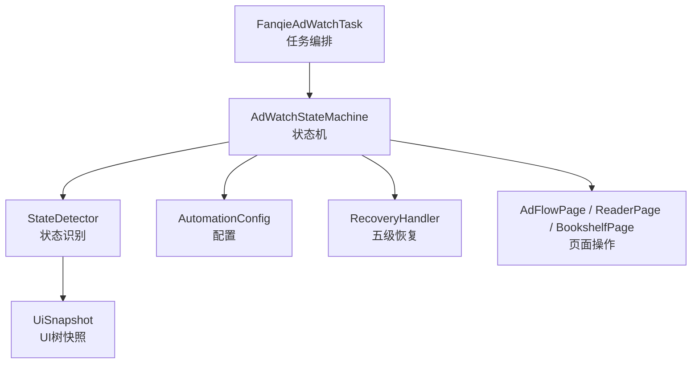
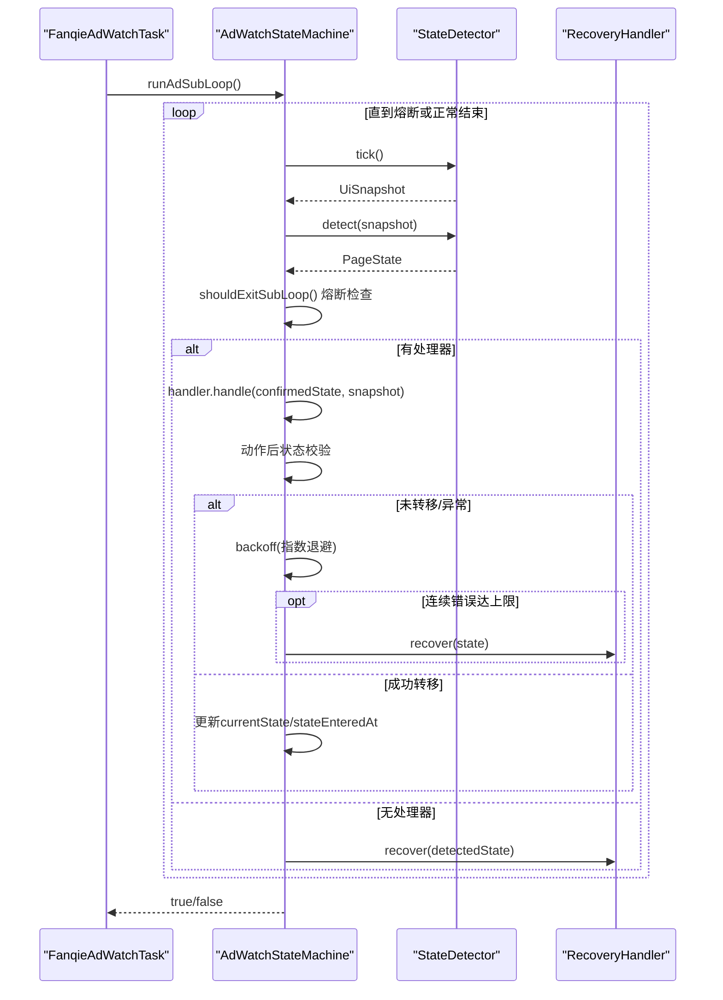
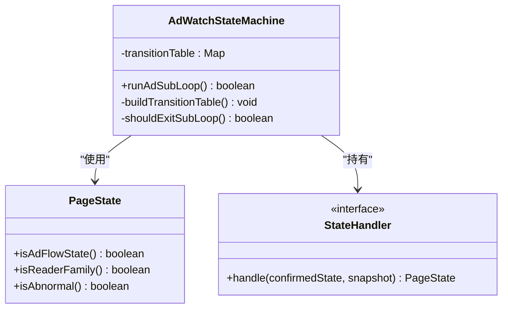
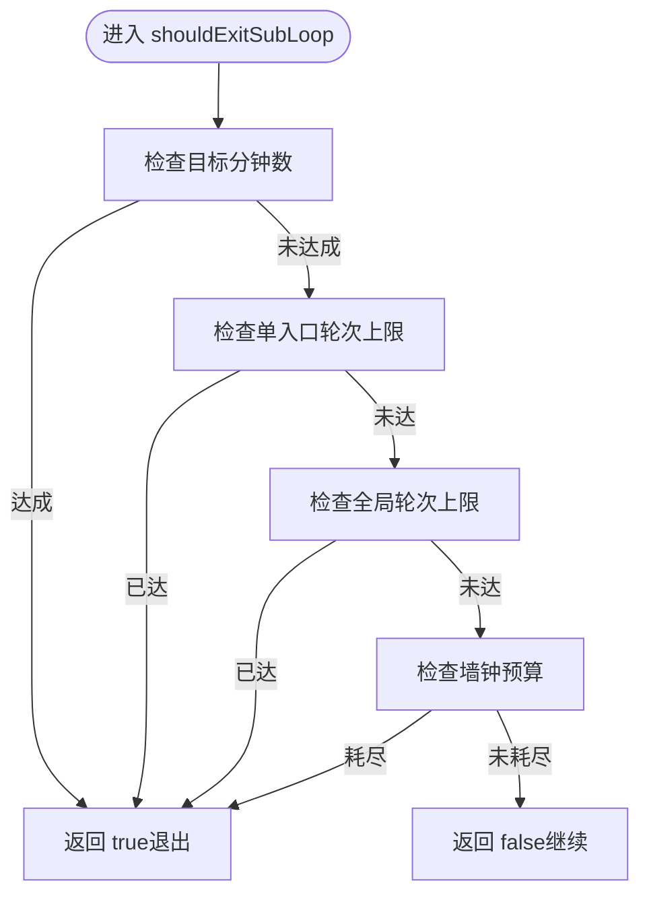
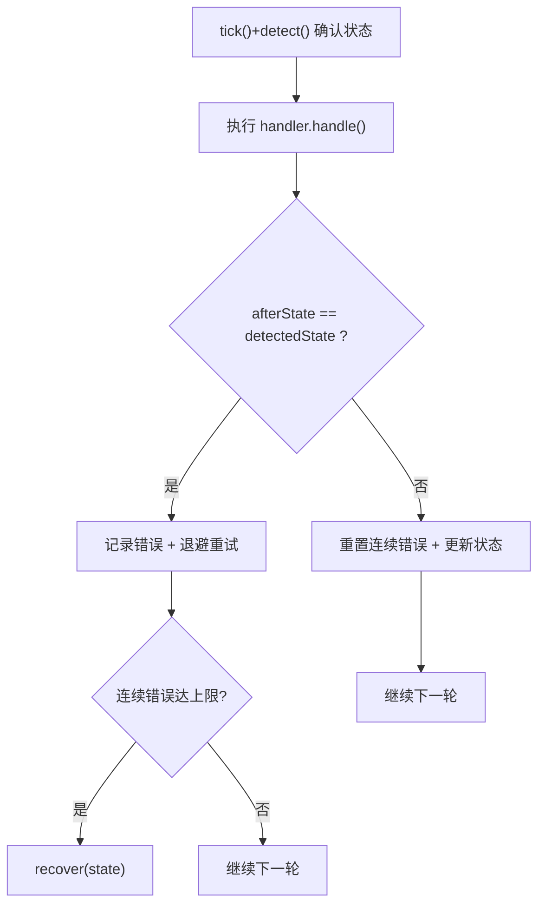
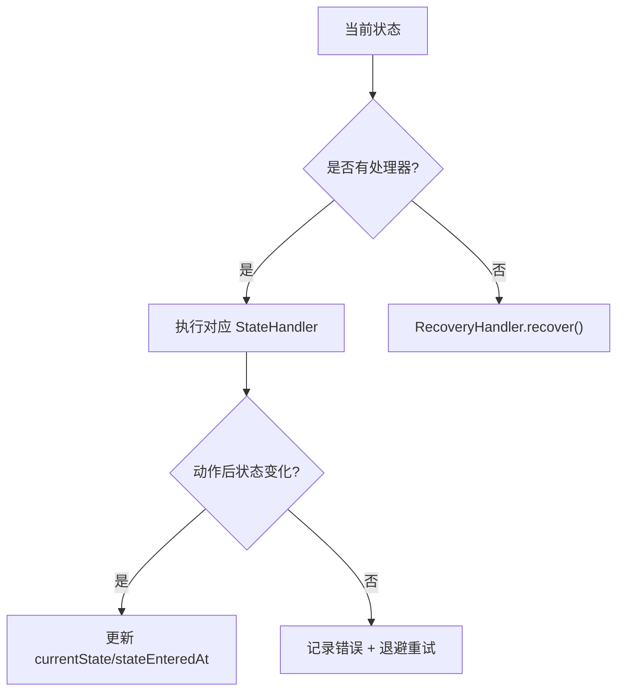
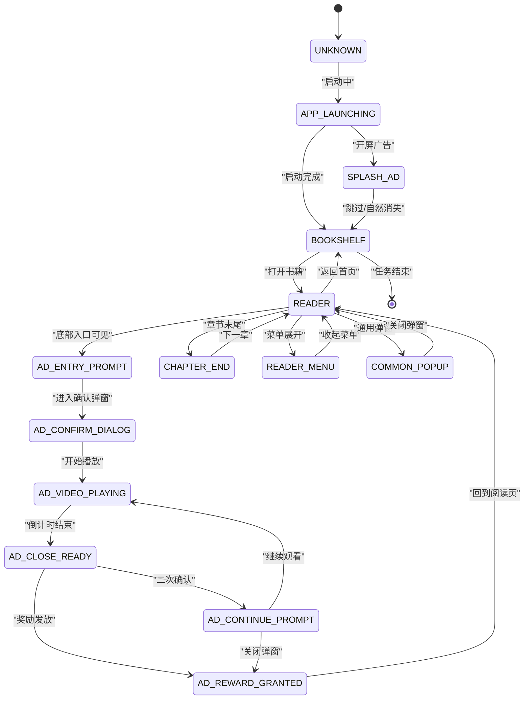
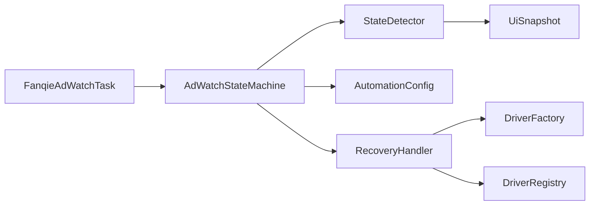

# 状态机设计

<cite>
**本文引用的文件**
- [AdWatchStateMachine.java](file://automation/src/main/java/com/fanqie/auto/task/AdWatchStateMachine.java)
- [PageState.java](file://automation/src/main/java/com/fanqie/auto/core/PageState.java)
- [FanqieAdWatchTask.java](file://automation/src/main/java/com/fanqie/auto/task/FanqieAdWatchTask.java)
- [StateDetector.java](file://automation/src/main/java/com/fanqie/auto/core/StateDetector.java)
- [AutomationConfig.java](file://automation/src/main/java/com/fanqie/auto/config/AutomationConfig.java)
- [RecoveryHandler.java](file://automation/src/main/java/com/fanqie/auto/task/RecoveryHandler.java)
- [AdWatchStateMachineTest.java](file://automation/src/test/java/com/fanqie/auto/task/AdWatchStateMachineTest.java)
</cite>

## 目录
1. [简介](#简介)
2. [项目结构](#项目结构)
3. [核心组件](#核心组件)
4. [架构总览](#架构总览)
5. [详细组件分析](#详细组件分析)
6. [依赖关系分析](#依赖关系分析)
7. [性能考量](#性能考量)
8. [故障排查指南](#故障排查指南)
9. [结论](#结论)
10. [附录：扩展新状态处理器示例](#附录：扩展新状态处理器示例)

## 简介
本文件围绕 AdWatchStateMachine 的状态机设计，系统性阐述其“转移表驱动”的核心模式、四重熔断机制、幂等性保证、错误恢复与可观测性。该状态机以当前页面状态为驱动，不假设固定步骤顺序，通过 Map<PageState, StateHandler> 的转移表将每个状态的处置逻辑解耦；配合 StateDetector 的高性能状态识别、RecoveryHandler 的五级自愈策略以及 AutomationConfig 的可配置阈值，实现稳定、可观测、可扩展的广告观看自动化流程。

## 项目结构
- 任务编排层：FanqieAdWatchTask 负责启动 App、进入阅读页、翻页循环、遇到广告态时委派给状态机处理，并在子循环结束后确保回到阅读页家族。
- 状态机核心：AdWatchStateMachine 维护当前状态、进度计数、转移表、熔断判定、幂等校验与退避重试。
- 状态识别：StateDetector 基于 UiSnapshot 进行高性能、确定性优先级的状态识别（resource-id → text → content-desc → APP_LAUNCHING → 几何特征 → UNKNOWN）。
- 配置中心：AutomationConfig 集中管理超时、轮次上限、目标分钟数、墙钟预算等所有阈值。
- 恢复机制：RecoveryHandler 提供五级恢复策略，从关闭弹窗到重建 session，最终落盘诊断。

图表来源
- [FanqieAdWatchTask.java:98-314](file://automation/src/main/java/com/fanqie/auto/task/FanqieAdWatchTask.java#L98-L314)
- [AdWatchStateMachine.java:120-653](file://automation/src/main/java/com/fanqie/auto/task/AdWatchStateMachine.java#L120-L653)
- [StateDetector.java:97-170](file://automation/src/main/java/com/fanqie/auto/core/StateDetector.java#L97-L170)
- [AutomationConfig.java:180-260](file://automation/src/main/java/com/fanqie/auto/config/AutomationConfig.java#L180-L260)
- [RecoveryHandler.java:100-253](file://automation/src/main/java/com/fanqie/auto/task/RecoveryHandler.java#L100-L253)

章节来源
- [FanqieAdWatchTask.java:98-314](file://automation/src/main/java/com/fanqie/auto/task/FanqieAdWatchTask.java#L98-L314)
- [AdWatchStateMachine.java:120-653](file://automation/src/main/java/com/fanqie/auto/task/AdWatchStateMachine.java#L120-L653)
- [StateDetector.java:97-170](file://automation/src/main/java/com/fanqie/auto/core/StateDetector.java#L97-L170)
- [AutomationConfig.java:180-260](file://automation/src/main/java/com/fanqie/auto/config/AutomationConfig.java#L180-L260)
- [RecoveryHandler.java:100-253](file://automation/src/main/java/com/fanqie/auto/task/RecoveryHandler.java#L100-L253)

## 核心组件
- PageState 枚举：定义所有页面状态及业务语义（如是否属于广告流程、是否属于阅读页家族、是否异常等），是状态机的驱动基础。
- StateHandler 函数式接口：统一封装各状态的处置逻辑，返回处理后实际状态，供主循环判断是否需要重新决策。
- 转移表 transitionTable：Map<PageState, StateHandler>，在构造时构建，将状态与处理器一一映射，支持任意状态跳变被吸收。
- 进度与熔断：currentEntryRound、totalAdRounds、earnedMinutes、roundId/lastCountedRoundId、dailyQuotaExhausted、stateEnteredAt 等原子变量与标志位，支撑四重熔断与幂等计数。
- 状态识别 StateDetector：高性能 tick() + detect()，同一 tick 内复用快照，按优先级匹配状态，避免 RPC 风暴。
- 恢复 RecoveryHandler：五级恢复策略，从弹窗关闭到重建 session，保障任意失败回归锚点。
- 配置 AutomationConfig：集中化阈值，包括目标分钟、单入口轮次上限、全局轮次上限、最大滞留时间、墙钟预算等。

章节来源
- [PageState.java:11-97](file://automation/src/main/java/com/fanqie/auto/core/PageState.java#L11-L97)
- [AdWatchStateMachine.java:120-131](file://automation/src/main/java/com/fanqie/auto/task/AdWatchStateMachine.java#L120-L131)
- [AdWatchStateMachine.java:79-119](file://automation/src/main/java/com/fanqie/auto/task/AdWatchStateMachine.java#L79-L119)
- [StateDetector.java:97-170](file://automation/src/main/java/com/fanqie/auto/core/StateDetector.java#L97-L170)
- [RecoveryHandler.java:100-253](file://automation/src/main/java/com/fanqie/auto/task/RecoveryHandler.java#L100-L253)
- [AutomationConfig.java:216-260](file://automation/src/main/java/com/fanqie/auto/config/AutomationConfig.java#L216-L260)

## 架构总览
状态机采用“转移表驱动 + 幂等校验 + 熔断保护”的设计：
- 每轮循环先 tick() 获取 UI 快照，再 detect() 得到当前状态。
- 根据转移表找到对应 StateHandler 执行动作，并校验动作后状态是否发生预期转移。
- 若未转移或异常，记录错误、退避重试，达到连续错误上限则触发恢复。
- 每次动作前已重新 detect() 确认状态未漂移，保证幂等性。
- 四重熔断任一触发即退出广告子循环，防止死循环空转。

图表来源
- [AdWatchStateMachine.java:173-312](file://automation/src/main/java/com/fanqie/auto/task/AdWatchStateMachine.java#L173-L312)
- [StateDetector.java:97-170](file://automation/src/main/java/com/fanqie/auto/core/StateDetector.java#L97-L170)
- [RecoveryHandler.java:100-253](file://automation/src/main/java/com/fanqie/auto/task/RecoveryHandler.java#L100-L253)

## 详细组件分析

### 转移表驱动与 StateHandler 模式
- 转移表构建：在构造函数中调用 buildTransitionTable()，将每个 PageState 与其对应的 StateHandler lambda 注册到 EnumMap。
- StateHandler 接口：handle(confirmedState, snapshot) 返回处理后实际状态，供主循环判断是否需要重新决策。
- 处理器职责分离：每个状态只关注自身动作（点击、等待、跳转），不关心全局流程，便于扩展与维护。

图表来源
- [AdWatchStateMachine.java:120-131](file://automation/src/main/java/com/fanqie/auto/task/AdWatchStateMachine.java#L120-L131)
- [AdWatchStateMachine.java:398-653](file://automation/src/main/java/com/fanqie/auto/task/AdWatchStateMachine.java#L398-L653)
- [PageState.java:11-97](file://automation/src/main/java/com/fanqie/auto/core/PageState.java#L11-L97)

章节来源
- [AdWatchStateMachine.java:398-653](file://automation/src/main/java/com/fanqie/auto/task/AdWatchStateMachine.java#L398-L653)

### 四重熔断机制
- 熔断 1：目标分钟数达成（主退出条件）—— earnedMinutes >= targetFreeMinutes。
- 熔断 2：单入口视频轮次达上限 —— currentEntryRound >= maxAdRoundsPerEntry。
- 熔断 3：全局视频轮次达上限 —— totalAdRounds >= maxTotalAdRounds。
- 熔断 4：单状态滞留超时 —— dwellMs > maxStateDwellMs（在主循环中单独检测，此处不重复）。
- 额外熔断（墙钟预算）：elapsedMs >= maxWallClockMs（用于长跑优雅收尾）。

图表来源
- [AdWatchStateMachine.java:355-394](file://automation/src/main/java/com/fanqie/auto/task/AdWatchStateMachine.java#L355-L394)
- [AutomationConfig.java:216-260](file://automation/src/main/java/com/fanqie/auto/config/AutomationConfig.java#L216-L260)

章节来源
- [AdWatchStateMachine.java:355-394](file://automation/src/main/java/com/fanqie/auto/task/AdWatchStateMachine.java#L355-L394)
- [AutomationConfig.java:216-260](file://automation/src/main/java/com/fanqie/auto/config/AutomationConfig.java#L216-L260)

### 幂等性保证机制
- 动作前状态确认：每次执行 handler.handle() 前已通过 detector.tick() + detect() 确认当前状态未漂移。
- 动作后状态验证：handler 返回 afterState，若 afterState == detectedState 视为未转移，计入连续错误并退避重试；达到上限则触发恢复。
- 奖励计数幂等：AD_REWARD_GRANTED 中使用 roundId + lastCountedRoundId 保证“每真实一轮至多计一次且不漏计”，覆盖 CONFIRM→VIDEO→REWARD 的分流路径。

图表来源
- [AdWatchStateMachine.java:254-302](file://automation/src/main/java/com/fanqie/auto/task/AdWatchStateMachine.java#L254-L302)
- [AdWatchStateMachine.java:561-595](file://automation/src/main/java/com/fanqie/auto/task/AdWatchStateMachine.java#L561-L595)

章节来源
- [AdWatchStateMachine.java:254-302](file://automation/src/main/java/com/fanqie/auto/task/AdWatchStateMachine.java#L254-L302)
- [AdWatchStateMachine.java:561-595](file://automation/src/main/java/com/fanqie/auto/task/AdWatchStateMachine.java#L561-L595)

### 状态处理器实现模式（关键状态）
- APP_LAUNCHING：心跳等待启动完成，等待到达 BOOKSHELF/SPLASH_AD/COMMON_POPPUP。
- SPLASH_AD：优先尝试「跳过」按钮，否则降级 clickClose()；不计入广告轮次。
- BOOKSHELF：打开下一本未使用的书籍，若无可用则打开任意一本；成功后标记 usedBooks。
- AD_ENTRY_PROMPT：点击底部广告入口，等待进入 AD_CONFIRM_DIALOG/AD_VIDEO_PLAYING/AD_CLOSE_READY/READER。
- AD_CONFIRM_DIALOG：点击「观看广告」，递增 roundId，等待进入视频播放或关闭就绪。
- AD_VIDEO_PLAYING：不做任何操作，等待倒计时结束；递增 roundId 保证每轮至少递增一次。
- AD_CLOSE_READY：点击「关闭」，成功后才递增 currentEntryRound/totalAdRounds，等待后续状态。
- AD_CONTINUE_PROMPT：根据熔断条件决定是否继续观看；否则关闭弹窗退出。
- AD_REWARD_GRANTED：读取奖励分钟数（含兜底估值），关闭弹窗，等待 READER/AD_CONTINUE_PROMPT/AD_ENTRY_PROMPT。
- CHAPTER_END：跳转到下一章。
- COMMON_POPUP：交由 RecoveryHandler 关闭弹窗。
- READER_MENU：点击正文区域收起菜单，必要时 systemBack() 收起。
- UNKNOWN/RECOVERY_NEEDED：交由 RecoveryHandler 恢复。

图表来源
- [AdWatchStateMachine.java:398-653](file://automation/src/main/java/com/fanqie/auto/task/AdWatchStateMachine.java#L398-L653)

章节来源
- [AdWatchStateMachine.java:398-653](file://automation/src/main/java/com/fanqie/auto/task/AdWatchStateMachine.java#L398-L653)

### 状态转换图（代码级）

图表来源
- [PageState.java:11-97](file://automation/src/main/java/com/fanqie/auto/core/PageState.java#L11-L97)
- [AdWatchStateMachine.java:398-653](file://automation/src/main/java/com/fanqie/auto/task/AdWatchStateMachine.java#L398-L653)

## 依赖关系分析
- FanqieAdWatchTask 依赖 AdWatchStateMachine 执行广告子循环，并在子循环结束后确保回到阅读页家族。
- AdWatchStateMachine 依赖 StateDetector 进行状态识别，依赖 AutomationConfig 获取阈值，依赖 RecoveryHandler 进行恢复。
- StateDetector 依赖 LocatorRegistry 提供的文案/正则/资源 id 候选集，依赖 UiSnapshot 进行内存匹配。
- RecoveryHandler 依赖 DriverFactory/DriverRegistry 进行 session 重建，依赖 GestureSupport 执行手势操作。

图表来源
- [FanqieAdWatchTask.java:98-314](file://automation/src/main/java/com/fanqie/auto/task/FanqieAdWatchTask.java#L98-L314)
- [AdWatchStateMachine.java:120-653](file://automation/src/main/java/com/fanqie/auto/task/AdWatchStateMachine.java#L120-L653)
- [StateDetector.java:97-170](file://automation/src/main/java/com/fanqie/auto/core/StateDetector.java#L97-L170)
- [RecoveryHandler.java:100-253](file://automation/src/main/java/com/fanqie/auto/task/RecoveryHandler.java#L100-L253)

章节来源
- [FanqieAdWatchTask.java:98-314](file://automation/src/main/java/com/fanqie/auto/task/FanqieAdWatchTask.java#L98-L314)
- [AdWatchStateMachine.java:120-653](file://automation/src/main/java/com/fanqie/auto/task/AdWatchStateMachine.java#L120-L653)
- [StateDetector.java:97-170](file://automation/src/main/java/com/fanqie/auto/core/StateDetector.java#L97-L170)
- [RecoveryHandler.java:100-253](file://automation/src/main/java/com/fanqie/auto/task/RecoveryHandler.java#L100-L253)

## 性能考量
- StateDetector 的 tick() 只做一次 getPageSource() 并缓存快照，同一 tick 内多次 detect() 复用，避免 RPC 风暴。
- 屏幕尺寸缓存与自愈：横屏/折叠屏旋转时自动失效并重取，保证比例判定准确。
- 状态识别优先级：resource-id → text → content-desc → APP_LAUNCHING → 几何特征 → UNKNOWN，确保高确定性匹配优先。
- 退避重试：连续错误时采用指数退避（500ms → 1s → 2s），降低瞬时抖动影响。
- 墙钟预算熔断：防止长时间占用设备，优雅收尾。

章节来源
- [StateDetector.java:97-170](file://automation/src/main/java/com/fanqie/auto/core/StateDetector.java#L97-L170)
- [AdWatchStateMachine.java:655-669](file://automation/src/main/java/com/fanqie/auto/task/AdWatchStateMachine.java#L655-L669)
- [AutomationConfig.java:180-260](file://automation/src/main/java/com/fanqie/auto/config/AutomationConfig.java#L180-L260)

## 故障排查指南
- 连续错误超限：当动作后状态未转移或处理器异常，连续错误达到上限时触发 RecoveryHandler 恢复。
- 单状态滞留超时：若某状态停留超过 maxStateDwellMs，记录错误并尝试恢复。
- 每日配额耗尽：连续多个 tick 命中配额文案且满足弹窗上下文约束时，优雅收尾退出。
- 恢复失败：五级恢复均失败时落盘诊断快照并标记会话死亡，便于定位问题。

章节来源
- [AdWatchStateMachine.java:217-233](file://automation/src/main/java/com/fanqie/auto/task/AdWatchStateMachine.java#L217-L233)
- [AdWatchStateMachine.java:340-353](file://automation/src/main/java/com/fanqie/auto/task/AdWatchStateMachine.java#L340-L353)
- [RecoveryHandler.java:100-253](file://automation/src/main/java/com/fanqie/auto/task/RecoveryHandler.java#L100-L253)

## 结论
AdWatchStateMachine 通过转移表驱动、幂等性保证与四重熔断机制，实现了高稳定性、高可观测性的广告观看自动化流程。其设计将状态处置逻辑解耦，结合高性能状态识别与五级恢复策略，有效应对运营波动、界面漂移与设备异常。配置集中化与断点续跑能力进一步提升了长期运行的可靠性。

## 附录：扩展新状态处理器示例
要扩展新的状态处理器，需遵循以下步骤：
1. 在 PageState 中新增枚举值并赋予中文描述。
2. 在 AdWatchStateMachine.buildTransitionTable() 中为该状态注册 StateHandler lambda。
3. 在 StateDetector.detect() 中增加该状态的识别逻辑（resource-id/text/content-desc/几何特征）。
4. 在 FanqieAdWatchTask 中如需特殊处理，可在外层循环中添加分支。
5. 编写单元测试验证新状态的识别与处理逻辑。

参考路径
- 新增状态枚举：[PageState.java:11-97](file://automation/src/main/java/com/fanqie/auto/core/PageState.java#L11-L97)
- 注册处理器：[AdWatchStateMachine.java:398-653](file://automation/src/main/java/com/fanqie/auto/task/AdWatchStateMachine.java#L398-L653)
- 状态识别：[StateDetector.java:183-418](file://automation/src/main/java/com/fanqie/auto/core/StateDetector.java#L183-L418)
- 外层处理：[FanqieAdWatchTask.java:197-305](file://automation/src/main/java/com/fanqie/auto/task/FanqieAdWatchTask.java#L197-L305)
- 测试用例：[AdWatchStateMachineTest.java:76-242](file://automation/src/test/java/com/fanqie/auto/task/AdWatchStateMachineTest.java#L76-L242)

章节来源
- [PageState.java:11-97](file://automation/src/main/java/com/fanqie/auto/core/PageState.java#L11-L97)
- [AdWatchStateMachine.java:398-653](file://automation/src/main/java/com/fanqie/auto/task/AdWatchStateMachine.java#L398-L653)
- [StateDetector.java:183-418](file://automation/src/main/java/com/fanqie/auto/core/StateDetector.java#L183-L418)
- [FanqieAdWatchTask.java:197-305](file://automation/src/main/java/com/fanqie/auto/task/FanqieAdWatchTask.java#L197-L305)
- [AdWatchStateMachineTest.java:76-242](file://automation/src/test/java/com/fanqie/auto/task/AdWatchStateMachineTest.java#L76-L242)