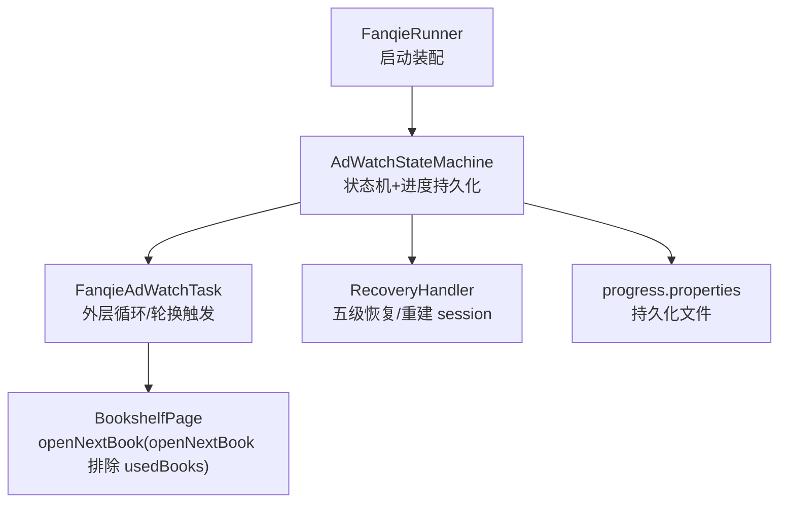
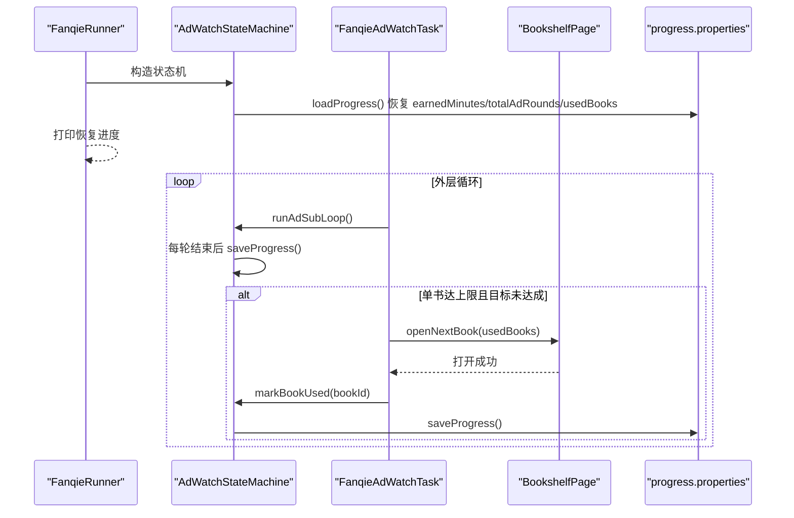
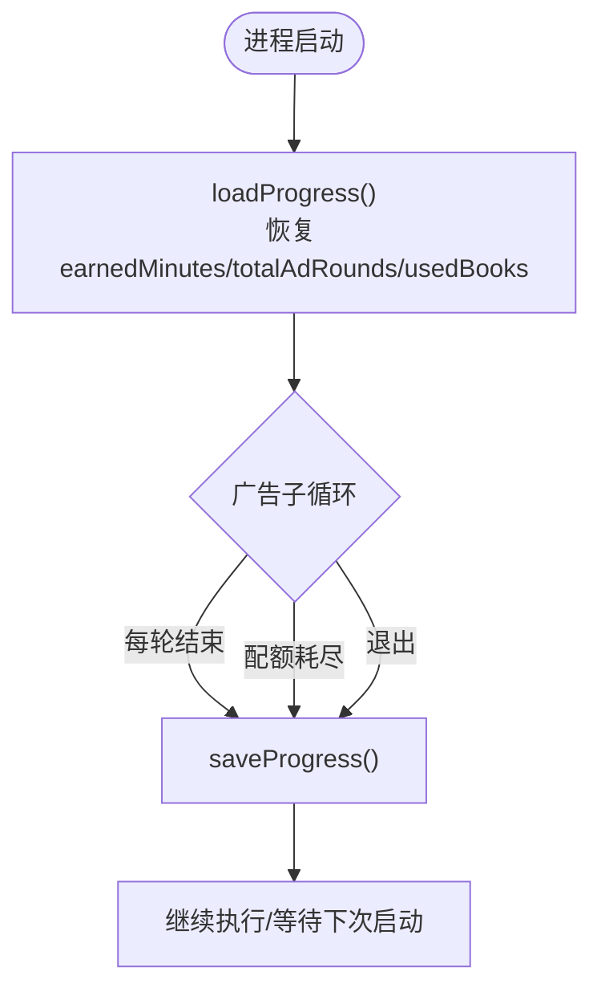
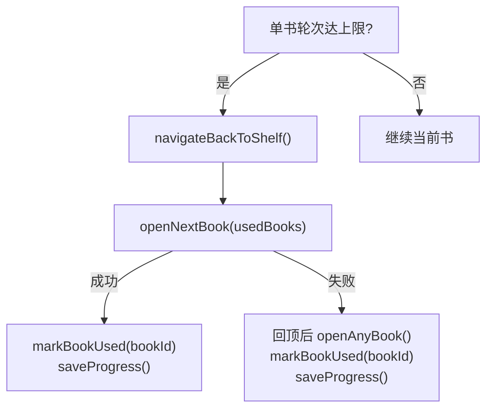
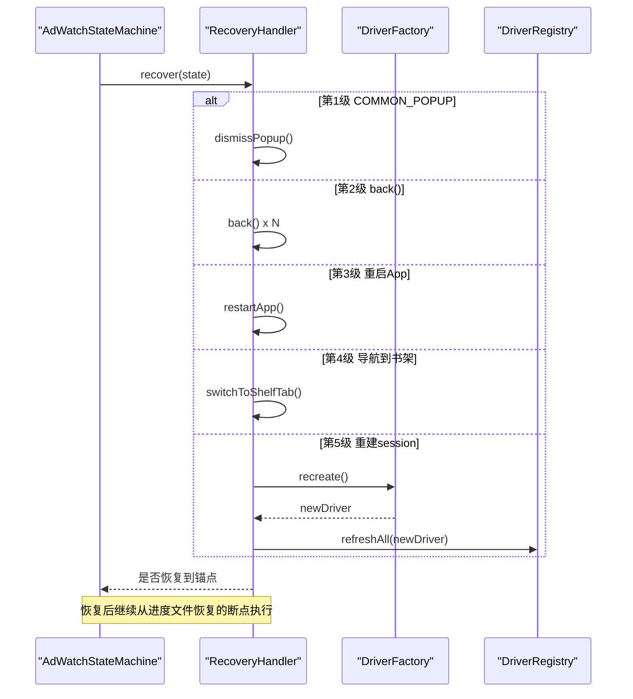
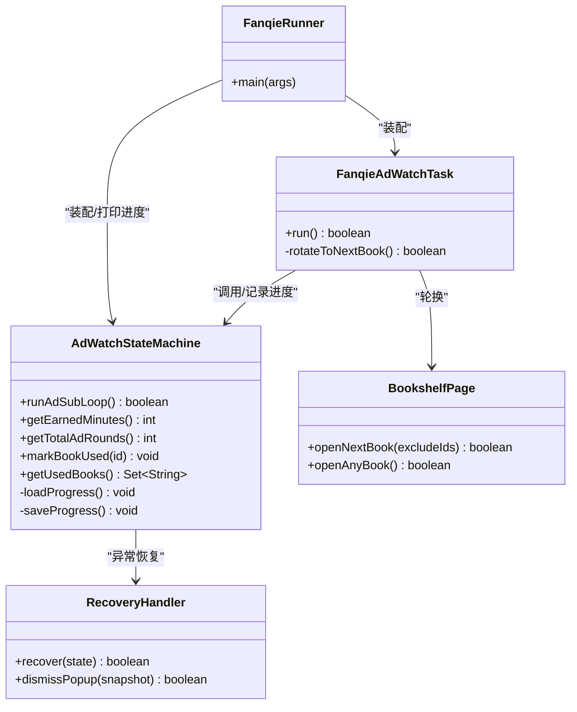

# 进度持久化

<cite>
**本文引用的文件**
- [AdWatchStateMachine.java](file://automation/src/main/java/com/fanqie/auto/task/AdWatchStateMachine.java)
- [FanqieRunner.java](file://automation/src/main/java/com/fanqie/auto/FanqieRunner.java)
- [RecoveryHandler.java](file://automation/src/main/java/com/fanqie/auto/task/RecoveryHandler.java)
- [BookshelfPage.java](file://automation/src/main/java/com/fanqie/auto/page/BookshelfPage.java)
- [FanqieAdWatchTask.java](file://automation/src/main/java/com/fanqie/auto/task/FanqieAdWatchTask.java)
- [AdWatchStateMachineTest.java](file://automation/src/test/java/com/fanqie/auto/task/AdWatchStateMachineTest.java)
</cite>

## 目录
1. [简介](#简介)
2. [项目结构](#项目结构)
3. [核心组件](#核心组件)
4. [架构总览](#架构总览)
5. [详细组件分析](#详细组件分析)
6. [依赖关系分析](#依赖关系分析)
7. [性能与可靠性](#性能与可靠性)
8. [故障排除指南](#故障排除指南)
9. [结论](#结论)
10. [附录：进度文件格式与示例](#附录进度文件格式与示例)

## 简介
本章节说明“进度持久化”的断点续跑机制。程序通过 progress.properties 文件持久化关键运行状态，确保在进程重启或会话重建后能够准确恢复执行位置，避免重复计数、误判配额耗尽或陷入书架空转等问题。重点包括：
- 持久化字段含义：earnedMinutes、totalAdRounds、usedBooks、lastUpdateDate、lastUpdate
- 加载与保存时机：构造时加载、每轮结束后保存、异常退出前保存
- per-book 维度进度管理：已使用书籍标识跟踪与轮换策略
- 编码格式与兼容性：URL 编码 + “|”分隔的新格式，兼容旧“,”分隔
- 恢复流程、备份迁移最佳实践与常见问题排查

## 项目结构
进度持久化相关代码集中在任务层的状态机中，并在启动器中暴露命令行开关以重置进度；per-book 轮换由书架页与任务层协作完成；恢复处理器负责在异常路径下回到已知锚点并继续从断点恢复。

图表来源
- [FanqieRunner.java:187-214](file://automation/src/main/java/com/fanqie/auto/FanqieRunner.java#L187-L214)
- [AdWatchStateMachine.java:148-153](file://automation/src/main/java/com/fanqie/auto/task/AdWatchStateMachine.java#L148-L153)
- [AdWatchStateMachine.java:679-734](file://automation/src/main/java/com/fanqie/auto/task/AdWatchStateMachine.java#L679-L734)
- [BookshelfPage.java:218-248](file://automation/src/main/java/com/fanqie/auto/page/BookshelfPage.java#L218-L248)
- [RecoveryHandler.java:100-253](file://automation/src/main/java/com/fanqie/auto/task/RecoveryHandler.java#L100-L253)

章节来源
- [FanqieRunner.java:187-214](file://automation/src/main/java/com/fanqie/auto/FanqieRunner.java#L187-L214)
- [AdWatchStateMachine.java:148-153](file://automation/src/main/java/com/fanqie/auto/task/AdWatchStateMachine.java#L148-L153)

## 核心组件
- AdWatchStateMachine：广告观看状态机，负责进度加载/保存、轮次与分钟累计、per-book 已用书籍集合、熔断与恢复协调。
- FanqieRunner：启动入口，打印从 progress.properties 恢复的进度，支持 --reset-progress 清除进度。
- BookshelfPage：提供 openNextBook(excludeIds) 打开下一本未使用书籍，结合 usedBooks 实现轮换。
- FanqieAdWatchTask：外层循环与轮换触发逻辑，调用 stateMachine.markBookUsed 记录已用书籍。
- RecoveryHandler：五级恢复（弹窗关闭、逐级 back、重启 App、导航到书架、重建 session），保证从断点继续。

章节来源
- [AdWatchStateMachine.java:62-157](file://automation/src/main/java/com/fanqie/auto/task/AdWatchStateMachine.java#L62-L157)
- [FanqieRunner.java:207-214](file://automation/src/main/java/com/fanqie/auto/FanqieRunner.java#L207-L214)
- [BookshelfPage.java:218-248](file://automation/src/main/java/com/fanqie/auto/page/BookshelfPage.java#L218-L248)
- [FanqieAdWatchTask.java:527-581](file://automation/src/main/java/com/fanqie/auto/task/FanqieAdWatchTask.java#L527-L581)
- [RecoveryHandler.java:100-253](file://automation/src/main/java/com/fanqie/auto/task/RecoveryHandler.java#L100-L253)

## 架构总览
进度持久化的整体流程如下：
- 启动时：状态机构造阶段读取 progress.properties，恢复 earnedMinutes、totalAdRounds 以及当天 usedBooks。
- 运行中：每轮广告结束或进入配额耗尽等关键节点时保存进度。
- 异常恢复：RecoveryHandler 多级恢复后，状态机继续从上次保存的进度继续。
- 轮换策略：当单本书达到上限且目标未达成时，回书架并打开下一本未使用书籍，标记已用并持久化。

图表来源
- [AdWatchStateMachine.java:679-734](file://automation/src/main/java/com/fanqie/auto/task/AdWatchStateMachine.java#L679-L734)
- [AdWatchStateMachine.java:173-311](file://automation/src/main/java/com/fanqie/auto/task/AdWatchStateMachine.java#L173-L311)
- [FanqieAdWatchTask.java:527-581](file://automation/src/main/java/com/fanqie/auto/task/FanqieAdWatchTask.java#L527-L581)
- [BookshelfPage.java:218-248](file://automation/src/main/java/com/fanqie/auto/page/BookshelfPage.java#L218-L248)
- [FanqieRunner.java:207-214](file://automation/src/main/java/com/fanqie/auto/FanqieRunner.java#L207-L214)

## 详细组件分析

### 进度持久化：字段与语义
- earnedMinutes：累计获得的免广告分钟数。用于主退出条件判断（达到 targetFreeMinutes 即停止）。
- totalAdRounds：全局累计广告轮次。用于全局轮次熔断保护。
- usedBooks：当前会话当天已使用过的书籍标识集合。用于 per-book 维度的轮换去重。
- lastUpdateDate：持久化日期（yyyy-MM-dd）。仅当天数据才恢复 usedBooks，跨天清空以避免残留导致无书可换。
- lastUpdate：持久化时间戳（毫秒）。便于审计与诊断。

章节来源
- [AdWatchStateMachine.java:679-734](file://automation/src/main/java/com/fanqie/auto/task/AdWatchStateMachine.java#L679-L734)
- [AdWatchStateMachine.java:741-778](file://automation/src/main/java/com/fanqie/auto/task/AdWatchStateMachine.java#L741-L778)

### 加载与保存时机
- 加载时机：状态机构造时调用 loadProgress()，从 progress.properties 恢复上述字段。若文件不存在则从零开始。
- 保存时机：
  - 每轮广告结束后保存（runAdSubLoop 内循环末尾）
  - 识别到每日配额耗尽并优雅收尾时保存
  - 子循环退出时保存
- 重置：可通过 --reset-progress 清理进度文件并从零开始。

图表来源
- [AdWatchStateMachine.java:173-311](file://automation/src/main/java/com/fanqie/auto/task/AdWatchStateMachine.java#L173-L311)
- [AdWatchStateMachine.java:679-734](file://automation/src/main/java/com/fanqie/auto/task/AdWatchStateMachine.java#L679-L734)
- [FanqieRunner.java:207-214](file://automation/src/main/java/com/fanqie/auto/FanqieRunner.java#L207-L214)

章节来源
- [AdWatchStateMachine.java:173-311](file://automation/src/main/java/com/fanqie/auto/task/AdWatchStateMachine.java#L173-L311)
- [AdWatchStateMachine.java:679-734](file://automation/src/main/java/com/fanqie/auto/task/AdWatchStateMachine.java#L679-L734)
- [FanqieRunner.java:207-214](file://automation/src/main/java/com/fanqie/auto/FanqieRunner.java#L207-L214)

### per-book 维度进度管理与轮换策略
- 已用书籍跟踪：每次成功打开一本书后，调用 markBookUsed(bookId) 将书籍标识加入 usedBooks。
- 轮换触发：当单本书广告轮次达到上限且全局目标未达成，且不处于每日配额耗尽状态时，返回书架并打开下一本未使用书籍。
- 书架选择：openNextBook(excludeIds) 会排除 usedBooks 中的书籍，若首屏全部已用则滚动查找；若无未用书则兜底打开任意一本并标记为已用，避免书架空转。
- 时效控制：usedBooks 仅在 lastUpdateDate 为当天时恢复，跨天自动清空，确保每天重新遍历全部书籍。

图表来源
- [FanqieAdWatchTask.java:527-581](file://automation/src/main/java/com/fanqie/auto/task/FanqieAdWatchTask.java#L527-L581)
- [BookshelfPage.java:218-248](file://automation/src/main/java/com/fanqie/auto/page/BookshelfPage.java#L218-L248)
- [AdWatchStateMachine.java:329-337](file://automation/src/main/java/com/fanqie/auto/task/AdWatchStateMachine.java#L329-L337)

章节来源
- [FanqieAdWatchTask.java:527-581](file://automation/src/main/java/com/fanqie/auto/task/FanqieAdWatchTask.java#L527-L581)
- [BookshelfPage.java:218-248](file://automation/src/main/java/com/fanqie/auto/page/BookshelfPage.java#L218-L248)
- [AdWatchStateMachine.java:329-337](file://automation/src/main/java/com/fanqie/auto/task/AdWatchStateMachine.java#L329-L337)

### 编码格式与兼容性处理
- 新格式：usedBooks 每个 id 经 URL 编码后用 “|” 分隔，避免书名含逗号被错误拆分。
- 解码兼容：若文件中不含 “|”，则按旧格式 “,” 拆分；单个 token 解析失败安全跳过。
- 时效维度：仅当 lastUpdateDate 等于当天时才恢复 usedBooks；缺失该字段保守清空，防止跨天残留影响轮换。

章节来源
- [AdWatchStateMachine.java:741-778](file://automation/src/main/java/com/fanqie/auto/task/AdWatchStateMachine.java#L741-L778)
- [AdWatchStateMachineTest.java:201-232](file://automation/src/test/java/com/fanqie/auto/task/AdWatchStateMachineTest.java#L201-L232)

### 恢复流程与断点续跑
- 五级恢复：弹窗关闭 → 逐级 back → 重启 App → 导航到书架 → 重建 session。
- 重建 session：连续失败达到阈值时，driverFactory.recreate() 并刷新所有组件 driver 引用，随后尝试回到书架继续。
- 断点续跑：恢复成功后，状态机仍持有上次 saved 的 earnedMinutes/totalAdRounds/usedBooks，不会重复已完成轮次。

图表来源
- [RecoveryHandler.java:100-253](file://automation/src/main/java/com/fanqie/auto/task/RecoveryHandler.java#L100-L253)
- [AdWatchStateMachine.java:642-652](file://automation/src/main/java/com/fanqie/auto/task/AdWatchStateMachine.java#L642-L652)

章节来源
- [RecoveryHandler.java:100-253](file://automation/src/main/java/com/fanqie/auto/task/RecoveryHandler.java#L100-L253)
- [AdWatchStateMachine.java:642-652](file://automation/src/main/java/com/fanqie/auto/task/AdWatchStateMachine.java#L642-L652)

## 依赖关系分析
- 启动器 FanqieRunner 负责装配各组件，并在构造状态机后打印恢复进度；支持 --reset-progress 清理进度。
- 状态机 AdWatchStateMachine 依赖配置、定位器、检测器、等待支持、手势、日志、页面对象与恢复处理器。
- 任务层 FanqieAdWatchTask 驱动外层循环与轮换，调用状态机记录 per-book 进度。
- 书架页 BookshelfPage 根据 usedBooks 排除已用书籍，实现轮换。
- 恢复处理器 RecoveryHandler 在异常路径下恢复至已知锚点，必要时重建 session。

图表来源
- [FanqieRunner.java:187-214](file://automation/src/main/java/com/fanqie/auto/FanqieRunner.java#L187-L214)
- [AdWatchStateMachine.java:62-157](file://automation/src/main/java/com/fanqie/auto/task/AdWatchStateMachine.java#L62-L157)
- [FanqieAdWatchTask.java:527-581](file://automation/src/main/java/com/fanqie/auto/task/FanqieAdWatchTask.java#L527-L581)
- [BookshelfPage.java:218-248](file://automation/src/main/java/com/fanqie/auto/page/BookshelfPage.java#L218-L248)
- [RecoveryHandler.java:100-253](file://automation/src/main/java/com/fanqie/auto/task/RecoveryHandler.java#L100-L253)

章节来源
- [FanqieRunner.java:187-214](file://automation/src/main/java/com/fanqie/auto/FanqieRunner.java#L187-L214)
- [AdWatchStateMachine.java:62-157](file://automation/src/main/java/com/fanqie/auto/task/AdWatchStateMachine.java#L62-L157)
- [FanqieAdWatchTask.java:527-581](file://automation/src/main/java/com/fanqie/auto/task/FanqieAdWatchTask.java#L527-L581)
- [BookshelfPage.java:218-248](file://automation/src/main/java/com/fanqie/auto/page/BookshelfPage.java#L218-L248)
- [RecoveryHandler.java:100-253](file://automation/src/main/java/com/fanqie/auto/task/RecoveryHandler.java#L100-L253)

## 性能与可靠性
- 幂等性：每轮奖励计数采用 roundId + lastCountedRoundId 保证“每真实一轮至多计一次且不漏计”，避免重复计数导致提前熔断。
- 去抖与上下文约束：每日配额耗尽需连续多个 tick 命中且伴随弹窗型关闭按钮才判定，降低误判风险。
- 熔断保护：四重独立熔断（目标分钟、单入口轮次、全局轮次、墙钟预算）任一触发即退出子循环，杜绝死循环空转。
- 恢复健壮性：五级恢复由弱到强，超过阈值保留现场并退出，绝不盲目连点。

章节来源
- [AdWatchStateMachine.java:355-394](file://automation/src/main/java/com/fanqie/auto/task/AdWatchStateMachine.java#L355-L394)
- [AdWatchStateMachine.java:345-353](file://automation/src/main/java/com/fanqie/auto/task/AdWatchStateMachine.java#L345-L353)
- [RecoveryHandler.java:100-253](file://automation/src/main/java/com/fanqie/auto/task/RecoveryHandler.java#L100-L253)

## 故障排除指南
- 进度未恢复：检查 progress.properties 是否存在于 automation/logs 目录；确认 lastUpdateDate 是否为当天；查看加载日志是否有异常。
- 已用书籍未生效：确认 usedBooks 是否包含对应书籍标识；检查是否跨天导致清空；核对 encode/decode 是否成功。
- 轮换失败：确认 openNextBook 是否能找到未使用书籍；若全在 usedBooks，检查是否误标记；必要时回顶后兜底打开任意书。
- 恢复失败：查看 RecoveryHandler 日志级别；确认是否达到 maxConsecutiveErrors；必要时重建 session 并刷新 driver 引用。
- 配额耗尽误判：检查 dailyQuotaExhaustedTexts 与 commonDismissTexts/adCloseTexts 是否匹配；确认上下文约束满足。

章节来源
- [AdWatchStateMachine.java:679-734](file://automation/src/main/java/com/fanqie/auto/task/AdWatchStateMachine.java#L679-L734)
- [AdWatchStateMachine.java:345-353](file://automation/src/main/java/com/fanqie/auto/task/AdWatchStateMachine.java#L345-L353)
- [BookshelfPage.java:218-248](file://automation/src/main/java/com/fanqie/auto/page/BookshelfPage.java#L218-L248)
- [RecoveryHandler.java:100-253](file://automation/src/main/java/com/fanqie/auto/task/RecoveryHandler.java#L100-L253)

## 结论
进度持久化通过 progress.properties 实现了断点续跑的关键能力：在进程重启或会话重建后，能准确恢复 earnedMinutes、totalAdRounds 与当天 usedBooks，避免重复计数与误判配额耗尽。配合 per-book 轮换策略与五级恢复机制，系统在复杂 UI 波动与异常场景下仍能稳定推进任务。建议定期备份进度文件，谨慎使用 --reset-progress，并结合日志与快照进行问题定位。

## 附录：进度文件格式与示例
- 文件位置：automation/logs/progress.properties
- 字段说明：
  - earnedMinutes：累计免广告分钟数（整数）
  - totalAdRounds：全局累计广告轮次（整数）
  - usedBooks：已用书籍标识集合（新格式：URL 编码后用 “|” 分隔；旧格式：逗号分隔）
  - lastUpdateDate：持久化日期（yyyy-MM-dd），仅当天数据恢复 usedBooks
  - lastUpdate：持久化时间戳（毫秒）
- 示例（示意）：
  - earnedMinutes=120
  - totalAdRounds=40
  - usedBooks=%E4%B9%A6%E5%90%8D%2C%E5%90%AB%E9%80%97%E5%8F%B7|book2
  - lastUpdateDate=2026-01-01
  - lastUpdate=1704067200000
- 恢复流程：
  - 启动时 loadProgress() 读取并恢复字段
  - 每轮结束后 saveProgress() 写入最新状态
  - 异常退出前也会保存，确保断点不丢失
- 备份与迁移最佳实践：
  - 定期复制 progress.properties 到版本库或归档目录
  - 迁移时保持 lastUpdateDate 与 usedBooks 一致性，避免跨天残留
  - 如需重置，使用 --reset-progress 或手动删除文件后重新启动
- 兼容性：
  - 新格式优先使用 “|” 分隔；若不存在则回退到 “,” 分隔
  - 单个 token 解析失败安全跳过，不影响其他条目恢复

章节来源
- [AdWatchStateMachine.java:679-734](file://automation/src/main/java/com/fanqie/auto/task/AdWatchStateMachine.java#L679-L734)
- [AdWatchStateMachine.java:741-778](file://automation/src/main/java/com/fanqie/auto/task/AdWatchStateMachine.java#L741-L778)
- [AdWatchStateMachineTest.java:201-232](file://automation/src/test/java/com/fanqie/auto/task/AdWatchStateMachineTest.java#L201-L232)
- [FanqieRunner.java:207-214](file://automation/src/main/java/com/fanqie/auto/FanqieRunner.java#L207-L214)