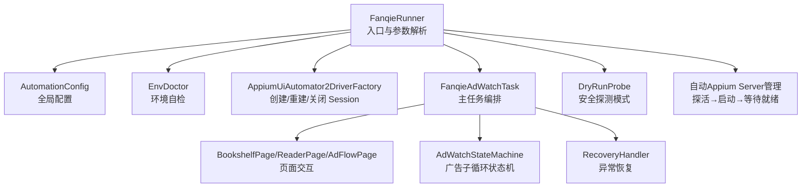
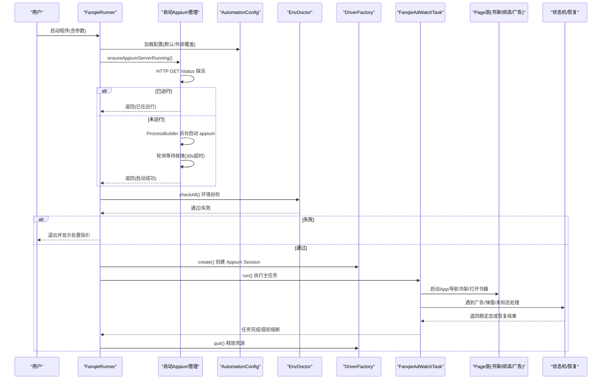
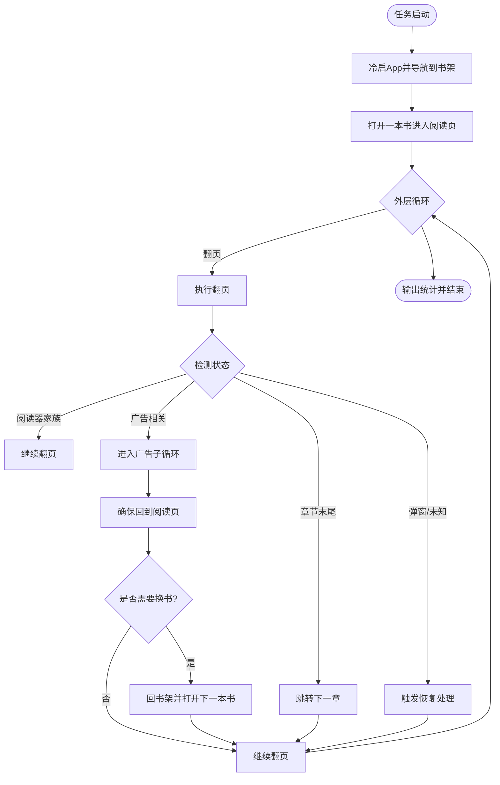
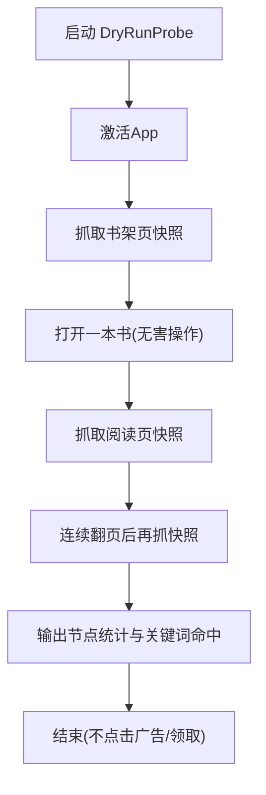
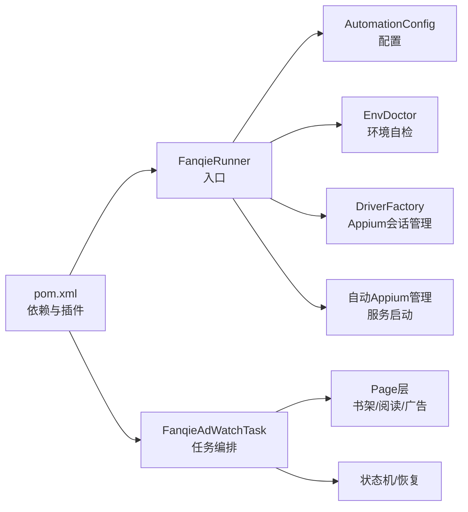

# 快速开始

<cite>
**本文引用的文件**
- [pom.xml](file://automation/pom.xml)
- [FanqieRunner.java](file://automation/src/main/java/com/fanqie/auto/FanqieRunner.java)
- [AutomationConfig.java](file://automation/src/main/java/com/fanqie/auto/config/AutomationConfig.java)
- [EnvDoctor.java](file://automation/src/main/java/com/fanqie/auto/core/EnvDoctor.java)
- [AppiumUiAutomator2DriverFactory.java](file://automation/src/main/java/com/fanqie/auto/core/AppiumUiAutomator2DriverFactory.java)
- [DryRunProbe.java](file://automation/src/main/java/com/fanqie/auto/DryRunProbe.java)
- [FanqieAdWatchTask.java](file://automation/src/main/java/com/fanqie/auto/task/FanqieAdWatchTask.java)
- [start-appium.ps1](file://automation/start-appium.ps1)
</cite>

## 更新摘要
**所做更改**
- 新增自动 Appium Server 管理功能说明
- 简化环境准备步骤，消除手动启动 Appium Server 的要求
- 更新首次运行示例，突出自动化优势
- 增强故障排除指南，包含自动启动失败的处理方案

## 目录
1. [简介](#简介)
2. [项目结构](#项目结构)
3. [核心组件](#核心组件)
4. [架构总览](#架构总览)
5. [详细组件分析](#详细组件分析)
6. [依赖关系分析](#依赖关系分析)
7. [性能与稳定性要点](#性能与稳定性要点)
8. [故障排除指南](#故障排除指南)
9. [结论](#结论)
10. [附录：命令行参数与配置项速查](#附录命令行参数与配置项速查)

## 简介
本指南面向首次接触该项目的用户，目标是在约30分钟内完成环境准备、克隆构建、设备检查并成功运行第一个自动化任务。项目基于 Appium 2 + Java Client 9.5，针对"番茄免费小说"的"看视频领免广告时长"流程进行 UI 自动化编排，提供安全探测（dry-run）、环境自检、长任务熔断、多书轮换等能力。**现已支持自动 Appium Server 管理，无需手动启动服务器即可直接运行。**

## 项目结构
- 入口类：唯一 main() 位于 FanqieRunner，负责解析参数、装配组件、启动任务与资源清理。
- 配置中心：AutomationConfig 集中管理所有超时、轮次、阈值与 Appium 相关选项，支持外部 properties 覆盖。
- 环境自检：EnvDoctor 在创建 session 前执行 adb / Appium Server / 应用安装等检查，给出中文处置指引。
- 驱动工厂：AppiumUiAutomator2DriverFactory 封装 UiAutomator2Options，避免破坏性操作，确保隐式等待为 0，提升短轮询效率。
- 任务编排：FanqieAdWatchTask 组织"启动→书架→阅读→翻页→广告子循环→收尾"的主流程。
- 安全探针：DryRunProbe 仅连接设备、抓取快照并输出节点统计与关键词定位建议，不点击任何广告或领取按钮。
- **自动服务管理：FanqieRunner 内置 Appium Server 自动启动和探活机制，用户可直接运行程序而无需手动启动服务器。**

**图表来源**
- [FanqieRunner.java:41-238](file://automation/src/main/java/com/fanqie/auto/FanqieRunner.java#L41-L238)
- [AppiumUiAutomator2DriverFactory.java:44-118](file://automation/src/main/java/com/fanqie/auto/core/AppiumUiAutomator2DriverFactory.java#L44-L118)
- [FanqieAdWatchTask.java:99-314](file://automation/src/main/java/com/fanqie/auto/task/FanqieAdWatchTask.java#L99-L314)
- [DryRunProbe.java:91-197](file://automation/src/main/java/com/fanqie/auto/DryRunProbe.java#L91-L197)

**章节来源**
- [pom.xml:1-176](file://automation/pom.xml#L1-L176)
- [FanqieRunner.java:41-238](file://automation/src/main/java/com/fanqie/auto/FanqieRunner.java#L41-L238)

## 核心组件
- 入口与参数：FanqieRunner 解析 --doctor、--dry-run、--config、--cycles、--pages、--reset-progress，并打印手机侧设置核对清单与合规提示。
- 配置加载：AutomationConfig 从 classpath 默认 properties 加载，支持通过 --config 指定外部路径覆盖；所有超时、轮次、阈值均从此处读取。
- 环境自检：EnvDoctor 检查 ANDROID_HOME/SDK_ROOT、adb 版本、设备在线与授权、Appium Server 就绪、App 包是否安装，失败时给出逐项处置指引。
- 驱动工厂：AppiumUiAutomator2DriverFactory 构建 UiAutomator2Options，禁用 reset/uninstall/clear，设置 noReset、keepScreenOn、命令超时等，并在创建后立刻将隐式等待置零。
- 任务编排：FanqieAdWatchTask 实现"冷启→导航书架→选书→翻页→广告子循环→章节跳转→多书轮换→熔断收尾"的完整流程。
- 安全探测：DryRunProbe 仅激活 App、抓书架/阅读页快照、输出节点属性统计与关键词命中情况，用于校准定位策略。
- **自动服务管理：ensureAppiumServerRunning() 方法实现幂等的 Appium Server 管理，先探活已运行的服务，未运行时自动后台启动并等待就绪。**

**章节来源**
- [FanqieRunner.java:41-249](file://automation/src/main/java/com/fanqie/auto/FanqieRunner.java#L41-L249)
- [AutomationConfig.java:18-306](file://automation/src/main/java/com/fanqie/auto/config/AutomationConfig.java#L18-L306)
- [EnvDoctor.java:48-194](file://automation/src/main/java/com/fanqie/auto/core/EnvDoctor.java#L48-L194)
- [AppiumUiAutomator2DriverFactory.java:120-178](file://automation/src/main/java/com/fanqie/auto/core/AppiumUiAutomator2DriverFactory.java#L120-L178)
- [FanqieAdWatchTask.java:99-314](file://automation/src/main/java/com/fanqie/auto/task/FanqieAdWatchTask.java#L99-L314)
- [DryRunProbe.java:91-197](file://automation/src/main/java/com/fanqie/auto/DryRunProbe.java#L91-L197)

## 架构总览
下图展示从命令行到任务执行的调用链与关键对象关系，包括新增的自动 Appium Server 管理流程。

**图表来源**
- [FanqieRunner.java:41-238](file://automation/src/main/java/com/fanqie/auto/FanqieRunner.java#L41-L238)
- [AppiumUiAutomator2DriverFactory.java:44-118](file://automation/src/main/java/com/fanqie/auto/core/AppiumUiAutomator2DriverFactory.java#L44-L118)
- [FanqieAdWatchTask.java:99-314](file://automation/src/main/java/com/fanqie/auto/task/FanqieAdWatchTask.java#L99-L314)

## 详细组件分析

### 环境与设备准备（30分钟达成）
- 系统要求
  - Java 11（Maven 编译 release=11，UTF-8 编码）
  - Node.js（用于 Appium Server，但程序会自动启动）
  - Android 设备（USB 调试开启，已授权）
  - ADB 可用（PATH 中可执行）
  - Appium 全局安装（`npm list -g appium` 验证）
- 设备侧设置核对清单（程序会打印）
  - 解锁开发者选项
  - 开启 USB 调试
  - 开启"仅充电模式下允许 ADB 调试"（华为/鸿蒙特有）
  - 处理"监控 ADB 安装应用"弹窗（首轮建议临时关闭）
  - USB 连接方式选择"传输文件"
  - 首次插线勾选"始终允许来自这台计算机的调试"
  - 建议关闭自动锁屏、接通电源、加入电池优化白名单
- **自动 Appium Server 管理**
  - 程序启动时自动检测 Appium Server 状态
  - 如未运行则自动后台启动 `appium --base-path /`
  - 轮询 `/status` 端点直到 ready:true 或超时(30秒)
  - 日志输出到 `%TEMP%\appium-stdout.log` 和 `%TEMP%\appium-stderr.log`
- 验证设备连接
  - 终端执行：adb devices -l
  - 期望看到设备状态为 device，而非 unauthorized/offline

**章节来源**
- [pom.xml:15-28](file://automation/pom.xml#L15-L28)
- [FanqieRunner.java:273-291](file://automation/src/main/java/com/fanqie/auto/FanqieRunner.java#L273-L291)
- [EnvDoctor.java:75-194](file://automation/src/main/java/com/fanqie/auto/core/EnvDoctor.java#L75-L194)

### 项目克隆与构建
- 使用 Maven 构建（已配置阿里云镜像，下载更快）
  - 编译：mvn compile
  - 打包（生成 fat-jar，便于脱离 IDE 运行）：mvn package
- 直接运行入口类
  - mvn exec:java
- 说明
  - 构建插件强制 release=11 与 UTF-8 编码，避免中文乱码导致匹配失效
  - exec 插件已配置 mainClass 为 FanqieRunner

**章节来源**
- [pom.xml:85-135](file://automation/pom.xml#L85-L135)

### 首次运行示例
- **全新体验：直接运行，无需手动启动 Appium Server**
  - 环境自检（不创建 session）：mvn exec:java -Dexec.args="--doctor"
  - 安全探测模式（只连接设备、抓快照，不点击广告/领取）：mvn exec:java -Dexec.args="--dry-run"
  - 使用外部配置文件覆盖默认值：mvn exec:java -Dexec.args="--config ./my-config.properties"
  - 覆盖外层循环次数与每轮翻页次数：mvn exec:java -Dexec.args="--cycles 3 --pages 5"
  - 重置累计进度（清除 progress.properties 中的累计数据）：mvn exec:java -Dexec.args="--reset-progress"
- **传统方式：手动启动 Appium Server（可选）**
  - PowerShell 脚本：.\start-appium.ps1
  - 命令行：appium --base-path /
  - 验证：curl http://127.0.0.1:4723/status

**章节来源**
- [FanqieRunner.java:56-87](file://automation/src/main/java/com/fanqie/auto/FanqieRunner.java#L56-L87)
- [FanqieRunner.java:241-249](file://automation/src/main/java/com/fanqie/auto/FanqieRunner.java#L241-L249)
- [start-appium.ps1:1-116](file://automation/start-appium.ps1#L1-L116)

### 主任务执行流程（概念图）

**图表来源**
- [FanqieAdWatchTask.java:99-314](file://automation/src/main/java/com/fanqie/auto/task/FanqieAdWatchTask.java#L99-L314)

**章节来源**
- [FanqieAdWatchTask.java:99-314](file://automation/src/main/java/com/fanqie/auto/task/FanqieAdWatchTask.java#L99-L314)

### Dry-Run 安全探测（概念图）

**图表来源**
- [DryRunProbe.java:91-197](file://automation/src/main/java/com/fanqie/auto/DryRunProbe.java#L91-L197)

**章节来源**
- [DryRunProbe.java:91-197](file://automation/src/main/java/com/fanqie/auto/DryRunProbe.java#L91-L197)

### 自动 Appium Server 管理机制
- **探活阶段**：程序启动时首先通过 HTTP GET 请求 `http://127.0.0.1:4723/status` 检测 Appium Server 是否已运行且就绪
- **自动启动阶段**：如检测到服务未运行，使用 ProcessBuilder 后台启动 `appium --base-path /`，并将标准输出和错误输出重定向到临时目录日志文件
- **就绪等待阶段**：轮询检查 `/status` 端点响应，最多等待 30 秒，每秒检查一次
- **幂等设计**：如果 Appium Server 已经在运行且就绪，直接跳过启动步骤，避免重复启动
- **错误处理**：启动失败时提供详细的错误信息和手动启动指导

**章节来源**
- [FanqieRunner.java:302-379](file://automation/src/main/java/com/fanqie/auto/FanqieRunner.java#L302-L379)

## 依赖关系分析
- 构建与运行时依赖
  - Appium Java Client 9.5（与 Selenium 4.34.0 BOM 严格对应）
  - SLF4J Simple（保证日志可见）
  - JUnit 5（仅测试期依赖，不影响主程序）
- 关键设计约束
  - 禁止 reset/uninstall/clear，保护用户数据与登录态
  - 立即设置 implicitlyWait=0，避免未命中查找阻塞短轮询
  - 通过 ShutdownHook 与 finally 双重保障 logger.stop() 与 driver.quit()，防止 session 泄漏
  - **自动 Appium Server 管理减少用户操作步骤，提升用户体验**

**图表来源**
- [pom.xml:50-83](file://automation/pom.xml#L50-L83)
- [FanqieRunner.java:127-238](file://automation/src/main/java/com/fanqie/auto/FanqieRunner.java#L127-L238)
- [AppiumUiAutomator2DriverFactory.java:44-118](file://automation/src/main/java/com/fanqie/auto/core/AppiumUiAutomator2DriverFactory.java#L44-L118)

**章节来源**
- [pom.xml:50-83](file://automation/pom.xml#L50-L83)
- [FanqieRunner.java:127-238](file://automation/src/main/java/com/fanqie/auto/FanqieRunner.java#L127-L238)

## 性能与稳定性要点
- 短轮询与显式等待
  - 隐式等待设为 0，全部等待逻辑走 WebDriverWait，配合 pollIntervalMs 实现高频探测
- 心跳保活
  - newCommandTimeoutSec 默认较长，结合心跳线程降低广告静默期断连风险
- 长任务熔断
  - maxWallClockMs 墙钟预算耗尽优雅收尾，防止无限占用设备
- 多书轮换
  - 单入口达到上限后自动回书架换书，提高整体收益
- 幂等与健壮性
  - ShutdownHook 与 finally 双重清理；driver.quit() 幂等保护；recreate 机制应对 session 异常
- **自动服务管理稳定性**
  - 探活机制避免重复启动，确保服务一致性
  - 超时控制防止无限等待，提供明确的失败反馈
  - 日志分离便于问题诊断和性能分析

**章节来源**
- [AppiumUiAutomator2DriverFactory.java:63-69](file://automation/src/main/java/com/fanqie/auto/core/AppiumUiAutomator2DriverFactory.java#L63-L69)
- [AutomationConfig.java:137-164](file://automation/src/main/java/com/fanqie/auto/config/AutomationConfig.java#L137-L164)
- [FanqieAdWatchTask.java:171-195](file://automation/src/main/java/com/fanqie/auto/task/FanqieAdWatchTask.java#L171-L195)
- [FanqieRunner.java:131-142](file://automation/src/main/java/com/fanqie/auto/FanqieRunner.java#L131-L142)

## 故障排除指南
- 无法检测到设备
  - 检查 USB 调试与"仅充电模式下允许 ADB 调试"是否开启
  - 重新插拔并授权"始终允许来自这台计算机的调试"
  - 使用原装数据线，避免仅充电模式
- 设备状态 unauthorized/offline
  - 在手机上确认授权弹窗；必要时执行 adb kill-server; adb start-server
- **Appium Server 自动启动失败**
  - 检查 Node.js 是否正确安装：`node --version`
  - 检查 Appium 是否全局安装：`npm list -g appium`
  - 查看自动启动日志：`%TEMP%\appium-stdout.log` 和 `%TEMP%\appium-stderr.log`
  - 手动启动作为备选方案：`appium --base-path /`
- **Appium Server 端口冲突**
  - 检查 4723 端口是否被其他进程占用：`netstat -ano | findstr :4723`
  - 终止占用进程或修改配置使用其他端口
- 应用未安装或包名错误
  - 在设备上安装"番茄免费小说"，或通过 adb shell pm list packages 校验包名
- 首装 UiAutomator2 Server 慢或被拦截
  - 调整 uiautomator2ServerLaunchTimeoutMs 与 uiautomator2ServerInstallTimeoutMs
  - 首轮可暂时关闭"监控 ADB 安装应用"，减少弹窗干扰
- 中文乱码导致匹配失败
  - 确保编译与运行编码为 UTF-8（项目已内置 UTF-8 配置）
- 任务中途卡死或无响应
  - 检查心跳与命令超时配置；查看 logs/snapshots 下最近快照定位当前页面
  - 使用 --reset-progress 重置累计进度后重试

**章节来源**
- [EnvDoctor.java:90-194](file://automation/src/main/java/com/fanqie/auto/core/EnvDoctor.java#L90-L194)
- [AppiumUiAutomator2DriverFactory.java:145-178](file://automation/src/main/java/com/fanqie/auto/core/AppiumUiAutomator2DriverFactory.java#L145-L178)
- [FanqieRunner.java:273-291](file://automation/src/main/java/com/fanqie/auto/FanqieRunner.java#L273-L291)

## 结论
通过 EnvDoctor 的环境自检、DryRunProbe 的安全探测、以及 FanqieAdWatchTask 的稳健编排，你可以在较短时间内完成环境搭建并运行首个自动化任务。**新增的自动 Appium Server 管理功能进一步简化了使用流程，用户现在可以直接运行程序而无需手动启动服务器**。建议在正式长跑前先用 dry-run 模式采集快照并校准定位策略，再逐步放开真实任务。

## 附录：命令行参数与配置项速查
- 命令行参数
  - --doctor：仅环境自检，不创建 session
  - --dry-run：仅连接设备并 dump UI 树，不执行点击
  - --config <path>：使用外部配置文件覆盖默认值
  - --cycles <N>：覆盖外层循环次数
  - --pages <N>：覆盖每轮翻页次数
  - --reset-progress：清除累计进度，从零开始
- 常用配置项（来自 AutomationConfig）
  - Appium 相关：server.url、platform.name、automation.name、device.udid、app.package、no.reset、new.command.timeout.sec、uia2 server launch/install timeout、skip.server.installation、skip.device.initialization、keep.screen.on
  - 时序相关：poll.interval.ms、state.detect.timeout.ms、action.timeout.ms、app.launch.timeout.ms、ad.video.timeout.ms、ad.close.ready.timeout.ms、max.state.dwell.ms、heartbeat.interval.sec
  - 流程相关：pages.per.cycle、max.ad.rounds.per.entry、max.total.ad.rounds、target.free.minutes、reward.fallback.minutes、max.wall.clock.ms、outer.cycles、max.consecutive.errors、max.recovery.retry
  - 阅读页翻页：turn.strategy、next/prev tap ratio、swipe.percent、swipe.duration.ms
  - 验证与调试：verify.page.turned.by.screenshot、runtime.dry.run

**章节来源**
- [FanqieRunner.java:56-87](file://automation/src/main/java/com/fanqie/auto/FanqieRunner.java#L56-L87)
- [FanqieRunner.java:241-249](file://automation/src/main/java/com/fanqie/auto/FanqieRunner.java#L241-L249)
- [AutomationConfig.java:112-306](file://automation/src/main/java/com/fanqie/auto/config/AutomationConfig.java#L112-L306)