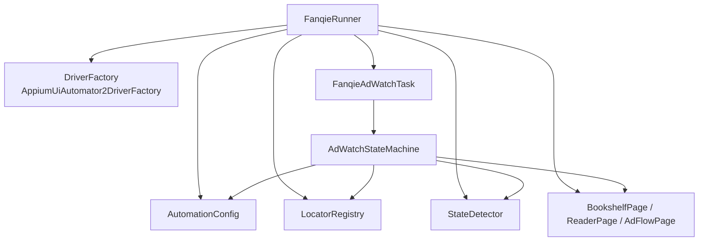
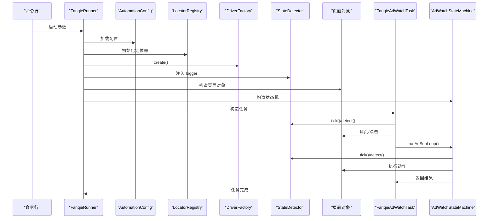
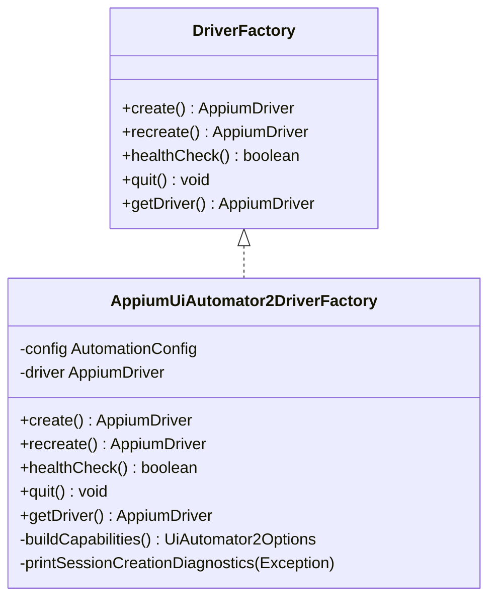
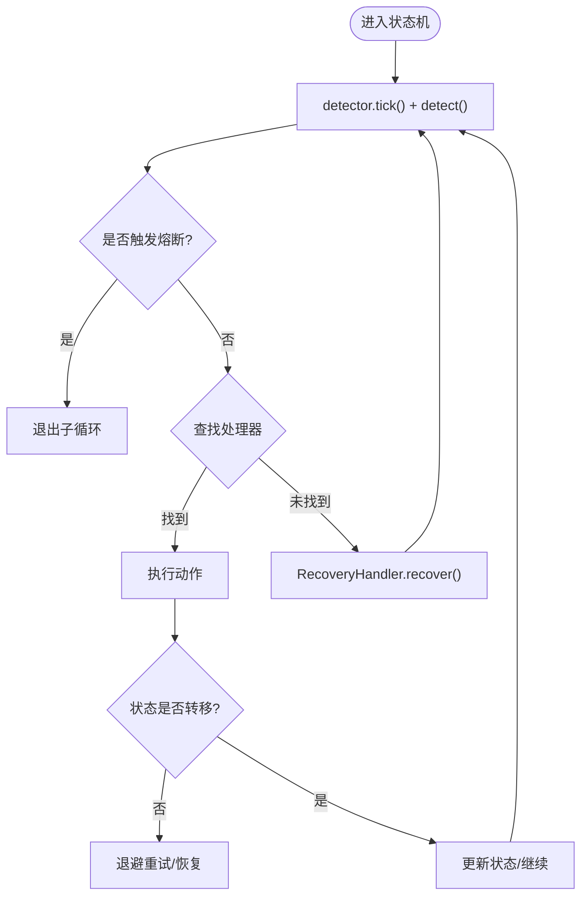
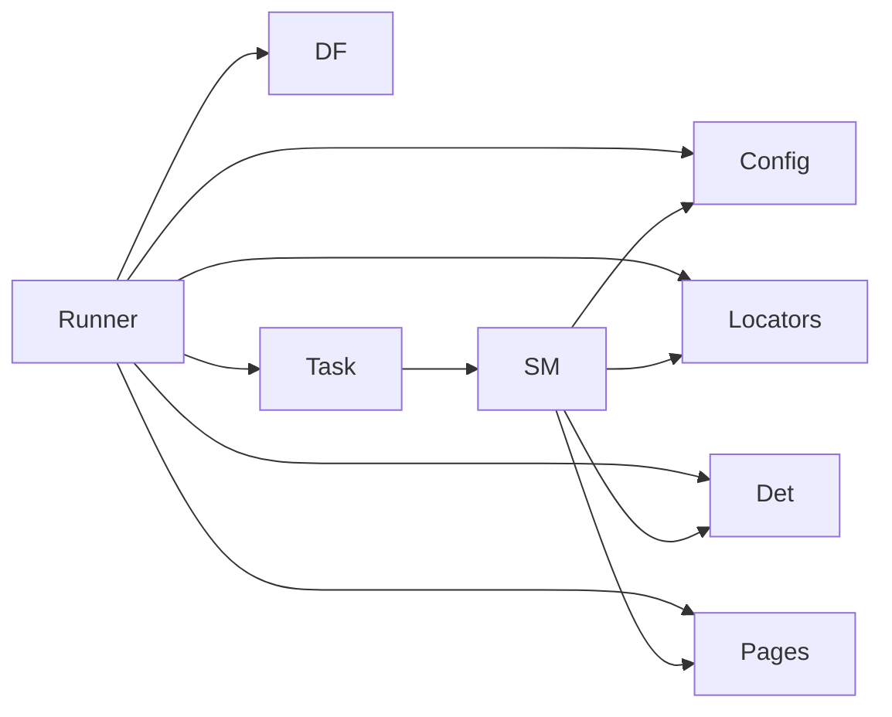

# 扩展开发

<cite>
**本文引用的文件**
- [DriverFactory.java](file://automation/src/main/java/com/fanqie/auto/core/DriverFactory.java)
- [AppiumUiAutomator2DriverFactory.java](file://automation/src/main/java/com/fanqie/auto/core/AppiumUiAutomator2DriverFactory.java)
- [FanqieRunner.java](file://automation/src/main/java/com/fanqie/auto/FanqieRunner.java)
- [AutomationConfig.java](file://automation/src/main/java/com/fanqie/auto/config/AutomationConfig.java)
- [LocatorRegistry.java](file://automation/src/main/java/com/fanqie/auto/config/LocatorRegistry.java)
- [StateDetector.java](file://automation/src/main/java/com/fanqie/auto/core/StateDetector.java)
- [BasePage.java](file://automation/src/main/java/com/fanqie/auto/page/BasePage.java)
- [AdWatchStateMachine.java](file://automation/src/main/java/com/fanqie/auto/task/AdWatchStateMachine.java)
- [FanqieAdWatchTask.java](file://automation/src/main/java/com/fanqie/auto/task/FanqieAdWatchTask.java)
- [pom.xml](file://automation/pom.xml)
- [PageStateTest.java](file://automation/src/test/java/com/fanqie/auto/core/PageStateTest.java)
</cite>

## 目录
1. [简介](#简介)
2. [项目结构](#项目结构)
3. [核心组件](#核心组件)
4. [架构总览](#架构总览)
5. [详细组件分析](#详细组件分析)
6. [依赖关系分析](#依赖关系分析)
7. [性能考量](#性能考量)
8. [故障排查指南](#故障排查指南)
9. [结论](#结论)
10. [附录](#附录)

## 简介
本指南面向希望扩展现有功能或添加新功能的开发者，重点覆盖：
- 如何扩展新的驱动类型（实现 DriverFactory 接口并配置）
- 如何添加新的页面状态处理逻辑（扩展状态机与页面对象）
- 如何自定义配置选项与验证规则
- 插件化开发的完整示例（项目结构、依赖、集成）
- 代码规范、测试要求与发布流程
- 向后兼容性保证与版本升级策略

## 项目结构
本项目采用分层组织：
- core：驱动工厂、状态检测、手势、等待、日志等通用能力
- config：全局配置与定位器注册表
- page：页面对象封装（书架、阅读器、广告流）
- task：业务编排与状态机
- 入口：FanqieRunner 负责装配与运行

图表来源
- [FanqieRunner.java:116-201](file://automation/src/main/java/com/fanqie/auto/FanqieRunner.java#L116-L201)
- [AutomationConfig.java:110-178](file://automation/src/main/java/com/fanqie/auto/config/AutomationConfig.java#L110-L178)
- [LocatorRegistry.java:16-65](file://automation/src/main/java/com/fanqie/auto/config/LocatorRegistry.java#L16-L65)
- [DriverFactory.java:17-54](file://automation/src/main/java/com/fanqie/auto/core/DriverFactory.java#L17-L54)
- [AppiumUiAutomator2DriverFactory.java:33-178](file://automation/src/main/java/com/fanqie/auto/core/AppiumUiAutomator2DriverFactory.java#L33-L178)
- [StateDetector.java:12-28](file://automation/src/main/java/com/fanqie/auto/core/StateDetector.java#L12-L28)
- [AdWatchStateMachine.java:40-61](file://automation/src/main/java/com/fanqie/auto/task/AdWatchStateMachine.java#L40-L61)

章节来源
- [FanqieRunner.java:25-36](file://automation/src/main/java/com/fanqie/auto/FanqieRunner.java#L25-L36)
- [pom.xml:1-28](file://automation/pom.xml#L1-L28)

## 核心组件
- DriverFactory：抽象驱动创建/销毁/健康检查/获取实例的接口，用于替换底层驱动实现（如未来鸿蒙 HDC 路线）。
- AppiumUiAutomator2DriverFactory：当前唯一实现，基于 Appium 2 + UiAutomator2，包含会话创建、超时、华为/鸿蒙适配、诊断输出。
- LocatorRegistry：集中管理控件定位策略（主定位器、回退定位器、boundsHint、是否允许几何兜底），并提供文案候选集。
- StateDetector：高性能 UI 状态识别器，tick() 缓存快照，detect() 按优先级匹配状态。
- BasePage：页面对象基类，提供四级定位降级链（语义→几何→时序→系统兜底）与点击方法。
- AdWatchStateMachine：转移表驱动的广告观看状态机，四重熔断、幂等性、进度持久化。
- FanqieAdWatchTask：业务编排，串联启动、选书、翻页、广告子循环、恢复与收尾。
- AutomationConfig：统一配置加载与类型化访问，支持外部覆盖。

章节来源
- [DriverFactory.java:17-54](file://automation/src/main/java/com/fanqie/auto/core/DriverFactory.java#L17-L54)
- [AppiumUiAutomator2DriverFactory.java:15-32](file://automation/src/main/java/com/fanqie/auto/core/AppiumUiAutomator2DriverFactory.java#L15-L32)
- [LocatorRegistry.java:16-65](file://automation/src/main/java/com/fanqie/auto/config/LocatorRegistry.java#L16-L65)
- [StateDetector.java:12-28](file://automation/src/main/java/com/fanqie/auto/core/StateDetector.java#L12-L28)
- [BasePage.java:18-39](file://automation/src/main/java/com/fanqie/auto/page/BasePage.java#L18-L39)
- [AdWatchStateMachine.java:40-61](file://automation/src/main/java/com/fanqie/auto/task/AdWatchStateMachine.java#L40-L61)
- [FanqieAdWatchTask.java:20-41](file://automation/src/main/java/com/fanqie/auto/task/FanqieAdWatchTask.java#L20-L41)
- [AutomationConfig.java:10-17](file://automation/src/main/java/com/fanqie/auto/config/AutomationConfig.java#L10-L17)

## 架构总览
下图展示了从入口到各层组件的装配与调用关系，以及关键数据流（配置、定位器、UI 快照、状态、动作）。

图表来源
- [FanqieRunner.java:116-201](file://automation/src/main/java/com/fanqie/auto/FanqieRunner.java#L116-L201)
- [StateDetector.java:97-127](file://automation/src/main/java/com/fanqie/auto/core/StateDetector.java#L97-L127)
- [AdWatchStateMachine.java:173-312](file://automation/src/main/java/com/fanqie/auto/task/AdWatchStateMachine.java#L173-L312)
- [FanqieAdWatchTask.java:99-314](file://automation/src/main/java/com/fanqie/auto/task/FanqieAdWatchTask.java#L99-L314)

## 详细组件分析

### 扩展新的驱动类型（DriverFactory 实现）
目标：在不改动上层逻辑的前提下，新增一种驱动实现（例如鸿蒙 HDC 路线）。

步骤
- 新建实现类实现 DriverFactory 接口，提供 create/recreate/healthCheck/quit/getDriver 方法。
- 在 AutomationConfig 中通过 driverType 配置项选择新实现（当前默认 uiautomator2）。
- 在 FanqieRunner.createDriverFactory 中增加对应 case，将新实现接入装配。

关键点
- 保持接口契约一致：session 创建失败需输出中文诊断；健康检查轻量；quit 幂等。
- 不改变上层对 DriverFactory 的使用方式，确保零感知替换。

图表来源
- [DriverFactory.java:17-54](file://automation/src/main/java/com/fanqie/auto/core/DriverFactory.java#L17-L54)
- [AppiumUiAutomator2DriverFactory.java:33-210](file://automation/src/main/java/com/fanqie/auto/core/AppiumUiAutomator2DriverFactory.java#L33-L210)

章节来源
- [DriverFactory.java:17-54](file://automation/src/main/java/com/fanqie/auto/core/DriverFactory.java#L17-L54)
- [AppiumUiAutomator2DriverFactory.java:15-32](file://automation/src/main/java/com/fanqie/auto/core/AppiumUiAutomator2DriverFactory.java#L15-L32)
- [AutomationConfig.java:166-178](file://automation/src/main/java/com/fanqie/auto/config/AutomationConfig.java#L166-L178)
- [FanqieRunner.java:251-268](file://automation/src/main/java/com/fanqie/auto/FanqieRunner.java#L251-L268)

### 添加新的页面状态处理逻辑（状态机扩展）
目标：为新增的业务状态（例如新的弹窗或中间态）添加处理逻辑。

步骤
- 在 PageState 枚举中添加新状态（若尚未存在）。
- 在 AdWatchStateMachine 的 buildTransitionTable 中为该状态注册处理器（StateHandler）。
- 在处理器中执行必要动作（点击、等待、恢复），并通过 detector.tick()/detect() 确认状态转移。
- 在 FanqieAdWatchTask 中根据业务需要调用 stateMachine.runAdSubLoop() 或在外层分支处理新状态。

注意事项
- 幂等性：动作前先 detect() 确认状态未漂移；动作后校验是否发生预期转移。
- 熔断保护：四重熔断（单入口轮次、全局轮次、目标分钟、墙钟时间）避免死循环。
- 恢复机制：未知/异常状态交由 RecoveryHandler 处理。

图表来源
- [AdWatchStateMachine.java:173-312](file://automation/src/main/java/com/fanqie/auto/task/AdWatchStateMachine.java#L173-L312)
- [AdWatchStateMachine.java:355-394](file://automation/src/main/java/com/fanqie/auto/task/AdWatchStateMachine.java#L355-L394)
- [AdWatchStateMachine.java:398-653](file://automation/src/main/java/com/fanqie/auto/task/AdWatchStateMachine.java#L398-L653)

章节来源
- [AdWatchStateMachine.java:40-61](file://automation/src/main/java/com/fanqie/auto/task/AdWatchStateMachine.java#L40-L61)
- [AdWatchStateMachine.java:173-312](file://automation/src/main/java/com/fanqie/auto/task/AdWatchStateMachine.java#L173-L312)
- [AdWatchStateMachine.java:355-394](file://automation/src/main/java/com/fanqie/auto/task/AdWatchStateMachine.java#L355-L394)
- [AdWatchStateMachine.java:398-653](file://automation/src/main/java/com/fanqie/auto/task/AdWatchStateMachine.java#L398-L653)

### 开发新的页面对象
目标：为新的页面或交互场景封装操作与定位。

步骤
- 继承 BasePage，复用四级定位降级链（L1 语义属性 → L2 几何推断 → L3 时序兜底 → L4 系统兜底）。
- 使用 LocatorRegistry 提供的 LocatorSpec 进行定位，合理设置 boundsHint 与 allowGeometryFallback。
- 通过 GestureSupport 执行点击、滑动等操作；通过 WaitSupport 等待状态变化。
- 在 FanqieRunner 中构造并注册到 DriverRegistry，供任务层调用。

最佳实践
- 优先使用语义属性匹配，谨慎启用几何兜底（误点风险高）。
- 所有等待走显式等待，避免隐式等待阻塞。
- 对不可点击节点回溯可点击祖先或使用 bounds 中心点击。

章节来源
- [BasePage.java:18-39](file://automation/src/main/java/com/fanqie/auto/page/BasePage.java#L18-L39)
- [BasePage.java:84-250](file://automation/src/main/java/com/fanqie/auto/page/BasePage.java#L84-L250)
- [BasePage.java:300-336](file://automation/src/main/java/com/fanqie/auto/page/BasePage.java#L300-L336)
- [LocatorRegistry.java:258-299](file://automation/src/main/java/com/fanqie/auto/config/LocatorRegistry.java#L258-L299)
- [FanqieRunner.java:173-201](file://automation/src/main/java/com/fanqie/auto/FanqieRunner.java#L173-L201)

### 自定义配置选项与验证规则
目标：新增可配置项并在运行时生效。

步骤
- 在 AutomationConfig 中新增 getter 方法，提供默认值与类型转换。
- 在 properties 文件中添加对应键值（或通过 --config 外部覆盖）。
- 在相关组件中使用该配置项（如超时、阈值、开关）。
- 如需验证，可在 FanqieRunner 启动时打印核对清单或进行简单合法性检查。

注意
- 所有超时、轮次、阈值必须从此类获取，禁止魔法数字。
- 外部配置文件优先于内置默认值。

章节来源
- [AutomationConfig.java:10-17](file://automation/src/main/java/com/fanqie/auto/config/AutomationConfig.java#L10-L17)
- [AutomationConfig.java:110-178](file://automation/src/main/java/com/fanqie/auto/config/AutomationConfig.java#L110-L178)
- [AutomationConfig.java:180-287](file://automation/src/main/java/com/fanqie/auto/config/AutomationConfig.java#L180-L287)
- [FanqieRunner.java:270-291](file://automation/src/main/java/com/fanqie/auto/FanqieRunner.java#L270-L291)

### 插件开发完整示例（以“新驱动”为例）
目标：演示如何以插件形式扩展驱动类型。

项目结构
- 新增 com.fanqie.auto.core.HdcUiTestDriverFactory 实现 DriverFactory。
- 在 AutomationConfig.driverType() 中新增 "harmony_hdc" 值。
- 在 FanqieRunner.createDriverFactory 中增加 case 分支。

依赖配置
- 无需额外依赖，仅实现接口即可；若涉及新协议，按需引入相应库。

集成方法
- 通过 --config 指定外部配置文件，设置 driver.type=harmony_hdc。
- 启动后由 FanqieRunner 自动装配新驱动实现，上层零感知。

章节来源
- [DriverFactory.java:17-54](file://automation/src/main/java/com/fanqie/auto/core/DriverFactory.java#L17-L54)
- [AutomationConfig.java:166-178](file://automation/src/main/java/com/fanqie/auto/config/AutomationConfig.java#L166-L178)
- [FanqieRunner.java:251-268](file://automation/src/main/java/com/fanqie/auto/FanqieRunner.java#L251-L268)

### 代码规范
- 分层清晰：core/config/page/task 职责明确。
- 配置集中：所有超时、阈值、开关通过 AutomationConfig 获取。
- 定位稳健：优先语义属性，谨慎几何兜底；boundsHint 精确区域限制。
- 幂等与健壮：状态机动作前后 detect() 校验；连续错误退避与恢复。
- 日志可读：中文诊断与结构化日志，便于问题定位。

### 测试要求
- 单元测试：覆盖状态判定、定位器解析、页面对象基础行为。
- 离线回放：使用 fixture XML 与手写替身，不连接真机。
- 断言重点：阅读页家族判定、广告流程状态覆盖、异常路径恢复。

章节来源
- [PageStateTest.java:9-60](file://automation/src/test/java/com/fanqie/auto/core/PageStateTest.java#L9-L60)
- [pom.xml:70-83](file://automation/pom.xml#L70-L83)

### 发布流程
- 编译：Maven 构建，强制 release=11 与 UTF-8 编码。
- 打包：使用 shade 插件生成 fat-jar，合并 META-INF/services。
- 运行：mvn exec:java 或直接 java -jar 运行 FanqieRunner。
- 发布：提交变更、打标签、归档产物。

章节来源
- [pom.xml:100-175](file://automation/pom.xml#L100-L175)

## 依赖关系分析
- FanqieRunner 装配所有核心组件，形成松耦合的依赖图。
- StateDetector 依赖 LocatorRegistry 与 AutomationConfig，提供高性能状态识别。
- AdWatchStateMachine 依赖页面对象、检测器、等待支持与恢复处理器，实现转移表驱动的状态流转。
- DriverFactory 抽象驱动层，便于替换实现。

图表来源
- [FanqieRunner.java:116-201](file://automation/src/main/java/com/fanqie/auto/FanqieRunner.java#L116-L201)
- [AdWatchStateMachine.java:66-77](file://automation/src/main/java/com/fanqie/auto/task/AdWatchStateMachine.java#L66-L77)

章节来源
- [FanqieRunner.java:116-201](file://automation/src/main/java/com/fanqie/auto/FanqieRunner.java#L116-L201)
- [AdWatchStateMachine.java:66-77](file://automation/src/main/java/com/fanqie/auto/task/AdWatchStateMachine.java#L66-L77)

## 性能考量
- StateDetector.tick() 只做一次 getPageSource() 并缓存快照，避免重复 RPC。
- 屏幕尺寸缓存与自愈：横屏/折叠屏旋转时自动重取尺寸，避免比例判定失真。
- 隐式等待置零：全部等待走显式等待，避免长阻塞影响短轮询设计。
- 几何兜底受限：ad.watch/ad.continue 禁止几何兜底，降低误点成本。
- 心跳保活：newCommandTimeout 与心跳机制防止长时间静默断连。

章节来源
- [StateDetector.java:97-127](file://automation/src/main/java/com/fanqie/auto/core/StateDetector.java#L97-L127)
- [StateDetector.java:450-459](file://automation/src/main/java/com/fanqie/auto/core/StateDetector.java#L450-L459)
- [AppiumUiAutomator2DriverFactory.java:63-67](file://automation/src/main/java/com/fanqie/auto/core/AppiumUiAutomator2DriverFactory.java#L63-L67)
- [LocatorRegistry.java:186-233](file://automation/src/main/java/com/fanqie/auto/config/LocatorRegistry.java#L186-L233)
- [AppiumUiAutomator2DriverFactory.java:142-144](file://automation/src/main/java/com/fanqie/auto/core/AppiumUiAutomator2DriverFactory.java#L142-L144)

## 故障排查指南
- 会话创建失败：查看定向中文诊断（安装弹窗、ADB 调试、USB 授权、Appium Server 状态）。
- 状态识别异常：检查 locator 候选集是否乱码（UTF-8 加载）、text/desc 匹配优先级。
- 几何兜底未命中：确认 boundsHint 与 allowGeometryFallback 设置是否正确。
- 状态滞留超时：查看单状态停留时间与恢复流程是否生效。
- 每日配额耗尽：确认上下文约束（弹窗型关闭/取消按钮）与去抖计数。

章节来源
- [AppiumUiAutomator2DriverFactory.java:180-209](file://automation/src/main/java/com/fanqie/auto/core/AppiumUiAutomator2DriverFactory.java#L180-L209)
- [LocatorRegistry.java:67-81](file://automation/src/main/java/com/fanqie/auto/config/LocatorRegistry.java#L67-L81)
- [AdWatchStateMachine.java:197-215](file://automation/src/main/java/com/fanqie/auto/task/AdWatchStateMachine.java#L197-L215)
- [AdWatchStateMachine.java:217-233](file://automation/src/main/java/com/fanqie/auto/task/AdWatchStateMachine.java#L217-L233)

## 结论
本项目通过分层抽象与转移表驱动的状态机，提供了高可扩展性与高稳定性的自动化框架。开发者可通过实现 DriverFactory 扩展驱动类型，通过 LocatorRegistry 与 BasePage 扩展页面对象与定位策略，通过 AdWatchStateMachine 扩展状态处理逻辑，并通过 AutomationConfig 灵活配置与验证。配合完善的测试与发布流程，可保障向后兼容与平滑升级。

## 附录
- 命令用法：--doctor / --dry-run / --config / --cycles / --pages / --reset-progress
- 设备核对清单：开发者选项、USB 调试、仅充电模式 ADB、监控 ADB 安装应用、USB 传输、授权、电源与唤醒
- 合规提示：自动化领取广告激励时长可能违反用户协议，建议小号验证

章节来源
- [FanqieRunner.java:241-249](file://automation/src/main/java/com/fanqie/auto/FanqieRunner.java#L241-L249)
- [FanqieRunner.java:270-291](file://automation/src/main/java/com/fanqie/auto/FanqieRunner.java#L270-L291)
- [FanqieRunner.java:294-307](file://automation/src/main/java/com/fanqie/auto/FanqieRunner.java#L294-L307)