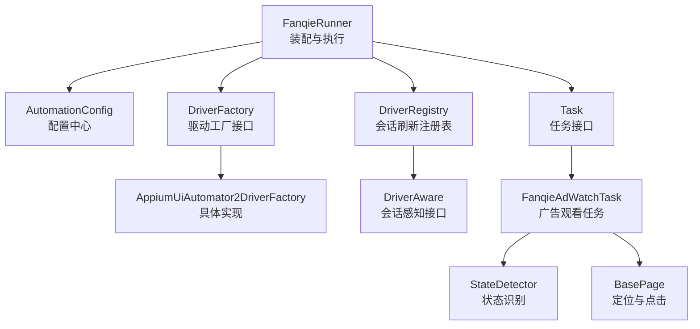
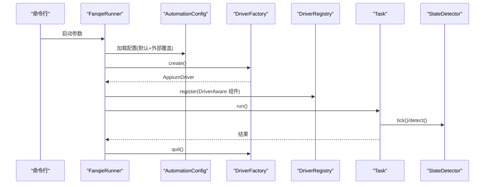
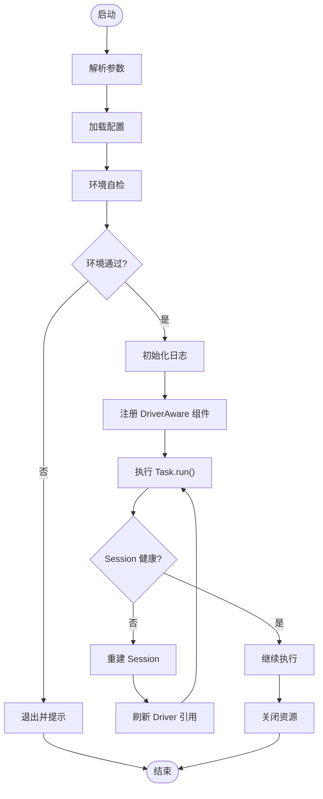
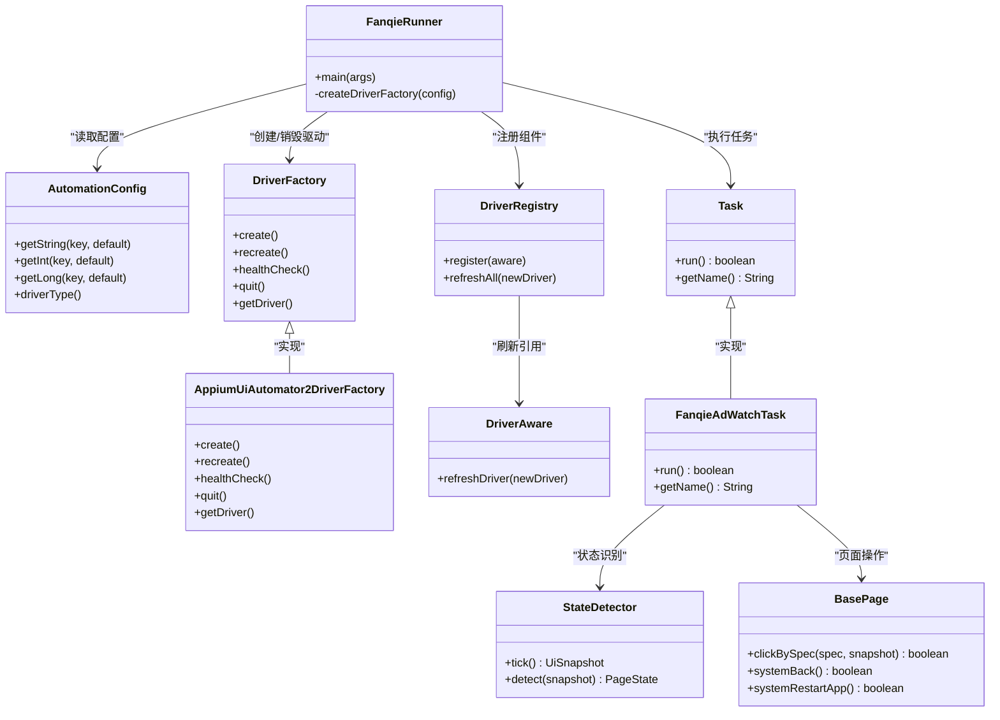

# 插件开发

<cite>
**本文引用的文件**
- [FanqieRunner.java](file://automation/src/main/java/com/fanqie/auto/FanqieRunner.java)
- [AutomationConfig.java](file://automation/src/main/java/com/fanqie/auto/config/AutomationConfig.java)
- [DriverFactory.java](file://automation/src/main/java/com/fanqie/auto/core/DriverFactory.java)
- [AppiumUiAutomator2DriverFactory.java](file://automation/src/main/java/com/fanqie/auto/core/AppiumUiAutomator2DriverFactory.java)
- [DriverAware.java](file://automation/src/main/java/com/fanqie/auto/core/DriverAware.java)
- [DriverRegistry.java](file://automation/src/main/java/com/fanqie/auto/core/DriverRegistry.java)
- [Task.java](file://automation/src/main/java/com/fanqie/auto/task/Task.java)
- [FanqieAdWatchTask.java](file://automation/src/main/java/com/fanqie/auto/task/FanqieAdWatchTask.java)
- [BasePage.java](file://automation/src/main/java/com/fanqie/auto/page/BasePage.java)
- [StateDetector.java](file://automation/src/main/java/com/fanqie/auto/core/StateDetector.java)
- [pom.xml](file://automation/pom.xml)
</cite>

## 目录
1. [简介](#简介)
2. [项目结构](#项目结构)
3. [核心组件](#核心组件)
4. [架构总览](#架构总览)
5. [详细组件分析](#详细组件分析)
6. [依赖关系分析](#依赖关系分析)
7. [性能与可扩展性](#性能与可扩展性)
8. [故障排查指南](#故障排查指南)
9. [结论](#结论)
10. [附录：插件开发完整示例](#附录：插件开发完整示例)

## 简介
本指南面向希望在现有自动化引擎中开发“可插拔功能模块”的工程师。仓库已具备清晰的扩展点与生命周期管理，适合通过接口实现、配置驱动和统一注册机制来扩展新的任务、页面行为或驱动后端。本文将基于代码库中的实际设计，说明如何发现、加载和执行插件，如何在配置中启用与管理插件，以及插件间通信与数据共享方式，并给出测试、打包与发布的流程建议。

## 项目结构
- 入口与装配：FanqieRunner 负责解析参数、装配组件、启动任务、处理异常与退出。
- 配置中心：AutomationConfig 集中管理所有运行时参数（超时、轮次、策略等），支持外部覆盖。
- 驱动抽象：DriverFactory 定义创建/重建/健康检查/退出的统一接口；当前实现为 AppiumUiAutomator2DriverFactory。
- 会话刷新：DriverAware + DriverRegistry 提供 session 重建后批量刷新 driver 引用，避免状态不一致。
- 任务编排：Task 接口承载业务编排；当前实现 FanqieAdWatchTask 演示了完整的业务流程。
- 页面对象：BasePage 提供四级定位与点击能力，供各 Page 复用。
- 状态识别：StateDetector 基于 UI 快照进行高性能状态判定。
- 构建与发布：pom.xml 使用 shade 插件产出 fat-jar，便于独立运行。

图表来源
- [FanqieRunner.java:41-238](file://automation/src/main/java/com/fanqie/auto/FanqieRunner.java#L41-L238)
- [DriverFactory.java:17-54](file://automation/src/main/java/com/fanqie/auto/core/DriverFactory.java#L17-L54)
- [AppiumUiAutomator2DriverFactory.java:33-118](file://automation/src/main/java/com/fanqie/auto/core/AppiumUiAutomator2DriverFactory.java#L33-L118)
- [DriverRegistry.java:19-56](file://automation/src/main/java/com/fanqie/auto/core/DriverRegistry.java#L19-L56)
- [DriverAware.java:12-20](file://automation/src/main/java/com/fanqie/auto/core/DriverAware.java#L12-L20)
- [Task.java:12-25](file://automation/src/main/java/com/fanqie/auto/task/Task.java#L12-L25)
- [FanqieAdWatchTask.java:42-314](file://automation/src/main/java/com/fanqie/auto/task/FanqieAdWatchTask.java#L42-L314)
- [StateDetector.java:29-170](file://automation/src/main/java/com/fanqie/auto/core/StateDetector.java#L29-L170)
- [BasePage.java:18-91](file://automation/src/main/java/com/fanqie/auto/page/BasePage.java#L18-L91)

章节来源
- [FanqieRunner.java:41-238](file://automation/src/main/java/com/fanqie/auto/FanqieRunner.java#L41-L238)
- [pom.xml:100-175](file://automation/pom.xml#L100-L175)

## 核心组件
- 配置中心 AutomationConfig：集中化配置，支持 classpath 默认值与外部文件覆盖，提供类型安全的 getter。
- 驱动抽象 DriverFactory：统一创建/重建/健康检查/退出，屏蔽底层差异，预留鸿蒙 NEXT 等未来实现。
- 会话刷新 DriverAware + DriverRegistry：session 重建后批量刷新引用，保证线程安全与幂等清理。
- 任务编排 Task：解耦业务逻辑，便于扩展新任务。
- 页面对象 BasePage：统一的四级定位与点击降级链，保障鲁棒性。
- 状态识别 StateDetector：高性能纯内存状态判定，避免 RPC 风暴。

章节来源
- [AutomationConfig.java:10-178](file://automation/src/main/java/com/fanqie/auto/config/AutomationConfig.java#L10-L178)
- [DriverFactory.java:17-54](file://automation/src/main/java/com/fanqie/auto/core/DriverFactory.java#L17-L54)
- [DriverAware.java:12-20](file://automation/src/main/java/com/fanqie/auto/core/DriverAware.java#L12-L20)
- [DriverRegistry.java:19-56](file://automation/src/main/java/com/fanqie/auto/core/DriverRegistry.java#L19-L56)
- [Task.java:12-25](file://automation/src/main/java/com/fanqie/auto/task/Task.java#L12-L25)
- [BasePage.java:18-91](file://automation/src/main/java/com/fanqie/auto/page/BasePage.java#L18-L91)
- [StateDetector.java:12-170](file://automation/src/main/java/com/fanqie/auto/core/StateDetector.java#L12-L170)

## 架构总览
系统采用“入口装配 + 接口抽象 + 配置驱动 + 统一注册”的分层架构：
- 入口 FanqieRunner 负责参数解析、环境自检、组件装配、任务执行与优雅退出。
- 通过 DriverFactory 抽象驱动后端，便于替换不同平台实现。
- 通过 Task 接口编排业务流，便于扩展新任务。
- 通过 DriverAware + DriverRegistry 管理会话生命周期，确保一致性。
- 通过 AutomationConfig 集中管理运行时参数，支持外部覆盖。

图表来源
- [FanqieRunner.java:41-238](file://automation/src/main/java/com/fanqie/auto/FanqieRunner.java#L41-L238)
- [AutomationConfig.java:25-42](file://automation/src/main/java/com/fanqie/auto/config/AutomationConfig.java#L25-L42)
- [DriverFactory.java:17-54](file://automation/src/main/java/com/fanqie/auto/core/DriverFactory.java#L17-L54)
- [DriverRegistry.java:19-56](file://automation/src/main/java/com/fanqie/auto/core/DriverRegistry.java#L19-L56)
- [Task.java:12-25](file://automation/src/main/java/com/fanqie/auto/task/Task.java#L12-L25)
- [StateDetector.java:87-170](file://automation/src/main/java/com/fanqie/auto/core/StateDetector.java#L87-L170)

## 详细组件分析

### 插件发现与加载机制
- 发现：当前工程未使用 SPI 自动扫描，而是由 FanqieRunner 在启动时显式装配组件。这种“显式装配”模式更可控，适合企业级自动化场景。
- 加载：通过构造器注入依赖（如 Task、Page、Detector、Logger），并在 DriverRegistry 中注册需要刷新 driver 的组件。
- 扩展点：
  - 新增任务：实现 Task 接口，在 FanqieRunner 中实例化并注册到 DriverRegistry。
  - 新增驱动后端：实现 DriverFactory 接口，并通过配置项选择对应实现。
  - 新增页面行为：继承 BasePage，复用四级定位与点击能力。

章节来源
- [FanqieRunner.java:147-201](file://automation/src/main/java/com/fanqie/auto/FanqieRunner.java#L147-L201)
- [Task.java:12-25](file://automation/src/main/java/com/fanqie/auto/task/Task.java#L12-L25)
- [DriverFactory.java:17-54](file://automation/src/main/java/com/fanqie/auto/core/DriverFactory.java#L17-L54)
- [BasePage.java:18-91](file://automation/src/main/java/com/fanqie/auto/page/BasePage.java#L18-L91)

### 生命周期管理
- 启动阶段：参数解析 → 配置加载 → 环境自检 → 创建 Driver → 初始化 Logger → 注册 DriverAware 组件 → 启动心跳。
- 运行阶段：任务编排（Task.run）→ 状态检测（StateDetector）→ 页面操作（BasePage）→ 恢复与重试（RecoveryHandler）。
- 退出阶段：ShutdownHook 与 finally 双重保护，确保 logger.stop() 与 driver.quit() 幂等执行。

图表来源
- [FanqieRunner.java:41-238](file://automation/src/main/java/com/fanqie/auto/FanqieRunner.java#L41-L238)
- [DriverRegistry.java:43-55](file://automation/src/main/java/com/fanqie/auto/core/DriverRegistry.java#L43-L55)
- [AppiumUiAutomator2DriverFactory.java:78-118](file://automation/src/main/java/com/fanqie/auto/core/AppiumUiAutomator2DriverFactory.java#L78-L118)

章节来源
- [FanqieRunner.java:41-238](file://automation/src/main/java/com/fanqie/auto/FanqieRunner.java#L41-L238)
- [DriverRegistry.java:19-56](file://automation/src/main/java/com/fanqie/auto/core/DriverRegistry.java#L19-L56)
- [AppiumUiAutomator2DriverFactory.java:78-118](file://automation/src/main/java/com/fanqie/auto/core/AppiumUiAutomator2DriverFactory.java#L78-L118)

### 插件间通信与数据共享
- 通过构造器注入共享服务：Task、Page、Detector、Logger、GestureSupport 等作为公共依赖被多个组件持有。
- 会话刷新：DriverAware 接口统一刷新 driver 引用，避免旧 session 导致的异常。
- 状态与进度：StateDetector 提供状态识别；Task 内部维护累计统计（如免广告时长、轮次、已用书籍集合）。
- 配置共享：AutomationConfig 提供全局配置访问，支持运行时覆盖。

章节来源
- [FanqieAdWatchTask.java:42-81](file://automation/src/main/java/com/fanqie/auto/task/FanqieAdWatchTask.java#L42-L81)
- [DriverAware.java:12-20](file://automation/src/main/java/com/fanqie/auto/core/DriverAware.java#L12-L20)
- [DriverRegistry.java:43-55](file://automation/src/main/java/com/fanqie/auto/core/DriverRegistry.java#L43-L55)
- [AutomationConfig.java:67-178](file://automation/src/main/java/com/fanqie/auto/config/AutomationConfig.java#L67-L178)

### 配置管理与启用
- 默认配置：classpath 下的 automation.properties 提供默认值。
- 外部覆盖：通过 --config 指定外部 properties 文件，覆盖默认值。
- 关键配置项：driver.type、timing.*、flow.*、reader.*、runtime.dry.run 等。
- 启用插件：新增任务或驱动后端后，在 FanqieRunner 中装配并注册；或通过配置项切换驱动后端。

章节来源
- [AutomationConfig.java:25-42](file://automation/src/main/java/com/fanqie/auto/config/AutomationConfig.java#L25-L42)
- [AutomationConfig.java:166-178](file://automation/src/main/java/com/fanqie/auto/config/AutomationConfig.java#L166-L178)
- [FanqieRunner.java:48-94](file://automation/src/main/java/com/fanqie/auto/FanqieRunner.java#L48-L94)

### 测试、打包与发布
- 单元测试：JUnit 5 + Surefire，离线回放 fixture XML，不连接真机。
- 构建：maven-compiler-plugin 强制 release=11 与 UTF-8；maven-surefire-plugin 运行测试；exec-maven-plugin 直接运行入口类。
- 打包：maven-shade-plugin 生成 fat-jar，合并 META-INF/services，便于长任务稳定运行。
- 发布：将 fat-jar 与配置文件一起分发，通过命令行参数控制运行模式。

章节来源
- [pom.xml:15-28](file://automation/pom.xml#L15-L28)
- [pom.xml:100-175](file://automation/pom.xml#L100-L175)

## 依赖关系分析
- FanqieRunner 依赖配置、驱动工厂、日志、状态检测、手势支持、页面对象与任务编排。
- DriverFactory 抽象驱动后端，当前实现为 AppiumUiAutomator2DriverFactory。
- DriverRegistry 管理 DriverAware 组件，确保 session 重建后引用一致。
- Task 接口解耦业务逻辑，便于扩展新任务。
- BasePage 提供通用定位与点击能力，降低重复实现成本。
- StateDetector 提供高性能状态识别，避免 RPC 风暴。

图表来源
- [FanqieRunner.java:41-238](file://automation/src/main/java/com/fanqie/auto/FanqieRunner.java#L41-L238)
- [AutomationConfig.java:10-178](file://automation/src/main/java/com/fanqie/auto/config/AutomationConfig.java#L10-L178)
- [DriverFactory.java:17-54](file://automation/src/main/java/com/fanqie/auto/core/DriverFactory.java#L17-L54)
- [AppiumUiAutomator2DriverFactory.java:33-118](file://automation/src/main/java/com/fanqie/auto/core/AppiumUiAutomator2DriverFactory.java#L33-L118)
- [DriverRegistry.java:19-56](file://automation/src/main/java/com/fanqie/auto/core/DriverRegistry.java#L19-L56)
- [DriverAware.java:12-20](file://automation/src/main/java/com/fanqie/auto/core/DriverAware.java#L12-L20)
- [Task.java:12-25](file://automation/src/main/java/com/fanqie/auto/task/Task.java#L12-L25)
- [FanqieAdWatchTask.java:42-314](file://automation/src/main/java/com/fanqie/auto/task/FanqieAdWatchTask.java#L42-L314)
- [BasePage.java:18-91](file://automation/src/main/java/com/fanqie/auto/page/BasePage.java#L18-L91)
- [StateDetector.java:29-170](file://automation/src/main/java/com/fanqie/auto/core/StateDetector.java#L29-L170)

章节来源
- [FanqieRunner.java:41-238](file://automation/src/main/java/com/fanqie/auto/FanqieRunner.java#L41-L238)
- [DriverFactory.java:17-54](file://automation/src/main/java/com/fanqie/auto/core/DriverFactory.java#L17-L54)
- [DriverRegistry.java:19-56](file://automation/src/main/java/com/fanqie/auto/core/DriverRegistry.java#L19-L56)
- [Task.java:12-25](file://automation/src/main/java/com/fanqie/auto/task/Task.java#L12-L25)
- [BasePage.java:18-91](file://automation/src/main/java/com/fanqie/auto/page/BasePage.java#L18-L91)
- [StateDetector.java:29-170](file://automation/src/main/java/com/fanqie/auto/core/StateDetector.java#L29-L170)

## 性能与可扩展性
- 性能优化：
  - StateDetector 仅一次 getPageSource()，同一 tick 内缓存复用，避免 RPC 风暴。
  - 屏幕尺寸缓存与自愈，避免横屏/折叠屏旋转导致比例判定失真。
  - 四级定位与几何兜底，减少误点与失败重试。
- 可扩展性：
  - DriverFactory 抽象驱动后端，便于替换不同平台实现。
  - Task 接口解耦业务逻辑，便于扩展新任务。
  - BasePage 提供通用定位与点击能力，降低重复实现成本。
  - AutomationConfig 集中配置，支持外部覆盖，便于多环境部署。

章节来源
- [StateDetector.java:87-170](file://automation/src/main/java/com/fanqie/auto/core/StateDetector.java#L87-L170)
- [BasePage.java:18-91](file://automation/src/main/java/com/fanqie/auto/page/BasePage.java#L18-L91)
- [AutomationConfig.java:25-42](file://automation/src/main/java/com/fanqie/auto/config/AutomationConfig.java#L25-L42)
- [DriverFactory.java:17-54](file://automation/src/main/java/com/fanqie/auto/core/DriverFactory.java#L17-L54)
- [Task.java:12-25](file://automation/src/main/java/com/fanqie/auto/task/Task.java#L12-L25)

## 故障排查指南
- 环境自检失败：根据 FanqieRunner 的诊断信息逐项排查设备设置与权限。
- Session 创建失败：查看 AppiumUiAutomator2DriverFactory 的诊断输出，确认 Appium Server、USB 调试、授权等。
- 状态识别异常：检查 LocatorRegistry 候选集与正则，必要时调整匹配优先级。
- 页面定位失败：利用 BasePage 四级定位与 boundsHint 裁决，必要时开启 dry-run 模式验证 UI 树。
- 任务异常终止：查看日志与快照，确认 RecoveryHandler 是否成功恢复。

章节来源
- [FanqieRunner.java:101-114](file://automation/src/main/java/com/fanqie/auto/FanqieRunner.java#L101-L114)
- [AppiumUiAutomator2DriverFactory.java:180-208](file://automation/src/main/java/com/fanqie/auto/core/AppiumUiAutomator2DriverFactory.java#L180-L208)
- [StateDetector.java:152-170](file://automation/src/main/java/com/fanqie/auto/core/StateDetector.java#L152-L170)
- [BasePage.java:77-91](file://automation/src/main/java/com/fanqie/auto/page/BasePage.java#L77-L91)

## 结论
该工程提供了清晰的分层架构与扩展点，适合通过接口实现、配置驱动和统一注册机制来开发可插拔功能模块。通过 DriverFactory 抽象驱动后端、Task 接口编排业务逻辑、BasePage 提供通用定位与点击能力、StateDetector 实现高性能状态识别，开发者可以以最小改动扩展新任务或新平台。配合自动化测试与 fat-jar 打包，可实现稳定可靠的自动化流程。

## 附录：插件开发完整示例

### 目标
- 新增一个自定义任务插件（例如“签到任务”），实现 Task 接口。
- 新增一个页面行为插件（例如“签到页操作”），继承 BasePage。
- 通过配置启用新任务，并在 FanqieRunner 中装配与注册。
- 编写单元测试，使用 JUnit 5 与 Surefire。
- 打包为 fat-jar 并发布。

### 步骤
1. 实现 Task 接口
   - 新建类实现 Task 接口，提供 run() 与 getName()。
   - 在 run() 中编排业务逻辑，调用 StateDetector、BasePage 等共享服务。
   - 如需刷新 driver 引用，实现 DriverAware 接口。

2. 实现页面行为
   - 新建类继承 BasePage，复用四级定位与点击能力。
   - 提供业务方法（如 clickSignButton()），封装定位与点击逻辑。

3. 装配与注册
   - 在 FanqieRunner 中实例化新任务与页面行为。
   - 将实现 DriverAware 的组件注册到 DriverRegistry。
   - 通过配置项选择是否启用新任务。

4. 配置管理
   - 在 AutomationConfig 中添加新任务的开关与参数。
   - 支持外部 properties 文件覆盖。

5. 测试
   - 使用 JUnit 5 编写单元测试，离线回放 fixture XML。
   - 验证状态识别与页面操作的正确性。

6. 打包与发布
   - 使用 maven-shade-plugin 生成 fat-jar。
   - 将 fat-jar 与配置文件一起分发。
   - 通过命令行参数控制运行模式。

章节来源
- [Task.java:12-25](file://automation/src/main/java/com/fanqie/auto/task/Task.java#L12-L25)
- [BasePage.java:18-91](file://automation/src/main/java/com/fanqie/auto/page/BasePage.java#L18-L91)
- [FanqieRunner.java:147-201](file://automation/src/main/java/com/fanqie/auto/FanqieRunner.java#L147-L201)
- [AutomationConfig.java:25-42](file://automation/src/main/java/com/fanqie/auto/config/AutomationConfig.java#L25-L42)
- [pom.xml:100-175](file://automation/pom.xml#L100-L175)