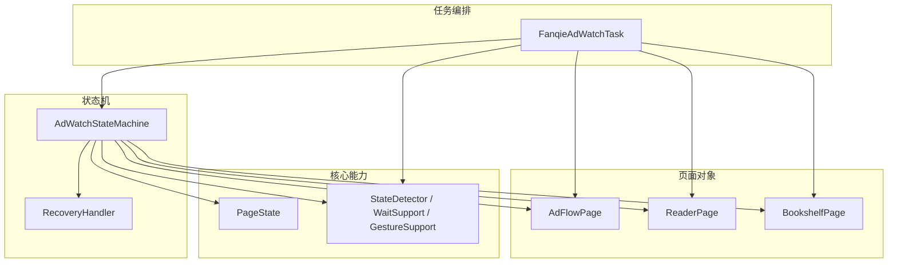
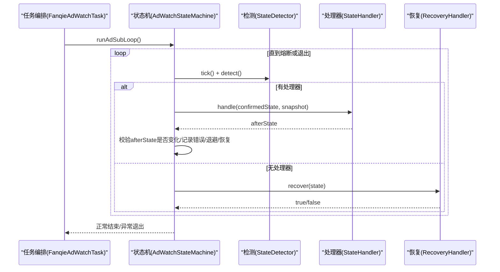
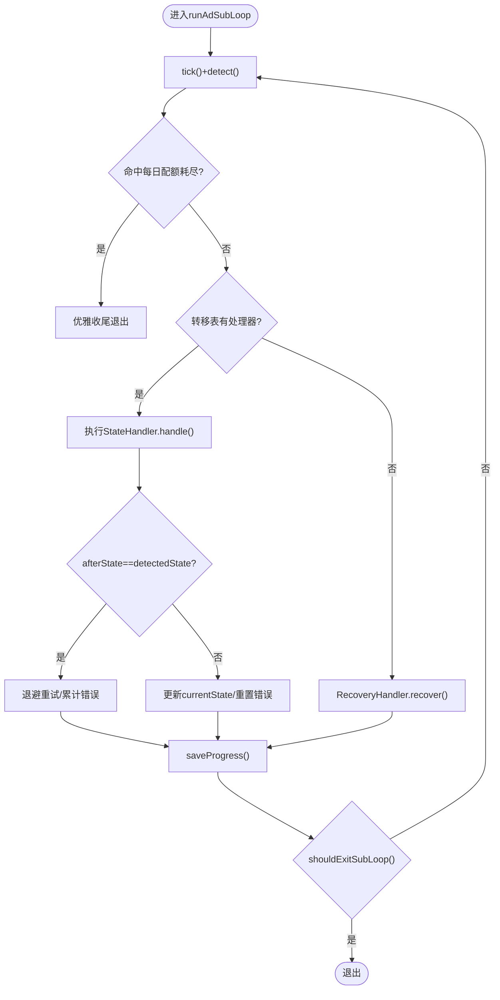
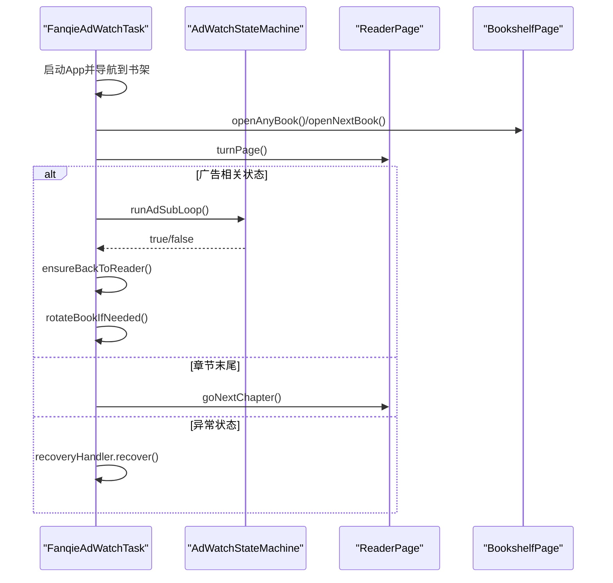
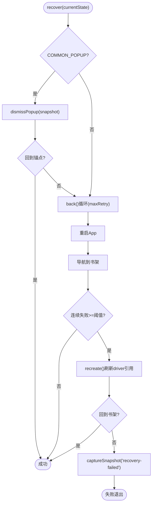
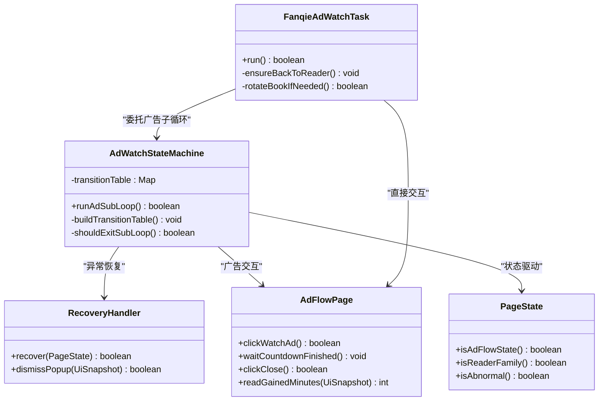

# 状态扩展

<cite>
**本文引用的文件**
- [AdWatchStateMachine.java](file://automation/src/main/java/com/fanqie/auto/task/AdWatchStateMachine.java)
- [FanqieAdWatchTask.java](file://automation/src/main/java/com/fanqie/auto/task/FanqieAdWatchTask.java)
- [RecoveryHandler.java](file://automation/src/main/java/com/fanqie/auto/task/RecoveryHandler.java)
- [PageState.java](file://automation/src/main/java/com/fanqie/auto/core/PageState.java)
- [AdFlowPage.java](file://automation/src/main/java/com/fanqie/auto/page/AdFlowPage.java)
- [AdWatchStateMachineTest.java](file://automation/src/test/java/com/fanqie/auto/task/AdWatchStateMachineTest.java)
</cite>

## 目录
1. [引言](#引言)
2. [项目结构](#项目结构)
3. [核心组件](#核心组件)
4. [架构总览](#架构总览)
5. [详细组件分析](#详细组件分析)
6. [依赖关系分析](#依赖关系分析)
7. [性能与稳定性考量](#性能与稳定性考量)
8. [故障排查指南](#故障排查指南)
9. [结论](#结论)
10. [附录：添加新状态的完整步骤](#附录添加新状态的完整步骤)

## 引言
本指南面向需要在现有自动化任务中扩展“页面状态”和“处理逻辑”的开发者。系统采用状态机驱动的设计，通过转移表将“当前状态”映射到“处理器”，实现解耦、可测试、可扩展的流程控制。本文重点解释 AdWatchStateMachine 的状态机设计模式（状态定义、转移条件、处理器注册机制），并提供添加新状态的完整步骤，涵盖状态枚举扩展、处理器实现、转移表配置、复杂业务场景处理（多条件判断、异步操作、异常恢复）以及调试与日志最佳实践。

## 项目结构
围绕状态机的关键代码位于 automation 模块的 task、core、page 包下：
- task：状态机、任务编排、恢复处理器
- core：状态枚举、检测、等待、手势等基础设施
- page：页面对象封装具体 UI 交互（广告流程、书架、阅读器）

图表来源
- [AdWatchStateMachine.java:62-157](file://automation/src/main/java/com/fanqie/auto/task/AdWatchStateMachine.java#L62-L157)
- [FanqieAdWatchTask.java:42-81](file://automation/src/main/java/com/fanqie/auto/task/FanqieAdWatchTask.java#L42-L81)
- [RecoveryHandler.java:44-76](file://automation/src/main/java/com/fanqie/auto/task/RecoveryHandler.java#L44-L76)
- [PageState.java:11-97](file://automation/src/main/java/com/fanqie/auto/core/PageState.java#L11-L97)
- [AdFlowPage.java:38-65](file://automation/src/main/java/com/fanqie/auto/page/AdFlowPage.java#L38-L65)

章节来源
- [AdWatchStateMachine.java:62-157](file://automation/src/main/java/com/fanqie/auto/task/AdWatchStateMachine.java#L62-L157)
- [FanqieAdWatchTask.java:42-81](file://automation/src/main/java/com/fanqie/auto/task/FanqieAdWatchTask.java#L42-L81)
- [RecoveryHandler.java:44-76](file://automation/src/main/java/com/fanqie/auto/task/RecoveryHandler.java#L44-L76)
- [PageState.java:11-97](file://automation/src/main/java/com/fanqie/auto/core/PageState.java#L11-L97)
- [AdFlowPage.java:38-65](file://automation/src/main/java/com/fanqie/auto/page/AdFlowPage.java#L38-L65)

## 核心组件
- 状态枚举 PageState：集中定义所有页面状态，提供辅助方法（是否广告态、是否阅读页家族、是否异常态）。
- 状态机 AdWatchStateMachine：以转移表驱动，维护进度、熔断、幂等、持久化等核心能力；每个状态对应一个 StateHandler。
- 任务编排 FanqieAdWatchTask：负责启动 App、进入阅读页、翻页循环、遇到广告态时委托状态机处理，并在子循环后确保回到阅读页。
- 恢复处理器 RecoveryHandler：五级自愈策略，从弹窗关闭、逐级返回、重启 App、导航到书架、重建 session 到落盘诊断。
- 页面对象 AdFlowPage：封装广告流程的高风险交互（点击观看广告、等待倒计时、四级关闭降级、奖励分钟数提取）。

章节来源
- [PageState.java:11-97](file://automation/src/main/java/com/fanqie/auto/core/PageState.java#L11-L97)
- [AdWatchStateMachine.java:62-157](file://automation/src/main/java/com/fanqie/auto/task/AdWatchStateMachine.java#L62-L157)
- [FanqieAdWatchTask.java:42-81](file://automation/src/main/java/com/fanqie/auto/task/FanqieAdWatchTask.java#L42-L81)
- [RecoveryHandler.java:44-76](file://automation/src/main/java/com/fanqie/auto/task/RecoveryHandler.java#L44-L76)
- [AdFlowPage.java:38-65](file://automation/src/main/java/com/fanqie/auto/page/AdFlowPage.java#L38-L65)

## 架构总览
状态机主循环每 tick 获取快照并检测状态，根据转移表调用对应处理器，处理器执行动作后返回“实际状态”，状态机据此更新当前状态并继续决策。四重熔断保护防止死循环空转；连续错误触发退避重试与恢复；每日配额耗尽识别优雅收尾。

图表来源
- [AdWatchStateMachine.java:173-312](file://automation/src/main/java/com/fanqie/auto/task/AdWatchStateMachine.java#L173-L312)
- [RecoveryHandler.java:100-253](file://automation/src/main/java/com/fanqie/auto/task/RecoveryHandler.java#L100-L253)

## 详细组件分析

### 状态机 AdWatchStateMachine
- 转移表驱动：Map<PageState, StateHandler>，在构造时 buildTransitionTable() 注册各状态处理器。
- 幂等性：每次动作前重新 detect() 确认状态未漂移；动作后校验是否发生预期转移，否则计入失败并退避重试。
- 熔断：目标分钟达成、单入口轮次上限、全局轮次上限、墙钟时间预算耗尽、单状态滞留超时。
- 进度持久化：断点续跑，支持 per-book 维度已用书籍集合的时效恢复。
- 奖励计数幂等：基于 roundId 与 lastCountedRoundId 保证每真实一轮至多计一次且不漏计。

图表来源
- [AdWatchStateMachine.java:173-312](file://automation/src/main/java/com/fanqie/auto/task/AdWatchStateMachine.java#L173-L312)
- [AdWatchStateMachine.java:355-394](file://automation/src/main/java/com/fanqie/auto/task/AdWatchStateMachine.java#L355-L394)
- [AdWatchStateMachine.java:655-669](file://automation/src/main/java/com/fanqie/auto/task/AdWatchStateMachine.java#L655-L669)

章节来源
- [AdWatchStateMachine.java:62-157](file://automation/src/main/java/com/fanqie/auto/task/AdWatchStateMachine.java#L62-L157)
- [AdWatchStateMachine.java:173-312](file://automation/src/main/java/com/fanqie/auto/task/AdWatchStateMachine.java#L173-L312)
- [AdWatchStateMachine.java:355-394](file://automation/src/main/java/com/fanqie/auto/task/AdWatchStateMachine.java#L355-L394)
- [AdWatchStateMachine.java:398-653](file://automation/src/main/java/com/fanqie/auto/task/AdWatchStateMachine.java#L398-L653)
- [AdWatchStateMachine.java:679-734](file://automation/src/main/java/com/fanqie/auto/task/AdWatchStateMachine.java#L679-L734)

### 任务编排 FanqieAdWatchTask
- 外层循环控制翻页次数与整体目标；内层翻页后根据状态决策：广告态进入状态机、章节末尾跳转下一章、异常态交由恢复处理器。
- 广告子循环结束后确保回到阅读页家族；必要时按规则轮换书籍，保持“子循环后必在 READER”的不变量。

图表来源
- [FanqieAdWatchTask.java:99-314](file://automation/src/main/java/com/fanqie/auto/task/FanqieAdWatchTask.java#L99-L314)
- [FanqieAdWatchTask.java:322-396](file://automation/src/main/java/com/fanqie/auto/task/FanqieAdWatchTask.java#L322-L396)
- [FanqieAdWatchTask.java:464-525](file://automation/src/main/java/com/fanqie/auto/task/FanqieAdWatchTask.java#L464-L525)
- [FanqieAdWatchTask.java:537-623](file://automation/src/main/java/com/fanqie/auto/task/FanqieAdWatchTask.java#L537-L623)

章节来源
- [FanqieAdWatchTask.java:99-314](file://automation/src/main/java/com/fanqie/auto/task/FanqieAdWatchTask.java#L99-L314)
- [FanqieAdWatchTask.java:322-396](file://automation/src/main/java/com/fanqie/auto/task/FanqieAdWatchTask.java#L322-L396)
- [FanqieAdWatchTask.java:464-525](file://automation/src/main/java/com/fanqie/auto/task/FanqieAdWatchTask.java#L464-L525)
- [FanqieAdWatchTask.java:537-623](file://automation/src/main/java/com/fanqie/auto/task/FanqieAdWatchTask.java#L537-L623)

### 恢复处理器 RecoveryHandler
- 五级恢复：弹窗关闭 → 逐级 back() → 重启 App → 导航到书架 → 重建 session → 落盘诊断。
- 安全底线：超过最大恢复次数停止并保留现场，避免盲目连点导致更严重偏离。

图表来源
- [RecoveryHandler.java:100-253](file://automation/src/main/java/com/fanqie/auto/task/RecoveryHandler.java#L100-L253)
- [RecoveryHandler.java:269-321](file://automation/src/main/java/com/fanqie/auto/task/RecoveryHandler.java#L269-L321)

章节来源
- [RecoveryHandler.java:100-253](file://automation/src/main/java/com/fanqie/auto/task/RecoveryHandler.java#L100-L253)
- [RecoveryHandler.java:269-321](file://automation/src/main/java/com/fanqie/auto/task/RecoveryHandler.java#L269-L321)

### 页面对象 AdFlowPage
- 高风险区：视频播放期间不做任何点击，仅心跳等待状态转变；关闭按钮启用全链路降级（语义→几何→时序→系统兜底）。
- 奖励分钟数提取：仅认带奖励语义的文案，避免误计“剩余/还剩”等非奖励内容。

章节来源
- [AdFlowPage.java:38-65](file://automation/src/main/java/com/fanqie/auto/page/AdFlowPage.java#L38-L65)
- [AdFlowPage.java:76-101](file://automation/src/main/java/com/fanqie/auto/page/AdFlowPage.java#L76-L101)
- [AdFlowPage.java:116-163](file://automation/src/main/java/com/fanqie/auto/page/AdFlowPage.java#L116-L163)
- [AdFlowPage.java:180-262](file://automation/src/main/java/com/fanqie/auto/page/AdFlowPage.java#L180-L262)
- [AdFlowPage.java:272-297](file://automation/src/main/java/com/fanqie/auto/page/AdFlowPage.java#L272-L297)
- [AdFlowPage.java:317-363](file://automation/src/main/java/com/fanqie/auto/page/AdFlowPage.java#L317-L363)

## 依赖关系分析
- 状态机依赖检测器、等待支持、手势、页面对象、恢复处理器与配置；通过构造函数注入，避免耦合。
- 任务编排依赖状态机与页面对象，负责高层流程与边界条件处理。
- 恢复处理器依赖检测器、等待支持、手势、驱动工厂与注册表，具备跨组件恢复能力。

图表来源
- [AdWatchStateMachine.java:62-157](file://automation/src/main/java/com/fanqie/auto/task/AdWatchStateMachine.java#L62-L157)
- [FanqieAdWatchTask.java:42-81](file://automation/src/main/java/com/fanqie/auto/task/FanqieAdWatchTask.java#L42-L81)
- [RecoveryHandler.java:44-76](file://automation/src/main/java/com/fanqie/auto/task/RecoveryHandler.java#L44-L76)
- [AdFlowPage.java:38-65](file://automation/src/main/java/com/fanqie/auto/page/AdFlowPage.java#L38-L65)
- [PageState.java:11-97](file://automation/src/main/java/com/fanqie/auto/core/PageState.java#L11-L97)

章节来源
- [AdWatchStateMachine.java:62-157](file://automation/src/main/java/com/fanqie/auto/task/AdWatchStateMachine.java#L62-L157)
- [FanqieAdWatchTask.java:42-81](file://automation/src/main/java/com/fanqie/auto/task/FanqieAdWatchTask.java#L42-L81)
- [RecoveryHandler.java:44-76](file://automation/src/main/java/com/fanqie/auto/task/RecoveryHandler.java#L44-L76)
- [AdFlowPage.java:38-65](file://automation/src/main/java/com/fanqie/auto/page/AdFlowPage.java#L38-L65)
- [PageState.java:11-97](file://automation/src/main/java/com/fanqie/auto/core/PageState.java#L11-L97)

## 性能与稳定性考量
- 幂等性与状态校验：每次动作前后均重新检测状态，避免“点击已消失控件”导致的无效操作与状态漂移。
- 退避重试：连续错误采用指数退避（500ms→1s→2s），降低瞬时抖动对流程的影响。
- 熔断保护：四重独立熔断（目标分钟、单入口轮次、全局轮次、墙钟预算）与单状态滞留超时，杜绝死循环空转。
- 视频等待稀疏轮询：视频播放期间使用较稀疏的心跳间隔，减少 CPU 与 RPC 压力。
- 进度持久化：断点续跑，支持 per-book 维度进度与时效控制，提升长任务鲁棒性。

[本节为通用指导，不直接分析具体文件]

## 故障排查指南
- 常见异常路径：
  - 转移表无处理器：记录错误类型 no_handler_XXX，触发恢复。
  - 动作后状态未转移：记录 no_transition_XXX，累计错误并退避重试。
  - 处理器执行异常：记录 handler_exception_XXX，累计错误并尝试恢复。
  - 每日配额耗尽：去抖判定后优雅收尾，避免反复重试。
- 恢复流程：
  - 弹窗关闭失败 → 逐级 back() → 重启 App → 导航到书架 → 重建 session → 落盘诊断。
- 定位建议：
  - 查看 RunLogger 输出与快照文件，关注状态变更与错误类型。
  - 检查 progress.properties 中的 earnedMinutes、totalAdRounds、usedBooks 与 lastUpdateDate。
  - 针对广告关闭失败，优先检查 L1 文案匹配与 L2/L3/L4 降级链是否生效。

章节来源
- [AdWatchStateMachine.java:235-302](file://automation/src/main/java/com/fanqie/auto/task/AdWatchStateMachine.java#L235-L302)
- [AdWatchStateMachine.java:197-215](file://automation/src/main/java/com/fanqie/auto/task/AdWatchStateMachine.java#L197-L215)
- [RecoveryHandler.java:100-253](file://automation/src/main/java/com/fanqie/auto/task/RecoveryHandler.java#L100-L253)
- [AdWatchStateMachineTest.java:132-178](file://automation/src/test/java/com/fanqie/auto/task/AdWatchStateMachineTest.java#L132-L178)

## 结论
该状态机以转移表为核心，结合幂等性、熔断、退避重试与多级恢复，实现了高鲁棒性的自动化流程控制。扩展新状态时，应遵循“状态枚举扩展—处理器实现—转移表注册—异常与恢复—日志与调试”的标准化流程，确保新增状态能无缝融入现有体系，并保持系统的可观测性与可维护性。

[本节为总结性内容，不直接分析具体文件]

## 附录：添加新状态的完整步骤

### 1. 扩展状态枚举
- 在 PageState 中添加新的状态值，并为日志可读性提供中文描述。
- 若新状态属于广告流程或阅读页家族，需在相应辅助方法中纳入分类（如 isAdFlowState、isReaderFamily）。

章节来源
- [PageState.java:11-97](file://automation/src/main/java/com/fanqie/auto/core/PageState.java#L11-L97)

### 2. 实现状态处理器
- 在 AdWatchStateMachine.buildTransitionTable() 中为新状态注册 StateHandler。
- 处理器职责：
  - 读取当前快照，执行业务动作（点击、等待、导航等）。
  - 返回“处理后实际状态”，供状态机判断是否需要重新决策。
  - 若动作失败或状态未转移，返回原状态以便上层进行退避重试或恢复。

章节来源
- [AdWatchStateMachine.java:398-653](file://automation/src/main/java/com/fanqie/auto/task/AdWatchStateMachine.java#L398-L653)

### 3. 配置转移条件与后续状态
- 在处理器内部使用 WaitSupport.untilState 等待目标状态集合出现，或直接调用 detector.detect() 获取最新状态。
- 对于需要多条件判断的场景（如是否继续观看、是否达到上限），在处理器中进行业务判断后再决定下一步状态。

章节来源
- [AdWatchStateMachine.java:450-465](file://automation/src/main/java/com/fanqie/auto/task/AdWatchStateMachine.java#L450-L465)
- [AdWatchStateMachine.java:524-559](file://automation/src/main/java/com/fanqie/auto/task/AdWatchStateMachine.java#L524-L559)

### 4. 处理复杂业务场景
- 多条件判断：在处理器中组合熔断条件（目标分钟、轮次上限、墙钟预算）与业务条件（是否继续、是否达到配额）。
- 异步操作：对于耗时操作（如等待视频倒计时），使用 WaitSupport 与稀疏轮询，避免阻塞与误触。
- 异常恢复：当处理器无法恢复时，返回原状态或 UNKNOWN/RECOVERY_NEEDED，交由 RecoveryHandler 执行五级恢复。

章节来源
- [AdWatchStateMachine.java:355-394](file://automation/src/main/java/com/fanqie/auto/task/AdWatchStateMachine.java#L355-L394)
- [AdFlowPage.java:116-163](file://automation/src/main/java/com/fanqie/auto/page/AdFlowPage.java#L116-L163)
- [RecoveryHandler.java:100-253](file://automation/src/main/java/com/fanqie/auto/task/RecoveryHandler.java#L100-L253)

### 5. 调试与日志最佳实践
- 在每个处理器入口与关键分支记录状态与上下文信息，便于追踪状态流转。
- 使用 RunLogger 记录状态变更、错误类型与进度指标（如广告轮次、累计分钟）。
- 利用快照与 XML 长度指标评估 UI 抓取质量，定位状态误判问题。
- 对异常路径统一记录错误类型（no_handler_、no_transition_、handler_exception_），并结合 RecoveryHandler 的恢复结果进行分析。

章节来源
- [AdWatchStateMachine.java:173-312](file://automation/src/main/java/com/fanqie/auto/task/AdWatchStateMachine.java#L173-L312)
- [AdWatchStateMachine.java:235-302](file://automation/src/main/java/com/fanqie/auto/task/AdWatchStateMachine.java#L235-L302)
- [AdWatchStateMachineTest.java:76-81](file://automation/src/test/java/com/fanqie/auto/task/AdWatchStateMachineTest.java#L76-L81)