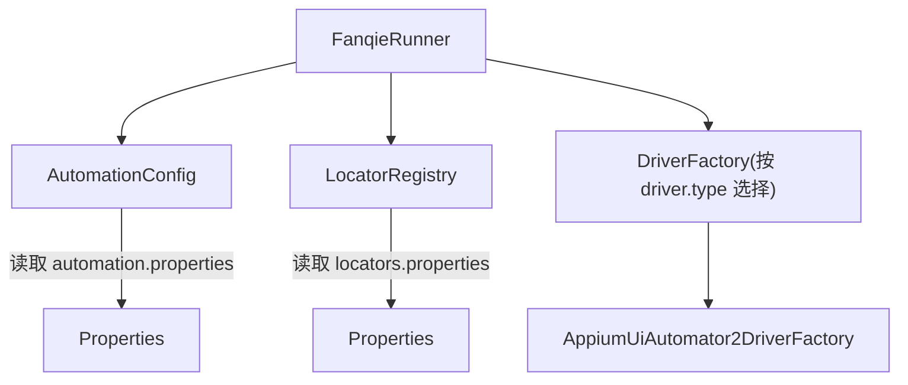
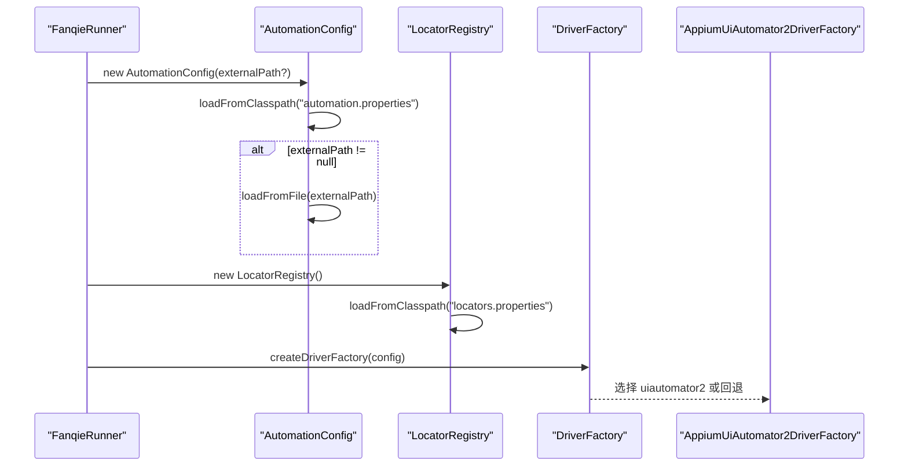
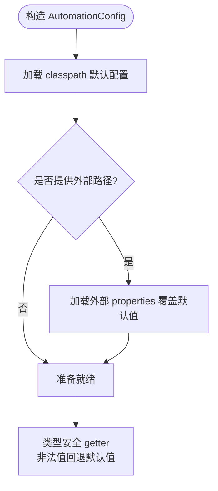
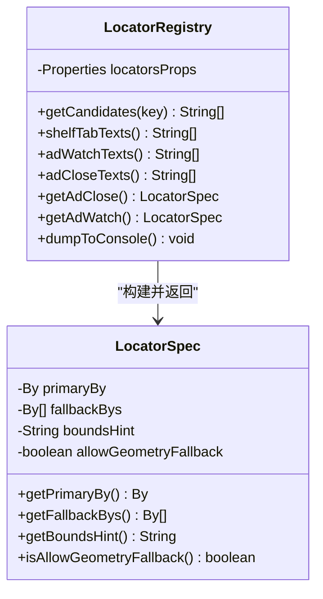
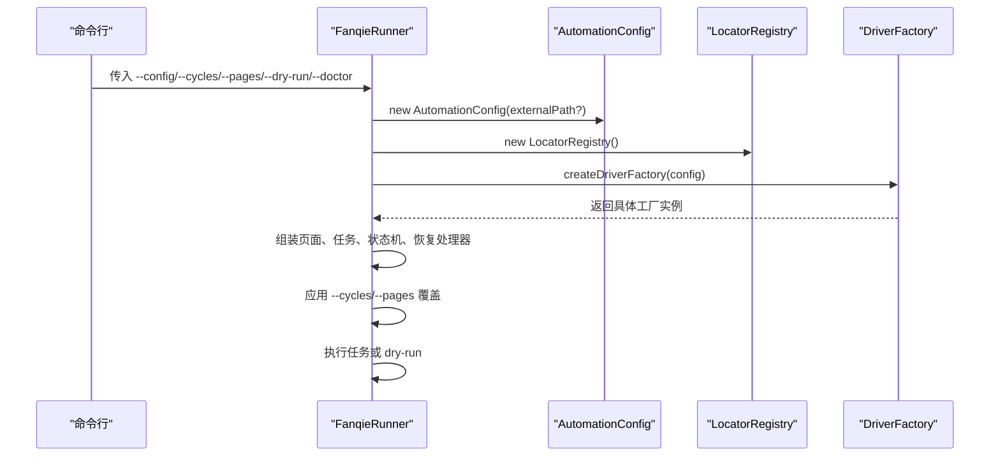
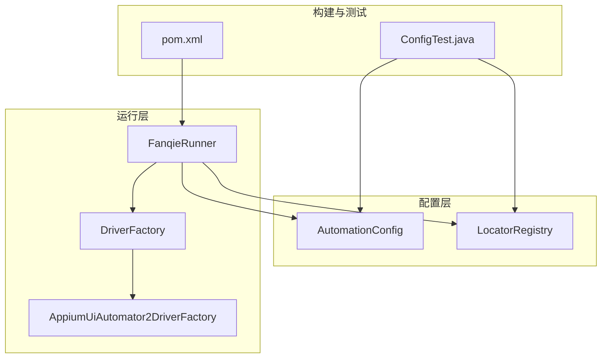

# 配置扩展

<cite>
**本文引用的文件**
- [AutomationConfig.java](file://automation/src/main/java/com/fanqie/auto/config/AutomationConfig.java)
- [LocatorRegistry.java](file://automation/src/main/java/com/fanqie/auto/config/LocatorRegistry.java)
- [FanqieRunner.java](file://automation/src/main/java/com/fanqie/auto/FanqieRunner.java)
- [AppiumUiAutomator2DriverFactory.java](file://automation/src/main/java/com/fanqie/auto/core/AppiumUiAutomator2DriverFactory.java)
- [ConfigTest.java](file://automation/src/test/java/com/fanqie/auto/config/ConfigTest.java)
- [pom.xml](file://automation/pom.xml)
</cite>

## 目录
1. [简介](#简介)
2. [项目结构](#项目结构)
3. [核心组件](#核心组件)
4. [架构总览](#架构总览)
5. [详细组件分析](#详细组件分析)
6. [依赖关系分析](#依赖关系分析)
7. [性能与稳定性考量](#性能与稳定性考量)
8. [故障排除指南](#故障排除指南)
9. [结论](#结论)
10. [附录：添加新配置项的完整步骤](#附录添加新配置项的完整步骤)

## 简介
本指南面向需要在现有自动化系统中扩展配置能力的开发者。内容涵盖：
- 如何新增配置项与验证规则
- AutomationConfig 的配置加载、合并与覆盖策略
- 配置文件格式与环境变量注入的处理方式
- 运行时修改与热重载机制的现状与建议
- 最佳实践与常见问题排查

## 项目结构
本项目将“配置”与“定位器”解耦：
- 运行期参数（超时、轮次、阈值等）集中在 AutomationConfig，统一从 properties 读取并提供类型安全的 getter
- UI 控件文案与正则等“可配置化”的定位策略集中在 LocatorRegistry，通过 UTF-8 编码的 locators.properties 管理
- 入口 FanqieRunner 负责装配配置、环境检查、驱动工厂选择与任务执行
- AppiumUiAutomator2DriverFactory 将配置映射为 Appium 能力选项
- ConfigTest 提供离线单元测试，覆盖默认值、非法值回退、外部覆盖等关键场景

图表来源
- [FanqieRunner.java:89-121](file://automation/src/main/java/com/fanqie/auto/FanqieRunner.java#L89-L121)
- [AutomationConfig.java:25-42](file://automation/src/main/java/com/fanqie/auto/config/AutomationConfig.java#L25-L42)
- [LocatorRegistry.java:52-65](file://automation/src/main/java/com/fanqie/auto/config/LocatorRegistry.java#L52-L65)
- [AppiumUiAutomator2DriverFactory.java:130-155](file://automation/src/main/java/com/fanqie/auto/core/AppiumUiAutomator2DriverFactory.java#L130-L155)

章节来源
- [FanqieRunner.java:25-121](file://automation/src/main/java/com/fanqie/auto/FanqieRunner.java#L25-L121)
- [AutomationConfig.java:10-42](file://automation/src/main/java/com/fanqie/auto/config/AutomationConfig.java#L10-L42)
- [LocatorRegistry.java:16-65](file://automation/src/main/java/com/fanqie/auto/config/LocatorRegistry.java#L16-L65)

## 核心组件
- AutomationConfig：集中式配置加载器，提供类型安全的 getter；支持 classpath 默认配置与外部路径覆盖；对非法值进行安全回退
- LocatorRegistry：UI 控件定位器注册表，管理候选文案、正则与几何兜底策略；强调 UTF-8 编码与中文匹配正确性
- FanqieRunner：唯一 main 入口，解析命令行参数、装配组件、启动任务；支持 --config 指定外部配置文件
- AppiumUiAutomator2DriverFactory：将配置转换为 Appium 能力，如平台名、自动化名称、超时、权限等
- ConfigTest：覆盖默认值、非法值回退、外部覆盖、候选集加载与几何兜底约束等测试用例

章节来源
- [AutomationConfig.java:65-305](file://automation/src/main/java/com/fanqie/auto/config/AutomationConfig.java#L65-L305)
- [LocatorRegistry.java:95-148](file://automation/src/main/java/com/fanqie/auto/config/LocatorRegistry.java#L95-L148)
- [FanqieRunner.java:41-121](file://automation/src/main/java/com/fanqie/auto/FanqieRunner.java#L41-L121)
- [AppiumUiAutomator2DriverFactory.java:130-155](file://automation/src/main/java/com/fanqie/auto/core/AppiumUiAutomator2DriverFactory.java#L130-L155)
- [ConfigTest.java:35-81](file://automation/src/test/java/com/fanqie/auto/config/ConfigTest.java#L35-L81)

## 架构总览
配置在启动时完成加载与合并，随后被各组件消费。关键流程如下：
- 启动时由 FanqieRunner 解析命令行参数，决定是否使用外部配置文件
- AutomationConfig 先加载 classpath 默认配置，再加载外部配置进行覆盖
- 若外部配置缺失或包含非法值，getter 会返回内置默认值并记录警告
- LocatorRegistry 独立加载 locators.properties，确保中文无乱码
- DriverFactory 根据 driver.type 选择具体实现，未知值回退到 uiautomator2

图表来源
- [FanqieRunner.java:89-121](file://automation/src/main/java/com/fanqie/auto/FanqieRunner.java#L89-L121)
- [AutomationConfig.java:25-42](file://automation/src/main/java/com/fanqie/auto/config/AutomationConfig.java#L25-L42)
- [LocatorRegistry.java:52-65](file://automation/src/main/java/com/fanqie/auto/config/LocatorRegistry.java#L52-L65)
- [FanqieRunner.java:258-267](file://automation/src/main/java/com/fanqie/auto/FanqieRunner.java#L258-L267)

## 详细组件分析

### AutomationConfig：配置加载、合并与覆盖策略
- 加载顺序
  - 先从 classpath 加载 automation.properties
  - 若提供外部路径，则再加载该文件以覆盖默认值
- 类型安全读取
  - 提供 getString/getInt/getLong/getDouble/getBoolean，均带默认值
  - 非法数值会记录警告并回退到默认值，不抛异常
- 配置分组
  - Appium 相关：服务器地址、平台名、设备序列号、包名、超时等
  - 时序：轮询间隔、状态检测超时、动作超时、应用启动超时、广告视频超时等
  - 流程：每轮页数、最大轮次、目标免费分钟数、墙钟熔断、外层循环次数、错误恢复重试等
  - 阅读页翻页策略：点击比例、滑动百分比与时长
  - 验证与调试：截图校验、dry-run 模式
- 原始属性暴露
  - rawProperties() 供内部模块直接访问 Properties

图表来源
- [AutomationConfig.java:25-42](file://automation/src/main/java/com/fanqie/auto/config/AutomationConfig.java#L25-L42)
- [AutomationConfig.java:67-108](file://automation/src/main/java/com/fanqie/auto/config/AutomationConfig.java#L67-L108)

章节来源
- [AutomationConfig.java:25-108](file://automation/src/main/java/com/fanqie/auto/config/AutomationConfig.java#L25-L108)
- [AutomationConfig.java:110-305](file://automation/src/main/java/com/fanqie/auto/config/AutomationConfig.java#L110-L305)
- [ConfigTest.java:35-81](file://automation/src/test/java/com/fanqie/auto/config/ConfigTest.java#L35-L81)

### LocatorRegistry：定位器与候选集管理
- 数据源
  - 从 locators.properties 加载候选文案、正则与识别规则
  - 强制使用 UTF-8 Reader 避免中文乱码
- 候选集获取
  - getCandidates(key) 返回用 | 分隔的候选列表
  - 提供 shelfTabTexts/adWatchTexts/adCloseTexts 等便捷方法
- 定位规格
  - 每个逻辑控件对应 LocatorSpec：主定位器 + 备选定位器列表 + 区域提示 + 是否允许几何兜底
  - 安全约束：ad.watch 与 ad.continue 禁止几何兜底，防止误点浪费配额；ad.close 允许几何兜底以减少漏点风险
- 调试输出
  - dumpToConsole() 打印所有候选键值，便于核验编码与内容

图表来源
- [LocatorRegistry.java:52-65](file://automation/src/main/java/com/fanqie/auto/config/LocatorRegistry.java#L52-L65)
- [LocatorRegistry.java:95-148](file://automation/src/main/java/com/fanqie/auto/config/LocatorRegistry.java#L95-L148)
- [LocatorRegistry.java:258-298](file://automation/src/main/java/com/fanqie/auto/config/LocatorRegistry.java#L258-L298)

章节来源
- [LocatorRegistry.java:16-81](file://automation/src/main/java/com/fanqie/auto/config/LocatorRegistry.java#L16-L81)
- [LocatorRegistry.java:95-148](file://automation/src/main/java/com/fanqie/auto/config/LocatorRegistry.java#L95-L148)
- [LocatorRegistry.java:150-256](file://automation/src/main/java/com/fanqie/auto/config/LocatorRegistry.java#L150-L256)
- [ConfigTest.java:85-131](file://automation/src/test/java/com/fanqie/auto/config/ConfigTest.java#L85-L131)

### FanqieRunner：装配与覆盖策略
- 命令行参数
  - --config <path>：指定外部配置文件，优先于 classpath 默认值
  - --cycles N / --pages N：运行时覆盖外层循环与每轮页数
  - --dry-run：仅连接并探测 UI 树，不执行点击
  - --doctor：仅环境自检
- 装配顺序
  - 创建 AutomationConfig（含外部覆盖）
  - 初始化 LocatorRegistry 并打印候选集核验
  - 根据 driver.type 选择 DriverFactory（未知值回退）
  - 创建 RunLogger、GestureSupport、StateDetector、WaitSupport 等组件
  - 注册 DriverAware 组件，支持 session 重建后刷新引用
- 进程退出保护
  - ShutdownHook 与 finally 保证 logger.stop() 与 driver.quit() 幂等执行

图表来源
- [FanqieRunner.java:41-121](file://automation/src/main/java/com/fanqie/auto/FanqieRunner.java#L41-L121)
- [FanqieRunner.java:203-221](file://automation/src/main/java/com/fanqie/auto/FanqieRunner.java#L203-L221)
- [FanqieRunner.java:258-267](file://automation/src/main/java/com/fanqie/auto/FanqieRunner.java#L258-L267)

章节来源
- [FanqieRunner.java:41-121](file://automation/src/main/java/com/fanqie/auto/FanqieRunner.java#L41-L121)
- [FanqieRunner.java:203-221](file://automation/src/main/java/com/fanqie/auto/FanqieRunner.java#L203-L221)
- [FanqieRunner.java:258-267](file://automation/src/main/java/com/fanqie/auto/FanqieRunner.java#L258-L267)

### AppiumUiAutomator2DriverFactory：配置到驱动的映射
- 将 AutomationConfig 的值映射为 Appium 能力：
  - platformName、automationName、udid、noReset、newCommandTimeout 等
  - 针对华为/鸿蒙设备的特殊能力设置
  - 性能优化能力：禁用 id 自动补全、忽略隐藏 API 策略、抑制杀死 server 等
- 超时与保活
  - 结合心跳与命令超时，规避长任务中的断连问题

章节来源
- [AppiumUiAutomator2DriverFactory.java:130-155](file://automation/src/main/java/com/fanqie/auto/core/AppiumUiAutomator2DriverFactory.java#L130-L155)

## 依赖关系分析
- 组件耦合
  - FanqieRunner 强依赖 AutomationConfig 与 LocatorRegistry
  - DriverFactory 的选择基于 config.driverType()，具备可扩展性
  - 各 Page/Task 通过 DriverRegistry 共享 Driver 引用，支持重建后刷新
- 外部依赖
  - Appium Java Client 与 Selenium BOM 版本锁定，确保兼容性
  - SLF4J 简单实现用于日志输出
  - JUnit 5 用于离线单元测试

图表来源
- [FanqieRunner.java:89-121](file://automation/src/main/java/com/fanqie/auto/FanqieRunner.java#L89-L121)
- [pom.xml:15-28](file://automation/pom.xml#L15-L28)
- [pom.xml:50-83](file://automation/pom.xml#L50-L83)
- [ConfigTest.java:35-81](file://automation/src/test/java/com/fanqie/auto/config/ConfigTest.java#L35-L81)

章节来源
- [pom.xml:15-28](file://automation/pom.xml#L15-L28)
- [pom.xml:50-83](file://automation/pom.xml#L50-L83)
- [pom.xml:100-175](file://automation/pom.xml#L100-L175)

## 性能与稳定性考量
- 配置加载
  - 首次启动加载 properties，后续通过内存缓存读取，开销极低
  - 外部覆盖仅在构造时生效，适合部署前或启动参数覆盖
- 超时与轮询
  - 合理设置 pollIntervalMs、stateDetectTimeoutMs、actionTimeoutMs 等，平衡响应速度与资源占用
  - 长任务建议启用 maxWallClockMs 墙钟熔断，避免无限期占用设备
- 健壮性
  - 非法配置值安全回退默认值，避免崩溃
  - ShutdownHook 与 finally 保证资源释放，防止 session 泄漏

[本节为通用指导，无需特定文件来源]

## 故障排除指南
- 中文乱码
  - 确认 locators.properties 使用 UTF-8 编码；LocatorRegistry 已强制 UTF-8 Reader
  - 启动时调用 dumpToConsole() 核对候选文案显示是否正常
- 外部配置未生效
  - 检查 --config 路径是否正确；缺失文件不会抛异常，保留 classpath 默认值
  - 非法值会被回退到默认值并记录警告
- 驱动选择异常
  - 未知 driver.type 会回退到 uiautomator2；如需新驱动，需在 FanqieRunner.createDriverFactory 中新增 case
- 环境变量与系统路径
  - ANDROID_HOME/PATH 需指向正确的 SDK 与 platform-tools；EnvDoctor 会在启动时检查
- 构建与依赖
  - pom.xml 中固定了 Selenium BOM 与 java-client 版本，避免升级导致的不兼容

章节来源
- [LocatorRegistry.java:67-81](file://automation/src/main/java/com/fanqie/auto/config/LocatorRegistry.java#L67-L81)
- [AutomationConfig.java:57-63](file://automation/src/main/java/com/fanqie/auto/config/AutomationConfig.java#L57-L63)
- [FanqieRunner.java:258-267](file://automation/src/main/java/com/fanqie/auto/FanqieRunner.java#L258-L267)
- [pom.xml:15-28](file://automation/pom.xml#L15-L28)

## 结论
- 配置体系采用“默认值 + 外部覆盖 + 类型安全 getter”的设计，兼顾灵活性与鲁棒性
- 定位器与运行配置分离，便于维护与扩展
- 通过命令行参数与外部配置文件，可在不重新编译的情况下调整行为
- 当前未实现运行时热重载；如需动态变更，建议在进程内提供配置刷新接口并在必要时重启会话

[本节为总结性内容，无需特定文件来源]

## 附录：添加新配置项的完整步骤
以下流程适用于新增一个运行期配置项（例如新的超时或开关），并确保具备默认值、验证与覆盖能力。

1. 定义配置键与默认值
   - 在 AutomationConfig 中添加一个新的 getter，内部调用 getString/getInt/getLong/getDouble/getBoolean，并传入合理的默认值
   - 示例位置参考：[AutomationConfig.java:110-305](file://automation/src/main/java/com/fanqie/auto/config/AutomationConfig.java#L110-L305)

2. 在 properties 中声明键（可选）
   - 在 automation.properties 中增加键值对，便于文档化与外部覆盖
   - 若未提供，getter 将回退到内置默认值

3. 在业务代码中使用新配置
   - 在需要的位置通过 AutomationConfig 的新 getter 读取配置
   - 避免直接使用魔法数字或硬编码字符串

4. 添加单元测试
   - 在 ConfigTest 中新增用例，覆盖：
     - 默认值正确
     - 非法值回退默认值
     - 外部配置文件覆盖成功
   - 参考现有用例：[ConfigTest.java:35-81](file://automation/src/test/java/com/fanqie/auto/config/ConfigTest.java#L35-L81)

5. 更新文档与注释
   - 为新 getter 添加清晰注释，说明用途、取值范围与默认值
   - 在 README 或配置说明中补充键名与含义

6. 验证与回归
   - 运行 mvn test 确保单测通过
   - 使用 --config 指定外部配置文件进行端到端验证
   - 检查日志中是否有非法值警告

7. 可选：运行时修改与热重载
   - 当前配置在构造时加载，不支持热重载
   - 如需运行时修改，可在 AutomationConfig 中提供 setXxx(key, value) 方法，并在需要时触发相应组件刷新
   - 对于驱动相关配置，建议在会话重建时重新应用（例如通过 DriverRegistry.refreshAll）

章节来源
- [AutomationConfig.java:65-108](file://automation/src/main/java/com/fanqie/auto/config/AutomationConfig.java#L65-L108)
- [ConfigTest.java:35-81](file://automation/src/test/java/com/fanqie/auto/config/ConfigTest.java#L35-L81)
- [FanqieRunner.java:89-121](file://automation/src/main/java/com/fanqie/auto/FanqieRunner.java#L89-L121)