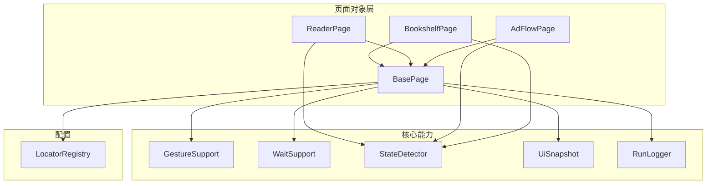
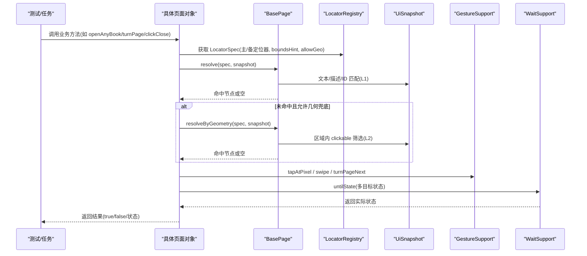
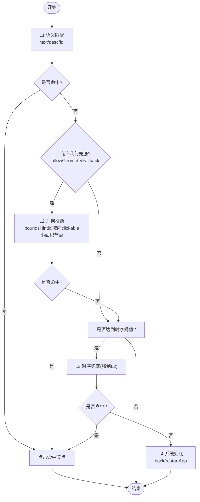
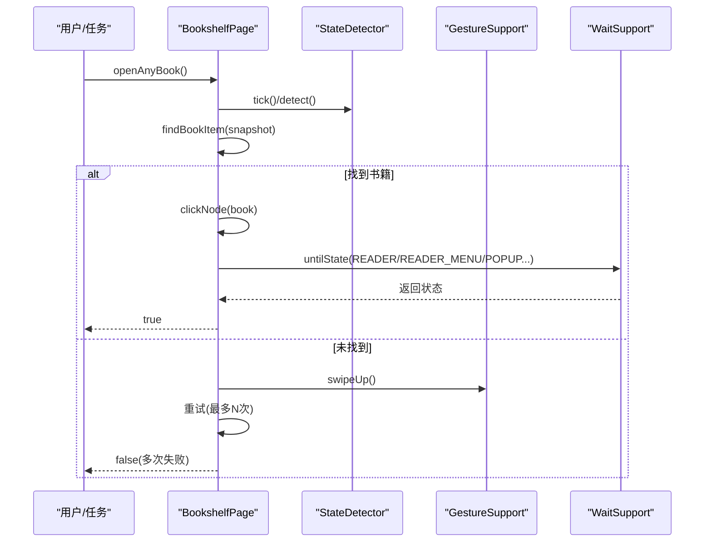
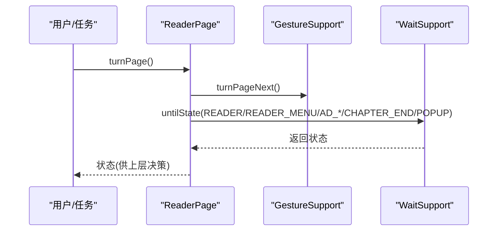
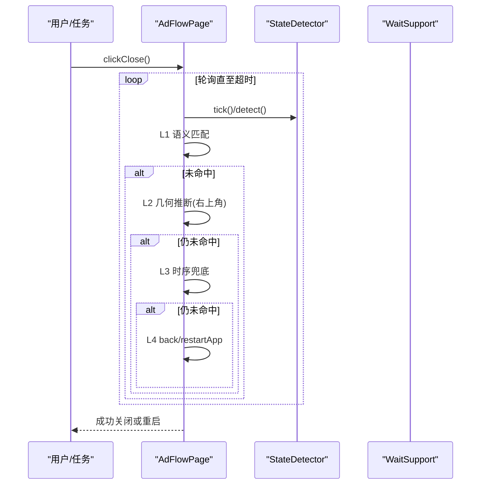
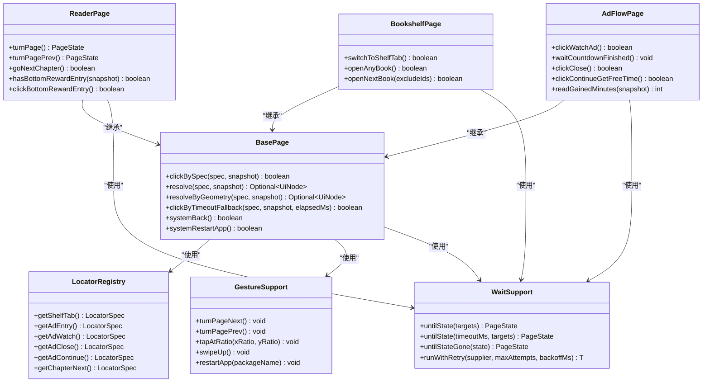

# 页面扩展

<cite>
**本文引用的文件**
- [BasePage.java](file://automation/src/main/java/com/fanqie/auto/page/BasePage.java)
- [BookshelfPage.java](file://automation/src/main/java/com/fanqie/auto/page/BookshelfPage.java)
- [ReaderPage.java](file://automation/src/main/java/com/fanqie/auto/page/ReaderPage.java)
- [AdFlowPage.java](file://automation/src/main/java/com/fanqie/auto/page/AdFlowPage.java)
- [LocatorRegistry.java](file://automation/src/main/java/com/fanqie/auto/config/LocatorRegistry.java)
- [WaitSupport.java](file://automation/src/main/java/com/fanqie/auto/core/WaitSupport.java)
- [GestureSupport.java](file://automation/src/main/java/com/fanqie/auto/core/GestureSupport.java)
- [BasePageTest.java](file://automation/src/test/java/com/fanqie/auto/page/BasePageTest.java)
- [AdFlowPageTest.java](file://automation/src/test/java/com/fanqie/auto/page/AdFlowPageTest.java)
</cite>

## 目录
1. [简介](#简介)
2. [项目结构](#项目结构)
3. [核心组件](#核心组件)
4. [架构总览](#架构总览)
5. [详细组件分析](#详细组件分析)
6. [依赖关系分析](#依赖关系分析)
7. [性能与稳定性考量](#性能与稳定性考量)
8. [故障排查指南](#故障排查指南)
9. [结论](#结论)
10. [附录：创建新页面对象的完整步骤](#附录创建新页面对象的完整步骤)

## 简介
本指南面向需要在现有自动化框架中开发“新页面对象”和“操作封装”的工程师。文档基于仓库中的 BasePage 基类与多个具体 Page（书架、阅读、广告流程）实现，系统讲解四级定位降级链、动态元素处理、等待策略、异常处理、页面间导航与数据传递、以及页面测试与断言方法。目标是让读者在不了解底层细节的情况下，也能快速、稳定地扩展新的业务页面。

## 项目结构
本项目采用分层+按功能域组织的方式：
- page：页面对象层，封装 UI 操作与业务语义（BasePage 为基类，BookshelfPage/ReaderPage/AdFlowPage 为具体页）。
- config：定位器注册表与配置（LocatorRegistry 管理控件定位规则与候选文案）。
- core：通用能力（手势 GestureSupport、等待 WaitSupport、状态检测 StateDetector、快照 UiSnapshot、日志 RunLogger 等）。
- task：任务编排与状态机（如 AdWatch 任务）。
- test：单元测试与用例夹具（fixtures）。

图表来源
- [BasePage.java:18-68](file://automation/src/main/java/com/fanqie/auto/page/BasePage.java#L18-L68)
- [BookshelfPage.java:23-55](file://automation/src/main/java/com/fanqie/auto/page/BookshelfPage.java#L23-L55)
- [ReaderPage.java:19-55](file://automation/src/main/java/com/fanqie/auto/page/ReaderPage.java#L19-L55)
- [AdFlowPage.java:21-65](file://automation/src/main/java/com/fanqie/auto/page/AdFlowPage.java#L21-L65)
- [LocatorRegistry.java:16-65](file://automation/src/main/java/com/fanqie/auto/config/LocatorRegistry.java#L16-L65)
- [WaitSupport.java:16-38](file://automation/src/main/java/com/fanqie/auto/core/WaitSupport.java#L16-L38)
- [GestureSupport.java:12-39](file://automation/src/main/java/com/fanqie/auto/core/GestureSupport.java#L12-L39)

章节来源
- [BasePage.java:18-68](file://automation/src/main/java/com/fanqie/auto/page/BasePage.java#L18-L68)
- [LocatorRegistry.java:16-65](file://automation/src/main/java/com/fanqie/auto/config/LocatorRegistry.java#L16-L65)
- [WaitSupport.java:16-38](file://automation/src/main/java/com/fanqie/auto/core/WaitSupport.java#L16-L38)
- [GestureSupport.java:12-39](file://automation/src/main/java/com/fanqie/auto/core/GestureSupport.java#L12-L39)

## 核心组件
- BasePage：提供统一的四级定位降级链（L1 语义匹配 → L2 几何推断 → L3 时序兜底 → L4 系统兜底），并封装点击、区域裁决、boundsHint 解析等通用能力。
- LocatorRegistry：集中管理所有逻辑控件的定位规格（primaryBy、fallbackBys、boundsHint、allowGeometryFallback）与候选文案集合。
- GestureSupport：统一手势封装，坐标全部按比例计算，避免硬编码像素；支持翻页、滑动、应用生命周期操作。
- WaitSupport：统一等待原语，基于显式等待，支持多目标状态等待、条件等待与幂等重试。
- 各具体 Page：在 BasePage 之上封装业务动作（切换 Tab、打开书籍、翻页、进入下一章、广告流程关闭等）。

章节来源
- [BasePage.java:18-68](file://automation/src/main/java/com/fanqie/auto/page/BasePage.java#L18-L68)
- [LocatorRegistry.java:16-65](file://automation/src/main/java/com/fanqie/auto/config/LocatorRegistry.java#L16-L65)
- [GestureSupport.java:12-39](file://automation/src/main/java/com/fanqie/auto/core/GestureSupport.java#L12-L39)
- [WaitSupport.java:16-38](file://automation/src/main/java/com/fanqie/auto/core/WaitSupport.java#L16-L38)

## 架构总览
下图展示了页面对象如何复用 BasePage 的通用能力，并通过 LocatorRegistry 获取定位规则，通过 WaitSupport/GestureSupport 完成等待与交互。

图表来源
- [BasePage.java:84-236](file://automation/src/main/java/com/fanqie/auto/page/BasePage.java#L84-L236)
- [LocatorRegistry.java:152-256](file://automation/src/main/java/com/fanqie/auto/config/LocatorRegistry.java#L152-L256)
- [WaitSupport.java:56-86](file://automation/src/main/java/com/fanqie/auto/core/WaitSupport.java#L56-L86)
- [GestureSupport.java:71-123](file://automation/src/main/java/com/fanqie/auto/core/GestureSupport.java#L71-L123)

## 详细组件分析

### BasePage：四级定位降级链与通用点击
- L1 语义属性匹配：优先 text 候选集，其次 content-desc，最后 resource-id（从 spec 提取）。命中多个时通过 boundsHint 裁决选择最佳节点。
- L2 结构化几何推断：在 boundsHint 指定区域内查找 clickable=true 且 areaRatio < 0.15 的节点。必须检查 allowGeometryFallback，否则禁止几何兜底（防误点浪费配额）。
- L3 时序兜底：达到 adVideoTimeoutMs 后强制尝试 L2（仍受 allowGeometryFallback 约束）。
- L4 系统兜底：navigate().back() 失败则 restartApp。
- 点击实现：取命中节点的 bounds 中心坐标，若节点不可点击则回溯最近可点击祖先；使用 GestureSupport.tapAtPixel 执行点击。

图表来源
- [BasePage.java:84-236](file://automation/src/main/java/com/fanqie/auto/page/BasePage.java#L84-L236)
- [BasePage.java:300-336](file://automation/src/main/java/com/fanqie/auto/page/BasePage.java#L300-L336)
- [BasePage.java:338-434](file://automation/src/main/java/com/fanqie/auto/page/BasePage.java#L338-L434)

章节来源
- [BasePage.java:18-68](file://automation/src/main/java/com/fanqie/auto/page/BasePage.java#L18-L68)
- [BasePage.java:84-236](file://automation/src/main/java/com/fanqie/auto/page/BasePage.java#L84-L236)
- [BasePage.java:300-336](file://automation/src/main/java/com/fanqie/auto/page/BasePage.java#L300-L336)
- [BasePage.java:338-434](file://automation/src/main/java/com/fanqie/auto/page/BasePage.java#L338-L434)

### BookshelfPage：书架页操作与动态选书
- switchToShelfTab：确保当前在书架 Tab，主动点击底部「书架」以幂等确认；兼容华为全面屏手势区，避开系统手势吞点。
- openAnyBook/openNextBook：动态选取首个可点击书籍条目（content-desc/text/bounds/areaRatio 过滤），必要时滚动重试；openNextBook 支持排除已用书籍进行轮换。
- 选书策略：优先 resource-id 命中书封容器，再回退到带文案的 clickable 节点；过滤短剧/视频卡片，避免误开非小说内容。
- 离开书架确认：等待进入 READER/READER_MENU/弹窗等状态，超时后二次检测确认。

图表来源
- [BookshelfPage.java:65-128](file://automation/src/main/java/com/fanqie/auto/page/BookshelfPage.java#L65-L128)
- [BookshelfPage.java:169-216](file://automation/src/main/java/com/fanqie/auto/page/BookshelfPage.java#L169-L216)
- [BookshelfPage.java:339-431](file://automation/src/main/java/com/fanqie/auto/page/BookshelfPage.java#L339-L431)

章节来源
- [BookshelfPage.java:65-128](file://automation/src/main/java/com/fanqie/auto/page/BookshelfPage.java#L65-L128)
- [BookshelfPage.java:169-216](file://automation/src/main/java/com/fanqie/auto/page/BookshelfPage.java#L169-L216)
- [BookshelfPage.java:339-431](file://automation/src/main/java/com/fanqie/auto/page/BookshelfPage.java#L339-L431)

### ReaderPage：阅读页翻页与跳转
- turnPage/turnPagePrev：执行翻页手势后，一次等待覆盖多个可能状态（READER/READER_MENU/AD_ENTRY_PROMPT/AD_CONFIRM_DIALOG/CHAPTER_END/COMMON_POPUP），避免因直接触发广告导致白等。
- goNextChapter：优先点击「下一章」按钮，否则继续翻页直到 CHAPTER_END；翻页次数上限来自配置。
- 底部奖励入口：检测并点击「观看视频获取免广告时长」。

图表来源
- [ReaderPage.java:69-96](file://automation/src/main/java/com/fanqie/auto/page/ReaderPage.java#L69-L96)
- [ReaderPage.java:130-160](file://automation/src/main/java/com/fanqie/auto/page/ReaderPage.java#L130-L160)
- [ReaderPage.java:170-225](file://automation/src/main/java/com/fanqie/auto/page/ReaderPage.java#L170-L225)

章节来源
- [ReaderPage.java:69-96](file://automation/src/main/java/com/fanqie/auto/page/ReaderPage.java#L69-L96)
- [ReaderPage.java:130-160](file://automation/src/main/java/com/fanqie/auto/page/ReaderPage.java#L130-L160)
- [ReaderPage.java:170-225](file://automation/src/main/java/com/fanqie/auto/page/ReaderPage.java#L170-L225)

### AdFlowPage：广告流程与高风险控制
- clickWatchAd/clickContinueGetFreeTime：仅 L1 语义匹配，禁用几何兜底（allowGeometryFallback=false），防止误点浪费每日配额。
- waitCountdownFinished：纯轮询等待 AD_CLOSE_READY，不做任何点击，避免误触落地页。
- clickClose：全链路兜底（L1→L2右上角几何→L3时序→L4 back/restartApp），唯一允许激进兜底的控件。
- readGainedMinutes：基于正则与奖励语义关键词提取本次获得的分钟数，避免将“剩余X分钟”误计为奖励。

图表来源
- [AdFlowPage.java:76-101](file://automation/src/main/java/com/fanqie/auto/page/AdFlowPage.java#L76-L101)
- [AdFlowPage.java:116-163](file://automation/src/main/java/com/fanqie/auto/page/AdFlowPage.java#L116-L163)
- [AdFlowPage.java:180-262](file://automation/src/main/java/com/fanqie/auto/page/AdFlowPage.java#L180-L262)
- [AdFlowPage.java:317-363](file://automation/src/main/java/com/fanqie/auto/page/AdFlowPage.java#L317-L363)

章节来源
- [AdFlowPage.java:76-101](file://automation/src/main/java/com/fanqie/auto/page/AdFlowPage.java#L76-L101)
- [AdFlowPage.java:116-163](file://automation/src/main/java/com/fanqie/auto/page/AdFlowPage.java#L116-L163)
- [AdFlowPage.java:180-262](file://automation/src/main/java/com/fanqie/auto/page/AdFlowPage.java#L180-L262)
- [AdFlowPage.java:317-363](file://automation/src/main/java/com/fanqie/auto/page/AdFlowPage.java#L317-L363)

### LocatorRegistry：定位器与候选文案管理
- 每个逻辑控件对应一个 LocatorSpec：包含 primaryBy、fallbackBys、boundsHint、allowGeometryFallback。
- 关键安全开关：ad.watch 与 ad.continue 的 allowGeometryFallback 必须为 false；只有 ad.close 允许为 true。
- 提供丰富的候选文案列表（shelf/tab/ad/chapter 等），便于 L1 通道与补充匹配。

章节来源
- [LocatorRegistry.java:16-65](file://automation/src/main/java/com/fanqie/auto/config/LocatorRegistry.java#L16-L65)
- [LocatorRegistry.java:152-256](file://automation/src/main/java/com/fanqie/auto/config/LocatorRegistry.java#L152-L256)
- [LocatorRegistry.java:260-298](file://automation/src/main/java/com/fanqie/auto/config/LocatorRegistry.java#L260-L298)

### WaitSupport：统一等待与重试
- untilState：一次等待命中多个目标状态，避免翻页后直接进入广告导致的白等。
- untilStateGone：等待某状态消失（如 APP_LAUNCHING、AD_VIDEO_PLAYING）。
- untilAnyTextPresent/untilSnapshotMatches：等待特定文案或自定义快照条件。
- runWithRetry：指数退避重试，提升偶发失败的鲁棒性。

章节来源
- [WaitSupport.java:56-86](file://automation/src/main/java/com/fanqie/auto/core/WaitSupport.java#L56-L86)
- [WaitSupport.java:95-119](file://automation/src/main/java/com/fanqie/auto/core/WaitSupport.java#L95-L119)
- [WaitSupport.java:121-183](file://automation/src/main/java/com/fanqie/auto/core/WaitSupport.java#L121-L183)
- [WaitSupport.java:199-232](file://automation/src/main/java/com/fanqie/auto/core/WaitSupport.java#L199-L232)

### GestureSupport：手势与坐标
- 所有坐标按比例计算，避免硬编码像素；屏幕尺寸缓存减少 RPC。
- 翻页优先 tap 策略（右侧热区），备选 swipe 策略；滑动使用 mobile: swipeGesture 更稳定。
- 应用生命周期：activateApp/terminateApp/restartApp，避免硬编码 Activity 名。

章节来源
- [GestureSupport.java:52-67](file://automation/src/main/java/com/fanqie/auto/core/GestureSupport.java#L52-L67)
- [GestureSupport.java:71-95](file://automation/src/main/java/com/fanqie/auto/core/GestureSupport.java#L71-L95)
- [GestureSupport.java:106-123](file://automation/src/main/java/com/fanqie/auto/core/GestureSupport.java#L106-L123)
- [GestureSupport.java:167-178](file://automation/src/main/java/com/fanqie/auto/core/GestureSupport.java#L167-L178)
- [GestureSupport.java:189-226](file://automation/src/main/java/com/fanqie/auto/core/GestureSupport.java#L189-L226)

## 依赖关系分析
- 页面对象对 BasePage 强依赖，复用定位与点击能力。
- 具体 Page 通过 LocatorRegistry 获取定位规则，通过 WaitSupport/GestureSupport 完成等待与交互。
- 广告流程对误点防护要求最高，严格限制 allowGeometryFallback。

图表来源
- [BasePage.java:18-68](file://automation/src/main/java/com/fanqie/auto/page/BasePage.java#L18-L68)
- [BookshelfPage.java:23-55](file://automation/src/main/java/com/fanqie/auto/page/BookshelfPage.java#L23-L55)
- [ReaderPage.java:19-55](file://automation/src/main/java/com/fanqie/auto/page/ReaderPage.java#L19-L55)
- [AdFlowPage.java:21-65](file://automation/src/main/java/com/fanqie/auto/page/AdFlowPage.java#L21-L65)
- [LocatorRegistry.java:152-256](file://automation/src/main/java/com/fanqie/auto/config/LocatorRegistry.java#L152-L256)
- [WaitSupport.java:56-86](file://automation/src/main/java/com/fanqie/auto/core/WaitSupport.java#L56-L86)
- [GestureSupport.java:71-123](file://automation/src/main/java/com/fanqie/auto/core/GestureSupport.java#L71-L123)

章节来源
- [BasePage.java:18-68](file://automation/src/main/java/com/fanqie/auto/page/BasePage.java#L18-L68)
- [BookshelfPage.java:23-55](file://automation/src/main/java/com/fanqie/auto/page/BookshelfPage.java#L23-L55)
- [ReaderPage.java:19-55](file://automation/src/main/java/com/fanqie/auto/page/ReaderPage.java#L19-L55)
- [AdFlowPage.java:21-65](file://automation/src/main/java/com/fanqie/auto/page/AdFlowPage.java#L21-L65)
- [LocatorRegistry.java:152-256](file://automation/src/main/java/com/fanqie/auto/config/LocatorRegistry.java#L152-L256)
- [WaitSupport.java:56-86](file://automation/src/main/java/com/fanqie/auto/core/WaitSupport.java#L56-L86)
- [GestureSupport.java:71-123](file://automation/src/main/java/com/fanqie/auto/core/GestureSupport.java#L71-L123)

## 性能与稳定性考量
- 坐标比例化：所有手势坐标由运行时屏幕尺寸按比例计算，避免设备差异导致的失效。
- 快照内存操作：BasePage 的 L1/L2 均在 UiSnapshot 内存中进行，零额外 RPC，降低开销。
- 等待策略：统一使用 WebDriverWait，避免散落 Thread.sleep；翻页后一次等待覆盖多状态，减少超时浪费。
- 重试机制：runWithRetry 提供指数退避重试，提升偶发失败场景的鲁棒性。
- 广告流程谨慎：视频播放期间不点击，仅轮询等待；关闭按钮才启用激进兜底。

[本节为通用指导，不直接分析具体文件]

## 故障排查指南
- 定位失败：检查 LocatorRegistry 中对应控件的 primaryBy/fallbackBys 与 boundsHint 是否正确；确认 allowGeometryFallback 是否符合风险策略。
- 误点问题：对于 ad.watch/ad.continue，务必保持 allowGeometryFallback=false；若出现误点，优先调整候选文案与区域限制。
- 翻页无效：确认翻页策略（tap/swipe）与热区设置；检查 untilState 是否覆盖了可能的广告/弹窗状态。
- 广告卡死：优先尝试 clickClose 的全链路兜底；若 back 无效则重启 App，回到 BOOKSHELF 重新进入。
- 奖励统计异常：检查 readGainedMinutes 的正则与奖励语义关键词；避免将“剩余X分钟”误计为奖励。

章节来源
- [BasePage.java:84-236](file://automation/src/main/java/com/fanqie/auto/page/BasePage.java#L84-L236)
- [AdFlowPage.java:180-262](file://automation/src/main/java/com/fanqie/auto/page/AdFlowPage.java#L180-L262)
- [AdFlowPage.java:317-363](file://automation/src/main/java/com/fanqie/auto/page/AdFlowPage.java#L317-L363)
- [WaitSupport.java:56-86](file://automation/src/main/java/com/fanqie/auto/core/WaitSupport.java#L56-L86)

## 结论
通过 BasePage 的四级定位降级链与通用能力封装，结合 LocatorRegistry 的配置化管理、WaitSupport 的统一等待与重试、GestureSupport 的比例化手势，项目实现了高鲁棒性的页面自动化。新增页面对象应遵循以下原则：
- 使用 LocatorRegistry 定义定位规则与候选文案。
- 在 BasePage 基础上封装业务动作，复用 resolve/resolveByGeometry/clickNode。
- 合理设置 allowGeometryFallback，区分高风险控件（广告入口）与低风险控件（关闭按钮）。
- 使用 WaitSupport 的多目标等待与重试，避免白等与不稳定。
- 编写离线单元测试，验证 L1/L2 行为与边界情况。

[本节为总结，不直接分析具体文件]

## 附录：创建新页面对象的完整步骤
- 新建 Page 类继承 BasePage，注入 DriverAware 所需依赖（driver、config、locators、gestures、logger）。
- 在 LocatorRegistry 中为该页面相关控件定义 LocatorSpec（primaryBy、fallbackBys、boundsHint、allowGeometryFallback）。
- 实现业务方法：
  - 元素定位：优先调用 resolve(spec, snapshot)，未命中时可补充文案匹配或几何推断。
  - 用户交互：使用 gestures 提供的 tapAtRatio/tapAtPixel/swipe/turnPageNext 等方法。
  - 业务逻辑封装：组合多个基础动作，形成高层 API（如“打开书籍并进入阅读”）。
- 等待策略：使用 waitSupport.untilState 覆盖所有可能状态（含广告/弹窗），避免白等。
- 异常处理：捕获超时与异常，必要时回退到 systemBack/systemRestartApp。
- 页面间导航与数据传递：
  - 导航：通过状态机或 PageState 判断当前页面，必要时切换到目标页（如书架 Tab）。
  - 数据传递：在 Page 中维护必要状态（如 lastOpenedBookId），供上层记录进度与去重。
- 测试与断言：
  - 使用 BasePageTest/AdFlowPageTest 的模式，构造 UiSnapshot 与 LocatorRegistry 进行离线测试。
  - 重点验证 L1/L2 命中与误点防护，确保 allowGeometryFallback 正确生效。
  - 针对复杂逻辑（如选书策略、奖励提取）编写用例，覆盖边界与畸形输入。

章节来源
- [BasePage.java:84-236](file://automation/src/main/java/com/fanqie/auto/page/BasePage.java#L84-L236)
- [BookshelfPage.java:169-216](file://automation/src/main/java/com/fanqie/auto/page/BookshelfPage.java#L169-L216)
- [ReaderPage.java:69-96](file://automation/src/main/java/com/fanqie/auto/page/ReaderPage.java#L69-L96)
- [AdFlowPage.java:180-262](file://automation/src/main/java/com/fanqie/auto/page/AdFlowPage.java#L180-L262)
- [BasePageTest.java:49-125](file://automation/src/test/java/com/fanqie/auto/page/BasePageTest.java#L49-L125)
- [AdFlowPageTest.java:43-79](file://automation/src/test/java/com/fanqie/auto/page/AdFlowPageTest.java#L43-L79)