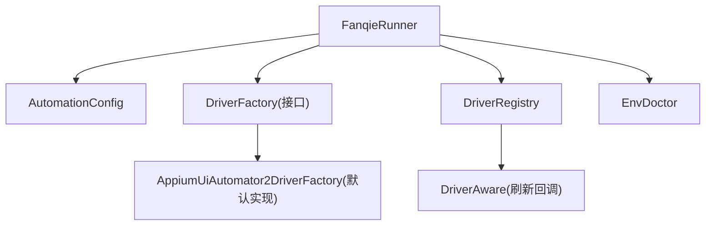
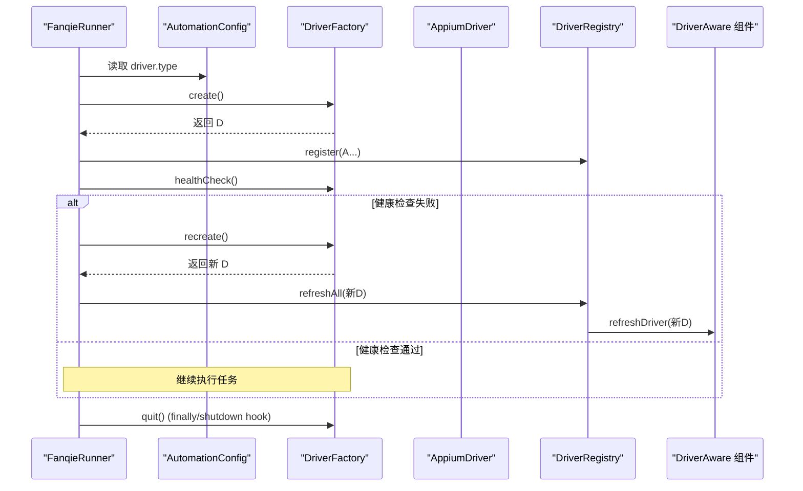
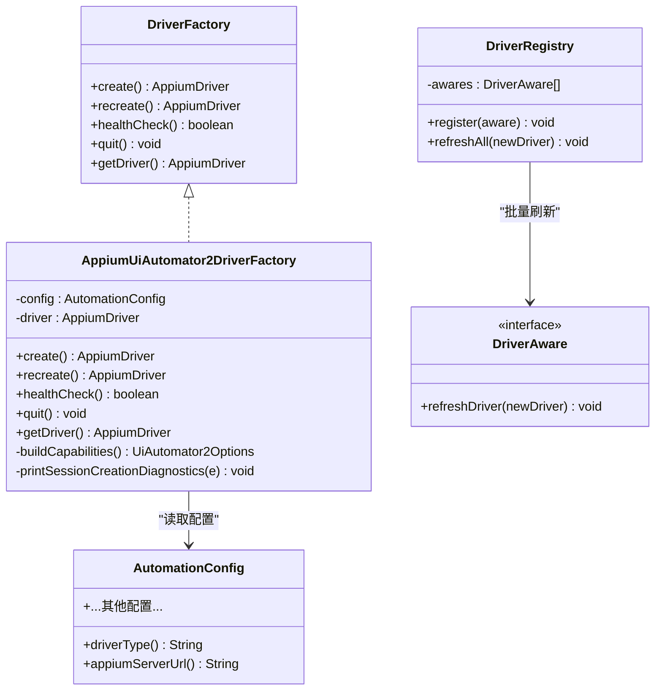
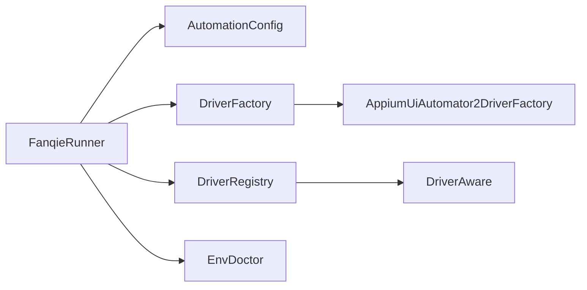
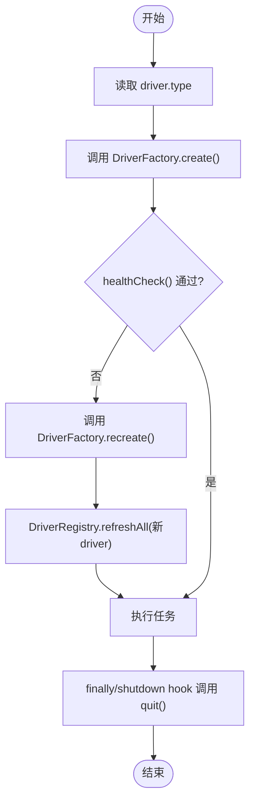
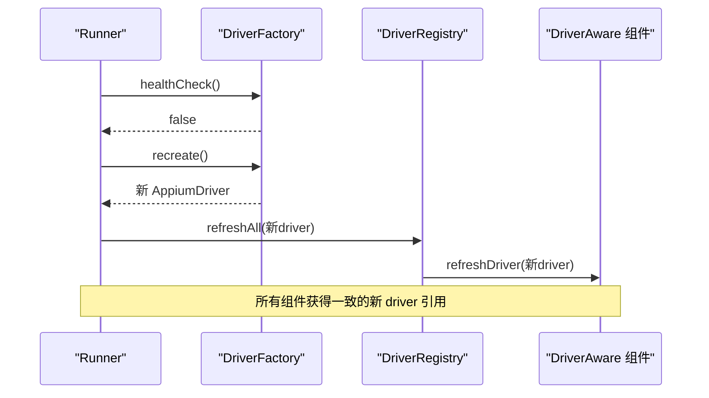

# 驱动扩展

<cite>
**本文引用的文件**
- [DriverFactory.java](file://automation/src/main/java/com/fanqie/auto/core/DriverFactory.java)
- [AppiumUiAutomator2DriverFactory.java](file://automation/src/main/java/com/fanqie/auto/core/AppiumUiAutomator2DriverFactory.java)
- [DriverRegistry.java](file://automation/src/main/java/com/fanqie/auto/core/DriverRegistry.java)
- [DriverAware.java](file://automation/src/main/java/com/fanqie/auto/core/DriverAware.java)
- [AutomationConfig.java](file://automation/src/main/java/com/fanqie/auto/config/AutomationConfig.java)
- [FanqieRunner.java](file://automation/src/main/java/com/fanqie/auto/FanqieRunner.java)
- [EnvDoctor.java](file://automation/src/main/java/com/fanqie/auto/core/EnvDoctor.java)
- [DriverRegistryTest.java](file://automation/src/test/java/com/fanqie/auto/core/DriverRegistryTest.java)
</cite>

## 目录
1. [简介](#简介)
2. [项目结构](#项目结构)
3. [核心组件](#核心组件)
4. [架构总览](#架构总览)
5. [详细组件分析](#详细组件分析)
6. [依赖关系分析](#依赖关系分析)
7. [性能考量](#性能考量)
8. [故障排查指南](#故障排查指南)
9. [结论](#结论)
10. [附录：自定义驱动实现清单与示例流程](#附录自定义驱动实现清单与示例流程)

## 简介
本指南面向希望为系统新增“驱动类型”的开发者，围绕 DriverFactory 接口的设计与扩展点，说明如何实现新的驱动类型，包括 create()、recreate()、healthCheck()、quit()、getDriver() 的实现要求；提供完整的自定义驱动实现要点（会话管理、设备连接、错误处理）；说明如何注册新驱动到系统并在配置中指定使用；并给出驱动测试方法与调试技巧。

## 项目结构
本项目采用分层与职责分离的组织方式：
- core 层：定义驱动抽象与生命周期管理（DriverFactory、DriverAware、DriverRegistry），以及环境自检（EnvDoctor）。
- config 层：集中管理所有运行时配置（AutomationConfig），包括驱动类型选择。
- runner 层：应用入口 FanqieRunner，负责装配组件、创建驱动、启动任务、优雅退出。
- page/task 层：基于驱动完成页面操作与业务流程（与本指南关联度较低）。

图表来源
- [FanqieRunner.java:120-160](file://automation/src/main/java/com/fanqie/auto/FanqieRunner.java#L120-L160)
- [AutomationConfig.java:166-178](file://automation/src/main/java/com/fanqie/auto/config/AutomationConfig.java#L166-L178)
- [DriverFactory.java:17-54](file://automation/src/main/java/com/fanqie/auto/core/DriverFactory.java#L17-L54)
- [AppiumUiAutomator2DriverFactory.java:33-118](file://automation/src/main/java/com/fanqie/auto/core/AppiumUiAutomator2DriverFactory.java#L33-L118)
- [DriverRegistry.java:19-56](file://automation/src/main/java/com/fanqie/auto/core/DriverRegistry.java#L19-L56)
- [DriverAware.java:12-20](file://automation/src/main/java/com/fanqie/auto/core/DriverAware.java#L12-L20)
- [EnvDoctor.java:29-71](file://automation/src/main/java/com/fanqie/auto/core/EnvDoctor.java#L29-L71)

章节来源
- [FanqieRunner.java:25-37](file://automation/src/main/java/com/fanqie/auto/FanqieRunner.java#L25-L37)
- [AutomationConfig.java:10-18](file://automation/src/main/java/com/fanqie/auto/config/AutomationConfig.java#L10-L18)

## 核心组件
- DriverFactory：驱动工厂接口，统一封装 Appium session 的创建、重建、健康检查、退出与获取当前实例。
- AppiumUiAutomator2DriverFactory：默认实现，基于 Appium 2 + UiAutomator2，负责构建 capabilities、设置隐式等待为零、输出中文诊断等。
- DriverRegistry：集中管理实现了 DriverAware 的组件，在 session 重建后批量刷新 driver 引用，避免旧引用导致异常。
- DriverAware：被刷新驱动的组件需实现的接口，用于接收新 driver 引用。
- AutomationConfig：集中读取配置，包含 driver.type 以决定使用哪个 DriverFactory 实现。
- EnvDoctor：运行前环境自检，确保 adb、Appium Server、设备在线与应用已安装等前置条件满足。

章节来源
- [DriverFactory.java:17-54](file://automation/src/main/java/com/fanqie/auto/core/DriverFactory.java#L17-L54)
- [AppiumUiAutomator2DriverFactory.java:15-33](file://automation/src/main/java/com/fanqie/auto/core/AppiumUiAutomator2DriverFactory.java#L15-L33)
- [DriverRegistry.java:10-18](file://automation/src/main/java/com/fanqie/auto/core/DriverRegistry.java#L10-L18)
- [DriverAware.java:5-20](file://automation/src/main/java/com/fanqie/auto/core/DriverAware.java#L5-L20)
- [AutomationConfig.java:166-178](file://automation/src/main/java/com/fanqie/auto/config/AutomationConfig.java#L166-L178)
- [EnvDoctor.java:19-28](file://automation/src/main/java/com/fanqie/auto/core/EnvDoctor.java#L19-L28)

## 架构总览
下图展示了从 Runner 装配到驱动创建、健康检查、重建与退出的完整流程，以及 DriverRegistry 对 DriverAware 组件的统一刷新机制。

图表来源
- [FanqieRunner.java:120-160](file://automation/src/main/java/com/fanqie/auto/FanqieRunner.java#L120-L160)
- [DriverFactory.java:19-54](file://automation/src/main/java/com/fanqie/auto/core/DriverFactory.java#L19-L54)
- [AppiumUiAutomator2DriverFactory.java:44-118](file://automation/src/main/java/com/fanqie/auto/core/AppiumUiAutomator2DriverFactory.java#L44-L118)
- [DriverRegistry.java:30-56](file://automation/src/main/java/com/fanqie/auto/core/DriverRegistry.java#L30-L56)

## 详细组件分析

### DriverFactory 接口设计
- create()：创建新的 Appium session，首次调用应执行完整初始化流程（如安装 UiAutomator2 Server），成功后立即将隐式等待设置为零，避免阻塞短轮询。
- recreate()：销毁当前 session 并重新创建，用于会话断开后的恢复，保持 noReset=true 不丢失用户数据。
- healthCheck()：低成本探活，使用轻量命令检测 session 是否有效，捕获 NoSuchSessionException / InvalidSessionIdException 等异常。
- quit()：优雅退出，幂等安全，多次调用不会抛异常。
- getDriver()：返回当前 driver 实例（可能为 null）。

章节来源
- [DriverFactory.java:17-54](file://automation/src/main/java/com/fanqie/auto/core/DriverFactory.java#L17-L54)

### AppiumUiAutomator2DriverFactory 实现要点
- 能力构建：平台名、自动化名称、UDID、noReset、newCommandTimeout、华为/鸿蒙特殊能力、禁用 id 自动补全、UIA2 服务器超时、跳过安装/初始化开关、保持屏幕常亮等。
- 关键约束：绝不设置 appActivity/app，改用运行时激活；绝不卸载/清理/reset；创建后立即 implicitlyWait(Duration.ZERO)。
- 错误处理：捕获异常并输出定向中文诊断，便于快速定位问题（如 APK 安装弹窗、仅充电模式 ADB 调试、USB 调试授权、Appium Server 状态等）。

章节来源
- [AppiumUiAutomator2DriverFactory.java:15-33](file://automation/src/main/java/com/fanqie/auto/core/AppiumUiAutomator2DriverFactory.java#L15-L33)
- [AppiumUiAutomator2DriverFactory.java:44-118](file://automation/src/main/java/com/fanqie/auto/core/AppiumUiAutomator2DriverFactory.java#L44-L118)
- [AppiumUiAutomator2DriverFactory.java:120-178](file://automation/src/main/java/com/fanqie/auto/core/AppiumUiAutomator2DriverFactory.java#L120-L178)
- [AppiumUiAutomator2DriverFactory.java:180-208](file://automation/src/main/java/com/fanqie/auto/core/AppiumUiAutomator2DriverFactory.java#L180-L208)

### DriverRegistry 与 DriverAware 刷新机制
- DriverRegistry 维护一个线程安全的列表，保存所有需要刷新 driver 引用的组件。
- 当 recreate() 成功后，调用 refreshAll(newDriver)，逐个通知组件更新内部 driver 引用，单个组件异常不影响其余组件。
- 组件需实现 DriverAware.refreshDriver(AppiumDriver newDriver) 来接收新引用。

章节来源
- [DriverRegistry.java:10-18](file://automation/src/main/java/com/fanqie/auto/core/DriverRegistry.java#L10-L18)
- [DriverRegistry.java:30-56](file://automation/src/main/java/com/fanqie/auto/core/DriverRegistry.java#L30-L56)
- [DriverAware.java:5-20](file://automation/src/main/java/com/fanqie/auto/core/DriverAware.java#L5-L20)

### FanqieRunner 装配与驱动选择
- 根据 AutomationConfig.driverType() 选择具体 DriverFactory 实现，未知值回退到 uiautomator2。
- 创建驱动后，注册所有 DriverAware 组件（GestureSupport、StateDetector、WaitSupport、RunLogger、Page 层、Task 层等）。
- 启动心跳保活，执行任务，finally/shutdown hook 保证 logger.stop() 与 driver.quit() 幂等执行。

章节来源
- [FanqieRunner.java:120-160](file://automation/src/main/java/com/fanqie/auto/FanqieRunner.java#L120-L160)
- [FanqieRunner.java:251-268](file://automation/src/main/java/com/fanqie/auto/FanqieRunner.java#L251-L268)
- [AutomationConfig.java:166-178](file://automation/src/main/java/com/fanqie/auto/config/AutomationConfig.java#L166-L178)

### 类图：驱动相关核心类关系

图表来源
- [DriverFactory.java:17-54](file://automation/src/main/java/com/fanqie/auto/core/DriverFactory.java#L17-L54)
- [AppiumUiAutomator2DriverFactory.java:33-118](file://automation/src/main/java/com/fanqie/auto/core/AppiumUiAutomator2DriverFactory.java#L33-L118)
- [DriverRegistry.java:19-56](file://automation/src/main/java/com/fanqie/auto/core/DriverRegistry.java#L19-L56)
- [DriverAware.java:12-20](file://automation/src/main/java/com/fanqie/auto/core/DriverAware.java#L12-L20)
- [AutomationConfig.java:166-178](file://automation/src/main/java/com/fanqie/auto/config/AutomationConfig.java#L166-L178)

## 依赖关系分析
- FanqieRunner 依赖 AutomationConfig 进行配置解析与驱动类型选择。
- DriverFactory 是上层唯一依赖的抽象，具体实现可替换（如未来 HarmonyOS NEXT 的 HdcUiTestDriverFactory）。
- DriverRegistry 解耦了各组件对 driver 生命周期的感知，降低耦合度。
- EnvDoctor 在 Runner 早期执行环境自检，减少无效 session 创建尝试。

图表来源
- [FanqieRunner.java:120-160](file://automation/src/main/java/com/fanqie/auto/FanqieRunner.java#L120-L160)
- [AutomationConfig.java:166-178](file://automation/src/main/java/com/fanqie/auto/config/AutomationConfig.java#L166-L178)
- [DriverFactory.java:17-54](file://automation/src/main/java/com/fanqie/auto/core/DriverFactory.java#L17-L54)
- [AppiumUiAutomator2DriverFactory.java:33-118](file://automation/src/main/java/com/fanqie/auto/core/AppiumUiAutomator2DriverFactory.java#L33-L118)
- [DriverRegistry.java:19-56](file://automation/src/main/java/com/fanqie/auto/core/DriverRegistry.java#L19-L56)
- [EnvDoctor.java:29-71](file://automation/src/main/java/com/fanqie/auto/core/EnvDoctor.java#L29-L71)

章节来源
- [FanqieRunner.java:25-37](file://automation/src/main/java/com/fanqie/auto/FanqieRunner.java#L25-L37)
- [AutomationConfig.java:166-178](file://automation/src/main/java/com/fanqie/auto/config/AutomationConfig.java#L166-L178)

## 性能考量
- 隐式等待必须置零：避免未命中查找阻塞满隐式超时，破坏短轮询设计。
- 健康检查使用轻量命令：如窗口尺寸查询，降低心跳开销。
- 批量刷新 driver 引用：一次性传播新引用，减少重复 RPC 与潜在竞态。
- 长任务超时与保活：newCommandTimeout 配合心跳保活，规避长时间静默导致的断连。

章节来源
- [AppiumUiAutomator2DriverFactory.java:61-67](file://automation/src/main/java/com/fanqie/auto/core/AppiumUiAutomator2DriverFactory.java#L61-L67)
- [AppiumUiAutomator2DriverFactory.java:85-100](file://automation/src/main/java/com/fanqie/auto/core/AppiumUiAutomator2DriverFactory.java#L85-L100)
- [DriverRegistry.java:37-56](file://automation/src/main/java/com/fanqie/auto/core/DriverRegistry.java#L37-L56)
- [AutomationConfig.java:137-143](file://automation/src/main/java/com/fanqie/auto/config/AutomationConfig.java#L137-L143)

## 故障排查指南
- 环境自检：通过 EnvDoctor 检查 ANDROID_HOME、adb 版本、设备在线状态、Appium Server 就绪、应用安装情况。
- Session 创建失败：查看定向中文诊断信息，逐项核对手机侧设置（开发者选项、USB 调试、仅充电模式 ADB 调试、授权弹窗、Appium Server 启动等）。
- 健康检查失败：确认 session 是否存在或有效，必要时触发 recreate() 并刷新所有 DriverAware 组件。

章节来源
- [EnvDoctor.java:43-71](file://automation/src/main/java/com/fanqie/auto/core/EnvDoctor.java#L43-L71)
- [EnvDoctor.java:142-176](file://automation/src/main/java/com/fanqie/auto/core/EnvDoctor.java#L142-L176)
- [AppiumUiAutomator2DriverFactory.java:180-208](file://automation/src/main/java/com/fanqie/auto/core/AppiumUiAutomator2DriverFactory.java#L180-L208)

## 结论
DriverFactory 提供了清晰的扩展点，使系统可以在不改动上层逻辑的前提下切换不同驱动路线。通过 DriverRegistry 与 DriverAware 的配合，session 重建过程对上层透明且健壮。结合 AutomationConfig 的配置化驱动类型选择与环境自检，整体具备高可扩展性与良好的可维护性。

## 附录：自定义驱动实现清单与示例流程

### 实现步骤清单
1. 新建 DriverFactory 实现类
   - 实现 create()：建立与设备的连接，构造必要的 capabilities，创建并返回 AppiumDriver 实例。
   - 实现 recreate()：先 quit() 再 create()，确保资源释放与重建一致性。
   - 实现 healthCheck()：使用轻量命令探测 session 有效性，捕获常见异常并返回布尔结果。
   - 实现 quit()：幂等关闭 session，确保多次调用安全。
   - 实现 getDriver()：返回当前 driver 实例（可为 null）。

2. 在 FanqieRunner 中注册新驱动类型
   - 在 createDriverFactory() 中添加新的 case 分支，按配置 driver.type 返回新实现。
   - 若出现未知类型，保持回退到默认实现以保证稳定性。

3. 在 AutomationConfig 中暴露配置项
   - 确保 driver.type 可配置，支持新增驱动类型的字符串标识。
   - 如需新驱动特有参数，可在 AutomationConfig 中增加对应 getter。

4. 注册 DriverAware 组件
   - 任何持有 AppiumDriver 字段的组件都应实现 DriverAware，并在 DriverRegistry 中注册。
   - 在 recreate() 成功后，由 Runner 或 RecoveryHandler 调用 registry.refreshAll(newDriver) 统一刷新。

5. 错误处理与诊断
   - 在 create() 中捕获异常并输出中文诊断信息，帮助快速定位环境问题。
   - 在 healthCheck() 中捕获 NoSuchSessionException / WebDriverException 等异常，返回 false 以便上层触发重建。

6. 配置指定使用自定义驱动
   - 在 automation.properties 或通过 --config 外部配置文件设置 driver.type 为新驱动标识。
   - 确保 Runner 能正确解析并实例化对应的 DriverFactory 实现。

7. 测试与调试
   - 使用 DriverRegistryTest 的思路编写单元测试：验证注册去重、批量刷新、异常隔离等行为。
   - 使用 EnvDoctor 进行环境自检，确保 adb、Appium Server、设备在线与应用安装等前置条件满足。
   - 在 create() 与 healthCheck() 中加入日志输出，便于追踪会话生命周期与健康状态。

### 示例流程图：自定义驱动创建与刷新

图表来源
- [FanqieRunner.java:120-160](file://automation/src/main/java/com/fanqie/auto/FanqieRunner.java#L120-L160)
- [DriverFactory.java:19-54](file://automation/src/main/java/com/fanqie/auto/core/DriverFactory.java#L19-L54)
- [DriverRegistry.java:37-56](file://automation/src/main/java/com/fanqie/auto/core/DriverRegistry.java#L37-L56)

### 示例序列图：会话重建与组件刷新

图表来源
- [DriverFactory.java:28-42](file://automation/src/main/java/com/fanqie/auto/core/DriverFactory.java#L28-L42)
- [DriverRegistry.java:37-56](file://automation/src/main/java/com/fanqie/auto/core/DriverRegistry.java#L37-L56)

### 测试方法建议
- 单元测试：参考 DriverRegistryTest，验证注册去重、批量刷新、异常隔离、空注册表安全等。
- 集成测试：在真实设备上运行，覆盖 create/recreate/healthCheck/quit 全流程，验证 session 生命周期与资源释放。
- 回归测试：在配置变更（driver.type、capabilities）后，验证行为一致性与兼容性。

章节来源
- [DriverRegistryTest.java:14-23](file://automation/src/test/java/com/fanqie/auto/core/DriverRegistryTest.java#L14-L23)
- [DriverRegistryTest.java:45-141](file://automation/src/test/java/com/fanqie/auto/core/DriverRegistryTest.java#L45-L141)

### 调试技巧
- 启用详细日志：在 create()、healthCheck()、recreate()、quit() 中记录关键步骤与异常信息。
- 使用 --doctor 模式：仅执行环境自检，快速定位前置环境问题。
- 使用 --dry-run 模式：只连接并 dump UI 树，不执行点击，便于验证驱动连接与 UI 抓取。
- 关注 Appium Server 状态：通过 HTTP GET /status 检查服务就绪情况。

章节来源
- [FanqieRunner.java:241-249](file://automation/src/main/java/com/fanqie/auto/FanqieRunner.java#L241-L249)
- [EnvDoctor.java:142-176](file://automation/src/main/java/com/fanqie/auto/core/EnvDoctor.java#L142-L176)