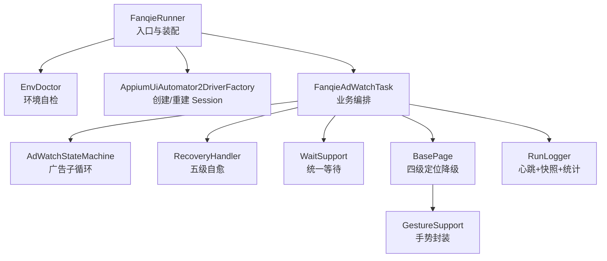
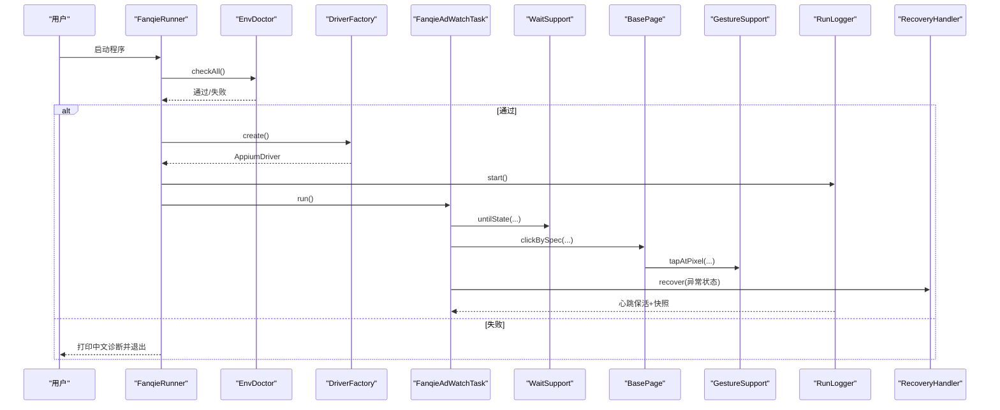
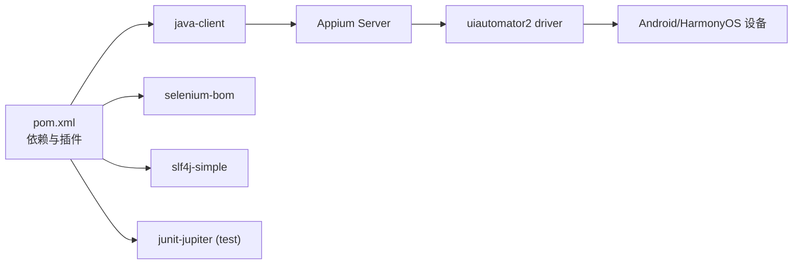

# 常见问题解答

<cite>
**本文引用的文件**
- [pom.xml](file://automation/pom.xml)
- [FanqieRunner.java](file://automation/src/main/java/com/fanqie/auto/FanqieRunner.java)
- [AppiumUiAutomator2DriverFactory.java](file://automation/src/main/java/com/fanqie/auto/core/AppiumUiAutomator2DriverFactory.java)
- [EnvDoctor.java](file://automation/src/main/java/com/fanqie/auto/core/EnvDoctor.java)
- [WaitSupport.java](file://automation/src/main/java/com/fanqie/auto/core/WaitSupport.java)
- [BasePage.java](file://automation/src/main/java/com/fanqie/auto/page/BasePage.java)
- [GestureSupport.java](file://automation/src/main/java/com/fanqie/auto/core/GestureSupport.java)
- [RunLogger.java](file://automation/src/main/java/com/fanqie/auto/core/RunLogger.java)
- [RecoveryHandler.java](file://automation/src/main/java/com/fanqie/auto/task/RecoveryHandler.java)
- [FanqieAdWatchTask.java](file://automation/src/main/java/com/fanqie/auto/task/FanqieAdWatchTask.java)
</cite>

## 目录
1. [简介](#简介)
2. [项目结构](#项目结构)
3. [核心组件](#核心组件)
4. [架构总览](#架构总览)
5. [详细组件分析](#详细组件分析)
6. [依赖关系分析](#依赖关系分析)
7. [性能与稳定性考虑](#性能与稳定性考虑)
8. [故障排查指南](#故障排查指南)
9. [结论](#结论)
10. [附录：快速诊断命令与验证方法](#附录快速诊断命令与验证方法)

## 简介
本问答文档面向开发、测试与运维人员，聚焦自动化运行过程中最常见的问题与解决方案，覆盖设备连接（ADB 连接失败、设备未授权、USB 调试未开启）、Appium 服务异常（服务启动失败、端口冲突、驱动安装问题）、UI 元素定位失败（元素不存在、等待超时、页面状态异常）等。同时补充华为鸿蒙系统的特殊配置要求与常见陷阱，并提供可执行的快速诊断命令与验证方法。

## 项目结构
本项目基于 Appium 2 + Java Client 的 UI 自动化工程，采用分层设计：
- 入口与装配：FanqieRunner 负责参数解析、环境自检、组件装配与生命周期管理
- 驱动层：AppiumUiAutomator2DriverFactory 构建 capabilities、创建/重建 session、健康检查
- 环境与设备：EnvDoctor 在 session 创建前执行 adb / HTTP 探测并输出中文指引
- 交互与手势：GestureSupport 封装点击、滑动、应用生命周期操作
- 等待与状态：WaitSupport 提供统一显式等待；BasePage 实现四级定位降级链
- 任务编排：FanqieAdWatchTask 编排阅读/广告流程；RecoveryHandler 提供五级自愈
- 日志与保活：RunLogger 提供心跳保活、截图/XML 快照落盘与统计汇总

**图表来源**
- [FanqieRunner.java:41-238](file://automation/src/main/java/com/fanqie/auto/FanqieRunner.java#L41-L238)
- [AppiumUiAutomator2DriverFactory.java:44-118](file://automation/src/main/java/com/fanqie/auto/core/AppiumUiAutomator2DriverFactory.java#L44-L118)
- [EnvDoctor.java:48-71](file://automation/src/main/java/com/fanqie/auto/core/EnvDoctor.java#L48-L71)
- [WaitSupport.java:56-183](file://automation/src/main/java/com/fanqie/auto/core/WaitSupport.java#L56-L183)
- [BasePage.java:84-250](file://automation/src/main/java/com/fanqie/auto/page/BasePage.java#L84-L250)
- [GestureSupport.java:71-228](file://automation/src/main/java/com/fanqie/auto/core/GestureSupport.java#L71-L228)
- [RunLogger.java:144-197](file://automation/src/main/java/com/fanqie/auto/core/RunLogger.java#L144-L197)
- [RecoveryHandler.java:100-253](file://automation/src/main/java/com/fanqie/auto/task/RecoveryHandler.java#L100-L253)
- [FanqieAdWatchTask.java:99-314](file://automation/src/main/java/com/fanqie/auto/task/FanqieAdWatchTask.java#L99-L314)

**章节来源**
- [pom.xml:1-176](file://automation/pom.xml#L1-L176)
- [FanqieRunner.java:41-238](file://automation/src/main/java/com/fanqie/auto/FanqieRunner.java#L41-L238)

## 核心组件
- 环境自检器 EnvDoctor：在 session 创建前通过 adb 与 HTTP 探测设备与服务状态，逐项给出中文处置指引，任一硬性检查失败即中止
- 驱动工厂 AppiumUiAutomator2DriverFactory：构建 UiAutomator2Options，设置 noReset、超时、华为/鸿蒙兼容能力，创建/重建/退出 session，并立即关闭隐式等待
- 等待支持 WaitSupport：统一 WebDriverWait 显式等待，支持多目标状态等待、状态消失等待、文案出现等待、自定义条件等待与指数退避重试
- 页面对象基类 BasePage：四级定位降级链（语义属性→几何推断→时序兜底→系统兜底），误点防护与 boundsHint 裁决
- 手势支持 GestureSupport：比例坐标点击/滑动、mobile 命令封装、应用生命周期操作（activate/terminate/restart）
- 运行日志 RunLogger：心跳保活、截图/XML 快照落盘、统计汇总、session 存活标记
- 恢复处理器 RecoveryHandler：五级自愈（弹窗关闭→逐级 back→重启 App→导航书架→重建 session→落盘退出）
- 任务编排 FanqieAdWatchTask：启动 App→进入书架→选书→翻页→广告子循环→轮换书籍→熔断与收尾

**章节来源**
- [EnvDoctor.java:48-71](file://automation/src/main/java/com/fanqie/auto/core/EnvDoctor.java#L48-L71)
- [AppiumUiAutomator2DriverFactory.java:120-178](file://automation/src/main/java/com/fanqie/auto/core/AppiumUiAutomator2DriverFactory.java#L120-L178)
- [WaitSupport.java:56-183](file://automation/src/main/java/com/fanqie/auto/core/WaitSupport.java#L56-L183)
- [BasePage.java:84-250](file://automation/src/main/java/com/fanqie/auto/page/BasePage.java#L84-L250)
- [GestureSupport.java:71-228](file://automation/src/main/java/com/fanqie/auto/core/GestureSupport.java#L71-L228)
- [RunLogger.java:144-197](file://automation/src/main/java/com/fanqie/auto/core/RunLogger.java#L144-L197)
- [RecoveryHandler.java:100-253](file://automation/src/main/java/com/fanqie/auto/task/RecoveryHandler.java#L100-L253)
- [FanqieAdWatchTask.java:99-314](file://automation/src/main/java/com/fanqie/auto/task/FanqieAdWatchTask.java#L99-L314)

## 架构总览
下图展示从入口到设备交互的关键调用链，以及自愈与日志保活的协作关系。

**图表来源**
- [FanqieRunner.java:41-238](file://automation/src/main/java/com/fanqie/auto/FanqieRunner.java#L41-L238)
- [EnvDoctor.java:48-71](file://automation/src/main/java/com/fanqie/auto/core/EnvDoctor.java#L48-L71)
- [AppiumUiAutomator2DriverFactory.java:44-118](file://automation/src/main/java/com/fanqie/auto/core/AppiumUiAutomator2DriverFactory.java#L44-L118)
- [FanqieAdWatchTask.java:99-314](file://automation/src/main/java/com/fanqie/auto/task/FanqieAdWatchTask.java#L99-L314)
- [WaitSupport.java:56-183](file://automation/src/main/java/com/fanqie/auto/core/WaitSupport.java#L56-L183)
- [BasePage.java:84-250](file://automation/src/main/java/com/fanqie/auto/page/BasePage.java#L84-L250)
- [GestureSupport.java:71-228](file://automation/src/main/java/com/fanqie/auto/core/GestureSupport.java#L71-L228)
- [RunLogger.java:144-197](file://automation/src/main/java/com/fanqie/auto/core/RunLogger.java#L144-L197)
- [RecoveryHandler.java:100-253](file://automation/src/main/java/com/fanqie/auto/task/RecoveryHandler.java#L100-L253)

## 详细组件分析

### 设备连接问题（ADB 连接失败、设备未授权、USB 调试未开启）
- 现象
  - 运行时报错无法创建 Appium session
  - 设备列表为空或显示 unauthorized/offline
  - 华为/鸿蒙设备上推送 APK 时弹出确认框导致阻塞
- 可能原因
  - 未解锁开发者选项或未开启 USB 调试
  - 未勾选「仅充电模式下允许 ADB 调试」（华为/鸿蒙特有）
  - USB 线仅充电未传输数据
  - 首次插线未授权「始终允许来自这台计算机的调试」
  - 「监控 ADB 安装应用」开启导致安装弹窗阻塞
- 解决步骤
  - 使用 --doctor 模式进行环境自检，按输出逐项修复
  - 在手机上完成以下设置：
    - 解锁开发者选项（连续点击版本号多次）
    - 打开 USB 调试
    - 打开「仅充电模式下允许 ADB 调试」
    - USB 连接方式选择「传输文件」
    - 首次插线勾选「始终允许来自这台计算机的调试」
    - 首轮建议临时关闭「监控 ADB 安装应用」
  - 重新插拔 USB 后重试
- 快速诊断命令
  - 终端执行：adb devices -l
  - 期望看到设备状态为 device；若为 unauthorized 需在手机确认授权
  - 若离线：adb kill-server; adb start-server 后重试
- 相关实现要点
  - EnvDoctor 通过 ProcessBuilder 执行 adb 命令并解析输出，给出中文处置指引
  - AppiumUiAutomator2DriverFactory 在 session 创建失败时输出定向诊断清单
  - FanqieRunner 启动时打印手机侧设置核对清单

**章节来源**
- [EnvDoctor.java:90-140](file://automation/src/main/java/com/fanqie/auto/core/EnvDoctor.java#L90-L140)
- [EnvDoctor.java:196-210](file://automation/src/main/java/com/fanqie/auto/core/EnvDoctor.java#L196-L210)
- [AppiumUiAutomator2DriverFactory.java:180-208](file://automation/src/main/java/com/fanqie/auto/core/AppiumUiAutomator2DriverFactory.java#L180-L208)
- [FanqieRunner.java:270-292](file://automation/src/main/java/com/fanqie/auto/FanqieRunner.java#L270-L292)

### Appium 服务异常（服务启动失败、端口冲突、驱动安装问题）
- 现象
  - 无法连接到 http://127.0.0.1:4723/status
  - session 创建超时或驱动安装失败
  - 华为设备首启慢导致超时
- 可能原因
  - Appium Server 未启动或端口被占用
  - Node.js/npm 未安装或 appium driver 未安装
  - uiautomator2ServerLaunchTimeout/uiautomator2ServerInstallTimeout 过短
  - 华为/鸿蒙设备隐藏 API 策略拦截
- 解决步骤
  - 启动 Appium Server：appium --base-path /
  - 检查驱动：appium driver list --installed
  - 调整超时：uia2ServerLaunchTimeoutMs、uia2ServerInstallTimeoutMs（默认已放宽）
  - 启用华为/鸿蒙兼容能力：ignoreHiddenApiPolicyError、suppressKillServer
  - 避免卸载/clear/reset 操作，保持 noReset=true 保护用户数据
- 相关实现要点
  - EnvDoctor 通过 HttpClient GET /status 探测服务就绪
  - AppiumUiAutomator2DriverFactory 构建 capabilities 时设置多项华为/鸿蒙优化项
  - pom.xml 锁定 selenium BOM 版本，避免传递依赖破坏兼容性

**章节来源**
- [EnvDoctor.java:142-176](file://automation/src/main/java/com/fanqie/auto/core/EnvDoctor.java#L142-L176)
- [AppiumUiAutomator2DriverFactory.java:120-178](file://automation/src/main/java/com/fanqie/auto/core/AppiumUiAutomator2DriverFactory.java#L120-L178)
- [pom.xml:21-48](file://automation/pom.xml#L21-L48)

### UI 元素定位失败（元素不存在、等待超时、页面状态异常）
- 现象
  - 找不到按钮或文本，点击无效
  - 等待超时（如激励视频关闭按钮未出现）
  - 翻页后状态异常（进入视频/短剧页、弹窗卡住）
- 可能原因
  - 文案变更或 content-desc 缺失
  - 自绘控件无属性，无法通过语义匹配
  - 页面尚未稳定或动画未完成
  - 误入视频/短剧页而非阅读器
- 解决步骤
  - 使用统一等待原语：untilState/untilAnyTextPresent/untilSnapshotMatches
  - 利用四级定位降级链：
    - L1：text/content-desc/resource-id 候选集匹配
    - L2：结构化几何推断（受 allowGeometryFallback 约束）
    - L3：时序兜底（达到 adVideoTimeoutMs 后强制几何点击）
    - L4：系统 back()/restartApp
  - 遇到视频/短剧页：返回首页并强制切换「书架」Tab 换书
  - 弹窗卡住：RecoveryHandler 由弱到强尝试关闭通用弹窗
- 相关实现要点
  - WaitSupport 提供多种等待方法与指数退避重试
  - BasePage 实现 boundsHint 裁决与误点防护
  - FanqieAdWatchTask 包含选书校验与回书架逻辑

**章节来源**
- [WaitSupport.java:56-183](file://automation/src/main/java/com/fanqie/auto/core/WaitSupport.java#L56-L183)
- [BasePage.java:84-250](file://automation/src/main/java/com/fanqie/auto/page/BasePage.java#L84-L250)
- [FanqieAdWatchTask.java:118-165](file://automation/src/main/java/com/fanqie/auto/task/FanqieAdWatchTask.java#L118-L165)
- [RecoveryHandler.java:255-321](file://automation/src/main/java/com/fanqie/auto/task/RecoveryHandler.java#L255-L321)

### 华为/鸿蒙系统特殊配置与常见陷阱
- 必须开启的设置
  - 解锁开发者选项
  - 打开 USB 调试
  - 打开「仅充电模式下允许 ADB 调试」（极易遗漏）
  - USB 连接方式选「传输文件」
  - 首次插线授权「始终允许来自这台计算机的调试」
  - 首轮建议关闭「监控 ADB 安装应用」
- 常见陷阱
  - 非原装数据线只充电不传数据
  - 子用户/隐私空间无法解锁开发者选项
  - 隐藏 API 策略拦截导致驱动异常
  - 首启慢导致安装/启动超时
- 代码级适配
  - ignoreHiddenApiPolicyError、suppressKillServer
  - 放宽 uia2ServerLaunchTimeout 与 InstallTimeout
  - 启动时打印 7 项核对清单，便于现场逐项确认

**章节来源**
- [EnvDoctor.java:196-210](file://automation/src/main/java/com/fanqie/auto/core/EnvDoctor.java#L196-L210)
- [AppiumUiAutomator2DriverFactory.java:145-158](file://automation/src/main/java/com/fanqie/auto/core/AppiumUiAutomator2DriverFactory.java#L145-L158)
- [FanqieRunner.java:270-292](file://automation/src/main/java/com/fanqie/auto/FanqieRunner.java#L270-L292)

### 自愈与恢复机制（崩溃/卡死/状态异常）
- 五级恢复策略
  - 第 1 级：COMMON_POPUP 弹窗关闭（由弱到强）
  - 第 2 级：逐级 back()，每次 back 后 detect 确认锚点
  - 第 3 级：重启 App（terminate + activate）
  - 第 4 级：主动导航到书架 Tab
  - 第 5 级：重建 session（noReset 保护数据），刷新所有组件引用
  - 最终：落盘诊断快照并退出，绝不盲目连点
- 关键保障
  - 超过 maxRecoveryRetry 停止并保留现场
  - 重建 session 后通过 DriverRegistry.refreshAll 更新所有组件 driver 引用
  - RunLogger 心跳保活避免长静默期断连

**章节来源**
- [RecoveryHandler.java:100-253](file://automation/src/main/java/com/fanqie/auto/task/RecoveryHandler.java#L100-L253)
- [RunLogger.java:144-197](file://automation/src/main/java/com/fanqie/auto/core/RunLogger.java#L144-L197)

## 依赖关系分析
- Maven 依赖与版本矩阵
  - 锁定 selenium-bom 版本，避免传递依赖破坏兼容性
  - java-client 与 selenium 一对一映射，确保稳定
  - slf4j-simple 保证日志输出
  - JUnit 5 仅用于测试，不影响主程序运行时 classpath
- 运行时依赖
  - Appium Server 与 uiautomator2 driver
  - adb 工具链（PATH 中可用）
  - ANDROID_HOME/ANDROID_SDK_ROOT（建议设置）

**图表来源**
- [pom.xml:21-83](file://automation/pom.xml#L21-L83)

**章节来源**
- [pom.xml:21-83](file://automation/pom.xml#L21-L83)

## 性能与稳定性考虑
- 隐式等待关闭：DriverFactory 创建后立即 implicitlyWait=0，避免阻塞短轮询
- 显式等待统一：WaitSupport 基于 WebDriverWait，支持多目标与自定义条件
- 手势优化：优先 mobile: clickGesture/swipeGesture，减少注入失败风险
- 心跳保活：RunLogger 每 N 秒轻量探活，避免广告视频静默期断连
- 超时与退避：adVideoTimeoutMs、actionTimeoutMs、指数退避重试
- 数据保护：noReset=true，禁止 uninstall/clear/reset，避免丢失登录态与书架数据
- 版本锁定：selenium BOM pin，避免升级引入破坏性变更

[本节为通用指导，无需具体文件分析]

## 故障排查指南
- 设备连接问题
  - 现象：adb devices 为空或 unauthorized/offline
  - 处理：按 EnvDoctor 输出逐项检查开发者选项、USB 调试、仅充电模式 ADB、授权弹窗
  - 验证：adb devices -l 期望 device
- Appium 服务问题
  - 现象：/status 不可达或 ready=false
  - 处理：启动 appium --base-path /，检查 node/npm/appium driver
  - 验证：curl http://127.0.0.1:4723/status
- UI 定位失败
  - 现象：找不到元素或等待超时
  - 处理：使用 WaitSupport 统一等待；BasePage 四级降级；必要时触发 RecoveryHandler
  - 验证：查看 RunLogger 快照（PNG+XML）
- 华为/鸿蒙问题
  - 现象：隐藏 API 拦截、首启慢、安装弹窗阻塞
  - 处理：启用 ignoreHiddenApiPolicyError/suppressKillServer；放宽超时；关闭监控安装
  - 验证：EnvDoctor 诊断清单逐项确认
- 自愈失败
  - 现象：连续恢复失败
  - 处理：检查日志与快照；必要时重建 session；确认 DriverRegistry 刷新
  - 验证：RunLogger 统计与错误分布

**章节来源**
- [EnvDoctor.java:90-176](file://automation/src/main/java/com/fanqie/auto/core/EnvDoctor.java#L90-L176)
- [AppiumUiAutomator2DriverFactory.java:180-208](file://automation/src/main/java/com/fanqie/auto/core/AppiumUiAutomator2DriverFactory.java#L180-L208)
- [WaitSupport.java:56-183](file://automation/src/main/java/com/fanqie/auto/core/WaitSupport.java#L56-L183)
- [BasePage.java:84-250](file://automation/src/main/java/com/fanqie/auto/page/BasePage.java#L84-L250)
- [RecoveryHandler.java:100-253](file://automation/src/main/java/com/fanqie/auto/task/RecoveryHandler.java#L100-L253)
- [RunLogger.java:231-261](file://automation/src/main/java/com/fanqie/auto/core/RunLogger.java#L231-L261)

## 结论
本项目通过环境自检、统一等待、四级定位降级、五级自愈与心跳保活，构建了高鲁棒性的 UI 自动化方案。针对华为/鸿蒙设备的特殊性与长任务稳定性做了充分适配。遇到问题时，优先使用 --doctor 与环境自检输出定位，再结合快照与日志快速恢复。

[本节为总结，无需具体文件分析]

## 附录：快速诊断命令与验证方法
- 设备与 ADB
  - adb devices -l：查看设备在线与状态
  - adb shell pm list packages | findstr dragon：确认包名是否安装
  - adb kill-server; adb start-server：重置 ADB 服务
- Appium 服务
  - appium --base-path /：启动服务
  - appium driver list --installed：检查驱动安装
  - curl http://127.0.0.1:4723/status：检查服务就绪
- 运行与诊断
  - mvn exec:java -Dexec.mainClass="com.fanqie.auto.FanqieRunner" --doctor：仅环境自检
  - mvn exec:java -Dexec.mainClass="com.fanqie.auto.FanqieRunner" --dry-run：只连接并 dump UI 树
  - 查看 automation/logs/*.log 与 snapshots/*：获取日志与快照
- 华为/鸿蒙专项
  - 确认「仅充电模式下允许 ADB 调试」已开启
  - 首轮关闭「监控 ADB 安装应用」以避免安装弹窗阻塞
  - 使用原装数据线并确保 USB 模式为「传输文件」

[本节为通用指导，无需具体文件分析]