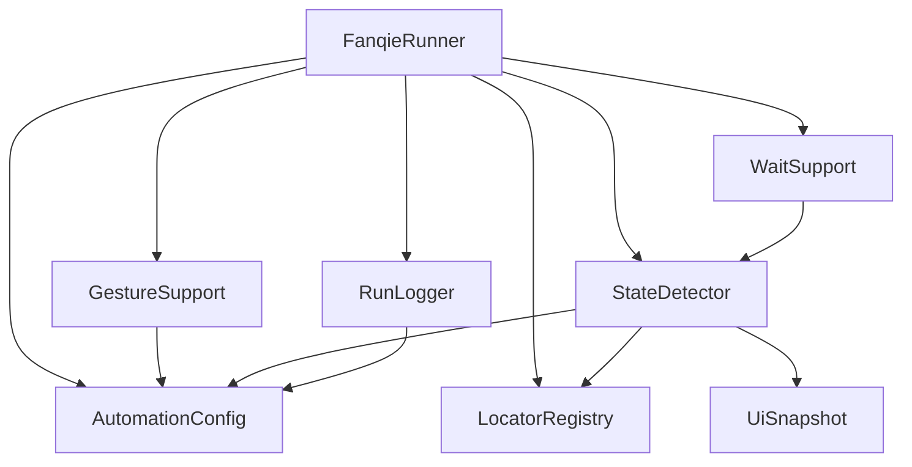
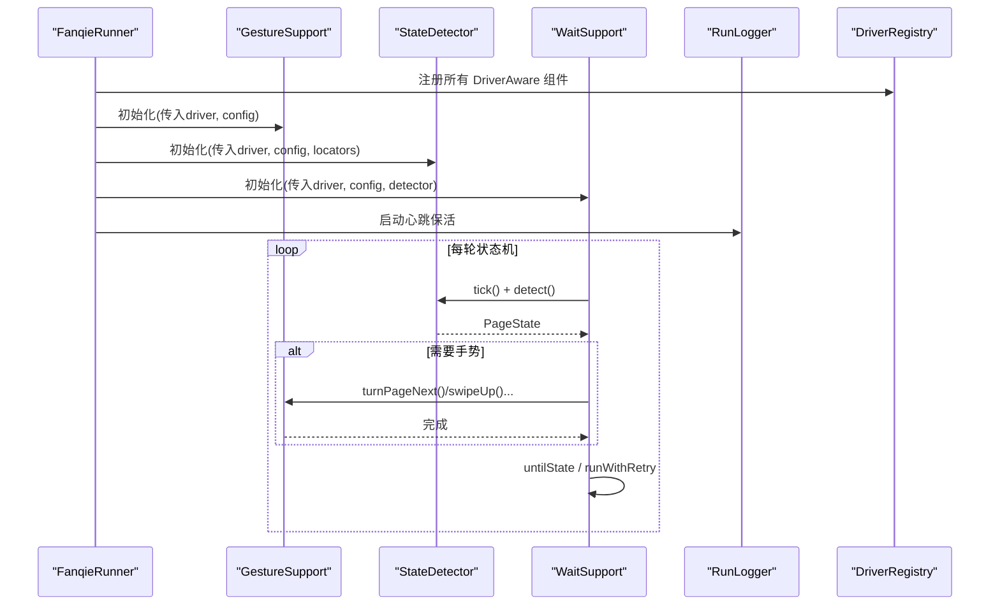
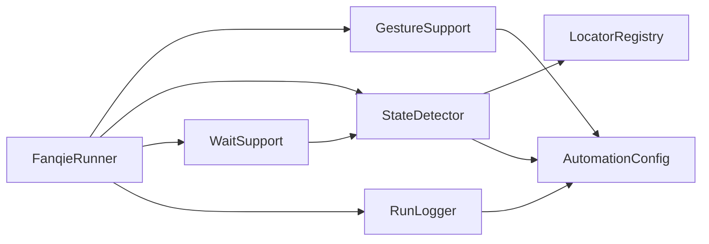

# 性能优化

<cite>
**本文引用的文件**
- [WaitSupport.java](file://automation/src/main/java/com/fanqie/auto/core/WaitSupport.java)
- [GestureSupport.java](file://automation/src/main/java/com/fanqie/auto/core/GestureSupport.java)
- [StateDetector.java](file://automation/src/main/java/com/fanqie/auto/core/StateDetector.java)
- [UiSnapshot.java](file://automation/src/main/java/com/fanqie/auto/core/UiSnapshot.java)
- [RunLogger.java](file://automation/src/main/java/com/fanqie/auto/core/RunLogger.java)
- [AutomationConfig.java](file://automation/src/main/java/com/fanqie/auto/config/AutomationConfig.java)
- [LocatorRegistry.java](file://automation/src/main/java/com/fanqie/auto/config/LocatorRegistry.java)
- [DriverRegistry.java](file://automation/src/main/java/com/fanqie/auto/core/DriverRegistry.java)
- [FanqieRunner.java](file://automation/src/main/java/com/fanqie/auto/FanqieRunner.java)
- [StateDetectorTest.java](file://automation/src/test/java/com/fanqie/auto/core/StateDetectorTest.java)
</cite>

## 目录
1. [简介](#简介)
2. [项目结构](#项目结构)
3. [核心组件](#核心组件)
4. [架构总览](#架构总览)
5. [详细组件分析与调优](#详细组件分析与调优)
6. [依赖关系分析](#依赖关系分析)
7. [性能指标与基准测试](#性能指标与基准测试)
8. [大规模执行与并发控制](#大规模执行与并发控制)
9. [故障排查指南](#故障排查指南)
10. [结论](#结论)

## 简介
本指南面向自动化脚本的性能优化，聚焦等待策略、手势操作、状态检测三大核心组件，提供减少不必要 UI 操作、提升元素查找效率、合理设置超时、避免内存泄漏的方法与技巧。同时给出可落地的性能监控指标与基准测试方法，并给出大规模执行的资源管理与并发控制建议。

## 项目结构
本项目采用分层组织：配置层（AutomationConfig、LocatorRegistry）、核心能力层（WaitSupport、GestureSupport、StateDetector、UiSnapshot、RunLogger、DriverRegistry）、运行入口（FanqieRunner）以及页面与任务编排。核心性能瓶颈集中在 UI 树抓取、状态识别与手势执行路径上。

图表来源
- [FanqieRunner.java:147-200](file://automation/src/main/java/com/fanqie/auto/FanqieRunner.java#L147-L200)
- [AutomationConfig.java:180-212](file://automation/src/main/java/com/fanqie/auto/config/AutomationConfig.java#L180-L212)
- [StateDetector.java:50-68](file://automation/src/main/java/com/fanqie/auto/core/StateDetector.java#L50-L68)
- [GestureSupport.java:36-50](file://automation/src/main/java/com/fanqie/auto/core/GestureSupport.java#L36-L50)
- [WaitSupport.java:34-38](file://automation/src/main/java/com/fanqie/auto/core/WaitSupport.java#L34-L38)
- [RunLogger.java:87-130](file://automation/src/main/java/com/fanqie/auto/core/RunLogger.java#L87-L130)

章节来源
- [FanqieRunner.java:41-238](file://automation/src/main/java/com/fanqie/auto/FanqieRunner.java#L41-L238)

## 核心组件
- 等待策略（WaitSupport）：统一显式等待与重试，避免散落 sleep，支持多目标状态一次等待与指数退避重试。
- 手势操作（GestureSupport）：基于比例坐标的点击与滑动，缓存屏幕尺寸，使用设备端命令提升稳定性。
- 状态检测（StateDetector）：单次抓取 UI 树后纯内存匹配，按优先级判定页面状态，带屏幕尺寸自愈与耗时上报。
- 快照模型（UiSnapshot）：一次 getPageSource 解析为内存节点表，提供零 RPC 查询 API。
- 运行日志（RunLogger）：心跳保活、截图与 XML 快照落盘、统计汇总与异常分布记录。
- 配置（AutomationConfig、LocatorRegistry）：集中管理超时、轮次、阈值与定位候选集，避免魔法数字。
- 驱动刷新（DriverRegistry）：统一刷新 DriverAware 组件引用，防止旧 session 引用导致异常。

章节来源
- [WaitSupport.java:16-233](file://automation/src/main/java/com/fanqie/auto/core/WaitSupport.java#L16-L233)
- [GestureSupport.java:12-227](file://automation/src/main/java/com/fanqie/auto/core/GestureSupport.java#L12-L227)
- [StateDetector.java:12-461](file://automation/src/main/java/com/fanqie/auto/core/StateDetector.java#L12-L461)
- [UiSnapshot.java:21-284](file://automation/src/main/java/com/fanqie/auto/core/UiSnapshot.java#L21-L284)
- [RunLogger.java:31-374](file://automation/src/main/java/com/fanqie/auto/core/RunLogger.java#L31-L374)
- [AutomationConfig.java:18-306](file://automation/src/main/java/com/fanqie/auto/config/AutomationConfig.java#L18-L306)
- [LocatorRegistry.java:16-300](file://automation/src/main/java/com/fanqie/auto/config/LocatorRegistry.java#L16-L300)
- [DriverRegistry.java:10-57](file://automation/src/main/java/com/fanqie/auto/core/DriverRegistry.java#L10-L57)

## 架构总览
整体流程由 FanqieRunner 装配各组件，StateDetector 通过 UiSnapshot 进行纯内存状态识别；WaitSupport 基于 StateDetector 实现稳定等待；GestureSupport 提供高效稳定的手势；RunLogger 负责保活与观测；DriverRegistry 保证 driver 重建时引用一致性。

图表来源
- [FanqieRunner.java:147-200](file://automation/src/main/java/com/fanqie/auto/FanqieRunner.java#L147-L200)
- [WaitSupport.java:56-86](file://automation/src/main/java/com/fanqie/auto/core/WaitSupport.java#L56-L86)
- [StateDetector.java:97-127](file://automation/src/main/java/com/fanqie/auto/core/StateDetector.java#L97-L127)
- [GestureSupport.java:77-178](file://automation/src/main/java/com/fanqie/auto/core/GestureSupport.java#L77-L178)
- [RunLogger.java:150-197](file://automation/src/main/java/com/fanqie/auto/core/RunLogger.java#L150-L197)

## 详细组件分析与调优

### 等待策略优化（WaitSupport）
- 统一显式等待：全部基于 WebDriverWait，杜绝散落 Thread.sleep，降低抖动与误判。
- 多目标状态一次等待：翻页后可能直接触发广告弹窗，需一次性覆盖多个目标状态，减少往返次数。
- 自定义超时与轮询间隔：通过 AutomationConfig.actionTimeoutMs() 与 pollIntervalMs() 精细控制响应与开销平衡。
- 幂等重试与指数退避：对偶发失败的操作（如动画未完成、节点未挂载）进行有限次重试，逐步增加等待时间，避免雪崩。

调优要点
- 将高频操作的超时设置为业务可接受的最小值，轮询间隔不宜过小，避免频繁 RPC。
- 对关键路径使用 untilAnyTextPresent 或 untilSnapshotMatches，减少盲目等待。
- 对易错操作使用 runWithRetry，backoffMs 从较小值起步，逐步翻倍，限制最大尝试次数。

章节来源
- [WaitSupport.java:45-233](file://automation/src/main/java/com/fanqie/auto/core/WaitSupport.java#L45-L233)
- [AutomationConfig.java:180-212](file://automation/src/main/java/com/fanqie/auto/config/AutomationConfig.java#L180-L212)

### 手势操作优化（GestureSupport）
- 比例坐标：所有坐标基于运行时屏幕尺寸按比例计算，避免硬编码像素，适配不同分辨率与横竖屏切换。
- 屏幕尺寸缓存：首次获取后缓存，避免每次手势都发 getSize() RPC；driver 刷新或旋转时自动失效重取。
- 优先 tap 策略：阅读页翻页优先 tap 右侧热区，最快最稳；备选 swipe 使用 mobile: swipeGesture，设备端单次执行更稳。
- App 生命周期：使用 mobile: activateApp/terminateApp，避免硬编码 Activity 导致的权限问题。

调优要点
- 翻页策略在配置中可调（tap/swipe），根据设备表现选择最优策略。
- 滑动距离与时长通过配置控制，过快可能被系统忽略，过慢影响吞吐。
- 在 driver 重建后务必调用 invalidateScreenSizeCache，防止比例失真。

章节来源
- [GestureSupport.java:33-67](file://automation/src/main/java/com/fanqie/auto/core/GestureSupport.java#L33-L67)
- [GestureSupport.java:77-178](file://automation/src/main/java/com/fanqie/auto/core/GestureSupport.java#L77-L178)
- [GestureSupport.java:189-226](file://automation/src/main/java/com/fanqie/auto/core/GestureSupport.java#L189-L226)
- [AutomationConfig.java:264-287](file://automation/src/main/java/com/fanqie/auto/config/AutomationConfig.java#L264-L287)

### 状态检测优化（StateDetector）
- 单次抓取、多次复用：tick() 仅调用一次 getPageSource()，同一 tick 内多次 detect() 复用内存快照，杜绝重复抓取。
- 纯内存匹配：按 resource-id → text → content-desc → APP_LAUNCHING → 几何特征 → UNKNOWN 的优先级顺序匹配，避免 O(状态数) 次 RPC。
- 屏幕尺寸自愈：若检测到节点越界（横屏/折叠屏旋转），自动失效并重取尺寸，确保比例判定准确。
- 耗时上报：detect() 内部记录识别耗时并通过 RunLogger 上报，便于监控与优化。

调优要点
- 优先使用 resource-id 锚点，确定性高且成本低；text/content-desc 作为稳健兜底。
- 几何规则作为最后手段，仅在必要时启用，避免误判。
- 合理设置 stateDetectTimeoutMs 与 actionTimeoutMs，兼顾速度与鲁棒性。

章节来源
- [StateDetector.java:12-68](file://automation/src/main/java/com/fanqie/auto/core/StateDetector.java#L12-L68)
- [StateDetector.java:97-170](file://automation/src/main/java/com/fanqie/auto/core/StateDetector.java#L97-L170)
- [StateDetector.java:183-418](file://automation/src/main/java/com/fanqie/auto/core/StateDetector.java#L183-L418)
- [AutomationConfig.java:180-212](file://automation/src/main/java/com/fanqie/auto/config/AutomationConfig.java#L180-L212)

### 快照模型与定位器（UiSnapshot、LocatorRegistry）
- UiSnapshot：一次解析 XML 构建不可变节点列表，提供 findByTextContains、findByResourceId、findClickableInRegion、extractByRegex 等零 RPC 查询 API。
- LocatorRegistry：集中管理文本候选集与定位规格，支持 primaryBy + fallbacks + boundsHint + allowGeometryFallback，避免代码中硬编码。

调优要点
- 尽量使用 resource-id 锚点与精确文本候选，减少正则与几何兜底的使用。
- 对关闭按钮允许几何兜底，对观看/继续按钮禁止几何兜底，避免误点浪费配额。
- 定期校验 locators.properties 中文编码，避免乱码导致匹配失败。

章节来源
- [UiSnapshot.java:21-284](file://automation/src/main/java/com/fanqie/auto/core/UiSnapshot.java#L21-L284)
- [LocatorRegistry.java:16-300](file://automation/src/main/java/com/fanqie/auto/config/LocatorRegistry.java#L16-L300)

### 运行日志与保活（RunLogger）
- 心跳保活：定时轻量命令保持 session 活跃，避免长静默期被服务端断开。
- 快照落盘：异常与恢复时保存截图与 XML，便于回溯与诊断。
- 统计汇总：输出运行时长、累计时长、翻页数、状态识别次数与平均耗时、异常分布等。

调优要点
- 调整 heartbeatIntervalSec，平衡保活频率与开销。
- 监控 XML 体积异常膨胀，及时排查 UI 树泄漏。
- 利用最终统计快速评估任务健康度与性能趋势。

章节来源
- [RunLogger.java:31-197](file://automation/src/main/java/com/fanqie/auto/core/RunLogger.java#L31-L197)
- [RunLogger.java:200-374](file://automation/src/main/java/com/fanqie/auto/core/RunLogger.java#L200-L374)

### 驱动刷新与一致性（DriverRegistry）
- 统一刷新：当 DriverFactory.recreate() 成功后，refreshAll 将新 driver 引用传播到所有 DriverAware 组件，避免 NoSuchSessionException。
- 线程安全：使用 CopyOnWriteArrayList 保证注册与遍历的线程安全。

调优要点
- 在 session 重建后立即调用 refreshAll，确保后续操作使用新 driver。
- 单个组件刷新失败不影响其余组件，提高健壮性。

章节来源
- [DriverRegistry.java:10-57](file://automation/src/main/java/com/fanqie/auto/core/DriverRegistry.java#L10-L57)

## 依赖关系分析
- FanqieRunner 装配各组件，形成以 StateDetector 为核心的状态机驱动流程。
- WaitSupport 依赖 StateDetector 与 AutomationConfig，实现稳定等待与重试。
- GestureSupport 依赖 AutomationConfig 与 AppiumDriver，提供高效手势。
- RunLogger 依赖 AutomationConfig 与 AppiumDriver，负责保活与观测。
- StateDetector 依赖 LocatorRegistry 与 AutomationConfig，实现高性能状态识别。

图表来源
- [FanqieRunner.java:147-200](file://automation/src/main/java/com/fanqie/auto/FanqieRunner.java#L147-L200)
- [StateDetector.java:50-68](file://automation/src/main/java/com/fanqie/auto/core/StateDetector.java#L50-L68)
- [WaitSupport.java:34-38](file://automation/src/main/java/com/fanqie/auto/core/WaitSupport.java#L34-L38)
- [GestureSupport.java:36-50](file://automation/src/main/java/com/fanqie/auto/core/GestureSupport.java#L36-L50)
- [RunLogger.java:87-130](file://automation/src/main/java/com/fanqie/auto/core/RunLogger.java#L87-L130)

章节来源
- [FanqieRunner.java:147-200](file://automation/src/main/java/com/fanqie/auto/FanqieRunner.java#L147-L200)

## 性能指标与基准测试
- 关键指标
  - getPageSource 耗时：StateDetector.getLastPageSourceMs()，反映 UI 树抓取成本。
  - 状态识别耗时：RunLogger.recordDetectTime(detectMs)，用于统计平均识别耗时。
  - XML 体积：RunLogger.lastXmlSize，超过阈值预警可能存在 UI 树泄漏。
  - 心跳保活成功率：RunLogger.sessionAlive，session 断开时需及时重建。
  - 重试成功率：WaitSupport.runWithRetry 的成功率与平均尝试次数。
  - 手势成功率：GestureSupport 各手势调用成功次数与失败原因分类。
- 基准测试方法
  - 离线单元测试：StateDetectorTest 使用 fixture XML 回放，验证状态识别正确性与优先级。
  - Dry-run 模式：只连接并 dump UI 树，不执行点击，适合环境自检与性能基线采集。
  - 周期采样：在 RunLogger 心跳中输出关键指标，便于长期观察趋势。
  - 对比实验：调整 pollIntervalMs、actionTimeoutMs、turnStrategy 等参数，对比吞吐与稳定性。

章节来源
- [StateDetectorTest.java:13-154](file://automation/src/test/java/com/fanqie/auto/core/StateDetectorTest.java#L13-L154)
- [RunLogger.java:150-197](file://automation/src/main/java/com/fanqie/auto/core/RunLogger.java#L150-L197)
- [FanqieRunner.java:162-171](file://automation/src/main/java/com/fanqie/auto/FanqieRunner.java#L162-L171)

## 大规模执行与并发控制
- 资源管理
  - 会话生命周期：try-finally 强制 logger.stop() 与 driver.quit()，防止 session 泄漏。
  - 进程级退出：ShutdownHook 处理 Ctrl+C，保证优雅关闭。
  - 日志与快照：统一写入 automation/logs 与 snapshots，避免污染工程目录。
- 并发控制
  - 单设备串行：当前实现以单设备串行执行为主，避免竞争与状态不一致。
  - 多设备扩展：如需并发，建议按设备维度隔离 DriverFactory 与 DriverRegistry，避免共享状态冲突。
  - 限流与熔断：通过 AutomationConfig.maxWallClockMs 设置墙钟时间预算，达到上限优雅收尾。
- 稳定性保障
  - 指数退避重试：对偶发失败操作进行有限次重试，避免雪崩。
  - 状态自愈：屏幕尺寸缓存失效与重取，避免比例判定失真。
  - 异常快照：关键节点捕获截图与 XML，便于回溯。

章节来源
- [FanqieRunner.java:127-238](file://automation/src/main/java/com/fanqie/auto/FanqieRunner.java#L127-L238)
- [AutomationConfig.java:241-248](file://automation/src/main/java/com/fanqie/auto/config/AutomationConfig.java#L241-L248)
- [WaitSupport.java:199-233](file://automation/src/main/java/com/fanqie/auto/core/WaitSupport.java#L199-L233)
- [StateDetector.java:110-118](file://automation/src/main/java/com/fanqie/auto/core/StateDetector.java#L110-L118)

## 故障排查指南
- 常见问题
  - 状态识别缓慢：检查 getPageSource 耗时与 XML 体积，确认是否存在 UI 树泄漏。
  - 手势误触：核对 LocatorRegistry 中 allowGeometryFallback 的设置，避免误点观看/继续按钮。
  - Session 断开：关注 RunLogger.sessionAlive，必要时重建 session 并刷新所有组件引用。
  - 配置乱码：确认 locators.properties 与 automation.properties 使用 UTF-8，避免中文匹配失败。
- 诊断步骤
  - 启用 dry-run 模式，仅采集 UI 树，不执行点击，验证环境连通性。
  - 查看 RunLogger 心跳摘要与最终统计，定位瓶颈环节。
  - 下载 snapshots 中的截图与 XML，人工核验状态识别是否正确。
  - 调整超时与轮询间隔，观察吞吐与稳定性变化。

章节来源
- [RunLogger.java:150-197](file://automation/src/main/java/com/fanqie/auto/core/RunLogger.java#L150-L197)
- [LocatorRegistry.java:67-81](file://automation/src/main/java/com/fanqie/auto/config/LocatorRegistry.java#L67-L81)
- [FanqieRunner.java:162-171](file://automation/src/main/java/com/fanqie/auto/FanqieRunner.java#L162-L171)

## 结论
通过统一等待策略、比例化手势与纯内存状态识别，项目在稳定性与性能上取得显著提升。配合 RunLogger 的心跳保活与统计汇总，可实现长任务的可观测与可控。建议在大规模执行中结合配置调优、重试策略与熔断保护，持续监控关键指标，确保自动化脚本的高效与稳定。