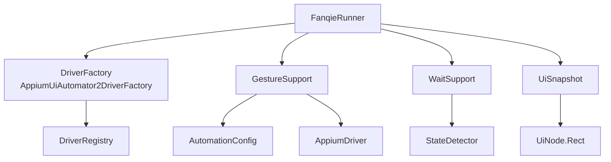
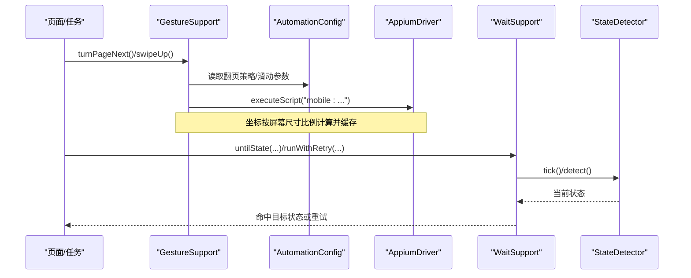
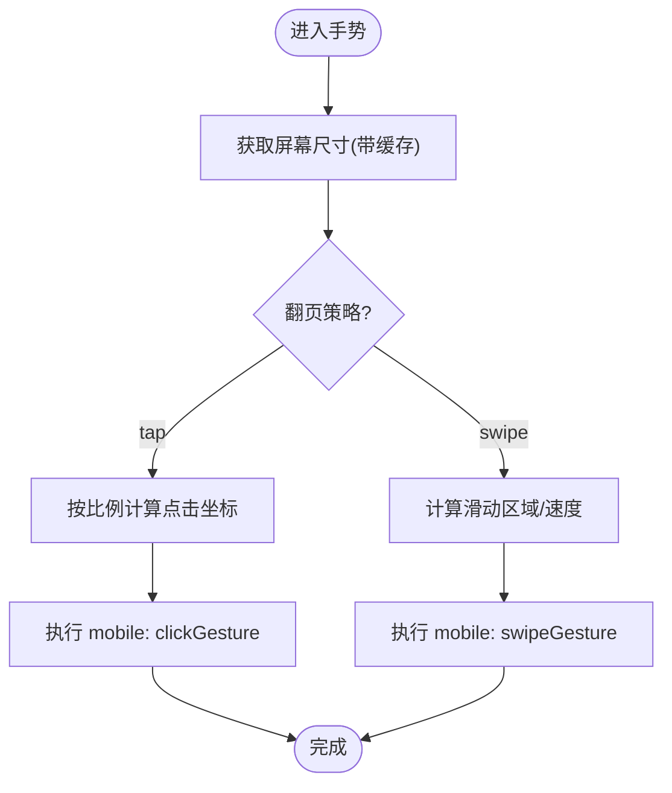
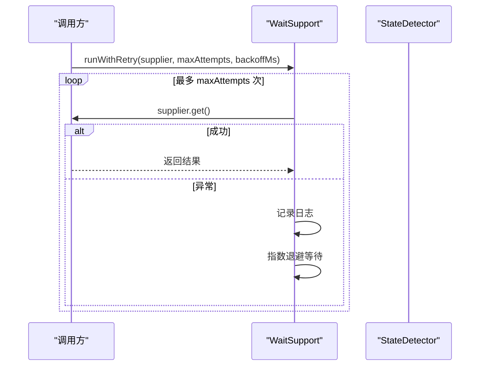
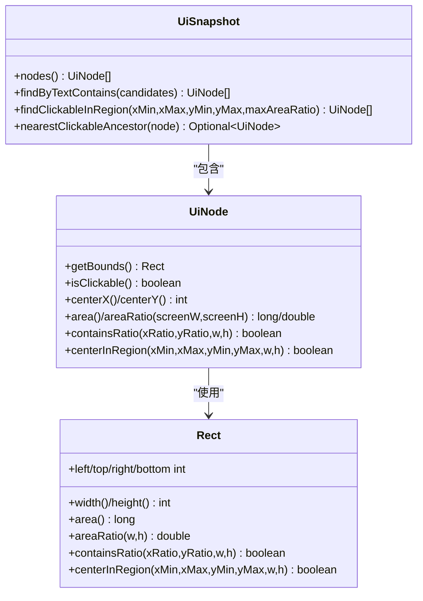
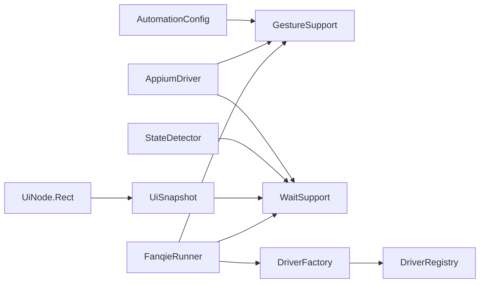

# 手势操作优化

<cite>
**本文引用的文件**
- [GestureSupport.java](file://automation/src/main/java/com/fanqie/auto/core/GestureSupport.java)
- [AutomationConfig.java](file://automation/src/main/java/com/fanqie/auto/config/AutomationConfig.java)
- [UiNode.java](file://automation/src/main/java/com/fanqie/auto/core/UiNode.java)
- [WaitSupport.java](file://automation/src/main/java/com/fanqie/auto/core/WaitSupport.java)
- [UiSnapshot.java](file://automation/src/main/java/com/fanqie/auto/core/UiSnapshot.java)
- [DriverFactory.java](file://automation/src/main/java/com/fanqie/auto/core/DriverFactory.java)
- [AppiumUiAutomator2DriverFactory.java](file://automation/src/main/java/com/fanqie/auto/core/AppiumUiAutomator2DriverFactory.java)
- [DriverRegistry.java](file://automation/src/main/java/com/fanqie/auto/core/DriverRegistry.java)
- [FanqieRunner.java](file://automation/src/main/java/com/fanqie/auto/FanqieRunner.java)
- [LocatorRegistry.java](file://automation/src/main/java/com/fanqie/auto/config/LocatorRegistry.java)
</cite>

## 目录
1. [简介](#简介)
2. [项目结构](#项目结构)
3. [核心组件](#核心组件)
4. [架构总览](#架构总览)
5. [详细组件分析](#详细组件分析)
6. [依赖关系分析](#依赖关系分析)
7. [性能考量与调优](#性能考量与调优)
8. [故障排查指南](#故障排查指南)
9. [结论](#结论)
10. [附录：设备适配与配置建议](#附录设备适配与配置建议)

## 简介
本指南聚焦于自动化框架中的手势操作优化，围绕 GestureSupport 组件展开，系统讲解点击坐标计算、滑动轨迹优化、批量操作合并执行、错误处理与重试机制等关键能力。同时给出不同设备类型下的适配方案（屏幕尺寸、分辨率、设备特性兼容），帮助在真实设备上稳定、高效地执行 UI 自动化任务。

## 项目结构
本项目基于 Appium 2 + Java Client 构建，采用分层设计：
- 运行入口与装配：FanqieRunner
- 驱动与生命周期：DriverFactory / AppiumUiAutomator2DriverFactory / DriverRegistry
- 状态探测与等待：StateDetector（未在本节直接引用）、WaitSupport
- UI 快照与节点：UiSnapshot / UiNode
- 配置与定位器：AutomationConfig / LocatorRegistry
- 手势封装：GestureSupport

图表来源
- [FanqieRunner.java:147-200](file://automation/src/main/java/com/fanqie/auto/FanqieRunner.java#L147-L200)
- [DriverFactory.java:17-36](file://automation/src/main/java/com/fanqie/auto/core/DriverFactory.java#L17-L36)
- [AppiumUiAutomator2DriverFactory.java:44-76](file://automation/src/main/java/com/fanqie/auto/core/AppiumUiAutomator2DriverFactory.java#L44-L76)
- [GestureSupport.java:26-67](file://automation/src/main/java/com/fanqie/auto/core/GestureSupport.java#L26-L67)
- [WaitSupport.java:26-86](file://automation/src/main/java/com/fanqie/auto/core/WaitSupport.java#L26-L86)
- [UiSnapshot.java:21-72](file://automation/src/main/java/com/fanqie/auto/core/UiSnapshot.java#L21-L72)
- [UiNode.java:85-216](file://automation/src/main/java/com/fanqie/auto/core/UiNode.java#L85-L216)

章节来源
- [FanqieRunner.java:41-239](file://automation/src/main/java/com/fanqie/auto/FanqieRunner.java#L41-L239)
- [pom.xml:15-83](file://automation/pom.xml#L15-L83)

## 核心组件
- GestureSupport：统一封装点击、滑动、应用激活/终止/重启等手势；所有坐标按运行时屏幕尺寸比例计算，避免硬编码像素；提供屏幕尺寸缓存以减少 RPC。
- AutomationConfig：集中管理超时、轮询间隔、翻页策略、滑动参数等配置，支持外部覆盖。
- WaitSupport：统一显式等待与幂等重试（指数退避），避免散落 sleep。
- UiSnapshot / UiNode：一次抓取 XML 后内存解析为节点树，提供纯内存查询 API；Rect 提供几何计算与区域判定。
- DriverFactory / AppiumUiAutomator2DriverFactory：创建/重建 Appium session，强制隐式等待为 0，保障短轮询稳定性。
- DriverRegistry：session 重建后统一刷新各组件的 driver 引用，避免 NoSuchSessionException。

章节来源
- [GestureSupport.java:26-227](file://automation/src/main/java/com/fanqie/auto/core/GestureSupport.java#L26-L227)
- [AutomationConfig.java:18-305](file://automation/src/main/java/com/fanqie/auto/config/AutomationConfig.java#L18-L305)
- [WaitSupport.java:16-233](file://automation/src/main/java/com/fanqie/auto/core/WaitSupport.java#L16-L233)
- [UiSnapshot.java:21-284](file://automation/src/main/java/com/fanqie/auto/core/UiSnapshot.java#L21-L284)
- [UiNode.java:13-216](file://automation/src/main/java/com/fanqie/auto/core/UiNode.java#L13-L216)
- [DriverFactory.java:17-36](file://automation/src/main/java/com/fanqie/auto/core/DriverFactory.java#L17-L36)
- [AppiumUiAutomator2DriverFactory.java:44-94](file://automation/src/main/java/com/fanqie/auto/core/AppiumUiAutomator2DriverFactory.java#L44-L94)
- [DriverRegistry.java:10-57](file://automation/src/main/java/com/fanqie/auto/core/DriverRegistry.java#L10-L57)

## 架构总览
手势操作的执行链路如下：上层页面/任务调用 GestureSupport 进行点击或滑动；GestureSupport 通过 AutomationConfig 获取策略与参数，使用 AppiumDriver 执行 mobile: clickGesture/swipeGesture；屏幕尺寸由 GestureSupport 缓存并在 driver 刷新时失效；等待与重试由 WaitSupport 提供；UI 快照与节点用于状态检测与几何匹配。

图表来源
- [GestureSupport.java:71-178](file://automation/src/main/java/com/fanqie/auto/core/GestureSupport.java#L71-L178)
- [AutomationConfig.java:262-287](file://automation/src/main/java/com/fanqie/auto/config/AutomationConfig.java#L262-L287)
- [WaitSupport.java:56-86](file://automation/src/main/java/com/fanqie/auto/core/WaitSupport.java#L56-L86)
- [AppiumUiAutomator2DriverFactory.java:61-67](file://automation/src/main/java/com/fanqie/auto/core/AppiumUiAutomator2DriverFactory.java#L61-L67)

## 详细组件分析

### GestureSupport：点击与滑动的性能优化
- 坐标计算优化
  - 所有坐标以比例形式输入，内部乘以运行时屏幕尺寸得到绝对像素，避免硬编码像素导致跨设备失效。
  - 屏幕尺寸缓存：首次获取后复用，减少每次手势的 RPC；driver 刷新时自动失效，防止横屏/折叠屏旋转后比例失真。
- 翻页策略
  - tap 策略：默认点击右侧热区（右三分之一内且避开中间菜单区），最快最稳。
  - swipe 策略：使用 mobile: swipeGesture，单次设备端执行，比 W3C PointerInput 多点注入更稳。
- 滑动轨迹优化
  - 通过 percent 控制滑动距离占屏幕比例，speed 根据高度与持续时间换算，避免过快被系统忽略。
  - 统一方向封装（up/down/left/right），便于批量组合。
- 应用生命周期
  - 使用 mobile: activateApp/terminateApp 而非硬编码 Activity，规避权限拒绝与版本变更风险。
  - restartApp 提供“先终止再激活”的恢复流程，配合短暂休眠确保进程完全退出。

图表来源
- [GestureSupport.java:52-67](file://automation/src/main/java/com/fanqie/auto/core/GestureSupport.java#L52-L67)
- [GestureSupport.java:71-178](file://automation/src/main/java/com/fanqie/auto/core/GestureSupport.java#L71-L178)

章节来源
- [GestureSupport.java:26-227](file://automation/src/main/java/com/fanqie/auto/core/GestureSupport.java#L26-L227)
- [AutomationConfig.java:262-287](file://automation/src/main/java/com/fanqie/auto/config/AutomationConfig.java#L262-L287)

### WaitSupport：等待与重试的统一原语
- 统一显式等待：全部基于 WebDriverWait，杜绝散落 Thread.sleep；pollInterval 来自配置，保证短轮询。
- 多目标状态等待：untilState 支持一次等待多个目标状态，适配翻页可能直接触发广告弹窗的场景。
- 幂等重试：runWithRetry 提供指数退避重试，适用于偶发时序竞争导致的失败，无需走完整恢复流程。

图表来源
- [WaitSupport.java:186-233](file://automation/src/main/java/com/fanqie/auto/core/WaitSupport.java#L186-L233)

章节来源
- [WaitSupport.java:16-233](file://automation/src/main/java/com/fanqie/auto/core/WaitSupport.java#L16-L233)

### UiSnapshot / UiNode：快照与几何计算
- 快照解析：一次 getPageSource() 后解析为不可变节点列表，后续查询均为纯内存操作，零 RPC。
- 几何特征：Rect 提供面积占比、中心点区域判断、比例坐标包含判断，支撑状态检测与手势落点校验。
- 健壮性：bounds 解析失败返回空矩形，不抛异常；XXE 防御与安全解析。

图表来源
- [UiSnapshot.java:21-284](file://automation/src/main/java/com/fanqie/auto/core/UiSnapshot.java#L21-L284)
- [UiNode.java:13-216](file://automation/src/main/java/com/fanqie/auto/core/UiNode.java#L13-L216)

章节来源
- [UiSnapshot.java:21-284](file://automation/src/main/java/com/fanqie/auto/core/UiSnapshot.java#L21-L284)
- [UiNode.java:13-216](file://automation/src/main/java/com/fanqie/auto/core/UiNode.java#L13-L216)

### Driver 生命周期与一致性
- 隐式等待清零：创建 driver 后立即设置 implicitlyWait=0，避免阻塞短轮询。
- Session 健康检查：轻量命令探活，失败则重建。
- 驱动刷新注册表：recreate 成功后通过 DriverRegistry.refreshAll 统一刷新各组件的 driver 引用，避免旧引用导致异常。

章节来源
- [AppiumUiAutomator2DriverFactory.java:44-94](file://automation/src/main/java/com/fanqie/auto/core/AppiumUiAutomator2DriverFactory.java#L44-L94)
- [DriverRegistry.java:10-57](file://automation/src/main/java/com/fanqie/auto/core/DriverRegistry.java#L10-L57)

## 依赖关系分析
- GestureSupport 依赖 AutomationConfig 获取策略与参数，依赖 AppiumDriver 执行手势。
- WaitSupport 依赖 StateDetector 进行状态识别，依赖 AutomationConfig 获取轮询间隔与超时。
- UiSnapshot/UiNode 提供纯内存查询与几何计算，支撑状态检测与手势落点校验。
- FanqieRunner 负责装配各组件，注册 DriverAware 实现，确保 session 重建后一致性。

图表来源
- [FanqieRunner.java:147-200](file://automation/src/main/java/com/fanqie/auto/FanqieRunner.java#L147-L200)
- [GestureSupport.java:26-67](file://automation/src/main/java/com/fanqie/auto/core/GestureSupport.java#L26-L67)
- [WaitSupport.java:26-86](file://automation/src/main/java/com/fanqie/auto/core/WaitSupport.java#L26-L86)
- [UiSnapshot.java:21-72](file://automation/src/main/java/com/fanqie/auto/core/UiSnapshot.java#L21-L72)
- [UiNode.java:85-216](file://automation/src/main/java/com/fanqie/auto/core/UiNode.java#L85-L216)
- [DriverFactory.java:17-36](file://automation/src/main/java/com/fanqie/auto/core/DriverFactory.java#L17-L36)
- [DriverRegistry.java:10-57](file://automation/src/main/java/com/fanqie/auto/core/DriverRegistry.java#L10-L57)

## 性能考量与调优
- 减少不必要的 UI 交互
  - 使用比例坐标与缓存屏幕尺寸，避免重复 RPC；翻页优先 tap 策略，减少复杂多点注入。
  - 滑动使用 mobile: swipeGesture，单次设备端执行，降低注入失败风险。
- 优化手势序列
  - 将多次滑动/点击合并为批量操作：例如连续翻页时使用 swipeLeft/Right 或 tapAtRatio 组合，并通过 WaitSupport.untilState 一次覆盖多个目标状态，减少等待次数。
  - 利用 LocatorRegistry 的定位优先级与 boundsHint，减少误点与回退路径。
- 避免重复操作
  - 使用 WaitSupport.runWithRetry 对幂等操作进行指数退避重试，避免无谓的全量恢复流程。
  - 通过 DriverRegistry 在 session 重建后统一刷新 driver 引用，避免重复创建与状态不一致。
- 设备适配
  - 屏幕尺寸与分辨率：所有坐标按运行时尺寸比例计算，适配不同设备；横屏/折叠屏场景下，driver 刷新会失效尺寸缓存，确保比例正确。
  - 设备特性兼容：使用 mobile: 命令而非 capability 硬编码 Activity，规避权限拒绝与版本变更问题。
- 配置调优
  - 翻页策略：reader.turn.strategy 可切换 tap/swipe；next/prev 点击比例可通过 reader.next.tap.ratio.* 与 reader.prev.tap.ratio.* 调整。
  - 滑动参数：reader.swipe.percent 与 reader.swipe.duration.ms 控制滑动距离与速度，避免过快被系统忽略。
  - 轮询与超时：timing.poll.interval.ms、timing.action.timeout.ms、timing.state.detect.timeout.ms 影响响应速度与稳定性。

章节来源
- [GestureSupport.java:71-178](file://automation/src/main/java/com/fanqie/auto/core/GestureSupport.java#L71-L178)
- [AutomationConfig.java:180-287](file://automation/src/main/java/com/fanqie/auto/config/AutomationConfig.java#L180-L287)
- [WaitSupport.java:56-86](file://automation/src/main/java/com/fanqie/auto/core/WaitSupport.java#L56-L86)
- [LocatorRegistry.java:152-256](file://automation/src/main/java/com/fanqie/auto/config/LocatorRegistry.java#L152-L256)

## 故障排查指南
- 常见错误与处理
  - 状态检测超时：WaitSupport.untilState 抛出 TimeoutException，日志记录当前状态；检查 locator 候选集与 boundsHint 是否匹配。
  - 手势执行失败：GestureSupport 使用 mobile: 命令，若失败可结合 WaitSupport.runWithRetry 进行指数退避重试。
  - Session 断开：DriverFactory.healthCheck 失败时重建 session，DriverRegistry.refreshAll 统一刷新引用。
- 调试建议
  - 启用 dry-run 模式：只连接并 dump UI 树，不执行任何点击，验证定位与状态识别。
  - 查看日志：关注 GestureSupport 的点击坐标与滑动参数，以及 WaitSupport 的重试日志。
  - 检查配置：确认 reader.turn.strategy、reader.swipe.percent/duration.ms、timing.* 配置合理。

章节来源
- [WaitSupport.java:56-86](file://automation/src/main/java/com/fanqie/auto/core/WaitSupport.java#L56-L86)
- [GestureSupport.java:106-178](file://automation/src/main/java/com/fanqie/auto/core/GestureSupport.java#L106-L178)
- [AppiumUiAutomator2DriverFactory.java:85-94](file://automation/src/main/java/com/fanqie/auto/core/AppiumUiAutomator2DriverFactory.java#L85-L94)
- [FanqieRunner.java:162-170](file://automation/src/main/java/com/fanqie/auto/FanqieRunner.java#L162-L170)

## 结论
通过 GestureSupport 的比例坐标计算、滑动轨迹优化、应用生命周期管理，结合 WaitSupport 的统一等待与重试机制，以及 UiSnapshot/UiNode 的纯内存查询与几何计算，项目在跨设备环境下实现了稳定、高效的手势操作。配合 AutomationConfig 的可配置化与 DriverRegistry 的一致性保障，能够有效减少不必要的 UI 交互、优化手势序列、避免重复操作，并提供完善的错误处理与重试机制。

## 附录：设备适配与配置建议
- 屏幕尺寸适配
  - 所有坐标按运行时屏幕尺寸比例计算，避免硬编码像素；driver 刷新时自动失效尺寸缓存，适配横屏/折叠屏。
- 分辨率处理
  - 使用 mobile: swipeGesture 的 percent 控制滑动距离，避免分辨率差异导致的轨迹偏差。
- 设备特性兼容
  - 使用 mobile: activateApp/terminateApp 而非硬编码 Activity，规避权限拒绝与版本变更。
- 配置建议
  - 翻页策略：reader.turn.strategy=tap 或 swipe；next/prev 点击比例根据实际 UI 调整。
  - 滑动参数：reader.swipe.percent=0.6，reader.swipe.duration.ms=300；根据设备性能微调。
  - 轮询与超时：timing.poll.interval.ms=250，timing.action.timeout.ms=8000；根据网络与设备性能调整。

章节来源
- [GestureSupport.java:52-67](file://automation/src/main/java/com/fanqie/auto/core/GestureSupport.java#L52-L67)
- [AutomationConfig.java:262-287](file://automation/src/main/java/com/fanqie/auto/config/AutomationConfig.java#L262-L287)
- [AppiumUiAutomator2DriverFactory.java:18-32](file://automation/src/main/java/com/fanqie/auto/core/AppiumUiAutomator2DriverFactory.java#L18-L32)