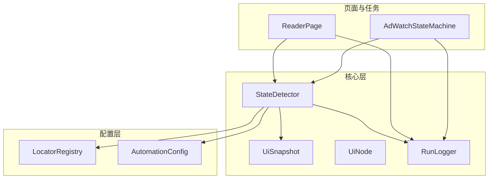
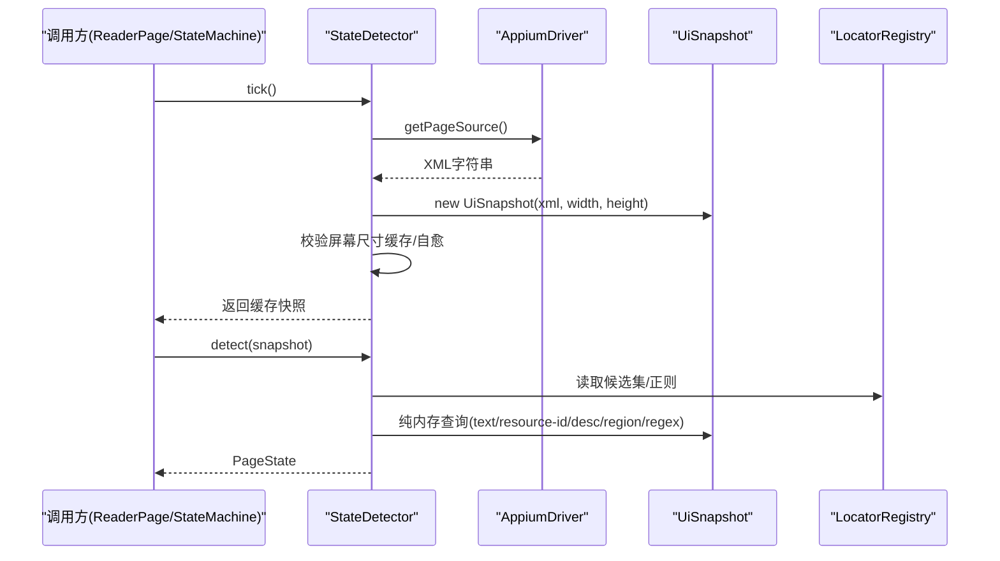
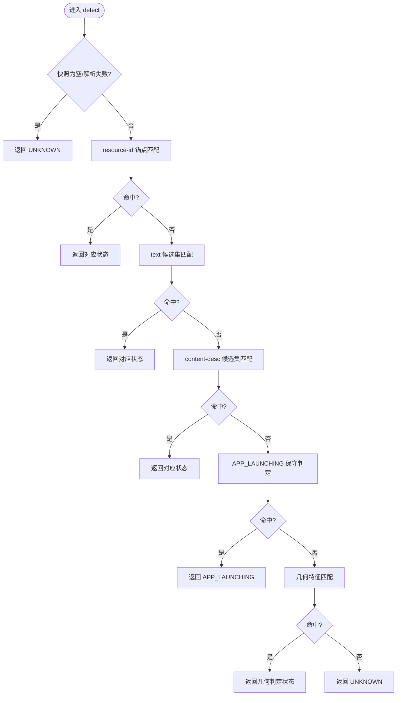
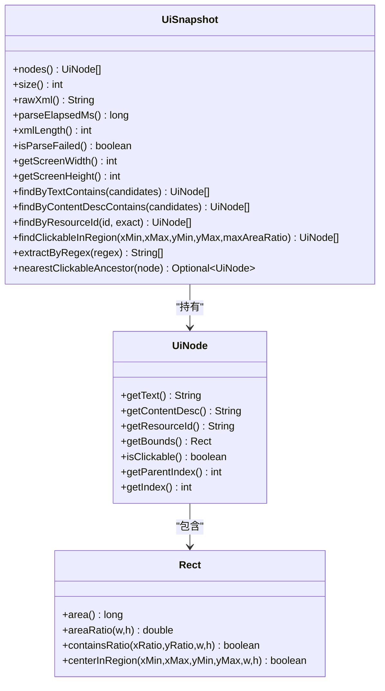
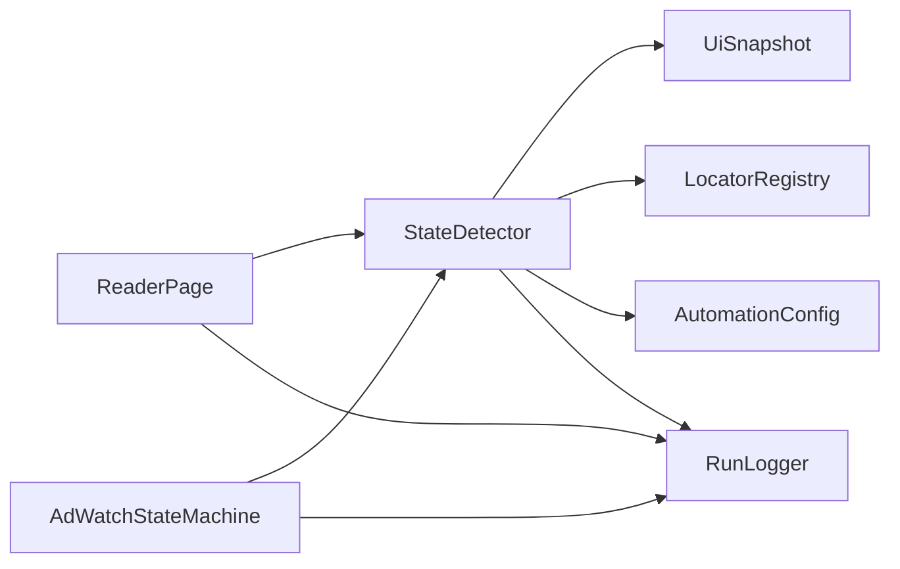

# 状态检测优化

<cite>
**本文引用的文件列表**
- [StateDetector.java](file://automation/src/main/java/com/fanqie/auto/core/StateDetector.java)
- [UiSnapshot.java](file://automation/src/main/java/com/fanqie/auto/core/UiSnapshot.java)
- [UiNode.java](file://automation/src/main/java/com/fanqie/auto/core/UiNode.java)
- [LocatorRegistry.java](file://automation/src/main/java/com/fanqie/auto/config/LocatorRegistry.java)
- [AutomationConfig.java](file://automation/src/main/java/com/fanqie/auto/config/AutomationConfig.java)
- [RunLogger.java](file://automation/src/main/java/com/fanqie/auto/core/RunLogger.java)
- [AdWatchStateMachine.java](file://automation/src/main/java/com/fanqie/auto/task/AdWatchStateMachine.java)
- [ReaderPage.java](file://automation/src/main/java/com/fanqie/auto/page/ReaderPage.java)
- [StateDetectorTest.java](file://automation/src/test/java/com/fanqie/auto/core/StateDetectorTest.java)
- [TestFixtures.java](file://automation/src/test/java/com/fanqie/auto/TestFixtures.java)
</cite>

## 目录
1. [简介](#简介)
2. [项目结构](#项目结构)
3. [核心组件](#核心组件)
4. [架构总览](#架构总览)
5. [详细组件分析](#详细组件分析)
6. [依赖关系分析](#依赖关系分析)
7. [性能考量与基准测试](#性能考量与基准测试)
8. [故障排查指南](#故障排查指南)
9. [结论](#结论)
10. [附录](#附录)

## 简介
本技术文档聚焦于“状态检测优化”，围绕 StateDetector 组件展开，系统性解析其 UI 快照缓存机制、状态匹配算法优化、元素查找效率提升等关键策略。文档同时给出减少 UI 树遍历次数、优化正则表达式匹配、合理使用定位器策略的实践建议，并提供可量化的基准测试方法与监控指标，帮助开发者评估并持续优化复杂页面（嵌套结构、动态内容、异步加载）下的状态检测性能与稳定性。

## 项目结构
该自动化工程采用分层组织：
- core：核心能力（UI 快照、节点模型、状态检测、运行日志）
- config：配置与定位器注册表
- page：页面级操作封装
- task：业务状态机与任务编排
- test：离线单元测试与夹具

图表来源
- [StateDetector.java:1-134](file://automation/src/main/java/com/fanqie/auto/core/StateDetector.java#L1-L134)
- [UiSnapshot.java:1-130](file://automation/src/main/java/com/fanqie/auto/core/UiSnapshot.java#L1-L130)
- [UiNode.java:1-90](file://automation/src/main/java/com/fanqie/auto/core/UiNode.java#L1-L90)
- [LocatorRegistry.java:1-140](file://automation/src/main/java/com/fanqie/auto/config/LocatorRegistry.java#L1-L140)
- [AutomationConfig.java:1-120](file://automation/src/main/java/com/fanqie/auto/config/AutomationConfig.java#L1-L120)
- [RunLogger.java:1-120](file://automation/src/main/java/com/fanqie/auto/core/RunLogger.java#L1-L120)
- [ReaderPage.java:82-112](file://automation/src/main/java/com/fanqie/auto/page/ReaderPage.java#L82-L112)
- [AdWatchStateMachine.java:39-57](file://automation/src/main/java/com/fanqie/auto/task/AdWatchStateMachine.java#L39-L57)

章节来源
- [StateDetector.java:1-134](file://automation/src/main/java/com/fanqie/auto/core/StateDetector.java#L1-L134)
- [UiSnapshot.java:1-130](file://automation/src/main/java/com/fanqie/auto/core/UiSnapshot.java#L1-L130)
- [UiNode.java:1-90](file://automation/src/main/java/com/fanqie/auto/core/UiNode.java#L1-L90)
- [LocatorRegistry.java:1-140](file://automation/src/main/java/com/fanqie/auto/config/LocatorRegistry.java#L1-L140)
- [AutomationConfig.java:1-120](file://automation/src/main/java/com/fanqie/auto/config/AutomationConfig.java#L1-L120)
- [RunLogger.java:1-120](file://automation/src/main/java/com/fanqie/auto/core/RunLogger.java#L1-L120)
- [ReaderPage.java:82-112](file://automation/src/main/java/com/fanqie/auto/page/ReaderPage.java#L82-L112)
- [AdWatchStateMachine.java:39-57](file://automation/src/main/java/com/fanqie/auto/task/AdWatchStateMachine.java#L39-L57)

## 核心组件
- StateDetector：状态识别的核心，负责一次 tick 抓取 UI 树、构建内存快照、按优先级进行纯内存匹配，输出 PageState。
- UiSnapshot：对一次 getPageSource() 的内存表示，提供高效查询 API（文本包含、resource-id、content-desc、区域几何、正则提取、最近可点击祖先）。
- UiNode：不可变节点数据模型，内嵌 Rect 用于坐标与面积计算，支持健壮 bounds 解析。
- LocatorRegistry：集中管理各逻辑控件的定位策略与候选文案，支持主定位器+回退定位器+区域提示+是否允许几何兜底。
- AutomationConfig：全局配置中心，统一超时、轮次、阈值等参数。
- RunLogger：运行期观测与保活，记录状态转移、耗时统计、异常分布、截图与 XML 快照落盘。

章节来源
- [StateDetector.java:1-134](file://automation/src/main/java/com/fanqie/auto/core/StateDetector.java#L1-L134)
- [UiSnapshot.java:1-130](file://automation/src/main/java/com/fanqie/auto/core/UiSnapshot.java#L1-L130)
- [UiNode.java:1-90](file://automation/src/main/java/com/fanqie/auto/core/UiNode.java#L1-L90)
- [LocatorRegistry.java:1-140](file://automation/src/main/java/com/fanqie/auto/config/LocatorRegistry.java#L1-L140)
- [AutomationConfig.java:1-120](file://automation/src/main/java/com/fanqie/auto/config/AutomationConfig.java#L1-L120)
- [RunLogger.java:1-120](file://automation/src/main/java/com/fanqie/auto/core/RunLogger.java#L1-L120)

## 架构总览
StateDetector 在每次 tick 中仅调用一次 driver.getPageSource()，构造 UiSnapshot 并缓存；后续 detect() 全部基于内存节点表进行多阶段匹配，避免多次 RPC 与阻塞超时。屏幕尺寸首次获取后缓存复用，并在检测到越界时自愈重取。匹配优先级从高到低：resource-id → text → content-desc → APP_LAUNCHING → 几何特征 → UNKNOWN。

图表来源
- [StateDetector.java:97-170](file://automation/src/main/java/com/fanqie/auto/core/StateDetector.java#L97-L170)
- [UiSnapshot.java:52-130](file://automation/src/main/java/com/fanqie/auto/core/UiSnapshot.java#L52-L130)
- [LocatorRegistry.java:100-137](file://automation/src/main/java/com/fanqie/auto/config/LocatorRegistry.java#L100-L137)

章节来源
- [StateDetector.java:97-170](file://automation/src/main/java/com/fanqie/auto/core/StateDetector.java#L97-L170)
- [UiSnapshot.java:52-130](file://automation/src/main/java/com/fanqie/auto/core/UiSnapshot.java#L52-L130)
- [LocatorRegistry.java:100-137](file://automation/src/main/java/com/fanqie/auto/config/LocatorRegistry.java#L100-L137)

## 详细组件分析

### StateDetector：状态匹配与性能核心
- 快照缓存与复用：tick() 只做一次 getPageSource()，同一 tick 内多次 detect() 复用同一快照，杜绝重复抓取。
- 屏幕尺寸缓存与自愈：首次获取后缓存，若发现节点 bounds 超出缓存尺寸（横屏/折叠屏旋转），自动失效并重取，保证比例判定准确。
- 多级匹配策略：
  - resource-id 锚点：最高确定性、最低成本，含阅读页菜单 READER_MENU 判定。
  - text 候选集：来自 LocatorRegistry，SPLASH_AD 优先于 AD_CLOSE_READY 几何误判。
  - content-desc 候选集：覆盖穿山甲 SDK 关闭按钮场景。
  - APP_LAUNCHING 保守判定：节点极少 + 无锚点命中 + 无大面积视频特征。
  - 几何特征：右上角小 clickable 节点 → AD_CLOSE_READY；大面积视频 → AD_VIDEO_PLAYING。
  - 兜底 UNKNOWN。
- 可观测性：detect() 耗时上报至 RunLogger，便于监控与调优。

图表来源
- [StateDetector.java:152-208](file://automation/src/main/java/com/fanqie/auto/core/StateDetector.java#L152-L208)
- [StateDetector.java:218-418](file://automation/src/main/java/com/fanqie/auto/core/StateDetector.java#L218-L418)

章节来源
- [StateDetector.java:97-170](file://automation/src/main/java/com/fanqie/auto/core/StateDetector.java#L97-L170)
- [StateDetector.java:183-418](file://automation/src/main/java/com/fanqie/auto/core/StateDetector.java#L183-L418)

### UiSnapshot：内存快照与高效查询
- 安全解析：防御 XXE，非线程安全的 DocumentBuilderFactory 每次新建实例；XML 畸形/截断不抛异常，返回空快照并标记 parseFailed。
- 深度优先遍历 DOM 树，维护 depth 与 parentIndex，产出不可变 List<UiNode>。
- 查询 API：
  - findByTextContains / findByContentDescContains：使用 contains 而非 equals，增强鲁棒性。
  - findByResourceId：精确或包含匹配。
  - findClickableInRegion：按屏幕比例区域筛选 clickable 且面积占比小的节点，用于几何兜底。
  - extractByRegex：从 text/content-desc 中提取匹配结果，供奖励分钟数等场景使用。
  - nearestClickableAncestor：沿 parentIndex 回溯到最近的可点击祖先，解决文案挂在不可点 TextView 的问题。
- 性能要点：所有查询均为纯内存操作，零 RPC；单 tick 目标约 0.5s，较 uiautomator dump 快 4-10 倍。

图表来源
- [UiSnapshot.java:52-284](file://automation/src/main/java/com/fanqie/auto/core/UiSnapshot.java#L52-L284)
- [UiNode.java:13-218](file://automation/src/main/java/com/fanqie/auto/core/UiNode.java#L13-L218)

章节来源
- [UiSnapshot.java:52-284](file://automation/src/main/java/com/fanqie/auto/core/UiSnapshot.java#L52-L284)
- [UiNode.java:13-218](file://automation/src/main/java/com/fanqie/auto/core/UiNode.java#L13-L218)

### LocatorRegistry：定位器策略与候选集管理
- 中文编码处理：Properties 必须用 UTF-8 Reader 加载，避免中文乱码导致匹配失效。
- 每个逻辑控件定义 LocatorSpec：primaryBy + fallbackBys + boundsHint + allowGeometryFallback。
- 广告关闭按钮允许几何兜底（右上角小 clickable），而观看/继续获取等高风险操作禁止几何兜底，防止误点浪费配额。
- 提供各类候选文案与正则（如 reader.progress.regex、splash.skip.text、ad.close.desc 等）。

章节来源
- [LocatorRegistry.java:1-300](file://automation/src/main/java/com/fanqie/auto/config/LocatorRegistry.java#L1-L300)

### RunLogger：运行期观测与保活
- 心跳保活：定时执行轻量 getWindowSize() 保持 session 活跃，避免长静默触发超时。
- 状态转移日志、耗时统计、异常分布、截图与 XML 快照落盘。
- 提供 recordDetectTime、updatePageSourceMetrics 等方法，配合 StateDetector 实现性能监控。

章节来源
- [RunLogger.java:1-374](file://automation/src/main/java/com/fanqie/auto/core/RunLogger.java#L1-L374)

### ReaderPage 与 AdWatchStateMachine：集成使用
- ReaderPage 在翻页等待中使用 WaitSupport 与 detector.tick()/detect()，并将耗时与 XML 大小上报给 RunLogger。
- AdWatchStateMachine 以转移表驱动流程，四重熔断保护（单入口轮次、全局轮次、目标分钟、单状态滞留），并对 SPLASH_AD 做排他判定，不计入广告轮次。

章节来源
- [ReaderPage.java:82-112](file://automation/src/main/java/com/fanqie/auto/page/ReaderPage.java#L82-L112)
- [AdWatchStateMachine.java:39-57](file://automation/src/main/java/com/fanqie/auto/task/AdWatchStateMachine.java#L39-L57)
- [AdWatchStateMachine.java:412-432](file://automation/src/main/java/com/fanqie/auto/task/AdWatchStateMachine.java#L412-L432)

## 依赖关系分析
- StateDetector 依赖 UiSnapshot 进行纯内存匹配，依赖 LocatorRegistry 获取候选集与正则，依赖 AutomationConfig 获取时序与阈值，依赖 RunLogger 上报耗时。
- UiSnapshot 依赖 UiNode 与 Rect 完成节点建模与几何计算。
- ReaderPage 与 AdWatchStateMachine 通过 StateDetector 与 RunLogger 协同工作，形成“检测—决策—动作—再检测”的闭环。

图表来源
- [StateDetector.java:1-134](file://automation/src/main/java/com/fanqie/auto/core/StateDetector.java#L1-L134)
- [ReaderPage.java:82-112](file://automation/src/main/java/com/fanqie/auto/page/ReaderPage.java#L82-L112)
- [AdWatchStateMachine.java:39-57](file://automation/src/main/java/com/fanqie/auto/task/AdWatchStateMachine.java#L39-L57)

章节来源
- [StateDetector.java:1-134](file://automation/src/main/java/com/fanqie/auto/core/StateDetector.java#L1-L134)
- [ReaderPage.java:82-112](file://automation/src/main/java/com/fanqie/auto/page/ReaderPage.java#L82-L112)
- [AdWatchStateMachine.java:39-57](file://automation/src/main/java/com/fanqie/auto/task/AdWatchStateMachine.java#L39-L57)

## 性能考量与基准测试

### 关键优化策略
- 减少 UI 树遍历次数
  - 单次 tick 仅一次 getPageSource()，同一 tick 内多次 detect() 复用快照，避免重复抓取。
  - 屏幕尺寸缓存与自愈，避免比例判定失真导致的额外扫描。
  - 匹配优先级从高到低，尽早短路返回，减少不必要的后续匹配。
- 优化正则表达式匹配
  - 仅在必要时使用 extractByRegex（如奖励分钟数提取），并对候选集合进行前置过滤（如先判断是否有 text/content-desc）。
  - 将稳定特征（resource-id、固定文案）置于更高优先级，降低正则使用频率。
- 合理使用定位器策略
  - 主定位器优先，回退定位器逐级尝试；高风险操作（观看/继续获取）禁用几何兜底，低风险（关闭）允许几何兜底。
  - 使用 boundsHint 缩小搜索范围，提高命中率与速度。
- 复杂页面场景优化
  - 嵌套结构：利用 nearestClickableAncestor 找到可点击祖先，避免点击不可点文案。
  - 动态内容：通过候选集与正则组合，容忍运营文案微调；结合 areaRatio 与区域筛选，排除全屏容器干扰。
  - 异步加载：APP_LAUNCHING 保守判定与几何特征区分，避免误判；状态滞留熔断与恢复机制保障鲁棒性。

### 基准测试方法
- 离线单元测试回放：使用 TestFixtures 加载 fixture XML，构造 UiSnapshot，直接调用 StateDetector.detect()，验证各分支正确性与性能。
- 时间度量：
  - getPageSource 耗时：StateDetector.getLastPageSourceMs()
  - 状态识别耗时：RunLogger.recordDetectTime() 累计与平均
  - XML 体积：RunLogger.updatePageSourceMetrics() 中的 lastXmlSize
- 指标采集：
  - 平均状态识别耗时、最大耗时、P95/P99（可在外部聚合）
  - 每轮 tick 的 XML 长度与节点数，监控膨胀趋势
  - 错误分布与连续错误计数，辅助定位不稳定场景

章节来源
- [StateDetector.java:97-170](file://automation/src/main/java/com/fanqie/auto/core/StateDetector.java#L97-L170)
- [RunLogger.java:150-226](file://automation/src/main/java/com/fanqie/auto/core/RunLogger.java#L150-L226)
- [StateDetectorTest.java:46-152](file://automation/src/test/java/com/fanqie/auto/core/StateDetectorTest.java#L46-L152)
- [TestFixtures.java:20-53](file://automation/src/test/java/com/fanqie/auto/TestFixtures.java#L20-L53)

## 故障排查指南
- XML 解析失败：UiSnapshot 捕获异常并返回空快照，上层 detect() 返回 UNKNOWN；检查设备端 XML 是否截断或畸形。
- 屏幕尺寸缓存过期：当节点 bounds 超出缓存尺寸时，StateDetector 自动失效并重取；若频繁触发，关注横屏/折叠屏切换与分辨率变化。
- 状态误判：
  - SPLASH_AD 与 AD_CLOSE_READY 混淆：确保 splashSkipTexts 为开屏专有词，并结合全屏大面积与无右上角关闭特征进行排他判定。
  - READER_MENU 误判：纯文案兜底需叠加大面积正文条件，避免书架顶栏“设置”等被误判。
- 性能退化：
  - XML 体积异常膨胀：RunLogger 输出预警，检查 UI 树泄漏或异常页面结构。
  - 状态识别耗时升高：检查候选集是否过大、正则是否过于复杂、是否存在大量无效节点。

章节来源
- [UiSnapshot.java:61-72](file://automation/src/main/java/com/fanqie/auto/core/UiSnapshot.java#L61-L72)
- [StateDetector.java:110-118](file://automation/src/main/java/com/fanqie/auto/core/StateDetector.java#L110-L118)
- [StateDetector.java:281-333](file://automation/src/main/java/com/fanqie/auto/core/StateDetector.java#L281-L333)
- [RunLogger.java:188-196](file://automation/src/main/java/com/fanqie/auto/core/RunLogger.java#L188-L196)

## 结论
StateDetector 通过“一次抓取、内存匹配、多级优先级、屏幕尺寸缓存与自愈”的设计，显著降低了 UI 树遍历与 RPC 开销，提升了状态检测的性能与稳定性。配合 LocatorRegistry 的定位器策略与 RunLogger 的运行期观测，形成了可量化、可优化的完整闭环。针对复杂页面场景，通过候选集、正则与几何特征的合理组合，有效应对嵌套结构、动态内容与异步加载带来的挑战。建议在生产环境中持续采集耗时与体积指标，结合离线回放测试，迭代优化候选集与匹配策略，确保长期稳定运行。

## 附录
- 配置项参考：timing.*、flow.*、reader.* 等键值定义与默认值，详见 AutomationConfig 与 README。
- 测试夹具：fixtures/*.xml 提供典型页面结构，用于离线验证与回归测试。

章节来源
- [AutomationConfig.java:180-306](file://automation/src/main/java/com/fanqie/auto/config/AutomationConfig.java#L180-L306)
- [TestFixtures.java:20-53](file://automation/src/test/java/com/fanqie/auto/TestFixtures.java#L20-L53)