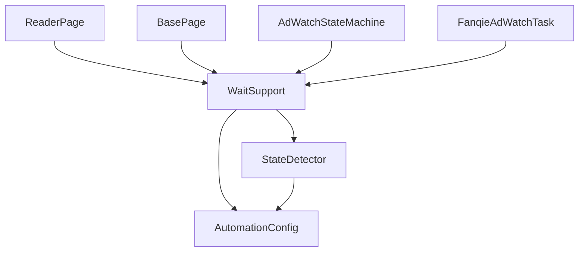
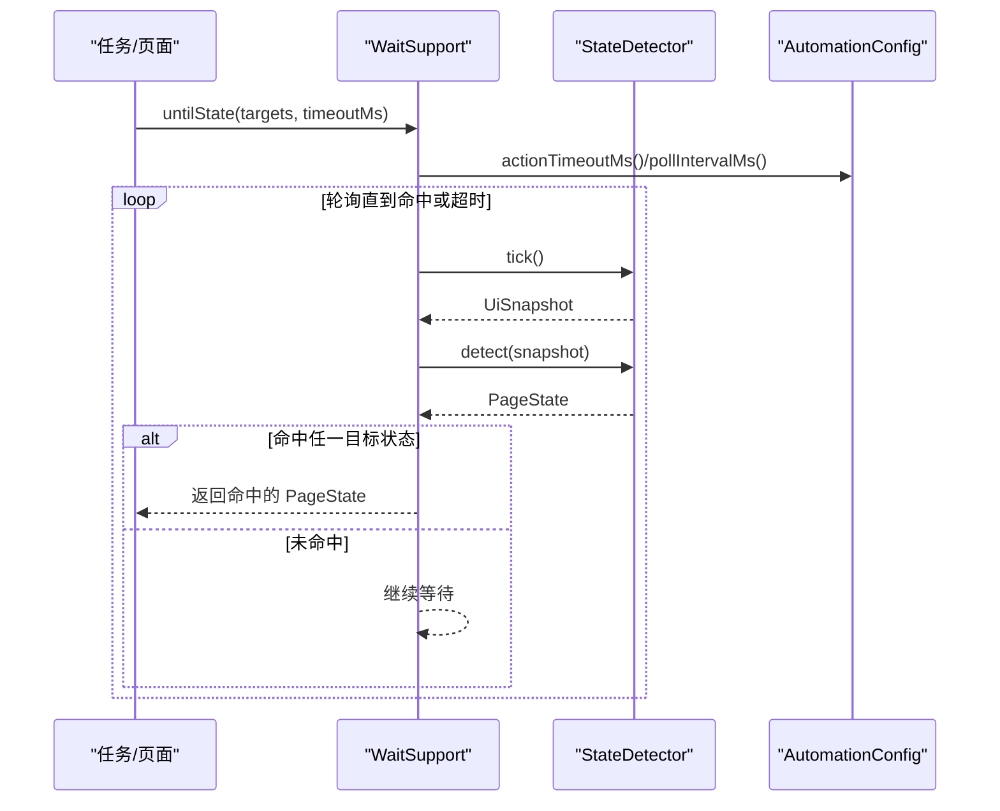
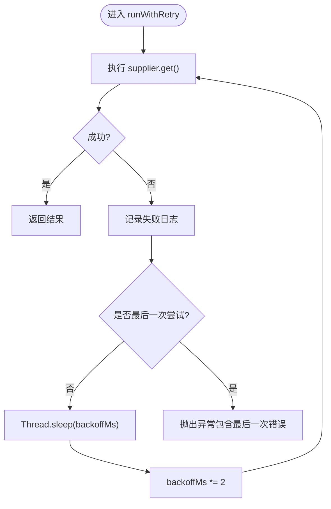
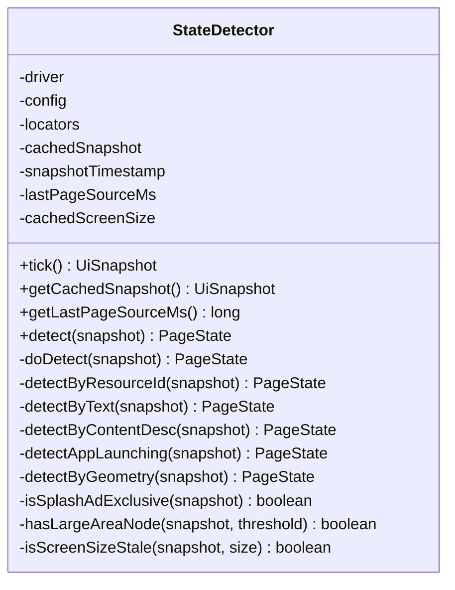
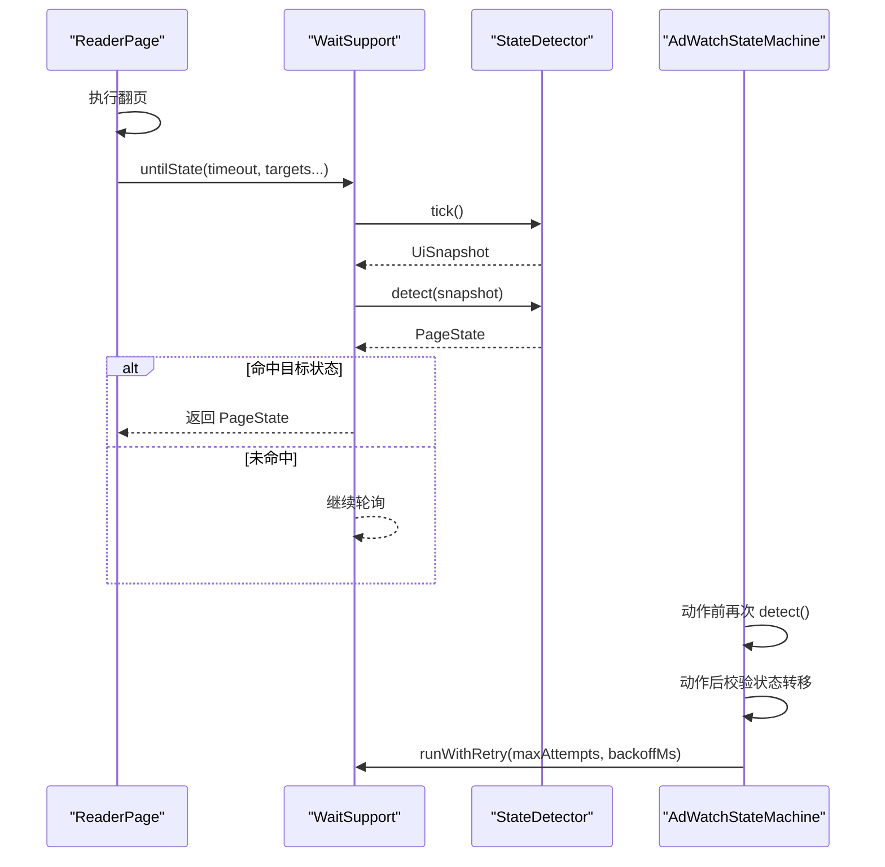
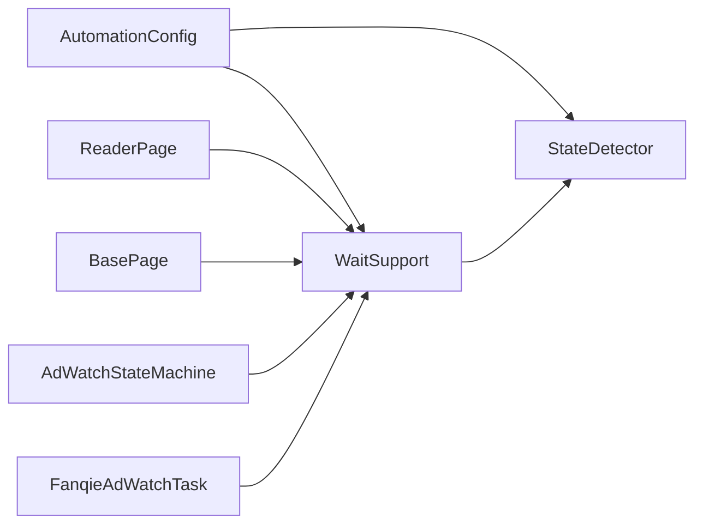

# 等待策略优化

<cite>
**本文引用的文件**
- [WaitSupport.java](file://automation/src/main/java/com/fanqie/auto/core/WaitSupport.java)
- [AutomationConfig.java](file://automation/src/main/java/com/fanqie/auto/config/AutomationConfig.java)
- [StateDetector.java](file://automation/src/main/java/com/fanqie/auto/core/StateDetector.java)
- [BasePage.java](file://automation/src/main/java/com/fanqie/auto/page/BasePage.java)
- [ReaderPage.java](file://automation/src/main/java/com/fanqie/auto/page/ReaderPage.java)
- [AdWatchStateMachine.java](file://automation/src/main/java/com/fanqie/auto/task/AdWatchStateMachine.java)
- [FanqieAdWatchTask.java](file://automation/src/main/java/com/fanqie/auto/task/FanqieAdWatchTask.java)
</cite>

## 目录
1. [简介](#简介)
2. [项目结构](#项目结构)
3. [核心组件](#核心组件)
4. [架构总览](#架构总览)
5. [详细组件分析](#详细组件分析)
6. [依赖关系分析](#依赖关系分析)
7. [性能考量](#性能考量)
8. [故障排查指南](#故障排查指南)
9. [结论](#结论)
10. [附录](#附录)

## 简介
本文件聚焦于自动化流程中的“等待策略优化”，围绕 WaitSupport 组件展开，系统阐述智能等待机制、多状态同时等待、指数退避重试等关键能力；并给出超时时间、轮询间隔、最大尝试次数等参数的合理设置建议与最佳实践。目标是帮助开发者避免使用 Thread.sleep，提升稳定性与性能，减少 UI 动态加载带来的不稳定因素，并提供可观测指标与调试技巧以定位等待瓶颈。

## 项目结构
- 等待原语集中在 WaitSupport，统一封装 WebDriverWait，提供 untilState、untilStateGone、untilAnyTextPresent、untilSnapshotMatches、runWithRetry 等方法。
- 配置集中由 AutomationConfig 管理，所有超时、轮询间隔、最大停留时长等参数均从此处读取，避免魔法数字。
- 状态识别由 StateDetector 完成，采用 tick + detect 模式：一次抓取 UI 树快照，纯内存匹配，避免多次 RPC。
- 页面交互在 BasePage/ReaderPage 等页面对象中实现，通过 WaitSupport 进行等待与重试。
- 业务编排位于 AdWatchStateMachine/FanqieAdWatchTask，组合上述组件形成完整流程。

图表来源
- [WaitSupport.java:56-183](file://automation/src/main/java/com/fanqie/auto/core/WaitSupport.java#L56-L183)
- [StateDetector.java:97-170](file://automation/src/main/java/com/fanqie/auto/core/StateDetector.java#L97-L170)
- [AutomationConfig.java:182-208](file://automation/src/main/java/com/fanqie/auto/config/AutomationConfig.java#L182-L208)

章节来源
- [WaitSupport.java:16-25](file://automation/src/main/java/com/fanqie/auto/core/WaitSupport.java#L16-L25)
- [AutomationConfig.java:10-17](file://automation/src/main/java/com/fanqie/auto/config/AutomationConfig.java#L10-L17)

## 核心组件
- WaitSupport：统一等待原语，基于显式等待，支持多目标状态同时等待、状态消失等待、文案出现等待、自定义条件等待以及幂等重试（指数退避）。
- StateDetector：高性能状态识别器，tick() 仅一次抓取 UI 树并缓存，detect() 纯内存按优先级匹配，避免 O(状态数) 次 RPC。
- AutomationConfig：全局时序与流程配置，包括轮询间隔、动作超时、应用启动超时、广告视频超时、最大状态停留时长等。
- BasePage/ReaderPage：页面对象，结合 WaitSupport 执行翻页、点击等操作，并在失败时走恢复或重试。
- AdWatchStateMachine/FanqieAdWatchTask：业务流程编排，组合等待、检测、手势与恢复逻辑，保证整体鲁棒性。

章节来源
- [WaitSupport.java:56-183](file://automation/src/main/java/com/fanqie/auto/core/WaitSupport.java#L56-L183)
- [StateDetector.java:12-28](file://automation/src/main/java/com/fanqie/auto/core/StateDetector.java#L12-L28)
- [AutomationConfig.java:182-208](file://automation/src/main/java/com/fanqie/auto/config/AutomationConfig.java#L182-L208)
- [BasePage.java:18-39](file://automation/src/main/java/com/fanqie/auto/page/BasePage.java#L18-L39)
- [ReaderPage.java:82-112](file://automation/src/main/java/com/fanqie/auto/page/ReaderPage.java#L82-L112)
- [AdWatchStateMachine.java:58-77](file://automation/src/main/java/com/fanqie/auto/task/AdWatchStateMachine.java#L58-L77)
- [FanqieAdWatchTask.java:472-506](file://automation/src/main/java/com/fanqie/auto/task/FanqieAdWatchTask.java#L472-L506)

## 架构总览
WaitSupport 作为等待层，向上为各页面与任务提供统一的等待与重试能力；向下依赖 StateDetector 获取当前状态与快照，依赖 AutomationConfig 获取时序参数。页面操作（如翻页）后，通过 untilState 一次性覆盖多个可能状态，确保即使触发广告弹窗也能稳定收敛到预期状态。

图表来源
- [WaitSupport.java:67-86](file://automation/src/main/java/com/fanqie/auto/core/WaitSupport.java#L67-L86)
- [StateDetector.java:97-170](file://automation/src/main/java/com/fanqie/auto/core/StateDetector.java#L97-L170)
- [AutomationConfig.java:182-192](file://automation/src/main/java/com/fanqie/auto/config/AutomationConfig.java#L182-L192)

## 详细组件分析

### WaitSupport 等待原语与指数退避
- 多状态同时等待：untilState 支持传入多个目标状态，命中任一即返回，适用于翻页后可能直接触发广告弹窗的场景。
- 状态消失等待：untilStateGone 用于等待某状态结束（如广告播放、应用启动），默认使用最大状态停留时长作为超时。
- 文案出现等待：untilAnyTextPresent 等待 UI 树中出现候选文案之一，适合等待按钮/文本出现。
- 自定义条件等待：untilSnapshotMatches 允许上层定义复杂条件，通用性强。
- 指数退避重试：runWithRetry 对幂等操作进行失败重试，首次退避 backoffMs，后续翻倍，避免瞬时竞争导致的偶发失败。

图表来源
- [WaitSupport.java:199-222](file://automation/src/main/java/com/fanqie/auto/core/WaitSupport.java#L199-L222)

章节来源
- [WaitSupport.java:56-183](file://automation/src/main/java/com/fanqie/auto/core/WaitSupport.java#L56-L183)
- [WaitSupport.java:199-232](file://automation/src/main/java/com/fanqie/auto/core/WaitSupport.java#L199-L232)

### StateDetector 性能核心与智能识别
- tick() 只做一次 driver.getPageSource()，构造 UiSnapshot 并缓存，同一 tick 内多次 detect() 复用快照，杜绝重复抓取。
- detect() 纯内存匹配，按优先级顺序：resource-id 锚点 → text 候选集 → content-desc 候选集 → APP_LAUNCHING 保守判定 → 几何特征 → UNKNOWN。
- 屏幕尺寸缓存与自愈：首次获取屏幕尺寸并缓存，若检测到节点越界则自动重取，避免横屏/折叠屏旋转导致比例判定失真。
- 开屏广告排他判定：SPLASH_AD 需满足全屏大面积且无右上角关闭 clickable，避免与激励视频关闭页混淆。

图表来源
- [StateDetector.java:29-49](file://automation/src/main/java/com/fanqie/auto/core/StateDetector.java#L29-L49)
- [StateDetector.java:97-170](file://automation/src/main/java/com/fanqie/auto/core/StateDetector.java#L97-L170)
- [StateDetector.java:183-208](file://automation/src/main/java/com/fanqie/auto/core/StateDetector.java#L183-L208)
- [StateDetector.java:218-334](file://automation/src/main/java/com/fanqie/auto/core/StateDetector.java#L218-L334)
- [StateDetector.java:359-418](file://automation/src/main/java/com/fanqie/auto/core/StateDetector.java#L359-L418)
- [StateDetector.java:420-459](file://automation/src/main/java/com/fanqie/auto/core/StateDetector.java#L420-L459)

章节来源
- [StateDetector.java:12-28](file://automation/src/main/java/com/fanqie/auto/core/StateDetector.java#L12-L28)
- [StateDetector.java:97-170](file://automation/src/main/java/com/fanqie/auto/core/StateDetector.java#L97-L170)
- [StateDetector.java:183-208](file://automation/src/main/java/com/fanqie/auto/core/StateDetector.java#L183-L208)
- [StateDetector.java:218-334](file://automation/src/main/java/com/fanqie/auto/core/StateDetector.java#L218-L334)
- [StateDetector.java:359-418](file://automation/src/main/java/com/fanqie/auto/core/StateDetector.java#L359-L418)
- [StateDetector.java:420-459](file://automation/src/main/java/com/fanqie/auto/core/StateDetector.java#L420-L459)

### 页面交互与等待策略的结合
- ReaderPage 翻页后使用 untilState 一次性覆盖 READER、READER_MENU、AD_ENTRY_PROMPT、AD_CONFIRM_DIALOG、CHAPTER_END、COMMON_POPUP 等多个状态，防止因动画未完成或广告弹窗导致误判。
- BasePage 提供四级降级链定位与点击（语义属性→几何推断→时序兜底→系统兜底），并结合 WaitSupport 的等待与重试，提高鲁棒性。
- AdWatchStateMachine 在执行动作前重新 detect() 确认状态，动作后校验是否发生预期转移，未转移则计入失败并走 runWithRetry 退避重试。
- FanqieAdWatchTask 在广告子循环结束后尝试回到 READER，必要时走恢复流程。

图表来源
- [ReaderPage.java:82-112](file://automation/src/main/java/com/fanqie/auto/page/ReaderPage.java#L82-L112)
- [WaitSupport.java:67-86](file://automation/src/main/java/com/fanqie/auto/core/WaitSupport.java#L67-L86)
- [StateDetector.java:97-170](file://automation/src/main/java/com/fanqie/auto/core/StateDetector.java#L97-L170)
- [AdWatchStateMachine.java:236-260](file://automation/src/main/java/com/fanqie/auto/task/AdWatchStateMachine.java#L236-L260)

章节来源
- [ReaderPage.java:82-112](file://automation/src/main/java/com/fanqie/auto/page/ReaderPage.java#L82-L112)
- [BasePage.java:18-39](file://automation/src/main/java/com/fanqie/auto/page/BasePage.java#L18-L39)
- [AdWatchStateMachine.java:236-260](file://automation/src/main/java/com/fanqie/auto/task/AdWatchStateMachine.java#L236-L260)
- [FanqieAdWatchTask.java:472-506](file://automation/src/main/java/com/fanqie/auto/task/FanqieAdWatchTask.java#L472-L506)

## 依赖关系分析
- WaitSupport 依赖 AutomationConfig 获取时序参数，依赖 StateDetector 获取当前状态与快照。
- StateDetector 依赖 AutomationConfig 与 LocatorRegistry，但核心 detect() 路径不引用 driver，纯内存判定，降低 RPC 开销。
- 页面对象依赖 WaitSupport 进行等待与重试，依赖 GestureSupport 执行手势，依赖 RunLogger 输出心跳与指标。
- 任务编排依赖上述组件，形成“等待—检测—动作—重试”的闭环。

图表来源
- [WaitSupport.java:34-38](file://automation/src/main/java/com/fanqie/auto/core/WaitSupport.java#L34-L38)
- [StateDetector.java:50-54](file://automation/src/main/java/com/fanqie/auto/core/StateDetector.java#L50-L54)
- [AutomationConfig.java:182-208](file://automation/src/main/java/com/fanqie/auto/config/AutomationConfig.java#L182-L208)

章节来源
- [WaitSupport.java:34-38](file://automation/src/main/java/com/fanqie/auto/core/WaitSupport.java#L34-L38)
- [StateDetector.java:50-54](file://automation/src/main/java/com/fanqie/auto/core/StateDetector.java#L50-L54)
- [AutomationConfig.java:182-208](file://automation/src/main/java/com/fanqie/auto/config/AutomationConfig.java#L182-L208)

## 性能考量
- 避免 Thread.sleep：除指数退避重试外，全部使用 WebDriverWait 显式等待，避免阻塞式睡眠导致的不确定性与资源浪费。
- 单次抓取、多次复用：StateDetector.tick() 仅一次抓取 UI 树，同一 tick 内多次 detect() 复用快照，显著降低 RPC 开销。
- 纯内存匹配：detect() 基于 UiSnapshot 的内存节点表，避免逐个状态试 driver.findElement 的 O(状态数) 次 RPC。
- 屏幕尺寸缓存与自愈：首次获取屏幕尺寸并缓存，检测到节点越界时自动重取，避免横屏/折叠屏旋转导致比例判定失真。
- 多状态同时等待：untilState 一次性覆盖多个目标状态，减少多次等待与状态漂移风险。
- 指数退避重试：runWithRetry 对幂等操作进行失败重试，首次退避 backoffMs，后续翻倍，平衡成功率与耗时。

章节来源
- [WaitSupport.java:16-25](file://automation/src/main/java/com/fanqie/auto/core/WaitSupport.java#L16-L25)
- [StateDetector.java:12-28](file://automation/src/main/java/com/fanqie/auto/core/StateDetector.java#L12-L28)
- [StateDetector.java:97-127](file://automation/src/main/java/com/fanqie/auto/core/StateDetector.java#L97-L127)
- [StateDetector.java:183-208](file://automation/src/main/java/com/fanqie/auto/core/StateDetector.java#L183-L208)
- [WaitSupport.java:199-222](file://automation/src/main/java/com/fanqie/auto/core/WaitSupport.java#L199-L222)

## 故障排查指南
- 等待超时：检查 untilState/untilStateGone/untilAnyTextPresent/untilSnapshotMatches 的超时时间与轮询间隔是否合理；查看日志中“等待...超时”的提示。
- 状态识别偏差：关注 StateDetector 的 detect 日志，确认 resource-id/text/content-desc/几何特征的命中情况；必要时调整 LocatorRegistry 的候选集。
- 屏幕尺寸异常：若横屏/折叠屏旋转后比例判定失真，确认 StateDetector 的尺寸缓存是否失效并重取。
- 重试失败：检查 runWithRetry 的最大尝试次数与退避时间；若频繁失败，考虑扩大 backoffMs 或增加 maxAttempts。
- 页面漂移：在动作前后分别 detect() 确认状态，避免“点了已经消失的按钮”；未转移则走恢复流程。

章节来源
- [WaitSupport.java:81-86](file://automation/src/main/java/com/fanqie/auto/core/WaitSupport.java#L81-L86)
- [WaitSupport.java:115-118](file://automation/src/main/java/com/fanqie/auto/core/WaitSupport.java#L115-L118)
- [WaitSupport.java:147-150](file://automation/src/main/java/com/fanqie/auto/core/WaitSupport.java#L147-L150)
- [WaitSupport.java:179-182](file://automation/src/main/java/com/fanqie/auto/core/WaitSupport.java#L179-L182)
- [StateDetector.java:159-170](file://automation/src/main/java/com/fanqie/auto/core/StateDetector.java#L159-L170)
- [AdWatchStateMachine.java:236-260](file://automation/src/main/java/com/fanqie/auto/task/AdWatchStateMachine.java#L236-L260)

## 结论
WaitSupport 通过统一等待原语与指数退避重试，结合 StateDetector 的高性能状态识别与 AutomationConfig 的可配置时序参数，构建了稳定高效的等待策略体系。遵循“避免 Thread.sleep、多状态同时等待、合理配置超时与轮询间隔、幂等重试”的最佳实践，可显著提升自动化流程的鲁棒性与性能。配合可观测指标与调试技巧，能够快速定位并优化等待瓶颈。

## 附录

### 配置参数建议
- 轮询间隔（timing.poll.interval.ms）：默认 250ms，可根据设备性能与 UI 更新频率微调；过小会增加 CPU 与 RPC 压力，过大影响响应速度。
- 动作超时（timing.action.timeout.ms）：默认 8000ms，适用于一般页面操作；对于复杂翻页或广告流程可适当放宽。
- 应用启动超时（timing.app.launch.timeout.ms）：默认 30000ms，冷启动较慢的设备可适当增大。
- 广告视频超时（timing.ad.video.timeout.ms）：默认 45000ms，激励视频通常固定约 30 秒；若 SDK 变更或网络波动，可适度调整。
- 最大状态停留时长（timing.max.state.dwell.ms）：默认 90000ms，用于 untilStateGone 的默认超时；过长可能导致流程卡死，过短可能误判。
- 最大连续错误与恢复重试：flow.max.consecutive.errors 与 flow.max.recovery.retry 控制容错与恢复策略，避免无限重试。

章节来源
- [AutomationConfig.java:182-208](file://automation/src/main/java/com/fanqie/auto/config/AutomationConfig.java#L182-L208)
- [AutomationConfig.java:214-260](file://automation/src/main/java/com/fanqie/auto/config/AutomationConfig.java#L214-L260)

### 最佳实践清单
- 避免 Thread.sleep：除指数退避重试外，全部使用 WebDriverWait 显式等待。
- 合理使用 untilState：翻页后一次性覆盖多个可能状态，防止状态漂移与误判。
- 合理使用 untilStateGone：等待广告播放结束或应用启动完成，默认使用最大状态停留时长。
- 处理 UI 元素动态加载：使用 untilAnyTextPresent 或 untilSnapshotMatches 等待特定文案或条件满足。
- 幂等重试：对易受时序竞争影响的 UI 操作使用 runWithRetry，合理设置 backoffMs 与 maxAttempts。
- 可观测性：关注 StateDetector 的 detect 耗时与 getPageSource 耗时，结合 RunLogger 的心跳与指标进行监控。

章节来源
- [WaitSupport.java:56-183](file://automation/src/main/java/com/fanqie/auto/core/WaitSupport.java#L56-L183)
- [WaitSupport.java:199-232](file://automation/src/main/java/com/fanqie/auto/core/WaitSupport.java#L199-L232)
- [StateDetector.java:97-170](file://automation/src/main/java/com/fanqie/auto/core/StateDetector.java#L97-L170)