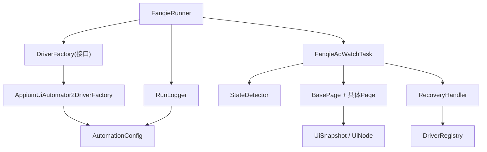
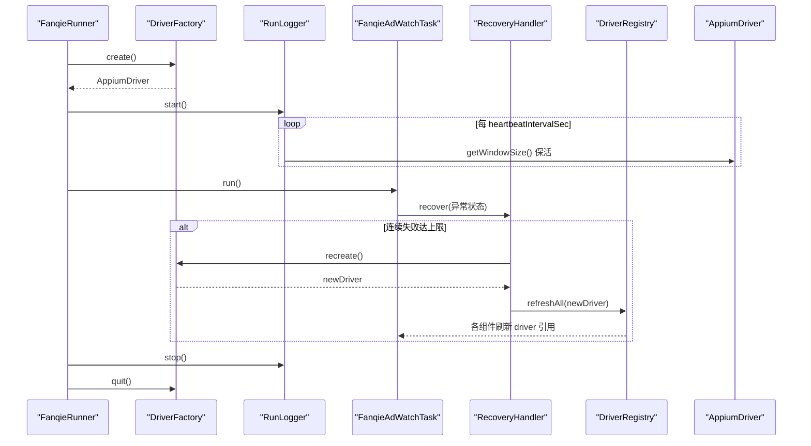
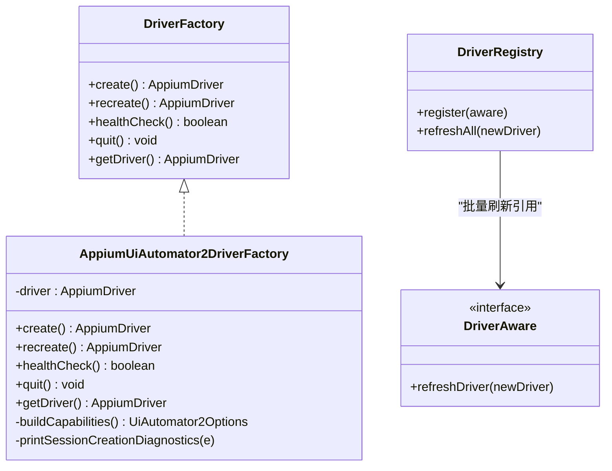
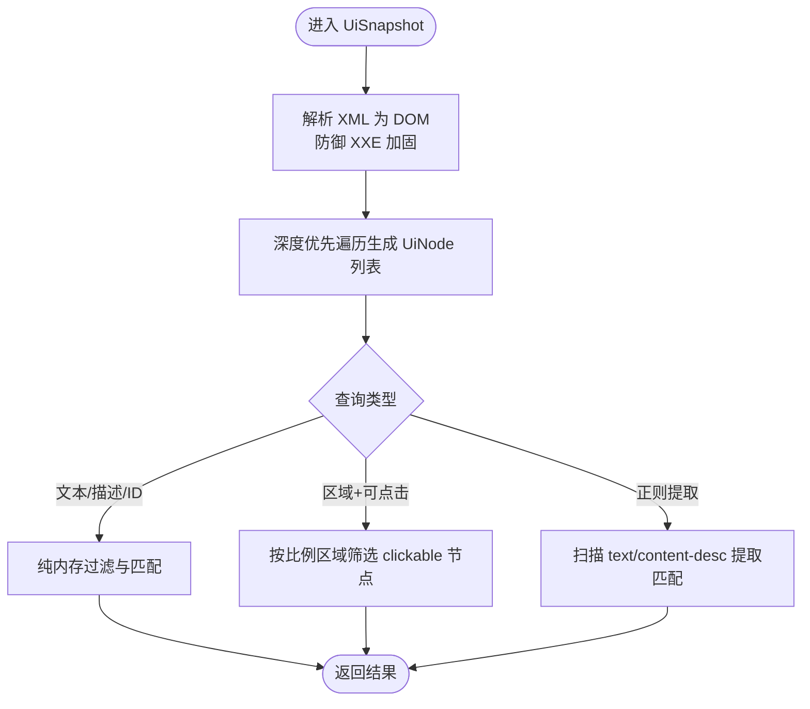
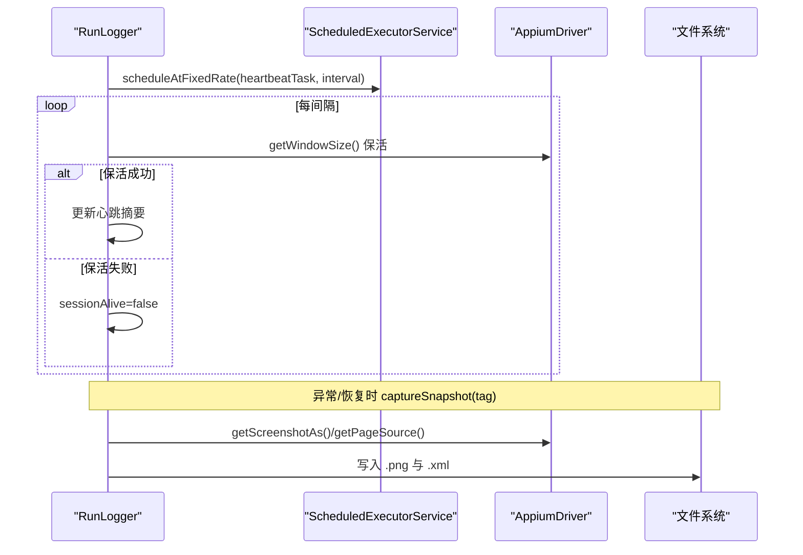
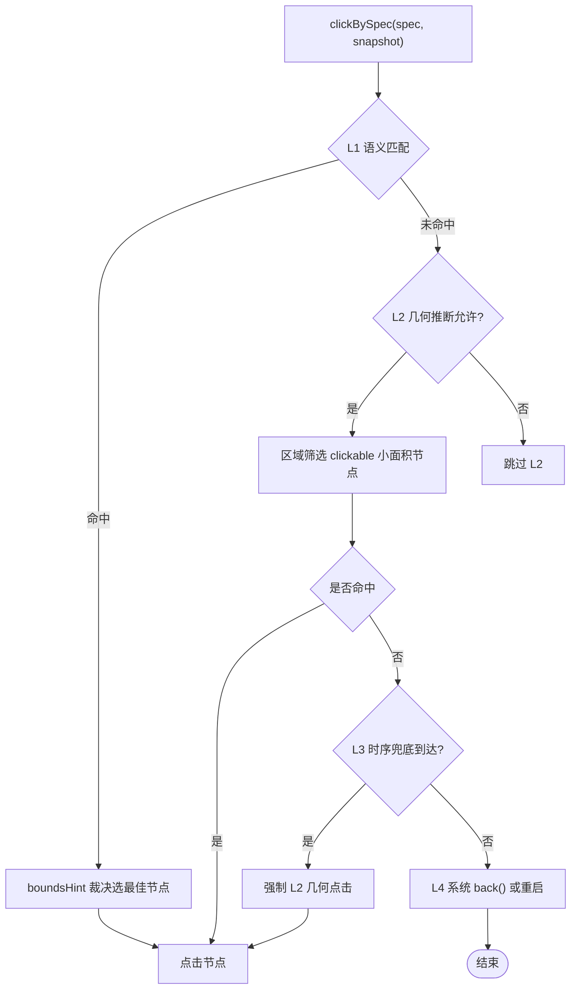
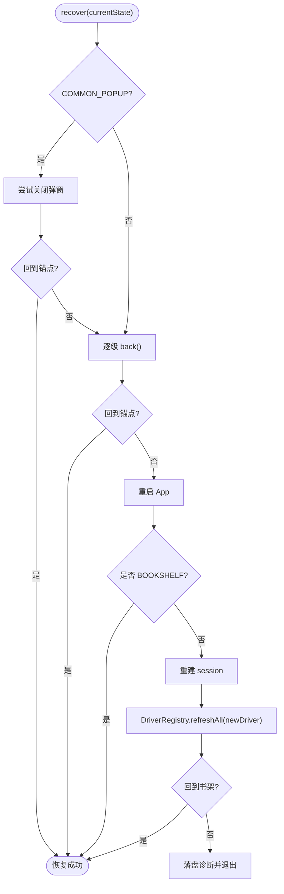
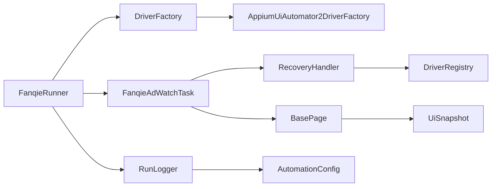

# 资源管理优化

<cite>
**本文引用的文件**
- [FanqieRunner.java](file://automation/src/main/java/com/fanqie/auto/FanqieRunner.java)
- [DriverFactory.java](file://automation/src/main/java/com/fanqie/auto/core/DriverFactory.java)
- [AppiumUiAutomator2DriverFactory.java](file://automation/src/main/java/com/fanqie/auto/core/AppiumUiAutomator2DriverFactory.java)
- [DriverRegistry.java](file://automation/src/main/java/com/fanqie/auto/core/DriverRegistry.java)
- [DriverAware.java](file://automation/src/main/java/com/fanqie/auto/core/DriverAware.java)
- [RunLogger.java](file://automation/src/main/java/com/fanqie/auto/core/RunLogger.java)
- [UiSnapshot.java](file://automation/src/main/java/com/fanqie/auto/core/UiSnapshot.java)
- [UiNode.java](file://automation/src/main/java/com/fanqie/auto/core/UiNode.java)
- [BasePage.java](file://automation/src/main/java/com/fanqie/auto/page/BasePage.java)
- [RecoveryHandler.java](file://automation/src/main/java/com/fanqie/auto/task/RecoveryHandler.java)
- [FanqieAdWatchTask.java](file://automation/src/main/java/com/fanqie/auto/task/FanqieAdWatchTask.java)
- [AutomationConfig.java](file://automation/src/main/java/com/fanqie/auto/config/AutomationConfig.java)
</cite>

## 目录
1. [引言](#引言)
2. [项目结构](#项目结构)
3. [核心组件](#核心组件)
4. [架构总览](#架构总览)
5. [详细组件分析](#详细组件分析)
6. [依赖关系分析](#依赖关系分析)
7. [性能与资源特性](#性能与资源特性)
8. [故障排查指南](#故障排查指南)
9. [结论](#结论)
10. [附录：配置项速查](#附录配置项速查)

## 引言
本指南面向大规模自动化执行中的资源消耗问题，聚焦内存泄漏防护、驱动会话管理、文件句柄释放等关键优化点。结合代码库实现，系统说明如何合理管理 AppiumDriver 实例、优化 UI 快照存储、控制日志输出大小，并提供并发执行的资源隔离方案（线程安全设计、连接复用、心跳保活）以及资源监控与诊断工具使用方法，帮助识别和解决资源瓶颈。

## 项目结构
该工程采用分层组织：
- 入口与装配：FanqieRunner 负责参数解析、组件装配、生命周期管理与优雅退出
- 驱动层：DriverFactory 抽象 + AppiumUiAutomator2DriverFactory 实现，封装 session 创建、重建、健康检查与退出
- 状态与页面：StateDetector、BasePage 及具体 Page，基于 UiSnapshot 的纯内存查询定位控件
- 任务编排：FanqieAdWatchTask 编排翻页与广告流程；RecoveryHandler 提供多级自愈
- 运行观测：RunLogger 提供心跳保活、截图与 XML 快照落盘、统计汇总
- 配置：AutomationConfig 集中加载超时、轮次、阈值等参数

图表来源
- [FanqieRunner.java:120-201](file://automation/src/main/java/com/fanqie/auto/FanqieRunner.java#L120-L201)
- [AppiumUiAutomator2DriverFactory.java:44-118](file://automation/src/main/java/com/fanqie/auto/core/AppiumUiAutomator2DriverFactory.java#L44-L118)
- [RunLogger.java:87-156](file://automation/src/main/java/com/fanqie/auto/core/RunLogger.java#L87-L156)
- [FanqieAdWatchTask.java:99-314](file://automation/src/main/java/com/fanqie/auto/task/FanqieAdWatchTask.java#L99-L314)
- [RecoveryHandler.java:100-253](file://automation/src/main/java/com/fanqie/auto/task/RecoveryHandler.java#L100-L253)
- [AutomationConfig.java:112-178](file://automation/src/main/java/com/fanqie/auto/config/AutomationConfig.java#L112-L178)

章节来源
- [FanqieRunner.java:41-238](file://automation/src/main/java/com/fanqie/auto/FanqieRunner.java#L41-L238)

## 核心组件
- DriverFactory 与实现：统一创建/重建/销毁 AppiumDriver，屏蔽底层差异，确保资源生命周期可控
- DriverRegistry + DriverAware：session 重建后批量刷新所有持有 driver 的组件引用，避免旧引用导致异常
- RunLogger：独立心跳线程保活 session，落盘截图与 XML，统计运行指标，提供最终报告
- UiSnapshot + UiNode：一次 getPageSource() 构建内存快照，后续全部为纯内存查询，零 RPC，降低网络与内存抖动
- BasePage：四级定位降级链（语义→几何→时序→系统），点击基于实时 bounds，天然免疫 stale element
- RecoveryHandler：五级自愈策略，从弹窗关闭到重建 session，失败时保留现场并标记会话死亡
- FanqieAdWatchTask：业务编排，翻页与广告子循环，多书轮换，墙钟熔断与配额保护
- AutomationConfig：集中化配置，所有超时、轮次、阈值可外部覆盖，避免魔法数字

章节来源
- [DriverFactory.java:17-54](file://automation/src/main/java/com/fanqie/auto/core/DriverFactory.java#L17-L54)
- [AppiumUiAutomator2DriverFactory.java:120-178](file://automation/src/main/java/com/fanqie/auto/core/AppiumUiAutomator2DriverFactory.java#L120-L178)
- [DriverRegistry.java:19-56](file://automation/src/main/java/com/fanqie/auto/core/DriverRegistry.java#L19-L56)
- [DriverAware.java:12-20](file://automation/src/main/java/com/fanqie/auto/core/DriverAware.java#L12-L20)
- [RunLogger.java:31-156](file://automation/src/main/java/com/fanqie/auto/core/RunLogger.java#L31-L156)
- [UiSnapshot.java:21-98](file://automation/src/main/java/com/fanqie/auto/core/UiSnapshot.java#L21-L98)
- [UiNode.java:13-44](file://automation/src/main/java/com/fanqie/auto/core/UiNode.java#L13-L44)
- [BasePage.java:18-250](file://automation/src/main/java/com/fanqie/auto/page/BasePage.java#L18-L250)
- [RecoveryHandler.java:23-253](file://automation/src/main/java/com/fanqie/auto/task/RecoveryHandler.java#L23-L253)
- [FanqieAdWatchTask.java:20-314](file://automation/src/main/java/com/fanqie/auto/task/FanqieAdWatchTask.java#L20-L314)
- [AutomationConfig.java:18-178](file://automation/src/main/java/com/fanqie/auto/config/AutomationConfig.java#L18-L178)

## 架构总览
下图展示资源管理的关键路径：Runner 装配组件，DriverFactory 管理 session，RunLogger 心跳保活与落盘，RecoveryHandler 在异常时重建 session 并通过 DriverRegistry 刷新引用，UiSnapshot 将 UI 树驻留内存供多次查询。

图表来源
- [FanqieRunner.java:127-238](file://automation/src/main/java/com/fanqie/auto/FanqieRunner.java#L127-L238)
- [AppiumUiAutomator2DriverFactory.java:78-118](file://automation/src/main/java/com/fanqie/auto/core/AppiumUiAutomator2DriverFactory.java#L78-L118)
- [RunLogger.java:144-197](file://automation/src/main/java/com/fanqie/auto/core/RunLogger.java#L144-L197)
- [RecoveryHandler.java:212-253](file://automation/src/main/java/com/fanqie/auto/task/RecoveryHandler.java#L212-L253)
- [DriverRegistry.java:43-56](file://automation/src/main/java/com/fanqie/auto/core/DriverRegistry.java#L43-L56)

## 详细组件分析

### 驱动会话管理（AppiumDriver）
- 创建与初始化
  - 通过 DriverFactory.create() 创建 AndroidDriver，立即设置隐式等待为零，避免未命中查找阻塞短轮询
  - 使用 noReset=true 保持登录态与书架数据，适合长任务
  - 针对华为/鸿蒙设备设置额外 capability，提升稳定性
- 健康检查与保活
  - healthCheck() 用轻量命令探测 session 有效性
  - RunLogger 启动独立 daemon 线程周期性调用 getWindowSize() 保活，防止长静默期断连
- 重建与刷新
  - RecoveryHandler 在连续失败达到阈值时调用 recreate()，随后通过 DriverRegistry.refreshAll() 批量刷新所有 DriverAware 组件的 driver 引用，避免 NoSuchSessionException
- 退出与释放
  - FanqieRunner 在 finally 与 ShutdownHook 中调用 logger.stop() 与 driverFactory.quit()，确保幂等释放
  - AppiumUiAutomator2DriverFactory.quit() 捕获异常并置空 driver，避免重复退出抛异常

图表来源
- [DriverFactory.java:17-54](file://automation/src/main/java/com/fanqie/auto/core/DriverFactory.java#L17-L54)
- [AppiumUiAutomator2DriverFactory.java:33-118](file://automation/src/main/java/com/fanqie/auto/core/AppiumUiAutomator2DriverFactory.java#L33-L118)
- [DriverRegistry.java:19-56](file://automation/src/main/java/com/fanqie/auto/core/DriverRegistry.java#L19-L56)
- [DriverAware.java:12-20](file://automation/src/main/java/com/fanqie/auto/core/DriverAware.java#L12-L20)

章节来源
- [AppiumUiAutomator2DriverFactory.java:44-118](file://automation/src/main/java/com/fanqie/auto/core/AppiumUiAutomator2DriverFactory.java#L44-L118)
- [RecoveryHandler.java:212-253](file://automation/src/main/java/com/fanqie/auto/task/RecoveryHandler.java#L212-L253)
- [FanqieRunner.java:127-238](file://automation/src/main/java/com/fanqie/auto/FanqieRunner.java#L127-L238)

### UI 快照与内存优化（UiSnapshot / UiNode）
- 一次性抓取与解析
  - 构造时调用 getPageSource() 并解析为 DOM，深度优先遍历生成不可变 List<UiNode>
  - 防御 XXE，DocumentBuilderFactory 每次新建实例，非线程安全但仅用于单次解析
- 纯内存查询
  - findByTextContains、findByContentDescContains、findByResourceId、findClickableInRegion、extractByRegex 等均为内存操作，零 RPC
  - nearestClickableAncestor 支持回溯可点击祖先，提高点击成功率
- 健壮性
  - 解析失败返回空快照并标记 parseFailed，上层走 UNKNOWN 分支，不中断流程
  - Rect 解析对畸形 bounds 安全处理，避免异常传播

图表来源
- [UiSnapshot.java:52-98](file://automation/src/main/java/com/fanqie/auto/core/UiSnapshot.java#L52-L98)
- [UiSnapshot.java:131-228](file://automation/src/main/java/com/fanqie/auto/core/UiSnapshot.java#L131-L228)
- [UiNode.java:85-218](file://automation/src/main/java/com/fanqie/auto/core/UiNode.java#L85-L218)

章节来源
- [UiSnapshot.java:21-98](file://automation/src/main/java/com/fanqie/auto/core/UiSnapshot.java#L21-L98)
- [UiSnapshot.java:131-228](file://automation/src/main/java/com/fanqie/auto/core/UiSnapshot.java#L131-L228)
- [UiNode.java:13-44](file://automation/src/main/java/com/fanqie/auto/core/UiNode.java#L13-L44)

### 日志与文件句柄管理（RunLogger）
- 心跳保活
  - 独立 daemon 线程每 heartbeat.interval.sec 秒执行轻量保活，内部吞异常，绝不让调度线程被杀
  - 保活失败时标记 sessionAlive=false，供上层感知
- 落盘与快照
  - 日志写入 automation/logs/run-<时间戳>.log，UTF-8 编码
  - 异常或恢复时保存截图与 XML 到 snapshots 目录，便于取证
  - XML 长度异常膨胀预警（默认 1MB），提示可能存在 UI 树泄漏
- 生命周期
  - stop() 幂等：取消调度、关闭文件写入器、输出统计
  - captureSnapshot(driver==null) 短路安全，不会抛异常

图表来源
- [RunLogger.java:87-156](file://automation/src/main/java/com/fanqie/auto/core/RunLogger.java#L87-L156)
- [RunLogger.java:162-197](file://automation/src/main/java/com/fanqie/auto/core/RunLogger.java#L162-L197)
- [RunLogger.java:239-261](file://automation/src/main/java/com/fanqie/auto/core/RunLogger.java#L239-L261)
- [RunLogger.java:284-307](file://automation/src/main/java/com/fanqie/auto/core/RunLogger.java#L284-L307)

章节来源
- [RunLogger.java:31-156](file://automation/src/main/java/com/fanqie/auto/core/RunLogger.java#L31-L156)
- [RunLogger.java:162-197](file://automation/src/main/java/com/fanqie/auto/core/RunLogger.java#L162-L197)
- [RunLogger.java:239-261](file://automation/src/main/java/com/fanqie/auto/core/RunLogger.java#L239-L261)
- [RunLogger.java:284-307](file://automation/src/main/java/com/fanqie/auto/core/RunLogger.java#L284-L307)

### 页面定位与点击（BasePage）
- 四级降级链
  - L1 语义属性匹配：text → content-desc → resource-id，命中多个时用 boundsHint 裁决
  - L2 结构化几何推断：在指定区域内筛选 clickable 且面积占比小的节点（受 allowGeometryFallback 约束）
  - L3 时序兜底：达到 adVideoTimeoutMs 后强制执行 L2 几何点击
  - L4 系统兜底：navigate().back() 或重启 App
- 点击策略
  - 基于 UiNode.bounds 中心坐标点击，若节点不可点击则回溯至最近可点击祖先
  - 天然免疫 stale element，因为每次点击基于最新快照坐标

图表来源
- [BasePage.java:77-250](file://automation/src/main/java/com/fanqie/auto/page/BasePage.java#L77-L250)
- [BasePage.java:300-336](file://automation/src/main/java/com/fanqie/auto/page/BasePage.java#L300-L336)

章节来源
- [BasePage.java:18-250](file://automation/src/main/java/com/fanqie/auto/page/BasePage.java#L18-L250)
- [BasePage.java:300-336](file://automation/src/main/java/com/fanqie/auto/page/BasePage.java#L300-L336)

### 自愈与资源恢复（RecoveryHandler）
- 五级恢复
  - 第1级：COMMON_POPUP 按候选文案由弱到强关闭
  - 第2级：逐级 back() 并检测锚点
  - 第3级：重启 App
  - 第4级：导航到书架
  - 第5级：重建 session 并刷新所有组件 driver 引用
- 失败兜底
  - 记录错误分布、落盘快照、标记 session 死亡，避免盲目连点

图表来源
- [RecoveryHandler.java:100-253](file://automation/src/main/java/com/fanqie/auto/task/RecoveryHandler.java#L100-L253)
- [DriverRegistry.java:43-56](file://automation/src/main/java/com/fanqie/auto/core/DriverRegistry.java#L43-L56)

章节来源
- [RecoveryHandler.java:23-253](file://automation/src/main/java/com/fanqie/auto/task/RecoveryHandler.java#L23-L253)

### 任务编排与资源预算（FanqieAdWatchTask）
- 翻页与广告子循环
  - 翻页后根据状态决策：正常阅读、广告流程、章节末尾、异常状态
- 多书轮换与熔断
  - 单书广告轮次达上限且全局目标未达成时轮换书籍
  - 墙钟时间预算耗尽优雅收尾，每日配额耗尽优雅收尾
- 资源保护
  - 避免破坏“子循环后必在 READER”不变量，必要时触发恢复

章节来源
- [FanqieAdWatchTask.java:99-314](file://automation/src/main/java/com/fanqie/auto/task/FanqieAdWatchTask.java#L99-L314)

## 依赖关系分析
- 低耦合高内聚
  - DriverFactory 抽象屏蔽底层差异，上层仅依赖接口
  - DriverRegistry 集中管理 DriverAware 组件刷新，解耦 session 重建与组件更新
- 线程安全
  - DriverRegistry 使用 CopyOnWriteArrayList 保证注册与遍历的线程安全
  - RunLogger 心跳线程独立，异常吞没不影响主流程
- 外部依赖
  - Appium Java Client 与 Selenium WebDriver 用于驱动交互
  - SLF4J 用于日志输出

图表来源
- [FanqieRunner.java:120-201](file://automation/src/main/java/com/fanqie/auto/FanqieRunner.java#L120-L201)
- [RecoveryHandler.java:100-253](file://automation/src/main/java/com/fanqie/auto/task/RecoveryHandler.java#L100-L253)
- [DriverRegistry.java:19-56](file://automation/src/main/java/com/fanqie/auto/core/DriverRegistry.java#L19-L56)

章节来源
- [FanqieRunner.java:120-201](file://automation/src/main/java/com/fanqie/auto/FanqieRunner.java#L120-L201)
- [RecoveryHandler.java:100-253](file://automation/src/main/java/com/fanqie/auto/task/RecoveryHandler.java#L100-L253)

## 性能与资源特性
- 内存优化
  - UiSnapshot 一次抓取、多次内存查询，减少 RPC 与对象创建开销
  - UiNode 不可变设计，线程安全共享
- 网络与连接复用
  - 通过 DriverFactory 复用单一 AppiumDriver 会话，避免频繁创建销毁
  - 心跳保活维持连接活性，避免长静默期断连
- 文件句柄管理
  - RunLogger 使用 PrintWriter 写入日志，stop() 中显式关闭
  - 快照落盘使用 Files.copy/Files.write，异常时捕获并记录
- 超时与阈值
  - 所有超时、轮次、阈值集中在 AutomationConfig，便于调优与外部覆盖
  - 隐式等待设为零，避免未命中查找阻塞短轮询

章节来源
- [UiSnapshot.java:21-98](file://automation/src/main/java/com/fanqie/auto/core/UiSnapshot.java#L21-L98)
- [AppiumUiAutomator2DriverFactory.java:61-67](file://automation/src/main/java/com/fanqie/auto/core/AppiumUiAutomator2DriverFactory.java#L61-L67)
- [RunLogger.java:108-118](file://automation/src/main/java/com/fanqie/auto/core/RunLogger.java#L108-L118)
- [AutomationConfig.java:180-212](file://automation/src/main/java/com/fanqie/auto/config/AutomationConfig.java#L180-L212)

## 故障排查指南
- Session 创建失败
  - 查看定向中文诊断信息，逐项核对设备设置、USB 调试、Appium Server 状态
- Session 断开
  - RunLogger 心跳失败会标记 sessionAlive=false，上层可据此触发恢复或重建
- 资源泄漏
  - 关注 XML 体积异常膨胀预警（默认 1MB），可能指示 UI 树泄漏
  - 确认 finally 与 ShutdownHook 均调用 logger.stop() 与 driverFactory.quit()
- 恢复失败
  - RecoveryHandler 超过 maxRecoveryRetry 停止并保留现场，查看 snapshots 目录取证
  - 检查 errorDistribution 统计，定位高频异常类型

章节来源
- [AppiumUiAutomator2DriverFactory.java:180-208](file://automation/src/main/java/com/fanqie/auto/core/AppiumUiAutomator2DriverFactory.java#L180-L208)
- [RunLogger.java:162-197](file://automation/src/main/java/com/fanqie/auto/core/RunLogger.java#L162-L197)
- [RecoveryHandler.java:246-253](file://automation/src/main/java/com/fanqie/auto/task/RecoveryHandler.java#L246-L253)

## 结论
该工程通过 DriverFactory 抽象、DriverRegistry 批量刷新、RunLogger 心跳保活与落盘、UiSnapshot 纯内存查询、BasePage 四级定位降级、RecoveryHandler 五级自愈等设计，构建了稳健的资源管理体系。配合 AutomationConfig 集中化配置与 FanqieAdWatchTask 的任务编排与熔断保护，能够在大规模自动化执行中有效避免内存泄漏、会话泄漏与文件句柄泄漏，并提供完善的监控与诊断能力。建议在生产环境中持续观察 XML 体积、心跳成功率与恢复次数，结合配置调优以平衡稳定性与性能。

## 附录：配置项速查
- Appium 相关
  - appium.server.url、platform.name、automation.name、device.udid、app.package
  - no.reset、new.command.timeout.sec、uia2.server.launch.timeout.ms、uia2.server.install.timeout.ms
  - skip.server.installation、skip.device.initialization、keep.screen.on
- 时序相关
  - poll.interval.ms、state.detect.timeout.ms、action.timeout.ms、app.launch.timeout.ms
  - ad.video.timeout.ms、ad.close.ready.timeout.ms、max.state.dwell.ms、heartbeat.interval.sec
- 流程相关
  - pages.per.cycle、max.ad.rounds.per.entry、max.total.ad.rounds、target.free.minutes
  - reward.fallback.minutes、max.wall.clock.ms、outer.cycles、max.consecutive.errors、max.recovery.retry
- 阅读器相关
  - turn.strategy、next.tap.ratio.x/y、prev.tap.ratio.x/y、swipe.percent、swipe.duration.ms
- 验证与调试
  - verify.page.turned.by.screenshot、dry.run

章节来源
- [AutomationConfig.java:112-212](file://automation/src/main/java/com/fanqie/auto/config/AutomationConfig.java#L112-L212)
- [AutomationConfig.java:214-306](file://automation/src/main/java/com/fanqie/auto/config/AutomationConfig.java#L214-L306)