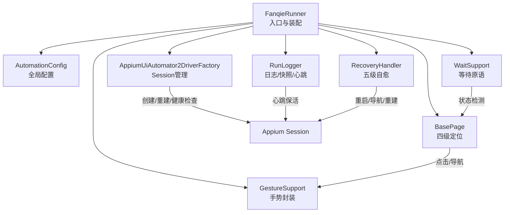
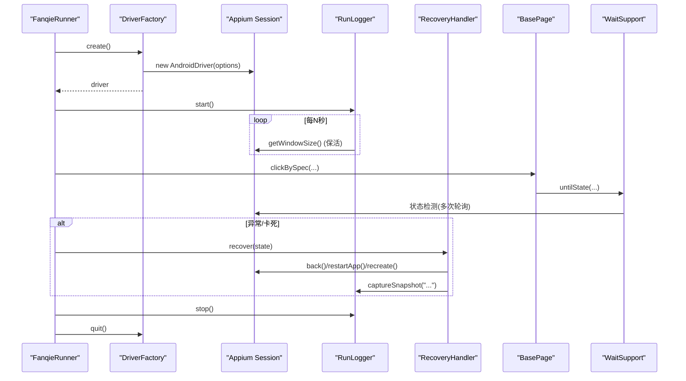
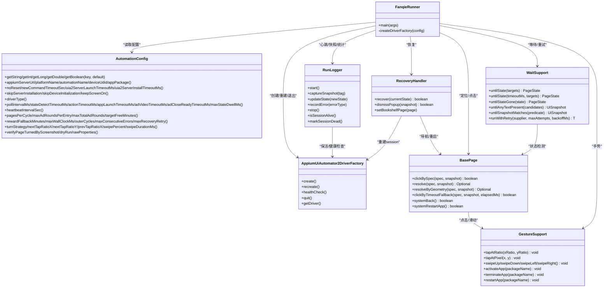

# 故障排除

<cite>
**本文引用的文件**
- [FanqieRunner.java](file://automation/src/main/java/com/fanqie/auto/FanqieRunner.java)
- [RunLogger.java](file://automation/src/main/java/com/fanqie/auto/core/RunLogger.java)
- [AppiumUiAutomator2DriverFactory.java](file://automation/src/main/java/com/fanqie/auto/core/AppiumUiAutomator2DriverFactory.java)
- [AutomationConfig.java](file://automation/src/main/java/com/fanqie/auto/config/AutomationConfig.java)
- [RecoveryHandler.java](file://automation/src/main/java/com/fanqie/auto/task/RecoveryHandler.java)
- [EnvDoctor.java](file://automation/src/main/java/com/fanqie/auto/core/EnvDoctor.java)
- [BasePage.java](file://automation/src/main/java/com/fanqie/auto/page/BasePage.java)
- [WaitSupport.java](file://automation/src/main/java/com/fanqie/auto/core/WaitSupport.java)
- [GestureSupport.java](file://automation/src/main/java/com/fanqie/auto/core/GestureSupport.java)
</cite>

## 目录
1. [简介](#简介)
2. [项目结构](#项目结构)
3. [核心组件](#核心组件)
4. [架构总览](#架构总览)
5. [详细组件分析](#详细组件分析)
6. [依赖关系分析](#依赖关系分析)
7. [性能注意事项](#性能注意事项)
8. [故障排除指南](#故障排除指南)
9. [结论](#结论)
10. [附录](#附录)

## 简介
本指南面向使用“番茄免费小说”UI自动化脚本的开发者与运维人员，目标是快速定位并解决问题。内容覆盖设备连接问题、Appium服务异常、UI元素定位失败等常见问题；提供日志分析方法（级别、格式、关键信息提取）；介绍调试技巧（UI快照分析、网络请求监控、性能分析）；给出错误代码对照表与修复建议；包含性能优化建议与最佳实践；说明如何收集诊断信息与提交问题报告。

## 项目结构
本项目采用分层与职责分离的设计：
- 入口与装配：FanqieRunner 负责参数解析、环境自检、组件装配、任务执行与优雅退出。
- 配置中心：AutomationConfig 集中管理所有超时、轮次、阈值与开关。
- 驱动层：AppiumUiAutomator2DriverFactory 封装 Appium session 创建、健康检查、重建与退出。
- 运行观测：RunLogger 提供心跳保活、日志落盘、截图与XML快照、统计汇总。
- 恢复机制：RecoveryHandler 实现五级自愈策略，保证任意步失败回到已知锚点。
- UI交互：BasePage 提供四级定位降级链（语义→几何→时序→系统），统一点击与导航。
- 等待原语：WaitSupport 提供状态等待、文案出现等待、条件等待与指数退避重试。
- 手势封装：GestureSupport 提供比例坐标点击、滑动、应用生命周期操作。

图表来源
- [FanqieRunner.java:41-238](file://automation/src/main/java/com/fanqie/auto/FanqieRunner.java#L41-L238)
- [AppiumUiAutomator2DriverFactory.java:44-118](file://automation/src/main/java/com/fanqie/auto/core/AppiumUiAutomator2DriverFactory.java#L44-L118)
- [RunLogger.java:120-197](file://automation/src/main/java/com/fanqie/auto/core/RunLogger.java#L120-L197)
- [RecoveryHandler.java:100-253](file://automation/src/main/java/com/fanqie/auto/task/RecoveryHandler.java#L100-L253)
- [BasePage.java:84-250](file://automation/src/main/java/com/fanqie/auto/page/BasePage.java#L84-L250)
- [WaitSupport.java:56-183](file://automation/src/main/java/com/fanqie/auto/core/WaitSupport.java#L56-L183)
- [GestureSupport.java:77-226](file://automation/src/main/java/com/fanqie/auto/core/GestureSupport.java#L77-L226)

章节来源
- [FanqieRunner.java:41-238](file://automation/src/main/java/com/fanqie/auto/FanqieRunner.java#L41-L238)

## 核心组件
- FanqieRunner：唯一 main() 入口，解析命令行参数（--doctor/--dry-run/--config/--cycles/--pages/--reset-progress），装配各组件，注册 ShutdownHook，启动心跳，执行主任务，确保 finally 中停止日志与退出 session。
- AutomationConfig：从 classpath 或外部 properties 加载配置，提供类型化 getter，所有超时、轮次、阈值从此处获取，避免魔法数字。
- AppiumUiAutomator2DriverFactory：构建 UiAutomator2Options，设置 noReset、newCommandTimeout、华为/鸿蒙相关能力，立即设置 implicitlyWait=0，捕获 session 创建异常并输出中文诊断。
- RunLogger：独立心跳线程每 N 秒轻量保活，记录运行摘要、状态转移、异常分布、XML体积预警；异常/恢复时保存截图与XML快照到 automation/logs/snapshots；stop() 幂等。
- RecoveryHandler：五级恢复（关闭弹窗→逐级 back→重启App→导航书架→重建session），超过最大重试则保留现场并退出，绝不盲目连点。
- BasePage：四级定位降级链（L1语义→L2几何→L3时序→L4系统），误点防护（allowGeometryFallback），boundsHint裁决，统一点击逻辑。
- WaitSupport：基于 WebDriverWait 的统一等待原语，支持多目标状态等待、状态消失等待、文案出现等待、自定义条件等待与指数退避重试。
- GestureSupport：比例坐标点击、滑动、激活/终止/重启应用，屏幕尺寸缓存，避免硬编码像素。

章节来源
- [FanqieRunner.java:41-238](file://automation/src/main/java/com/fanqie/auto/FanqieRunner.java#L41-L238)
- [AutomationConfig.java:112-306](file://automation/src/main/java/com/fanqie/auto/config/AutomationConfig.java#L112-L306)
- [AppiumUiAutomator2DriverFactory.java:44-209](file://automation/src/main/java/com/fanqie/auto/core/AppiumUiAutomator2DriverFactory.java#L44-L209)
- [RunLogger.java:46-374](file://automation/src/main/java/com/fanqie/auto/core/RunLogger.java#L46-L374)
- [RecoveryHandler.java:23-345](file://automation/src/main/java/com/fanqie/auto/task/RecoveryHandler.java#L23-L345)
- [BasePage.java:18-516](file://automation/src/main/java/com/fanqie/auto/page/BasePage.java#L18-L516)
- [WaitSupport.java:16-234](file://automation/src/main/java/com/fanqie/auto/core/WaitSupport.java#L16-L234)
- [GestureSupport.java:12-228](file://automation/src/main/java/com/fanqie/auto/core/GestureSupport.java#L12-L228)

## 架构总览
下图展示了会话创建、心跳保活、恢复流程与日志快照的关键交互。

图表来源
- [FanqieRunner.java:127-238](file://automation/src/main/java/com/fanqie/auto/FanqieRunner.java#L127-L238)
- [AppiumUiAutomator2DriverFactory.java:44-118](file://automation/src/main/java/com/fanqie/auto/core/AppiumUiAutomator2DriverFactory.java#L44-L118)
- [RunLogger.java:150-197](file://automation/src/main/java/com/fanqie/auto/core/RunLogger.java#L150-L197)
- [RecoveryHandler.java:100-253](file://automation/src/main/java/com/fanqie/auto/task/RecoveryHandler.java#L100-L253)
- [BasePage.java:84-250](file://automation/src/main/java/com/fanqie/auto/page/BasePage.java#L84-L250)
- [WaitSupport.java:56-183](file://automation/src/main/java/com/fanqie/auto/core/WaitSupport.java#L56-L183)

## 详细组件分析

### 设备连接与环境自检
- EnvDoctor 在 session 创建前执行可执行诊断：检查 ANDROID_HOME/SDK_ROOT、adb 版本、adb devices、Appium Server 在线状态、App 是否安装。任一硬性检查失败会打印完整清单并返回 false，由 Runner 以非零码退出。
- 常见失败场景与处置：
  - adb 命令不可用：安装 PlatformTools 并刷新 PATH。
  - 未检测到设备：逐项排查开发者选项、USB调试、仅充电模式允许ADB调试、传输文件模式、授权弹窗、监控ADB安装应用、原装数据线。
  - 设备 unauthorized/offline：确认授权或重插线/重启adb server。
  - Appium Server 无法连接或非 ready：确认 Node.js、Appium、driver 已安装并启动。
  - App 未安装：安装番茄免费小说或核对包名。

章节来源
- [EnvDoctor.java:48-210](file://automation/src/main/java/com/fanqie/auto/core/EnvDoctor.java#L48-L210)

### Appium 会话管理与健康检查
- DriverFactory.create() 构建 UiAutomator2Options，设置 noReset、newCommandTimeout、华为/鸿蒙相关能力，立即设置 implicitlyWait=0，避免隐式等待破坏短轮询设计。
- healthCheck() 通过轻量命令探测 session 存活；quit() 安全退出并置空 driver；recreate() 先 quit 再 create。
- 会话创建失败时输出定向中文诊断，覆盖华为设备常见失败场景。

章节来源
- [AppiumUiAutomator2DriverFactory.java:44-209](file://automation/src/main/java/com/fanqie/auto/core/AppiumUiAutomator2DriverFactory.java#L44-L209)

### 运行日志与快照
- RunLogger 启动独立心跳线程，每 heartbeat.interval.sec 秒执行轻量保活并输出摘要（运行时长、当前状态、广告轮次、累计时长、翻页数、连续错误、getPageSource耗时、XML大小）。
- XML体积超阈值输出预警，提示可能存在UI树泄漏。
- 异常/恢复时 captureSnapshot(tag) 保存截图与XML到 snapshots 目录，便于回溯。
- stop() 幂等，输出最终统计（总时长、累计免广告时长、总广告轮次、翻页数、状态识别次数、平均识别耗时、连续错误数、异常分布）。

章节来源
- [RunLogger.java:120-374](file://automation/src/main/java/com/fanqie/auto/core/RunLogger.java#L120-L374)

### 多级自愈恢复
- RecoveryHandler.recover(state) 五级恢复：
  1) COMMON_POPUP 关闭弹窗（按候选文案由弱到强尝试）。
  2) 逐级 back()，每次 back 后重新 detect 确认是否回到锚点。
  3) 重启 App（terminateApp + activateApp），等待进入 BOOKSHELF/SPLASH_AD/COMMON_POPUP/APP_LAUNCHING。
  4) 若重启后非 BOOKSHELF，主动导航到书架 Tab。
  5) 连续失败达 maxConsecutiveErrors 次时，重建 session 并通过 DriverRegistry 刷新所有组件 driver 引用。
  6) 仍失败则记录错误、保存快照、标记 session 断开并退出。
- 安全底线：超过 maxRecoveryRetry 停止并保留现场，绝不盲目连点。

章节来源
- [RecoveryHandler.java:100-345](file://automation/src/main/java/com/fanqie/auto/task/RecoveryHandler.java#L100-L345)

### UI元素定位与点击
- BasePage 四级定位降级链：
  - L1 语义属性匹配：text候选集 → content-desc候选集 → resource-id（精确/包含），命中多个时用 boundsHint 裁决。
  - L2 结构化几何推断：在指定区域查找 clickable=true 且 areaRatio<0.15 的节点，受 allowGeometryFallback 保护。
  - L3 时序兜底：达到 adVideoTimeoutMs 后强制执行 L2 几何点击（同样受 allowGeometryFallback 约束）。
  - L4 系统兜底：navigate().back() 强制退出；再失败则 restartApp。
- 点击逻辑：取命中节点 bounds 中心坐标，若自身不可点击则回溯至最近可点击祖先；无有效 bounds 则跳过点击。

章节来源
- [BasePage.java:84-516](file://automation/src/main/java/com/fanqie/auto/page/BasePage.java#L84-L516)

### 等待原语与重试
- WaitSupport 提供 untilState(targets)、untilStateGone(state)、untilAnyTextPresent(candidates)、untilSnapshotMatches(predicate)，全部基于 WebDriverWait，避免散落 Thread.sleep。
- runWithRetry 提供指数退避重试（backoffMs → *2 → *4），用于UI操作偶发失败时的短时重试。

章节来源
- [WaitSupport.java:56-234](file://automation/src/main/java/com/fanqie/auto/core/WaitSupport.java#L56-L234)

### 手势与页面操作
- GestureSupport 提供 tapAtRatio/tapAtPixel、swipeUp/Down/Left/Right、activateApp/terminateApp/restartApp，所有坐标由运行时屏幕尺寸按比例计算，避免硬编码像素。
- 屏幕尺寸缓存避免频繁RPC；driver刷新后失效缓存，防止横屏/折叠屏旋转导致比例失真。

章节来源
- [GestureSupport.java:56-228](file://automation/src/main/java/com/fanqie/auto/core/GestureSupport.java#L56-L228)

## 依赖关系分析
- FanqieRunner 依赖所有核心组件进行装配与执行。
- RecoveryHandler 依赖 DriverFactory、DriverRegistry、BasePage（延迟注入避免循环依赖）。
- BasePage 依赖 GestureSupport、RunLogger、LocatorRegistry。
- WaitSupport 依赖 StateDetector（通过构造注入）与 AutomationConfig。
- RunLogger 依赖 AutomationConfig 与 AppiumDriver，提供心跳与快照。
- AppiumUiAutomator2DriverFactory 依赖 AutomationConfig 构建 capabilities。

图表来源
- [FanqieRunner.java:41-238](file://automation/src/main/java/com/fanqie/auto/FanqieRunner.java#L41-L238)
- [AutomationConfig.java:112-306](file://automation/src/main/java/com/fanqie/auto/config/AutomationConfig.java#L112-L306)
- [AppiumUiAutomator2DriverFactory.java:44-209](file://automation/src/main/java/com/fanqie/auto/core/AppiumUiAutomator2DriverFactory.java#L44-L209)
- [RunLogger.java:46-374](file://automation/src/main/java/com/fanqie/auto/core/RunLogger.java#L46-L374)
- [RecoveryHandler.java:23-345](file://automation/src/main/java/com/fanqie/auto/task/RecoveryHandler.java#L23-L345)
- [BasePage.java:18-516](file://automation/src/main/java/com/fanqie/auto/page/BasePage.java#L18-L516)
- [WaitSupport.java:16-234](file://automation/src/main/java/com/fanqie/auto/core/WaitSupport.java#L16-L234)
- [GestureSupport.java:12-228](file://automation/src/main/java/com/fanqie/auto/core/GestureSupport.java#L12-L228)

## 性能注意事项
- 隐式等待必须为 0：DriverFactory 创建后立即设置 implicitlyWait=0，避免未命中查找阻塞满隐式超时，破坏短轮询设计。
- 心跳保活间隔：heartbeat.interval.sec 默认 30s，轻量 getWindowSize() 保活，避免广告视频静默期触发 newCommandTimeout。
- 新命令超时：newCommandTimeoutSec 默认 1800s，配合心跳彻底规避长静默断连。
- UI树膨胀预警：XML体积超 1MB 输出预警，提示可能UI树泄漏，需关注 getPageSource 耗时与XML大小。
- 等待策略：优先使用 WaitSupport 显式等待，避免散落 Thread.sleep；复杂条件使用 untilSnapshotMatches。
- 手势优化：使用 mobile: swipeGesture/clickGesture 单次设备端执行，比 W3C Actions 更稳；屏幕尺寸缓存减少RPC。
- 重试策略：runWithRetry 指数退避适用于UI操作偶发失败，避免走完整恢复流程。

章节来源
- [AppiumUiAutomator2DriverFactory.java:63-67](file://automation/src/main/java/com/fanqie/auto/core/AppiumUiAutomator2DriverFactory.java#L63-L67)
- [RunLogger.java:150-197](file://automation/src/main/java/com/fanqie/auto/core/RunLogger.java#L150-L197)
- [AutomationConfig.java:137-212](file://automation/src/main/java/com/fanqie/auto/config/AutomationConfig.java#L137-L212)
- [WaitSupport.java:186-234](file://automation/src/main/java/com/fanqie/auto/core/WaitSupport.java#L186-L234)
- [GestureSupport.java:158-178](file://automation/src/main/java/com/fanqie/auto/core/GestureSupport.java#L158-L178)

## 故障排除指南

### 设备连接问题
- 现象：adb 命令不可用、未检测到设备、设备 unauthorized/offline。
- 处置：
  - 安装 PlatformTools 并刷新 PATH。
  - 逐项排查：解锁开发者选项（主空间下点 HarmonyOS 版本 7 次）、开启 USB 调试、开启「仅充电模式下允许 ADB 调试」、USB 选「传输文件」、首次插线授权、处理「监控 ADB 安装应用」、使用原装数据线。
  - 设备 unauthorized：手机上确认授权弹窗并勾选「始终允许」。
  - 设备 offline：重插 USB 线或执行 adb kill-server; adb start-server。

章节来源
- [EnvDoctor.java:90-140](file://automation/src/main/java/com/fanqie/auto/core/EnvDoctor.java#L90-L140)
- [EnvDoctor.java:198-210](file://automation/src/main/java/com/fanqie/auto/core/EnvDoctor.java#L198-L210)

### Appium服务异常
- 现象：Appium Server 无法连接或非 ready、session 创建失败。
- 处置：
  - 确认 Node.js 已安装、Appium 已安装、uiautomator2 driver 已安装。
  - 启动 Server：appium --base-path /，检查 http://127.0.0.1:4723/status 是否返回 ready。
  - 检查 appPackage 是否已安装，或核对包名。
  - 华为/鸿蒙特有配置：ignoreHiddenApiPolicyError、suppressKillServer、uiautomator2ServerLaunchTimeout、uiautomator2ServerInstallTimeout。

章节来源
- [EnvDoctor.java:142-176](file://automation/src/main/java/com/fanqie/auto/core/EnvDoctor.java#L142-L176)
- [AppiumUiAutomator2DriverFactory.java:126-178](file://automation/src/main/java/com/fanqie/auto/core/AppiumUiAutomator2DriverFactory.java#L126-L178)
- [AppiumUiAutomator2DriverFactory.java:184-209](file://automation/src/main/java/com/fanqie/auto/core/AppiumUiAutomator2DriverFactory.java#L184-L209)

### UI元素定位失败
- 现象：L1 语义匹配未命中、L2 几何推断未命中、L3 时序兜底未命中。
- 处置：
  - 检查 LocatorSpec 的 text/content-desc/resource-id 候选集是否正确。
  - 检查 boundsHint 是否合理（如 HINT_TOP_RIGHT、HINT_BOTTOM、HINT_CENTER）。
  - 检查 allowGeometryFallback 标志是否被正确设置（adWatch 与 adContinue 禁止几何兜底以防误点）。
  - 查看 RunLogger 输出的 getPageSource 耗时与 XML 大小，若过大可能存在 UI 树泄漏。
  - 使用 Dry-run 模式只连接并 dump UI 树，不执行点击，验证 UI 结构。

章节来源
- [BasePage.java:103-219](file://automation/src/main/java/com/fanqie/auto/page/BasePage.java#L103-L219)
- [RunLogger.java:188-192](file://automation/src/main/java/com/fanqie/auto/core/RunLogger.java#L188-L192)
- [FanqieRunner.java:162-171](file://automation/src/main/java/com/fanqie/auto/FanqieRunner.java#L162-L171)

### 日志分析方法
- 日志位置：automation/logs/run-<时间戳>.log；快照：automation/logs/snapshots/*.png 与 *.xml。
- 日志格式：HH:mm:ss 时间戳 + 消息；心跳摘要包含运行时长、状态、广告轮次、累计时长、翻页数、连续错误、getPageSource耗时、XML大小。
- 关键信息提取：
  - 状态转移：[状态转移] OLD -> NEW (描述)
  - 心跳摘要：[心跳] 已运行=... | 状态=... | 本轮视频=... | 累计时长=...min | 翻页数=... | 连续错误=... | getPageSource=...ms | XML=...KB
  - 异常分布：结束时输出各类错误出现次数。
  - XML膨胀预警：[预警] XML 体积异常膨胀: ...KB (阈值=...KB)，可能存在 UI 树泄漏。
- 调试技巧：
  - 使用 --dry-run 模式只连接并 dump UI 树，不执行点击。
  - 使用 --doctor 模式只运行环境自检，不创建 session。
  - 使用 --reset-progress 清除累计进度从零开始。
  - 查看 snapshots 中的 PNG 与 XML，结合状态机判断当前界面。

章节来源
- [RunLogger.java:127-197](file://automation/src/main/java/com/fanqie/auto/core/RunLogger.java#L127-L197)
- [RunLogger.java:312-345](file://automation/src/main/java/com/fanqie/auto/core/RunLogger.java#L312-L345)
- [FanqieRunner.java:48-87](file://automation/src/main/java/com/fanqie/auto/FanqieRunner.java#L48-L87)

### 调试工具与技巧
- UI快照分析：查看 automation/logs/snapshots 下的 PNG 与 XML，确认当前界面元素结构与文本。
- 网络请求监控：通过浏览器访问 http://127.0.0.1:4723/status 检查 Appium Server 状态。
- 性能分析：关注 RunLogger 输出的 getPageSource 耗时与 XML 大小，若持续增长或超阈值，检查 UI 树泄漏；关注平均状态识别耗时，评估状态检测效率。
- 手势与等待：优先使用 WaitSupport 显式等待与 GestureSupport 比例手势，避免硬编码坐标与散落 sleep。

章节来源
- [RunLogger.java:150-197](file://automation/src/main/java/com/fanqie/auto/core/RunLogger.java#L150-L197)
- [WaitSupport.java:56-183](file://automation/src/main/java/com/fanqie/auto/core/WaitSupport.java#L56-L183)
- [GestureSupport.java:56-228](file://automation/src/main/java/com/fanqie/auto/core/GestureSupport.java#L56-L228)

### 错误代码对照表与修复建议
- 退出码：
  - 0：正常完成或 --doctor 模式完成。
  - 1：环境自检未通过。
  - 2：运行异常（捕获 Exception）。
- 常见错误与修复：
  - adb 命令不可用：安装 PlatformTools 并刷新 PATH。
  - 未检测到设备：逐项排查开发者选项、USB调试、仅充电模式允许ADB调试、传输文件模式、授权弹窗、监控ADB安装应用、原装数据线。
  - 设备 unauthorized/offline：确认授权或重插线/重启adb server。
  - Appium Server 无法连接或非 ready：确认 Node.js、Appium、driver 已安装并启动。
  - App 未安装：安装番茄免费小说或核对包名。
  - session 创建失败：根据定向诊断逐项排查 APK 安装弹窗、仅充电模式允许ADB调试、USB调试、授权、Appium Server、adb 设备识别。
  - UI元素定位失败：检查 LocatorSpec 候选集、boundsHint、allowGeometryFallback 标志；使用 Dry-run 模式验证 UI 结构。
  - XML体积异常膨胀：检查 UI 树泄漏，关注 getPageSource 耗时与 XML 大小。

章节来源
- [FanqieRunner.java:104-113](file://automation/src/main/java/com/fanqie/auto/FanqieRunner.java#L104-L113)
- [FanqieRunner.java:228-232](file://automation/src/main/java/com/fanqie/auto/FanqieRunner.java#L228-L232)
- [EnvDoctor.java:90-194](file://automation/src/main/java/com/fanqie/auto/core/EnvDoctor.java#L90-L194)
- [AppiumUiAutomator2DriverFactory.java:184-209](file://automation/src/main/java/com/fanqie/auto/core/AppiumUiAutomator2DriverFactory.java#L184-L209)
- [RunLogger.java:188-192](file://automation/src/main/java/com/fanqie/auto/core/RunLogger.java#L188-L192)

### 性能优化建议与最佳实践
- 保持 implicitlyWait=0，全部使用显式等待。
- 使用心跳保活避免长静默断连。
- 合理设置 newCommandTimeoutSec（默认 1800s）。
- 使用 WaitSupport 统一等待原语，避免散落 Thread.sleep。
- 使用 GestureSupport 比例手势，避免硬编码像素。
- 关注 XML 体积与 getPageSource 耗时，及时排查 UI 树泄漏。
- 使用 Dry-run 模式验证 UI 结构，减少无效点击。
- 使用 --doctor 模式快速定位环境问题。
- 使用 --reset-progress 重置累计进度，避免历史数据影响。

章节来源
- [AppiumUiAutomator2DriverFactory.java:63-67](file://automation/src/main/java/com/fanqie/auto/core/AppiumUiAutomator2DriverFactory.java#L63-L67)
- [RunLogger.java:150-197](file://automation/src/main/java/com/fanqie/auto/core/RunLogger.java#L150-L197)
- [WaitSupport.java:56-183](file://automation/src/main/java/com/fanqie/auto/core/WaitSupport.java#L56-L183)
- [GestureSupport.java:56-228](file://automation/src/main/java/com/fanqie/auto/core/GestureSupport.java#L56-L228)
- [FanqieRunner.java:48-87](file://automation/src/main/java/com/fanqie/auto/FanqieRunner.java#L48-L87)

### 诊断信息收集与问题报告
- 收集日志：automation/logs/run-<时间戳>.log。
- 收集快照：automation/logs/snapshots/*.png 与 *.xml。
- 收集配置：automation.properties 或 --config 指定的外部配置文件。
- 收集环境信息：EnvDoctor 输出清单（ANDROID_HOME/SDK_ROOT、adb 版本、adb devices、Appium Server 状态、App 安装情况）。
- 提交问题报告时附上：日志文件、快照文件、配置文件、环境信息、复现步骤、期望行为与实际行为。

章节来源
- [RunLogger.java:94-130](file://automation/src/main/java/com/fanqie/auto/core/RunLogger.java#L94-L130)
- [EnvDoctor.java:48-71](file://automation/src/main/java/com/fanqie/auto/core/EnvDoctor.java#L48-L71)
- [AutomationConfig.java:25-63](file://automation/src/main/java/com/fanqie/auto/config/AutomationConfig.java#L25-L63)

## 结论
本指南基于项目源码梳理了设备连接、Appium服务、UI定位等常见问题的诊断与修复方法，提供了日志分析、调试技巧、性能优化与最佳实践，并明确了诊断信息收集与问题报告流程。遵循本指南可快速定位问题、提升稳定性与效率。

## 附录
- 命令行参数：
  - --doctor：只运行环境自检，不创建 session。
  - --dry-run：只连接并 dump UI 树，不执行任何点击。
  - --config <path>：使用外部配置文件覆盖默认值。
  - --cycles <N>：覆盖 flow.outer.cycles。
  - --pages <N>：覆盖 flow.pages.per.cycle。
  - --reset-progress：清除 progress.properties 中的累计进度，从零开始。

章节来源
- [FanqieRunner.java:48-87](file://automation/src/main/java/com/fanqie/auto/FanqieRunner.java#L48-L87)
- [FanqieRunner.java:241-249](file://automation/src/main/java/com/fanqie/auto/FanqieRunner.java#L241-L249)