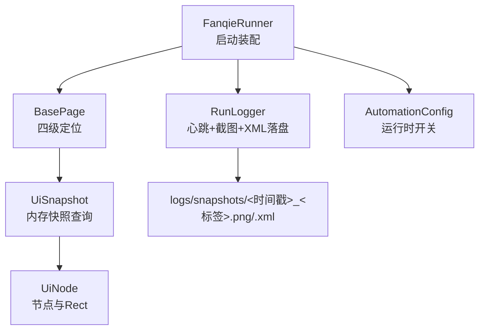
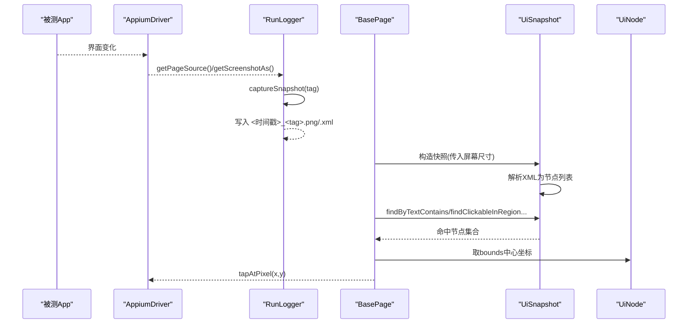
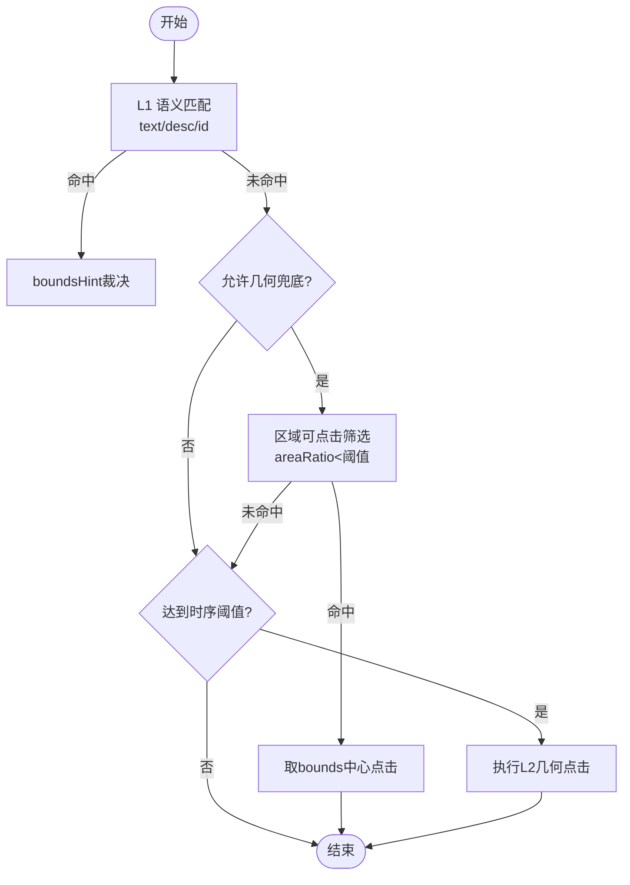
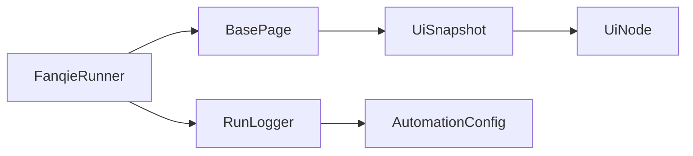

# UI快照分析

<cite>
**本文引用的文件**
- [UiSnapshot.java](file://automation/src/main/java/com/fanqie/auto/core/UiSnapshot.java)
- [UiNode.java](file://automation/src/main/java/com/fanqie/auto/core/UiNode.java)
- [BasePage.java](file://automation/src/main/java/com/fanqie/auto/page/BasePage.java)
- [RunLogger.java](file://automation/src/main/java/com/fanqie/auto/core/RunLogger.java)
- [FanqieRunner.java](file://automation/src/main/java/com/fanqie/auto/FanqieRunner.java)
- [AutomationConfig.java](file://automation/src/main/java/com/fanqie/auto/config/AutomationConfig.java)
- [UiSnapshotTest.java](file://automation/src/test/java/com/fanqie/auto/core/UiSnapshotTest.java)
- [20260906-110015_dryrun-bookshelf.xml](file://automation/logs/snapshots/20260906-110015_dryrun-bookshelf.xml)
</cite>

## 目录
1. [简介](#简介)
2. [项目结构](#项目结构)
3. [核心组件](#核心组件)
4. [架构总览](#架构总览)
5. [详细组件分析](#详细组件分析)
6. [依赖关系分析](#依赖关系分析)
7. [性能考量](#性能考量)
8. [故障排查指南](#故障排查指南)
9. [结论](#结论)
10. [附录](#附录)

## 简介
本指南面向自动化测试与问题定位人员，系统说明如何查看与分析UI自动化过程中的界面截图（PNG）与XML快照。内容涵盖：
- PNG截图的保存时机、命名规则与存储位置
- XML快照中UI树结构的含义与信息提取方法
- 如何使用快照进行界面状态验证、元素定位调试与问题复现
- 快照分析工具建议与最佳实践

## 项目结构
该工程采用分层组织：
- core：快照解析、节点模型、日志与保活等基础设施
- page：页面对象封装四级定位策略（语义匹配→几何推断→时序兜底→系统兜底）
- task：任务编排与状态机
- config：全局配置加载
- logs/snapshots：异常或关键节点自动落盘的PNG与XML快照

图表来源
- [FanqieRunner.java:120-170](file://automation/src/main/java/com/fanqie/auto/FanqieRunner.java#L120-L170)
- [RunLogger.java:231-261](file://automation/src/main/java/com/fanqie/auto/core/RunLogger.java#L231-L261)
- [BasePage.java:75-219](file://automation/src/main/java/com/fanqie/auto/page/BasePage.java#L75-L219)
- [UiSnapshot.java:21-72](file://automation/src/main/java/com/fanqie/auto/core/UiSnapshot.java#L21-L72)
- [UiNode.java:85-216](file://automation/src/main/java/com/fanqie/auto/core/UiNode.java#L85-L216)
- [AutomationConfig.java:289-305](file://automation/src/main/java/com/fanqie/auto/config/AutomationConfig.java#L289-L305)

章节来源
- [FanqieRunner.java:120-170](file://automation/src/main/java/com/fanqie/auto/FanqieRunner.java#L120-L170)
- [RunLogger.java:231-261](file://automation/src/main/java/com/fanqie/auto/core/RunLogger.java#L231-L261)

## 核心组件
- UiSnapshot：将一次getPageSource()返回的XML在内存中解析为不可变节点列表，提供纯内存查询API（文本、描述、resource-id、区域可点击节点、正则提取、最近可点击祖先）。
- UiNode：表示单个UI节点及其bounds矩形，提供坐标计算、面积比例、区域包含判断等能力。
- BasePage：实现“四级定位”策略，结合UiSnapshot进行元素定位与点击，支持boundsHint裁决与几何兜底。
- RunLogger：负责运行期日志、心跳保活，以及在异常/恢复时捕获PNG截图与XML快照到统一目录。
- AutomationConfig：集中管理超时、阈值、是否截图验证等开关。

章节来源
- [UiSnapshot.java:21-72](file://automation/src/main/java/com/fanqie/auto/core/UiSnapshot.java#L21-L72)
- [UiNode.java:1-216](file://automation/src/main/java/com/fanqie/auto/core/UiNode.java#L1-L216)
- [BasePage.java:18-219](file://automation/src/main/java/com/fanqie/auto/page/BasePage.java#L18-L219)
- [RunLogger.java:31-45](file://automation/src/main/java/com/fanqie/auto/core/RunLogger.java#L31-L45)
- [AutomationConfig.java:289-305](file://automation/src/main/java/com/fanqie/auto/config/AutomationConfig.java#L289-L305)

## 架构总览
下图展示从驱动层获取UI树并生成内存快照，再到页面层定位与点击，以及异常时落盘截图与XML的整体流程。

图表来源
- [RunLogger.java:231-261](file://automation/src/main/java/com/fanqie/auto/core/RunLogger.java#L231-L261)
- [UiSnapshot.java:52-98](file://automation/src/main/java/com/fanqie/auto/core/UiSnapshot.java#L52-L98)
- [BasePage.java:300-336](file://automation/src/main/java/com/fanqie/auto/page/BasePage.java#L300-L336)

## 详细组件分析

### PNG截图：保存时机、内容与命名
- 保存时机
  - 异常或恢复路径：当发生致命错误或进入恢复流程时，调用captureSnapshot(tag)同时保存PNG与XML。
  - Dry-run模式：用于安全探测，也会触发快照落盘以便后续分析。
  - 运行结束：通过finally确保资源释放；若异常则已触发快照。
- 存储位置
  - 统一目录：automation/logs/snapshots/
- 命名规则
  - 文件名前缀：yyyyMMdd-HHmmss_标签
  - 扩展名：.png（截图）、.xml（UI树）
  - 标签示例：dryrun-bookshelf、dryrun-reader、recovery_attempt_1、error_ad_close、fatal_error
- 内容含义
  - PNG：当前屏幕像素级画面，用于直观核对界面状态、广告弹窗、按钮可见性。
  - XML：当前UI树dump，包含控件class、text、content-desc、resource-id、bounds、clickable等属性。

章节来源
- [RunLogger.java:231-261](file://automation/src/main/java/com/fanqie/auto/core/RunLogger.java#L231-L261)
- [FanqieRunner.java:228-231](file://automation/src/main/java/com/fanqie/auto/FanqieRunner.java#L228-L231)

### XML快照：UI树结构与信息提取
- 根节点与层级
  - 根节点包含屏幕宽高、旋转角度等信息；子节点按视图层级展开。
- 常用字段
  - class：控件类名
  - text：显示文案
  - content-desc：无障碍描述（常用于图标/图片的语义）
  - resource-id：控件ID（可用于精确或模糊匹配）
  - bounds："[x1,y1][x2,y2]"，表示控件在屏幕上的矩形区域
  - clickable：是否可点击
  - package：应用包名
- 信息提取方法
  - 文本匹配：使用UiSnapshot.findByTextContains按候选文案查找
  - 描述匹配：使用UiSnapshot.findByContentDescContains按无障碍描述查找
  - ID匹配：使用UiSnapshot.findByResourceId按resource-id精确或包含匹配
  - 区域匹配：使用UiSnapshot.findClickableInRegion按屏幕比例区域筛选可点击小控件
  - 正则提取：使用UiSnapshot.extractByRegex从text/content-desc中提取数字/单位等片段
  - 祖先回溯：使用UiSnapshot.nearestClickableAncestor向上找到最近的可点击容器

章节来源
- [UiSnapshot.java:131-254](file://automation/src/main/java/com/fanqie/auto/core/UiSnapshot.java#L131-L254)
- [UiNode.java:85-216](file://automation/src/main/java/com/fanqie/auto/core/UiNode.java#L85-L216)
- [20260906-110015_dryrun-bookshelf.xml:1-200](file://automation/logs/snapshots/20260906-110015_dryrun-bookshelf.xml#L1-L200)

### 基于快照的元素定位与点击流程
- 四级定位策略
  - L1 语义属性匹配：优先按text→content-desc→resource-id通道查找，并用boundsHint裁决多命中情况
  - L2 结构化几何推断：在指定区域寻找可点击且面积较小的控件（受allowGeometryFallback保护）
  - L3 时序兜底：等待达到阈值后强制尝试L2几何点击
  - L4 系统兜底：navigate().back()或重启App
- 点击执行
  - 取命中节点的bounds中心坐标，若节点不可点击则回溯至最近可点击祖先再取中心
  - 通过GestureSupport.tapAtPixel执行点击

图表来源
- [BasePage.java:75-219](file://automation/src/main/java/com/fanqie/auto/page/BasePage.java#L75-L219)
- [BasePage.java:300-336](file://automation/src/main/java/com/fanqie/auto/page/BasePage.java#L300-L336)

章节来源
- [BasePage.java:75-219](file://automation/src/main/java/com/fanqie/auto/page/BasePage.java#L75-L219)
- [BasePage.java:300-336](file://automation/src/main/java/com/fanqie/auto/page/BasePage.java#L300-L336)

### 快照分析与验证用例
- 界面状态验证
  - 对比PNG截图确认广告弹窗、关闭按钮、菜单项是否出现
  - 检查XML中的text/content-desc/resource-id是否符合预期
- 元素定位调试
  - 使用findByTextContains/findByContentDescContains定位目标控件
  - 使用findClickableInRegion在右上角等区域快速定位关闭按钮
  - 使用nearestClickableAncestor解决文案不可点但父容器可点的场景
- 问题复现
  - 使用Dry-run模式仅连接并dump UI树，不执行点击，便于稳定复现场景
  - 结合snapshot标签（如dryrun-bookshelf）快速定位对应轮次

章节来源
- [UiSnapshotTest.java:37-197](file://automation/src/test/java/com/fanqie/auto/core/UiSnapshotTest.java#L37-L197)
- [FanqieRunner.java:162-170](file://automation/src/main/java/com/fanqie/auto/FanqieRunner.java#L162-L170)

## 依赖关系分析
- RunLogger依赖AppiumDriver进行截图与UI树抓取，并将结果持久化到snapshots目录
- BasePage依赖UiSnapshot进行内存查询，依赖UiNode进行坐标与区域计算
- UiSnapshot依赖JDK内置XML解析器，并对XXE进行加固
- AutomationConfig提供运行时开关（如verifyPageTurnedByScreenshot、dryRun）影响行为

图表来源
- [FanqieRunner.java:120-170](file://automation/src/main/java/com/fanqie/auto/FanqieRunner.java#L120-L170)
- [RunLogger.java:231-261](file://automation/src/main/java/com/fanqie/auto/core/RunLogger.java#L231-L261)
- [BasePage.java:75-219](file://automation/src/main/java/com/fanqie/auto/page/BasePage.java#L75-L219)
- [UiSnapshot.java:78-98](file://automation/src/main/java/com/fanqie/auto/core/UiSnapshot.java#L78-L98)
- [AutomationConfig.java:289-305](file://automation/src/main/java/com/fanqie/auto/config/AutomationConfig.java#L289-L305)

章节来源
- [FanqieRunner.java:120-170](file://automation/src/main/java/com/fanqie/auto/FanqieRunner.java#L120-L170)
- [RunLogger.java:231-261](file://automation/src/main/java/com/fanqie/auto/core/RunLogger.java#L231-L261)
- [BasePage.java:75-219](file://automation/src/main/java/com/fanqie/auto/page/BasePage.java#L75-L219)
- [UiSnapshot.java:78-98](file://automation/src/main/java/com/fanqie/auto/core/UiSnapshot.java#L78-L98)
- [AutomationConfig.java:289-305](file://automation/src/main/java/com/fanqie/auto/config/AutomationConfig.java#L289-L305)

## 性能考量
- 快照解析性能
  - 单次getPageSource()构建内存快照，之后全部查询为纯内存操作，零RPC
  - 同一tick内快照缓存复用，避免重复抓取
- XML体积监控
  - 心跳任务对XML大小进行预警（超过阈值提示可能存在UI树泄漏）
- 定位策略优化
  - 优先语义匹配，减少几何推断开销
  - 几何兜底限制区域与面积比例，降低误点风险

章节来源
- [UiSnapshot.java:21-35](file://automation/src/main/java/com/fanqie/auto/core/UiSnapshot.java#L21-L35)
- [RunLogger.java:162-197](file://automation/src/main/java/com/fanqie/auto/core/RunLogger.java#L162-L197)
- [BasePage.java:140-189](file://automation/src/main/java/com/fanqie/auto/page/BasePage.java#L140-L189)

## 故障排查指南
- 常见问题
  - XML解析失败：可能因设备端偶发截断导致，此时isParseFailed=true，size=0，上层走UNKNOWN分支
  - 无有效bounds：无法点击，需检查bounds格式或回退到祖先节点
  - 几何兜底被禁止：某些关键按钮（如激励视频相关）不允许误点，需调整业务逻辑或等待更长时间
- 定位步骤
  - 查看snapshots目录下对应时间戳的PNG与XML，确认界面状态与控件属性
  - 使用findByTextContains/findByContentDescContains/findByResourceId缩小范围
  - 使用findClickableInRegion在特定区域（如右上角）查找关闭按钮
  - 使用nearestClickableAncestor处理文案不可点的情况
- 工具建议
  - Android SDK uiautomatorviewer：可视化查看UI树与bounds
  - 任意XML编辑器：搜索text、content-desc、resource-id
  - 图像查看器：放大PNG核对按钮位置与可见性

章节来源
- [UiSnapshot.java:57-72](file://automation/src/main/java/com/fanqie/auto/core/UiSnapshot.java#L57-L72)
- [BasePage.java:312-336](file://automation/src/main/java/com/fanqie/auto/page/BasePage.java#L312-L336)
- [UiSnapshotTest.java:50-78](file://automation/src/test/java/com/fanqie/auto/core/UiSnapshotTest.java#L50-L78)

## 结论
本项目通过内存快照与四级定位策略，实现了高效稳定的UI自动化与问题定位。PNG与XML快照在异常与关键节点自动落盘，配合统一的命名与目录管理，便于追溯与复现。建议在日常维护中：
- 优先使用语义匹配定位元素
- 合理使用几何兜底并遵守误点防护
- 利用快照进行回归验证与问题诊断
- 关注XML体积与解析失败告警，及时治理UI树异常

## 附录
- 快照文件命名与存储
  - 目录：automation/logs/snapshots/
  - 命名：yyyyMMdd-HHmmss_标签.png / .xml
  - 标签示例：dryrun-bookshelf、dryrun-reader、recovery_attempt_1、error_ad_close、fatal_error
- 常用查询API参考
  - findByTextContains：按文案包含匹配
  - findByContentDescContains：按无障碍描述包含匹配
  - findByResourceId：按resource-id精确或包含匹配
  - findClickableInRegion：按屏幕比例区域筛选可点击小控件
  - extractByRegex：从text/content-desc提取正则匹配
  - nearestClickableAncestor：向上回溯最近可点击祖先

章节来源
- [RunLogger.java:231-261](file://automation/src/main/java/com/fanqie/auto/core/RunLogger.java#L231-L261)
- [UiSnapshot.java:131-254](file://automation/src/main/java/com/fanqie/auto/core/UiSnapshot.java#L131-L254)