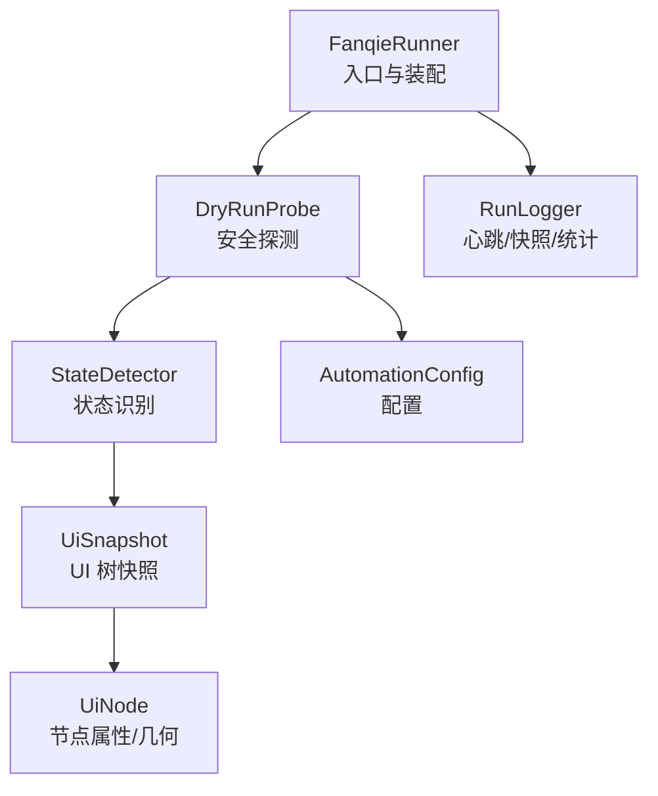
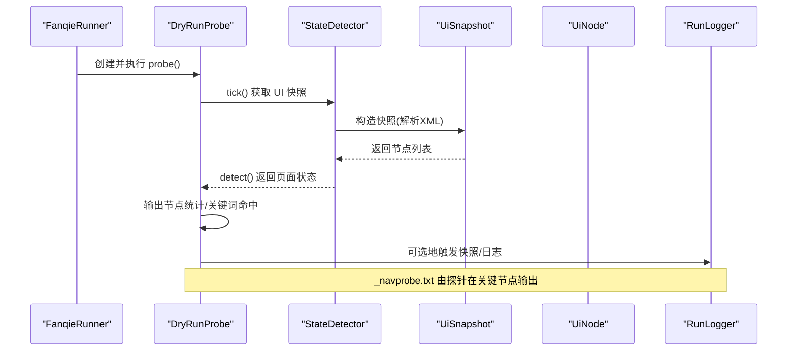
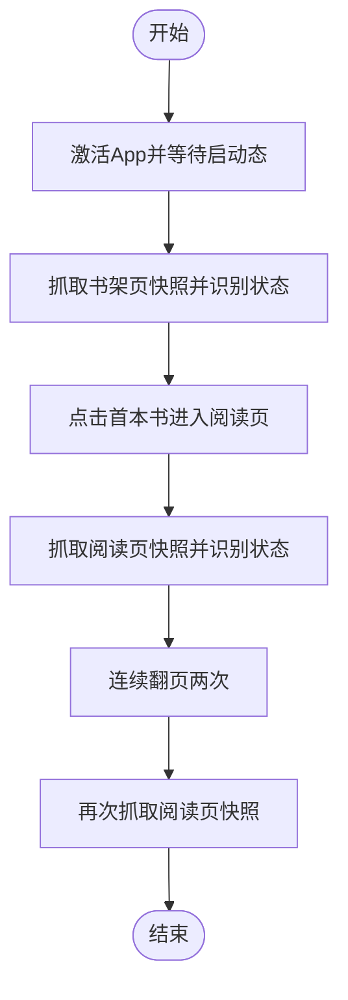
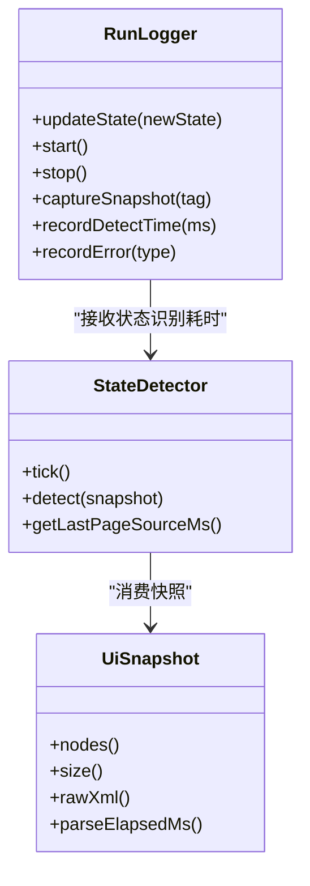
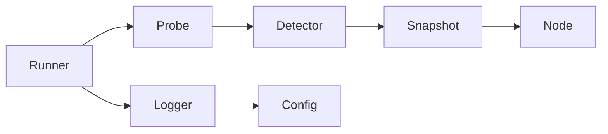

# 导航探针日志

<cite>
**本文引用的文件**
- [automation/logs/_navprobe.txt](file://automation/logs/_navprobe.txt)
- [DryRunProbe.java](file://automation/src/main/java/com/fanqie/auto/DryRunProbe.java)
- [FanqieRunner.java](file://automation/src/main/java/com/fanqie/auto/FanqieRunner.java)
- [RunLogger.java](file://automation/src/main/java/com/fanqie/auto/core/RunLogger.java)
- [UiNode.java](file://automation/src/main/java/com/fanqie/auto/core/UiNode.java)
- [UiSnapshot.java](file://automation/src/main/java/com/fanqie/auto/core/UiSnapshot.java)
- [StateDetector.java](file://automation/src/main/java/com/fanqie/auto/core/StateDetector.java)
- [AutomationConfig.java](file://automation/src/main/java/com/fanqie/auto/config/AutomationConfig.java)
</cite>

## 目录
1. [简介](#简介)
2. [项目结构](#项目结构)
3. [核心组件](#核心组件)
4. [架构总览](#架构总览)
5. [详细组件分析](#详细组件分析)
6. [依赖关系分析](#依赖关系分析)
7. [性能考量](#性能考量)
8. [故障排查指南](#故障排查指南)
9. [结论](#结论)
10. [附录：日志字段与解读示例](#附录日志字段与解读示例)

## 简介
本指南面向自动化测试与质量保障人员，聚焦 _navprobe.txt 文件中“页面跳转追踪”的解读方法。该文件由安全探测流程在启动 App、进入书架页、打开书籍进入阅读页、翻页等关键节点时输出，记录当前屏幕上的可交互控件及其几何位置，便于回溯用户操作流程、识别异常跳转路径、优化页面流转逻辑，并辅助定位性能瓶颈。

## 项目结构
- 运行入口 FanqieRunner 负责装配组件、启动心跳保活、执行 dry-run 或主任务。
- DryRunProbe 是安全探针：只连接设备、抓取 UI 快照、打印统计与关键词命中，不点击广告或领取按钮。
- RunLogger 提供长任务可观测性（心跳、状态转移、截图/XML 快照落盘）。
- StateDetector 基于 UiSnapshot 进行状态识别（书架/阅读/广告/弹窗等），为上层决策提供依据。
- UiSnapshot/UiNode 将一次 getPageSource() 解析为内存中的 UI 树，供查询与匹配使用。
- AutomationConfig 集中管理超时、轮次、策略等配置项。

图表来源
- [FanqieRunner.java:120-170](file://automation/src/main/java/com/fanqie/auto/FanqieRunner.java#L120-L170)
- [DryRunProbe.java:91-196](file://automation/src/main/java/com/fanqie/auto/DryRunProbe.java#L91-L196)
- [RunLogger.java:144-197](file://automation/src/main/java/com/fanqie/auto/core/RunLogger.java#L144-L197)
- [StateDetector.java:97-170](file://automation/src/main/java/com/fanqie/auto/core/StateDetector.java#L97-L170)
- [UiSnapshot.java:52-72](file://automation/src/main/java/com/fanqie/auto/core/UiSnapshot.java#L52-L72)
- [UiNode.java:13-44](file://automation/src/main/java/com/fanqie/auto/core/UiNode.java#L13-L44)
- [AutomationConfig.java:182-212](file://automation/src/main/java/com/fanqie/auto/config/AutomationConfig.java#L182-L212)

章节来源
- [FanqieRunner.java:41-239](file://automation/src/main/java/com/fanqie/auto/FanqieRunner.java#L41-L239)
- [DryRunProbe.java:26-196](file://automation/src/main/java/com/fanqie/auto/DryRunProbe.java#L26-L196)
- [RunLogger.java:31-197](file://automation/src/main/java/com/fanqie/auto/core/RunLogger.java#L31-L197)
- [StateDetector.java:12-170](file://automation/src/main/java/com/fanqie/auto/core/StateDetector.java#L12-L170)
- [UiSnapshot.java:21-72](file://automation/src/main/java/com/fanqie/auto/core/UiSnapshot.java#L21-L72)
- [UiNode.java:1-44](file://automation/src/main/java/com/fanqie/auto/core/UiNode.java#L1-L44)
- [AutomationConfig.java:18-212](file://automation/src/main/java/com/fanqie/auto/config/AutomationConfig.java#L18-L212)

## 核心组件
- 安全探针 DryRunProbe：按步骤激活 App、等待启动态、抓取书架/阅读页快照、翻页后再抓一次，输出节点统计与关键词命中，用于评估定位策略（L1/L2/L3）可行性。
- 状态检测 StateDetector：以 UiSnapshot 为基础，按 resource-id → text → content-desc → APP_LAUNCHING → 几何特征 → UNKNOWN 的优先级识别页面状态，支撑流程控制与日志标注。
- 运行日志 RunLogger：心跳保活、状态转移日志、异常/恢复时截图与 XML 快照落盘、最终统计汇总。
- UI 模型 UiSnapshot/UiNode：将 XML 解析为不可变节点列表，提供区域判断、比例计算、最近可点击祖先查找等能力。
- 配置 AutomationConfig：统一暴露超时、轮次、翻页策略、心跳间隔等参数，避免魔法数字。

章节来源
- [DryRunProbe.java:91-196](file://automation/src/main/java/com/fanqie/auto/DryRunProbe.java#L91-L196)
- [StateDetector.java:152-208](file://automation/src/main/java/com/fanqie/auto/core/StateDetector.java#L152-L208)
- [RunLogger.java:144-197](file://automation/src/main/java/com/fanqie/auto/core/RunLogger.java#L144-L197)
- [UiSnapshot.java:52-72](file://automation/src/main/java/com/fanqie/auto/core/UiSnapshot.java#L52-L72)
- [UiNode.java:85-216](file://automation/src/main/java/com/fanqie/auto/core/UiNode.java#L85-L216)
- [AutomationConfig.java:182-212](file://automation/src/main/java/com/fanqie/auto/config/AutomationConfig.java#L182-L212)

## 架构总览
下图展示从入口到探针、状态识别、日志落盘的调用链，以及 _navprobe.txt 的生成时机与内容构成。

图表来源
- [FanqieRunner.java:162-170](file://automation/src/main/java/com/fanqie/auto/FanqieRunner.java#L162-L170)
- [DryRunProbe.java:115-196](file://automation/src/main/java/com/fanqie/auto/DryRunProbe.java#L115-L196)
- [StateDetector.java:97-170](file://automation/src/main/java/com/fanqie/auto/core/StateDetector.java#L97-L170)
- [UiSnapshot.java:52-72](file://automation/src/main/java/com/fanqie/auto/core/UiSnapshot.java#L52-L72)
- [UiNode.java:13-44](file://automation/src/main/java/com/fanqie/auto/core/UiNode.java#L13-L44)
- [RunLogger.java:231-261](file://automation/src/main/java/com/fanqie/auto/core/RunLogger.java#L231-L261)

## 详细组件分析

### 导航探针日志（_navprobe.txt）解读
- 每行代表一个可交互控件的“探针点”，包含以下字段：
  - cy：控件中心纵坐标（像素）
  - clk：是否可点击（true/false）
  - id：resource-id（可能为空）
  - text：文本内容（可能为空）
  - desc：content-desc（可能为空）
  - bounds：控件矩形区域 "[x1,y1][x2,y2]"
- 典型用途：
  - 还原底部 Tab 栏、广告关闭按钮、阅读页翻页区域等关键控件位置
  - 结合 clk 与 bounds 判断点击热区与误触风险
  - 通过 id/text/desc 组合确认控件语义稳定性（利于 L1 定位）
- 时序含义：
  - 文件顺序对应探针在不同阶段输出的控件集合，可用于推断页面元素变化与跳转时序
  - 例如：书架页底部 Tab 出现后，再出现阅读页容器与翻页区域；若出现广告关闭按钮，则说明进入广告态

章节来源
- [automation/logs/_navprobe.txt:1-13](file://automation/logs/_navprobe.txt#L1-L13)
- [DryRunProbe.java:115-196](file://automation/src/main/java/com/fanqie/auto/DryRunProbe.java#L115-L196)
- [UiNode.java:13-44](file://automation/src/main/java/com/fanqie/auto/core/UiNode.java#L13-L44)

### 页面导航路径与跳转时序
- 启动 App：等待启动态（APP_LAUNCHING），确保 UI 树稳定后再抓取快照。
- 书架页：识别书架 Tab 与书籍条目，点击首本书进入阅读页。
- 阅读页：抓取阅读页快照，连续翻页两次后再抓一次，观察底部广告入口是否随翻页出现。
- 状态机驱动：StateDetector 按 resource-id → text → content-desc → APP_LAUNCHING → 几何特征 → UNKNOWN 的顺序识别状态，保证跳转时序清晰可追溯。

图表来源
- [DryRunProbe.java:91-196](file://automation/src/main/java/com/fanqie/auto/DryRunProbe.java#L91-L196)
- [StateDetector.java:183-208](file://automation/src/main/java/com/fanqie/auto/core/StateDetector.java#L183-L208)

章节来源
- [DryRunProbe.java:91-196](file://automation/src/main/java/com/fanqie/auto/DryRunProbe.java#L91-L196)
- [StateDetector.java:183-208](file://automation/src/main/java/com/fanqie/auto/core/StateDetector.java#L183-L208)

### 状态转换与日志记录格式
- 状态转移日志：RunLogger.updateState() 会记录旧状态到新状态的转移，便于串联跳转时序。
- 心跳摘要：RunLogger 周期性输出已运行时长、当前状态、本轮视频轮次、累计时长、翻页数、连续错误、getPageSource 耗时、XML 体积等指标。
- 异常/恢复快照：captureSnapshot() 保存截图与 XML，便于问题复现与根因分析。

图表来源
- [RunLogger.java:204-229](file://automation/src/main/java/com/fanqie/auto/core/RunLogger.java#L204-L229)
- [StateDetector.java:97-170](file://automation/src/main/java/com/fanqie/auto/core/StateDetector.java#L97-L170)
- [UiSnapshot.java:258-273](file://automation/src/main/java/com/fanqie/auto/core/UiSnapshot.java#L258-L273)

章节来源
- [RunLogger.java:204-229](file://automation/src/main/java/com/fanqie/auto/core/RunLogger.java#L204-L229)
- [StateDetector.java:97-170](file://automation/src/main/java/com/fanqie/auto/core/StateDetector.java#L97-L170)

### 用户操作流程分析与异常路径识别
- 正常路径：书架页 → 点击书籍 → 阅读页 → 翻页 → 广告入口（如出现）→ 关闭广告 → 继续翻页。
- 异常路径识别：
  - 若 _navprobe.txt 中出现非预期的 clickable 节点（如广告关闭按钮出现在书架页），需检查 StateDetector 的 text/content-desc 匹配优先级与几何规则。
  - 若 bounds 异常或 cy 不在预期区域，检查屏幕尺寸缓存是否失效（横屏/折叠屏旋转）及 UiNode.Rect.parse 健壮性。
- 优化建议：
  - 优先使用 resource-id 锚点（最高确定性）
  - 文案漂移时使用 content-desc 候选集
  - 无属性时采用几何兜底（右上角小面积 clickable 作为关闭按钮）

章节来源
- [StateDetector.java:183-208](file://automation/src/main/java/com/fanqie/auto/core/StateDetector.java#L183-L208)
- [UiNode.java:113-151](file://automation/src/main/java/com/fanqie/auto/core/UiNode.java#L113-L151)
- [UiSnapshot.java:190-200](file://automation/src/main/java/com/fanqie/auto/core/UiSnapshot.java#L190-L200)

### 导航性能分析与瓶颈识别
- 关键指标：
  - getPageSource 耗时：StateDetector.getLastPageSourceMs()
  - XML 体积：UiSnapshot.xmlLength() / RunLogger.lastXmlSize
  - 状态识别耗时：RunLogger.recordDetectTime()
  - 心跳间隔：AutomationConfig.heartbeatIntervalSec()
- 瓶颈定位：
  - 若 getPageSource 耗时显著上升，检查设备端 instrumentation server 负载或网络延迟
  - 若 XML 体积异常膨胀，检查 UI 树泄漏或复杂布局
  - 若状态识别耗时增加，检查候选集规模与正则复杂度

章节来源
- [StateDetector.java:97-170](file://automation/src/main/java/com/fanqie/auto/core/StateDetector.java#L97-L170)
- [RunLogger.java:174-197](file://automation/src/main/java/com/fanqie/auto/core/RunLogger.java#L174-L197)
- [UiSnapshot.java:264-273](file://automation/src/main/java/com/fanqie/auto/core/UiSnapshot.java#L264-L273)
- [AutomationConfig.java:210-212](file://automation/src/main/java/com/fanqie/auto/config/AutomationConfig.java#L210-L212)

## 依赖关系分析
- FanqieRunner 依赖 DryRunProbe、RunLogger、StateDetector、AutomationConfig 完成装配与执行。
- DryRunProbe 依赖 StateDetector 进行状态识别，依赖 UiSnapshot/UiNode 进行 UI 树操作。
- RunLogger 依赖 AutomationConfig 获取心跳间隔与阈值，依赖 Driver 进行截图与 XML 捕获。
- StateDetector 依赖 LocatorRegistry（未在本节展开）提供文案候选集与正则。

图表来源
- [FanqieRunner.java:120-170](file://automation/src/main/java/com/fanqie/auto/FanqieRunner.java#L120-L170)
- [DryRunProbe.java:91-196](file://automation/src/main/java/com/fanqie/auto/DryRunProbe.java#L91-L196)
- [RunLogger.java:144-197](file://automation/src/main/java/com/fanqie/auto/core/RunLogger.java#L144-L197)
- [StateDetector.java:97-170](file://automation/src/main/java/com/fanqie/auto/core/StateDetector.java#L97-L170)
- [UiSnapshot.java:52-72](file://automation/src/main/java/com/fanqie/auto/core/UiSnapshot.java#L52-L72)
- [UiNode.java:13-44](file://automation/src/main/java/com/fanqie/auto/core/UiNode.java#L13-L44)
- [AutomationConfig.java:182-212](file://automation/src/main/java/com/fanqie/auto/config/AutomationConfig.java#L182-L212)

章节来源
- [FanqieRunner.java:120-170](file://automation/src/main/java/com/fanqie/auto/FanqieRunner.java#L120-L170)
- [DryRunProbe.java:91-196](file://automation/src/main/java/com/fanqie/auto/DryRunProbe.java#L91-L196)
- [RunLogger.java:144-197](file://automation/src/main/java/com/fanqie/auto/core/RunLogger.java#L144-L197)
- [StateDetector.java:97-170](file://automation/src/main/java/com/fanqie/auto/core/StateDetector.java#L97-L170)
- [UiSnapshot.java:52-72](file://automation/src/main/java/com/fanqie/auto/core/UiSnapshot.java#L52-L72)
- [UiNode.java:13-44](file://automation/src/main/java/com/fanqie/auto/core/UiNode.java#L13-L44)
- [AutomationConfig.java:182-212](file://automation/src/main/java/com/fanqie/auto/config/AutomationConfig.java#L182-L212)

## 性能考量
- 单次 getPageSource() 构造快照，同一 tick 内复用，避免重复 RPC。
- 屏幕尺寸缓存减少 getSize() 调用，横屏/折叠屏自动自愈。
- 心跳保活防止 session 超时，同时输出运行摘要与异常预警。
- XML 体积超过阈值时输出预警，提示 UI 树泄漏风险。

[本节为通用性能指导，无需特定文件引用]

## 故障排查指南
- 常见问题：
  - 状态识别失败：检查 StateDetector 的 text/content-desc 候选集与 resource-id 锚点是否正确。
  - 点击误触：核对 _navprobe.txt 中 clk=true 的 bounds 与 cy，确保点击区域准确。
  - 会话断开：RunLogger 心跳失败时标记 sessionAlive=false，需重建 driver。
  - XML 膨胀：关注 lastXmlSize 与预警信息，排查复杂布局或泄漏。
- 解决建议：
  - 校准 LocatorRegistry 中的文案与正则，提升 L1 命中率。
  - 对无属性控件采用几何兜底（右上角小面积 clickable）。
  - 调整心跳间隔与超时参数，适应不同设备性能。

章节来源
- [StateDetector.java:183-208](file://automation/src/main/java/com/fanqie/auto/core/StateDetector.java#L183-L208)
- [RunLogger.java:162-197](file://automation/src/main/java/com/fanqie/auto/core/RunLogger.java#L162-L197)
- [UiNode.java:113-151](file://automation/src/main/java/com/fanqie/auto/core/UiNode.java#L113-L151)

## 结论
_navprobe.txt 提供了页面跳转过程中关键控件的时空分布，结合 StateDetector 的状态识别与 RunLogger 的可观测性日志，可完整还原用户操作流程、识别异常路径、优化定位策略与性能瓶颈。建议在日常维护中持续校准文案与正则，优先使用 resource-id 锚点，辅以几何兜底，确保自动化流程的稳定与高效。

[本节为总结性内容，无需特定文件引用]

## 附录：日志字段与解读示例
- 字段说明：
  - cy：控件中心纵坐标（像素），用于判断控件在屏幕中的垂直位置
  - clk：是否可点击，true 表示该控件可被点击
  - id：resource-id，用于唯一标识控件（可能为空）
  - text：控件文本内容（可能为空）
  - desc：content-desc，无障碍描述（可能为空）
  - bounds：控件矩形区域 "[x1,y1][x2,y2]"，用于几何判定
- 解读示例：
  - 若某行 clk=true 且 bounds 位于屏幕底部中央，可能是底部 Tab 栏
  - 若某行 clk=true 且 bounds 位于右上角小面积区域，可能是广告关闭按钮
  - 若 bounds 超出屏幕尺寸，检查屏幕尺寸缓存是否失效

章节来源
- [automation/logs/_navprobe.txt:1-13](file://automation/logs/_navprobe.txt#L1-L13)
- [UiNode.java:113-151](file://automation/src/main/java/com/fanqie/auto/core/UiNode.java#L113-L151)
- [UiSnapshot.java:190-200](file://automation/src/main/java/com/fanqie/auto/core/UiSnapshot.java#L190-L200)