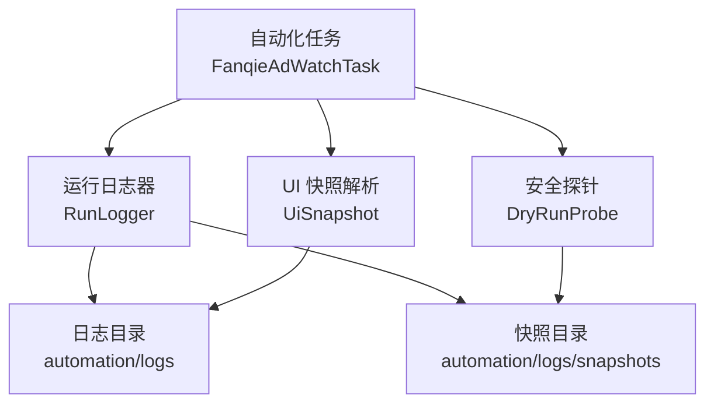
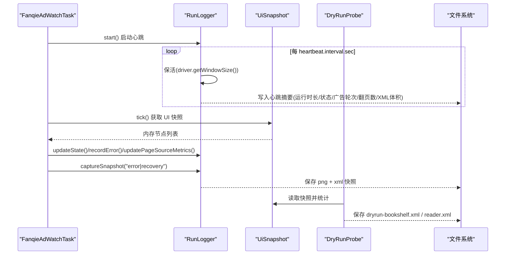
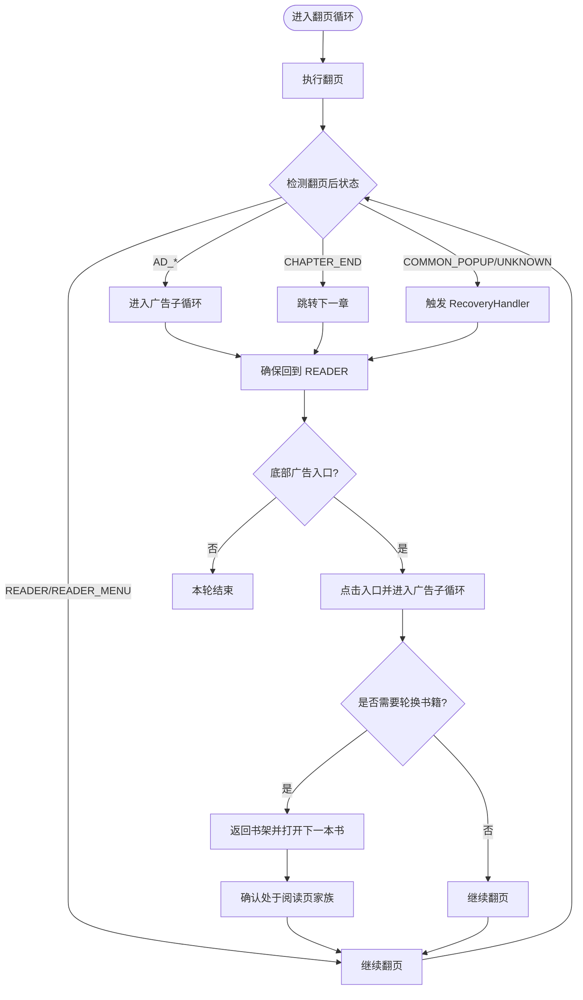
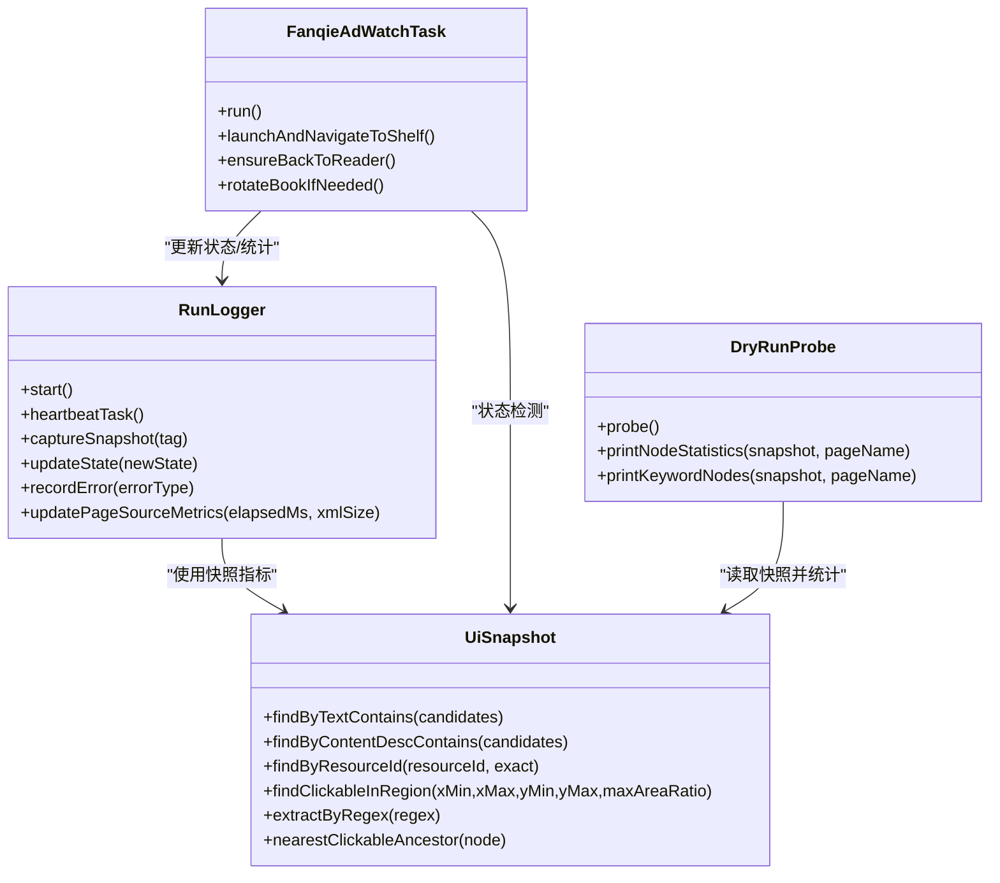

# 日志分析

<cite>
**本文引用的文件**
- [RunLogger.java](file://automation/src/main/java/com/fanqie/auto/core/RunLogger.java)
- [UiSnapshot.java](file://automation/src/main/java/com/fanqie/auto/core/UiSnapshot.java)
- [FanqieAdWatchTask.java](file://automation/src/main/java/com/fanqie/auto/task/FanqieAdWatchTask.java)
- [DryRunProbe.java](file://automation/src/main/java/com/fanqie/auto/DryRunProbe.java)
- [run-err.txt](file://automation/logs/run-err.txt)
- [java-err.txt](file://automation/logs/java-err.txt)
- [_screen.txt](file://automation/logs/_screen.txt)
- [_navprobe.txt](file://automation/logs/_navprobe.txt)
- [_rows.txt](file://automation/logs/_rows.txt)
- [_selected.txt](file://automation/logs/_selected.txt)
- [_tabmap.txt](file://automation/logs/_tabmap.txt)
</cite>

## 目录
1. [简介](#简介)
2. [项目结构](#项目结构)
3. [核心组件](#核心组件)
4. [架构总览](#架构总览)
5. [详细组件分析](#详细组件分析)
6. [依赖关系分析](#依赖关系分析)
7. [性能注意事项](#性能注意事项)
8. [故障排查指南](#故障排查指南)
9. [结论](#结论)
10. [附录：常用命令与工具](#附录：常用命令与工具)

## 简介
本指南面向自动化运行过程中的“可观测性”与“排障”，系统性地说明如何解读以下日志类型：
- 运行日志（run-*.log / run-err.txt）：记录任务生命周期、心跳摘要、状态转移、异常统计等。
- Java 错误日志（java-err.txt）：JVM 启动或运行时抛出的错误堆栈，用于定位环境、类路径、驱动连接等问题。
- UI 快照日志（_screen.txt 及 snapshots/*.xml）：界面元素树与关键控件信息，用于核对当前页面状态与定位问题。
- 导航探针日志（_navprobe.txt）：底部导航栏点击探测结果，用于追踪页面跳转与入口命中情况。
- 辅助日志（_rows.txt、_selected.txt、_tabmap.txt）：行级控件布局、选中项、Tab 映射等，辅助定位交互点。

通过本文，你将学会：
- 识别日志级别与关键字段含义
- 从运行日志中提取关键指标（运行时长、广告轮次、翻页数、XML 体积、状态识别耗时等）
- 结合 UI 快照与导航探针日志进行故障定位
- 使用命令行与工具快速筛选、过滤与分析日志
- 基于性能相关日志识别瓶颈并优化

## 项目结构
本项目为 Android UI 自动化工程，核心日志由运行期组件统一落盘到 automation/logs 目录，截图与 XML 快照落盘到 automation/logs/snapshots。关键日志文件与生成位置如下：
- 运行日志：automation/logs/run-<时间戳>.log（示例中为 run-err.txt）
- Java 错误日志：automation/logs/java-err.txt
- UI 文本快照：automation/logs/_screen.txt
- 导航探针：automation/logs/_navprobe.txt
- 行级控件：automation/logs/_rows.txt
- 选中项：automation/logs/_selected.txt
- Tab 映射：automation/logs/_tabmap.txt
- 截图与 XML 快照：automation/logs/snapshots/*.{png,xml}

图表来源
- [RunLogger.java:94-130](file://automation/src/main/java/com/fanqie/auto/core/RunLogger.java#L94-L130)
- [DryRunProbe.java:72-79](file://automation/src/main/java/com/fanqie/auto/DryRunProbe.java#L72-L79)
- [UiSnapshot.java:21-35](file://automation/src/main/java/com/fanqie/auto/core/UiSnapshot.java#L21-L35)

章节来源
- [RunLogger.java:94-130](file://automation/src/main/java/com/fanqie/auto/core/RunLogger.java#L94-L130)
- [DryRunProbe.java:72-79](file://automation/src/main/java/com/fanqie/auto/DryRunProbe.java#L72-L79)

## 核心组件
- RunLogger：负责长任务可观测性与 Appium session 保活。周期性输出心跳摘要，记录状态转移、异常分布、XML 体积预警，并在异常/恢复时保存截图与 XML 快照。
- UiSnapshot：对一次 getPageSource() 的内存快照建模，提供纯内存查询 API（按 text、content-desc、resource-id、区域几何查找），并防御 XXE 与解析失败。
- FanqieAdWatchTask：业务编排主流程，贯穿启动、导航、翻页、广告子循环、恢复与收尾；在关键节点调用 RunLogger 更新状态与统计。
- DryRunProbe：安全探针，仅抓取书架页与阅读页的 UI 快照并输出节点属性统计与关键词命中，用于判定是否需要 L2/L3 兜底策略。

章节来源
- [RunLogger.java:31-45](file://automation/src/main/java/com/fanqie/auto/core/RunLogger.java#L31-L45)
- [UiSnapshot.java:21-35](file://automation/src/main/java/com/fanqie/auto/core/UiSnapshot.java#L21-L35)
- [FanqieAdWatchTask.java:20-41](file://automation/src/main/java/com/fanqie/auto/task/FanqieAdWatchTask.java#L20-L41)
- [DryRunProbe.java:26-40](file://automation/src/main/java/com/fanqie/auto/DryRunProbe.java#L26-L40)

## 架构总览
下图展示了日志系统在运行期的协作关系：任务执行过程中，RunLogger 定时输出心跳与统计，捕获异常时保存快照；UiSnapshot 将 UI 树解析为内存模型供状态检测与探针使用；DryRunProbe 输出结构化节点统计与关键词命中，辅助定位交互点。

图表来源
- [RunLogger.java:150-197](file://automation/src/main/java/com/fanqie/auto/core/RunLogger.java#L150-L197)
- [RunLogger.java:239-261](file://automation/src/main/java/com/fanqie/auto/core/RunLogger.java#L239-L261)
- [UiSnapshot.java:52-72](file://automation/src/main/java/com/fanqie/auto/core/UiSnapshot.java#L52-L72)
- [DryRunProbe.java:115-196](file://automation/src/main/java/com/fanqie/auto/DryRunProbe.java#L115-L196)

## 详细组件分析

### 运行日志（run-err.txt）结构与解读
- 文件命名：run-<yyyyMMdd-HHmmss>.log（示例中为 run-err.txt）
- 内容格式：每行包含时间戳与消息，常见字段包括：
  - [启动]：任务开始、目标分钟数、日志文件路径
  - [心跳]：已运行时长 | 状态 | 本轮视频轮次 | 累计时长 | 翻页数 | 连续错误 | getPageSource 耗时 | XML 体积
  - [状态转移]：旧状态 -> 新状态（含描述）
  - [预警]：XML 体积异常膨胀提示
  - [快照]：保存截图与 XML 的文件名
  - 运行结束时的结构化统计汇总（总运行时间、累计免广告时长、总广告轮次、翻页数、状态识别次数与平均耗时、最终连续错误数、异常分布）
- 关键信息提取方法：
  - 定位异常：搜索 [警告]、[预警]、[快照] 等关键字
  - 评估稳定性：关注连续错误计数与异常分布
  - 性能观察：getPageSource 耗时与 XML 体积变化趋势
- 故障定位技巧：
  - 若心跳频繁报 session 保活失败，检查设备连接与 Appium 服务
  - 若 XML 体积持续超过阈值，检查 UI 树是否泄漏或存在大量不可见节点

章节来源
- [RunLogger.java:127-130](file://automation/src/main/java/com/fanqie/auto/core/RunLogger.java#L127-L130)
- [RunLogger.java:174-192](file://automation/src/main/java/com/fanqie/auto/core/RunLogger.java#L174-L192)
- [RunLogger.java:204-229](file://automation/src/main/java/com/fanqie/auto/core/RunLogger.java#L204-L229)
- [RunLogger.java:312-345](file://automation/src/main/java/com/fanqie/auto/core/RunLogger.java#L312-L345)

### Java 错误日志（java-err.txt）与堆栈分析
- 典型错误：找不到或无法加载主类、ClassNotFoundException
- 分析步骤：
  - 确认类路径与工作目录是否正确
  - 检查 Maven exec 插件配置的主类名与实际包路径一致
  - 验证依赖是否打包进 fat-jar（shade 插件）
  - 查看完整堆栈中的异常链，定位首次抛出点
- 常见问题处置：
  - 修正 mainClass 或工作目录
  - 重新构建并清理 target 后再次运行
  - 确保 Appium 与 adb 环境可用

章节来源
- [java-err.txt:1-3](file://automation/logs/java-err.txt#L1-L3)
- [pom.xml:127-139](file://automation/pom.xml#L127-L139)

### UI 快照日志（_screen.txt）与界面状态查看
- _screen.txt：以文本形式列出当前页面的可见文案与资源包信息，便于快速核对页面内容与层级
- snapshots/*.xml：完整的 UI 树 XML，可用于深度分析控件属性、bounds、层级关系
- 分析方法：
  - 核对顶部文案是否与预期页面一致（如书架、阅读器、弹窗）
  - 检查 resource-id 是否存在且稳定，作为 L1 语义定位依据
  - 若正文为自绘 Canvas，则翻页需依赖坐标策略，底部入口可能仅在翻页后出现
- 与代码对应：
  - UiSnapshot 解析 XML 并构建内存节点列表，支持多种查询方式
  - DryRunProbe 输出节点属性统计与关键词命中，辅助判断定位策略

章节来源
- [_screen.txt:1-33](file://automation/logs/_screen.txt#L1-L33)
- [UiSnapshot.java:52-98](file://automation/src/main/java/com/fanqie/auto/core/UiSnapshot.java#L52-L98)
- [DryRunProbe.java:283-345](file://automation/src/main/java/com/fanqie/auto/DryRunProbe.java#L283-L345)

### 导航探针日志（_navprobe.txt）与页面跳转追踪
- 字段说明：
  - cy：点击中心纵坐标
  - clk：是否可点击
  - id：控件 resource-id
  - text/desc：文案与无障碍描述
  - bounds：控件矩形区域
- 用途：
  - 追踪底部导航栏点击命中情况（如书架、书城、短剧、赚钱、我的）
  - 校验点击坐标与控件边界是否匹配
  - 发现误点或空点击（clk=false）导致的跳转失败
- 关联日志：
  - _tabmap.txt：Tab 文案与 bounds 映射
  - _selected.txt：当前选中的 Tab 及其 bounds
  - _rows.txt：行级控件布局，辅助理解网格与卡片排列

章节来源
- [_navprobe.txt:1-13](file://automation/logs/_navprobe.txt#L1-L13)
- [_tabmap.txt:1-11](file://automation/logs/_tabmap.txt#L1-L11)
- [_selected.txt:1-2](file://automation/logs/_selected.txt#L1-L2)
- [_rows.txt:1-17](file://automation/logs/_rows.txt#L1-L17)

### 复杂逻辑流程图（状态机与恢复）

图表来源
- [FanqieAdWatchTask.java:197-314](file://automation/src/main/java/com/fanqie/auto/task/FanqieAdWatchTask.java#L197-L314)
- [FanqieAdWatchTask.java:464-525](file://automation/src/main/java/com/fanqie/auto/task/FanqieAdWatchTask.java#L464-L525)
- [FanqieAdWatchTask.java:537-590](file://automation/src/main/java/com/fanqie/auto/task/FanqieAdWatchTask.java#L537-L590)

## 依赖关系分析
- RunLogger 依赖 AutomationConfig 获取心跳间隔、目标分钟数等配置；依赖 AppiumDriver 进行保活与快照采集。
- UiSnapshot 依赖 Appium 的 getPageSource() 输出 XML，并进行安全解析与内存查询。
- FanqieAdWatchTask 组合多个 Page 对象（BookshelfPage、ReaderPage、AdFlowPage）与 StateDetector、WaitSupport、GestureSupport，协调任务流程。
- DryRunProbe 复用 StateDetector 与 GestureSupport，仅做安全探测与快照输出。

图表来源
- [RunLogger.java:150-229](file://automation/src/main/java/com/fanqie/auto/core/RunLogger.java#L150-L229)
- [UiSnapshot.java:137-254](file://automation/src/main/java/com/fanqie/auto/core/UiSnapshot.java#L137-L254)
- [FanqieAdWatchTask.java:99-314](file://automation/src/main/java/com/fanqie/auto/task/FanqieAdWatchTask.java#L99-L314)
- [DryRunProbe.java:91-196](file://automation/src/main/java/com/fanqie/auto/DryRunProbe.java#L91-L196)

## 性能注意事项
- 心跳间隔与保活：RunLogger 每 heartbeat.interval.sec 秒执行轻量保活，避免 newCommandTimeout；过长间隔可能导致会话断开，过短会增加开销。
- XML 体积监控：当 lastXmlSize 超过阈值（默认 1MB）时输出预警，提示 UI 树泄漏或过多不可见节点；应检查页面是否存在大量隐藏控件或重复渲染。
- 状态识别耗时：通过 recordDetectTime 累计与平均耗时，若显著上升，需检查 UiSnapshot 解析与查询效率，或减少不必要的 DOM 遍历。
- 翻页与广告子循环：翻页后若频繁进入广告子循环，需评估广告入口命中率与关闭成功率，必要时调整定位策略（L1/L2/L3）。
- 墙钟预算与配额：FanqieAdWatchTask 支持最大运行时间与每日配额熔断，避免长时间占用设备或消耗真实配额。

章节来源
- [RunLogger.java:150-197](file://automation/src/main/java/com/fanqie/auto/core/RunLogger.java#L150-L197)
- [RunLogger.java:219-229](file://automation/src/main/java/com/fanqie/auto/core/RunLogger.java#L219-L229)
- [FanqieAdWatchTask.java:167-195](file://automation/src/main/java/com/fanqie/auto/task/FanqieAdWatchTask.java#L167-L195)

## 故障排查指南
- 启动失败（ClassNotFoundException）：
  - 检查 Maven exec 插件 mainClass 配置与实际类路径
  - 确认依赖已打包进 fat-jar
  - 清理并重新构建项目
- 设备连接问题：
  - 确认 adb 可用、设备在线、开发者选项与 USB 调试已开启
  - 处理 unauthorized/offline 状态，重插线或重启 adb server
- Appium 服务不可用：
  - 检查 node 版本、Appium 安装与 driver 列表
  - 启动 Appium Server 并确认 base-path 正确
- 会话保活失败：
  - 关注心跳日志中的 sessionAlive 标志与保活异常
  - 若频繁断开，检查设备电量、屏幕锁定与后台限制
- UI 定位失败：
  - 使用 DryRunProbe 输出节点统计与关键词命中，校准 locators.properties
  - 若控件无 text/content-desc/resource-id，考虑 L2 几何兜底（右上角小面积 clickable）
- 广告关闭困难：
  - 检查穿山甲 SDK 的 content-desc 是否为“关闭”
  - 若无属性，采用 L2（右上角）+ L3（时序）策略

章节来源
- [java-err.txt:1-3](file://automation/logs/java-err.txt#L1-L3)
- [RunLogger.java:162-197](file://automation/src/main/java/com/fanqie/auto/core/RunLogger.java#L162-L197)
- [DryRunProbe.java:350-372](file://automation/src/main/java/com/fanqie/auto/DryRunProbe.java#L350-L372)

## 结论
本日志体系通过 RunLogger 的心跳与统计、UiSnapshot 的内存快照与查询、DryRunProbe 的安全探测，形成了完整的可观测性与排障闭环。运行日志提供宏观指标与异常分布，UI 快照与导航探针提供微观界面与交互细节，二者结合可高效定位问题并优化性能。建议在日常运行中定期审查心跳摘要与 XML 体积趋势，结合 DryRunProbe 的输出校准定位策略，确保自动化流程的稳定与高效。

## 附录：常用命令与工具
- 查看运行日志：
  - Windows PowerShell: Get-Content automation/logs/run-*.log -Tail 100
  - Linux/macOS: tail -f automation/logs/run-*.log
- 搜索关键字：
  - grep -i "心跳\|警告\|预警\|快照" automation/logs/run-*.log
- 查看 Java 错误：
  - type automation/logs/java-err.txt
- 分析 UI 快照：
  - 使用 XML 编辑器打开 automation/logs/snapshots/*.xml
  - 使用 XPath 或 DOM 工具检索 resource-id、text、bounds
- 导航探针分析：
  - 筛选 clk=true 的行，核对 id 与 bounds 是否命中预期控件
- 工具推荐：
  - Appium Inspector：可视化 UI 树与控件属性
  - ADB：设备连接与基本操作（adb devices、adb shell）
  - 文本分析工具：VS Code、Notepad++、grep/grep-win、PowerShell