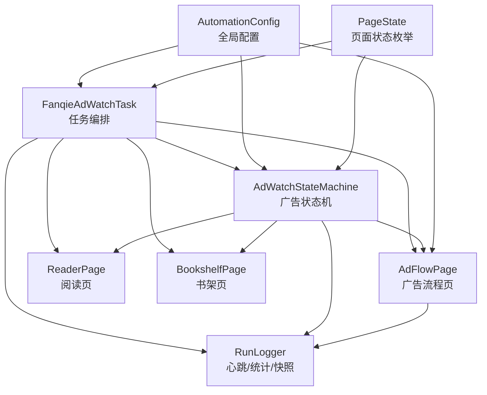
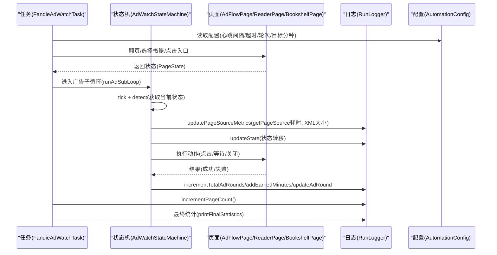
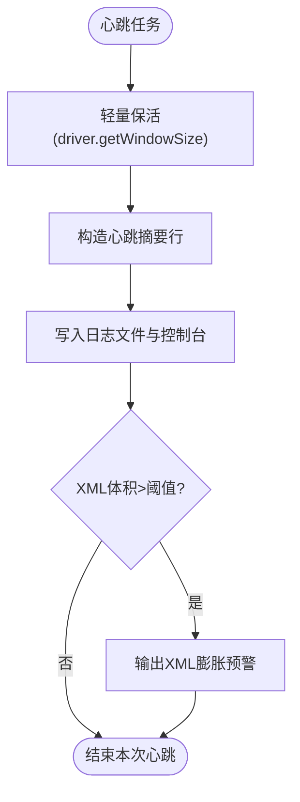
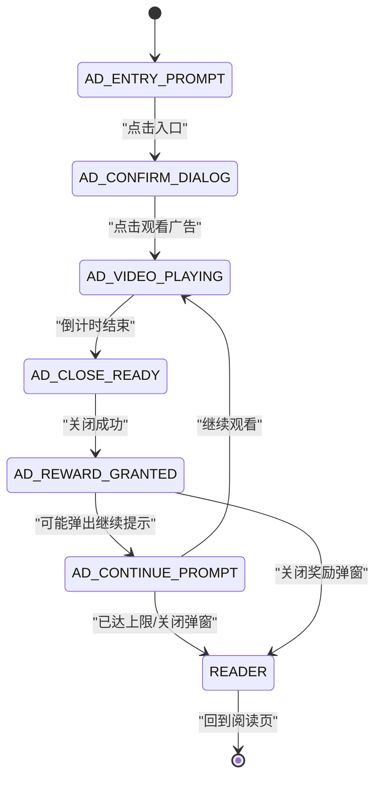
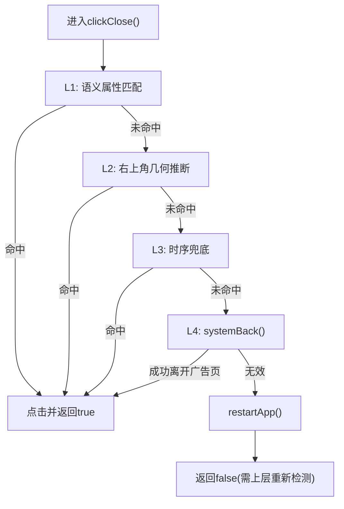
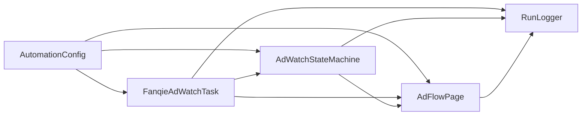

# 运行日志分析

<cite>
**本文引用的文件**
- [RunLogger.java](file://automation/src/main/java/com/fanqie/auto/core/RunLogger.java)
- [FanqieAdWatchTask.java](file://automation/src/main/java/com/fanqie/auto/task/FanqieAdWatchTask.java)
- [AdWatchStateMachine.java](file://automation/src/main/java/com/fanqie/auto/task/AdWatchStateMachine.java)
- [AdFlowPage.java](file://automation/src/main/java/com/fanqie/auto/page/AdFlowPage.java)
- [PageState.java](file://automation/src/main/java/com/fanqie/auto/core/PageState.java)
- [AutomationConfig.java](file://automation/src/main/java/com/fanqie/auto/config/AutomationConfig.java)
- [run-err.txt](file://automation/logs/run-err.txt)
- [run-20260906-123046.log](file://automation/logs/run-20260906-123046.log)
</cite>

## 目录
1. [简介](#简介)
2. [项目结构](#项目结构)
3. [核心组件](#核心组件)
4. [架构总览](#架构总览)
5. [详细组件分析](#详细组件分析)
6. [依赖关系分析](#依赖关系分析)
7. [性能考量](#性能考量)
8. [故障排查指南](#故障排查指南)
9. [结论](#结论)
10. [附录：常用日志分析命令与技巧](#附录常用日志分析命令与技巧)

## 简介
本指南聚焦自动化运行日志，尤其是 run-err.txt 与运行时生成的 run-*.log 的结构与内容格式。重点解释心跳日志、状态转移日志、进度统计等关键信息的含义与解读方法，并给出如何从日志中提取运行时间、当前状态、广告轮次、累计时长、翻页数等指标的方法。同时提供常用日志分析命令与技巧，帮助快速定位问题和分析性能瓶颈。最后说明日志级别与异常信息识别方法。

## 项目结构
该自动化工程将“任务编排”“状态机”“页面操作”“日志与快照”分层组织：
- 任务编排：FanqieAdWatchTask 负责启动 App、进入书架、打开书籍、翻页、遇到广告时进入子循环、章节结束跳转下一章、异常恢复等。
- 状态机：AdWatchStateMachine 以转移表驱动广告流程，维护轮次、分钟数、熔断条件、每日配额耗尽识别、断点续跑进度持久化。
- 页面操作：AdFlowPage 处理广告关闭、倒计时等待、奖励分钟提取等高风险交互。
- 日志与快照：RunLogger 负责心跳保活、状态转移记录、进度统计汇总、截图与 XML 快照落盘。
- 配置：AutomationConfig 集中管理超时、轮次上限、目标分钟、心跳间隔等参数。
- 状态枚举：PageState 定义所有页面状态及语义分组（广告流程、阅读页家族、异常态等）。

图表来源
- [FanqieAdWatchTask.java:98-314](file://automation/src/main/java/com/fanqie/auto/task/FanqieAdWatchTask.java#L98-L314)
- [AdWatchStateMachine.java:173-312](file://automation/src/main/java/com/fanqie/auto/task/AdWatchStateMachine.java#L173-L312)
- [AdFlowPage.java:116-262](file://automation/src/main/java/com/fanqie/auto/page/AdFlowPage.java#L116-L262)
- [RunLogger.java:150-197](file://automation/src/main/java/com/fanqie/auto/core/RunLogger.java#L150-L197)
- [AutomationConfig.java:180-256](file://automation/src/main/java/com/fanqie/auto/config/AutomationConfig.java#L180-L256)
- [PageState.java:11-96](file://automation/src/main/java/com/fanqie/auto/core/PageState.java#L11-L96)

章节来源
- [FanqieAdWatchTask.java:98-314](file://automation/src/main/java/com/fanqie/auto/task/FanqieAdWatchTask.java#L98-L314)
- [AdWatchStateMachine.java:173-312](file://automation/src/main/java/com/fanqie/auto/task/AdWatchStateMachine.java#L173-L312)
- [AdFlowPage.java:116-262](file://automation/src/main/java/com/fanqie/auto/page/AdFlowPage.java#L116-L262)
- [RunLogger.java:150-197](file://automation/src/main/java/com/fanqie/auto/core/RunLogger.java#L150-L197)
- [AutomationConfig.java:180-256](file://automation/src/main/java/com/fanqie/auto/config/AutomationConfig.java#L180-L256)
- [PageState.java:11-96](file://automation/src/main/java/com/fanqie/auto/core/PageState.java#L11-L96)

## 核心组件
- RunLogger：长任务可观测性与 Appium session 保活。每固定间隔输出心跳摘要（运行时间、当前状态、本轮视频轮次、累计时长、翻页数、连续错误、getPageSource耗时、XML大小），并在结束时输出结构化统计汇总；异常或恢复时保存截图与 XML 快照到 snapshots 目录。
- AdWatchStateMachine：广告观看状态机，转移表驱动，四重熔断（目标分钟、单入口轮次、全局轮次、墙钟预算）+ 单状态滞留熔断；维护 roundId 与 lastCountedRoundId 保证奖励计数幂等；支持每日配额耗尽识别与优雅收尾；持久化进度（earnedMinutes、totalAdRounds、usedBooks、日期标记）。
- FanqieAdWatchTask：任务编排，阶段化执行（启动App→导航书架→选书→翻页→广告子循环→章节结束→异常恢复→轮换书籍→收尾统计）。
- AdFlowPage：广告流程页面对象，四级兜底关闭按钮、视频倒计时等待（不点击）、奖励分钟提取（带奖励语义过滤）。
- AutomationConfig：统一配置项，包括心跳间隔、各超时、轮次上限、目标分钟、翻页策略、墙钟预算等。
- PageState：页面状态枚举，包含广告流程、阅读页家族、异常态等分组判断。

章节来源
- [RunLogger.java:31-197](file://automation/src/main/java/com/fanqie/auto/core/RunLogger.java#L31-L197)
- [AdWatchStateMachine.java:40-112](file://automation/src/main/java/com/fanqie/auto/task/AdWatchStateMachine.java#L40-L112)
- [FanqieAdWatchTask.java:20-41](file://automation/src/main/java/com/fanqie/auto/task/FanqieAdWatchTask.java#L20-L41)
- [AdFlowPage.java:21-37](file://automation/src/main/java/com/fanqie/auto/page/AdFlowPage.java#L21-L37)
- [AutomationConfig.java:180-256](file://automation/src/main/java/com/fanqie/auto/config/AutomationConfig.java#L180-L256)
- [PageState.java:11-96](file://automation/src/main/java/com/fanqie/auto/core/PageState.java#L11-L96)

## 架构总览
下图展示任务、状态机、页面对象与日志器之间的调用关系与数据流。任务在翻页后根据状态决策是否进入广告子循环；状态机通过转移表驱动动作，并在每个 tick 上报 getPageSource 耗时与 XML 长度给日志器；日志器定时输出心跳摘要并在结束时输出统计汇总。

图表来源
- [FanqieAdWatchTask.java:198-314](file://automation/src/main/java/com/fanqie/auto/task/FanqieAdWatchTask.java#L198-L314)
- [AdWatchStateMachine.java:173-312](file://automation/src/main/java/com/fanqie/auto/task/AdWatchStateMachine.java#L173-L312)
- [AdFlowPage.java:116-262](file://automation/src/main/java/com/fanqie/auto/page/AdFlowPage.java#L116-L262)
- [RunLogger.java:150-197](file://automation/src/main/java/com/fanqie/auto/core/RunLogger.java#L150-L197)
- [AutomationConfig.java:180-256](file://automation/src/main/java/com/fanqie/auto/config/AutomationConfig.java#L180-L256)

## 详细组件分析

### 运行日志结构与字段说明（RunLogger）
- 心跳摘要行：包含运行时间、当前状态、本轮视频轮次、累计时长、翻页数、连续错误、getPageSource耗时、XML体积。用于实时观察进程健康度与进度。
- 状态转移行：记录旧状态到新状态的切换，便于追踪流程走向。
- 统计汇总块：结束时输出总运行时间、累计免广告时长、总广告轮次、总翻页数、状态识别次数与平均耗时、最终连续错误数、异常分布。
- 快照：异常或恢复时保存截图与 XML 到 snapshots 目录，便于回溯现场。

图表来源
- [RunLogger.java:150-197](file://automation/src/main/java/com/fanqie/auto/core/RunLogger.java#L150-L197)

章节来源
- [RunLogger.java:150-197](file://automation/src/main/java/com/fanqie/auto/core/RunLogger.java#L150-L197)
- [RunLogger.java:312-345](file://automation/src/main/java/com/fanqie/auto/core/RunLogger.java#L312-L345)

### 广告状态机与进度统计（AdWatchStateMachine）
- 四重熔断：目标分钟达成、单入口轮次上限、全局轮次上限、墙钟预算耗尽；任一触发即退出广告子循环。
- 单状态滞留熔断：超过最大停留时间则尝试恢复。
- 每日配额耗尽识别：连续多个 tick 命中且满足弹窗上下文约束，判定为配额耗尽，优雅收尾。
- 奖励计数幂等：用 roundId 与 lastCountedRoundId 确保每真实一轮至多计一次且不漏计。
- 进度持久化：保存 earnedMinutes、totalAdRounds、usedBooks、lastUpdateDate 等，支持断点续跑。

图表来源
- [AdWatchStateMachine.java:398-653](file://automation/src/main/java/com/fanqie/auto/task/AdWatchStateMachine.java#L398-L653)

章节来源
- [AdWatchStateMachine.java:173-312](file://automation/src/main/java/com/fanqie/auto/task/AdWatchStateMachine.java#L173-L312)
- [AdWatchStateMachine.java:355-394](file://automation/src/main/java/com/fanqie/auto/task/AdWatchStateMachine.java#L355-L394)
- [AdWatchStateMachine.java:679-734](file://automation/src/main/java/com/fanqie/auto/task/AdWatchStateMachine.java#L679-L734)

### 广告流程页面对象（AdFlowPage）
- 点击「观看广告」：仅使用语义匹配，禁用几何兜底以防误点浪费配额。
- 等待倒计时：不做任何点击，仅轮询状态变化，降低 CPU/RPC 压力。
- 点击「关闭」：四级降级（语义→几何→时序→系统 back/restart），唯一允许激进兜底的控件。
- 奖励分钟提取：基于奖励语义关键词与排除词，避免误把剩余时长当作奖励。

图表来源
- [AdFlowPage.java:180-262](file://automation/src/main/java/com/fanqie/auto/page/AdFlowPage.java#L180-L262)

章节来源
- [AdFlowPage.java:116-163](file://automation/src/main/java/com/fanqie/auto/page/AdFlowPage.java#L116-L163)
- [AdFlowPage.java:180-262](file://automation/src/main/java/com/fanqie/auto/page/AdFlowPage.java#L180-L262)
- [AdFlowPage.java:317-363](file://automation/src/main/java/com/fanqie/auto/page/AdFlowPage.java#L317-L363)

### 页面状态与分组（PageState）
- 广告流程状态：AD_ENTRY_PROMPT、AD_CONFIRM_DIALOG、AD_VIDEO_PLAYING、AD_CLOSE_READY、AD_CONTINUE_PROMPT、AD_REWARD_GRANTED。
- 阅读页家族：READER、READER_MENU（可自愈子态）。
- 异常态：UNKNOWN、COMMON_POPUP、RECOVERY_NEEDED。
- 其他：APP_LAUNCHING、SPLASH_AD、BOOKSHELF、CHAPTER_END。

章节来源
- [PageState.java:11-96](file://automation/src/main/java/com/fanqie/auto/core/PageState.java#L11-L96)

## 依赖关系分析
- 任务编排依赖状态机、页面对象、日志器与配置。
- 状态机依赖页面对象、日志器、配置与等待工具。
- 页面对象依赖配置、日志器、状态检测与手势支持。
- 日志器依赖配置、AppiumDriver、文件系统与时间工具。
- 配置集中管理所有超时、轮次、目标分钟、心跳间隔等参数。

图表来源
- [FanqieAdWatchTask.java:98-314](file://automation/src/main/java/com/fanqie/auto/task/FanqieAdWatchTask.java#L98-L314)
- [AdWatchStateMachine.java:173-312](file://automation/src/main/java/com/fanqie/auto/task/AdWatchStateMachine.java#L173-L312)
- [AdFlowPage.java:116-262](file://automation/src/main/java/com/fanqie/auto/page/AdFlowPage.java#L116-L262)
- [RunLogger.java:150-197](file://automation/src/main/java/com/fanqie/auto/core/RunLogger.java#L150-L197)
- [AutomationConfig.java:180-256](file://automation/src/main/java/com/fanqie/auto/config/AutomationConfig.java#L180-L256)

章节来源
- [AutomationConfig.java:180-256](file://automation/src/main/java/com/fanqie/auto/config/AutomationConfig.java#L180-L256)

## 性能考量
- 心跳保活：每 heartbeat.interval.sec 秒执行轻量 driver.getWindowSize() 保持 session 活跃，避免 newCommandTimeout 触发。
- 视频等待稀疏轮询：waitCountdownFinished 使用 pollIntervalMs*4 的间隔，降低 CPU 与 RPC 压力。
- getPageSource 耗时与 XML 大小监控：每次 tick 上报，心跳输出中可见，便于发现 UI 树泄漏或性能退化。
- 退避重试：状态处理器失败时按指数退避（500ms→1s→2s），减少抖动。
- 墙钟预算：maxWallClockMs 控制长跑上限，避免无限占用设备。

章节来源
- [RunLogger.java:150-197](file://automation/src/main/java/com/fanqie/auto/core/RunLogger.java#L150-L197)
- [AdFlowPage.java:116-163](file://automation/src/main/java/com/fanqie/auto/page/AdFlowPage.java#L116-L163)
- [AdWatchStateMachine.java:655-669](file://automation/src/main/java/com/fanqie/auto/task/AdWatchStateMachine.java#L655-L669)
- [AutomationConfig.java:180-256](file://automation/src/main/java/com/fanqie/auto/config/AutomationConfig.java#L180-L256)

## 故障排查指南
- run-err.txt 内容示例：显示主类加载失败或路径解析错误，通常由命令行参数或运行环境路径问题导致。检查运行命令与 classpath 设置。
- 心跳异常：若心跳中出现“session 保活失败”，检查 Appium 连接与设备在线状态。
- XML 膨胀预警：若出现“XML 体积异常膨胀”，检查 UI 树是否存在泄漏或页面元素过多。
- 状态滞留熔断：若频繁出现“单状态滞留熔断”，检查对应状态处理器逻辑与恢复流程。
- 每日配额耗尽：若出现“每日配额耗尽”日志，确认是否为正常业务限制，任务会优雅收尾。
- 奖励分钟提取异常：若 readGainedMinutes 返回 0，状态机会按 rewardFallbackMinutes 保守累加，检查文案与正则配置。

章节来源
- [run-err.txt:1-3](file://automation/logs/run-err.txt#L1-L3)
- [RunLogger.java:162-197](file://automation/src/main/java/com/fanqie/auto/core/RunLogger.java#L162-L197)
- [AdWatchStateMachine.java:197-215](file://automation/src/main/java/com/fanqie/auto/task/AdWatchStateMachine.java#L197-L215)
- [AdFlowPage.java:317-363](file://automation/src/main/java/com/fanqie/auto/page/AdFlowPage.java#L317-L363)

## 结论
本项目的运行日志体系围绕 RunLogger 的心跳与统计汇总展开，结合 AdWatchStateMachine 的状态转移与进度持久化，以及 AdFlowPage 的高风险交互控制，形成了完整的可观测性与稳定性保障。通过分析心跳摘要、状态转移日志与统计汇总，可以快速掌握运行时间、当前状态、广告轮次、累计时长、翻页数等关键指标，并定位性能瓶颈与异常情况。建议在日常运维中定期查看日志与快照，结合配置调整优化流程效率。

## 附录：常用日志分析命令与技巧
- 查看最新日志文件：
  - Windows PowerShell: Get-ChildItem automation\logs\run-*.log | Sort-Object LastWriteTime | Select-Object -Last 1
  - Linux/macOS: ls -t automation/logs/run-*.log | head -n 1
- 搜索心跳摘要：
  - grep -i "心跳" automation/logs/run-*.log
- 提取运行时间与状态：
  - grep -E "\[心跳\].*已运行=.*状态=" automation/logs/run-*.log
- 统计翻页数与广告轮次：
  - grep -E "翻页|广告轮次" automation/logs/run-*.log | wc -l
- 查找异常与预警：
  - grep -E "警告|预警|异常|熔断" automation/logs/run-*.log
- 查看统计汇总块：
  - grep -A 10 "运行统计汇总" automation/logs/run-*.log
- 检查 XML 体积预警：
  - grep -i "XML.*膨胀" automation/logs/run-*.log
- 定位快照文件：
  - ls automation/logs/snapshots/ | tail -n 10

注意：
- run-err.txt 中的错误多为运行环境或命令行参数问题，优先检查运行命令与 classpath。
- 心跳日志中的 getPageSource 耗时与 XML 大小可用于评估 UI 操作性能与内存占用。
- 统计汇总块中的“平均状态识别耗时”可用于评估状态检测效率。