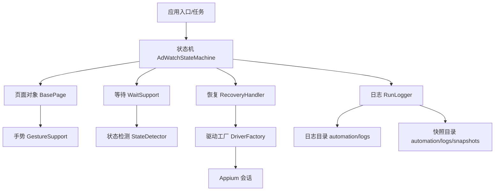
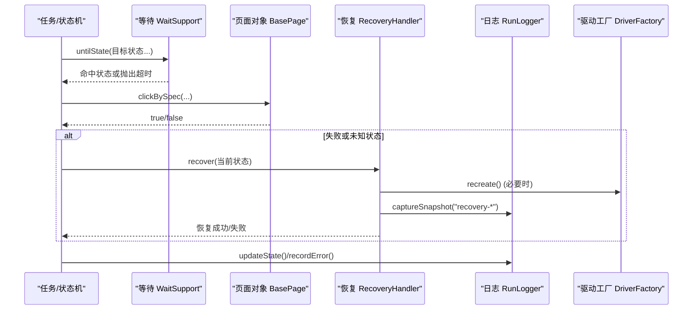
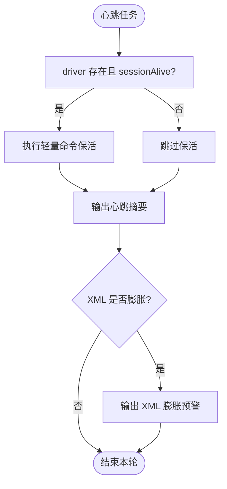
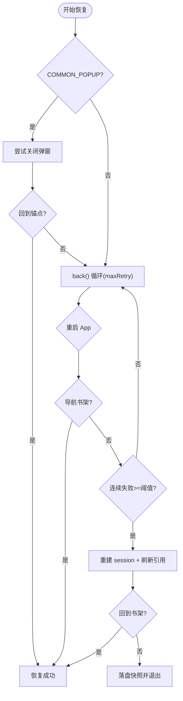
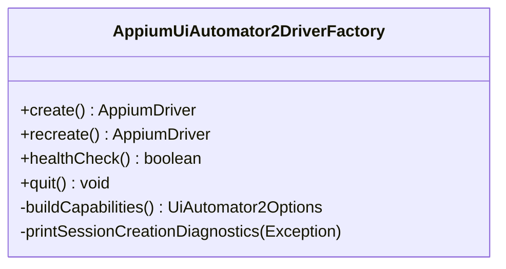
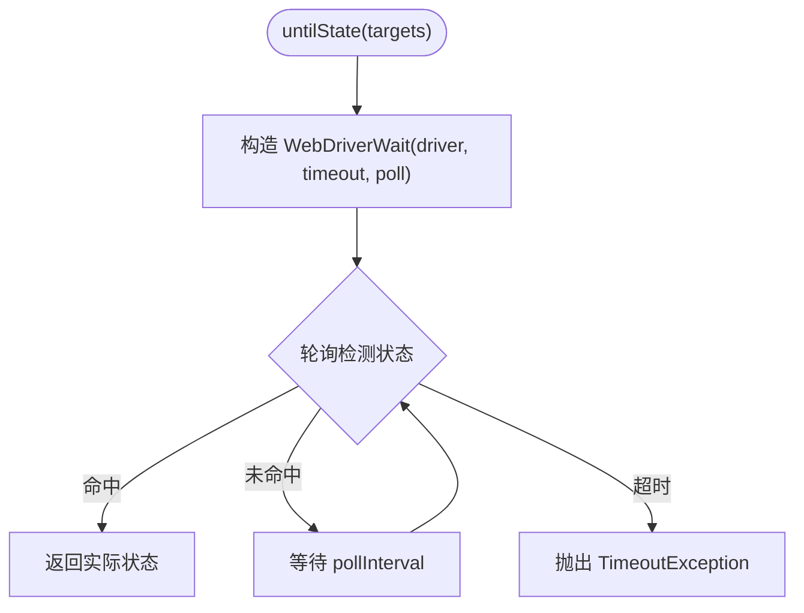
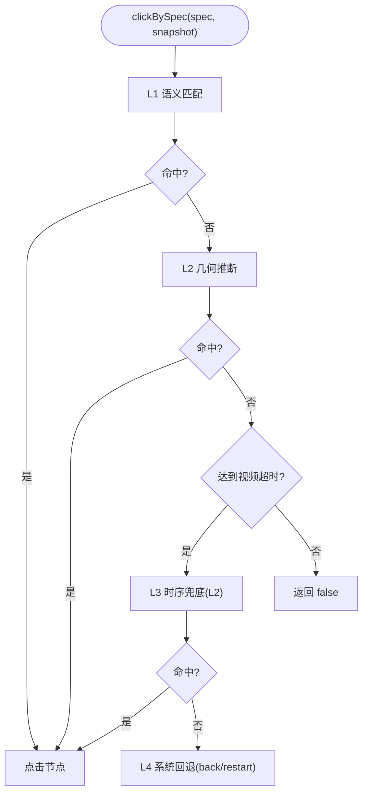
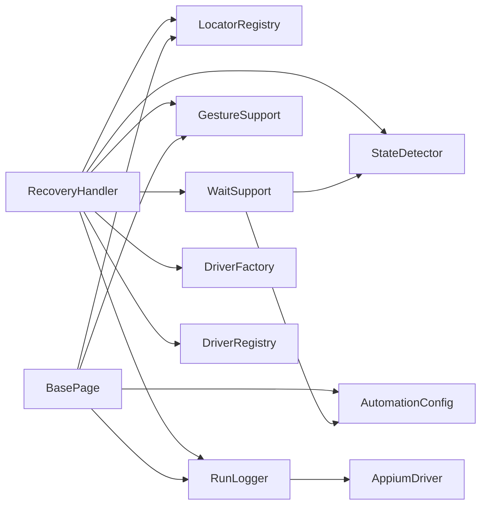

# 错误日志分析

<cite>
**本文引用的文件**
- [automation/logs/java-err.txt](file://automation/logs/java-err.txt)
- [automation/logs/run-err.txt](file://automation/logs/run-err.txt)
- [RunLogger.java](file://automation/src/main/java/com/fanqie/auto/core/RunLogger.java)
- [RecoveryHandler.java](file://automation/src/main/java/com/fanqie/auto/task/RecoveryHandler.java)
- [AppiumUiAutomator2DriverFactory.java](file://automation/src/main/java/com/fanqie/auto/core/AppiumUiAutomator2DriverFactory.java)
- [WaitSupport.java](file://automation/src/main/java/com/fanqie/auto/core/WaitSupport.java)
- [BasePage.java](file://automation/src/main/java/com/fanqie/auto/page/BasePage.java)
- [AutomationConfig.java](file://automation/src/main/java/com/fanqie/auto/config/AutomationConfig.java)
- [AdWatchStateMachine.java](file://automation/src/main/java/com/fanqie/auto/task/AdWatchStateMachine.java)
</cite>

## 目录
1. [简介](#简介)
2. [项目结构](#项目结构)
3. [核心组件](#核心组件)
4. [架构总览](#架构总览)
5. [详细组件分析](#详细组件分析)
6. [依赖关系分析](#依赖关系分析)
7. [性能考量](#性能考量)
8. [故障排查指南](#故障排查指南)
9. [结论](#结论)
10. [附录](#附录)

## 简介
本指南面向自动化测试运行过程中的错误日志分析，重点围绕 Java 异常堆栈与 Appium 交互异常进行系统化诊断。结合代码实现，梳理常见错误类型（如 Appium 连接异常、UI 元素定位失败、页面操作超时等），给出优先级判断、定位步骤、恢复策略与预防措施，帮助快速恢复并降低重复故障率。

## 项目结构
- 日志输出：
  - 文本运行日志：automation/logs/run-<时间戳>.log（由 RunLogger 统一落盘）
  - 快照与截图：automation/logs/snapshots/*.png, *.xml（异常/恢复时自动保存）
  - 运行时错误摘要：automation/logs/java-err.txt、run-err.txt（示例中为启动类路径错误）
- 关键模块：
  - 驱动创建与健康检查：AppiumUiAutomator2DriverFactory
  - 等待与重试：WaitSupport
  - 页面对象与四级定位降级：BasePage
  - 五级自愈恢复：RecoveryHandler
  - 运行日志与心跳保活：RunLogger
  - 全局配置：AutomationConfig
  - 状态机与退避：AdWatchStateMachine

图表来源
- [AdWatchStateMachine.java:281-310](file://automation/src/main/java/com/fanqie/auto/task/AdWatchStateMachine.java#L281-L310)
- [WaitSupport.java:56-86](file://automation/src/main/java/com/fanqie/auto/core/WaitSupport.java#L56-L86)
- [BasePage.java:84-91](file://automation/src/main/java/com/fanqie/auto/page/BasePage.java#L84-L91)
- [RecoveryHandler.java:100-253](file://automation/src/main/java/com/fanqie/auto/task/RecoveryHandler.java#L100-L253)
- [RunLogger.java:150-197](file://automation/src/main/java/com/fanqie/auto/core/RunLogger.java#L150-L197)
- [AppiumUiAutomator2DriverFactory.java:44-76](file://automation/src/main/java/com/fanqie/auto/core/AppiumUiAutomator2DriverFactory.java#L44-L76)

章节来源
- [RunLogger.java:94-130](file://automation/src/main/java/com/fanqie/auto/core/RunLogger.java#L94-L130)
- [AppiumUiAutomator2DriverFactory.java:126-178](file://automation/src/main/java/com/fanqie/auto/core/AppiumUiAutomator2DriverFactory.java#L126-L178)

## 核心组件
- RunLogger：负责长任务可观测性、心跳保活、异常/恢复时的截图与 XML 快照落盘、统计汇总。
- RecoveryHandler：五级恢复策略（弹窗关闭 → back → 重启 App → 导航书架 → 重建 session → 落盘退出）。
- AppiumUiAutomator2DriverFactory：Appium 会话创建、健康检查、能力构建、中文诊断提示。
- WaitSupport：统一显式等待、多目标状态等待、文案出现等待、指数退避重试。
- BasePage：四级定位降级链（语义匹配 → 几何推断 → 时序兜底 → 系统回退/重启）。
- AutomationConfig：集中化配置（超时、轮次、阈值、行为开关）。
- AdWatchStateMachine：状态流转、异常计数、退避与恢复触发。

章节来源
- [RunLogger.java:31-45](file://automation/src/main/java/com/fanqie/auto/core/RunLogger.java#L31-L45)
- [RecoveryHandler.java:23-43](file://automation/src/main/java/com/fanqie/auto/task/RecoveryHandler.java#L23-L43)
- [AppiumUiAutomator2DriverFactory.java:15-32](file://automation/src/main/java/com/fanqie/auto/core/AppiumUiAutomator2DriverFactory.java#L15-L32)
- [WaitSupport.java:16-25](file://automation/src/main/java/com/fanqie/auto/core/WaitSupport.java#L16-L25)
- [BasePage.java:18-39](file://automation/src/main/java/com/fanqie/auto/page/BasePage.java#L18-L39)
- [AutomationConfig.java:10-17](file://automation/src/main/java/com/fanqie/auto/config/AutomationConfig.java#L10-L17)

## 架构总览
下图展示从“任务执行”到“异常恢复”的端到端流程，以及各组件在错误处理中的职责边界。

图表来源
- [WaitSupport.java:56-86](file://automation/src/main/java/com/fanqie/auto/core/WaitSupport.java#L56-L86)
- [BasePage.java:84-91](file://automation/src/main/java/com/fanqie/auto/page/BasePage.java#L84-L91)
- [RecoveryHandler.java:100-253](file://automation/src/main/java/com/fanqie/auto/task/RecoveryHandler.java#L100-L253)
- [RunLogger.java:239-261](file://automation/src/main/java/com/fanqie/auto/core/RunLogger.java#L239-L261)
- [AppiumUiAutomator2DriverFactory.java:78-83](file://automation/src/main/java/com/fanqie/auto/core/AppiumUiAutomator2DriverFactory.java#L78-L83)

## 详细组件分析

### 运行日志与心跳保活（RunLogger）
- 职责
  - 独立守护线程每固定间隔执行轻量保活命令，避免长静默期断连。
  - 记录状态转移、进度指标、异常分布、XML 体积预警。
  - 异常/恢复时自动保存截图与 UI XML 快照至 snapshots 目录。
- 关键点
  - 心跳任务内部捕获所有异常，绝不让调度线程崩溃。
  - 会话断开标记供上层感知；重建后复位保活标志。
  - 日志与快照统一 UTF-8 写入，目录自动创建。

图表来源
- [RunLogger.java:162-197](file://automation/src/main/java/com/fanqie/auto/core/RunLogger.java#L162-L197)

章节来源
- [RunLogger.java:150-197](file://automation/src/main/java/com/fanqie/auto/core/RunLogger.java#L150-L197)
- [RunLogger.java:239-261](file://automation/src/main/java/com/fanqie/auto/core/RunLogger.java#L239-L261)
- [RunLogger.java:312-345](file://automation/src/main/java/com/fanqie/auto/core/RunLogger.java#L312-L345)

### 五级自愈恢复（RecoveryHandler）
- 恢复策略（由弱到强）
  1) COMMON_POPUP 弹窗关闭（按候选文案由弱到强尝试）
  2) 逐级 back()，每次 back 后重新 detect 确认锚点
  3) 重启 App，等待启动完成
  4) 主动导航到书架 Tab（必要时先关闭开屏广告/弹窗）
  5) 连续失败达到阈值时重建 session，刷新所有组件 driver 引用
  6) 仍失败则落盘快照并标记会话死亡，优雅退出
- 安全底线：超过最大恢复次数停止并保留现场，绝不盲目连点。

图表来源
- [RecoveryHandler.java:100-253](file://automation/src/main/java/com/fanqie/auto/task/RecoveryHandler.java#L100-L253)

章节来源
- [RecoveryHandler.java:100-253](file://automation/src/main/java/com/fanqie/auto/task/RecoveryHandler.java#L100-L253)

### Appium 会话创建与健康检查（AppiumUiAutomator2DriverFactory）
- 会话创建
  - 构建 UiAutomator2Options，设置 noReset、newCommandTimeout、华为/鸿蒙兼容能力等。
  - 立即设置 implicitlyWait=0，避免隐式等待破坏短轮询设计。
  - 创建失败时输出中文诊断信息，指导排查设备授权、ADB、Appium Server 等。
- 健康检查
  - 使用轻量命令探测会话存活，捕获 NoSuchSessionException/WebDriverException。
- 重建
  - 先 quit 旧会话再 create 新会话。

图表来源
- [AppiumUiAutomator2DriverFactory.java:44-76](file://automation/src/main/java/com/fanqie/auto/core/AppiumUiAutomator2DriverFactory.java#L44-L76)
- [AppiumUiAutomator2DriverFactory.java:85-118](file://automation/src/main/java/com/fanqie/auto/core/AppiumUiAutomator2DriverFactory.java#L85-L118)
- [AppiumUiAutomator2DriverFactory.java:126-178](file://automation/src/main/java/com/fanqie/auto/core/AppiumUiAutomator2DriverFactory.java#L126-L178)
- [AppiumUiAutomator2DriverFactory.java:184-208](file://automation/src/main/java/com/fanqie/auto/core/AppiumUiAutomator2DriverFactory.java#L184-L208)

章节来源
- [AppiumUiAutomator2DriverFactory.java:44-76](file://automation/src/main/java/com/fanqie/auto/core/AppiumUiAutomator2DriverFactory.java#L44-L76)
- [AppiumUiAutomator2DriverFactory.java:184-208](file://automation/src/main/java/com/fanqie/auto/core/AppiumUiAutomator2DriverFactory.java#L184-L208)

### 等待与重试（WaitSupport）
- 统一基于 WebDriverWait 的显式等待，杜绝散落 Thread.sleep。
- untilState 支持一次等待多个目标状态，适配翻页可能直接触发广告弹窗的场景。
- untilAnyTextPresent/untilSnapshotMatches 提供通用条件等待。
- runWithRetry 提供指数退避重试，缓解时序竞争导致的偶发失败。

图表来源
- [WaitSupport.java:56-86](file://automation/src/main/java/com/fanqie/auto/core/WaitSupport.java#L56-L86)
- [WaitSupport.java:199-222](file://automation/src/main/java/com/fanqie/auto/core/WaitSupport.java#L199-L222)

章节来源
- [WaitSupport.java:56-86](file://automation/src/main/java/com/fanqie/auto/core/WaitSupport.java#L56-L86)
- [WaitSupport.java:199-222](file://automation/src/main/java/com/fanqie/auto/core/WaitSupport.java#L199-L222)

### 页面对象与四级定位降级（BasePage）
- L1 语义属性匹配：text → content-desc → resource-id（精确/包含），命中多个用 boundsHint 裁决。
- L2 结构化几何推断：在指定区域查找 clickable=true 且面积较小的节点（受 allowGeometryFallback 保护）。
- L3 时序兜底：达到 adVideoTimeoutMs 后强制执行 L2 几何点击（同样受保护）。
- L4 系统兜底：navigate().back() 或重启 App。

图表来源
- [BasePage.java:84-91](file://automation/src/main/java/com/fanqie/auto/page/BasePage.java#L84-L91)
- [BasePage.java:150-189](file://automation/src/main/java/com/fanqie/auto/page/BasePage.java#L150-L189)
- [BasePage.java:203-219](file://automation/src/main/java/com/fanqie/auto/page/BasePage.java#L203-L219)
- [BasePage.java:227-250](file://automation/src/main/java/com/fanqie/auto/page/BasePage.java#L227-L250)

章节来源
- [BasePage.java:84-91](file://automation/src/main/java/com/fanqie/auto/page/BasePage.java#L84-L91)
- [BasePage.java:150-189](file://automation/src/main/java/com/fanqie/auto/page/BasePage.java#L150-L189)
- [BasePage.java:203-219](file://automation/src/main/java/com/fanqie/auto/page/BasePage.java#L203-L219)
- [BasePage.java:227-250](file://automation/src/main/java/com/fanqie/auto/page/BasePage.java#L227-L250)

### 状态机与异常计数（AdWatchStateMachine）
- 状态处理器执行异常时记录错误类型、增加连续错误计数。
- 达到 maxConsecutiveErrors 阈值触发 RecoveryHandler.recover()。
- 采用指数退避等待，避免频繁重试导致资源抖动。

章节来源
- [AdWatchStateMachine.java:281-310](file://automation/src/main/java/com/fanqie/auto/task/AdWatchStateMachine.java#L281-L310)

## 依赖关系分析
- RecoveryHandler 依赖：
  - LocatorRegistry（弹窗文案候选）、StateDetector（状态识别）、WaitSupport（等待）、GestureSupport（手势）、RunLogger（日志/快照）、DriverFactory（重建 session）、DriverRegistry（刷新 driver 引用）。
- BasePage 依赖：
  - AutomationConfig（超时/阈值）、LocatorRegistry（定位规格）、GestureSupport（点击）、RunLogger（心跳钩子）。
- WaitSupport 依赖：
  - StateDetector（获取快照与状态）、AutomationConfig（超时与轮询间隔）。
- RunLogger 依赖：
  - AutomationConfig（心跳间隔、阈值）、AppiumDriver（保活/快照）。

图表来源
- [RecoveryHandler.java:44-76](file://automation/src/main/java/com/fanqie/auto/task/RecoveryHandler.java#L44-L76)
- [BasePage.java:55-68](file://automation/src/main/java/com/fanqie/auto/page/BasePage.java#L55-L68)
- [WaitSupport.java:30-38](file://automation/src/main/java/com/fanqie/auto/core/WaitSupport.java#L30-L38)
- [RunLogger.java:54-59](file://automation/src/main/java/com/fanqie/auto/core/RunLogger.java#L54-L59)

章节来源
- [RecoveryHandler.java:44-76](file://automation/src/main/java/com/fanqie/auto/task/RecoveryHandler.java#L44-L76)
- [BasePage.java:55-68](file://automation/src/main/java/com/fanqie/auto/page/BasePage.java#L55-L68)
- [WaitSupport.java:30-38](file://automation/src/main/java/com/fanqie/auto/core/WaitSupport.java#L30-L38)
- [RunLogger.java:54-59](file://automation/src/main/java/com/fanqie/auto/core/RunLogger.java#L54-L59)

## 性能考量
- 隐式等待禁用：DriverFactory 创建后立即设置 implicitlyWait=0，确保全部等待走显式等待，避免阻塞。
- 心跳保活：每固定间隔执行轻量命令，防止长静默期触发 newCommandTimeout。
- 指数退避：WaitSupport.runWithRetry 与状态机 backoff 均使用指数退避，降低瞬时抖动影响。
- XML 体积预警：当 UI 树异常膨胀时输出预警，提示可能存在 UI 树泄漏。

章节来源
- [AppiumUiAutomator2DriverFactory.java:63-67](file://automation/src/main/java/com/fanqie/auto/core/AppiumUiAutomator2DriverFactory.java#L63-L67)
- [RunLogger.java:162-197](file://automation/src/main/java/com/fanqie/auto/core/RunLogger.java#L162-L197)
- [WaitSupport.java:199-222](file://automation/src/main/java/com/fanqie/auto/core/WaitSupport.java#L199-L222)
- [AdWatchStateMachine.java:655-670](file://automation/src/main/java/com/fanqie/auto/task/AdWatchStateMachine.java#L655-L670)

## 故障排查指南

### 常见错误分类与优先级
- 高优先级（阻断型）
  - Appium 会话创建失败/连接异常
  - 设备未授权/ADB不可用/仅充电模式调试未开启
  - 会话已断开（sessionAlive=false）
- 中优先级（功能受限）
  - UI 元素定位失败（text/desc/id 不匹配）
  - 页面操作超时（等待状态/文案超时）
  - 弹窗无法关闭（候选文案缺失或布局变化）
- 低优先级（可恢复/观察）
  - XML 体积异常膨胀
  - 偶发性网络/ADB抖动（通过重试/退避恢复）

### 典型错误诊断步骤

#### 1) Appium 连接异常（会话创建失败）
- 现象
  - 启动时报错，无法建立 Appium 会话。
  - 健康检查失败，抛出 NoSuchSessionException/WebDriverException。
- 定位要点
  - 查看 DriverFactory 输出的中文诊断信息，逐项核对设备授权、ADB、Appium Server 状态。
  - 检查配置文件中的 appium.server.url、platformName、automationName、deviceUdid 等。
- 恢复建议
  - 按诊断清单逐项修复（安装弹窗允许、开启 USB 调试、仅充电模式允许 ADB、重新插拔授权）。
  - 若会话损坏，调用 recreate() 重建并刷新所有组件 driver 引用。
- 相关实现
  - 会话创建与诊断输出：[AppiumUiAutomator2DriverFactory.java:44-76](file://automation/src/main/java/com/fanqie/auto/core/AppiumUiAutomator2DriverFactory.java#L44-L76)、[AppiumUiAutomator2DriverFactory.java:184-208](file://automation/src/main/java/com/fanqie/auto/core/AppiumUiAutomator2DriverFactory.java#L184-L208)
  - 健康检查：[AppiumUiAutomator2DriverFactory.java:85-118](file://automation/src/main/java/com/fanqie/auto/core/AppiumUiAutomator2DriverFactory.java#L85-L118)
  - 配置项：[AutomationConfig.java:112-164](file://automation/src/main/java/com/fanqie/auto/config/AutomationConfig.java#L112-L164)

#### 2) UI 元素定位失败
- 现象
  - 点击失败，未命中任何节点；或命中但不可点击。
- 定位要点
  - 检查 BasePage 四级降级链：L1 text/desc/id 是否匹配；L2 几何推断是否被 allowGeometryFallback 禁止；L3 时序兜底是否触发。
  - 查看当前快照（snapshots/*.xml）确认 UI 树结构与控件属性。
- 恢复建议
  - 更新 LocatorRegistry 的候选文案或 By 规则；必要时放宽几何推断范围。
  - 对激励视频场景，合理设置 adVideoTimeoutMs，使 L3 能在合适时机触发。
- 相关实现
  - 四级定位与裁决：[BasePage.java:84-91](file://automation/src/main/java/com/fanqie/auto/page/BasePage.java#L84-L91)、[BasePage.java:150-189](file://automation/src/main/java/com/fanqie/auto/page/BasePage.java#L150-L189)、[BasePage.java:203-219](file://automation/src/main/java/com/fanqie/auto/page/BasePage.java#L203-L219)
  - 配置阈值：[AutomationConfig.java:190-204](file://automation/src/main/java/com/fanqie/auto/config/AutomationConfig.java#L190-L204)

#### 3) 页面操作超时
- 现象
  - 等待状态/文案超时，抛出 TimeoutException。
- 定位要点
  - 检查 WaitSupport.untilState/untilAnyTextPresent 的超时与轮询间隔配置。
  - 查看当前状态检测结果，确认是否进入预期状态（如广告弹窗、章节结束等）。
- 恢复建议
  - 调整 actionTimeoutMs、stateDetectTimeoutMs、adVideoTimeoutMs 等参数。
  - 使用 runWithRetry 对易抖动作进行指数退避重试。
- 相关实现
  - 等待原语：[WaitSupport.java:56-86](file://automation/src/main/java/com/fanqie/auto/core/WaitSupport.java#L56-L86)、[WaitSupport.java:128-151](file://automation/src/main/java/com/fanqie/auto/core/WaitSupport.java#L128-L151)
  - 重试机制：[WaitSupport.java:199-222](file://automation/src/main/java/com/fanqie/auto/core/WaitSupport.java#L199-L222)
  - 配置项：[AutomationConfig.java:182-208](file://automation/src/main/java/com/fanqie/auto/config/AutomationConfig.java#L182-L208)

#### 4) 弹窗无法关闭
- 现象
  - 处于 COMMON_POPUP 状态，无法关闭。
- 定位要点
  - 检查 LocatorRegistry.commonDismissTexts() 候选文案是否覆盖当前弹窗文案或 content-desc。
  - 查看快照确认按钮是否存在、是否可点击、是否有 bounds。
- 恢复建议
  - 补充候选文案；必要时启用几何推断（注意误点防护）。
  - 若多次失败，交由 RecoveryHandler 继续 back/重启/导航书架。
- 相关实现
  - 弹窗关闭逻辑：[RecoveryHandler.java:269-321](file://automation/src/main/java/com/fanqie/auto/task/RecoveryHandler.java#L269-L321)
  - 恢复流程：[RecoveryHandler.java:100-253](file://automation/src/main/java/com/fanqie/auto/task/RecoveryHandler.java#L100-L253)

#### 5) 会话断开与保活失效
- 现象
  - 心跳保活失败，sessionAlive=false；后续操作静默失败。
- 定位要点
  - 查看 RunLogger 心跳日志与警告；检查 Appium Server 状态与设备连接。
- 恢复建议
  - 调用 DriverFactory.healthCheck() 检测；必要时 recreate() 并刷新所有组件 driver 引用。
  - 确保 refreshDriver() 被正确调用以复位保活标志。
- 相关实现
  - 心跳保活与标记：[RunLogger.java:162-197](file://automation/src/main/java/com/fanqie/auto/core/RunLogger.java#L162-L197)、[RunLogger.java:268-278](file://automation/src/main/java/com/fanqie/auto/core/RunLogger.java#L268-L278)
  - 会话重建与刷新：[RecoveryHandler.java:212-244](file://automation/src/main/java/com/fanqie/auto/task/RecoveryHandler.java#L212-L244)

### 错误恢复策略与预防措施
- 恢复策略
  - 优先尝试无副作用的弹窗关闭；其次 back；再次重启 App；然后导航书架；最后重建 session。
  - 超过最大恢复次数保留现场并退出，避免盲目连点造成更大损失。
- 预防措施
  - 保持 noReset=true，避免丢失登录态与书架数据。
  - 合理设置 newCommandTimeout 与心跳间隔，避免长静默断连。
  - 定期校验 LocatorRegistry 的文案与 By 规则，及时适配 UI 变更。
  - 监控 XML 体积，发现异常膨胀及时排查 UI 树泄漏。

章节来源
- [RecoveryHandler.java:23-43](file://automation/src/main/java/com/fanqie/auto/task/RecoveryHandler.java#L23-L43)
- [AppiumUiAutomator2DriverFactory.java:139-158](file://automation/src/main/java/com/fanqie/auto/core/AppiumUiAutomator2DriverFactory.java#L139-L158)
- [RunLogger.java:188-192](file://automation/src/main/java/com/fanqie/auto/core/RunLogger.java#L188-L192)

## 结论
本指南基于代码实现，系统化梳理了自动化运行中的错误日志分析方法与恢复策略。通过心跳保活、四级定位降级、五级自愈恢复与统一等待原语，项目在复杂 UI 与长任务场景下具备较强的鲁棒性与可观测性。建议在日常维护中持续优化定位规则与超时配置，并结合快照与日志进行问题复盘，持续提升稳定性。

## 附录

### 日志文件说明
- java-err.txt / run-err.txt：示例中记录了启动类路径错误（找不到或无法加载主类），属于环境/启动配置问题，需检查运行命令与类路径。
- run-<时间戳>.log：运行过程日志，包含心跳、状态转移、统计汇总等。
- snapshots/*.png, *.xml：异常/恢复时自动保存的现场快照，用于定位 UI 状态与元素属性。

章节来源
- [automation/logs/java-err.txt:1-3](file://automation/logs/java-err.txt#L1-L3)
- [automation/logs/run-err.txt:1-3](file://automation/logs/run-err.txt#L1-L3)
- [RunLogger.java:94-130](file://automation/src/main/java/com/fanqie/auto/core/RunLogger.java#L94-L130)
- [RunLogger.java:239-261](file://automation/src/main/java/com/fanqie/auto/core/RunLogger.java#L239-L261)