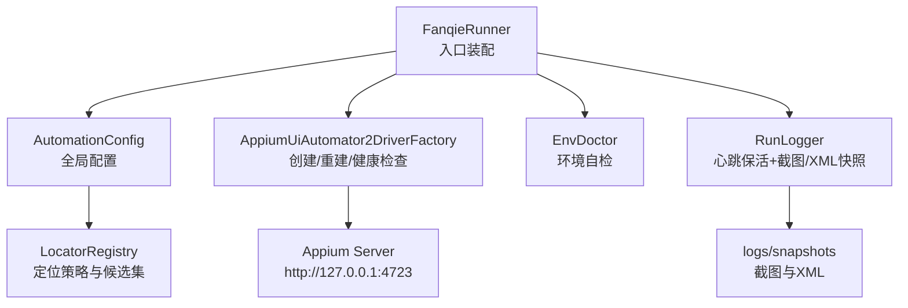
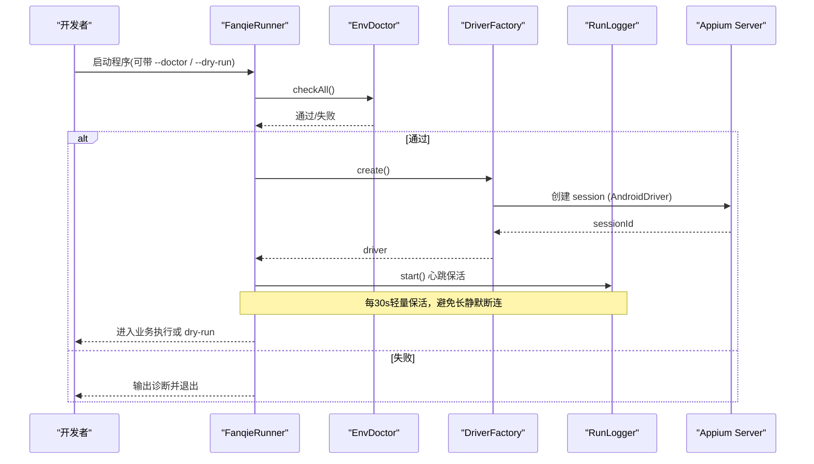
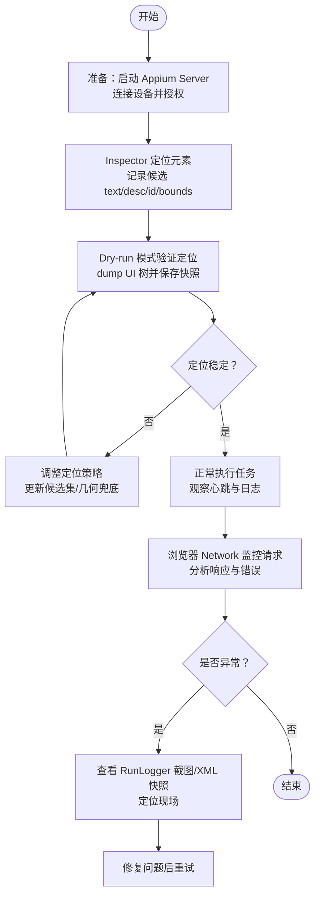
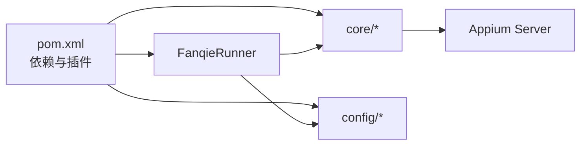

# 外部调试工具集成

<cite>
**本文引用的文件**
- [pom.xml](file://automation/pom.xml)
- [FanqieRunner.java](file://automation/src/main/java/com/fanqie/auto/FanqieRunner.java)
- [AutomationConfig.java](file://automation/src/main/java/com/fanqie/auto/config/AutomationConfig.java)
- [AppiumUiAutomator2DriverFactory.java](file://automation/src/main/java/com/fanqie/auto/core/AppiumUiAutomator2DriverFactory.java)
- [EnvDoctor.java](file://automation/src/main/java/com/fanqie/auto/core/EnvDoctor.java)
- [RunLogger.java](file://automation/src/main/java/com/fanqie/auto/core/RunLogger.java)
- [UiSnapshot.java](file://automation/src/main/java/com/fanqie/auto/core/UiSnapshot.java)
- [LocatorRegistry.java](file://automation/src/main/java/com/fanqie/auto/config/LocatorRegistry.java)
</cite>

## 目录
1. [简介](#简介)
2. [项目结构](#项目结构)
3. [核心组件](#核心组件)
4. [架构总览](#架构总览)
5. [详细组件分析](#详细组件分析)
6. [依赖关系分析](#依赖关系分析)
7. [性能与稳定性要点](#性能与稳定性要点)
8. [故障排查指南](#故障排查指南)
9. [结论](#结论)
10. [附录：常用命令与操作清单](#附录常用命令与操作清单)

## 简介
本指南面向使用 Appium 进行 UI 自动化的工程师，聚焦“外部调试工具集成”的实操方法。内容涵盖：
- 使用 Appium Inspector 进行元素定位调试（连接、查找、属性查看）
- 使用 ADB 命令检查设备状态、管理应用、抓取日志
- 使用浏览器开发者工具分析 Appium 网络请求（HTTP 监控、响应数据）
- 多工具协同的完整调试工作流
- 常见调试场景的步骤与注意事项

本仓库已内置环境自检、会话保活、快照落盘等能力，可作为调试时的参考实现与辅助手段。

## 项目结构
本项目基于 Maven + Java Client 9.5.0 + Selenium BOM 4.34.0，采用分层组织：
- 配置层：自动化参数、定位器候选集
- 核心层：驱动工厂、环境自检、运行日志、UI 快照解析
- 页面/任务层：业务页封装与任务编排（不在本指南展开）
- 资源层：properties 配置文件

图表来源
- [FanqieRunner.java:41-238](file://automation/src/main/java/com/fanqie/auto/FanqieRunner.java#L41-L238)
- [AppiumUiAutomator2DriverFactory.java:44-118](file://automation/src/main/java/com/fanqie/auto/core/AppiumUiAutomator2DriverFactory.java#L44-L118)
- [EnvDoctor.java:48-71](file://automation/src/main/java/com/fanqie/auto/core/EnvDoctor.java#L48-L71)
- [RunLogger.java:87-156](file://automation/src/main/java/com/fanqie/auto/core/RunLogger.java#L87-L156)
- [LocatorRegistry.java:52-65](file://automation/src/main/java/com/fanqie/auto/config/LocatorRegistry.java#L52-L65)

章节来源
- [pom.xml:15-83](file://automation/pom.xml#L15-L83)
- [FanqieRunner.java:41-238](file://automation/src/main/java/com/fanqie/auto/FanqieRunner.java#L41-L238)

## 核心组件
- 配置加载器：集中管理 Appium、时序、流程等参数，支持外部覆盖
- 驱动工厂：构建 UiAutomator2Options，设置 noReset、超时、华为/鸿蒙兼容项，强制隐式等待为 0
- 环境自检：校验 ANDROID_HOME/SDK、adb、设备在线、Appium Server 就绪、App 安装
- 运行日志：心跳保活、异常截图与 XML 快照、统计汇总
- UI 快照：安全解析 XML，提供内存级查询 API（text/content-desc/resource-id/区域点击）
- 定位器注册表：维护各控件的主/备定位策略与几何兜底开关

章节来源
- [AutomationConfig.java:110-178](file://automation/src/main/java/com/fanqie/auto/config/AutomationConfig.java#L110-L178)
- [AppiumUiAutomator2DriverFactory.java:120-178](file://automation/src/main/java/com/fanqie/auto/core/AppiumUiAutomator2DriverFactory.java#L120-L178)
- [EnvDoctor.java:75-194](file://automation/src/main/java/com/fanqie/auto/core/EnvDoctor.java#L75-L194)
- [RunLogger.java:144-261](file://automation/src/main/java/com/fanqie/auto/core/RunLogger.java#L144-L261)
- [UiSnapshot.java:78-254](file://automation/src/main/java/com/fanqie/auto/core/UiSnapshot.java#L78-L254)
- [LocatorRegistry.java:150-256](file://automation/src/main/java/com/fanqie/auto/config/LocatorRegistry.java#L150-L256)

## 架构总览
下图展示从启动到执行的关键调用链，以及调试工具的介入点。

图表来源
- [FanqieRunner.java:41-238](file://automation/src/main/java/com/fanqie/auto/FanqieRunner.java#L41-L238)
- [AppiumUiAutomator2DriverFactory.java:44-118](file://automation/src/main/java/com/fanqie/auto/core/AppiumUiAutomator2DriverFactory.java#L44-L118)
- [EnvDoctor.java:48-71](file://automation/src/main/java/com/fanqie/auto/core/EnvDoctor.java#L48-L71)
- [RunLogger.java:144-197](file://automation/src/main/java/com/fanqie/auto/core/RunLogger.java#L144-L197)

## 详细组件分析

### Appium Inspector 元素定位调试
- 连接配置
  - 确保 Appium Server 已启动且可访问（默认 http://127.0.0.1:4723）
  - 在 Inspector 中填写 Desired Capabilities：platformName=Android、automationName=UiAutomator2、appPackage=com.dragon.read、noReset=true、newCommandTimeout 足够大
  - 若需指定设备，填入 udid；否则自动选择第一个在线设备
- 元素查找
  - 使用 XPath/CSS/ID 等定位器尝试匹配目标控件
  - 结合 LocatorRegistry 的设计思路：优先文本/描述匹配，其次 resource-id，必要时启用几何兜底（如右上角小区域 clickable）
- 属性查看
  - 查看 text、content-desc、resource-id、bounds、clickable 等关键属性
  - 对文案漂移或 ID 混淆的场景，准备多个候选值（同 LocatorRegistry 的候选集思想）
- 与项目配合
  - 使用项目的 Dry-run 模式仅 dump UI 树不执行点击，便于验证定位策略
  - 利用 RunLogger 的截图与 XML 快照落盘，快速对比当前 UI 树与预期差异

章节来源
- [AutomationConfig.java:110-178](file://automation/src/main/java/com/fanqie/auto/config/AutomationConfig.java#L110-L178)
- [AppiumUiAutomator2DriverFactory.java:120-178](file://automation/src/main/java/com/fanqie/auto/core/AppiumUiAutomator2DriverFactory.java#L120-L178)
- [LocatorRegistry.java:150-256](file://automation/src/main/java/com/fanqie/auto/config/LocatorRegistry.java#L150-L256)
- [RunLogger.java:231-261](file://automation/src/main/java/com/fanqie/auto/core/RunLogger.java#L231-L261)

### ADB 命令使用方法
- 设备状态检查
  - adb devices -l：查看设备列表与状态（device/unauthorized/offline）
  - adb shell getprop | findstr ro.build.version：查看系统版本
- 应用管理
  - adb shell pm list packages | findstr dragon：确认包名是否安装
  - adb shell am force-stop <package>：停止应用
  - adb shell monkey -p <package> -c android.intent.category.LAUNCHER 1：启动应用
- 日志查看
  - adb logcat -v time > log.txt：抓取系统与应用日志
  - adb shell dumpsys activity top：查看前台 Activity
- 与项目配合
  - EnvDoctor 内部通过 ProcessBuilder 执行 adb 命令并解析结果，给出中文处置指引
  - 当出现未授权/离线时，按提示逐项排查（USB 调试、仅充电允许 ADB 调试、首次授权弹窗等）

章节来源
- [EnvDoctor.java:90-140](file://automation/src/main/java/com/fanqie/auto/core/EnvDoctor.java#L90-L140)
- [EnvDoctor.java:178-194](file://automation/src/main/java/com/fanqie/auto/core/EnvDoctor.java#L178-L194)
- [EnvDoctor.java:196-210](file://automation/src/main/java/com/fanqie/auto/core/EnvDoctor.java#L196-L210)

### 浏览器开发者工具分析 Appium 网络请求
- 开启 Appium 服务器日志
  - 以 Node.js 方式启动 Appium Server，启用 verbose 日志以便浏览器抓包
- 抓包步骤
  - 在浏览器打开 http://127.0.0.1:4723/status，确认 ready
  - 使用浏览器开发者工具的 Network 面板，过滤 XHR/Fetch，观察 Appium 会话创建、元素查找、手势等请求
- 分析要点
  - 关注请求体中的 capabilities、元素定位表达式
  - 关注响应体中的 sessionId、错误信息（如 InvalidSessionIdException、NoSuchElementException）
  - 结合 RunLogger 的心跳与快照，交叉验证断连与 UI 变化
- 与项目配合
  - AppiumUiAutomator2DriverFactory 会输出 server URL、包名、UDID 等信息，便于在 Network 面板中对应请求
  - 若 session 频繁断开，检查 newCommandTimeout 与心跳间隔

章节来源
- [AppiumUiAutomator2DriverFactory.java:51-69](file://automation/src/main/java/com/fanqie/auto/core/AppiumUiAutomator2DriverFactory.java#L51-L69)
- [RunLogger.java:144-197](file://automation/src/main/java/com/fanqie/auto/core/RunLogger.java#L144-L197)

### 多工具协同的调试工作流

[此图为概念流程图，无需源码映射]

## 依赖关系分析
- Maven 依赖矩阵锁定：java-client 9.5.0 与 selenium-bom 4.34.0 一对一兼容
- 运行时依赖：Appium Server、ADB、Android SDK（可选）、Node.js（用于 Appium Server）
- 模块内依赖：Runner 装配 Config → DriverFactory → Logger；EnvDoctor 独立于 Driver；LocatorRegistry 被 Page/Task 复用

图表来源
- [pom.xml:15-83](file://automation/pom.xml#L15-L83)
- [FanqieRunner.java:41-238](file://automation/src/main/java/com/fanqie/auto/FanqieRunner.java#L41-L238)

章节来源
- [pom.xml:15-83](file://automation/pom.xml#L15-L83)

## 性能与稳定性要点
- 立即禁用隐式等待：创建 driver 后设置 implicitlyWait(Duration.ZERO)，避免阻塞短轮询
- 心跳保活：每 30 秒执行轻量 getWindowSize()，防止广告视频静默期触发断连
- 超时配置：newCommandTimeout 放大至 1800s；UiAutomator2 Server 启动/安装超时放宽，适配华为/鸿蒙首装慢
- 无重置策略：noReset=true 保留登录态与书架数据，适合长任务
- XML 解析安全：防御 XXE，非线程安全的 DocumentBuilderFactory 每次新建实例
- 快照与日志：异常/恢复时自动截图与 XML 落盘，便于回溯

章节来源
- [AppiumUiAutomator2DriverFactory.java:61-69](file://automation/src/main/java/com/fanqie/auto/core/AppiumUiAutomator2DriverFactory.java#L61-L69)
- [AppiumUiAutomator2DriverFactory.java:142-171](file://automation/src/main/java/com/fanqie/auto/core/AppiumUiAutomator2DriverFactory.java#L142-L171)
- [RunLogger.java:144-197](file://automation/src/main/java/com/fanqie/auto/core/RunLogger.java#L144-L197)
- [UiSnapshot.java:78-98](file://automation/src/main/java/com/fanqie/auto/core/UiSnapshot.java#L78-L98)

## 故障排查指南
- 环境自检失败
  - 检查 ANDROID_HOME/SDK_ROOT、adb 可用、设备在线、Appium Server 就绪、App 已安装
  - 按 EnvDoctor 输出的中文指引逐项处理
- 会话创建失败
  - 常见原因：APK 安装弹窗未处理、仅充电模式下 ADB 调试未开、USB 调试未授权、Appium Server 未启动
  - 使用 AppiumUiAutomator2DriverFactory 的诊断输出对照排查
- 会话频繁断开
  - 检查 newCommandTimeout 与心跳间隔；确认业务逻辑长时间无交互时仍有心跳保活
- 元素定位不稳定
  - 使用 Inspector 获取最新 text/desc/id/bounds；更新 LocatorRegistry 候选集
  - 对关闭按钮启用几何兜底（右上角小区域 clickable），其他按钮谨慎启用
- 日志与快照
  - 查看 RunLogger 生成的 run-*.log 与 snapshots/*.png/*.xml
  - 结合浏览器 Network 分析请求与响应，定位服务端错误

章节来源
- [EnvDoctor.java:48-71](file://automation/src/main/java/com/fanqie/auto/core/EnvDoctor.java#L48-L71)
- [EnvDoctor.java:90-194](file://automation/src/main/java/com/fanqie/auto/core/EnvDoctor.java#L90-L194)
- [AppiumUiAutomator2DriverFactory.java:180-208](file://automation/src/main/java/com/fanqie/auto/core/AppiumUiAutomator2DriverFactory.java#L180-L208)
- [RunLogger.java:231-261](file://automation/src/main/java/com/fanqie/auto/core/RunLogger.java#L231-L261)

## 结论
通过 Appium Inspector、ADB、浏览器开发者工具与本项目的自检、保活、快照能力，可以形成高效稳定的调试闭环：先环境自检，再 Inspector 定位与 Dry-run 验证，随后正常执行并用 Network 与日志快照持续观测。遇到异常时，依据 EnvDoctor 与 RunLogger 的输出快速定位与修复。

## 附录：常用命令与操作清单
- 启动前准备
  - 启动 Appium Server：appium --base-path /
  - 检查设备：adb devices -l
  - 检查 App 安装：adb shell pm list packages | findstr dragon
- 运行与调试
  - 仅环境自检：--doctor
  - 仅连接并 dump UI 树：--dry-run
  - 指定外部配置：--config <path>
  - 覆盖循环/页数：--cycles N / --pages N
  - 重置进度：--reset-progress
- 日志与快照
  - 查看运行日志：automation/logs/run-*.log
  - 查看异常快照：automation/logs/snapshots/*.png/*.xml
- 浏览器 Network
  - 打开 http://127.0.0.1:4723/status 确认 ready
  - 在 Network 面板过滤 XHR/Fetch，观察会话创建与元素查找请求

章节来源
- [FanqieRunner.java:41-249](file://automation/src/main/java/com/fanqie/auto/FanqieRunner.java#L41-L249)
- [RunLogger.java:94-130](file://automation/src/main/java/com/fanqie/auto/core/RunLogger.java#L94-L130)
- [AppiumUiAutomator2DriverFactory.java:51-69](file://automation/src/main/java/com/fanqie/auto/core/AppiumUiAutomator2DriverFactory.java#L51-L69)