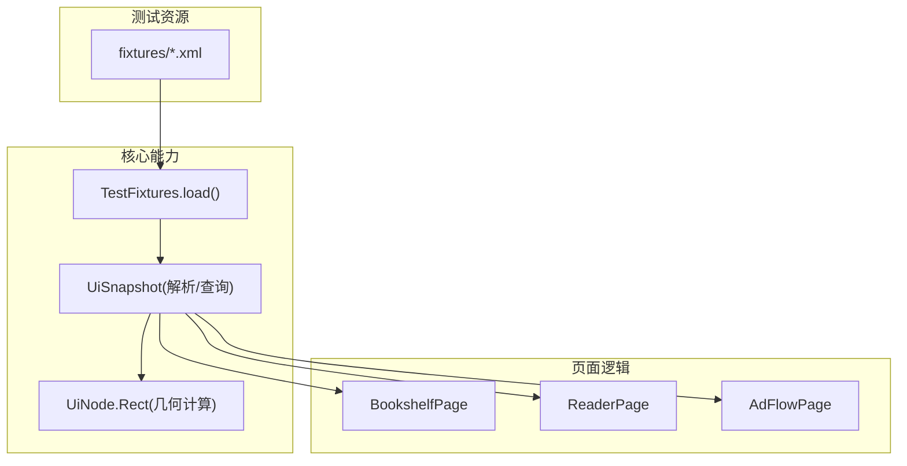
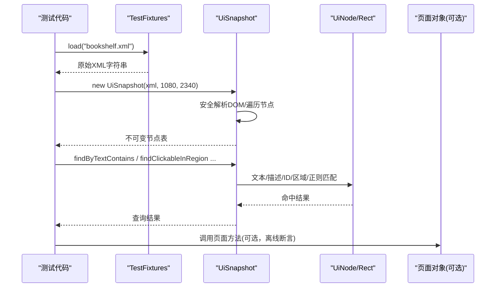
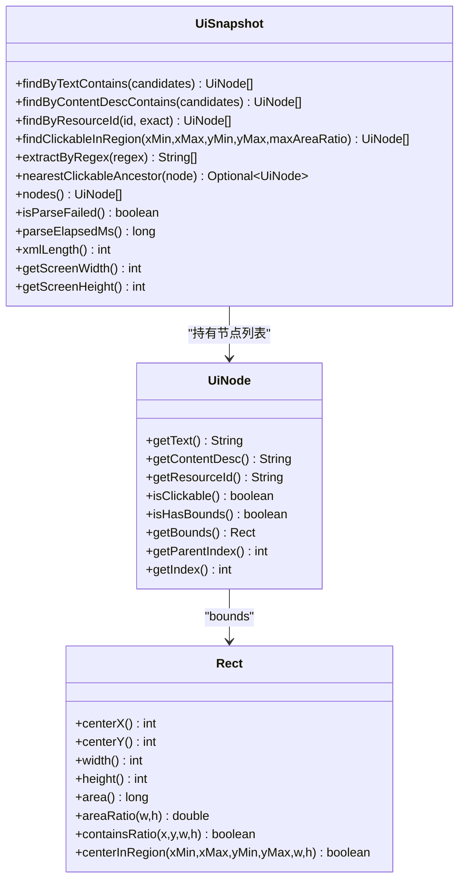
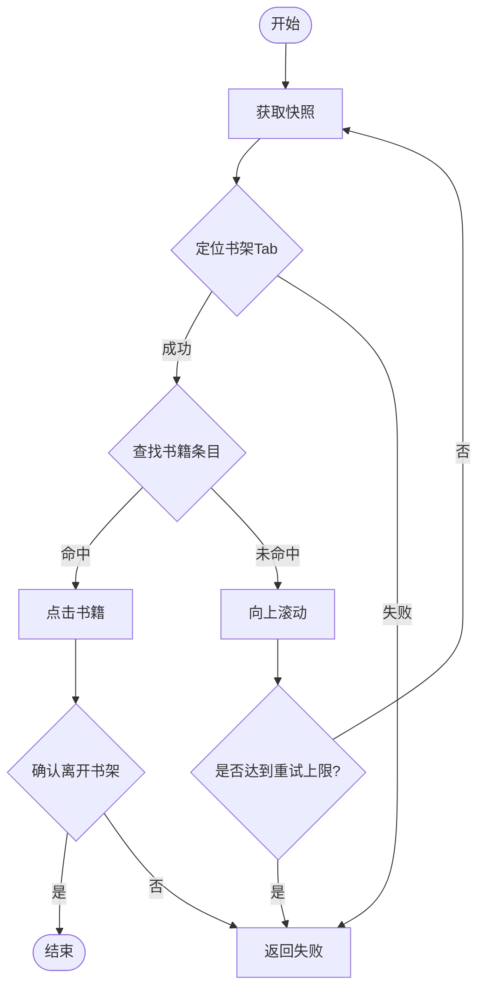
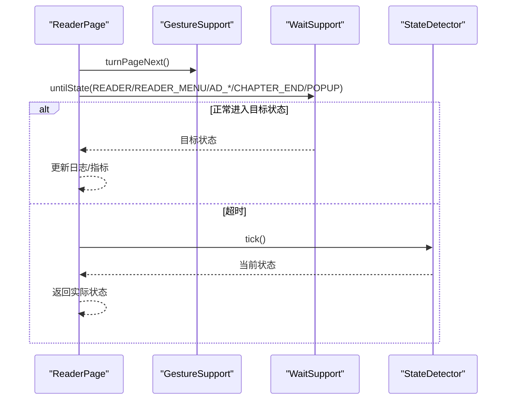
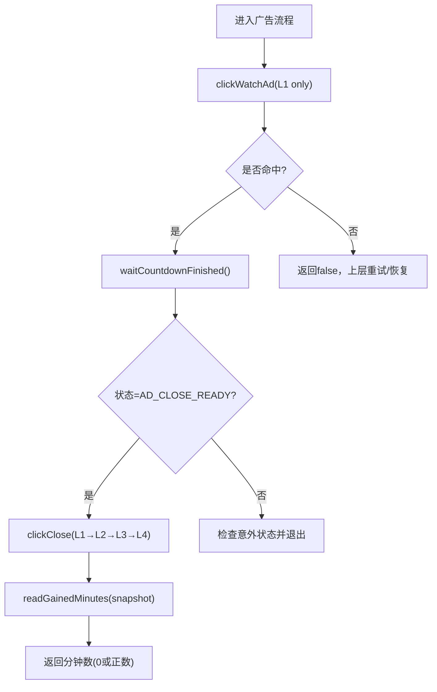
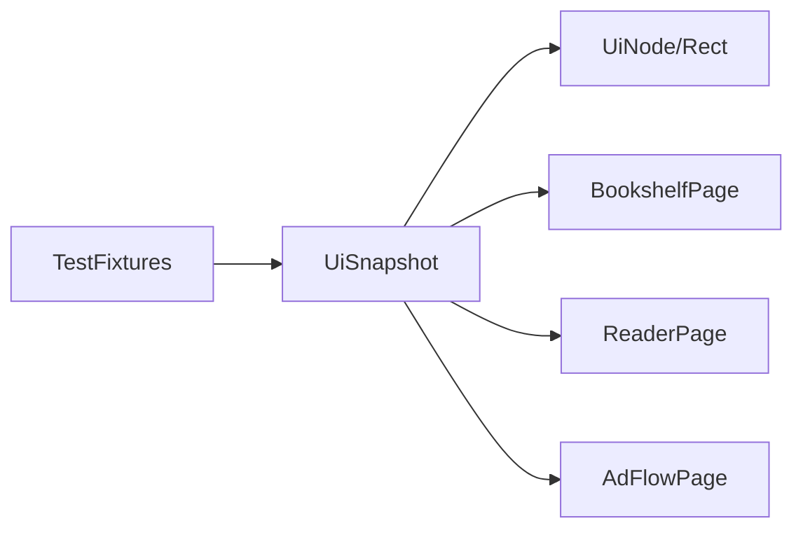

# 测试夹具与离线调试

<cite>
**本文引用的文件**
- [TestFixtures.java](file://automation/src/test/java/com/fanqie/auto/TestFixtures.java)
- [UiSnapshot.java](file://automation/src/main/java/com/fanqie/auto/core/UiSnapshot.java)
- [UiNode.java](file://automation/src/main/java/com/fanqie/auto/core/UiNode.java)
- [BookshelfPage.java](file://automation/src/main/java/com/fanqie/auto/page/BookshelfPage.java)
- [ReaderPage.java](file://automation/src/main/java/com/fanqie/auto/page/ReaderPage.java)
- [AdFlowPage.java](file://automation/src/main/java/com/fanqie/auto/page/AdFlowPage.java)
- [UiSnapshotTest.java](file://automation/src/test/java/com/fanqie/auto/core/UiSnapshotTest.java)
- [AdFlowPageTest.java](file://automation/src/test/java/com/fanqie/auto/page/AdFlowPageTest.java)
- [bookshelf.xml](file://automation/src/test/resources/fixtures/bookshelf.xml)
- [reader.xml](file://automation/src/test/resources/fixtures/reader.xml)
- [ad_video_playing.xml](file://automation/src/test/resources/fixtures/ad_video_playing.xml)
- [malformed.xml](file://automation/src/test/resources/fixtures/malformed.xml)
- [ad_close_ready.xml](file://automation/src/test/resources/fixtures/ad_close_ready.xml)
- [splash_ad.xml](file://automation/src/test/resources/fixtures/splash_ad.xml)
- [nested_clickable.xml](file://automation/src/test/resources/fixtures/nested_clickable.xml)
</cite>

## 目录
1. [简介](#简介)
2. [项目结构](#项目结构)
3. [核心组件](#核心组件)
4. [架构总览](#架构总览)
5. [详细组件分析](#详细组件分析)
6. [依赖关系分析](#依赖关系分析)
7. [性能考量](#性能考量)
8. [故障排查指南](#故障排查指南)
9. [结论](#结论)
10. [附录](#附录)

## 简介
本文件面向“测试夹具（TestFixtures）与离线调试”的完整实践，覆盖以下目标：
- 如何使用 XML 快照进行离线调试：以书架页面、阅读器页面、广告播放页等典型场景为例，说明 UI 结构与定位策略。
- TestFixtures 类提供的测试数据加载方法：如何从 fixtures 目录读取 XML，并用于无真机、无 Appium 的纯内存回放。
- UI 快照文件格式规范与解析方法：XML 层级、节点属性、坐标格式、安全解析与健壮性。
- 通过比较不同状态的快照定位 UI 变化问题：差异对比思路与实操建议。
- 离线测试最佳实践与问题复现技巧：常见陷阱、回归验证、稳定性保障。

## 项目结构
本项目将“离线测试数据”与“UI 快照解析/查询能力”解耦：
- 测试夹具位于 test resources 的 fixtures 目录，提供多场景 XML 快照。
- 核心解析与查询在 core 包中实现，提供 UiSnapshot、UiNode 等不可变数据结构与高效 API。
- 页面对象（page 包）基于 StateDetector、LocatorRegistry、GestureSupport 等构建真实自动化流程；其单元测试可复用 fixtures 做离线验证。

图表来源
- [TestFixtures.java:27-51](file://automation/src/test/java/com/fanqie/auto/TestFixtures.java#L27-L51)
- [UiSnapshot.java:21-72](file://automation/src/main/java/com/fanqie/auto/core/UiSnapshot.java#L21-L72)
- [UiNode.java:85-218](file://automation/src/main/java/com/fanqie/auto/core/UiNode.java#L85-L218)
- [BookshelfPage.java:169-216](file://automation/src/main/java/com/fanqie/auto/page/BookshelfPage.java#L169-L216)
- [ReaderPage.java:69-96](file://automation/src/main/java/com/fanqie/auto/page/ReaderPage.java#L69-L96)
- [AdFlowPage.java:116-163](file://automation/src/main/java/com/fanqie/auto/page/AdFlowPage.java#L116-L163)

章节来源
- [TestFixtures.java:27-51](file://automation/src/test/java/com/fanqie/auto/TestFixtures.java#L27-L51)
- [UiSnapshot.java:21-72](file://automation/src/main/java/com/fanqie/auto/core/UiSnapshot.java#L21-L72)
- [UiNode.java:85-218](file://automation/src/main/java/com/fanqie/auto/core/UiNode.java#L85-L218)

## 核心组件
- TestFixtures：统一从 classpath 的 fixtures 目录读取 XML，强制 UTF-8 编码，避免中文乱码导致匹配失败。
- UiSnapshot：一次抓取后的内存快照，提供文本/描述/资源ID/区域/正则提取等查询 API，零 RPC。
- UiNode.Rect：矩形与比例计算，支撑几何特征匹配（如右上角关闭按钮）。
- 页面对象：BookshelfPage/ReaderPage/AdFlowPage 使用上述能力完成真实自动化流程；其单元测试可完全离线运行。

章节来源
- [TestFixtures.java:27-51](file://automation/src/test/java/com/fanqie/auto/TestFixtures.java#L27-L51)
- [UiSnapshot.java:131-228](file://automation/src/main/java/com/fanqie/auto/core/UiSnapshot.java#L131-L228)
- [UiNode.java:85-218](file://automation/src/main/java/com/fanqie/auto/core/UiNode.java#L85-L218)
- [BookshelfPage.java:169-216](file://automation/src/main/java/com/fanqie/auto/page/BookshelfPage.java#L169-L216)
- [ReaderPage.java:69-96](file://automation/src/main/java/com/fanqie/auto/page/ReaderPage.java#L69-L96)
- [AdFlowPage.java:116-163](file://automation/src/main/java/com/fanqie/auto/page/AdFlowPage.java#L116-L163)

## 架构总览
离线调试的关键路径：
- 用 TestFixtures.load(name) 读取 fixtures 中的 XML。
- 构造 UiSnapshot(xml, width, height)，内部安全解析 DOM，生成不可变的 UiNode 列表。
- 通过 UiSnapshot 的多种查询 API 进行断言或驱动页面逻辑（例如 BookshelfPage/ReaderPage/AdFlowPage 的离线用例）。

图表来源
- [TestFixtures.java:27-51](file://automation/src/test/java/com/fanqie/auto/TestFixtures.java#L27-L51)
- [UiSnapshot.java:78-98](file://automation/src/main/java/com/fanqie/auto/core/UiSnapshot.java#L78-L98)
- [UiNode.java:113-152](file://automation/src/main/java/com/fanqie/auto/core/UiNode.java#L113-L152)

## 详细组件分析

### 测试夹具加载器：TestFixtures
- 职责：从 fixtures 目录读取 XML 为字符串，强制 UTF-8 编码，保证中文文案正确匹配。
- 关键点：
  - 屏幕尺寸常量：1080x2340，所有 fixture 的 bounds 均基于此坐标系。
  - 异常处理：不存在或 IO 异常时抛出 IllegalStateException，便于测试快速失败。
- 使用方式：在测试中通过 load("xxx.xml") 获取 XML，再交给 UiSnapshot 解析。

章节来源
- [TestFixtures.java:20-51](file://automation/src/test/java/com/fanqie/auto/TestFixtures.java#L20-L51)

### UI 快照解析与查询：UiSnapshot
- 职责：将一次 getPageSource() 的 XML 转换为内存快照，提供高效查询 API。
- 关键设计：
  - 安全解析：禁用外部实体、XInclude、DOCTYPE，防御 XXE。
  - 健壮性：畸形/截断 XML 不抛异常，返回空快照并标记 parseFailed=true。
  - 不可变：nodes() 返回不可变列表，线程安全。
- 查询 API：
  - findByTextContains：按 text 包含匹配。
  - findByContentDescContains：按 content-desc 包含匹配。
  - findByResourceId：精确/包含匹配 resource-id。
  - findClickableInRegion：在指定比例区域内查找 clickable 且面积合理的节点。
  - extractByRegex：从 text/content-desc 中提取正则匹配内容。
  - nearestClickableAncestor：向上回溯到最近的可点击祖先。

图表来源
- [UiSnapshot.java:131-228](file://automation/src/main/java/com/fanqie/auto/core/UiSnapshot.java#L131-L228)
- [UiNode.java:50-83](file://automation/src/main/java/com/fanqie/auto/core/UiNode.java#L50-L83)
- [UiNode.java:85-218](file://automation/src/main/java/com/fanqie/auto/core/UiNode.java#L85-L218)

章节来源
- [UiSnapshot.java:21-72](file://automation/src/main/java/com/fanqie/auto/core/UiSnapshot.java#L21-L72)
- [UiSnapshot.java:131-228](file://automation/src/main/java/com/fanqie/auto/core/UiSnapshot.java#L131-L228)
- [UiNode.java:85-218](file://automation/src/main/java/com/fanqie/auto/core/UiNode.java#L85-L218)

### 书架页面：BookshelfPage（离线视角）
- 离线断言要点：
  - 通过 findByTextContains/shelfTabTexts 定位底部「书架」Tab。
  - 通过 findClickableInRegion 过滤大面积容器与非 clickable 节点，选择书籍条目。
  - 通过 areaRatio 与中心 y 比例排除状态栏/底部 Tab 区域。
- 滚动重试：当首屏未找到可点条目时，模拟滚动后重试（离线测试可用 fixture 覆盖不同滚动状态）。

图表来源
- [BookshelfPage.java:65-128](file://automation/src/main/java/com/fanqie/auto/page/BookshelfPage.java#L65-L128)
- [BookshelfPage.java:169-216](file://automation/src/main/java/com/fanqie/auto/page/BookshelfPage.java#L169-L216)
- [BookshelfPage.java:339-431](file://automation/src/main/java/com/fanqie/auto/page/BookshelfPage.java#L339-L431)

章节来源
- [BookshelfPage.java:65-128](file://automation/src/main/java/com/fanqie/auto/page/BookshelfPage.java#L65-L128)
- [BookshelfPage.java:169-216](file://automation/src/main/java/com/fanqie/auto/page/BookshelfPage.java#L169-L216)
- [BookshelfPage.java:339-431](file://automation/src/main/java/com/fanqie/auto/page/BookshelfPage.java#L339-L431)

### 阅读页面：ReaderPage（离线视角）
- 翻页等待：一次等待覆盖多个可能状态（READER/READER_MENU/AD_ENTRY_PROMPT/AD_CONFIRM_DIALOG/AD_VIDEO_PLAYING/CHAPTER_END/COMMON_POPUP），避免白等超时。
- 下一章跳转：优先 LocatorSpec，否则文案匹配；若到达 CHAPTER_END，点击「下一章」。
- 底部入口检测：在底部区域（y>0.7H）查找匹配文案的节点。

图表来源
- [ReaderPage.java:69-96](file://automation/src/main/java/com/fanqie/auto/page/ReaderPage.java#L69-L96)
- [ReaderPage.java:130-160](file://automation/src/main/java/com/fanqie/auto/page/ReaderPage.java#L130-L160)
- [ReaderPage.java:170-225](file://automation/src/main/java/com/fanqie/auto/page/ReaderPage.java#L170-L225)

章节来源
- [ReaderPage.java:69-96](file://automation/src/main/java/com/fanqie/auto/page/ReaderPage.java#L69-L96)
- [ReaderPage.java:130-160](file://automation/src/main/java/com/fanqie/auto/page/ReaderPage.java#L130-L160)
- [ReaderPage.java:170-225](file://automation/src/main/java/com/fanqie/auto/page/ReaderPage.java#L170-L225)

### 广告流程：AdFlowPage（离线视角）
- 观看广告：仅 L1 语义匹配，禁止几何兜底，防止误点浪费配额。
- 等待倒计时：不做任何点击，稀疏轮询等待 AD_CLOSE_READY。
- 关闭按钮：L1→L2（右上角几何）→L3（时序）→L4（back/restart）全链路。
- 奖励分钟数：M4 修复，仅当带奖励语义时才提取数字，避免高估。

图表来源
- [AdFlowPage.java:76-101](file://automation/src/main/java/com/fanqie/auto/page/AdFlowPage.java#L76-L101)
- [AdFlowPage.java:116-163](file://automation/src/main/java/com/fanqie/auto/page/AdFlowPage.java#L116-L163)
- [AdFlowPage.java:180-262](file://automation/src/main/java/com/fanqie/auto/page/AdFlowPage.java#L180-L262)
- [AdFlowPage.java:317-363](file://automation/src/main/java/com/fanqie/auto/page/AdFlowPage.java#L317-L363)

章节来源
- [AdFlowPage.java:76-101](file://automation/src/main/java/com/fanqie/auto/page/AdFlowPage.java#L76-L101)
- [AdFlowPage.java:116-163](file://automation/src/main/java/com/fanqie/auto/page/AdFlowPage.java#L116-L163)
- [AdFlowPage.java:180-262](file://automation/src/main/java/com/fanqie/auto/page/AdFlowPage.java#L180-L262)
- [AdFlowPage.java:317-363](file://automation/src/main/java/com/fanqie/auto/page/AdFlowPage.java#L317-L363)

### 典型场景的 UI 结构分析
- 书架页面（bookshelf.xml）：根节点 FrameLayout，包含 RecyclerView 与底部 Tab TextView；书籍条目为 clickable 的 FrameLayout，子节点含书名 text。
- 阅读器页面（reader.xml）：根节点 ReaderContainer，正文 View 含章节标题与正文 text；无复杂交互控件。
- 广告播放页（ad_video_playing.xml）：SurfaceView 全屏视频，计时 TextView；无 clickable 关闭按钮，需等待倒计时结束后再关闭。
- 广告关闭就绪（ad_close_ready.xml）：SurfaceView + ImageView 关闭按钮（右上角小面积 clickable）。
- 开屏广告（splash_ad.xml）：全屏 ImageView 广告 + 右下角「跳过广告」TextView。
- 嵌套可点击（nested_clickable.xml）：外层 LinearLayout clickable，内层 FrameLayout 不可点，最内 TextView 有 text；用于验证 nearestClickableAncestor。

章节来源
- [bookshelf.xml:1-11](file://automation/src/test/resources/fixtures/bookshelf.xml#L1-L11)
- [reader.xml:1-7](file://automation/src/test/resources/fixtures/reader.xml#L1-L7)
- [ad_video_playing.xml:1-7](file://automation/src/test/resources/fixtures/ad_video_playing.xml#L1-L7)
- [ad_close_ready.xml:1-7](file://automation/src/test/resources/fixtures/ad_close_ready.xml#L1-L7)
- [splash_ad.xml:1-8](file://automation/src/test/resources/fixtures/splash_ad.xml#L1-L8)
- [nested_clickable.xml:1-8](file://automation/src/test/resources/fixtures/nested_clickable.xml#L1-L8)

## 依赖关系分析
- TestFixtures 仅依赖标准 IO，无外部耦合。
- UiSnapshot 依赖 JDK XML 解析器，安全加固，非线程安全实例每次新建。
- 页面对象依赖 LocatorRegistry、GestureSupport、WaitSupport、StateDetector；但离线测试可通过 fixtures+UiSnapshot 绕过这些依赖。

图表来源
- [TestFixtures.java:27-51](file://automation/src/test/java/com/fanqie/auto/TestFixtures.java#L27-L51)
- [UiSnapshot.java:78-98](file://automation/src/main/java/com/fanqie/auto/core/UiSnapshot.java#L78-L98)
- [UiNode.java:85-218](file://automation/src/main/java/com/fanqie/auto/core/UiNode.java#L85-L218)

章节来源
- [TestFixtures.java:27-51](file://automation/src/test/java/com/fanqie/auto/TestFixtures.java#L27-L51)
- [UiSnapshot.java:78-98](file://automation/src/main/java/com/fanqie/auto/core/UiSnapshot.java#L78-L98)
- [UiNode.java:85-218](file://automation/src/main/java/com/fanqie/auto/core/UiNode.java#L85-L218)

## 性能考量
- 解析性能：UiSnapshot 一次性解析 XML，之后全部查询为内存操作，零 RPC。
- 安全与健壮：XXE 防护、畸形 XML 不抛异常，避免阻塞主流程。
- 几何计算：Rect.areaRatio/centerInRegion 提供 O(1) 判断，适合批量过滤。
- 建议：
  - 大快照下优先使用 findByResourceId 与区域过滤减少扫描范围。
  - 对频繁使用的正则提前编译并缓存（页面对象已内置安全编译）。

[本节为通用指导，无需具体文件引用]

## 故障排查指南
- 中文乱码：确保 TestFixtures 以 UTF-8 读取 fixtures；若平台默认编码为 GBK，会导致 text 匹配失败。
- 解析失败：UiSnapshot.isParseFailed() 为 true 时，size=0，上层应走 UNKNOWN 分支。
- 无法定位关闭按钮：
  - 先尝试 L1 文案/描述匹配；
  - 再启用 L2 右上角几何（x>0.8W, y<0.2H, 小面积 clickable）；
  - 最后考虑 L3/L4 时序与系统兜底。
- 翻页无效：确认 waitSupport.untilState 覆盖了可能的中间态（广告/弹窗/章节末）。
- 奖励分钟数高估：检查 readGainedMinutes 是否启用了 M4 奖励语义过滤，避免把「剩余90分钟」当作奖励。

章节来源
- [TestFixtures.java:27-51](file://automation/src/test/java/com/fanqie/auto/TestFixtures.java#L27-L51)
- [UiSnapshot.java:61-72](file://automation/src/main/java/com/fanqie/auto/core/UiSnapshot.java#L61-L72)
- [AdFlowPage.java:180-262](file://automation/src/main/java/com/fanqie/auto/page/AdFlowPage.java#L180-L262)
- [ReaderPage.java:69-96](file://automation/src/main/java/com/fanqie/auto/page/ReaderPage.java#L69-L96)
- [AdFlowPage.java:317-363](file://automation/src/main/java/com/fanqie/auto/page/AdFlowPage.java#L317-L363)

## 结论
- 通过 TestFixtures 与 UiSnapshot，可实现稳定、高效的离线调试与回归验证。
- 结合书架/阅读/广告三类页面的典型 fixture，可覆盖主流 UI 形态与边界情况。
- 采用 L1→L2→L3→L4 的降级策略与 M4 奖励语义过滤，能显著提升鲁棒性与准确性。
- 建议在 CI 中引入 fixture 驱动的离线用例，作为真机运行的前置防线。

[本节为总结，无需具体文件引用]

## 附录

### UI 快照文件格式规范
- 根节点：<hierarchy rotation="0">
- 子节点：<node index="..." class="..." package="..." bounds="[x1,y1][x2,y2]" clickable="true/false" text="..." content-desc="..."/>
- bounds 格式："[左,上][右,下]"，支持健壮解析；非法/空/负数/倒序均视为无 bounds。
- 坐标体系：基于固定屏幕分辨率（1080x2340），所有比例计算以此为准。

章节来源
- [bookshelf.xml:1-11](file://automation/src/test/resources/fixtures/bookshelf.xml#L1-L11)
- [reader.xml:1-7](file://automation/src/test/resources/fixtures/reader.xml#L1-L7)
- [ad_video_playing.xml:1-7](file://automation/src/test/resources/fixtures/ad_video_playing.xml#L1-L7)
- [UiNode.java:113-152](file://automation/src/main/java/com/fanqie/auto/core/UiNode.java#L113-L152)

### 离线测试最佳实践
- 每个关键页面至少准备 2-3 个 fixture（正常/异常/边界），覆盖滚动、弹窗、广告等状态。
- 使用 UiSnapshot 的多种查询 API 组合断言，避免写死索引。
- 对易变文案使用 contains 匹配；对稳定 id 使用精确匹配。
- 对几何判定使用 areaRatio 与 centerInRegion，提高抗布局漂移能力。
- 在测试中记录 xmlLength、parseElapsedMs，辅助定位解析性能问题。

章节来源
- [UiSnapshotTest.java:37-78](file://automation/src/test/java/com/fanqie/auto/core/UiSnapshotTest.java#L37-L78)
- [UiSnapshotTest.java:82-118](file://automation/src/test/java/com/fanqie/auto/core/UiSnapshotTest.java#L82-L118)
- [UiSnapshotTest.java:120-151](file://automation/src/test/java/com/fanqie/auto/core/UiSnapshotTest.java#L120-L151)
- [UiSnapshotTest.java:153-183](file://automation/src/test/java/com/fanqie/auto/core/UiSnapshotTest.java#L153-L183)
- [UiSnapshotTest.java:185-199](file://automation/src/test/java/com/fanqie/auto/core/UiSnapshotTest.java#L185-L199)

### 问题复现技巧
- 录制真实设备上的 UI 树，保存为 fixture，用于本地快速复现。
- 针对广告流程，分别录制 ad_video_playing.xml、ad_close_ready.xml、splash_ad.xml，覆盖播放期与关闭期。
- 对书架页录制不同滚动位置的 bookshelf.xml，验证 openAnyBook/openNextBook 的稳定性。
- 对阅读器页录制 reader.xml、reader_menu.xml，验证翻页与菜单切换。

章节来源
- [ad_video_playing.xml:1-7](file://automation/src/test/resources/fixtures/ad_video_playing.xml#L1-L7)
- [ad_close_ready.xml:1-7](file://automation/src/test/resources/fixtures/ad_close_ready.xml#L1-L7)
- [splash_ad.xml:1-8](file://automation/src/test/resources/fixtures/splash_ad.xml#L1-L8)
- [bookshelf.xml:1-11](file://automation/src/test/resources/fixtures/bookshelf.xml#L1-L11)
- [reader.xml:1-7](file://automation/src/test/resources/fixtures/reader.xml#L1-L7)