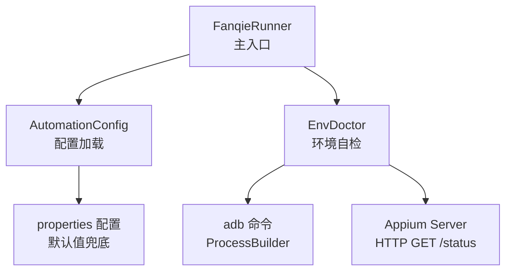
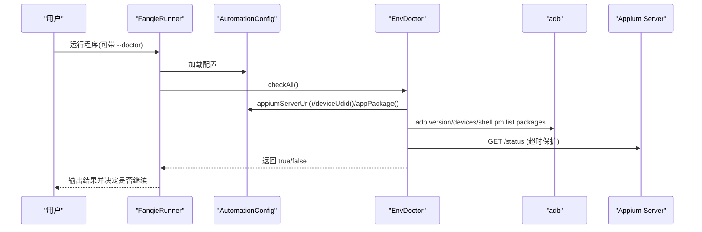
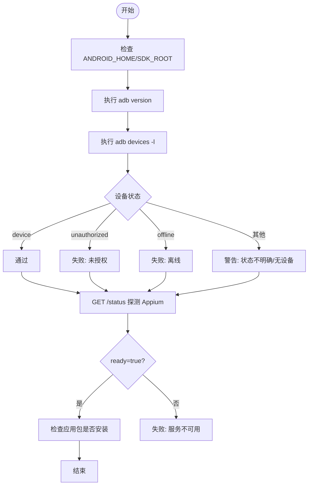
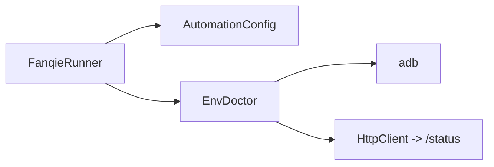

# 环境自检工具

<cite>
**本文引用的文件**
- [EnvDoctor.java](file://automation/src/main/java/com/fanqie/auto/core/EnvDoctor.java)
- [FanqieRunner.java](file://automation/src/main/java/com/fanqie/auto/FanqieRunner.java)
- [AutomationConfig.java](file://automation/src/main/java/com/fanqie/auto/config/AutomationConfig.java)
- [pom.xml](file://automation/pom.xml)
</cite>

## 目录
1. [简介](#简介)
2. [项目结构](#项目结构)
3. [核心组件](#核心组件)
4. [架构总览](#架构总览)
5. [详细组件分析](#详细组件分析)
6. [依赖关系分析](#依赖关系分析)
7. [性能与稳定性](#性能与稳定性)
8. [故障排查指南](#故障排查指南)
9. [结论](#结论)
10. [附录：命令行使用示例](#附录命令行使用示例)

## 简介
本工具为“环境自检器（EnvDoctor）”，用于在创建 Appium session 之前对运行环境进行快速诊断，覆盖以下关键检查项：
- ANDROID_HOME / ANDROID_SDK_ROOT 环境变量检查
- adb 版本检测
- 设备连接状态验证（在线、授权、离线等）
- Appium Server 连通性与就绪状态测试
- 目标应用包名是否已安装到设备

通过统一的输出标记（✓ 通过、! 警告、✗ 失败），帮助用户快速定位并修复环境问题。

## 项目结构
EnvDoctor 位于自动化工程的核心模块中，由主入口 FanqieRunner 在启动时调用执行，配置来源于 AutomationConfig。构建与运行基于 Maven，支持直接以 exec:java 方式运行主类。

图示来源
- [FanqieRunner.java:41-114](file://automation/src/main/java/com/fanqie/auto/FanqieRunner.java#L41-L114)
- [EnvDoctor.java:48-71](file://automation/src/main/java/com/fanqie/auto/core/EnvDoctor.java#L48-L71)
- [AutomationConfig.java:112-131](file://automation/src/main/java/com/fanqie/auto/config/AutomationConfig.java#L112-L131)

章节来源
- [FanqieRunner.java:41-114](file://automation/src/main/java/com/fanqie/auto/FanqieRunner.java#L41-L114)
- [pom.xml:127-135](file://automation/pom.xml#L127-L135)

## 核心组件
- EnvDoctor：负责全部环境检查逻辑，统一输出 ✓/!/✗，并在失败时给出具体处置指引。
- FanqieRunner：解析命令行参数，装配配置，调用 EnvDoctor 执行自检；若失败则以非零码退出。
- AutomationConfig：集中管理 Appium、设备、流程等配置项，提供默认值兜底。

章节来源
- [EnvDoctor.java:19-71](file://automation/src/main/java/com/fanqie/auto/core/EnvDoctor.java#L19-L71)
- [FanqieRunner.java:41-114](file://automation/src/main/java/com/fanqie/auto/FanqieRunner.java#L41-L114)
- [AutomationConfig.java:112-131](file://automation/src/main/java/com/fanqie/auto/config/AutomationConfig.java#L112-L131)

## 架构总览
EnvDoctor 的工作流如下：
- 读取配置（Appium Server URL、设备 UDID、应用包名）
- 逐项检查并输出结果
- 汇总并通过返回值指示整体是否通过

图示来源
- [FanqieRunner.java:41-114](file://automation/src/main/java/com/fanqie/auto/FanqieRunner.java#L41-L114)
- [EnvDoctor.java:48-71](file://automation/src/main/java/com/fanqie/auto/core/EnvDoctor.java#L48-L71)
- [AutomationConfig.java:112-131](file://automation/src/main/java/com/fanqie/auto/config/AutomationConfig.java#L112-L131)

## 详细组件分析

### EnvDoctor 检查项与处理逻辑
- ANDROID_HOME / ANDROID_SDK_ROOT 检查
  - 优先识别 ANDROID_HOME；若未设置但存在 ANDROID_SDK_ROOT，则提示可用路径。
  - 均未设置时发出警告，说明 uiautomator2 driver 依赖该变量定位 adb。
- adb 版本检测
  - 执行 adb version，成功且包含标准标识即视为通过；否则提示安装或刷新 PATH。
- 设备连接状态验证
  - 执行 adb devices -l，根据期望 UDID 判断：
    - device：在线通过
    - unauthorized：未授权，提示在手机确认 USB 调试授权弹窗
    - offline：离线，提示重插拔或重启 adb server
    - 其他：不明确状态或无设备，打印完整排查清单
- Appium Server 连通性测试
  - 向 {server}/status 发起 GET 请求，超时 5s；
  - 响应 200 且 ready=true 视为通过；否则提示服务不可用或启动方式。
- 应用安装状态检查
  - 通过 adb shell pm list packages 检查目标包名是否存在；
  - 未安装时提示安装应用或核对包名。

图示来源
- [EnvDoctor.java:75-194](file://automation/src/main/java/com/fanqie/auto/core/EnvDoctor.java#L75-L194)

章节来源
- [EnvDoctor.java:75-194](file://automation/src/main/java/com/fanqie/auto/core/EnvDoctor.java#L75-L194)

### 输出标记解读
- ✓ 通过：该项检查正常，无需干预。
- ! 警告：存在潜在问题或信息提示，建议关注但不一定阻断后续流程。
- ✗ 失败：硬性检查未通过，需按提示修复后重试；EnvDoctor 会记录失败项并影响最终结果。

章节来源
- [EnvDoctor.java:269-282](file://automation/src/main/java/com/fanqie/auto/core/EnvDoctor.java#L269-L282)

### 外部命令执行与超时保护
- 使用 ProcessBuilder 执行 adb 相关命令，分别消费 stdout/stderr，避免 Windows 下缓冲区满导致死锁。
- 设置命令超时（默认 15 秒），超时将强制终止进程并返回错误摘要。
- 异常被捕获并转换为失败结果，不抛出裸异常堆栈，保证健壮性。

章节来源
- [EnvDoctor.java:218-265](file://automation/src/main/java/com/fanqie/auto/core/EnvDoctor.java#L218-L265)

### 与主入口的集成
- FanqieRunner 在启动时解析命令行参数，装配配置并调用 EnvDoctor.checkAll()。
- 若环境自检失败，打印提示信息并以非零码退出，阻止后续 session 创建。
- 支持 --doctor 模式仅执行自检并退出，便于独立验证环境。

章节来源
- [FanqieRunner.java:41-114](file://automation/src/main/java/com/fanqie/auto/FanqieRunner.java#L41-L114)

## 依赖关系分析
- EnvDoctor 依赖：
  - AutomationConfig：获取 Appium Server URL、设备 UDID、应用包名等配置。
  - 系统命令：adb（通过 ProcessBuilder）。
  - 网络访问：JDK 11 HttpClient 访问 Appium Server /status。
- FanqieRunner 依赖：
  - AutomationConfig：配置加载与覆盖。
  - EnvDoctor：环境自检。
- 构建与运行：
  - Maven 编译 release=11，UTF-8 编码。
  - 支持 exec:java 直接运行主类 com.fanqie.auto.FanqieRunner。

图示来源
- [FanqieRunner.java:41-114](file://automation/src/main/java/com/fanqie/auto/FanqieRunner.java#L41-L114)
- [EnvDoctor.java:48-71](file://automation/src/main/java/com/fanqie/auto/core/EnvDoctor.java#L48-L71)
- [AutomationConfig.java:112-131](file://automation/src/main/java/com/fanqie/auto/config/AutomationConfig.java#L112-L131)

章节来源
- [pom.xml:15-28](file://automation/pom.xml#L15-L28)
- [pom.xml:127-135](file://automation/pom.xml#L127-L135)

## 性能与稳定性
- 命令执行超时：所有外部命令均设置超时，避免长时间阻塞。
- 并发输出流消费：stdout/stderr 分别由独立线程读取，防止缓冲区溢出导致的死锁。
- 网络请求超时：Appium Server 探测设置连接与请求超时，避免卡死。
- 资源释放：进程结束后等待子线程完成读取，确保资源正确回收。

[本节为通用指导，不直接分析具体文件]

## 故障排查指南
以下为常见问题及处理步骤（依据 EnvDoctor 输出中的处置提示整理）：

- 设备未授权（unauthorized）
  - 在手机上确认 USB 调试授权弹窗，勾选“始终允许来自这台计算机的调试”。
- 设备离线（offline）
  - 重新插拔 USB 线，或执行 adb kill-server; adb start-server。
- 未检测到任何设备
  - 逐项排查开发者选项、USB 调试、仅充电模式下允许 ADB 调试、USB 连接方式、首次授权、监控 ADB 安装应用、使用原装数据线等。
- Appium Server 不可用
  - 确认 Node.js 已安装；确认 Appium 已安装；启动 Server（如 appium --base-path /）；确认 uiautomator2 driver 已安装。
- ANDROID_HOME 未设置
  - 建议设置为 platform-tools 的父目录（例如 Android SDK 根目录），以便 uiautomator2 driver 找到 adb。
- 应用未安装
  - 在设备上安装目标应用，或通过 adb 查询包名确认是否正确。

章节来源
- [EnvDoctor.java:104-194](file://automation/src/main/java/com/fanqie/auto/core/EnvDoctor.java#L104-L194)

## 结论
EnvDoctor 提供了面向实际环境的系统化自检能力，覆盖环境变量、adb、设备连接、Appium 服务与应用安装等关键环节。配合 FanqieRunner 的命令行支持与统一输出标记，能够快速定位并修复环境问题，提升自动化任务的成功率与可维护性。

[本节为总结性内容，不直接分析具体文件]

## 附录：命令行使用示例
- 仅执行环境自检（推荐）
  - mvn exec:java -Dexec.mainClass="com.fanqie.auto.FanqieRunner" -Dexec.args="--doctor"
- 执行完整自动化流程（含环境自检）
  - mvn exec:java -Dexec.mainClass="com.fanqie.auto.FanqieRunner"
- Dry-run 模式（只连接并 dump UI 树，不执行点击）
  - mvn exec:java -Dexec.mainClass="com.fanqie.auto.FanqieRunner" -Dexec.args="--dry-run"
- 指定配置文件
  - mvn exec:java -Dexec.mainClass="com.fanqie.auto.FanqieRunner" -Dexec.args="--config ./automation.properties"
- 覆盖循环次数与页面数
  - mvn exec:java -Dexec.mainClass="com.fanqie.auto.FanqieRunner" -Dexec.args="--cycles 10 --pages 5"
- 重置累计进度
  - mvn exec:java -Dexec.mainClass="com.fanqie.auto.FanqieRunner" -Dexec.args="--reset-progress"

章节来源
- [FanqieRunner.java:41-114](file://automation/src/main/java/com/fanqie/auto/FanqieRunner.java#L41-L114)
- [FanqieRunner.java:241-249](file://automation/src/main/java/com/fanqie/auto/FanqieRunner.java#L241-L249)
- [pom.xml:127-135](file://automation/pom.xml#L127-L135)