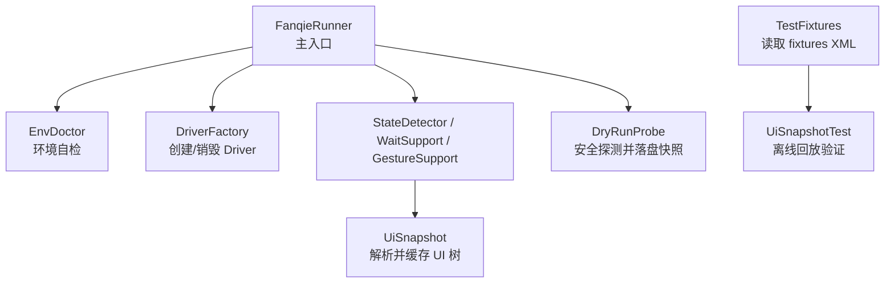
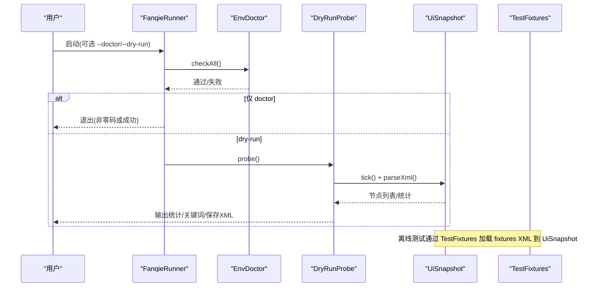
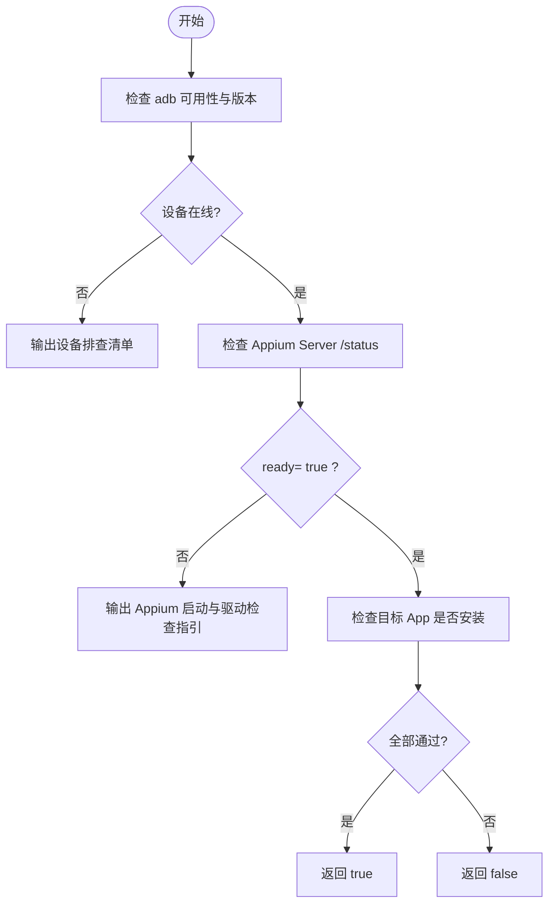
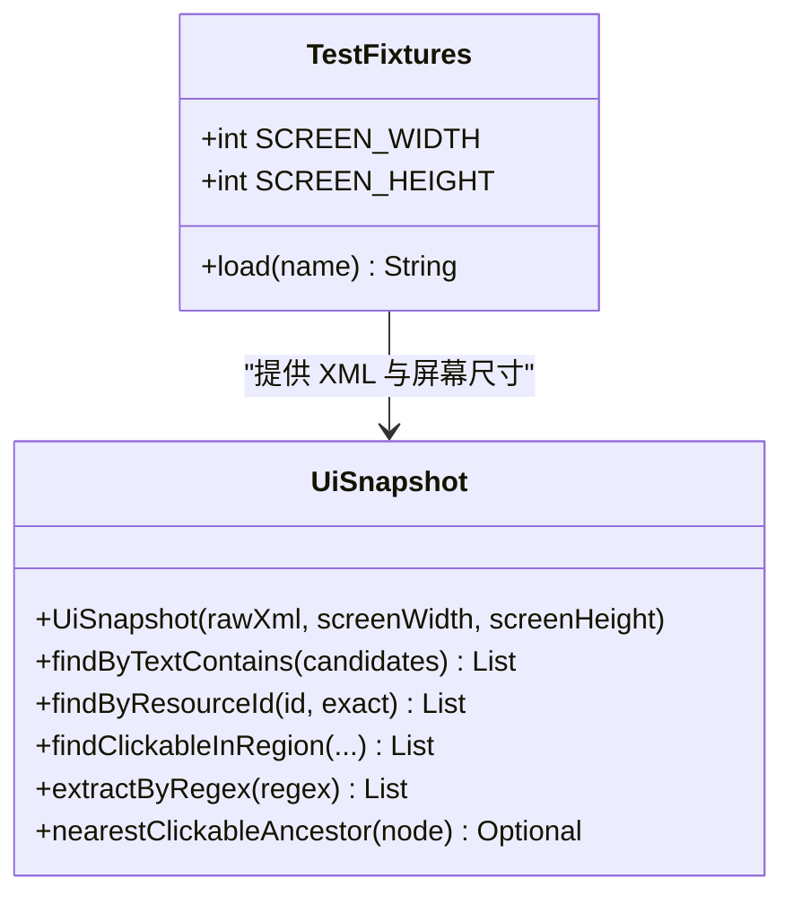
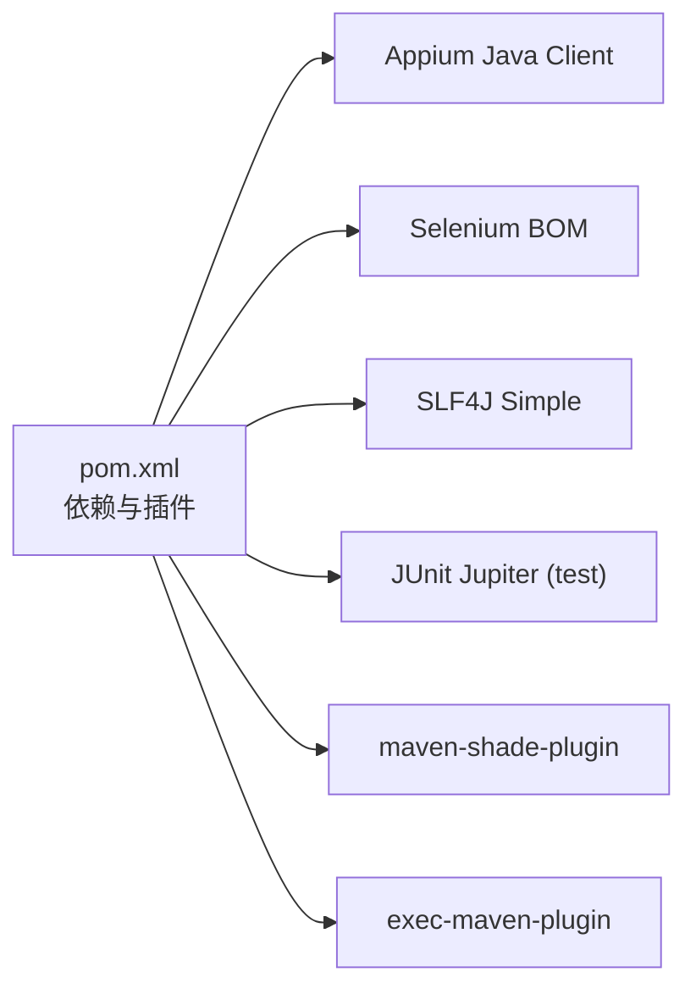

# 调试工具

<cite>
**本文引用的文件**
- [EnvDoctor.java](file://automation/src/main/java/com/fanqie/auto/core/EnvDoctor.java)
- [FanqieRunner.java](file://automation/src/main/java/com/fanqie/auto/FanqieRunner.java)
- [AutomationConfig.java](file://automation/src/main/java/com/fanqie/auto/config/AutomationConfig.java)
- [DryRunProbe.java](file://automation/src/main/java/com/fanqie/auto/DryRunProbe.java)
- [UiSnapshot.java](file://automation/src/main/java/com/fanqie/auto/core/UiSnapshot.java)
- [TestFixtures.java](file://automation/src/test/java/com/fanqie/auto/TestFixtures.java)
- [UiSnapshotTest.java](file://automation/src/test/java/com/fanqie/auto/core/UiSnapshotTest.java)
- [bookshelf.xml](file://automation/src/test/resources/fixtures/bookshelf.xml)
- [pom.xml](file://automation/pom.xml)
- [automation.properties](file://automation/src/main/resources/automation.properties)
</cite>

## 目录
1. [简介](#简介)
2. [项目结构](#项目结构)
3. [核心组件](#核心组件)
4. [架构总览](#架构总览)
5. [详细组件分析](#详细组件分析)
6. [依赖关系分析](#依赖关系分析)
7. [性能与稳定性](#性能与稳定性)
8. [故障排查指南](#故障排查指南)
9. [结论](#结论)
10. [附录：常用命令与最佳实践](#附录：常用命令与最佳实践)

## 简介
本指南面向使用本项目进行 UI 自动化调试的工程师，聚焦以下目标：
- 环境自检工具 EnvDoctor 的使用方法与输出解读
- 测试夹具 TestFixtures 的离线调试方法（无需真机、无需 Appium）
- UI 快照文件的分析与比较（基于 UiSnapshot 与 DryRunProbe 落盘的 XML）
- 外部工具使用建议：Appium Inspector、ADB、浏览器开发者工具（用于网络请求分析）
- 调试最佳实践与问题复现技巧

## 项目结构
项目采用分层组织：配置、核心能力（驱动、状态识别、手势、日志）、页面层、任务层，以及测试夹具与单元测试。调试相关的关键入口与能力集中在 Runner、EnvDoctor、DryRunProbe、UiSnapshot、TestFixtures。

图表来源
- [FanqieRunner.java:41-170](file://automation/src/main/java/com/fanqie/auto/FanqieRunner.java#L41-L170)
- [EnvDoctor.java:48-71](file://automation/src/main/java/com/fanqie/auto/core/EnvDoctor.java#L48-L71)
- [DryRunProbe.java:91-196](file://automation/src/main/java/com/fanqie/auto/DryRunProbe.java#L91-L196)
- [UiSnapshot.java:52-98](file://automation/src/main/java/com/fanqie/auto/core/UiSnapshot.java#L52-L98)
- [TestFixtures.java:34-51](file://automation/src/test/java/com/fanqie/auto/TestFixtures.java#L34-L51)

章节来源
- [FanqieRunner.java:41-170](file://automation/src/main/java/com/fanqie/auto/FanqieRunner.java#L41-L170)
- [pom.xml:100-175](file://automation/pom.xml#L100-L175)

## 核心组件
- 环境自检器 EnvDoctor：在 session 创建前执行 adb、Appium Server、环境变量等检查，给出中文处置指引。
- 安全探针 DryRunProbe：连接 Appium，启动 App，在书架页与阅读页抓取 UI 快照并落盘，打印节点统计与关键词命中，辅助定位策略选择。
- 快照解析 UiSnapshot：将一次 getPageSource() 的 XML 解析为内存节点表，提供纯内存查询 API，支持正则提取、区域点击候选筛选、可点击祖先回溯等。
- 测试夹具 TestFixtures：从 classpath 的 fixtures/ 目录以 UTF-8 读取 XML，供离线单元测试回放。
- 运行入口 FanqieRunner：装配配置、驱动、日志、探测器，支持 --doctor、--dry-run 等调试模式。

章节来源
- [EnvDoctor.java:19-71](file://automation/src/main/java/com/fanqie/auto/core/EnvDoctor.java#L19-L71)
- [DryRunProbe.java:26-40](file://automation/src/main/java/com/fanqie/auto/DryRunProbe.java#L26-L40)
- [UiSnapshot.java:21-35](file://automation/src/main/java/com/fanqie/auto/core/UiSnapshot.java#L21-L35)
- [TestFixtures.java:9-17](file://automation/src/test/java/com/fanqie/auto/TestFixtures.java#L9-L17)
- [FanqieRunner.java:25-36](file://automation/src/main/java/com/fanqie/auto/FanqieRunner.java#L25-L36)

## 架构总览
下图展示调试流程中各组件的交互：Runner 负责装配与调度；EnvDoctor 先做环境检查；DryRunProbe 在 dry-run 模式下抓取快照；UiSnapshot 提供内存级 UI 树操作；TestFixtures 支撑离线测试。

图表来源
- [FanqieRunner.java:41-170](file://automation/src/main/java/com/fanqie/auto/FanqieRunner.java#L41-L170)
- [EnvDoctor.java:48-71](file://automation/src/main/java/com/fanqie/auto/core/EnvDoctor.java#L48-L71)
- [DryRunProbe.java:91-196](file://automation/src/main/java/com/fanqie/auto/DryRunProbe.java#L91-L196)
- [UiSnapshot.java:52-98](file://automation/src/main/java/com/fanqie/auto/core/UiSnapshot.java#L52-L98)
- [TestFixtures.java:34-51](file://automation/src/test/java/com/fanqie/auto/TestFixtures.java#L34-L51)

## 详细组件分析

### 环境自检工具 EnvDoctor
- 功能要点
  - 检查 ANDROID_HOME/ANDROID_SDK_ROOT、adb 版本、设备在线状态、Appium Server 是否 ready、目标 App 是否已安装。
  - 对每项检查输出 pass/warn/fail，并提供具体处置步骤（如授权弹窗、USB 调试开关、数据线选择等）。
  - 通过 ProcessBuilder 调用外部命令，设置超时并分别消费 stdout/stderr，避免 Windows 下缓冲区满死锁。
- 使用方法
  - 通过 Runner 的 --doctor 参数仅执行环境自检，不创建 session。
  - 若任一硬性检查失败，Runner 将以非零码退出，便于 CI/CD 快速失败。
- 输出解读
  - 通过项显示“✓”，警告项显示“!”，失败项显示“✗”。
  - 失败项会附带“处置”提示，按提示逐项修复后重试。

图表来源
- [EnvDoctor.java:90-194](file://automation/src/main/java/com/fanqie/auto/core/EnvDoctor.java#L90-L194)
- [EnvDoctor.java:218-265](file://automation/src/main/java/com/fanqie/auto/core/EnvDoctor.java#L218-L265)

章节来源
- [EnvDoctor.java:19-71](file://automation/src/main/java/com/fanqie/auto/core/EnvDoctor.java#L19-L71)
- [EnvDoctor.java:90-194](file://automation/src/main/java/com/fanqie/auto/core/EnvDoctor.java#L90-L194)
- [EnvDoctor.java:218-265](file://automation/src/main/java/com/fanqie/auto/core/EnvDoctor.java#L218-L265)
- [FanqieRunner.java:101-114](file://automation/src/main/java/com/fanqie/auto/FanqieRunner.java#L101-L114)

### 测试夹具 TestFixtures 与离线调试
- 功能要点
  - 从 test classpath 的 fixtures/ 目录以 UTF-8 读取 XML，避免 Windows 默认编码导致的乱码。
  - 统一屏幕尺寸常量（1080x2340），所有 fixture 的 bounds 基于此坐标系。
  - 不连接真机、不启动 Appium session，纯文件读取，适合回归与断言。
- 使用方法
  - 在单元测试中通过 TestFixtures.load("xxx.xml") 获取 XML 字符串，再构造 UiSnapshot 进行内存查询与断言。
  - 新增场景时，录制或导出对应页面的 UI 树 XML，放入 fixtures/ 目录，编写用例覆盖关键分支。
- 典型用例
  - 正常 XML 解析、畸形 XML 健壮性、不可变节点列表、文本/描述/资源 ID 匹配、区域点击候选、正则提取奖励分钟数等。

图表来源
- [TestFixtures.java:20-51](file://automation/src/test/java/com/fanqie/auto/TestFixtures.java#L20-L51)
- [UiSnapshot.java:52-284](file://automation/src/main/java/com/fanqie/auto/core/UiSnapshot.java#L52-L284)

章节来源
- [TestFixtures.java:9-51](file://automation/src/test/java/com/fanqie/auto/TestFixtures.java#L9-L51)
- [UiSnapshotTest.java:18-199](file://automation/src/test/java/com/fanqie/auto/core/UiSnapshotTest.java#L18-L199)
- [bookshelf.xml:1-11](file://automation/src/test/resources/fixtures/bookshelf.xml#L1-L11)

### UI 快照文件的分析与比较
- 生成位置
  - DryRunProbe 将书架页、阅读页及翻页后的快照 XML 保存到 logs/snapshots/，文件名包含时间戳与标签（如 dryrun-bookshelf.xml、dryrun-reader-afterturn.xml）。
- 分析方法
  - 查看节点属性统计：总节点数、有 text/resource-id/content-desc/clickable/bounds 的数量与占比，帮助判断定位策略（L1/L2/L3）。
  - 查看关键词节点明细：含“视频/广告/关闭/继续/免费/书架/下一章”等关键词的节点及其完整属性与 bounds，辅助确认控件特征。
  - 对比不同时间点的快照：观察底部广告是否在翻页后出现、关闭按钮是否变化、文案是否漂移等。
- 比较建议
  - 使用 XML diff 工具对比两次快照的差异，关注 resource-id、text、content-desc、bounds 的变化。
  - 结合 LocatorRegistry 的候选集与阈值，调整定位策略与几何兜底范围。

章节来源
- [DryRunProbe.java:269-345](file://automation/src/main/java/com/fanqie/auto/DryRunProbe.java#L269-L345)
- [DryRunProbe.java:350-372](file://automation/src/main/java/com/fanqie/auto/DryRunProbe.java#L350-L372)

### 外部工具使用建议
- Appium Inspector
  - 用途：连接 Appium Server，实时查看 UI 树、元素属性与坐标，辅助校准 locator 与几何区域。
  - 建议：在 dry-run 后，用 Inspector 打开同一设备与 App，核对 snapshot XML 中的 resource-id、bounds 是否与当前一致。
- ADB 命令
  - 用途：检查设备状态、包名、进程、日志等。
  - 常用命令（示例）：
    - 列出设备与状态：adb devices -l
    - 查看已安装包：adb shell pm list packages | findstr dragon
    - 重启 ADB 服务：adb kill-server; adb start-server
  - 注意：EnvDoctor 已内置 adb 检查与处置指引，遇到失败优先按其提示处理。
- 浏览器开发者工具
  - 用途：分析 Appium Server 的网络请求与响应，定位 HTTP 错误、超时、协议不一致等问题。
  - 建议：在启动 Appium Server 后，使用浏览器打开 http://127.0.0.1:4723/status 或通过抓包工具查看会话建立过程。

[本节为通用调试建议，不直接分析具体源码文件]

## 依赖关系分析
- 运行时依赖
  - Appium Java Client 与 Selenium BOM 版本锁定，确保兼容性。
  - SLF4J Simple 实现保证日志可见。
  - JUnit 5 用于单元测试，scope=test，不影响主程序运行。
- 构建与执行
  - maven-compiler-plugin 强制 release=11 与 UTF-8 编码，避免中文乱码。
  - maven-surefire-plugin 3.x 支持 JUnit Platform。
  - exec-maven-plugin 指定 mainClass 为 FanqieRunner。
  - maven-shade-plugin 打包 fat-jar，便于脱离 IDE 运行长任务。

图表来源
- [pom.xml:15-83](file://automation/pom.xml#L15-L83)
- [pom.xml:100-175](file://automation/pom.xml#L100-L175)

章节来源
- [pom.xml:15-83](file://automation/pom.xml#L15-L83)
- [pom.xml:100-175](file://automation/pom.xml#L100-L175)

## 性能与稳定性
- 快照解析性能
  - UiSnapshot 在一次 getPageSource() 后解析 XML，深度优先遍历产出节点列表，后续查询均为纯内存操作，零 RPC。
  - 防御 XXE：禁用 doctype、外部实体、XInclude、实体展开等。
  - 异常容错：XML 畸形/截断时不抛异常，返回空快照并标记 parseFailed，上层走 UNKNOWN 分支。
- 状态识别性能
  - StateDetector 同一 tick 内复用快照缓存，避免重复抓取；匹配优先级从高到低，减少 RPC 次数。
- 外部命令稳定性
  - EnvDoctor 使用 ProcessBuilder 并设置超时，分别消费 stdout/stderr，避免 Windows 下缓冲区满导致死锁。

章节来源
- [UiSnapshot.java:21-35](file://automation/src/main/java/com/fanqie/auto/core/UiSnapshot.java#L21-L35)
- [UiSnapshot.java:78-98](file://automation/src/main/java/com/fanqie/auto/core/UiSnapshot.java#L78-L98)
- [EnvDoctor.java:218-265](file://automation/src/main/java/com/fanqie/auto/core/EnvDoctor.java#L218-L265)

## 故障排查指南
- 常见环境问题
  - adb 不可用：按 EnvDoctor 提示安装平台工具并刷新 PATH。
  - 设备未授权/离线：在手机上确认 USB 调试授权弹窗，或重插线、重启 ADB。
  - Appium Server 未就绪：确认 Node.js 与 Appium 安装，启动 server 并检查 /status。
  - 目标 App 未安装：安装应用或核对包名。
- 运行期问题
  - Session 创建失败：参考 DriverFactory 的诊断输出，逐项核对手机设置与 Appium 状态。
  - 中文乱码：确保编译与测试阶段使用 UTF-8（pom.xml 已配置），fixture 读取也强制 UTF-8。
- 复现技巧
  - 使用 --dry-run 捕获快照，固定设备与页面状态，便于回归。
  - 将失败时的快照 XML 加入 fixtures，编写离线用例断言关键分支。
  - 使用 --reset-progress 清除累计进度，从零开始复现流程。

章节来源
- [EnvDoctor.java:90-194](file://automation/src/main/java/com/fanqie/auto/core/EnvDoctor.java#L90-L194)
- [FanqieRunner.java:241-249](file://automation/src/main/java/com/fanqie/auto/FanqieRunner.java#L241-L249)
- [pom.xml:100-125](file://automation/pom.xml#L100-L125)

## 结论
本项目提供了完善的环境自检、安全探测、离线回放与快照分析能力，配合外部工具（Appium Inspector、ADB、浏览器开发者工具）可高效定位问题。建议在日常调试中遵循“先环境、再快照、后逻辑”的顺序，利用 dry-run 与 fixtures 降低不确定性，提升问题复现与回归效率。

## 附录：常用命令与最佳实践
- 运行模式
  - 仅环境自检：--doctor
  - 安全探测（只抓快照不点击）：--dry-run
  - 覆盖配置文件：--config <path>
  - 覆盖循环/页数：--cycles N / --pages N
  - 重置进度：--reset-progress
- 配置项
  - Appium Server URL、平台、自动化引擎、设备 UDID、包名、超时等集中由 AutomationConfig 管理，可通过 automation.properties 或外部文件覆盖。
- 最佳实践
  - 首次运行务必执行 --doctor，确保环境与设备就绪。
  - 使用 --dry-run 生成快照，结合 Inspector 校准 locator 与几何区域。
  - 将关键场景录制为 fixtures，编写离线用例保障回归。
  - 长任务开启心跳保活，避免 session 超时断开。
  - 遇到问题优先查看 EnvDoctor 与 Runner 的诊断输出，按指引逐项修复。

章节来源
- [FanqieRunner.java:41-114](file://automation/src/main/java/com/fanqie/auto/FanqieRunner.java#L41-L114)
- [AutomationConfig.java:110-178](file://automation/src/main/java/com/fanqie/auto/config/AutomationConfig.java#L110-L178)
- [automation.properties:6-24](file://automation/src/main/resources/automation.properties#L6-L24)