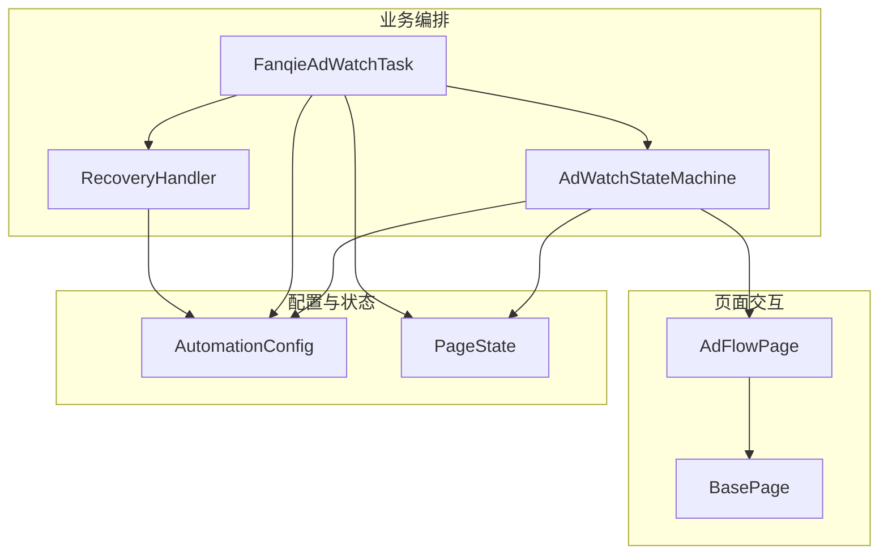
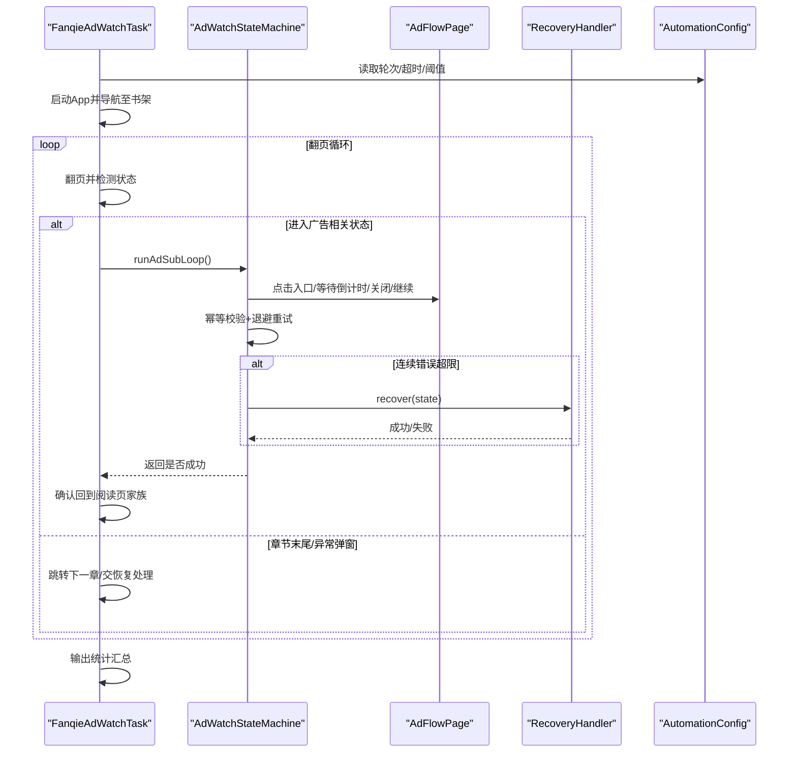
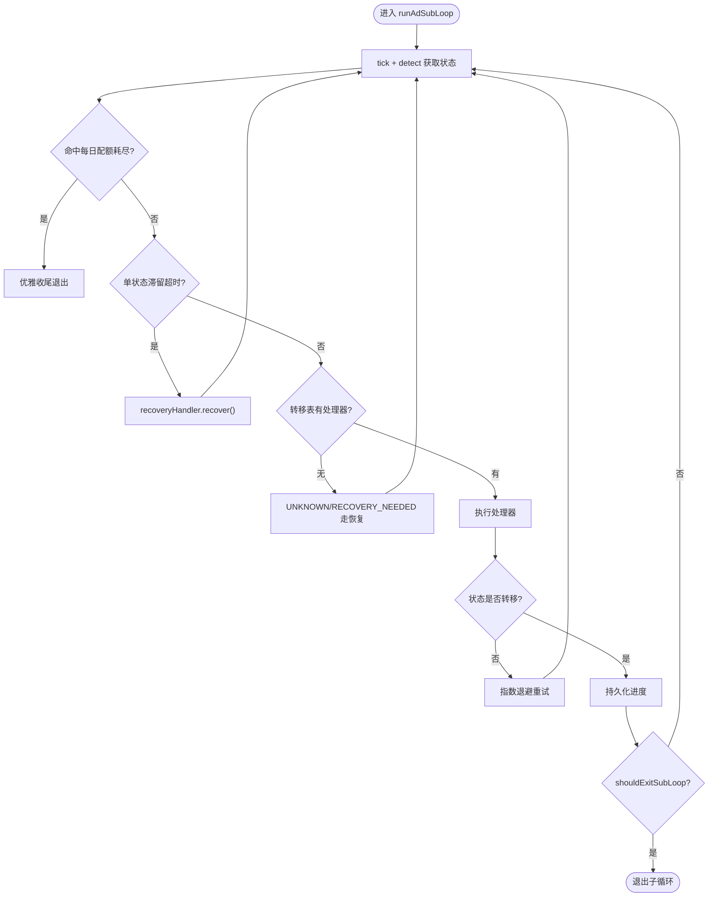
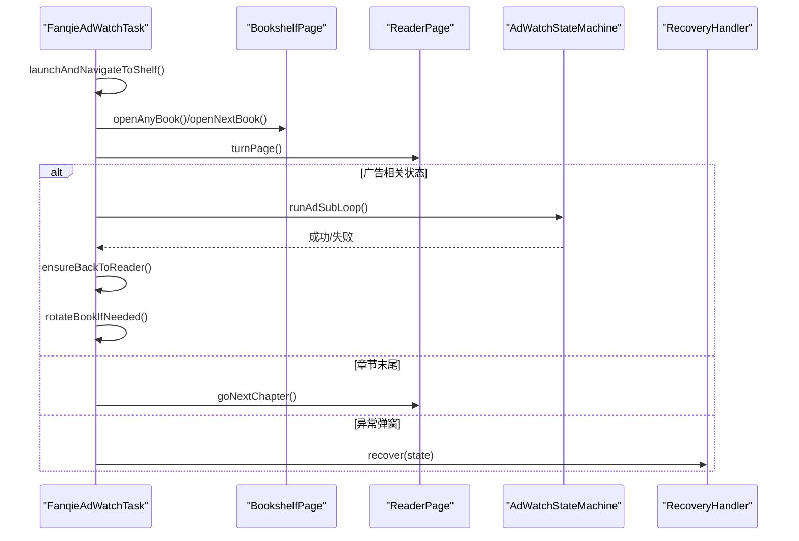
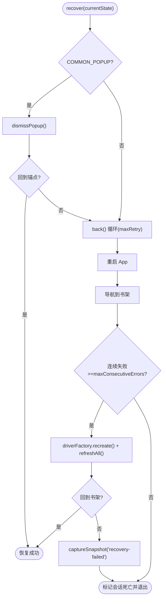
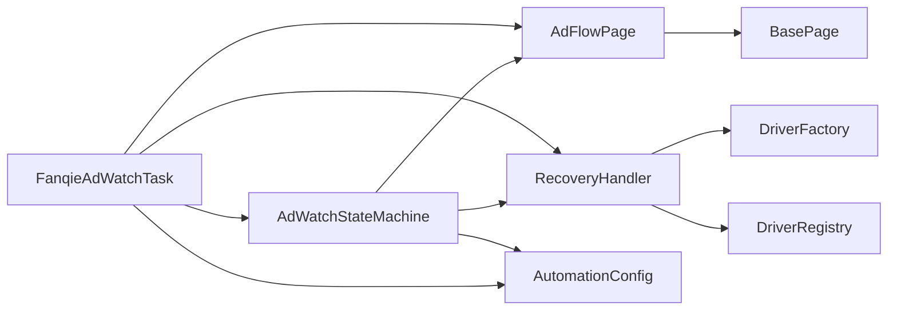

# 业务逻辑层设计

<cite>
**本文引用的文件**
- [AdWatchStateMachine.java](file://automation/src/main/java/com/fanqie/auto/task/AdWatchStateMachine.java)
- [FanqieAdWatchTask.java](file://automation/src/main/java/com/fanqie/auto/task/FanqieAdWatchTask.java)
- [RecoveryHandler.java](file://automation/src/main/java/com/fanqie/auto/task/RecoveryHandler.java)
- [Task.java](file://automation/src/main/java/com/fanqie/auto/task/Task.java)
- [AdFlowPage.java](file://automation/src/main/java/com/fanqie/auto/page/AdFlowPage.java)
- [BasePage.java](file://automation/src/main/java/com/fanqie/auto/page/BasePage.java)
- [AutomationConfig.java](file://automation/src/main/java/com/fanqie/auto/config/AutomationConfig.java)
- [PageState.java](file://automation/src/main/java/com/fanqie/auto/core/PageState.java)
</cite>

## 目录
1. [引言](#引言)
2. [项目结构](#项目结构)
3. [核心组件](#核心组件)
4. [架构总览](#架构总览)
5. [详细组件分析](#详细组件分析)
6. [依赖关系分析](#依赖关系分析)
7. [性能与稳定性考量](#性能与稳定性考量)
8. [故障诊断与排错指南](#故障诊断与排错指南)
9. [结论](#结论)
10. [附录：扩展与调试指南](#附录：扩展与调试指南)

## 引言
本设计文档聚焦业务逻辑层的编排与稳定性保障，围绕以下目标展开：
- 深入解析 AdWatchStateMachine 状态机模式：状态定义、转移表驱动、处理器注册与幂等执行。
- 阐述 FanqieAdWatchTask 任务编排器如何协调页面操作完成完整的广告观看流程。
- 解释 RecoveryHandler 的多级恢复策略：重试退避、熔断保护、断点续跑与现场保留。
- 说明业务层与页面层的解耦设计：通过接口抽象与定位器降级链实现松耦合。
- 提供可配置化设计、监控指标收集与故障诊断方法，并给出扩展开发与调试建议。

## 项目结构
业务逻辑层位于 task 包，核心由“任务编排 + 状态机 + 恢复处理”构成；page 包承载页面交互能力；config 包集中管理运行时参数；core 包提供状态枚举与通用支撑能力。

图表来源
- [FanqieAdWatchTask.java:1-120](file://automation/src/main/java/com/fanqie/auto/task/FanqieAdWatchTask.java#L1-L120)
- [AdWatchStateMachine.java:1-120](file://automation/src/main/java/com/fanqie/auto/task/AdWatchStateMachine.java#L1-L120)
- [RecoveryHandler.java:1-90](file://automation/src/main/java/com/fanqie/auto/task/RecoveryHandler.java#L1-L90)
- [AdFlowPage.java:1-80](file://automation/src/main/java/com/fanqie/auto/page/AdFlowPage.java#L1-L80)
- [BasePage.java:1-90](file://automation/src/main/java/com/fanqie/auto/page/BasePage.java#L1-L90)
- [AutomationConfig.java:180-260](file://automation/src/main/java/com/fanqie/auto/config/AutomationConfig.java#L180-L260)
- [PageState.java:1-97](file://automation/src/main/java/com/fanqie/auto/core/PageState.java#L1-L97)

章节来源
- [FanqieAdWatchTask.java:1-120](file://automation/src/main/java/com/fanqie/auto/task/FanqieAdWatchTask.java#L1-L120)
- [AdWatchStateMachine.java:1-120](file://automation/src/main/java/com/fanqie/auto/task/AdWatchStateMachine.java#L1-L120)
- [RecoveryHandler.java:1-90](file://automation/src/main/java/com/fanqie/auto/task/RecoveryHandler.java#L1-L90)
- [AdFlowPage.java:1-80](file://automation/src/main/java/com/fanqie/auto/page/AdFlowPage.java#L1-L80)
- [BasePage.java:1-90](file://automation/src/main/java/com/fanqie/auto/page/BasePage.java#L1-L90)
- [AutomationConfig.java:180-260](file://automation/src/main/java/com/fanqie/auto/config/AutomationConfig.java#L180-L260)
- [PageState.java:1-97](file://automation/src/main/java/com/fanqie/auto/core/PageState.java#L1-L97)

## 核心组件
- 任务编排器（FanqieAdWatchTask）：负责启动 App、导航到书架、翻页循环、遇到广告态时委派给状态机、异常态交由恢复处理器，并在每轮结束后进行统计汇总。
- 状态机（AdWatchStateMachine）：以 PageState 为键的转移表驱动，每个状态对应一个处理器，保证幂等执行、四重熔断、进度持久化与每日配额耗尽识别。
- 恢复处理器（RecoveryHandler）：五级恢复策略（弹窗关闭 → back() → 重启 App → 导航书架 → 重建 session），连续失败落盘诊断并标记会话死亡。
- 页面层（AdFlowPage/BasePage）：四级定位器降级链（语义匹配 → 几何推断 → 时序兜底 → 系统兜底），对高风险按钮采用严格误点防护。
- 配置中心（AutomationConfig）：集中管理超时、轮次、阈值、翻页策略等所有可调参数，支持外部覆盖。
- 状态枚举（PageState）：统一描述 UI 状态，作为状态机的驱动依据。

章节来源
- [FanqieAdWatchTask.java:98-314](file://automation/src/main/java/com/fanqie/auto/task/FanqieAdWatchTask.java#L98-L314)
- [AdWatchStateMachine.java:120-653](file://automation/src/main/java/com/fanqie/auto/task/AdWatchStateMachine.java#L120-L653)
- [RecoveryHandler.java:90-253](file://automation/src/main/java/com/fanqie/auto/task/RecoveryHandler.java#L90-L253)
- [AdFlowPage.java:67-428](file://automation/src/main/java/com/fanqie/auto/page/AdFlowPage.java#L67-L428)
- [BasePage.java:75-250](file://automation/src/main/java/com/fanqie/auto/page/BasePage.java#L75-L250)
- [AutomationConfig.java:180-260](file://automation/src/main/java/com/fanqie/auto/config/AutomationConfig.java#L180-L260)
- [PageState.java:11-97](file://automation/src/main/java/com/fanqie/auto/core/PageState.java#L11-L97)

## 架构总览
整体采用“编排-状态机-页面-恢复”的分层架构：
- 编排层（Task）：控制外层循环、翻页节奏、广告子循环触发与书籍轮换。
- 状态机层（StateMachine）：根据当前 PageState 选择处理器执行动作，确保幂等与稳定推进。
- 页面层（Page）：封装具体 UI 操作，使用统一的四级定位降级链，屏蔽底层差异。
- 恢复层（RecoveryHandler）：在任意步骤失败时按强度递增的策略恢复，最终落盘诊断。

图表来源
- [FanqieAdWatchTask.java:168-305](file://automation/src/main/java/com/fanqie/auto/task/FanqieAdWatchTask.java#L168-L305)
- [AdWatchStateMachine.java:173-312](file://automation/src/main/java/com/fanqie/auto/task/AdWatchStateMachine.java#L173-L312)
- [AdFlowPage.java:116-262](file://automation/src/main/java/com/fanqie/auto/page/AdFlowPage.java#L116-L262)
- [RecoveryHandler.java:100-253](file://automation/src/main/java/com/fanqie/auto/task/RecoveryHandler.java#L100-L253)
- [AutomationConfig.java:180-260](file://automation/src/main/java/com/fanqie/auto/config/AutomationConfig.java#L180-L260)

## 详细组件分析

### AdWatchStateMachine 状态机
- 设计要点
  - 转移表驱动：Map<PageState, StateHandler> 注册各状态处理器，避免硬编码顺序。
  - 幂等性：每次动作前重新 detect()，动作后校验状态是否转移，未转移则退避重试。
  - 四重熔断：目标分钟达成、单入口轮次上限、全局轮次上限、墙钟时间预算；任一触发即退出子循环。
  - 每日配额耗尽识别：去抖计数 + 上下文约束（伴随弹窗型关闭/取消按钮）。
  - 奖励计数幂等：roundId + lastCountedRoundId 保证每真实一轮至多计一次且不漏计。
  - 进度持久化：断点续跑，跨天清空 per-book 已用书籍集合。

图表来源
- [AdWatchStateMachine.java:173-312](file://automation/src/main/java/com/fanqie/auto/task/AdWatchStateMachine.java#L173-L312)
- [AdWatchStateMachine.java:355-394](file://automation/src/main/java/com/fanqie/auto/task/AdWatchStateMachine.java#L355-L394)
- [AdWatchStateMachine.java:398-653](file://automation/src/main/java/com/fanqie/auto/task/AdWatchStateMachine.java#L398-L653)
- [AdWatchStateMachine.java:679-734](file://automation/src/main/java/com/fanqie/auto/task/AdWatchStateMachine.java#L679-L734)

章节来源
- [AdWatchStateMachine.java:120-653](file://automation/src/main/java/com/fanqie/auto/task/AdWatchStateMachine.java#L120-L653)
- [AdWatchStateMachine.java:679-734](file://automation/src/main/java/com/fanqie/auto/task/AdWatchStateMachine.java#L679-L734)

### FanqieAdWatchTask 任务编排器
- 职责
  - 阶段 1：启动 App，等待到达书架或中间状态，必要时主动切换到书架 Tab。
  - 阶段 2：打开一本书进入阅读页，自动跳过短剧/视频页，记录已试书籍。
  - 阶段 3：外层循环内翻页 pagesPerCycle 次，遇广告态进入状态机子循环，遇章节末尾跳转下一章，遇异常弹窗交由恢复处理器。
  - 收尾：输出累计免广告时长与总广告轮次统计。
- 关键机制
  - 全局熔断检查：目标分钟/总轮次/墙钟预算/每日配额耗尽。
  - 底部广告入口探测：即使处于阅读页家族也检测并进入广告子循环。
  - 书籍轮换：当本书达到单入口上限且全局目标未达成，回书架换下一本未使用书籍。

图表来源
- [FanqieAdWatchTask.java:98-314](file://automation/src/main/java/com/fanqie/auto/task/FanqieAdWatchTask.java#L98-L314)
- [FanqieAdWatchTask.java:322-396](file://automation/src/main/java/com/fanqie/auto/task/FanqieAdWatchTask.java#L322-L396)
- [FanqieAdWatchTask.java:464-525](file://automation/src/main/java/com/fanqie/auto/task/FanqieAdWatchTask.java#L464-L525)
- [FanqieAdWatchTask.java:537-590](file://automation/src/main/java/com/fanqie/auto/task/FanqieAdWatchTask.java#L537-L590)

章节来源
- [FanqieAdWatchTask.java:98-314](file://automation/src/main/java/com/fanqie/auto/task/FanqieAdWatchTask.java#L98-L314)
- [FanqieAdWatchTask.java:322-396](file://automation/src/main/java/com/fanqie/auto/task/FanqieAdWatchTask.java#L322-L396)
- [FanqieAdWatchTask.java:464-525](file://automation/src/main/java/com/fanqie/auto/task/FanqieAdWatchTask.java#L464-L525)
- [FanqieAdWatchTask.java:537-590](file://automation/src/main/java/com/fanqie/auto/task/FanqieAdWatchTask.java#L537-L590)

### RecoveryHandler 多级恢复策略
- 五级恢复（由弱到强）
  1) COMMON_POPUP 弹窗关闭：按候选文案由弱到强尝试，副作用最小优先。
  2) 逐级 back()：最多 maxRecoveryRetry 次，每次 back 后重新 detect 确认锚点。
  3) 重启 App：terminateApp + activateApp，等待启动完成。
  4) 导航到书架：若重启后非 BOOKSHELF，主动切换书架 Tab。
  5) 重建 session：连续失败达 maxConsecutiveErrors 次时重建 driver，刷新所有组件引用。
  6) 落盘诊断：保存快照并标记会话死亡，停止盲目连点。
- 安全底线：超过恢复上限即停止，保留现场，绝不盲目连点。

图表来源
- [RecoveryHandler.java:100-253](file://automation/src/main/java/com/fanqie/auto/task/RecoveryHandler.java#L100-L253)
- [RecoveryHandler.java:269-321](file://automation/src/main/java/com/fanqie/auto/task/RecoveryHandler.java#L269-L321)

章节来源
- [RecoveryHandler.java:90-253](file://automation/src/main/java/com/fanqie/auto/task/RecoveryHandler.java#L90-L253)
- [RecoveryHandler.java:269-321](file://automation/src/main/java/com/fanqie/auto/task/RecoveryHandler.java#L269-L321)

### 页面层与业务层解耦设计
- 解耦方式
  - 业务编排（Task/StateMachine）仅依赖抽象的页面能力（如 clickBottomRewardEntry、turnPage），不关心具体 UI 实现细节。
  - 页面层（BasePage/AdFlowPage）实现四级定位降级链，屏蔽不同控件属性差异与自绘控件问题。
  - 通过 LocatorRegistry 与 AutomationConfig 将定位规则与超时/轮次等参数外置，便于配置化与扩展。
- 误点防护
  - 高风险按钮（如“观看广告”、“继续获取免费时长”）禁用几何兜底，避免误点浪费用户配额。
  - 关闭按钮允许激进兜底（L1→L2→L3→L4），因为漏点导致卡死的代价更大。

章节来源
- [BasePage.java:75-250](file://automation/src/main/java/com/fanqie/auto/page/BasePage.java#L75-L250)
- [AdFlowPage.java:67-297](file://automation/src/main/java/com/fanqie/auto/page/AdFlowPage.java#L67-L297)
- [AutomationConfig.java:180-260](file://automation/src/main/java/com/fanqie/auto/config/AutomationConfig.java#L180-L260)

## 依赖关系分析
- 组件耦合
  - Task 依赖 StateMachine、RecoveryHandler、页面对象与配置。
  - StateMachine 依赖页面对象、配置、状态检测与恢复处理器。
  - RecoveryHandler 依赖 DriverFactory/DriverRegistry 进行 session 重建，依赖页面对象进行书架导航。
  - 页面层依赖 BasePage 提供的四级定位能力与 GestureSupport。
- 外部依赖
  - AppiumDriver 用于设备控制与页面交互。
  - 日志与指标通过 RunLogger 上报，便于监控与诊断。

图表来源
- [FanqieAdWatchTask.java:42-81](file://automation/src/main/java/com/fanqie/auto/task/FanqieAdWatchTask.java#L42-L81)
- [AdWatchStateMachine.java:62-78](file://automation/src/main/java/com/fanqie/auto/task/AdWatchStateMachine.java#L62-L78)
- [RecoveryHandler.java:44-76](file://automation/src/main/java/com/fanqie/auto/task/RecoveryHandler.java#L44-L76)
- [AdFlowPage.java:38-65](file://automation/src/main/java/com/fanqie/auto/page/AdFlowPage.java#L38-L65)
- [BasePage.java:40-68](file://automation/src/main/java/com/fanqie/auto/page/BasePage.java#L40-L68)
- [AutomationConfig.java:18-63](file://automation/src/main/java/com/fanqie/auto/config/AutomationConfig.java#L18-L63)

章节来源
- [FanqieAdWatchTask.java:42-81](file://automation/src/main/java/com/fanqie/auto/task/FanqieAdWatchTask.java#L42-L81)
- [AdWatchStateMachine.java:62-78](file://automation/src/main/java/com/fanqie/auto/task/AdWatchStateMachine.java#L62-L78)
- [RecoveryHandler.java:44-76](file://automation/src/main/java/com/fanqie/auto/task/RecoveryHandler.java#L44-L76)
- [AdFlowPage.java:38-65](file://automation/src/main/java/com/fanqie/auto/page/AdFlowPage.java#L38-L65)
- [BasePage.java:40-68](file://automation/src/main/java/com/fanqie/auto/page/BasePage.java#L40-L68)
- [AutomationConfig.java:18-63](file://automation/src/main/java/com/fanqie/auto/config/AutomationConfig.java#L18-L63)

## 性能与稳定性考量
- 性能优化
  - 视频等待稀疏轮询：使用 pollIntervalMs * 4 降低 CPU 与 RPC 压力。
  - 心跳日志：基于上次心跳时间戳精确打点，避免取模近似导致的漏打/重复打。
  - 幂等与退避：动作后校验状态转移，未转移则指数退避重试，减少无效操作。
- 稳定性保障
  - 四重熔断：目标分钟、单入口轮次、全局轮次、墙钟时间预算，防止无限循环。
  - 每日配额耗尽识别：去抖计数 + 上下文约束，避免瞬时误判。
  - 恢复策略：五级恢复逐步增强，最终落盘诊断，确保不盲目连点。
  - 断点续跑：进度持久化，跨天清空 per-book 已用书籍集合，避免残留影响。

章节来源
- [AdFlowPage.java:116-163](file://automation/src/main/java/com/fanqie/auto/page/AdFlowPage.java#L116-L163)
- [AdWatchStateMachine.java:355-394](file://automation/src/main/java/com/fanqie/auto/task/AdWatchStateMachine.java#L355-L394)
- [AdWatchStateMachine.java:679-734](file://automation/src/main/java/com/fanqie/auto/task/AdWatchStateMachine.java#L679-L734)
- [RecoveryHandler.java:100-253](file://automation/src/main/java/com/fanqie/auto/task/RecoveryHandler.java#L100-L253)

## 故障诊断与排错指南
- 常见问题定位
  - 状态未转移：查看连续错误计数与退避日志，确认是否命中转移表处理器。
  - 弹窗无法关闭：检查 commonDismissTexts 候选集与 content-desc 匹配情况。
  - 视频等待超时：确认 adVideoTimeoutMs 与心跳间隔设置是否合理。
  - 书籍轮换失败：检查 usedBooks 持久化与 openNextBook 逻辑，必要时回顶后兜底打开任意书。
- 诊断工具
  - 运行日志：关注 [StateMachine]、[Task]、[Recovery]、[AdFlowPage] 标签。
  - 快照保存：恢复失败时自动 captureSnapshot("recovery-failed")，便于复现问题。
  - 进度文件：progress.properties 记录 earnedMinutes、totalAdRounds、usedBooks 与更新时间。

章节来源
- [AdWatchStateMachine.java:173-312](file://automation/src/main/java/com/fanqie/auto/task/AdWatchStateMachine.java#L173-L312)
- [RecoveryHandler.java:246-253](file://automation/src/main/java/com/fanqie/auto/task/RecoveryHandler.java#L246-L253)
- [AdWatchStateMachine.java:679-734](file://automation/src/main/java/com/fanqie/auto/task/AdWatchStateMachine.java#L679-L734)

## 结论
该业务逻辑层通过“任务编排 + 状态机 + 恢复处理 + 页面解耦”的设计，实现了高鲁棒性的广告观看自动化流程。状态机以转移表驱动，结合幂等执行与四重熔断，确保流程稳定推进；恢复处理器提供多级自愈与现场保留，避免盲目操作；页面层通过四级定位降级链屏蔽 UI 差异，提升适配能力。配置中心集中管理参数，便于调优与扩展。整体架构清晰、可扩展性强，适合长期稳定运行。

## 附录：扩展与调试指南
- 扩展开发
  - 新增状态：在 PageState 中定义新状态，并在 AdWatchStateMachine 的 buildTransitionTable 中注册处理器。
  - 新增页面操作：在 BasePage/AdFlowPage 中实现具体交互，遵循四级定位降级链与误点防护原则。
  - 调整配置：通过 AutomationConfig 修改超时、轮次、阈值等参数，无需改动代码。
- 调试方法
  - 启用 dryRun：通过 runtime.dry.run 控制是否实际执行操作，便于验证逻辑。
  - 观察心跳与指标：关注 RunLogger 输出的 getPageSource 耗时与 XML 大小，评估 UI 解析性能。
  - 回放快照：使用 recovery-failed 快照复现问题，结合日志定位根因。

章节来源
- [PageState.java:11-97](file://automation/src/main/java/com/fanqie/auto/core/PageState.java#L11-L97)
- [AdWatchStateMachine.java:398-653](file://automation/src/main/java/com/fanqie/auto/task/AdWatchStateMachine.java#L398-L653)
- [BasePage.java:75-250](file://automation/src/main/java/com/fanqie/auto/page/BasePage.java#L75-L250)
- [AutomationConfig.java:289-306](file://automation/src/main/java/com/fanqie/auto/config/AutomationConfig.java#L289-L306)