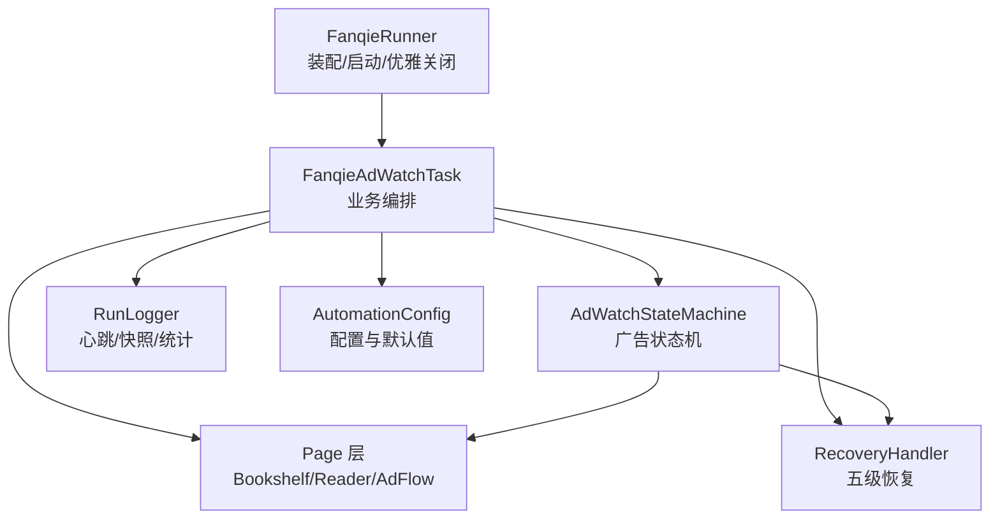
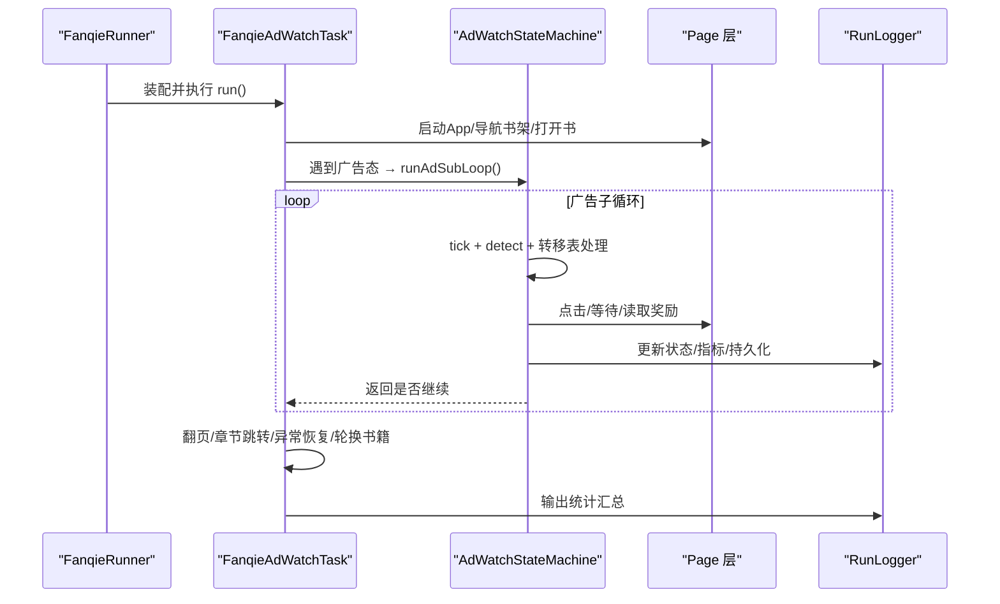
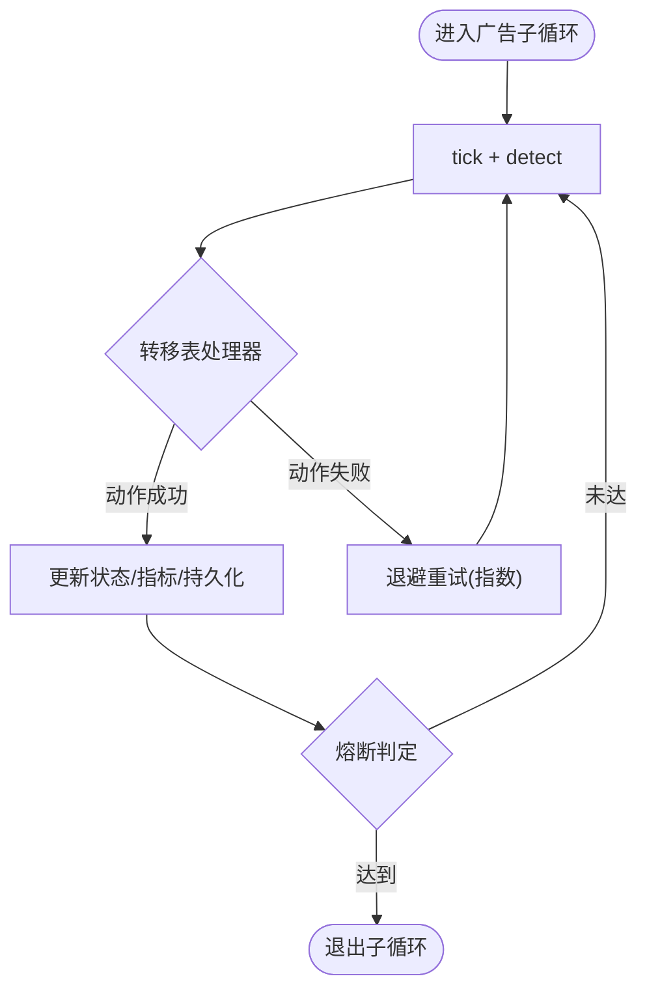
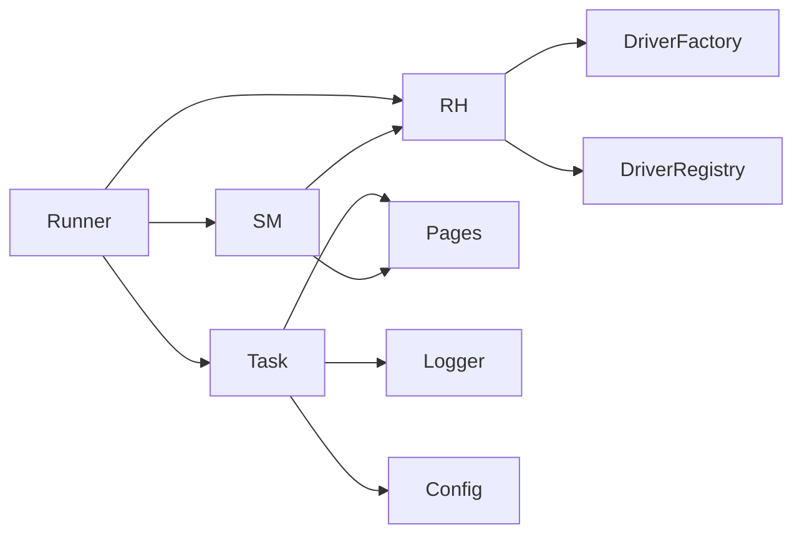
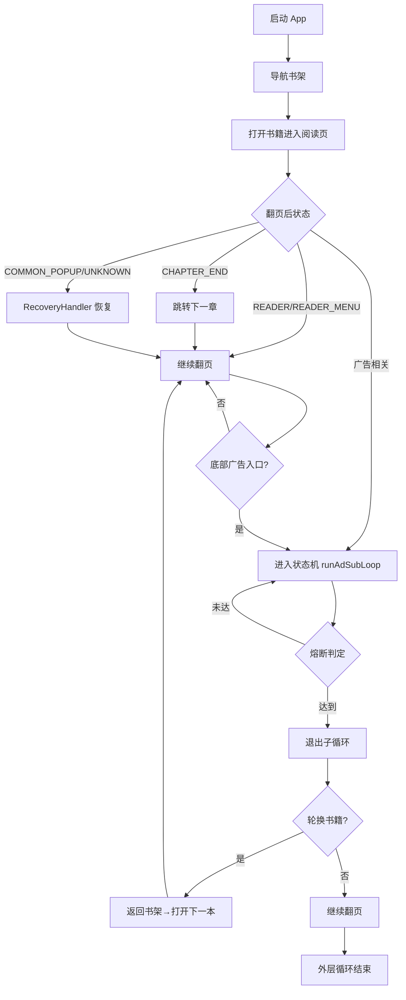

# 任务编排器

<cite>
**本文引用的文件**   
- [FanqieAdWatchTask.java](file://automation/src/main/java/com/fanqie/auto/task/FanqieAdWatchTask.java)
- [AdWatchStateMachine.java](file://automation/src/main/java/com/fanqie/auto/task/AdWatchStateMachine.java)
- [RecoveryHandler.java](file://automation/src/main/java/com/fanqie/auto/task/RecoveryHandler.java)
- [Task.java](file://automation/src/main/java/com/fanqie/auto/task/Task.java)
- [FanqieRunner.java](file://automation/src/main/java/com/fanqie/auto/FanqieRunner.java)
- [AutomationConfig.java](file://automation/src/main/java/com/fanqie/auto/config/AutomationConfig.java)
- [RunLogger.java](file://automation/src/main/java/com/fanqie/auto/core/RunLogger.java)
- [AdFlowPage.java](file://automation/src/main/java/com/fanqie/auto/page/AdFlowPage.java)
- [ReaderPage.java](file://automation/src/main/java/com/fanqie/auto/page/ReaderPage.java)
- [BookshelfPage.java](file://automation/src/main/java/com/fanqie/auto/page/BookshelfPage.java)
</cite>

## 目录
1. [简介](#简介)
2. [项目结构](#项目结构)
3. [核心组件](#核心组件)
4. [架构总览](#架构总览)
5. [详细组件分析](#详细组件分析)
6. [依赖关系分析](#依赖关系分析)
7. [性能考量](#性能考量)
8. [故障排查指南](#故障排查指南)
9. [结论](#结论)
10. [附录](#附录)

## 简介
本文件面向“番茄免费小说”广告观看自动化任务的编排与调度，围绕 FanqieAdWatchTask 的任务生命周期、与 AdWatchStateMachine 的协作模式、配置参数解析与校验、监控指标收集、异常处理策略以及扩展开发指南进行系统化说明。文档同时提供调试方法与性能优化建议，帮助读者快速定位问题并提升长时运行的稳定性。

## 项目结构
该自动化工程采用分层组织：
- Runner 层：入口装配、命令行参数解析、环境自检、优雅关闭。
- Task 层：业务编排（启动 App、导航书架、阅读翻页、广告子循环、收尾统计）。
- StateMachine 层：状态机驱动的广告流程控制，转移表+熔断+持久化。
- Recovery 层：五级自愈处理器，保证任意失败回到已知锚点。
- Page 层：页面操作封装（书架、阅读器、广告流）。
- Core 层：检测、等待、手势、日志等通用能力。
- Config/Locator 层：配置加载与元素定位规则。

图表来源
- [FanqieRunner.java:41-221](file://automation/src/main/java/com/fanqie/auto/FanqieRunner.java#L41-L221)
- [FanqieAdWatchTask.java:99-314](file://automation/src/main/java/com/fanqie/auto/task/FanqieAdWatchTask.java#L99-L314)
- [AdWatchStateMachine.java:173-312](file://automation/src/main/java/com/fanqie/auto/task/AdWatchStateMachine.java#L173-L312)
- [RecoveryHandler.java:100-253](file://automation/src/main/java/com/fanqie/auto/task/RecoveryHandler.java#L100-L253)
- [RunLogger.java:150-197](file://automation/src/main/java/com/fanqie/auto/core/RunLogger.java#L150-L197)
- [AutomationConfig.java:180-260](file://automation/src/main/java/com/fanqie/auto/config/AutomationConfig.java#L180-L260)

章节来源
- [FanqieRunner.java:41-221](file://automation/src/main/java/com/fanqie/auto/FanqieRunner.java#L41-L221)
- [FanqieAdWatchTask.java:99-314](file://automation/src/main/java/com/fanqie/auto/task/FanqieAdWatchTask.java#L99-L314)

## 核心组件
- FanqieAdWatchTask：任务编排主流程，负责启动 App、进入书架、打开书籍、外层循环翻页、遇到广告态转入状态机、章节结束跳转下一章、异常恢复、轮换书籍、最终统计输出。
- AdWatchStateMachine：广告观看的状态机，基于转移表驱动，实现幂等动作、退避重试、四重熔断、每日配额耗尽识别、进度持久化与断点续跑。
- RecoveryHandler：五级恢复策略（弹窗关闭→逐级 back→重启 App→导航书架→重建 session），保障任意步失败回到锚点。
- RunLogger：运行期可观测性，心跳保活、状态转移日志、截图/XML 快照落盘、错误分布统计、最终汇总。
- AutomationConfig：统一配置加载与默认值，覆盖超时、轮次、阈值、翻页策略等。
- Page 层：BookshelfPage/ReaderPage/AdFlowPage 分别封装书架、阅读器、广告流的稳定交互。

章节来源
- [FanqieAdWatchTask.java:42-81](file://automation/src/main/java/com/fanqie/auto/task/FanqieAdWatchTask.java#L42-L81)
- [AdWatchStateMachine.java:62-157](file://automation/src/main/java/com/fanqie/auto/task/AdWatchStateMachine.java#L62-L157)
- [RecoveryHandler.java:23-43](file://automation/src/main/java/com/fanqie/auto/task/RecoveryHandler.java#L23-L43)
- [RunLogger.java:31-45](file://automation/src/main/java/com/fanqie/auto/core/RunLogger.java#L31-L45)
- [AutomationConfig.java:10-17](file://automation/src/main/java/com/fanqie/auto/config/AutomationConfig.java#L10-L17)

## 架构总览
任务编排器以“编排 + 状态机 + 恢复”为核心：
- 编排层（Task）：定义宏观流程与边界条件（目标分钟、墙钟预算、每日配额、轮次上限）。
- 状态机（SM）：将广告相关状态用转移表管理，确保任意跳变都能被吸收；每步动作前后均 detect 确认，避免误点。
- 恢复层（RH）：当状态机或编排层出现未知/异常状态，按由弱到强的策略恢复，必要时重建 session 并保留现场。

图表来源
- [FanqieRunner.java:147-221](file://automation/src/main/java/com/fanqie/auto/FanqieRunner.java#L147-L221)
- [FanqieAdWatchTask.java:99-314](file://automation/src/main/java/com/fanqie/auto/task/FanqieAdWatchTask.java#L99-L314)
- [AdWatchStateMachine.java:173-312](file://automation/src/main/java/com/fanqie/auto/task/AdWatchStateMachine.java#L173-L312)
- [RunLogger.java:150-197](file://automation/src/main/java/com/fanqie/auto/core/RunLogger.java#L150-L197)

## 详细组件分析

### 任务生命周期管理（启动初始化、执行调度、优雅关闭）
- 启动初始化
  - Runner 解析命令行参数（--doctor/--dry-run/--config/--cycles/--pages/--reset-progress），创建 DriverFactory、LocatorRegistry、EnvDoctor、RunLogger，注册 DriverAware 组件。
  - 若 --dry-run 则仅探测 UI 树不执行点击；否则装配 Page 层、State 机、Recovery、Task。
  - 应用命令行覆盖（cycles/pages），打印从 progress.properties 恢复的进度，支持 --reset-progress 清零。
- 执行调度
  - Task.run() 分阶段：启动 App→导航书架→选书进入阅读页→外层循环翻页→遇广告进入状态机→章节结束跳转下一章→异常恢复→轮换书籍→收尾统计。
  - 全局熔断：目标分钟达成、总轮次上限、墙钟时间预算耗尽、每日配额耗尽。
- 优雅关闭
  - ShutdownHook 与 finally 双重保护，调用 logger.stop() 与 driverFactory.quit()，防止 session 泄漏。
  - 运行结束时输出结构化统计（总时长、累计分钟、轮次、翻页数、平均识别耗时、异常分布）。

章节来源
- [FanqieRunner.java:41-238](file://automation/src/main/java/com/fanqie/auto/FanqieRunner.java#L41-L238)
- [FanqieAdWatchTask.java:99-314](file://automation/src/main/java/com/fanqie/auto/task/FanqieAdWatchTask.java#L99-L314)
- [RunLogger.java:284-345](file://automation/src/main/java/com/fanqie/auto/core/RunLogger.java#L284-L345)

### 与状态机的协作模式（完成完整广告观看循环）
- 触发时机：翻页后检测到广告相关状态（AD_ENTRY_PROMPT/AD_CONFIRM_DIALOG/AD_VIDEO_PLAYING/AD_CLOSE_READY/AD_CONTINUE_PROMPT/AD_REWARD_GRANTED）即进入状态机。
- 状态机职责：
  - 转移表驱动：每个状态对应处理器，动作前重新 detect 确认未漂移，动作后校验是否发生预期转移，未转移则退避重试并记录连续错误。
  - 幂等性与稳健性：视频播放期间不做任何点击，仅心跳轮询等待倒计时结束；关闭按钮启用全链路降级（语义→几何→时序→系统兜底）。
  - 熔断机制：目标分钟达成、单入口轮次上限、全局轮次上限、墙钟预算耗尽；单状态滞留超时触发恢复。
  - 每日配额耗尽识别：去抖计数 + 上下文约束（弹窗型关闭/取消按钮），命中后优雅收尾退出。
  - 奖励计数幂等：通过 roundId + lastCountedRoundId 保证每真实一轮至多计一次且不漏计；无明确奖励语义时回退保守估值。
  - 进度持久化：earnedMinutes/totalAdRounds/usedBooks 写入 progress.properties，支持断点续跑与跨天清空 usedBooks。

图表来源
- [AdWatchStateMachine.java:173-312](file://automation/src/main/java/com/fanqie/auto/task/AdWatchStateMachine.java#L173-L312)
- [AdWatchStateMachine.java:355-394](file://automation/src/main/java/com/fanqie/auto/task/AdWatchStateMachine.java#L355-L394)
- [AdWatchStateMachine.java:398-653](file://automation/src/main/java/com/fanqie/auto/task/AdWatchStateMachine.java#L398-L653)

章节来源
- [AdWatchStateMachine.java:62-157](file://automation/src/main/java/com/fanqie/auto/task/AdWatchStateMachine.java#L62-L157)
- [AdWatchStateMachine.java:173-312](file://automation/src/main/java/com/fanqie/auto/task/AdWatchStateMachine.java#L173-L312)
- [AdWatchStateMachine.java:355-394](file://automation/src/main/java/com/fanqie/auto/task/AdWatchStateMachine.java#L355-L394)
- [AdWatchStateMachine.java:398-653](file://automation/src/main/java/com/fanqie/auto/task/AdWatchStateMachine.java#L398-L653)

### 任务配置参数的解析和处理（运行参数验证与默认值设置）
- 配置加载：从 classpath 默认 properties 加载，外部 --config 路径覆盖；所有类型化 getter 带默认值，非法值安全降级为默认。
- 关键参数：
  - 时序：pollIntervalMs、actionTimeoutMs、appLaunchTimeoutMs、adVideoTimeoutMs、adCloseReadyTimeoutMs、maxStateDwellMs、heartbeatIntervalSec。
  - 流程：pagesPerCycle、maxAdRoundsPerEntry、maxTotalAdRounds、targetFreeMinutes、rewardFallbackMinutes、outerCycles、maxConsecutiveErrors、maxRecoveryRetry、maxWallClockMs。
  - 阅读策略：turnStrategy、nextTapRatioX/Y、prevTapRatioX、swipePercent、swipeDurationMs。
  - 运行时：dryRun、driverType（可扩展 uiautomator2/harmony_hdc）。
- 命令行覆盖：--cycles/--pages 直接覆盖 outerCycles/pagesPerCycle；--reset-progress 清除进度从零开始。

章节来源
- [AutomationConfig.java:18-108](file://automation/src/main/java/com/fanqie/auto/config/AutomationConfig.java#L18-L108)
- [AutomationConfig.java:180-260](file://automation/src/main/java/com/fanqie/auto/config/AutomationConfig.java#L180-L260)
- [FanqieRunner.java:48-87](file://automation/src/main/java/com/fanqie/auto/FanqieRunner.java#L48-L87)
- [FanqieRunner.java:203-214](file://automation/src/main/java/com/fanqie/auto/FanqieRunner.java#L203-L214)

### 监控指标收集机制（性能统计、错误记录、日志输出）
- 心跳保活：独立调度线程周期性轻量命令保活 session，并输出摘要（运行时长、当前状态、本轮视频进度、累计分钟、翻页数、连续错误、getPageSource 耗时、XML 大小）。
- 状态转移日志：每次状态变化输出转移信息，便于追踪流程。
- 错误分布统计：记录各类错误类型次数（如 daily_quota_exhausted、state_dwell_timeout、handler_exception_*、no_handler_*、recovery_failed）。
- 快照与 XML：异常/恢复时保存截图与 UI 树到 snapshots 目录，便于回溯。
- 最终统计：停止时输出结构化汇总（总时长、累计分钟、轮次、翻页数、识别次数与平均耗时、最终连续错误、异常分布）。

章节来源
- [RunLogger.java:150-197](file://automation/src/main/java/com/fanqie/auto/core/RunLogger.java#L150-L197)
- [RunLogger.java:204-229](file://automation/src/main/java/com/fanqie/auto/core/RunLogger.java#L204-L229)
- [RunLogger.java:239-261](file://automation/src/main/java/com/fanqie/auto/core/RunLogger.java#L239-L261)
- [RunLogger.java:312-345](file://automation/src/main/java/com/fanqie/auto/core/RunLogger.java#L312-L345)

### 异常处理策略（任务级异常捕获、资源清理、状态恢复）
- 任务级异常捕获：Runner 中 try-catch 捕获异常，记录 fatal_error 快照并以非零码退出。
- 状态机异常：动作后状态未转移或处理器抛异常，计入连续错误，超过阈值触发恢复；单状态滞留超时也触发恢复。
- 恢复策略（五级）：
  1) COMMON_POPUP 弹窗关闭（由弱到强文案匹配）
  2) 逐级 back() 并 detect 确认回到锚点
  3) 重启 App 并等待启动完成
  4) 主动导航到书架 Tab
  5) 重建 session（刷新所有 DriverAware 引用），仍失败则落盘诊断快照并标记会话死亡
- 资源清理：finally 与 ShutdownHook 保证 logger.stop() 与 driverFactory.quit() 幂等执行，防止 session 泄漏。

章节来源
- [FanqieRunner.java:228-238](file://automation/src/main/java/com/fanqie/auto/FanqieRunner.java#L228-L238)
- [AdWatchStateMachine.java:217-233](file://automation/src/main/java/com/fanqie/auto/task/AdWatchStateMachine.java#L217-L233)
- [AdWatchStateMachine.java:254-302](file://automation/src/main/java/com/fanqie/auto/task/AdWatchStateMachine.java#L254-L302)
- [RecoveryHandler.java:100-253](file://automation/src/main/java/com/fanqie/auto/task/RecoveryHandler.java#L100-L253)

### 任务扩展开发指南（添加新业务任务与自定义编排逻辑）
- 新增任务
  - 实现 Task 接口（run()/getName()），在 FanqieRunner 中装配并注册到 DriverRegistry。
  - 复用现有 Page 层与 Core 能力（GestureSupport、WaitSupport、StateDetector、RunLogger）。
  - 如需广告流程，可复用 AdWatchStateMachine 的 runAdSubLoop() 与转移表机制。
- 自定义编排逻辑
  - 在 Task 中组合 Page 操作与状态机调用，遵循“动作前 detect 确认、动作后校验转移”的原则。
  - 使用 AutomationConfig 统一管理超时与阈值，避免硬编码。
  - 利用 RecoveryHandler 处理异常状态，确保回到已知锚点。
- 扩展点
  - LocatorRegistry：新增元素定位规则（文案、XPath、几何区域）。
  - Page 层：新增页面操作封装，保持幂等与健壮性。
  - StateMachine：新增状态处理器，接入转移表。
  - DriverFactory：未来支持其他驱动类型（如 harmony_hdc），上层零改动。

章节来源
- [Task.java:12-25](file://automation/src/main/java/com/fanqie/auto/task/Task.java#L12-L25)
- [FanqieRunner.java:173-201](file://automation/src/main/java/com/fanqie/auto/FanqieRunner.java#L173-L201)
- [AutomationConfig.java:166-178](file://automation/src/main/java/com/fanqie/auto/config/AutomationConfig.java#L166-L178)

### 任务调试方法
- 环境自检：--doctor 仅运行环境检查，不创建 session。
- Dry-run 模式：--dry-run 连接设备并 dump UI 树，不执行任何点击，适合验证定位与状态识别。
- 进度重置：--reset-progress 清除 progress.properties，从零开始。
- 日志与快照：查看 automation/logs 下的运行日志与 snapshots 目录中的截图/XML，关注心跳摘要与异常分布。
- 状态机调试：关注状态转移日志与连续错误计数，必要时调整 maxStateDwellMs 或增加恢复重试次数。

章节来源
- [FanqieRunner.java:48-87](file://automation/src/main/java/com/fanqie/auto/FanqieRunner.java#L48-L87)
- [FanqieRunner.java:162-171](file://automation/src/main/java/com/fanqie/auto/FanqieRunner.java#L162-L171)
- [FanqieRunner.java:207-214](file://automation/src/main/java/com/fanqie/auto/FanqieRunner.java#L207-L214)
- [RunLogger.java:239-261](file://automation/src/main/java/com/fanqie/auto/core/RunLogger.java#L239-L261)

### 性能优化建议
- 降低高频 RPC：视频等待使用稀疏轮询间隔（pollIntervalMs * 4），减少 getPageSource 压力。
- 合理超时：根据设备性能调整 actionTimeoutMs、appLaunchTimeoutMs、adVideoTimeoutMs、adCloseReadyTimeoutMs。
- 避免误点：对高风险按钮（观看广告、继续获取时长）禁用几何兜底，仅语义匹配，防止浪费配额。
- 状态机熔断：合理设置 maxAdRoundsPerEntry、maxTotalAdRounds、targetFreeMinutes、maxWallClockMs，避免无限循环。
- 日志与快照：仅在异常/恢复时落盘快照，避免频繁 IO；关注 XML 体积预警，排查 UI 树泄漏。
- 心跳保活：调整 heartbeatIntervalSec，平衡保活频率与资源消耗。

章节来源
- [AdFlowPage.java:116-163](file://automation/src/main/java/com/fanqie/auto/page/AdFlowPage.java#L116-L163)
- [AdFlowPage.java:76-101](file://automation/src/main/java/com/fanqie/auto/page/AdFlowPage.java#L76-L101)
- [AdFlowPage.java:272-297](file://automation/src/main/java/com/fanqie/auto/page/AdFlowPage.java#L272-L297)
- [AdWatchStateMachine.java:355-394](file://automation/src/main/java/com/fanqie/auto/task/AdWatchStateMachine.java#L355-L394)
- [RunLogger.java:188-192](file://automation/src/main/java/com/fanqie/auto/core/RunLogger.java#L188-L192)

## 依赖关系分析
- FanqieRunner 依赖 AutomationConfig、DriverFactory、LocatorRegistry、EnvDoctor、RunLogger、Page 层、State 机、Recovery、Task。
- FanqieAdWatchTask 依赖 Page 层、State 机、Recovery、Core 能力（Detector、Wait、Gestures、Logger）。
- AdWatchStateMachine 依赖 Page 层、Recovery、Core 能力，并通过转移表解耦具体动作。
- RecoveryHandler 依赖 DriverFactory、DriverRegistry、Page 层、Core 能力，具备 session 重建与引用刷新能力。
- RunLogger 依赖 Driver 进行保活与快照落盘，提供可观测性。

图表来源
- [FanqieRunner.java:147-201](file://automation/src/main/java/com/fanqie/auto/FanqieRunner.java#L147-L201)
- [FanqieAdWatchTask.java:42-81](file://automation/src/main/java/com/fanqie/auto/task/FanqieAdWatchTask.java#L42-L81)
- [AdWatchStateMachine.java:62-157](file://automation/src/main/java/com/fanqie/auto/task/AdWatchStateMachine.java#L62-L157)
- [RecoveryHandler.java:44-76](file://automation/src/main/java/com/fanqie/auto/task/RecoveryHandler.java#L44-L76)
- [RunLogger.java:46-86](file://automation/src/main/java/com/fanqie/auto/core/RunLogger.java#L46-L86)

章节来源
- [FanqieRunner.java:147-201](file://automation/src/main/java/com/fanqie/auto/FanqieRunner.java#L147-L201)
- [FanqieAdWatchTask.java:42-81](file://automation/src/main/java/com/fanqie/auto/task/FanqieAdWatchTask.java#L42-L81)
- [AdWatchStateMachine.java:62-157](file://automation/src/main/java/com/fanqie/auto/task/AdWatchStateMachine.java#L62-L157)
- [RecoveryHandler.java:44-76](file://automation/src/main/java/com/fanqie/auto/task/RecoveryHandler.java#L44-L76)
- [RunLogger.java:46-86](file://automation/src/main/java/com/fanqie/auto/core/RunLogger.java#L46-L86)

## 性能考量
- 视频等待阶段采用稀疏轮询，降低 CPU 与 RPC 开销。
- 关闭按钮启用全链路降级，但严格控制高风险按钮的几何兜底，避免误点导致流程偏离。
- 状态机熔断机制防止死循环空转，结合墙钟预算与每日配额识别，确保长时运行可控。
- 日志与快照仅在必要时机落盘，避免频繁 IO 影响性能。
- 心跳保活线程内部捕获异常，确保调度线程不被杀死，维持 session 存活。

[本节为通用性能讨论，不直接分析具体文件]

## 故障排查指南
- 常见问题定位
  - 无法进入书架：检查 launchAndNavigateToShelf 流程，确认开屏广告与弹窗处理是否正确。
  - 误开短剧/视频页：使用 isVideoPage 判断并返回首页重新点击书架换书。
  - 广告子循环卡住：查看状态机日志，确认是否触发单状态滞留熔断或连续错误恢复。
  - 每日配额耗尽：观察 matchesDailyQuotaExhausted 的去抖计数与上下文约束，确认优雅收尾。
  - 奖励未计数：检查 M3 roundId 与 lastCountedRoundId 逻辑，确认 AD_REWARD_GRANTED 处理器是否执行。
- 调试手段
  - 使用 --dry-run 验证 UI 树与状态识别。
  - 查看 snapshots 目录中的截图与 XML，对比状态机转移日志。
  - 调整配置参数（超时、轮次、阈值）观察行为变化。
  - 使用 --reset-progress 重置进度，排除历史数据干扰。

章节来源
- [FanqieAdWatchTask.java:322-396](file://automation/src/main/java/com/fanqie/auto/task/FanqieAdWatchTask.java#L322-L396)
- [FanqieAdWatchTask.java:404-452](file://automation/src/main/java/com/fanqie/auto/task/FanqieAdWatchTask.java#L404-L452)
- [AdWatchStateMachine.java:197-215](file://automation/src/main/java/com/fanqie/auto/task/AdWatchStateMachine.java#L197-L215)
- [AdWatchStateMachine.java:561-595](file://automation/src/main/java/com/fanqie/auto/task/AdWatchStateMachine.java#L561-L595)
- [FanqieRunner.java:162-171](file://automation/src/main/java/com/fanqie/auto/FanqieRunner.java#L162-L171)

## 结论
本任务编排器通过“编排 + 状态机 + 恢复”的架构，实现了番茄免费小说广告观看自动化的稳定运行。FanqieAdWatchTask 负责宏观流程与边界条件，AdWatchStateMachine 以转移表驱动确保广告流程的幂等与稳健，RecoveryHandler 提供五级恢复保障任意失败回到锚点。配合 RunLogger 的可观测性与 AutomationConfig 的统一配置，系统在长时运行中具备高可用性与易维护性。扩展新任务只需实现 Task 接口并复用现有能力，即可快速集成。

[本节为总结性内容，不直接分析具体文件]

## 附录
- 关键流程图

图表来源
- [FanqieAdWatchTask.java:168-305](file://automation/src/main/java/com/fanqie/auto/task/FanqieAdWatchTask.java#L168-L305)
- [AdWatchStateMachine.java:173-312](file://automation/src/main/java/com/fanqie/auto/task/AdWatchStateMachine.java#L173-L312)
- [RecoveryHandler.java:100-253](file://automation/src/main/java/com/fanqie/auto/task/RecoveryHandler.java#L100-L253)