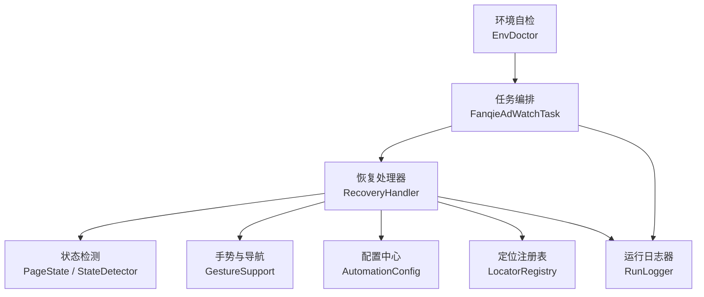
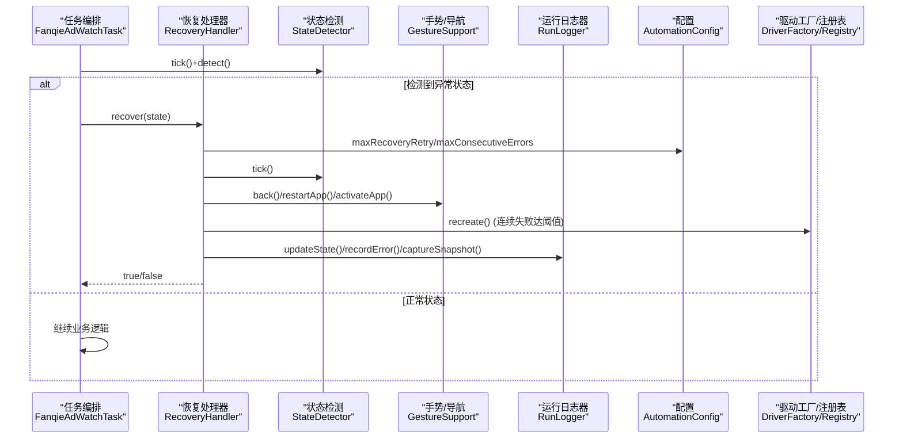
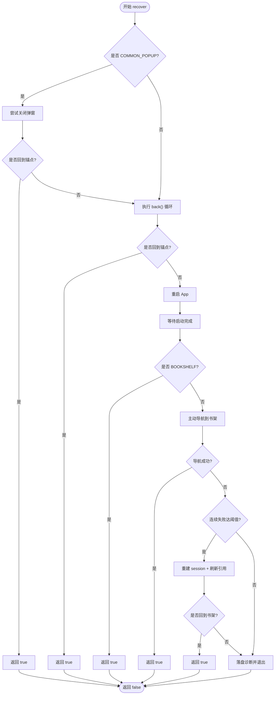
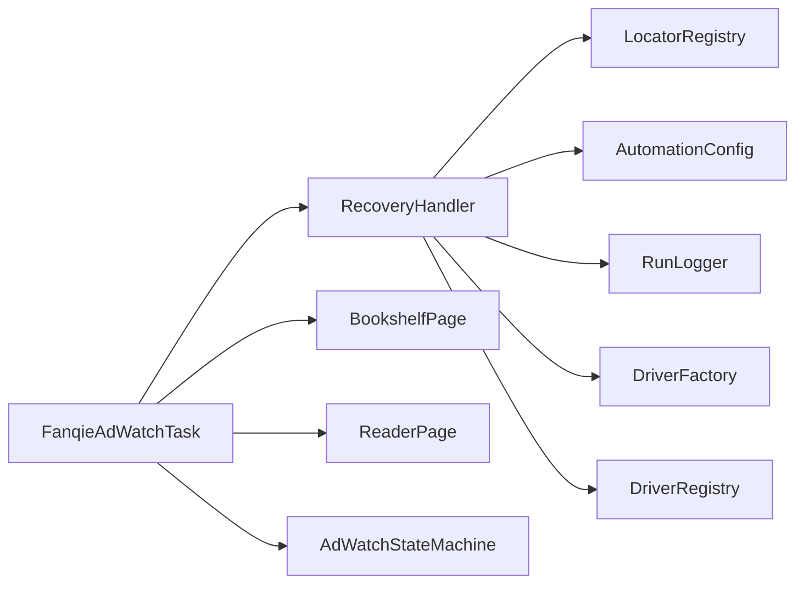

# 异常恢复处理器

<cite>
**本文引用的文件**
- [RecoveryHandler.java](file://automation/src/main/java/com/fanqie/auto/task/RecoveryHandler.java)
- [FanqieAdWatchTask.java](file://automation/src/main/java/com/fanqie/auto/task/FanqieAdWatchTask.java)
- [RunLogger.java](file://automation/src/main/java/com/fanqie/auto/core/RunLogger.java)
- [AutomationConfig.java](file://automation/src/main/java/com/fanqie/auto/config/AutomationConfig.java)
- [LocatorRegistry.java](file://automation/src/main/java/com/fanqie/auto/config/LocatorRegistry.java)
- [PageState.java](file://automation/src/main/java/com/fanqie/auto/core/PageState.java)
- [EnvDoctor.java](file://automation/src/main/java/com/fanqie/auto/core/EnvDoctor.java)
</cite>

## 目录
1. [简介](#简介)
2. [项目结构](#项目结构)
3. [核心组件](#核心组件)
4. [架构总览](#架构总览)
5. [详细组件分析](#详细组件分析)
6. [依赖关系分析](#依赖关系分析)
7. [性能与稳定性考虑](#性能与稳定性考虑)
8. [故障排查指南](#故障排查指南)
9. [结论](#结论)
10. [附录：配置与测试](#附录配置与测试)

## 简介
本文件聚焦自动化任务中的“异常恢复处理器”，系统性解析 RecoveryHandler 的多级恢复机制，覆盖五级恢复策略（弹窗关闭、页面导航 back()、应用重启、导航到书架、重建 session）、恢复决策算法（错误识别、策略选择、成功率评估）、熔断保护、幂等性保证、监控与日志记录、可配置化恢复行为，以及恢复测试方法与故障模拟实践。目标是让读者在不深入源码的情况下也能理解并正确使用该恢复体系。

## 项目结构
围绕恢复能力的关键代码分布在以下模块：
- 任务编排层：FanqieAdWatchTask 负责业务主流程，并在异常状态处委派给 RecoveryHandler。
- 恢复处理层：RecoveryHandler 实现多级恢复策略，协调 UI 操作、App 生命周期与 Session 重建。
- 运行观测层：RunLogger 提供心跳保活、截图与 XML 快照落盘、统计汇总。
- 配置与定位层：AutomationConfig 集中管理超时、轮次、阈值；LocatorRegistry 管理控件文案与定位策略。
- 状态与诊断层：PageState 定义状态机枚举；EnvDoctor 提供环境自检。

图表来源
- [FanqieAdWatchTask.java:99-314](file://automation/src/main/java/com/fanqie/auto/task/FanqieAdWatchTask.java#L99-L314)
- [RecoveryHandler.java:100-253](file://automation/src/main/java/com/fanqie/auto/task/RecoveryHandler.java#L100-L253)
- [RunLogger.java:150-197](file://automation/src/main/java/com/fanqie/auto/core/RunLogger.java#L150-L197)
- [AutomationConfig.java:182-260](file://automation/src/main/java/com/fanqie/auto/config/AutomationConfig.java#L182-L260)
- [LocatorRegistry.java:123-137](file://automation/src/main/java/com/fanqie/auto/config/LocatorRegistry.java#L123-L137)
- [EnvDoctor.java:48-71](file://automation/src/main/java/com/fanqie/auto/core/EnvDoctor.java#L48-L71)

章节来源
- [FanqieAdWatchTask.java:99-314](file://automation/src/main/java/com/fanqie/auto/task/FanqieAdWatchTask.java#L99-L314)
- [RecoveryHandler.java:100-253](file://automation/src/main/java/com/fanqie/auto/task/RecoveryHandler.java#L100-L253)
- [RunLogger.java:150-197](file://automation/src/main/java/com/fanqie/auto/core/RunLogger.java#L150-L197)
- [AutomationConfig.java:182-260](file://automation/src/main/java/com/fanqie/auto/config/AutomationConfig.java#L182-L260)
- [LocatorRegistry.java:123-137](file://automation/src/main/java/com/fanqie/auto/config/LocatorRegistry.java#L123-L137)
- [EnvDoctor.java:48-71](file://automation/src/main/java/com/fanqie/auto/core/EnvDoctor.java#L48-L71)

## 核心组件
- RecoveryHandler：实现五级恢复策略，统一入口 recover(currentState)，内部按弱到强顺序尝试弹窗关闭、逐级 back()、重启 App、导航到书架、重建 session，最终失败时落盘诊断并标记会话死亡。
- FanqieAdWatchTask：在翻页、广告子循环、选书等关键路径中遇到异常状态时调用 recoveryHandler.recover(...)，并在恢复后确保回到阅读页家族。
- RunLogger：提供心跳保活、状态转移日志、截图与 XML 快照落盘、错误分布统计与最终统计输出。
- AutomationConfig：集中管理所有超时、轮次、阈值与开关，支持外部 properties 覆盖。
- LocatorRegistry：维护通用弹窗关闭文案、广告关闭文案、书架 Tab 文案等候选集，供恢复与定位使用。
- PageState：定义状态机枚举，包含 isAbnormal()/isReaderFamily() 等判断方法，作为恢复决策的输入。
- EnvDoctor：启动前执行设备、Appium Server、App 安装等检查，减少运行时异常。

章节来源
- [RecoveryHandler.java:100-253](file://automation/src/main/java/com/fanqie/auto/task/RecoveryHandler.java#L100-L253)
- [FanqieAdWatchTask.java:197-314](file://automation/src/main/java/com/fanqie/auto/task/FanqieAdWatchTask.java#L197-L314)
- [RunLogger.java:150-197](file://automation/src/main/java/com/fanqie/auto/core/RunLogger.java#L150-L197)
- [AutomationConfig.java:182-260](file://automation/src/main/java/com/fanqie/auto/config/AutomationConfig.java#L182-L260)
- [LocatorRegistry.java:123-137](file://automation/src/main/java/com/fanqie/auto/config/LocatorRegistry.java#L123-L137)
- [PageState.java:69-90](file://automation/src/main/java/com/fanqie/auto/core/PageState.java#L69-L90)
- [EnvDoctor.java:48-71](file://automation/src/main/java/com/fanqie/auto/core/EnvDoctor.java#L48-L71)

## 架构总览
下图展示恢复流程在任务编排与恢复处理器之间的交互，以及各组件的职责边界。

图表来源
- [FanqieAdWatchTask.java:197-314](file://automation/src/main/java/com/fanqie/auto/task/FanqieAdWatchTask.java#L197-L314)
- [RecoveryHandler.java:100-253](file://automation/src/main/java/com/fanqie/auto/task/RecoveryHandler.java#L100-L253)
- [RunLogger.java:204-229](file://automation/src/main/java/com/fanqie/auto/core/RunLogger.java#L204-L229)
- [AutomationConfig.java:254-260](file://automation/src/main/java/com/fanqie/auto/config/AutomationConfig.java#L254-L260)

## 详细组件分析

### RecoveryHandler 多级恢复机制
- 第1级：弹窗关闭（COMMON_POPUP）
  - 通过 LocatorRegistry.commonDismissTexts() 获取由弱到强的候选文案，依次匹配 text/content-desc，点击首个可点击节点或最近可点击祖先。
  - 成功后重新 detect，仅当进入显式锚点（READER/BOOKSHELF）才判定成功，避免误判。
- 第2级：逐级 back()
  - 最多 maxRecoveryRetry 次，每次 back 后等待 UI 稳定并重新 detect，若到达锚点则成功；若再次出现弹窗则尝试关闭。
- 第3级：重启 App
  - 调用 gestures.restartApp(appPackage)，等待至 BOOKSHELF/SPLASH_AD/COMMON_POPUP/APP_LAUNCHING。
- 第4级：导航到书架
  - 若重启后非 BOOKSHELF，主动调用 BookshelfPage.switchToShelfTab() 回到书架。
- 第5级：重建 session
  - 当连续失败次数达到 maxConsecutiveErrors，调用 driverFactory.recreate() 重建会话，并通过 DriverRegistry.refreshAll(newDriver) 刷新所有组件的 driver 引用，再激活 App 并等待回到书架。
- 兜底：落盘诊断
  - 所有手段失败时记录错误类型、保存截图与 XML 快照、标记会话死亡并返回 false。

图表来源
- [RecoveryHandler.java:100-253](file://automation/src/main/java/com/fanqie/auto/task/RecoveryHandler.java#L100-L253)
- [LocatorRegistry.java:123-137](file://automation/src/main/java/com/fanqie/auto/config/LocatorRegistry.java#L123-L137)
- [AutomationConfig.java:254-260](file://automation/src/main/java/com/fanqie/auto/config/AutomationConfig.java#L254-L260)

章节来源
- [RecoveryHandler.java:100-253](file://automation/src/main/java/com/fanqie/auto/task/RecoveryHandler.java#L100-L253)
- [LocatorRegistry.java:123-137](file://automation/src/main/java/com/fanqie/auto/config/LocatorRegistry.java#L123-L137)
- [AutomationConfig.java:254-260](file://automation/src/main/java/com/fanqie/auto/config/AutomationConfig.java#L254-L260)

### 恢复决策算法
- 错误类型识别
  - 基于 PageState 的状态分类：UNKNOWN、COMMON_POPUP、RECOVERY_NEEDED 视为异常；READER/READER_MENU 为阅读页家族；其他广告相关状态由上层状态机处理。
- 策略选择
  - 优先尝试副作用最小的操作（关闭弹窗），逐步升级到影响面更大的操作（back、重启、重建 session）。
  - 每次操作后必须重新 detect，并以显式锚点（READER/BOOKSHELF）作为成功判定条件。
- 成功率评估
  - 通过 RunLogger 的 consecutiveErrors、errorDistribution、detectCount 等指标评估恢复成功率与失败原因分布。
  - 心跳摘要中包含当前状态、累计时长、翻页数、连续错误、XML 体积等，便于快速定位问题。

章节来源
- [PageState.java:69-90](file://automation/src/main/java/com/fanqie/auto/core/PageState.java#L69-L90)
- [RecoveryHandler.java:100-253](file://automation/src/main/java/com/fanqie/auto/task/RecoveryHandler.java#L100-L253)
- [RunLogger.java:150-197](file://automation/src/main/java/com/fanqie/auto/core/RunLogger.java#L150-L197)
- [RunLogger.java:204-229](file://automation/src/main/java/com/fanqie/auto/core/RunLogger.java#L204-L229)

### 熔断保护机制
- 任务级熔断
  - 墙钟时间预算：超过 maxWallClockMs 优雅收尾，防止无限占用设备。
  - 目标达成熔断：达到 targetFreeMinutes 或 maxTotalAdRounds 提前结束。
  - 每日配额耗尽：优雅收尾并汇总统计。
- 恢复级熔断
  - 超过 maxRecoveryRetry 停止盲目连点，保留现场并退出。
  - 连续失败达到 maxConsecutiveErrors 触发 session 重建；仍失败则落盘诊断。
- 会话健康熔断
  - RunLogger 心跳保活失败时标记 sessionAlive=false，避免后续操作静默失效。

章节来源
- [FanqieAdWatchTask.java:167-195](file://automation/src/main/java/com/fanqie/auto/task/FanqieAdWatchTask.java#L167-L195)
- [RecoveryHandler.java:212-253](file://automation/src/main/java/com/fanqie/auto/task/RecoveryHandler.java#L212-L253)
- [RunLogger.java:150-197](file://automation/src/main/java/com/fanqie/auto/core/RunLogger.java#L150-L197)
- [AutomationConfig.java:241-260](file://automation/src/main/java/com/fanqie/auto/config/AutomationConfig.java#L241-L260)

### 幂等性保证
- 导航幂等
  - switchToShelfTab() 在已在书架时为幂等空操作，避免重复切换造成状态抖动。
- 恢复幂等
  - 恢复成功后重置 consecutiveErrors 并记录状态转移，避免重复计数导致误判。
- 日志幂等
  - RunLogger.stop() 幂等，防止 finally 与 ShutdownHook 重复关闭资源。
- 会话重建幂等
  - refreshAll(newDriver) 刷新所有组件的 driver 引用，避免旧 session 导致的 NoSuchSessionException。

章节来源
- [FanqieAdWatchTask.java:322-395](file://automation/src/main/java/com/fanqie/auto/task/FanqieAdWatchTask.java#L322-L395)
- [RecoveryHandler.java:113-118](file://automation/src/main/java/com/fanqie/auto/task/RecoveryHandler.java#L113-L118)
- [RecoveryHandler.java:223-226](file://automation/src/main/java/com/fanqie/auto/task/RecoveryHandler.java#L223-L226)
- [RunLogger.java:284-307](file://automation/src/main/java/com/fanqie/auto/core/RunLogger.java#L284-L307)

### 监控与日志记录
- 心跳摘要
  - 每 heartbeat.interval.sec 输出已运行时长、当前状态、广告轮次、累计时长、翻页数、连续错误、getPageSource 耗时、XML 体积。
- 状态转移日志
  - updateState(newState) 记录状态变化，便于追踪恢复前后状态。
- 错误分布统计
  - recordError(errorType) 累计各类错误次数，结束时输出异常分布。
- 现场取证
  - captureSnapshot(tag) 保存截图与 XML 快照到 snapshots 目录，用于恢复失败时的根因分析。

章节来源
- [RunLogger.java:150-197](file://automation/src/main/java/com/fanqie/auto/core/RunLogger.java#L150-L197)
- [RunLogger.java:204-229](file://automation/src/main/java/com/fanqie/auto/core/RunLogger.java#L204-L229)
- [RunLogger.java:239-261](file://automation/src/main/java/com/fanqie/auto/core/RunLogger.java#L239-L261)
- [RunLogger.java:312-345](file://automation/src/main/java/com/fanqie/auto/core/RunLogger.java#L312-L345)

### 恢复策略的配置方法
- 恢复与熔断阈值
  - flow.max.recovery.retry：最大 back() 次数
  - flow.max.consecutive.errors：触发 session 重建的连续失败次数
  - flow.max.wall.clock.ms：墙钟时间预算（毫秒）
  - flow.target.free.minutes：目标免广告分钟数
  - flow.max.total.ad.rounds：总广告轮次上限
- 时序与超时
  - timing.poll.interval.ms：轮询间隔
  - timing.app.launch.timeout.ms：App 启动超时
  - timing.action.timeout.ms：动作超时
- 弹窗关闭文案
  - common.dismiss.text：通用弹窗关闭候选文案（由弱到强排列）
- 外部覆盖
  - 通过 AutomationConfig(externalPath) 加载外部 properties 覆盖默认值，无需重新编译即可调整恢复行为。

章节来源
- [AutomationConfig.java:241-260](file://automation/src/main/java/com/fanqie/auto/config/AutomationConfig.java#L241-L260)
- [AutomationConfig.java:182-204](file://automation/src/main/java/com/fanqie/auto/config/AutomationConfig.java#L182-L204)
- [LocatorRegistry.java:123-137](file://automation/src/main/java/com/fanqie/auto/config/LocatorRegistry.java#L123-L137)
- [AutomationConfig.java:30-42](file://automation/src/main/java/com/fanqie/auto/config/AutomationConfig.java#L30-L42)

### 恢复测试方法与故障模拟
- 单元测试建议
  - 针对 dismissPopup(snapshot) 构造不同 UI 快照，验证 by text 与 by content-desc 的命中与点击路径。
  - 模拟 back() 异常与超时，验证恢复流程降级到重启与重建 session。
  - 注入 mock DriverFactory 返回 null，验证连续失败后的落盘诊断分支。
- 集成测试建议
  - 使用 DryRunProbe 进行 dry-run 探测，结合 RunLogger 的快照目录验证恢复现场。
  - 通过环境变量或命令行参数覆盖 cycles/pages，缩短测试周期。
- 故障模拟工具
  - 使用 EnvDoctor.checkAll() 在启动前校验设备、Appium Server、App 安装状态，减少运行时不确定性。
  - 通过修改 locators.properties 中的 common.dismiss.text 与 ad.close.text，模拟不同弹窗与广告场景。

章节来源
- [FanqieAdWatchTask.java:99-165](file://automation/src/main/java/com/fanqie/auto/task/FanqieAdWatchTask.java#L99-L165)
- [RecoveryHandler.java:269-321](file://automation/src/main/java/com/fanqie/auto/task/RecoveryHandler.java#L269-L321)
- [EnvDoctor.java:48-71](file://automation/src/main/java/com/fanqie/auto/core/EnvDoctor.java#L48-L71)

## 依赖关系分析
- 低耦合高内聚
  - RecoveryHandler 通过接口与配置解耦具体 UI 操作，依赖 GestureSupport、StateDetector、WaitSupport 等基础能力。
  - 通过 DriverRegistry.refreshAll(newDriver) 统一管理 driver 引用，避免散落的 driver 更新导致不一致。
- 直接依赖
  - RecoveryHandler → LocatorRegistry（弹窗文案）、AutomationConfig（阈值与超时）、RunLogger（日志与快照）、DriverFactory/Registry（session 重建与刷新）。
- 间接依赖
  - FanqieAdWatchTask → RecoveryHandler（异常恢复）、BookshelfPage/ReaderPage（导航与翻页）、AdWatchStateMachine（广告子循环）。

图表来源
- [RecoveryHandler.java:44-76](file://automation/src/main/java/com/fanqie/auto/task/RecoveryHandler.java#L44-L76)
- [FanqieAdWatchTask.java:42-81](file://automation/src/main/java/com/fanqie/auto/task/FanqieAdWatchTask.java#L42-L81)

章节来源
- [RecoveryHandler.java:44-76](file://automation/src/main/java/com/fanqie/auto/task/RecoveryHandler.java#L44-L76)
- [FanqieAdWatchTask.java:42-81](file://automation/src/main/java/com/fanqie/auto/task/FanqieAdWatchTask.java#L42-L81)

## 性能与稳定性考虑
- 最小副作用优先
  - 弹窗关闭优先使用无副作用文案（我知道了/以后再说/暂不/跳过），最后才尝试可能触发退出的取消按钮。
- 超时与等待
  - 使用 waitSupport.untilState 与 pollIntervalMs 控制等待节奏，避免频繁 UI 查询导致卡顿。
- 心跳保活
  - RunLogger 定时轻量命令保活，降低 newCommandTimeout 风险。
- 资源与内存
  - XML 体积异常预警，提示 UI 树泄漏风险；日志与快照写入独立目录，避免污染工程目录。

章节来源
- [RecoveryHandler.java:269-321](file://automation/src/main/java/com/fanqie/auto/task/RecoveryHandler.java#L269-L321)
- [RunLogger.java:150-197](file://automation/src/main/java/com/fanqie/auto/core/RunLogger.java#L150-L197)
- [AutomationConfig.java:182-204](file://automation/src/main/java/com/fanqie/auto/config/AutomationConfig.java#L182-L204)

## 故障排查指南
- 常见现象
  - 恢复多次失败：检查 locator 文案是否变更、设备授权状态、Appium Server 是否在线。
  - 无法回到书架：确认 switchToShelfTab() 是否幂等生效，back() 是否被系统拦截。
  - 会话断开：查看 RunLogger 心跳摘要与 sessionAlive 标志，必要时手动重启 Appium。
- 定位手段
  - 查看 snapshots 目录下的截图与 XML，结合 RunLogger 的状态转移日志定位恢复失败点。
  - 使用 EnvDoctor 的输出逐项排查设备与 Appium 环境。
- 处置建议
  - 调整 common.dismiss.text 与 ad.close.text，适配新版本 UI。
  - 增大 timing.app.launch.timeout.ms 或 timing.action.timeout.ms，缓解慢设备上的超时问题。
  - 调小 flow.max.recovery.retry 或 flow.max.consecutive.errors，尽早触发熔断与诊断。

章节来源
- [RunLogger.java:239-261](file://automation/src/main/java/com/fanqie/auto/core/RunLogger.java#L239-L261)
- [EnvDoctor.java:104-140](file://automation/src/main/java/com/fanqie/auto/core/EnvDoctor.java#L104-L140)
- [AutomationConfig.java:182-204](file://automation/src/main/java/com/fanqie/auto/config/AutomationConfig.java#L182-L204)

## 结论
RecoveryHandler 通过“由弱到强”的多级恢复策略，结合严格的锚点判定与熔断保护，显著提升了自动化任务的鲁棒性与可恢复性。配合 RunLogger 的心跳保活与现场取证、AutomationConfig 的可配置化阈值、LocatorRegistry 的文案候选集，形成了从预防、恢复到诊断的完整闭环。建议在持续迭代中关注弹窗文案变化与设备差异，及时调整配置与定位策略，保持恢复成功率与系统稳定性。

## 附录：配置与测试
- 推荐配置项
  - flow.max.recovery.retry=3
  - flow.max.consecutive.errors=3
  - timing.app.launch.timeout.ms=30000
  - timing.action.timeout.ms=8000
  - timing.poll.interval.ms=250
  - flow.target.free.minutes=120
  - flow.max.total.ad.rounds=40
  - flow.max.wall.clock.ms=10800000
- 测试步骤
  - 使用 DryRunProbe 进行 dry-run，观察 RunLogger 输出与 snapshots。
  - 修改 locators.properties 中的 common.dismiss.text，模拟不同弹窗。
  - 通过命令行参数覆盖 outerCycles 与 pagesPerCycle，缩短测试周期。
  - 在异常路径下验证 session 重建与 DriverRegistry 刷新是否生效。

章节来源
- [AutomationConfig.java:241-260](file://automation/src/main/java/com/fanqie/auto/config/AutomationConfig.java#L241-L260)
- [LocatorRegistry.java:123-137](file://automation/src/main/java/com/fanqie/auto/config/LocatorRegistry.java#L123-L137)
- [FanqieAdWatchTask.java:99-165](file://automation/src/main/java/com/fanqie/auto/task/FanqieAdWatchTask.java#L99-L165)