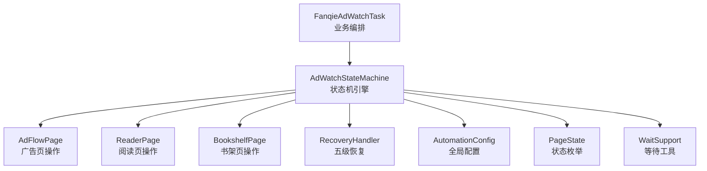
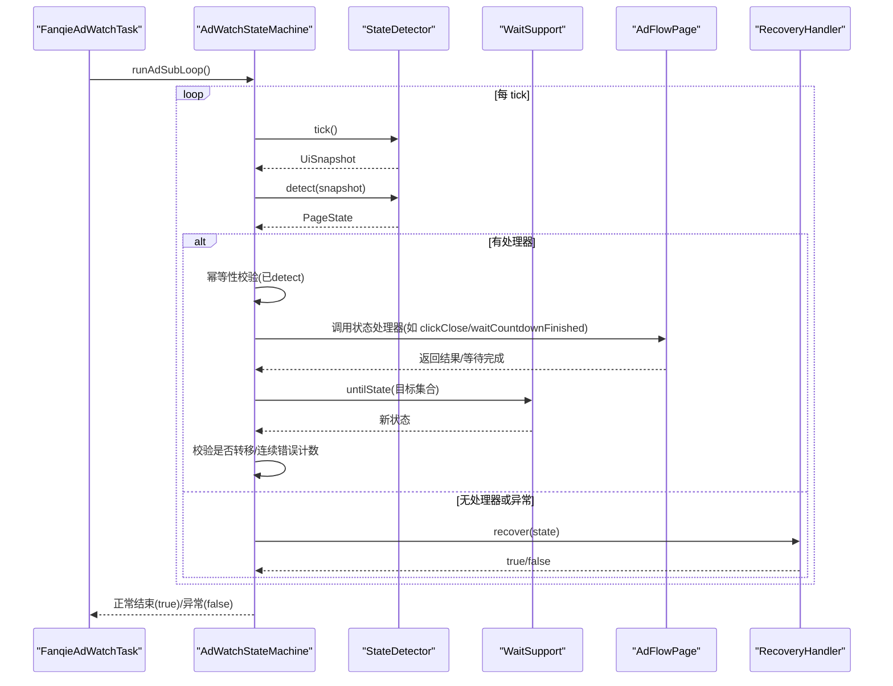
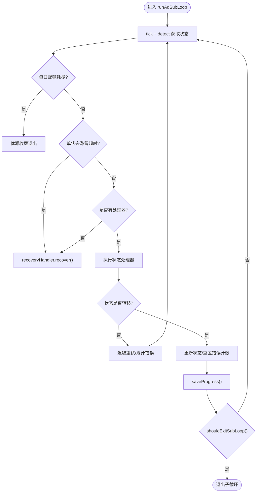
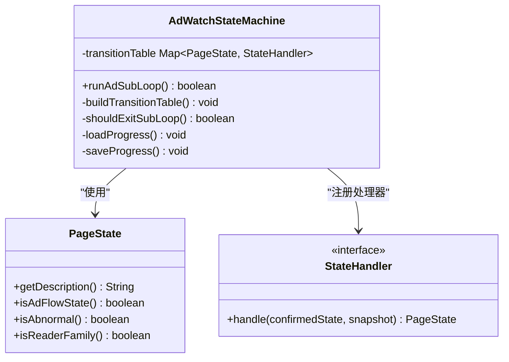
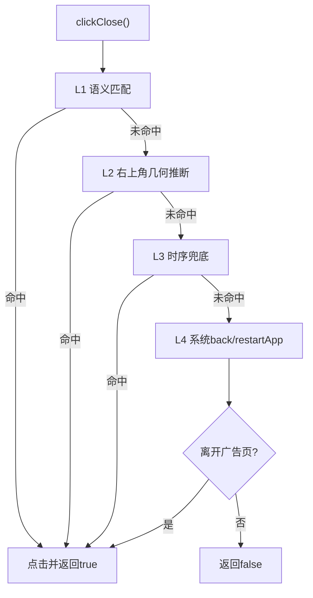
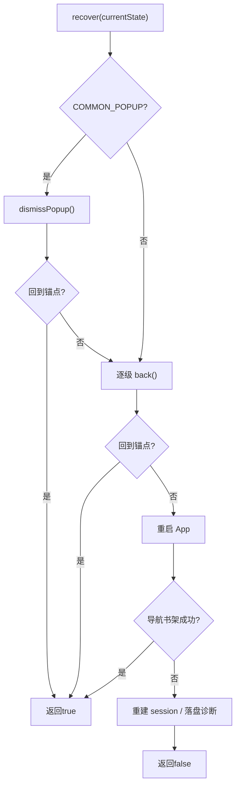
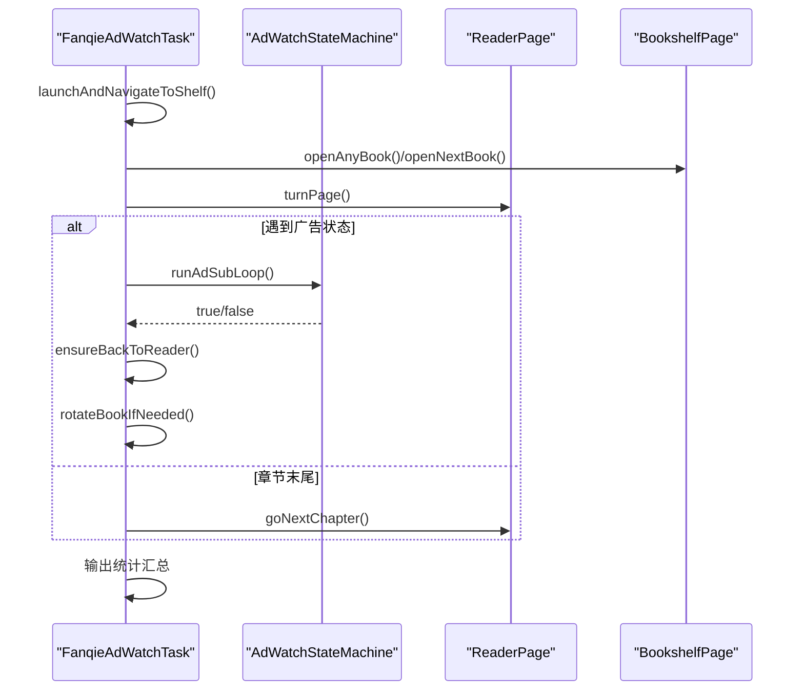
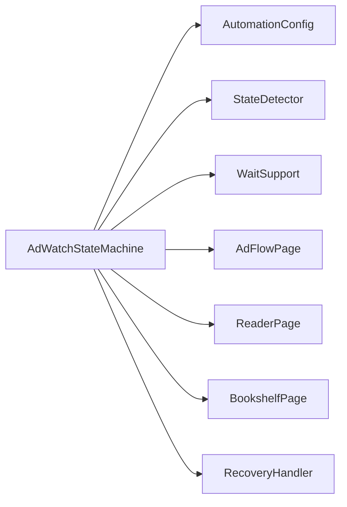
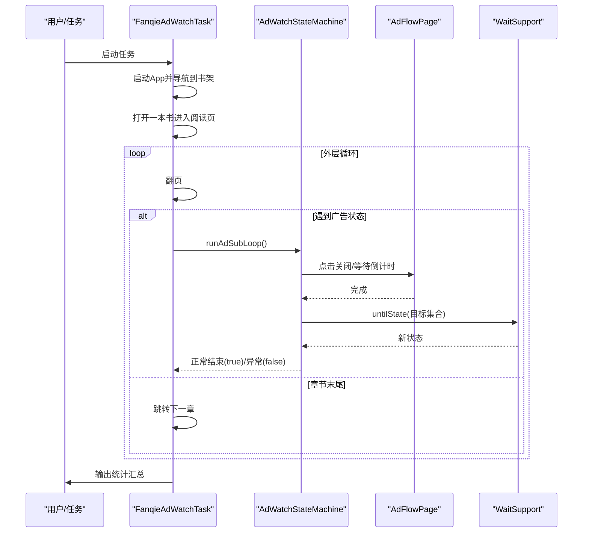
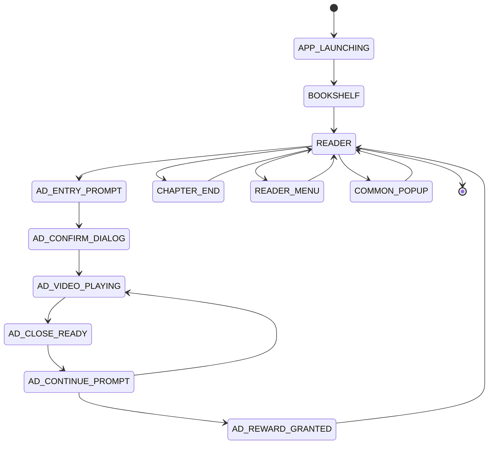

# 状态机设计

<cite>
**本文引用的文件**
- [AdWatchStateMachine.java](file://automation/src/main/java/com/fanqie/auto/task/AdWatchStateMachine.java)
- [FanqieAdWatchTask.java](file://automation/src/main/java/com/fanqie/auto/task/FanqieAdWatchTask.java)
- [AdFlowPage.java](file://automation/src/main/java/com/fanqie/auto/page/AdFlowPage.java)
- [RecoveryHandler.java](file://automation/src/main/java/com/fanqie/auto/task/RecoveryHandler.java)
- [AutomationConfig.java](file://automation/src/main/java/com/fanqie/auto/config/AutomationConfig.java)
- [PageState.java](file://automation/src/main/java/com/fanqie/auto/core/PageState.java)
- [WaitSupport.java](file://automation/src/main/java/com/fanqie/auto/core/WaitSupport.java)
- [ReaderPage.java](file://automation/src/main/java/com/fanqie/auto/page/ReaderPage.java)
- [AdWatchStateMachineTest.java](file://automation/src/test/java/com/fanqie/auto/task/AdWatchStateMachineTest.java)
</cite>

## 目录
1. [引言](#引言)
2. [项目结构](#项目结构)
3. [核心组件](#核心组件)
4. [架构总览](#架构总览)
5. [详细组件分析](#详细组件分析)
6. [依赖关系分析](#依赖关系分析)
7. [性能与稳定性考量](#性能与稳定性考量)
8. [故障诊断与调试指南](#故障诊断与调试指南)
9. [结论](#结论)
10. [附录：关键流程图与转移图](#附录：关键流程图与转移图)

## 引言
本设计文档围绕 AdWatchStateMachine 的状态机架构，系统性阐述“转移表驱动”的状态管理模式、四重熔断保护机制、幂等性保证、进度持久化（含断点续跑与跨天清理），以及完整的广告观看业务流程。文档面向不同技术背景的读者，提供从高层架构到代码级实现的渐进式说明，并辅以图示帮助理解。

## 项目结构
自动化任务由“业务编排层 + 状态机引擎 + 页面操作层 + 恢复与配置支撑”构成：
- 业务编排层：FanqieAdWatchTask 负责启动 App、翻页、触发广告子循环、书籍轮换与收尾统计。
- 状态机引擎：AdWatchStateMachine 以 PageState 为节点、StateHandler 为边，实现无固定顺序的弹性流程控制。
- 页面操作层：AdFlowPage、ReaderPage、BookshelfPage 封装具体 UI 交互。
- 恢复与配置：RecoveryHandler 提供五级自愈；AutomationConfig 集中管理超时、轮次、阈值等参数。

图表来源
- [AdWatchStateMachine.java:62-157](file://automation/src/main/java/com/fanqie/auto/task/AdWatchStateMachine.java#L62-L157)
- [FanqieAdWatchTask.java:42-81](file://automation/src/main/java/com/fanqie/auto/task/FanqieAdWatchTask.java#L42-L81)
- [AdFlowPage.java:38-65](file://automation/src/main/java/com/fanqie/auto/page/AdFlowPage.java#L38-L65)
- [RecoveryHandler.java:44-76](file://automation/src/main/java/com/fanqie/auto/task/RecoveryHandler.java#L44-L76)
- [AutomationConfig.java:18-42](file://automation/src/main/java/com/fanqie/auto/config/AutomationConfig.java#L18-L42)
- [PageState.java:11-56](file://automation/src/main/java/com/fanqie/auto/core/PageState.java#L11-L56)
- [WaitSupport.java:66-101](file://automation/src/main/java/com/fanqie/auto/core/WaitSupport.java#L66-L101)

章节来源
- [AdWatchStateMachine.java:62-157](file://automation/src/main/java/com/fanqie/auto/task/AdWatchStateMachine.java#L62-L157)
- [FanqieAdWatchTask.java:42-81](file://automation/src/main/java/com/fanqie/auto/task/FanqieAdWatchTask.java#L42-L81)

## 核心组件
- 状态机引擎（AdWatchStateMachine）
  - 转移表驱动：Map<PageState, StateHandler> 注册每个状态的处理器，运行时根据当前状态选择处理逻辑，不假设固定步骤顺序。
  - 四重熔断：单入口视频轮次上限、全局视频轮次上限、目标分钟数达成、单状态滞留超时。任一触发即退出广告子循环。
  - 幂等性：动作前重新 detect() 确认状态未漂移；动作后校验是否发生预期转移；连续错误计数退避重试。
  - 进度持久化：断点续跑、per-book 维度进度、跨天数据清理。
- 业务编排（FanqieAdWatchTask）
  - 启动 App → 导航书架 → 打开书进入阅读页 → 外层循环翻页 → 遇广告态进入状态机子循环 → 章节末尾跳转下一章 → 收尾统计。
- 页面操作（AdFlowPage/ReaderPage/BookshelfPage）
  - 广告关闭四级降级（语义→几何→时序→系统兜底）、奖励分钟提取、翻页与章节跳转、书架切换与选书。
- 恢复（RecoveryHandler）
  - 五级恢复：弹窗关闭→逐级 back→重启 App→导航书架→重建 session→落盘诊断。
- 配置（AutomationConfig）
  - 统一暴露所有超时、轮次、阈值、策略等参数，避免魔法数字。

章节来源
- [AdWatchStateMachine.java:120-157](file://automation/src/main/java/com/fanqie/auto/task/AdWatchStateMachine.java#L120-L157)
- [FanqieAdWatchTask.java:98-314](file://automation/src/main/java/com/fanqie/auto/task/FanqieAdWatchTask.java#L98-L314)
- [AdFlowPage.java:180-262](file://automation/src/main/java/com/fanqie/auto/page/AdFlowPage.java#L180-L262)
- [RecoveryHandler.java:100-253](file://automation/src/main/java/com/fanqie/auto/task/RecoveryHandler.java#L100-L253)
- [AutomationConfig.java:180-260](file://automation/src/main/java/com/fanqie/auto/config/AutomationConfig.java#L180-L260)

## 架构总览
状态机作为稳定核心，将“检测—决策—执行—校验”闭环内聚于 runAdSubLoop 主循环中；各状态处理器仅关注自身动作与后续等待，通过返回新状态交由上层继续决策。

图表来源
- [AdWatchStateMachine.java:173-312](file://automation/src/main/java/com/fanqie/auto/task/AdWatchStateMachine.java#L173-L312)
- [AdFlowPage.java:116-163](file://automation/src/main/java/com/fanqie/auto/page/AdFlowPage.java#L116-L163)
- [WaitSupport.java:66-101](file://automation/src/main/java/com/fanqie/auto/core/WaitSupport.java#L66-L101)
- [RecoveryHandler.java:100-253](file://automation/src/main/java/com/fanqie/auto/task/RecoveryHandler.java#L100-L253)

## 详细组件分析

### 状态机引擎：AdWatchStateMachine
- 转移表驱动
  - 使用 EnumMap<PageState, StateHandler> 注册处理器，支持任意状态跳变被吸收。
  - 每个处理器返回处理后状态，供主循环继续决策。
- 四重熔断
  - 目标分钟数达成（主退出条件）。
  - 单入口视频轮次达上限。
  - 全局视频轮次达上限。
  - 墙钟时间预算耗尽（D3）。
  - 单状态滞留超时在主循环单独检测（非此处重复）。
- 幂等性保证
  - 动作前已重新 detect() 确认状态未漂移。
  - 动作后校验是否发生预期转移；未转移则计入失败并退避重试。
  - 连续错误计数达到上限触发恢复。
- 进度持久化
  - 断点续跑：从 progress.properties 恢复 earnedMinutes、totalAdRounds、usedBooks。
  - per-book 维度：usedBooks 记录已用书籍标识，跨天清空。
  - 编码安全：URL 编码 usedBooks，兼容旧格式逗号分隔。

图表来源
- [AdWatchStateMachine.java:173-312](file://automation/src/main/java/com/fanqie/auto/task/AdWatchStateMachine.java#L173-L312)
- [AdWatchStateMachine.java:355-394](file://automation/src/main/java/com/fanqie/auto/task/AdWatchStateMachine.java#L355-L394)
- [AdWatchStateMachine.java:679-734](file://automation/src/main/java/com/fanqie/auto/task/AdWatchStateMachine.java#L679-L734)

章节来源
- [AdWatchStateMachine.java:120-157](file://automation/src/main/java/com/fanqie/auto/task/AdWatchStateMachine.java#L120-L157)
- [AdWatchStateMachine.java:173-312](file://automation/src/main/java/com/fanqie/auto/task/AdWatchStateMachine.java#L173-L312)
- [AdWatchStateMachine.java:355-394](file://automation/src/main/java/com/fanqie/auto/task/AdWatchStateMachine.java#L355-L394)
- [AdWatchStateMachine.java:679-734](file://automation/src/main/java/com/fanqie/auto/task/AdWatchStateMachine.java#L679-L734)

### 状态处理器与 PageState 枚举
- PageState 定义
  - 覆盖应用生命周期与广告流程关键状态：APP_LAUNCHING、SPLASH_AD、BOOKSHELF、READER、READER_MENU、AD_ENTRY_PROMPT、AD_CONFIRM_DIALOG、AD_VIDEO_PLAYING、AD_CLOSE_READY、AD_CONTINUE_PROMPT、AD_REWARD_GRANTED、CHAPTER_END、COMMON_POPUP、UNKNOWN、RECOVERY_NEEDED。
  - 提供 isAdFlowState()、isAbnormal()、isReaderFamily() 等便捷判定。
- 主要处理器
  - APP_LAUNCHING：心跳等待至 BOOKSHELF/SPLASH_AD/COMMON_POPUP。
  - SPLASH_AD：尝试跳过开屏广告（不计入广告轮次）。
  - BOOKSHELF：打开下一本未使用书籍，失败时打开任意一本。
  - AD_ENTRY_PROMPT：点击底部广告入口，等待进入确认或直接播放。
  - AD_CONFIRM_DIALOG：点击「观看广告」，成功后递增 roundId，等待进入视频或关闭就绪。
  - AD_VIDEO_PLAYING：不做任何点击，等待倒计时结束。
  - AD_CLOSE_READY：点击关闭按钮，成功后递增轮次计数，等待后续状态。
  - AD_CONTINUE_PROMPT：判断是否继续观看，达到上限则关闭弹窗。
  - AD_REWARD_GRANTED：读取奖励分钟数（带语义校验），关闭弹窗。
  - CHAPTER_END：跳转到下一章。
  - COMMON_POPUP：交 RecoveryHandler 关闭。
  - READER_MENU：点击正文区域收起菜单，必要时 systemBack()。
  - UNKNOWN/RECOVERY_NEEDED：交 RecoveryHandler 恢复。

图表来源
- [PageState.java:11-97](file://automation/src/main/java/com/fanqie/auto/core/PageState.java#L11-L97)
- [AdWatchStateMachine.java:120-157](file://automation/src/main/java/com/fanqie/auto/task/AdWatchStateMachine.java#L120-L157)
- [AdWatchStateMachine.java:398-653](file://automation/src/main/java/com/fanqie/auto/task/AdWatchStateMachine.java#L398-L653)

章节来源
- [PageState.java:11-97](file://automation/src/main/java/com/fanqie/auto/core/PageState.java#L11-L97)
- [AdWatchStateMachine.java:398-653](file://automation/src/main/java/com/fanqie/auto/task/AdWatchStateMachine.java#L398-L653)

### 页面操作：AdFlowPage
- 点击「观看广告」：仅 L1 语义匹配，禁用几何兜底防误点浪费配额。
- 等待倒计时：不做任何点击，稀疏轮询等待 AD_CLOSE_READY。
- 点击「关闭」：L1→L2→L3→L4 全链路降级，唯一允许激进兜底的控件。
- 读取奖励分钟：M4 修复，仅认带奖励语义文案，避免高估。
- 关闭继续弹窗：优先文案匹配，其次几何兜底。

图表来源
- [AdFlowPage.java:180-262](file://automation/src/main/java/com/fanqie/auto/page/AdFlowPage.java#L180-L262)

章节来源
- [AdFlowPage.java:76-101](file://automation/src/main/java/com/fanqie/auto/page/AdFlowPage.java#L76-L101)
- [AdFlowPage.java:116-163](file://automation/src/main/java/com/fanqie/auto/page/AdFlowPage.java#L116-L163)
- [AdFlowPage.java:180-262](file://automation/src/main/java/com/fanqie/auto/page/AdFlowPage.java#L180-L262)
- [AdFlowPage.java:317-363](file://automation/src/main/java/com/fanqie/auto/page/AdFlowPage.java#L317-L363)

### 恢复机制：RecoveryHandler
- 五级恢复：弹窗关闭→逐级 back→重启 App→导航书架→重建 session→落盘诊断。
- 安全底线：超过 maxRecoveryRetry 停止并保留现场，绝不盲目连点。
- 连续失败计数：跨多次 recover 累积，达到上限触发 session 重建。

图表来源
- [RecoveryHandler.java:100-253](file://automation/src/main/java/com/fanqie/auto/task/RecoveryHandler.java#L100-L253)

章节来源
- [RecoveryHandler.java:100-253](file://automation/src/main/java/com/fanqie/auto/task/RecoveryHandler.java#L100-L253)

### 业务编排：FanqieAdWatchTask
- 启动与导航：冷启 App，等待到达书架或中间状态，强制切换到书架 Tab。
- 选书与进入阅读页：自动跳过短剧/视频页，确保进入阅读页家族。
- 外层循环：翻页 pagesPerCycle 次，遇广告态进入状态机子循环，遇章节末尾跳转下一章。
- 书籍轮换：当本书广告轮次达上限且全局目标未达成，回书架换下一本未使用书籍。
- 收尾统计：输出累计免广告时长与总广告轮次。

图表来源
- [FanqieAdWatchTask.java:98-314](file://automation/src/main/java/com/fanqie/auto/task/FanqieAdWatchTask.java#L98-L314)
- [FanqieAdWatchTask.java:527-623](file://automation/src/main/java/com/fanqie/auto/task/FanqieAdWatchTask.java#L527-L623)

章节来源
- [FanqieAdWatchTask.java:98-314](file://automation/src/main/java/com/fanqie/auto/task/FanqieAdWatchTask.java#L98-L314)
- [FanqieAdWatchTask.java:527-623](file://automation/src/main/java/com/fanqie/auto/task/FanqieAdWatchTask.java#L527-L623)

## 依赖关系分析
- 松耦合设计：状态机通过接口与工具类协作，不直接耦合具体 UI 细节。
- 配置集中化：所有超时、轮次、阈值来自 AutomationConfig，便于调参与扩展。
- 恢复解耦：异常路径统一交由 RecoveryHandler，状态机专注正常流转。
- 检测与等待：StateDetector 与 WaitSupport 提供状态检测与等待能力，降低状态机复杂度。

图表来源
- [AdWatchStateMachine.java:62-157](file://automation/src/main/java/com/fanqie/auto/task/AdWatchStateMachine.java#L62-L157)
- [AutomationConfig.java:18-42](file://automation/src/main/java/com/fanqie/auto/config/AutomationConfig.java#L18-L42)

章节来源
- [AdWatchStateMachine.java:62-157](file://automation/src/main/java/com/fanqie/auto/task/AdWatchStateMachine.java#L62-L157)
- [AutomationConfig.java:18-42](file://automation/src/main/java/com/fanqie/auto/config/AutomationConfig.java#L18-L42)

## 性能与稳定性考量
- 视频等待稀疏轮询：waitCountdownFinished 使用较稀疏间隔降低 CPU 与 RPC 压力。
- 指数退避重试：连续错误采用 500ms→1s→2s 退避，避免雪崩。
- 幂等性减少误操作：动作前重新 detect，动作后校验转移，防止“点了已经消失的按钮”。
- 四重熔断防止死循环：任一条件触发即退出，保障长时间运行稳定性。
- 恢复五级策略逐步增强，最终落盘诊断保留现场，便于问题定位。

[本节为通用指导，无需特定文件引用]

## 故障诊断与调试指南
- 日志关键字
  - 状态机：[StateMachine] 标签，关注“熔断触发”“连续错误”“状态未转移”等。
  - 广告页：[AdFlowPage] 标签，关注“L1/L2/L3/L4”降级过程与“等待超时”。
  - 恢复：[Recovery] 标签，关注“第 N 级恢复”“session 重建”“落盘诊断”。
- 常用检查点
  - 进度文件：automation/logs/progress.properties，查看 earnedMinutes、totalAdRounds、usedBooks、lastUpdateDate。
  - 快照与 XML：RunLogger 输出的 getPageSource 耗时与 XML 大小，辅助定位 UI 变化。
  - 测试用例：AdWatchStateMachineTest 覆盖离线构造、进度计数、usedBooks 编码与跨天清理。
- 常见问题定位
  - 卡在 AD_VIDEO_PLAYING：检查 adVideoTimeoutMs 与 waitCountdownFinished 的轮询间隔。
  - 无法关闭广告：检查 clickClose 的 L1/L2/L3/L4 降级链与 LocatorRegistry 配置。
  - 奖励分钟高估：检查 readGainedMinutes 的奖励语义关键词与排除词配置。
  - 书籍轮换失败：检查 usedBooks 持久化与跨天清理逻辑，确认 lastUpdateDate 字段。

章节来源
- [AdWatchStateMachine.java:173-312](file://automation/src/main/java/com/fanqie/auto/task/AdWatchStateMachine.java#L173-L312)
- [AdFlowPage.java:116-163](file://automation/src/main/java/com/fanqie/auto/page/AdFlowPage.java#L116-L163)
- [RecoveryHandler.java:100-253](file://automation/src/main/java/com/fanqie/auto/task/RecoveryHandler.java#L100-L253)
- [AdWatchStateMachineTest.java:180-242](file://automation/src/test/java/com/fanqie/auto/task/AdWatchStateMachineTest.java#L180-L242)

## 结论
AdWatchStateMachine 通过转移表驱动的状态管理模式，实现了高鲁棒性的广告观看流程控制。四重熔断、幂等性保证与五级恢复共同构建了稳定的运行基线；进度持久化支持断点续跑与跨天清理，保障长时间运行的可靠性。配合 FanqieAdWatchTask 的业务编排与 AdFlowPage 的页面操作，形成完整、可维护、可扩展的自动化解决方案。

[本节为总结，无需特定文件引用]

## 附录：关键流程图与转移图

### 广告观看业务流程（序列图）

图表来源
- [FanqieAdWatchTask.java:98-314](file://automation/src/main/java/com/fanqie/auto/task/FanqieAdWatchTask.java#L98-L314)
- [AdWatchStateMachine.java:173-312](file://automation/src/main/java/com/fanqie/auto/task/AdWatchStateMachine.java#L173-L312)
- [AdFlowPage.java:116-163](file://automation/src/main/java/com/fanqie/auto/page/AdFlowPage.java#L116-L163)
- [WaitSupport.java:66-101](file://automation/src/main/java/com/fanqie/auto/core/WaitSupport.java#L66-L101)

### 状态转移图（简化）

图表来源
- [PageState.java:11-56](file://automation/src/main/java/com/fanqie/auto/core/PageState.java#L11-L56)
- [AdWatchStateMachine.java:398-653](file://automation/src/main/java/com/fanqie/auto/task/AdWatchStateMachine.java#L398-L653)