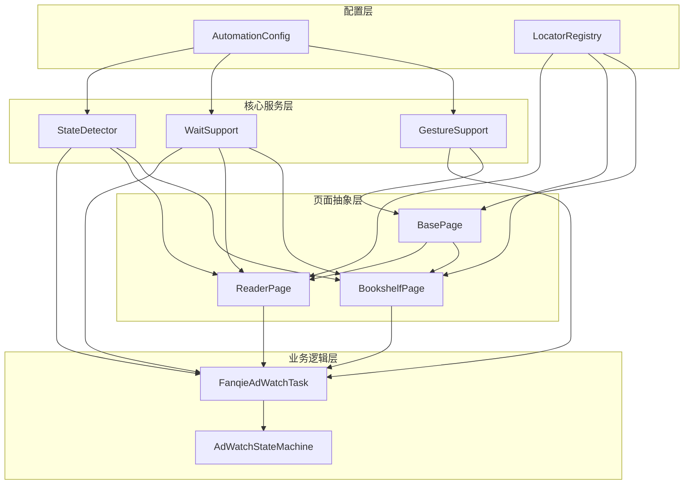
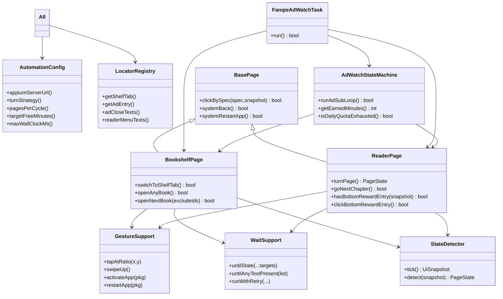
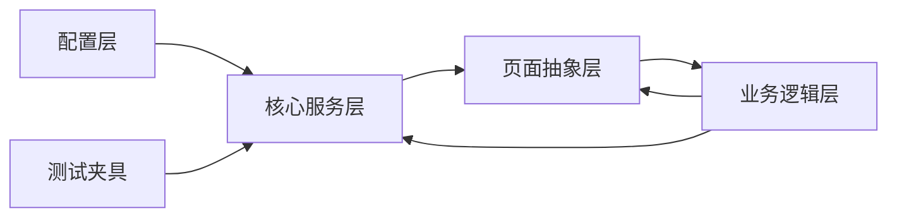
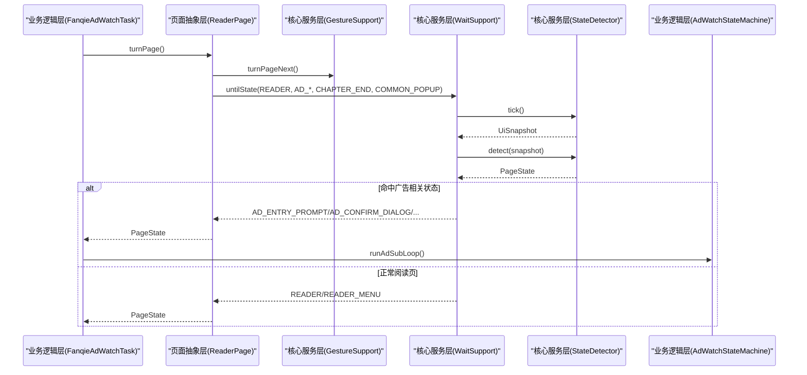
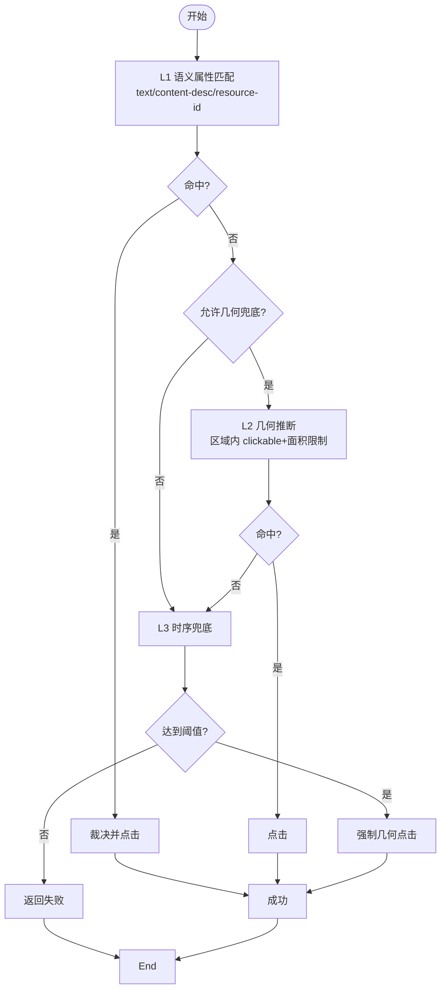

# 分层设计详解

<cite>
**本文引用的文件**
- [AutomationConfig.java](file://automation/src/main/java/com/fanqie/auto/config/AutomationConfig.java)
- [LocatorRegistry.java](file://automation/src/main/java/com/fanqie/auto/config/LocatorRegistry.java)
- [GestureSupport.java](file://automation/src/main/java/com/fanqie/auto/core/GestureSupport.java)
- [WaitSupport.java](file://automation/src/main/java/com/fanqie/auto/core/WaitSupport.java)
- [StateDetector.java](file://automation/src/main/java/com/fanqie/auto/core/StateDetector.java)
- [BasePage.java](file://automation/src/main/java/com/fanqie/auto/page/BasePage.java)
- [BookshelfPage.java](file://automation/src/main/java/com/fanqie/auto/page/BookshelfPage.java)
- [ReaderPage.java](file://automation/src/main/java/com/fanqie/auto/page/ReaderPage.java)
- [FanqieAdWatchTask.java](file://automation/src/main/java/com/fanqie/auto/task/FanqieAdWatchTask.java)
- [AdWatchStateMachine.java](file://automation/src/main/java/com/fanqie/auto/task/AdWatchStateMachine.java)
- [TestFixtures.java](file://automation/src/test/java/com/fanqie/auto/TestFixtures.java)
</cite>

## 目录
1. [引言](#引言)
2. [项目结构](#项目结构)
3. [核心组件](#核心组件)
4. [架构总览](#架构总览)
5. [详细组件分析](#详细组件分析)
6. [依赖关系分析](#依赖关系分析)
7. [性能考量](#性能考量)
8. [故障排查指南](#故障排查指南)
9. [结论](#结论)
10. [附录](#附录)

## 引言
本文件围绕“四层架构”展开：配置层、核心服务层、页面抽象层、业务逻辑层。目标是明确每层的职责边界与接口契约，解释层间通信如何通过接口解耦依赖，并通过类图和数据流转示例展示分层如何提升可维护性与可扩展性。

## 项目结构
- 配置层（config）：集中管理运行时参数与环境配置，提供类型安全的访问器；同时维护 UI 控件的定位策略与候选文案。
- 核心服务层（core）：封装设备驱动交互的通用能力，包括手势操作、显式等待、UI 快照与状态识别。
- 页面抽象层（page）：基于核心能力封装具体页面的 UI 操作（书架、阅读页、广告流程），对外暴露高层语义方法。
- 业务逻辑层（task）：编排复杂业务流程（启动 App、翻页、广告子循环、熔断与恢复、多书轮换等）。

图表来源
- [AutomationConfig.java:1-306](file://automation/src/main/java/com/fanqie/auto/config/AutomationConfig.java#L1-L306)
- [LocatorRegistry.java:1-300](file://automation/src/main/java/com/fanqie/auto/config/LocatorRegistry.java#L1-L300)
- [GestureSupport.java:1-228](file://automation/src/main/java/com/fanqie/auto/core/GestureSupport.java#L1-L228)
- [WaitSupport.java:1-234](file://automation/src/main/java/com/fanqie/auto/core/WaitSupport.java#L1-L234)
- [StateDetector.java:1-461](file://automation/src/main/java/com/fanqie/auto/core/StateDetector.java#L1-L461)
- [BasePage.java:1-516](file://automation/src/main/java/com/fanqie/auto/page/BasePage.java#L1-L516)
- [BookshelfPage.java:1-513](file://automation/src/main/java/com/fanqie/auto/page/BookshelfPage.java#L1-L513)
- [ReaderPage.java:1-271](file://automation/src/main/java/com/fanqie/auto/page/ReaderPage.java#L1-L271)
- [FanqieAdWatchTask.java:1-625](file://automation/src/main/java/com/fanqie/auto/task/FanqieAdWatchTask.java#L1-L625)
- [AdWatchStateMachine.java:1-803](file://automation/src/main/java/com/fanqie/auto/task/AdWatchStateMachine.java#L1-L803)

章节来源
- [AutomationConfig.java:1-306](file://automation/src/main/java/com/fanqie/auto/config/AutomationConfig.java#L1-L306)
- [LocatorRegistry.java:1-300](file://automation/src/main/java/com/fanqie/auto/config/LocatorRegistry.java#L1-L300)

## 核心组件
- 配置层
  - AutomationConfig：统一加载 properties，提供类型化 getter，覆盖 Appium、时序、流程、阅读页翻页策略、验证与调试开关等。
  - LocatorRegistry：管理 UI 控件定位策略（主定位器 + 回退定位器 + 区域提示 + 是否允许几何兜底），并提供文案候选集与正则。
- 核心服务层
  - GestureSupport：比例坐标手势（点击、滑动）、App 生命周期操作（激活/终止/重启），避免硬编码像素。
  - WaitSupport：统一显式等待原语（按目标状态/文案/自定义条件等待），幂等重试（指数退避）。
  - StateDetector：高性能 UI 快照与状态识别（一次抓取、内存匹配、优先级判定、屏幕尺寸缓存自愈）。
- 页面抽象层
  - BasePage：四级降级定位链（语义→几何→时序→系统），点击节点计算与裁决，系统级兜底（back/restart）。
  - BookshelfPage：切换书架 Tab、动态选书并打开、排除已用书籍、真机校准（避开全面屏手势区）。
  - ReaderPage：翻页、下一章跳转、底部奖励入口检测与点击。
- 业务逻辑层
  - FanqieAdWatchTask：任务编排（启动→导航→选书→翻页→广告子循环→熔断与恢复→统计汇总）。
  - AdWatchStateMachine：转移表驱动的广告子循环，四重熔断、幂等执行、进度持久化与断点续跑。

章节来源
- [GestureSupport.java:1-228](file://automation/src/main/java/com/fanqie/auto/core/GestureSupport.java#L1-L228)
- [WaitSupport.java:1-234](file://automation/src/main/java/com/fanqie/auto/core/WaitSupport.java#L1-L234)
- [StateDetector.java:1-461](file://automation/src/main/java/com/fanqie/auto/core/StateDetector.java#L1-L461)
- [BasePage.java:1-516](file://automation/src/main/java/com/fanqie/auto/page/BasePage.java#L1-L516)
- [BookshelfPage.java:1-513](file://automation/src/main/java/com/fanqie/auto/page/BookshelfPage.java#L1-L513)
- [ReaderPage.java:1-271](file://automation/src/main/java/com/fanqie/auto/page/ReaderPage.java#L1-L271)
- [FanqieAdWatchTask.java:1-625](file://automation/src/main/java/com/fanqie/auto/task/FanqieAdWatchTask.java#L1-L625)
- [AdWatchStateMachine.java:1-803](file://automation/src/main/java/com/fanqie/auto/task/AdWatchStateMachine.java#L1-L803)

## 架构总览
分层通过清晰的接口与职责划分实现解耦：
- 配置层不感知 UI 与业务，仅暴露数据与策略。
- 核心服务层屏蔽底层驱动差异，提供稳定原语。
- 页面层组合核心能力完成具体页面操作，对上层只暴露领域语义方法。
- 业务层编排页面与状态机，处理复杂流程与异常恢复。

图表来源
- [AutomationConfig.java:1-306](file://automation/src/main/java/com/fanqie/auto/config/AutomationConfig.java#L1-L306)
- [LocatorRegistry.java:1-300](file://automation/src/main/java/com/fanqie/auto/config/LocatorRegistry.java#L1-L300)
- [GestureSupport.java:1-228](file://automation/src/main/java/com/fanqie/auto/core/GestureSupport.java#L1-L228)
- [WaitSupport.java:1-234](file://automation/src/main/java/com/fanqie/auto/core/WaitSupport.java#L1-L234)
- [StateDetector.java:1-461](file://automation/src/main/java/com/fanqie/auto/core/StateDetector.java#L1-L461)
- [BasePage.java:1-516](file://automation/src/main/java/com/fanqie/auto/page/BasePage.java#L1-L516)
- [BookshelfPage.java:1-513](file://automation/src/main/java/com/fanqie/auto/page/BookshelfPage.java#L1-L513)
- [ReaderPage.java:1-271](file://automation/src/main/java/com/fanqie/auto/page/ReaderPage.java#L1-L271)
- [FanqieAdWatchTask.java:1-625](file://automation/src/main/java/com/fanqie/auto/task/FanqieAdWatchTask.java#L1-L625)
- [AdWatchStateMachine.java:1-803](file://automation/src/main/java/com/fanqie/auto/task/AdWatchStateMachine.java#L1-L803)

## 详细组件分析

### 配置层：参数管理与环境配置
- 职责边界
  - 集中管理所有超时、轮次、阈值、策略开关，杜绝魔法数字。
  - 提供类型安全访问器，支持外部配置文件覆盖默认值。
  - 管理 UI 控件定位策略（主/回退定位器、区域提示、是否允许几何兜底）与文案候选集。
- 关键接口
  - 配置项：Appium 连接、驱动类型、时序、流程、阅读页翻页策略、验证与调试开关。
  - 定位策略：各逻辑控件的 LocatorSpec（primaryBy、fallbackBys、boundsHint、allowGeometryFallback）。
- 设计要点
  - 中文编码安全读取，避免乱码导致匹配失败。
  - 误点防护：ad.watch/ad.continue 禁止几何兜底，避免浪费每日配额。

章节来源
- [AutomationConfig.java:1-306](file://automation/src/main/java/com/fanqie/auto/config/AutomationConfig.java#L1-L306)
- [LocatorRegistry.java:1-300](file://automation/src/main/java/com/fanqie/auto/config/LocatorRegistry.java#L1-L300)

### 核心服务层：状态检测、等待支持、手势操作
- 职责边界
  - GestureSupport：以比例坐标进行手势操作，封装 App 生命周期控制。
  - WaitSupport：统一显式等待与幂等重试，消除散落 sleep。
  - StateDetector：高性能 UI 快照与状态识别，纯内存匹配，避免多次 RPC。
- 关键接口
  - 手势：tapAtRatio/tapAtPixel/swipe*、activateApp/terminateApp/restartApp。
  - 等待：untilState/untilAnyTextPresent/untilSnapshotMatches/runWithRetry。
  - 状态：tick/detect/getCachedSnapshot/getLastPageSourceMs。
- 设计要点
  - 屏幕尺寸缓存与自愈，横屏/折叠屏旋转后自动刷新。
  - 优先级匹配：resource-id → text → content-desc → APP_LAUNCHING → 几何特征 → UNKNOWN。
  - 幂等重试：指数退避，降低瞬时竞争导致的失败。

章节来源
- [GestureSupport.java:1-228](file://automation/src/main/java/com/fanqie/auto/core/GestureSupport.java#L1-L228)
- [WaitSupport.java:1-234](file://automation/src/main/java/com/fanqie/auto/core/WaitSupport.java#L1-L234)
- [StateDetector.java:1-461](file://automation/src/main/java/com/fanqie/auto/core/StateDetector.java#L1-L461)

### 页面抽象层：封装具体 UI 操作
- 职责边界
  - BasePage：四级降级定位链（语义属性→几何推断→时序兜底→系统兜底），点击裁决与系统级恢复。
  - BookshelfPage：书架 Tab 切换、动态选书、排除已用书籍、真机校准（避开全面屏手势区）。
  - ReaderPage：翻页、下一章跳转、底部奖励入口检测与点击。
- 关键接口
  - BasePage：clickBySpec/systemBack/systemRestartApp。
  - BookshelfPage：switchToShelfTab/openAnyBook/openNextBook。
  - ReaderPage：turnPage/goNextChapter/hasBottomRewardEntry/clickBottomRewardEntry。
- 设计要点
  - 四级降级链确保鲁棒性：优先语义匹配，必要时几何推断，再到时序兜底，最后系统级 back/restart。
  - 误点防护：对高风险控件（如观看广告/继续获取时长）禁用几何兜底。
  - 真机适配：避开全面屏手势区、自绘正文无法直接定位时的替代方案。

章节来源
- [BasePage.java:1-516](file://automation/src/main/java/com/fanqie/auto/page/BasePage.java#L1-L516)
- [BookshelfPage.java:1-513](file://automation/src/main/java/com/fanqie/auto/page/BookshelfPage.java#L1-L513)
- [ReaderPage.java:1-271](file://automation/src/main/java/com/fanqie/auto/page/ReaderPage.java#L1-L271)

### 业务逻辑层：编排复杂业务流程
- 职责边界
  - FanqieAdWatchTask：任务编排（启动→导航→选书→翻页→广告子循环→熔断与恢复→统计汇总）。
  - AdWatchStateMachine：转移表驱动的广告子循环，四重熔断、幂等执行、进度持久化与断点续跑。
- 关键接口
  - Task：getName/run。
  - StateMachine：runAdSubLoop/getEarnedMinutes/isDailyQuotaExhausted/markBookUsed/getUsedBooks。
- 设计要点
  - 转移表驱动：当前状态决定下一步动作，吸收任意状态跳变。
  - 四重熔断：单入口轮次、全局轮次、目标分钟、墙钟时间预算，任一触发即优雅退出。
  - 幂等性：动作前重新 detect，动作后校验状态转移，失败则退避重试或恢复。
  - 多书轮换：per-book 进度记录与排除，跨天清空策略，避免打转。

章节来源
- [FanqieAdWatchTask.java:1-625](file://automation/src/main/java/com/fanqie/auto/task/FanqieAdWatchTask.java#L1-L625)
- [AdWatchStateMachine.java:1-803](file://automation/src/main/java/com/fanqie/auto/task/AdWatchStateMachine.java#L1-L803)

## 依赖关系分析
- 耦合与内聚
  - 配置层被所有层依赖，但自身无外部耦合，内聚度高。
  - 核心服务层为页面层与业务层提供稳定原语，低耦合高内聚。
  - 页面层组合核心能力，面向业务层暴露领域语义方法。
  - 业务层编排页面与状态机，处理复杂流程与异常恢复。
- 直接/间接依赖
  - 业务层依赖页面层与状态机；状态机依赖页面层与核心服务层；页面层依赖核心服务层；核心服务层依赖配置层。
- 外部依赖与集成点
  - AppiumDriver 作为底层驱动，通过核心服务层屏蔽差异。
  - 测试夹具用于离线回放 UI 树，支撑单元测试。

图表来源
- [AutomationConfig.java:1-306](file://automation/src/main/java/com/fanqie/auto/config/AutomationConfig.java#L1-L306)
- [GestureSupport.java:1-228](file://automation/src/main/java/com/fanqie/auto/core/GestureSupport.java#L1-L228)
- [WaitSupport.java:1-234](file://automation/src/main/java/com/fanqie/auto/core/WaitSupport.java#L1-L234)
- [StateDetector.java:1-461](file://automation/src/main/java/com/fanqie/auto/core/StateDetector.java#L1-L461)
- [BasePage.java:1-516](file://automation/src/main/java/com/fanqie/auto/page/BasePage.java#L1-L516)
- [BookshelfPage.java:1-513](file://automation/src/main/java/com/fanqie/auto/page/BookshelfPage.java#L1-L513)
- [ReaderPage.java:1-271](file://automation/src/main/java/com/fanqie/auto/page/ReaderPage.java#L1-L271)
- [FanqieAdWatchTask.java:1-625](file://automation/src/main/java/com/fanqie/auto/task/FanqieAdWatchTask.java#L1-L625)
- [AdWatchStateMachine.java:1-803](file://automation/src/main/java/com/fanqie/auto/task/AdWatchStateMachine.java#L1-L803)
- [TestFixtures.java:1-53](file://automation/src/test/java/com/fanqie/auto/TestFixtures.java#L1-L53)

章节来源
- [TestFixtures.java:1-53](file://automation/src/test/java/com/fanqie/auto/TestFixtures.java#L1-L53)

## 性能考量
- 减少 RPC 次数
  - StateDetector 单次 getPageSource 构造快照，同一 tick 内复用，避免重复抓取。
  - 屏幕尺寸缓存与自愈，避免每次手势都发 getSize。
- 纯内存匹配
  - 状态识别在内存节点表上按优先级匹配，避免逐个状态试 findElement。
- 高效手势
  - 使用 mobile: clickGesture/swipeGesture，设备端单次执行，稳定性优于多点注入。
- 等待优化
  - 显式等待配合合理 pollInterval，避免忙轮询；幂等重试减少整体耗时。

[本节为通用指导，不直接分析具体文件]

## 故障排查指南
- 常见错误与处理
  - 状态未转移：状态机记录连续错误计数，达到上限触发恢复；否则退避重试。
  - 文案乱码：检查 Properties 读取编码是否为 UTF-8，避免 ISO-889-1 解码。
  - 几何误点：高风险控件禁用几何兜底，避免误点导致额外视频轮次。
  - 全屏手势冲突：书架 Tab 点击避开全面屏手势区。
- 诊断手段
  - 使用 RunLogger 输出状态、getPageSource 耗时、XML 大小、累计分钟与轮次。
  - 利用测试夹具离线回放 UI 树，验证状态识别与定位策略。

章节来源
- [AdWatchStateMachine.java:1-803](file://automation/src/main/java/com/fanqie/auto/task/AdWatchStateMachine.java#L1-L803)
- [LocatorRegistry.java:1-300](file://automation/src/main/java/com/fanqie/auto/config/LocatorRegistry.java#L1-L300)
- [BookshelfPage.java:1-513](file://automation/src/main/java/com/fanqie/auto/page/BookshelfPage.java#L1-L513)
- [TestFixtures.java:1-53](file://automation/src/test/java/com/fanqie/auto/TestFixtures.java#L1-L53)

## 结论
本分层设计通过明确的职责边界与接口契约，将配置、核心能力、页面操作与业务流程解耦，提升了代码的可维护性与可扩展性。配置层集中管理参数与策略，核心服务层提供稳定原语，页面层封装具体 UI 操作，业务层编排复杂流程并处理异常。转移表驱动的状态机与四级降级定位链进一步增强了鲁棒性与可观测性。

[本节为总结，不直接分析具体文件]

## 附录

### 数据流转示例：翻页到广告子循环

图表来源
- [ReaderPage.java:1-271](file://automation/src/main/java/com/fanqie/auto/page/ReaderPage.java#L1-L271)
- [GestureSupport.java:1-228](file://automation/src/main/java/com/fanqie/auto/core/GestureSupport.java#L1-L228)
- [WaitSupport.java:1-234](file://automation/src/main/java/com/fanqie/auto/core/WaitSupport.java#L1-L234)
- [StateDetector.java:1-461](file://automation/src/main/java/com/fanqie/auto/core/StateDetector.java#L1-L461)
- [FanqieAdWatchTask.java:1-625](file://automation/src/main/java/com/fanqie/auto/task/FanqieAdWatchTask.java#L1-L625)
- [AdWatchStateMachine.java:1-803](file://automation/src/main/java/com/fanqie/auto/task/AdWatchStateMachine.java#L1-L803)

### 算法流程图：四级降级定位链

图表来源
- [BasePage.java:1-516](file://automation/src/main/java/com/fanqie/auto/page/BasePage.java#L1-L516)
- [LocatorRegistry.java:1-300](file://automation/src/main/java/com/fanqie/auto/config/LocatorRegistry.java#L1-L300)