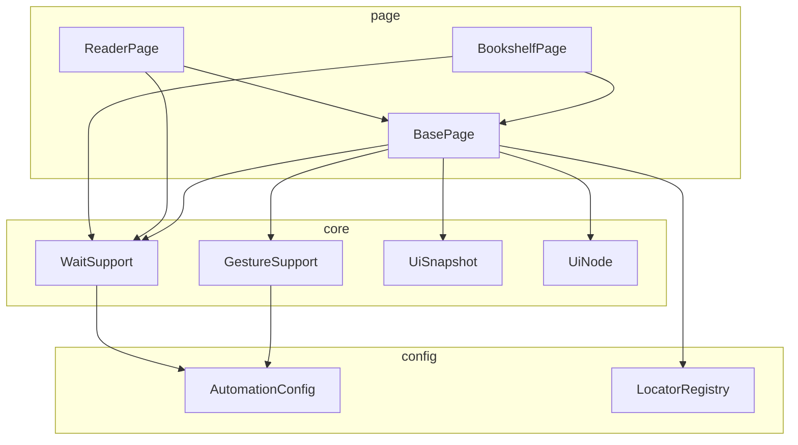
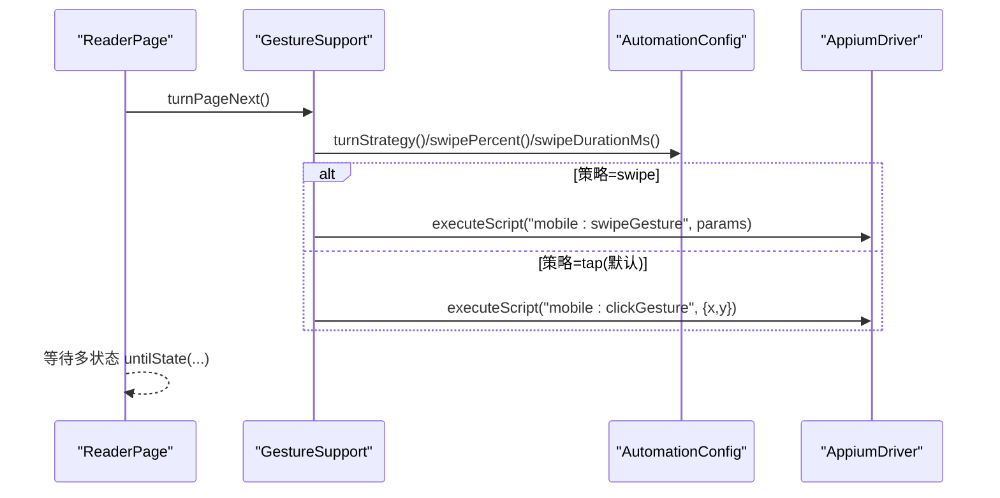
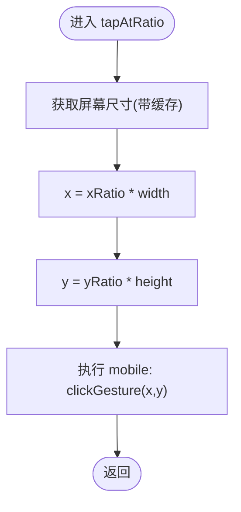
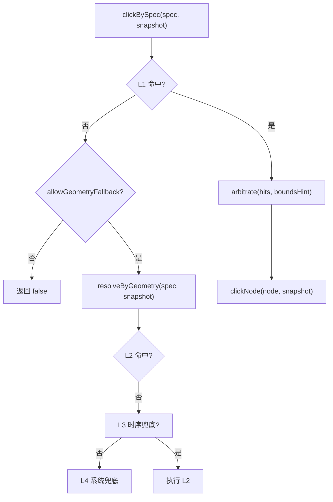
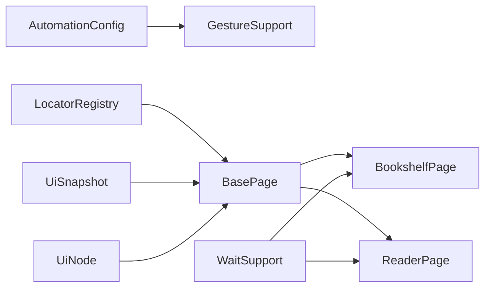

# 手势操作服务

<cite>
**本文引用的文件**
- [GestureSupport.java](file://automation/src/main/java/com/fanqie/auto/core/GestureSupport.java)
- [BasePage.java](file://automation/src/main/java/com/fanqie/auto/page/BasePage.java)
- [BookshelfPage.java](file://automation/src/main/java/com/fanqie/auto/page/BookshelfPage.java)
- [ReaderPage.java](file://automation/src/main/java/com/fanqie/auto/page/ReaderPage.java)
- [AutomationConfig.java](file://automation/src/main/java/com/fanqie/auto/config/AutomationConfig.java)
- [LocatorRegistry.java](file://automation/src/main/java/com/fanqie/auto/config/LocatorRegistry.java)
- [UiNode.java](file://automation/src/main/java/com/fanqie/auto/core/UiNode.java)
- [UiSnapshot.java](file://automation/src/main/java/com/fanqie/auto/core/UiSnapshot.java)
- [WaitSupport.java](file://automation/src/main/java/com/fanqie/auto/core/WaitSupport.java)
- [StateDetectorTest.java](file://automation/src/test/java/com/fanqie/auto/core/StateDetectorTest.java)
</cite>

## 目录
1. [简介](#简介)
2. [项目结构](#项目结构)
3. [核心组件](#核心组件)
4. [架构总览](#架构总览)
5. [详细组件分析](#详细组件分析)
6. [依赖关系分析](#依赖关系分析)
7. [性能考量](#性能考量)
8. [故障排查指南](#故障排查指南)
9. [结论](#结论)
10. [附录：使用示例与扩展指南](#附录使用示例与扩展指南)

## 简介
本文件面向“手势操作服务”的完整技术文档，聚焦于 GestureSupport 对底层手势的统一抽象、坐标计算算法、手势序列编排、重试与容错机制、性能优化策略，以及与页面层的集成方式和扩展方法。目标是让读者既能理解整体设计，也能快速上手实现翻页、滚动列表、输入文本等常见自动化场景。

## 项目结构
本项目采用分层组织：
- core：基础能力（手势封装、等待原语、UI 快照解析、节点模型）
- config：配置与定位器注册表
- page：页面对象（书架、阅读器），组合 core 能力完成业务流程
- task：任务编排（不在本次文档范围）
- test：单元测试与测试数据

图表来源
- [GestureSupport.java:1-228](file://automation/src/main/java/com/fanqie/auto/core/GestureSupport.java#L1-L228)
- [BasePage.java:1-516](file://automation/src/main/java/com/fanqie/auto/page/BasePage.java#L1-L516)
- [BookshelfPage.java:1-513](file://automation/src/main/java/com/fanqie/auto/page/BookshelfPage.java#L1-L513)
- [ReaderPage.java:1-271](file://automation/src/main/java/com/fanqie/auto/page/ReaderPage.java#L1-L271)
- [AutomationConfig.java:1-306](file://automation/src/main/java/com/fanqie/auto/config/AutomationConfig.java#L1-L306)
- [LocatorRegistry.java:1-300](file://automation/src/main/java/com/fanqie/auto/config/LocatorRegistry.java#L1-L300)
- [UiNode.java:1-218](file://automation/src/main/java/com/fanqie/auto/core/UiNode.java#L1-L218)
- [UiSnapshot.java:1-284](file://automation/src/main/java/com/fanqie/auto/core/UiSnapshot.java#L1-L284)

章节来源
- [GestureSupport.java:1-228](file://automation/src/main/java/com/fanqie/auto/core/GestureSupport.java#L1-L228)
- [BasePage.java:1-516](file://automation/src/main/java/com/fanqie/auto/page/BasePage.java#L1-L516)
- [BookshelfPage.java:1-513](file://automation/src/main/java/com/fanqie/auto/page/BookshelfPage.java#L1-L513)
- [ReaderPage.java:1-271](file://automation/src/main/java/com/fanqie/auto/page/ReaderPage.java#L1-L271)
- [AutomationConfig.java:1-306](file://automation/src/main/java/com/fanqie/auto/config/AutomationConfig.java#L1-L306)
- [LocatorRegistry.java:1-300](file://automation/src/main/java/com/fanqie/auto/config/LocatorRegistry.java#L1-L300)
- [UiNode.java:1-218](file://automation/src/main/java/com/fanqie/auto/core/UiNode.java#L1-L218)
- [UiSnapshot.java:1-284](file://automation/src/main/java/com/fanqie/auto/core/UiSnapshot.java#L1-L284)

## 核心组件
- GestureSupport：统一封装点击、滑动、应用生命周期操作；所有坐标基于运行时屏幕尺寸按比例计算，避免硬编码像素。
- BasePage：四级定位降级链（语义匹配→几何推断→时序兜底→系统兜底），并负责点击节点时的坐标计算与回退。
- BookshelfPage / ReaderPage：具体页面行为（选书、翻页、跳转下一章、广告入口处理）。
- AutomationConfig：集中管理超时、轮次、阈值、翻页策略等配置项。
- LocatorRegistry：维护控件的定位策略与候选文案集，支持 boundsHint 区域描述与是否允许几何兜底的开关。
- UiSnapshot / UiNode：内存化 UI 树快照与节点模型，提供高效查询与几何计算能力。
- WaitSupport：统一等待原语与幂等重试（指数退避），屏蔽散落 sleep。

章节来源
- [GestureSupport.java:1-228](file://automation/src/main/java/com/fanqie/auto/core/GestureSupport.java#L1-L228)
- [BasePage.java:1-516](file://automation/src/main/java/com/fanqie/auto/page/BasePage.java#L1-L516)
- [BookshelfPage.java:1-513](file://automation/src/main/java/com/fanqie/auto/page/BookshelfPage.java#L1-L513)
- [ReaderPage.java:1-271](file://automation/src/main/java/com/fanqie/auto/page/ReaderPage.java#L1-L271)
- [AutomationConfig.java:1-306](file://automation/src/main/java/com/fanqie/auto/config/AutomationConfig.java#L1-L306)
- [LocatorRegistry.java:1-300](file://automation/src/main/java/com/fanqie/auto/config/LocatorRegistry.java#L1-L300)
- [UiSnapshot.java:1-284](file://automation/src/main/java/com/fanqie/auto/core/UiSnapshot.java#L1-L284)
- [UiNode.java:1-218](file://automation/src/main/java/com/fanqie/auto/core/UiNode.java#L1-L218)
- [WaitSupport.java:1-234](file://automation/src/main/java/com/fanqie/auto/core/WaitSupport.java#L1-L234)

## 架构总览
手势操作服务以“页面对象 + 手势封装 + 等待原语”为核心，通过配置驱动与定位器注册表解耦业务逻辑与底层设备交互。

图表来源
- [ReaderPage.java:69-96](file://automation/src/main/java/com/fanqie/auto/page/ReaderPage.java#L69-L96)
- [GestureSupport.java:71-86](file://automation/src/main/java/com/fanqie/auto/core/GestureSupport.java#L71-L86)
- [AutomationConfig.java:264-287](file://automation/src/main/java/com/fanqie/auto/config/AutomationConfig.java#L264-L287)

章节来源
- [ReaderPage.java:1-271](file://automation/src/main/java/com/fanqie/auto/page/ReaderPage.java#L1-L271)
- [GestureSupport.java:1-228](file://automation/src/main/java/com/fanqie/auto/core/GestureSupport.java#L1-L228)
- [AutomationConfig.java:1-306](file://automation/src/main/java/com/fanqie/auto/config/AutomationConfig.java#L1-L306)

## 详细组件分析

### GestureSupport：手势抽象与坐标计算
- 统一接口
  - 点击：tapAtRatio(xRatio, yRatio)、tapAtPixel(x, y)
  - 滑动：swipeUp/Down/Left/Right，内部调用 executeSwipeGesture
  - 翻页：turnPageNext/Prev，按配置选择 tap 或 swipe
  - 应用生命周期：activateApp/terminateApp/restartApp
- 坐标计算算法
  - 相对坐标转绝对坐标：x = xRatio * screenWidth，y = yRatio * screenHeight
  - 屏幕尺寸缓存：getScreenSize() 首次获取后缓存，刷新 driver 时失效
  - 滑动参数：left/top/width/height 取屏幕 10%~90% 区域，percent 控制距离，speed 由高度与持续时间推导
- 稳定性与兼容性
  - 使用 mobile: clickGesture/swipeGesture，减少多点注入失败风险
  - 启动/终止 App 使用 mobile: activateApp/terminateApp，避免硬编码 Activity 导致权限问题

图表来源
- [GestureSupport.java:106-123](file://automation/src/main/java/com/fanqie/auto/core/GestureSupport.java#L106-L123)
- [GestureSupport.java:56-67](file://automation/src/main/java/com/fanqie/auto/core/GestureSupport.java#L56-L67)

章节来源
- [GestureSupport.java:1-228](file://automation/src/main/java/com/fanqie/auto/core/GestureSupport.java#L1-L228)

### BasePage：四级定位与点击决策
- 四级降级链
  - L1 语义属性匹配：text → content-desc → resource-id，命中多个时用 boundsHint 裁决
  - L2 结构化几何推断：在 boundsHint 区域内筛选 clickable=true 且面积占比小的节点（受 allowGeometryFallback 约束）
  - L3 时序兜底：达到 adVideoTimeoutMs 后强制执行 L2（同样受 allowGeometryFallback 约束）
  - L4 系统兜底：navigate().back() 或重启 App
- 点击节点坐标计算
  - 若节点不可点击，回溯至最近可点击祖先；若无有效 bounds，使用自身中心
  - 最终通过 gestures.tapAtPixel(x, y) 执行点击
- boundsHint 裁决规则
  - 底部/极底部：取 y 最大者
  - 右上角：优先 centerX > 0.8W 且 centerY < 0.2H
  - 居中：取最接近屏幕中心的节点
  - 无限制：取面积最小的可点击节点

图表来源
- [BasePage.java:84-91](file://automation/src/main/java/com/fanqie/auto/page/BasePage.java#L84-L91)
- [BasePage.java:103-137](file://automation/src/main/java/com/fanqie/auto/page/BasePage.java#L103-L137)
- [BasePage.java:150-189](file://automation/src/main/java/com/fanqie/auto/page/BasePage.java#L150-L189)
- [BasePage.java:203-219](file://automation/src/main/java/com/fanqie/auto/page/BasePage.java#L203-L219)
- [BasePage.java:312-336](file://automation/src/main/java/com/fanqie/auto/page/BasePage.java#L312-L336)
- [BasePage.java:347-406](file://automation/src/main/java/com/fanqie/auto/page/BasePage.java#L347-L406)

章节来源
- [BasePage.java:1-516](file://automation/src/main/java/com/fanqie/auto/page/BasePage.java#L1-L516)

### BookshelfPage：书架交互与滚动查找
- 切换书架 Tab：主动点击「书架」Tab，避开全面屏底部手势区（点击图标上部）
- 打开书籍：动态选取首个可点条目（content-desc/text/bounds/areaRatio 过滤），未找到则向上滚动并重试
- 换书策略：排除已用书籍标识，必要时多翻几屏继续查找
- 离开书架确认：等待进入阅读家族状态或弹窗等

章节来源
- [BookshelfPage.java:1-513](file://automation/src/main/java/com/fanqie/auto/page/BookshelfPage.java#L1-L513)

### ReaderPage：阅读页翻页与章节跳转
- 翻页：委托 GestureSupport.turnPageNext()，一次等待覆盖多种可能状态（阅读、广告、章节末、弹窗）
- 上一页：同理，等待多状态
- 下一章：优先点击「下一章」按钮，否则翻页直到 CHAPTER_END 再跳转
- 广告入口：检测并点击底部「观看视频获取免广告时长」入口

章节来源
- [ReaderPage.java:1-271](file://automation/src/main/java/com/fanqie/auto/page/ReaderPage.java#L1-L271)

### WaitSupport：等待原语与重试
- untilState/untilStateGone：基于 WebDriverWait 的显式等待，支持多目标状态
- untilAnyTextPresent/untilSnapshotMatches：通用条件等待
- runWithRetry：幂等重试，指数退避（backoffMs → backoffMs*2 → ...），用于 UI 时序竞争导致的偶发失败

章节来源
- [WaitSupport.java:1-234](file://automation/src/main/java/com/fanqie/auto/core/WaitSupport.java#L1-L234)

### UiSnapshot / UiNode：内存快照与几何计算
- UiSnapshot：一次性解析 XML，构建不可变节点列表；提供 text/desc/id/region 查询与正则提取
- UiNode.Rect：健壮解析 bounds，提供中心点、面积、面积占比、比例点包含判断、比例区域中心判断

章节来源
- [UiSnapshot.java:1-284](file://automation/src/main/java/com/fanqie/auto/core/UiSnapshot.java#L1-L284)
- [UiNode.java:1-218](file://automation/src/main/java/com/fanqie/auto/core/UiNode.java#L1-L218)

## 依赖关系分析
- GestureSupport 依赖 AutomationConfig 获取翻页策略与滑动参数
- BasePage 依赖 LocatorRegistry 获取控件定位规格与候选文案
- BookshelfPage/ReaderPage 组合 BasePage、GestureSupport、WaitSupport、LocatorRegistry、AutomationConfig
- UiSnapshot/UiNode 为纯内存数据结构，被 BasePage 与页面类广泛复用

图表来源
- [AutomationConfig.java:264-287](file://automation/src/main/java/com/fanqie/auto/config/AutomationConfig.java#L264-L287)
- [LocatorRegistry.java:152-256](file://automation/src/main/java/com/fanqie/auto/config/LocatorRegistry.java#L152-L256)
- [BasePage.java:55-68](file://automation/src/main/java/com/fanqie/auto/page/BasePage.java#L55-L68)
- [BookshelfPage.java:49-55](file://automation/src/main/java/com/fanqie/auto/page/BookshelfPage.java#L49-L55)
- [ReaderPage.java:49-55](file://automation/src/main/java/com/fanqie/auto/page/ReaderPage.java#L49-L55)

章节来源
- [AutomationConfig.java:1-306](file://automation/src/main/java/com/fanqie/auto/config/AutomationConfig.java#L1-L306)
- [LocatorRegistry.java:1-300](file://automation/src/main/java/com/fanqie/auto/config/LocatorRegistry.java#L1-L300)
- [BasePage.java:1-516](file://automation/src/main/java/com/fanqie/auto/page/BasePage.java#L1-L516)
- [BookshelfPage.java:1-513](file://automation/src/main/java/com/fanqie/auto/page/BookshelfPage.java#L1-L513)
- [ReaderPage.java:1-271](file://automation/src/main/java/com/fanqie/auto/page/ReaderPage.java#L1-L271)

## 性能考量
- 屏幕尺寸缓存：GestureSupport.getScreenSize() 缓存以避免重复 RPC
- 单次快照复用：UiSnapshot 构造后全部查询为纯内存操作，零额外 RPC
- 滑动策略优化：使用 mobile: swipeGesture，减少多点注入失败风险
- 等待与重试：WaitSupport.runWithRetry 指数退避，降低瞬时失败影响
- 截图验证可选：ReaderPage 支持 verifyPageTurnedByScreenshot，但默认关闭以减少开销

[本节为通用性能建议，不直接分析具体代码行]

## 故障排查指南
- 无法定位控件
  - 检查 LocatorRegistry 中对应控件的候选文案与 boundsHint 是否正确
  - 启用 L2 几何兜底需确保 allowGeometryFallback=true（如 ad.close）
- 点击无效或被系统手势拦截
  - 书架 Tab 点击需避开底部手势区（BookshelfPage 已内置处理）
- 翻页后状态异常
  - 使用 WaitSupport.untilState 一次覆盖多状态，避免只等待 READER
- 广告误判
  - 参考 StateDetector 测试用例，确认全屏开屏广告与激励视频关闭页的区分逻辑

章节来源
- [BasePage.java:150-189](file://automation/src/main/java/com/fanqie/auto/page/BasePage.java#L150-L189)
- [BookshelfPage.java:131-153](file://automation/src/main/java/com/fanqie/auto/page/BookshelfPage.java#L131-L153)
- [ReaderPage.java:69-96](file://automation/src/main/java/com/fanqie/auto/page/ReaderPage.java#L69-L96)
- [StateDetectorTest.java:83-143](file://automation/src/test/java/com/fanqie/auto/core/StateDetectorTest.java#L83-L143)

## 结论
手势操作服务通过 GestureSupport 统一了点击、滑动与应用生命周期操作，结合 BasePage 的四级定位与点击决策、WaitSupport 的等待与重试机制，以及 UiSnapshot/UiNode 的高效内存查询，实现了稳定、可配置、可扩展的自动化交互能力。配合 AutomationConfig 与 LocatorRegistry，可在不同设备与版本下保持鲁棒性，并通过页面层（BookshelfPage/ReaderPage）组合出复杂的多步骤操作流程。

[本节为总结性内容，不直接分析具体代码行]

## 附录：使用示例与扩展指南

### 常见手势场景
- 翻页
  - 下一页：调用 ReaderPage.turnPage()，内部委托 GestureSupport.turnPageNext()
  - 上一页：调用 ReaderPage.turnPagePrev()
- 滚动列表
  - 向上/向下滑动：调用 GestureSupport.swipeUp()/swipeDown()
  - 书架选书：BookshelfPage.openAnyBook() 自动滚动查找
- 输入文本
  - 通过 BasePage.clickBySpec/clickByTextCandidates 定位输入框并点击，再使用系统键盘或输入法（本项目未直接封装输入，可通过 Appium 原生 API 扩展）

章节来源
- [ReaderPage.java:69-118](file://automation/src/main/java/com/fanqie/auto/page/ReaderPage.java#L69-L118)
- [GestureSupport.java:128-178](file://automation/src/main/java/com/fanqie/auto/core/GestureSupport.java#L128-L178)
- [BookshelfPage.java:169-216](file://automation/src/main/java/com/fanqie/auto/page/BookshelfPage.java#L169-L216)
- [BasePage.java:254-289](file://automation/src/main/java/com/fanqie/auto/page/BasePage.java#L254-L289)

### 与页面层的集成方式
- 页面对象持有 GestureSupport、WaitSupport、LocatorRegistry、AutomationConfig 引用
- 通过 BasePage.clickBySpec 走四级定位链，最终调用 gestures.tapAtPixel 执行点击
- 翻页后使用 waitSupport.untilState 等待多状态，保证状态机推进

章节来源
- [BasePage.java:55-68](file://automation/src/main/java/com/fanqie/auto/page/BasePage.java#L55-L68)
- [BasePage.java:84-91](file://automation/src/main/java/com/fanqie/auto/page/BasePage.java#L84-L91)
- [ReaderPage.java:69-96](file://automation/src/main/java/com/fanqie/auto/page/ReaderPage.java#L69-L96)

### 扩展新手势类型
- 新增手势动作
  - 在 GestureSupport 中添加新方法（如长按、拖拽），复用 getScreenSize 与 executeScript("mobile:...") 模式
  - 在 AutomationConfig 中增加相关配置项（如 duration、percent）
- 新增定位策略
  - 在 LocatorRegistry 中定义新的 LocatorSpec，设置 primaryBy、fallbackBys、boundsHint、allowGeometryFallback
  - 在 BasePage 的 resolve/arbitrate 中适配新 boundsHint 语义（如需）
- 页面层集成
  - 在对应 Page 中组合新手势与等待原语，形成业务流程

章节来源
- [GestureSupport.java:106-178](file://automation/src/main/java/com/fanqie/auto/core/GestureSupport.java#L106-L178)
- [AutomationConfig.java:264-287](file://automation/src/main/java/com/fanqie/auto/config/AutomationConfig.java#L264-L287)
- [LocatorRegistry.java:271-298](file://automation/src/main/java/com/fanqie/auto/config/LocatorRegistry.java#L271-L298)
- [BasePage.java:347-406](file://automation/src/main/java/com/fanqie/auto/page/BasePage.java#L347-L406)