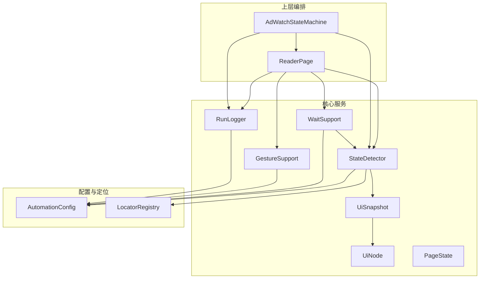
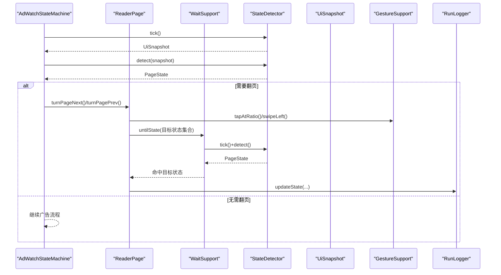
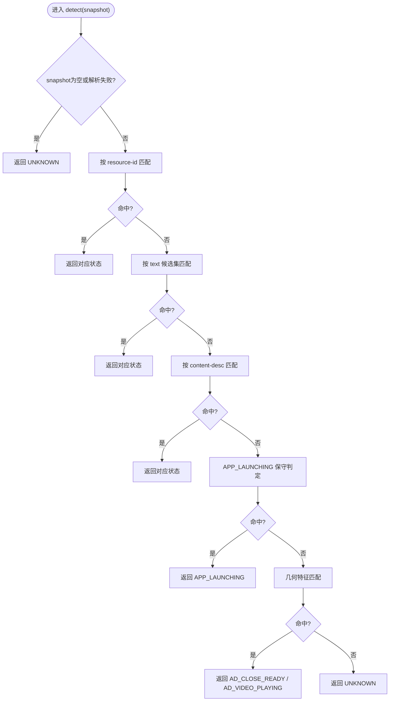
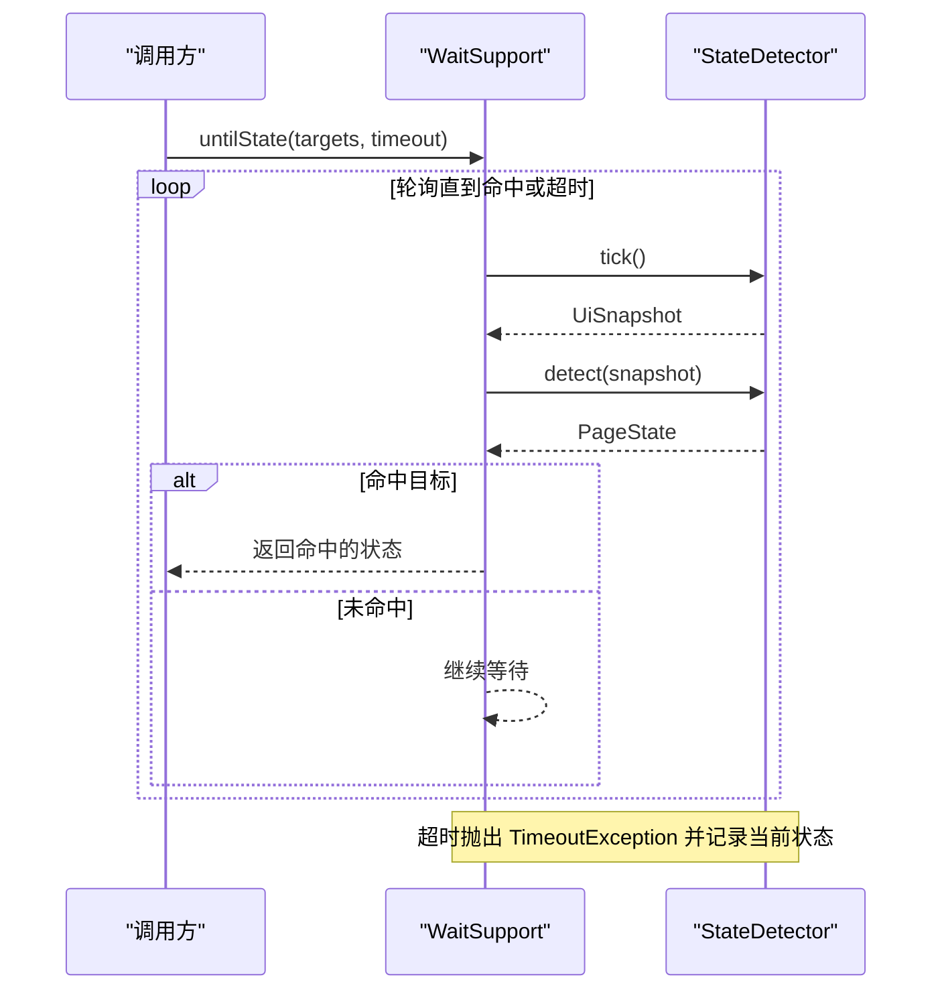
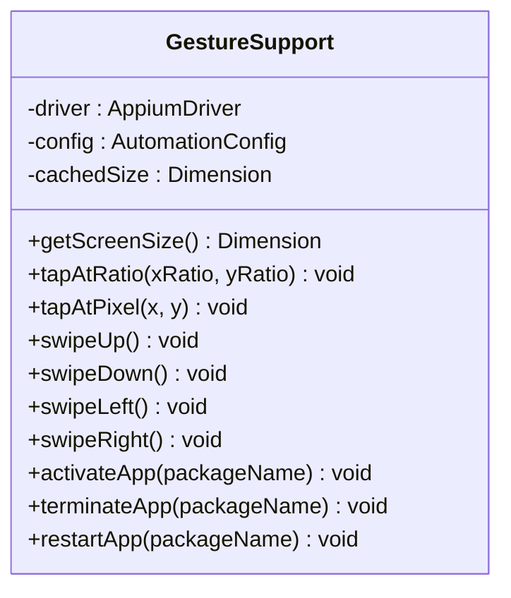
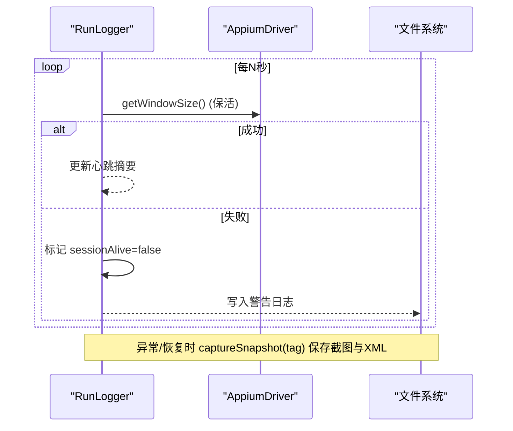
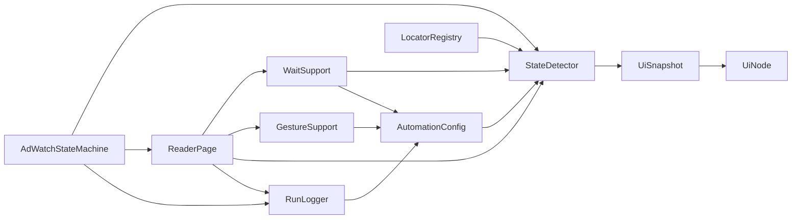

# 核心服务层设计

<cite>
**本文引用的文件**
- [StateDetector.java](file://automation/src/main/java/com/fanqie/auto/core/StateDetector.java)
- [WaitSupport.java](file://automation/src/main/java/com/fanqie/auto/core/WaitSupport.java)
- [GestureSupport.java](file://automation/src/main/java/com/fanqie/auto/core/GestureSupport.java)
- [RunLogger.java](file://automation/src/main/java/com/fanqie/auto/core/RunLogger.java)
- [UiSnapshot.java](file://automation/src/main/java/com/fanqie/auto/core/UiSnapshot.java)
- [UiNode.java](file://automation/src/main/java/com/fanqie/auto/core/UiNode.java)
- [PageState.java](file://automation/src/main/java/com/fanqie/auto/core/PageState.java)
- [AutomationConfig.java](file://automation/src/main/java/com/fanqie/auto/config/AutomationConfig.java)
- [LocatorRegistry.java](file://automation/src/main/java/com/fanqie/auto/config/LocatorRegistry.java)
- [ReaderPage.java](file://automation/src/main/java/com/fanqie/auto/page/ReaderPage.java)
- [AdWatchStateMachine.java](file://automation/src/main/java/com/fanqie/auto/task/AdWatchStateMachine.java)
</cite>

## 目录
1. [引言](#引言)
2. [项目结构](#项目结构)
3. [核心组件](#核心组件)
4. [架构总览](#架构总览)
5. [详细组件分析](#详细组件分析)
6. [依赖关系分析](#依赖关系分析)
7. [性能考量](#性能考量)
8. [故障排查指南](#故障排查指南)
9. [结论](#结论)
10. [附录：使用示例与最佳实践](#附录使用示例与最佳实践)

## 引言
本设计文档聚焦自动化测试项目的“核心服务层”，围绕以下关键能力展开：
- StateDetector 状态检测器的智能识别机制（UI 快照解析、状态匹配算法、性能优化）
- WaitSupport 等待支持的多种等待策略（显式等待、条件等待、退避重试）
- GestureSupport 手势操作层的抽象封装（点击、滑动、长按等统一接口）
- RunLogger 日志记录系统的分层日志与异步保活机制
- 各服务间的协作关系、错误处理策略与扩展接口设计
- 具体使用示例与最佳实践

该服务层以“状态驱动”为核心思想，通过一次抓取 UI 树并构建内存快照，在纯内存中完成高确定性的状态识别；配合统一的等待原语与手势封装，为上层页面/任务提供稳定、可观测、可扩展的自动化执行基座。

## 项目结构
核心服务层位于 automation 模块的 core 包下，按职责划分清晰：
- 状态识别：StateDetector、UiSnapshot、UiNode、PageState
- 等待原语：WaitSupport
- 手势封装：GestureSupport
- 运行观测：RunLogger
- 配置与定位：AutomationConfig、LocatorRegistry
- 上层编排：ReaderPage、AdWatchStateMachine（调用上述服务）

图表来源
- [StateDetector.java:1-461](file://automation/src/main/java/com/fanqie/auto/core/StateDetector.java#L1-L461)
- [WaitSupport.java:1-234](file://automation/src/main/java/com/fanqie/auto/core/WaitSupport.java#L1-L234)
- [GestureSupport.java:1-228](file://automation/src/main/java/com/fanqie/auto/core/GestureSupport.java#L1-L228)
- [RunLogger.java:1-374](file://automation/src/main/java/com/fanqie/auto/core/RunLogger.java#L1-L374)
- [UiSnapshot.java:1-284](file://automation/src/main/java/com/fanqie/auto/core/UiSnapshot.java#L1-L284)
- [UiNode.java:1-218](file://automation/src/main/java/com/fanqie/auto/core/UiNode.java#L1-L218)
- [PageState.java:1-97](file://automation/src/main/java/com/fanqie/auto/core/PageState.java#L1-L97)
- [AutomationConfig.java:1-306](file://automation/src/main/java/com/fanqie/auto/config/AutomationConfig.java#L1-L306)
- [LocatorRegistry.java:1-300](file://automation/src/main/java/com/fanqie/auto/config/LocatorRegistry.java#L1-L300)
- [ReaderPage.java:82-145](file://automation/src/main/java/com/fanqie/auto/page/ReaderPage.java#L82-L145)
- [AdWatchStateMachine.java:236-619](file://automation/src/main/java/com/fanqie/auto/task/AdWatchStateMachine.java#L236-L619)

章节来源
- [StateDetector.java:1-461](file://automation/src/main/java/com/fanqie/auto/core/StateDetector.java#L1-L461)
- [WaitSupport.java:1-234](file://automation/src/main/java/com/fanqie/auto/core/WaitSupport.java#L1-L234)
- [GestureSupport.java:1-228](file://automation/src/main/java/com/fanqie/auto/core/GestureSupport.java#L1-L228)
- [RunLogger.java:1-374](file://automation/src/main/java/com/fanqie/auto/core/RunLogger.java#L1-L374)
- [UiSnapshot.java:1-284](file://automation/src/main/java/com/fanqie/auto/core/UiSnapshot.java#L1-L284)
- [UiNode.java:1-218](file://automation/src/main/java/com/fanqie/auto/core/UiNode.java#L1-L218)
- [PageState.java:1-97](file://automation/src/main/java/com/fanqie/auto/core/PageState.java#L1-L97)
- [AutomationConfig.java:1-306](file://automation/src/main/java/com/fanqie/auto/config/AutomationConfig.java#L1-L306)
- [LocatorRegistry.java:1-300](file://automation/src/main/java/com/fanqie/auto/config/LocatorRegistry.java#L1-L300)
- [ReaderPage.java:82-145](file://automation/src/main/java/com/fanqie/auto/page/ReaderPage.java#L82-L145)
- [AdWatchStateMachine.java:236-619](file://automation/src/main/java/com/fanqie/auto/task/AdWatchStateMachine.java#L236-L619)

## 核心组件
- StateDetector：基于 UiSnapshot 的纯内存状态识别，采用多级优先级匹配（resource-id → text → content-desc → APP_LAUNCHING → 几何特征 → UNKNOWN），并提供 tick() 缓存与屏幕尺寸自愈。
- WaitSupport：统一等待原语，封装 untilState/untilStateGone/untilAnyTextPresent/untilSnapshotMatches 及 runWithRetry 指数退避重试。
- GestureSupport：比例坐标手势封装，tapAtRatio/tapAtPixel/swipe*、activateApp/terminateApp/restartApp，避免硬编码像素。
- RunLogger：分层日志与心跳保活，定时轻量命令保活 Appium session，异常/恢复时截图+XML快照落盘，统计汇总输出。
- UiSnapshot/UiNode：一次 getPageSource 解析为不可变节点列表，提供文本/描述/资源ID/区域查询与正则提取。
- PageState：状态枚举，定义广告流程、阅读页家族、异常态等语义判定方法。
- AutomationConfig/LocatorRegistry：全局时序/流程配置与控件定位候选集管理。

章节来源
- [StateDetector.java:1-461](file://automation/src/main/java/com/fanqie/auto/core/StateDetector.java#L1-L461)
- [WaitSupport.java:1-234](file://automation/src/main/java/com/fanqie/auto/core/WaitSupport.java#L1-L234)
- [GestureSupport.java:1-228](file://automation/src/main/java/com/fanqie/auto/core/GestureSupport.java#L1-L228)
- [RunLogger.java:1-374](file://automation/src/main/java/com/fanqie/auto/core/RunLogger.java#L1-L374)
- [UiSnapshot.java:1-284](file://automation/src/main/java/com/fanqie/auto/core/UiSnapshot.java#L1-L284)
- [UiNode.java:1-218](file://automation/src/main/java/com/fanqie/auto/core/UiNode.java#L1-L218)
- [PageState.java:1-97](file://automation/src/main/java/com/fanqie/auto/core/PageState.java#L1-L97)
- [AutomationConfig.java:1-306](file://automation/src/main/java/com/fanqie/auto/config/AutomationConfig.java#L1-L306)
- [LocatorRegistry.java:1-300](file://automation/src/main/java/com/fanqie/auto/config/LocatorRegistry.java#L1-L300)

## 架构总览
核心服务层以“状态机 + 等待原语 + 手势封装 + 可观测性”构成闭环：
- 上层 ReaderPage/AdWatchStateMachine 通过 WaitSupport 轮询 StateDetector 获取当前状态，再根据 PageState 决策动作。
- 动作由 GestureSupport 统一执行，所有坐标基于运行时屏幕尺寸按比例计算。
- RunLogger 提供心跳保活、状态转移日志、异常快照落盘与最终统计。

图表来源
- [AdWatchStateMachine.java:236-619](file://automation/src/main/java/com/fanqie/auto/task/AdWatchStateMachine.java#L236-L619)
- [ReaderPage.java:82-145](file://automation/src/main/java/com/fanqie/auto/page/ReaderPage.java#L82-L145)
- [WaitSupport.java:56-183](file://automation/src/main/java/com/fanqie/auto/core/WaitSupport.java#L56-L183)
- [StateDetector.java:97-170](file://automation/src/main/java/com/fanqie/auto/core/StateDetector.java#L97-L170)
- [GestureSupport.java:77-178](file://automation/src/main/java/com/fanqie/auto/core/GestureSupport.java#L77-L178)
- [RunLogger.java:204-226](file://automation/src/main/java/com/fanqie/auto/core/RunLogger.java#L204-L226)

## 详细组件分析

### StateDetector 状态检测器
- 智能识别机制
  - UI 快照解析：tick() 仅调用一次 driver.getPageSource()，构造 UiSnapshot，并在同一 tick 内复用，避免重复 RPC。
  - 屏幕尺寸缓存与自愈：首次获取后缓存，若检测到节点 bounds 越界则自动重取，适配横屏/折叠屏旋转。
  - 多级优先级匹配：
    1) resource-id 锚点（书架/阅读页容器，含 READER_MENU 判定）
    2) text 候选集（开屏跳过文案优先于关闭按钮，避免误判）
    3) content-desc 候选集（穿山甲 SDK 常用）
    4) APP_LAUNCHING 保守判定（节点极少 + 无大面积视频特征）
    5) 几何特征（右上角小 clickable 判定 AD_CLOSE_READY；大面积节点判定 AD_VIDEO_PLAYING）
    6) 兜底 UNKNOWN
- 性能优化策略
  - 纯内存匹配：全部基于 UiSnapshot 节点表，零额外 RPC。
  - 屏幕尺寸缓存：减少 getSize() 调用。
  - 快照复用：同一 tick 多次 detect() 不重复抓取。
  - 安全解析：防御 XXE，畸形 XML 返回空快照，不影响主流程。

图表来源
- [StateDetector.java:152-208](file://automation/src/main/java/com/fanqie/auto/core/StateDetector.java#L152-L208)
- [StateDetector.java:218-418](file://automation/src/main/java/com/fanqie/auto/core/StateDetector.java#L218-L418)

章节来源
- [StateDetector.java:1-461](file://automation/src/main/java/com/fanqie/auto/core/StateDetector.java#L1-L461)
- [UiSnapshot.java:1-284](file://automation/src/main/java/com/fanqie/auto/core/UiSnapshot.java#L1-L284)
- [UiNode.java:1-218](file://automation/src/main/java/com/fanqie/auto/core/UiNode.java#L1-L218)
- [LocatorRegistry.java:1-300](file://automation/src/main/java/com/fanqie/auto/config/LocatorRegistry.java#L1-L300)

### WaitSupport 等待支持
- 等待策略
  - 显式等待：untilState/untilStateGone 基于 WebDriverWait，轮询间隔与超时来自 AutomationConfig。
  - 条件等待：untilAnyTextPresent/untilSnapshotMatches 支持自定义条件。
  - 幂等重试：runWithRetry 实现指数退避重试，缓解瞬时 UI 竞争。
- 稳定性要点
  - 一次等待覆盖多个目标状态（如翻页后可能直接触发广告弹窗）。
  - 超时后记录当前状态，便于诊断。

图表来源
- [WaitSupport.java:56-183](file://automation/src/main/java/com/fanqie/auto/core/WaitSupport.java#L56-L183)
- [StateDetector.java:97-170](file://automation/src/main/java/com/fanqie/auto/core/StateDetector.java#L97-L170)

章节来源
- [WaitSupport.java:1-234](file://automation/src/main/java/com/fanqie/auto/core/WaitSupport.java#L1-L234)
- [AutomationConfig.java:180-212](file://automation/src/main/java/com/fanqie/auto/config/AutomationConfig.java#L180-L212)

### GestureSupport 手势操作层
- 抽象设计
  - 比例坐标：所有坐标通过 getScreenSize() 乘以比例得到绝对像素，避免硬编码。
  - 点击：tapAtRatio/tapAtPixel 通过 mobile: clickGesture 执行，更稳定。
  - 滑动：swipeUp/Down/Left/Right 通过 mobile: swipeGesture 单次设备端执行，规避多点注入风险。
  - 应用生命周期：activateApp/terminateApp/restartApp 使用 mobile: 命令，避免 Activity 名变更导致的权限问题。
- 翻页策略
  - 默认 tap 策略（右侧热区），可选 swipe 策略（左滑）。

图表来源
- [GestureSupport.java:1-228](file://automation/src/main/java/com/fanqie/auto/core/GestureSupport.java#L1-L228)

章节来源
- [GestureSupport.java:1-228](file://automation/src/main/java/com/fanqie/auto/core/GestureSupport.java#L1-L228)
- [AutomationConfig.java:262-287](file://automation/src/main/java/com/fanqie/auto/config/AutomationConfig.java#L262-L287)

### RunLogger 日志记录系统
- 分层日志架构
  - 控制台与文件双写：时间戳 + 消息行，UTF-8 写入 logs/run-*.log。
  - 快照落盘：异常/恢复时保存截图与 XML 到 snapshots/ 目录。
  - 统计汇总：结束时输出运行时长、累计免广告时长、广告轮次、翻页数、状态识别次数与平均耗时、异常分布。
- 异步保活机制
  - 独立守护线程每 heartbeat.interval.sec 秒执行轻量命令保活 Appium session。
  - 保活失败标记 sessionAlive=false，供上层感知；session 重建后复位标志。
  - 内部异常吞没，确保调度线程不被杀死。

图表来源
- [RunLogger.java:150-197](file://automation/src/main/java/com/fanqie/auto/core/RunLogger.java#L150-L197)
- [RunLogger.java:239-261](file://automation/src/main/java/com/fanqie/auto/core/RunLogger.java#L239-L261)
- [RunLogger.java:312-345](file://automation/src/main/java/com/fanqie/auto/core/RunLogger.java#L312-L345)

章节来源
- [RunLogger.java:1-374](file://automation/src/main/java/com/fanqie/auto/core/RunLogger.java#L1-L374)
- [AutomationConfig.java:210-212](file://automation/src/main/java/com/fanqie/auto/config/AutomationConfig.java#L210-L212)

### 数据模型与辅助类
- UiSnapshot：一次性解析 XML，提供 findByTextContains/findByContentDescContains/findByResourceId/findClickableInRegion/extractByRegex 等纯内存查询。
- UiNode.Rect：健壮解析 bounds 字符串，提供 areaRatio/centerInRegion/containsRatio 等几何计算。
- PageState：定义业务状态与判定方法（isAdFlowState/isAbnormal/isReaderFamily）。

章节来源
- [UiSnapshot.java:1-284](file://automation/src/main/java/com/fanqie/auto/core/UiSnapshot.java#L1-L284)
- [UiNode.java:1-218](file://automation/src/main/java/com/fanqie/auto/core/UiNode.java#L1-L218)
- [PageState.java:1-97](file://automation/src/main/java/com/fanqie/auto/core/PageState.java#L1-L97)

## 依赖关系分析
- StateDetector 依赖 LocatorRegistry（文案/正则/容器ID）、AutomationConfig（阈值/超时）、UiSnapshot/UiNode（内存节点与几何计算）。
- WaitSupport 依赖 StateDetector（tick/detect）与 AutomationConfig（轮询间隔/超时）。
- GestureSupport 依赖 AutomationConfig（翻页策略/滑动参数）与 AppiumDriver（mobile: 命令）。
- RunLogger 依赖 AutomationConfig（心跳间隔/熔断阈值）与 AppiumDriver（保活/截图/XML）。
- 上层 ReaderPage/AdWatchStateMachine 组合使用 WaitSupport、GestureSupport、StateDetector、RunLogger 完成业务流程。

图表来源
- [StateDetector.java:1-461](file://automation/src/main/java/com/fanqie/auto/core/StateDetector.java#L1-L461)
- [WaitSupport.java:1-234](file://automation/src/main/java/com/fanqie/auto/core/WaitSupport.java#L1-L234)
- [GestureSupport.java:1-228](file://automation/src/main/java/com/fanqie/auto/core/GestureSupport.java#L1-L228)
- [RunLogger.java:1-374](file://automation/src/main/java/com/fanqie/auto/core/RunLogger.java#L1-L374)
- [ReaderPage.java:82-145](file://automation/src/main/java/com/fanqie/auto/page/ReaderPage.java#L82-L145)
- [AdWatchStateMachine.java:236-619](file://automation/src/main/java/com/fanqie/auto/task/AdWatchStateMachine.java#L236-L619)

章节来源
- [AutomationConfig.java:1-306](file://automation/src/main/java/com/fanqie/auto/config/AutomationConfig.java#L1-L306)
- [LocatorRegistry.java:1-300](file://automation/src/main/java/com/fanqie/auto/config/LocatorRegistry.java#L1-L300)

## 性能考量
- 最小化 RPC：tick() 单例快照 + 屏幕尺寸缓存，同一 tick 内多次 detect() 零额外网络开销。
- 纯内存匹配：text/content-desc/resource-id/几何特征均在 UiSnapshot 节点表上完成。
- 自适应尺寸：节点越界检测自动刷新屏幕尺寸，避免横屏/折叠屏导致比例判定失真。
- 等待优化：显式等待替代 Thread.sleep，轮询间隔与超时集中配置，避免阻塞。
- 手势优化：mobile: 命令单次设备端执行，比 W3C 多点注入更稳更快。
- 日志开销：心跳保活使用最轻量的窗口尺寸查询；快照仅在异常/恢复时落盘。

[本节为通用性能讨论，不直接分析具体文件]

## 故障排查指南
- 状态识别异常
  - 检查 locator 候选集是否乱码（需 UTF-8 加载），必要时调用 LocatorRegistry.dumpToConsole() 核验。
  - 观察 RunLogger 心跳摘要中的 getPageSource 耗时与 XML 大小，若 XML 膨胀预警，可能存在 UI 树泄漏。
- 等待超时
  - 确认 untilState 的目标状态集合是否覆盖可能的跳转结果（如翻页后可能直接进入广告弹窗）。
  - 查看超时日志中的“当前状态”，结合 snapshot 与截图定位界面差异。
- 手势失效
  - 确认屏幕尺寸缓存是否失效（driver 刷新/旋转后应重置），必要时调用 invalidateScreenSizeCache()。
  - 切换翻页策略（tap/swipe）验证是否为特定设备兼容性问题。
- Session 断开
  - 关注 RunLogger 的 sessionAlive 标志与保活失败日志；若断连，等待上层 DriverFactory 重建 session 后 Reset 标志。

章节来源
- [RunLogger.java:150-197](file://automation/src/main/java/com/fanqie/auto/core/RunLogger.java#L150-L197)
- [RunLogger.java:239-261](file://automation/src/main/java/com/fanqie/auto/core/RunLogger.java#L239-L261)
- [WaitSupport.java:67-183](file://automation/src/main/java/com/fanqie/auto/core/WaitSupport.java#L67-L183)
- [GestureSupport.java:41-67](file://automation/src/main/java/com/fanqie/auto/core/GestureSupport.java#L41-L67)
- [LocatorRegistry.java:71-93](file://automation/src/main/java/com/fanqie/auto/config/LocatorRegistry.java#L71-L93)

## 结论
核心服务层通过“状态驱动 + 等待原语 + 手势封装 + 可观测性”形成高可靠、高性能、易扩展的自动化基座。StateDetector 的多级匹配与内存快照保障识别准确性与速度；WaitSupport 的统一等待与重试提升鲁棒性；GestureSupport 的比例手势屏蔽设备差异；RunLogger 的心跳保活与快照落盘增强可观测性与可恢复性。上层 ReaderPage/AdWatchStateMachine 在此基础上实现复杂业务流程的稳定执行。

[本节为总结性内容，不直接分析具体文件]

## 附录：使用示例与最佳实践
- 典型翻页流程
  - 调用 ReaderPage.turnPageNext()/turnPagePrev()，内部使用 GestureSupport 执行点击/滑动，并通过 WaitSupport.untilState 等待一组目标状态（阅读页/菜单/广告入口/章节末尾/通用弹窗）。
  - 超时后主动 tick+detect 确认当前状态，并更新 RunLogger 状态。
- 广告流程处理
  - AdWatchStateMachine 根据 StateDetector.detect 的结果分派到对应处理器，必要时调用 RecoveryHandler 关闭弹窗或重启 App。
  - 使用 WaitSupport.untilStateGone 等待广告播放结束或启动完成。
- 最佳实践
  - 始终通过 AutomationConfig 配置超时与轮询间隔，避免魔法数字。
  - 使用 LocatorRegistry 管理文案/正则/容器ID，保持 UI 变化时的低耦合维护。
  - 在 driver 刷新或设备旋转后，确保 GestureSupport/StateDetector 的尺寸缓存失效。
  - 利用 RunLogger 的快照功能在异常/恢复时保留现场，便于回溯。

章节来源
- [ReaderPage.java:82-145](file://automation/src/main/java/com/fanqie/auto/page/ReaderPage.java#L82-L145)
- [AdWatchStateMachine.java:236-619](file://automation/src/main/java/com/fanqie/auto/task/AdWatchStateMachine.java#L236-L619)
- [WaitSupport.java:95-183](file://automation/src/main/java/com/fanqie/auto/core/WaitSupport.java#L95-L183)
- [AutomationConfig.java:180-212](file://automation/src/main/java/com/fanqie/auto/config/AutomationConfig.java#L180-L212)
- [LocatorRegistry.java:95-137](file://automation/src/main/java/com/fanqie/auto/config/LocatorRegistry.java#L95-L137)
- [RunLogger.java:239-261](file://automation/src/main/java/com/fanqie/auto/core/RunLogger.java#L239-L261)