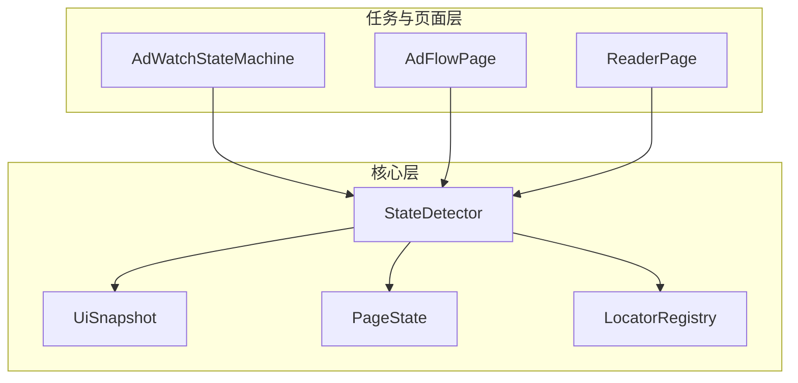
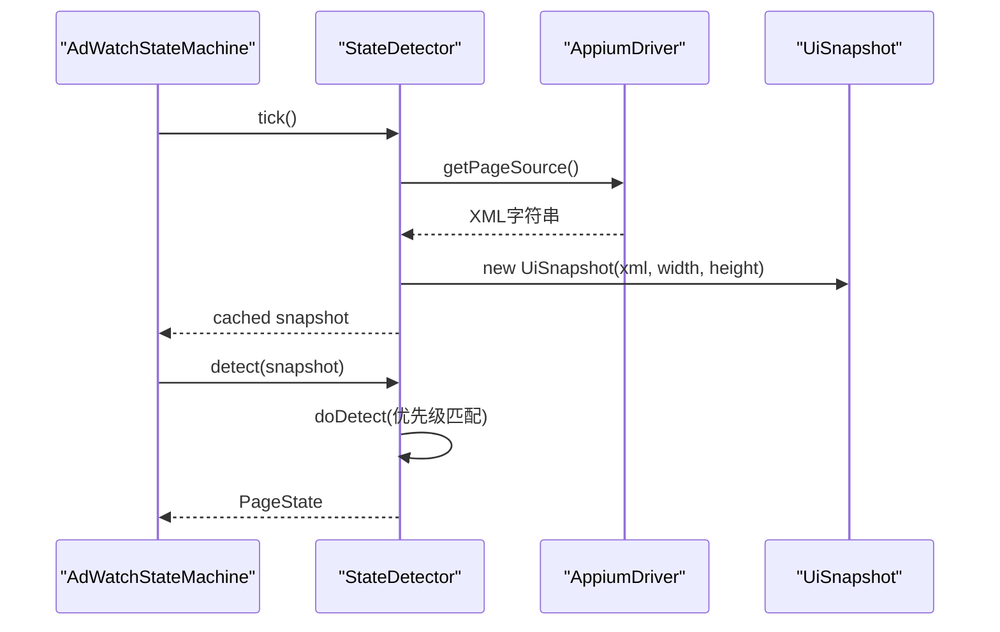
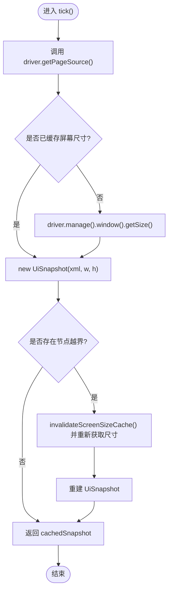
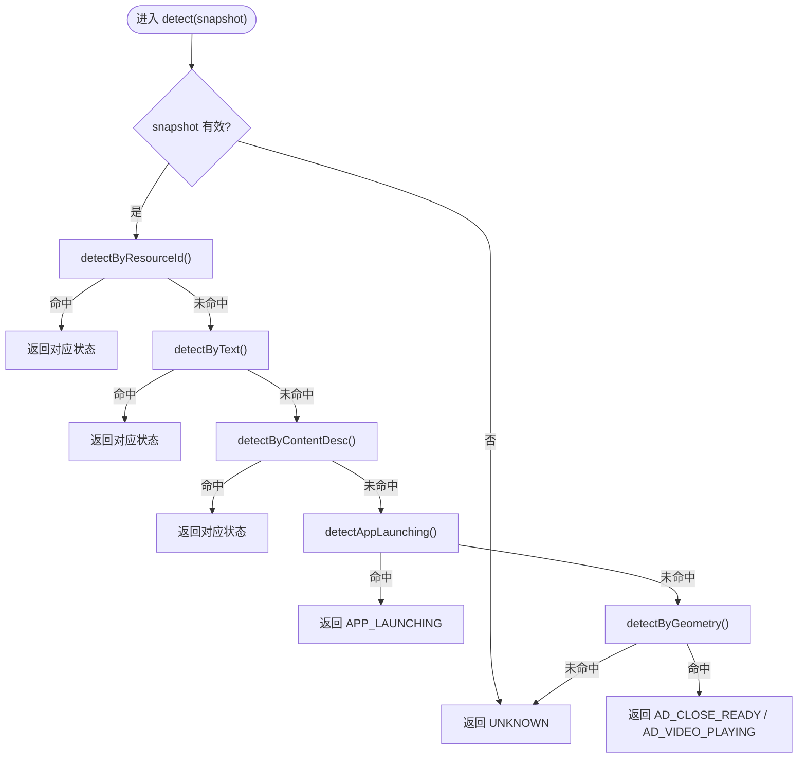
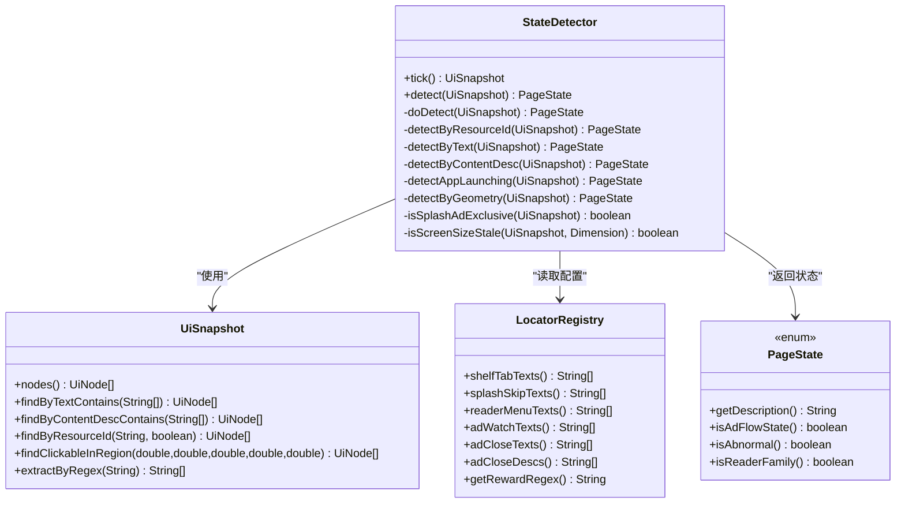

# 状态检测器设计

<cite>
**本文引用的文件**
- [StateDetector.java](file://automation/src/main/java/com/fanqie/auto/core/StateDetector.java)
- [UiSnapshot.java](file://automation/src/main/java/com/fanqie/auto/core/UiSnapshot.java)
- [PageState.java](file://automation/src/main/java/com/fanqie/auto/core/PageState.java)
- [LocatorRegistry.java](file://automation/src/main/java/com/fanqie/auto/config/LocatorRegistry.java)
- [AdWatchStateMachine.java](file://automation/src/main/java/com/fanqie/auto/task/AdWatchStateMachine.java)
- [AdFlowPage.java](file://automation/src/main/java/com/fanqie/auto/page/AdFlowPage.java)
- [ReaderPage.java](file://automation/src/main/java/com/fanqie/auto/page/ReaderPage.java)
- [StateDetectorTest.java](file://automation/src/test/java/com/fanqie/auto/core/StateDetectorTest.java)
</cite>

## 目录
1. [简介](#简介)
2. [项目结构](#项目结构)
3. [核心组件](#核心组件)
4. [架构总览](#架构总览)
5. [详细组件分析](#详细组件分析)
6. [依赖关系分析](#依赖关系分析)
7. [性能考量](#性能考量)
8. [故障排查指南](#故障排查指南)
9. [结论](#结论)
10. [附录：使用示例与调优建议](#附录使用示例与调优建议)

## 简介
本文件围绕 StateDetector 的状态检测器设计进行系统化文档化，重点覆盖以下方面：
- UI 快照缓存机制：通过单次 getPageSource() 构造 UiSnapshot，并在同一 tick 内复用，避免重复 RPC。
- 多级状态匹配算法：resource-id 锚点、text 候选集、content-desc、APP_LAUNCHING 保守判定、几何特征匹配的优先级链。
- 性能优化策略：屏幕尺寸缓存与自愈、纯内存匹配、可观测性上报。
- SPLASH_AD 排他性判定：确保开屏广告与激励视频关闭页的正确区分。
- 横屏旋转与折叠屏场景的自愈机制：基于 bounds 越界检测自动刷新屏幕尺寸缓存。
- 具体使用示例与性能调优建议。

## 项目结构
StateDetector 位于 core 包中，是自动化流程的性能核心；它依赖 UiSnapshot（XML 解析与内存查询）、LocatorRegistry（文案与正则配置）、以及 PageState（状态枚举）。上层任务流 AdWatchStateMachine 和页面操作类 AdFlowPage、ReaderPage 通过 StateDetector.tick()/detect() 驱动状态机流转。

**图表来源**
- [StateDetector.java:1-461](file://automation/src/main/java/com/fanqie/auto/core/StateDetector.java#L1-L461)
- [UiSnapshot.java:1-284](file://automation/src/main/java/com/fanqie/auto/core/UiSnapshot.java#L1-L284)
- [PageState.java:1-97](file://automation/src/main/java/com/fanqie/auto/core/PageState.java#L1-L97)
- [LocatorRegistry.java:1-67](file://automation/src/main/java/com/fanqie/auto/config/LocatorRegistry.java#L1-L67)
- [AdWatchStateMachine.java:58-478](file://automation/src/main/java/com/fanqie/auto/task/AdWatchStateMachine.java#L58-L478)
- [AdFlowPage.java:58-279](file://automation/src/main/java/com/fanqie/auto/page/AdFlowPage.java#L58-L279)
- [ReaderPage.java:82-112](file://automation/src/main/java/com/fanqie/auto/page/ReaderPage.java#L82-L112)

**章节来源**
- [StateDetector.java:1-461](file://automation/src/main/java/com/fanqie/auto/core/StateDetector.java#L1-L461)
- [UiSnapshot.java:1-284](file://automation/src/main/java/com/fanqie/auto/core/UiSnapshot.java#L1-L284)
- [PageState.java:1-97](file://automation/src/main/java/com/fanqie/auto/core/PageState.java#L1-L97)
- [LocatorRegistry.java:1-67](file://automation/src/main/java/com/fanqie/auto/config/LocatorRegistry.java#L1-L67)
- [AdWatchStateMachine.java:58-478](file://automation/src/main/java/com/fanqie/auto/task/AdWatchStateMachine.java#L58-L478)
- [AdFlowPage.java:58-279](file://automation/src/main/java/com/fanqie/auto/page/AdFlowPage.java#L58-L279)
- [ReaderPage.java:82-112](file://automation/src/main/java/com/fanqie/auto/page/ReaderPage.java#L82-L112)

## 核心组件
- StateDetector：状态识别的核心，提供 tick() 获取并缓存快照、detect() 执行多级匹配。
- UiSnapshot：一次 getPageSource() 的内存快照，提供 text/content-desc/resource-id/几何区域等查询能力。
- LocatorRegistry：管理文案候选集、正则表达式与控件定位策略。
- PageState：页面状态枚举，驱动状态机决策。

关键职责划分：
- tick() 负责“抓取 + 缓存”，保证同一 tick 内多次 detect() 复用同一快照，减少 RPC。
- detect() 负责“纯内存匹配”，按优先级顺序返回首个命中状态。
- UiSnapshot 负责“安全解析 + 高效查询”，防御 XXE、处理畸形 XML、零 RPC 查询。
- LocatorRegistry 提供“可配置文案/正则”，支持改配置不改代码。

**章节来源**
- [StateDetector.java:87-170](file://automation/src/main/java/com/fanqie/auto/core/StateDetector.java#L87-L170)
- [UiSnapshot.java:21-72](file://automation/src/main/java/com/fanqie/auto/core/UiSnapshot.java#L21-L72)
- [LocatorRegistry.java:16-67](file://automation/src/main/java/com/fanqie/auto/config/LocatorRegistry.java#L16-L67)
- [PageState.java:11-97](file://automation/src/main/java/com/fanqie/auto/core/PageState.java#L11-L97)

## 架构总览
StateDetector 采用“单 tick 单抓取 + 多级匹配”的架构：
- tick() 调用 driver.getPageSource() 一次，构造 UiSnapshot，并缓存屏幕尺寸；若检测到节点越界则自愈重取尺寸。
- detect() 在 UiSnapshot 上执行纯内存匹配，优先级从高到低：resource-id → text → content-desc → APP_LAUNCHING → 几何特征 → UNKNOWN。
- 上层状态机 AdWatchStateMachine 每轮循环调用 detector.tick() 与 detector.detect()，驱动动作与恢复。

**图表来源**
- [AdWatchStateMachine.java:173-188](file://automation/src/main/java/com/fanqie/auto/task/AdWatchStateMachine.java#L173-L188)
- [StateDetector.java:97-127](file://automation/src/main/java/com/fanqie/auto/core/StateDetector.java#L97-L127)
- [StateDetector.java:152-170](file://automation/src/main/java/com/fanqie/auto/core/StateDetector.java#L152-L170)
- [UiSnapshot.java:52-72](file://automation/src/main/java/com/fanqie/auto/core/UiSnapshot.java#L52-L72)

## 详细组件分析

### StateDetector：tick() 设计与快照复用
- 单次 getPageSource()：tick() 仅调用一次 driver.getPageSource()，并将结果构造为 UiSnapshot，随后缓存到 cachedSnapshot。
- 屏幕尺寸缓存：首次获取后缓存 Dimension，避免每次 tick 都发 getSize() RPC；driver 刷新时失效。
- 自愈机制：isScreenSizeStale() 检查是否存在 bounds 超出缓存尺寸的节点（横屏/折叠屏），若越界则重新获取尺寸并重建快照。
- 可观测性：记录 lastPageSourceMs，供 RunLogger 输出心跳。

**图表来源**
- [StateDetector.java:97-127](file://automation/src/main/java/com/fanqie/auto/core/StateDetector.java#L97-L127)
- [StateDetector.java:450-459](file://automation/src/main/java/com/fanqie/auto/core/StateDetector.java#L450-L459)

**章节来源**
- [StateDetector.java:97-127](file://automation/src/main/java/com/fanqie/auto/core/StateDetector.java#L97-L127)
- [StateDetector.java:450-459](file://automation/src/main/java/com/fanqie/auto/core/StateDetector.java#L450-L459)

### StateDetector：detect() 的多级匹配逻辑
- 优先级 1：resource-id 锚点（书架 tab_shelf + recycler；阅读页 reader 或混淆容器；菜单文案叠加判定 READER_MENU）。
- 优先级 2：text 候选集（继续获取时长、观看广告、底部入口、SPLASH_AD 排他、关闭文案、下一章、通用弹窗、书架 Tab、阅读器菜单兜底、阅读进度正则兜底）。
- 优先级 3：content-desc 候选集（穿山甲 SDK 常用 content-desc 标识关闭按钮）。
- 优先级 4：APP_LAUNCHING 保守判定（节点极少 + 无大面积节点 + 无锚点命中）。
- 优先级 5：几何特征（右上角小 clickable → AD_CLOSE_READY；大面积视频且节点少 → AD_VIDEO_PLAYING）。
- 优先级 6：UNKNOWN 兜底。

**图表来源**
- [StateDetector.java:152-208](file://automation/src/main/java/com/fanqie/auto/core/StateDetector.java#L152-L208)
- [StateDetector.java:218-334](file://automation/src/main/java/com/fanqie/auto/core/StateDetector.java#L218-L334)
- [StateDetector.java:340-347](file://automation/src/main/java/com/fanqie/auto/core/StateDetector.java#L340-L347)
- [StateDetector.java:359-383](file://automation/src/main/java/com/fanqie/auto/core/StateDetector.java#L359-L383)
- [StateDetector.java:394-418](file://automation/src/main/java/com/fanqie/auto/core/StateDetector.java#L394-L418)

**章节来源**
- [StateDetector.java:152-208](file://automation/src/main/java/com/fanqie/auto/core/StateDetector.java#L152-L208)
- [StateDetector.java:218-334](file://automation/src/main/java/com/fanqie/auto/core/StateDetector.java#L218-L334)
- [StateDetector.java:340-347](file://automation/src/main/java/com/fanqie/auto/core/StateDetector.java#L340-L347)
- [StateDetector.java:359-383](file://automation/src/main/java/com/fanqie/auto/core/StateDetector.java#L359-L383)
- [StateDetector.java:394-418](file://automation/src/main/java/com/fanqie/auto/core/StateDetector.java#L394-L418)

### UiSnapshot：安全解析与内存查询
- 安全解析：禁用 DOCTYPE、外部实体、XInclude，防止 XXE；非线程安全的 DocumentBuilderFactory 每次新建实例。
- 健壮性：XML 畸形/截断不抛异常，返回空快照并标记 parseFailed=true，上层走 UNKNOWN。
- 内存查询：findByTextContains、findByContentDescContains、findByResourceId、findClickableInRegion、extractByRegex、nearestClickableAncestor。
- 性能：一次解析，后续查询均为纯内存操作，零 RPC。

**章节来源**
- [UiSnapshot.java:21-72](file://automation/src/main/java/com/fanqie/auto/core/UiSnapshot.java#L21-L72)
- [UiSnapshot.java:78-98](file://automation/src/main/java/com/fanqie/auto/core/UiSnapshot.java#L78-L98)
- [UiSnapshot.java:137-228](file://automation/src/main/java/com/fanqie/auto/core/UiSnapshot.java#L137-L228)

### LocatorRegistry：文案与正则配置
- 中文编码：使用 UTF-8 Reader 加载 properties，避免 ISO-8859-1 乱码导致匹配失败。
- 控件定位策略：每个逻辑控件对应 LocatorSpec（primaryBy + fallbackBys + boundsHint + allowGeometryFallback）。
- 安全约束：ad.watch 与 ad.continue 禁止几何兜底（误点浪费配额）；ad.close 允许几何兜底（漏点后果更大）。
- 候选集：包含书架 Tab、开屏跳过、阅读菜单、广告相关文案与描述、每日配额耗尽文案、奖励提取正则等。

**章节来源**
- [LocatorRegistry.java:16-67](file://automation/src/main/java/com/fanqie/auto/config/LocatorRegistry.java#L16-L67)
- [ConfigTest.java:77-132](file://automation/src/test/java/com/fanqie/auto/config/ConfigTest.java#L77-L132)

### 屏幕尺寸缓存与自愈机制
- 缓存策略：首次获取屏幕尺寸后缓存，避免每次 tick 都发 getSize() RPC。
- 自愈触发：isScreenSizeStale() 检查是否存在 bounds 超出缓存尺寸的节点（横屏激励视频/折叠屏旋转），若越界则失效并重取尺寸，重建快照。
- 适用场景：横屏旋转、折叠屏展开/折叠、设备 DPI 变化等。

**章节来源**
- [StateDetector.java:102-118](file://automation/src/main/java/com/fanqie/auto/core/StateDetector.java#L102-L118)
- [StateDetector.java:450-459](file://automation/src/main/java/com/fanqie/auto/core/StateDetector.java#L450-L459)

### SPLASH_AD 的排他性判定
- 文本优先：splashSkipTexts 已收窄为开屏专有词（如“跳过广告”），裸“跳过”归入 ad.close.text，避免抢占 AD_CLOSE_READY。
- 排他条件：
  - 全屏大面积节点（areaRatio > 0.6）。
  - 不存在右上角小 clickable 关闭特征（与 detectByGeometry 一致）。
- 目的：确保真正的冷启动全屏开屏广告才判 SPLASH_AD，避免激励视频关闭页被误判。

**章节来源**
- [StateDetector.java:281-289](file://automation/src/main/java/com/fanqie/auto/core/StateDetector.java#L281-L289)
- [StateDetector.java:420-436](file://automation/src/main/java/com/fanqie/auto/core/StateDetector.java#L420-L436)
- [StateDetectorTest.java:84-111](file://automation/src/test/java/com/fanqie/auto/core/StateDetectorTest.java#L84-L111)

### 与上层状态机的协作
- AdWatchStateMachine：每轮循环调用 detector.tick() 与 detector.detect()，根据状态转移表执行动作，并校验动作后状态是否转移。
- AdFlowPage：点击“观看广告”、“继续获取免费时长”等操作仅使用 L1 语义属性匹配，禁用几何兜底以避免误点浪费配额。
- ReaderPage：翻页等待超时后主动 tick+detect 确认当前状态，更新日志与状态。

**章节来源**
- [AdWatchStateMachine.java:173-188](file://automation/src/main/java/com/fanqie/auto/task/AdWatchStateMachine.java#L173-L188)
- [AdFlowPage.java:76-88](file://automation/src/main/java/com/fanqie/auto/page/AdFlowPage.java#L76-L88)
- [ReaderPage.java:82-95](file://automation/src/main/java/com/fanqie/auto/page/ReaderPage.java#L82-L95)

## 依赖关系分析
StateDetector 的依赖关系清晰且低耦合：
- 对 AppiumDriver 的依赖仅在 tick() 中用于抓取 XML 与获取屏幕尺寸。
- 对 UiSnapshot 的依赖集中在解析与查询，所有 detect() 路径均为纯内存操作。
- 对 LocatorRegistry 的依赖为配置注入，支持改配置不改代码。
- 对 PageState 的依赖为返回值类型，驱动状态机决策。

**图表来源**
- [StateDetector.java:1-461](file://automation/src/main/java/com/fanqie/auto/core/StateDetector.java#L1-L461)
- [UiSnapshot.java:1-284](file://automation/src/main/java/com/fanqie/auto/core/UiSnapshot.java#L1-L284)
- [LocatorRegistry.java:1-67](file://automation/src/main/java/com/fanqie/auto/config/LocatorRegistry.java#L1-L67)
- [PageState.java:1-97](file://automation/src/main/java/com/fanqie/auto/core/PageState.java#L1-L97)

**章节来源**
- [StateDetector.java:1-461](file://automation/src/main/java/com/fanqie/auto/core/StateDetector.java#L1-L461)
- [UiSnapshot.java:1-284](file://automation/src/main/java/com/fanqie/auto/core/UiSnapshot.java#L1-L284)
- [LocatorRegistry.java:1-67](file://automation/src/main/java/com/fanqie/auto/config/LocatorRegistry.java#L1-L67)
- [PageState.java:1-97](file://automation/src/main/java/com/fanqie/auto/core/PageState.java#L1-L97)

## 性能考量
- 单次抓取与快照复用：tick() 仅调用一次 getPageSource()，同一 tick 内多次 detect() 复用同一快照，避免重复 RPC。
- 屏幕尺寸缓存：首次获取后缓存 Dimension，避免每次 tick 都发 getSize() RPC；driver 刷新时自动失效。
- 自愈机制：基于 bounds 越界检测自动刷新屏幕尺寸，避免横屏/折叠屏场景下的比例判定失真。
- 纯内存匹配：detect() 完全在 UiSnapshot 上进行，零 RPC，目标约 0.5s/次。
- 可观测性：记录 lastPageSourceMs 与 detect 耗时，供 RunLogger 输出心跳与指标。

[本节为通用性能讨论，无需特定文件引用]

## 故障排查指南
- XML 解析失败：UiSnapshot 捕获异常并返回空快照，parseFailed=true，上层 detect() 返回 UNKNOWN。检查设备端 XML 是否完整。
- 状态误判：
  - SPLASH_AD 误判：检查 splashSkipTexts 是否包含裸“跳过”，应改为“跳过广告”等专有词；确认是否存在右上角关闭 clickable。
  - READER_MENU 误判：纯文案兜底需大面积正文（areaRatio>0.6），否则可能误判书架顶栏“设置”。
  - APP_LAUNCHING 误判：节点极少但存在大面积节点时应判 AD_VIDEO_PLAYING，而非 APP_LAUNCHING。
- 屏幕尺寸异常：若出现 bounds 越界，检查 isScreenSizeStale() 是否触发自愈；确认 driver 刷新时是否清空尺寸缓存。
- 文案乱码：LocatorRegistry 使用 UTF-8 Reader 加载 properties，确保配置文件编码正确。

**章节来源**
- [UiSnapshot.java:57-72](file://automation/src/main/java/com/fanqie/auto/core/UiSnapshot.java#L57-L72)
- [StateDetector.java:281-289](file://automation/src/main/java/com/fanqie/auto/core/StateDetector.java#L281-L289)
- [StateDetector.java:317-331](file://automation/src/main/java/com/fanqie/auto/core/StateDetector.java#L317-L331)
- [StateDetector.java:359-383](file://automation/src/main/java/com/fanqie/auto/core/StateDetector.java#L359-L383)
- [StateDetector.java:450-459](file://automation/src/main/java/com/fanqie/auto/core/StateDetector.java#L450-L459)
- [LocatorRegistry.java:16-25](file://automation/src/main/java/com/fanqie/auto/config/LocatorRegistry.java#L16-L25)

## 结论
StateDetector 通过“单 tick 单抓取 + 多级匹配 + 屏幕尺寸缓存与自愈”的设计，实现了高性能、高鲁棒性的状态检测。其优先级匹配链确保了 resource-id 锚点的最高确定性，text/content-desc 的灵活适配，APP_LAUNCHING 的保守判定，以及几何特征的兜底能力。SPLASH_AD 的排他性判定进一步提升了开屏广告与激励视频关闭页的区分准确性。配合上层状态机与页面操作类，整体方案具备强自愈能力与良好的可观测性。

[本节为总结性内容，无需特定文件引用]

## 附录：使用示例与调优建议

### 使用示例
- 基本流程：
  - 创建 StateDetector 实例，注入 AutomationConfig 与 LocatorRegistry。
  - 在状态机循环中调用 detector.tick() 获取快照，再调用 detector.detect(snapshot) 识别状态。
  - 根据返回的 PageState 执行相应动作（如点击关闭、翻页、重启等）。
- 参考实现：
  - AdWatchStateMachine 每轮循环调用 tick()+detect()，并根据状态转移表执行动作。
  - AdFlowPage 点击“观看广告”、“继续获取免费时长”等操作仅使用 L1 语义属性匹配，禁用几何兜底。
  - ReaderPage 翻页等待超时后主动 tick+detect 确认当前状态。

**章节来源**
- [AdWatchStateMachine.java:173-188](file://automation/src/main/java/com/fanqie/auto/task/AdWatchStateMachine.java#L173-L188)
- [AdFlowPage.java:76-88](file://automation/src/main/java/com/fanqie/auto/page/AdFlowPage.java#L76-L88)
- [ReaderPage.java:82-95](file://automation/src/main/java/com/fanqie/auto/page/ReaderPage.java#L82-L95)

### 性能调优建议
- 合理配置 LocatorRegistry：
  - 确保文案候选集准确，避免误判导致的重试与额外 RPC。
  - 对高风险操作（如“观看广告”、“继续获取免费时长”）禁用几何兜底，避免误点浪费配额。
- 监控与可观测性：
  - 启用 RunLogger 上报 detect 耗时与 getPageSource 耗时，观察性能瓶颈。
  - 关注 XML 大小与节点数，评估解析与查询开销。
- 自愈与容错：
  - 利用 isScreenSizeStale() 的自愈机制，应对横屏/折叠屏场景。
  - 对 XML 解析失败的情况，确保上层能正确处理 UNKNOWN 状态。
- 校准 resource-id 锚点：
  - 真机 dump 校准书架 Tab、书籍列表、阅读页容器的 resource-id，提升最高优先级匹配的准确性。

**章节来源**
- [ConfigTest.java:77-132](file://automation/src/test/java/com/fanqie/auto/config/ConfigTest.java#L77-L132)
- [StateDetector.java:102-118](file://automation/src/main/java/com/fanqie/auto/core/StateDetector.java#L102-L118)
- [StateDetector.java:157-169](file://automation/src/main/java/com/fanqie/auto/core/StateDetector.java#L157-L169)