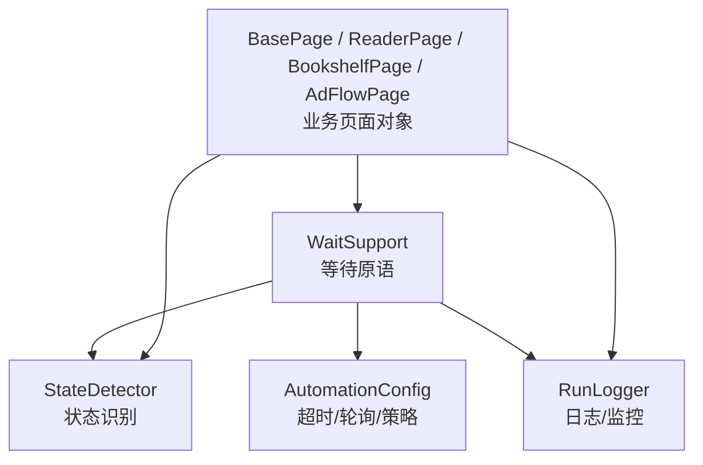
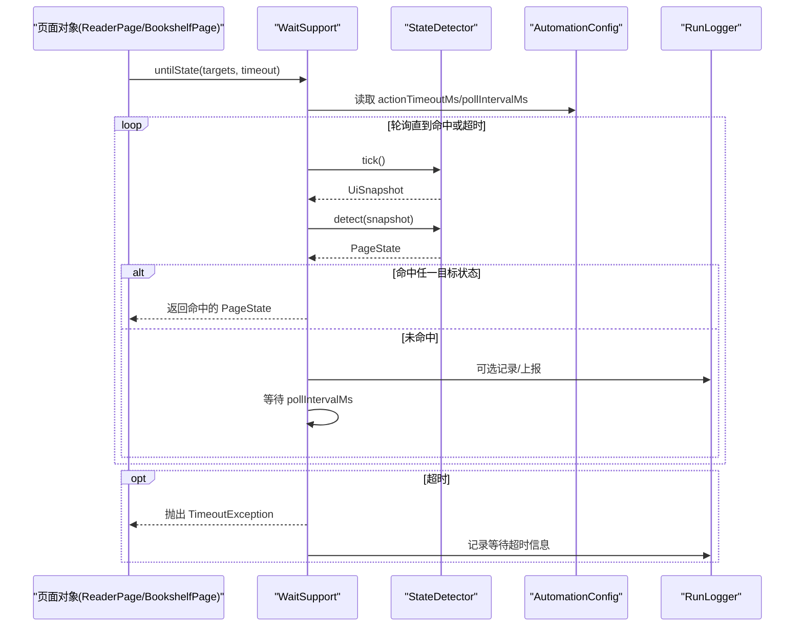
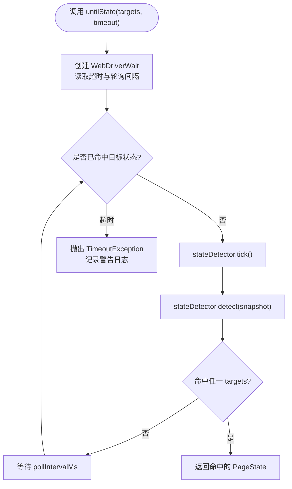
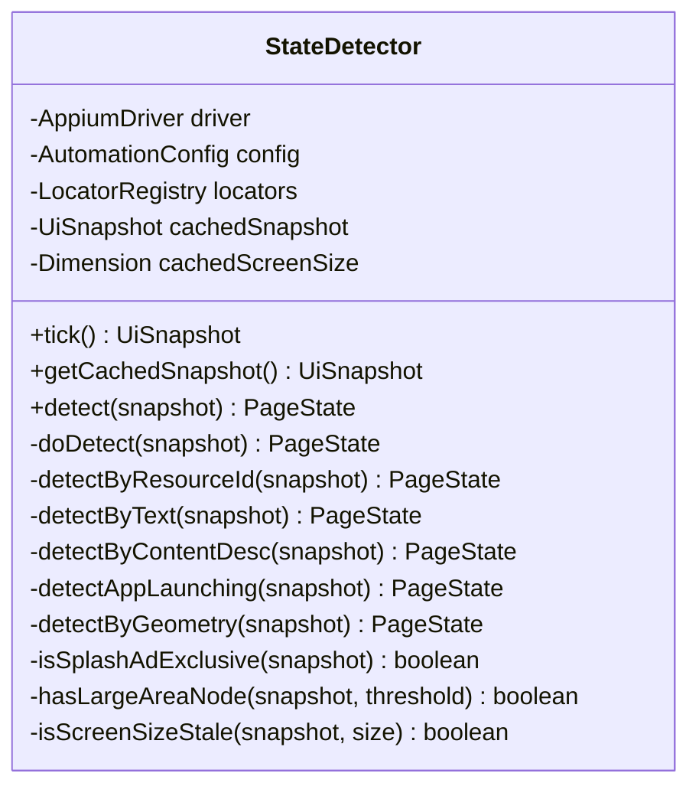
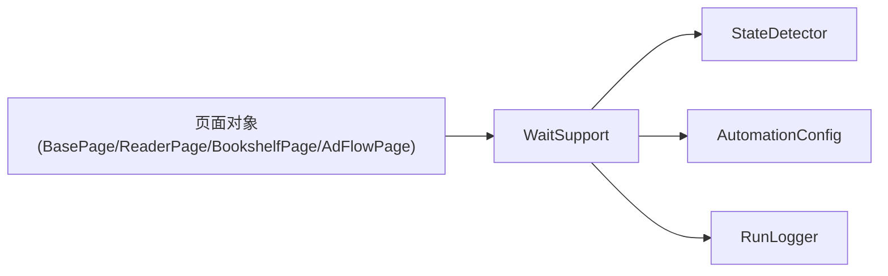

# 等待支持服务

<cite>
**本文引用的文件**
- [WaitSupport.java](file://automation/src/main/java/com/fanqie/auto/core/WaitSupport.java)
- [StateDetector.java](file://automation/src/main/java/com/fanqie/auto/core/StateDetector.java)
- [AutomationConfig.java](file://automation/src/main/java/com/fanqie/auto/config/AutomationConfig.java)
- [BasePage.java](file://automation/src/main/java/com/fanqie/auto/page/BasePage.java)
- [ReaderPage.java](file://automation/src/main/java/com/fanqie/auto/page/ReaderPage.java)
- [BookshelfPage.java](file://automation/src/main/java/com/fanqie/auto/page/BookshelfPage.java)
- [AdFlowPage.java](file://automation/src/main/java/com/fanqie/auto/page/AdFlowPage.java)
- [DriverAware.java](file://automation/src/main/java/com/fanqie/auto/core/DriverAware.java)
- [RunLogger.java](file://automation/src/main/java/com/fanqie/auto/core/RunLogger.java)
</cite>

## 目录
1. [简介](#简介)
2. [项目结构](#项目结构)
3. [核心组件](#核心组件)
4. [架构总览](#架构总览)
5. [详细组件分析](#详细组件分析)
6. [依赖关系分析](#依赖关系分析)
7. [性能考量](#性能考量)
8. [故障排查指南](#故障排查指南)
9. [结论](#结论)
10. [附录：使用示例与最佳实践](#附录使用示例与最佳实践)

## 简介
本文件围绕 WaitSupport 等待支持服务，系统化阐述其设计目标、实现模式与工程实践。内容覆盖显式等待、隐式等待策略取舍、条件等待封装、超时与重试机制、错误处理、智能等待（基于页面状态检测的动态策略）、日志与性能监控，以及与上层页面对象和状态机的集成方式。目标是让读者在不深入源码的情况下也能正确使用并扩展等待能力。

## 项目结构
等待能力由“等待原语 + 状态识别 + 配置驱动 + 日志观测”四部分构成：
- 等待原语：WaitSupport，提供 untilState、untilStateGone、untilAnyTextPresent、untilSnapshotMatches、runWithRetry 等统一接口。
- 状态识别：StateDetector，负责从 UI 快照中识别当前 PageState，供等待原语轮询判定。
- 配置驱动：AutomationConfig，集中管理超时、轮询间隔、翻页策略等参数。
- 日志观测：RunLogger，记录运行统计、异常快照、心跳保活与性能指标。

图表来源
- [WaitSupport.java:26-233](file://automation/src/main/java/com/fanqie/auto/core/WaitSupport.java#L26-L233)
- [StateDetector.java:29-170](file://automation/src/main/java/com/fanqie/auto/core/StateDetector.java#L29-L170)
- [AutomationConfig.java:180-212](file://automation/src/main/java/com/fanqie/auto/config/AutomationConfig.java#L180-L212)
- [BasePage.java:40-73](file://automation/src/main/java/com/fanqie/auto/page/BasePage.java#L40-L73)
- [ReaderPage.java:82-118](file://automation/src/main/java/com/fanqie/auto/page/ReaderPage.java#L82-L118)
- [BookshelfPage.java:111-121](file://automation/src/main/java/com/fanqie/auto/page/BookshelfPage.java#L111-L121)
- [AdFlowPage.java:107-138](file://automation/src/main/java/com/fanqie/auto/page/AdFlowPage.java#L107-L138)
- [RunLogger.java:144-197](file://automation/src/main/java/com/fanqie/auto/core/RunLogger.java#L144-L197)

章节来源
- [WaitSupport.java:26-233](file://automation/src/main/java/com/fanqie/auto/core/WaitSupport.java#L26-L233)
- [StateDetector.java:29-170](file://automation/src/main/java/com/fanqie/auto/core/StateDetector.java#L29-L170)
- [AutomationConfig.java:180-212](file://automation/src/main/java/com/fanqie/auto/config/AutomationConfig.java#L180-L212)
- [RunLogger.java:144-197](file://automation/src/main/java/com/fanqie/auto/core/RunLogger.java#L144-L197)

## 核心组件
- WaitSupport：统一等待原语，封装 WebDriverWait，提供多目标状态等待、状态消失等待、文案出现等待、自定义快照条件等待与幂等重试。
- StateDetector：高性能状态识别器，tick() 仅一次抓取 UI 树并缓存；detect() 纯内存匹配，按优先级返回 PageState。
- AutomationConfig：集中化配置项，包括 actionTimeoutMs、pollIntervalMs、maxStateDwellMs、adVideoTimeoutMs 等。
- BasePage/ReaderPage/BookshelfPage/AdFlowPage：业务页面对象，通过 WaitSupport 完成等待与交互，结合 StateDetector 进行状态流转。
- RunLogger：运行期日志、截图与 XML 快照落盘、心跳保活、性能统计。

章节来源
- [WaitSupport.java:26-233](file://automation/src/main/java/com/fanqie/auto/core/WaitSupport.java#L26-L233)
- [StateDetector.java:29-170](file://automation/src/main/java/com/fanqie/auto/core/StateDetector.java#L29-L170)
- [AutomationConfig.java:180-212](file://automation/src/main/java/com/fanqie/auto/config/AutomationConfig.java#L180-L212)
- [BasePage.java:40-73](file://automation/src/main/java/com/fanqie/auto/page/BasePage.java#L40-L73)
- [ReaderPage.java:82-118](file://automation/src/main/java/com/fanqie/auto/page/ReaderPage.java#L82-L118)
- [BookshelfPage.java:111-121](file://automation/src/main/java/com/fanqie/auto/page/BookshelfPage.java#L111-L121)
- [AdFlowPage.java:107-138](file://automation/src/main/java/com/fanqie/auto/page/AdFlowPage.java#L107-L138)
- [RunLogger.java:144-197](file://automation/src/main/java/com/fanqie/auto/core/RunLogger.java#L144-L197)

## 架构总览
WaitSupport 作为上层页面对象的统一等待入口，内部以 StateDetector 为“智能判断器”，以 AutomationConfig 为“参数源”，以 RunLogger 为“可观测性”。所有等待均基于显式等待，避免隐式等待带来的不可控阻塞。

图表来源
- [WaitSupport.java:56-86](file://automation/src/main/java/com/fanqie/auto/core/WaitSupport.java#L56-L86)
- [StateDetector.java:97-127](file://automation/src/main/java/com/fanqie/auto/core/StateDetector.java#L97-L127)
- [AutomationConfig.java:180-212](file://automation/src/main/java/com/fanqie/auto/config/AutomationConfig.java#L180-L212)
- [RunLogger.java:144-197](file://automation/src/main/java/com/fanqie/auto/core/RunLogger.java#L144-L197)

## 详细组件分析

### WaitSupport 等待原语
- 显式等待：全部基于 WebDriverWait(driver, Duration.ofMillis(timeout), Duration.ofMillis(pollInterval))，确保可控的轮询频率与超时边界。
- 多目标状态等待：untilState 支持一次传入多个目标 PageState，命中任一即返回，避免翻页后遗漏广告弹窗等并发状态。
- 状态消失等待：untilStateGone 用于等待某状态结束（如 AD_VIDEO_PLAYING 播放完毕、APP_LAUNCHING 启动完成）。
- 文案出现等待：untilAnyTextPresent 等待 UI 树中出现候选文案之一。
- 自定义条件等待：untilSnapshotMatches 允许上层注入任意 Predicate<UiSnapshot> 条件。
- 幂等重试：runWithRetry 提供指数退避重试，适用于偶发时序竞争导致的 UI 操作失败。

图表来源
- [WaitSupport.java:56-86](file://automation/src/main/java/com/fanqie/auto/core/WaitSupport.java#L56-L86)
- [StateDetector.java:97-127](file://automation/src/main/java/com/fanqie/auto/core/StateDetector.java#L97-L127)
- [AutomationConfig.java:180-212](file://automation/src/main/java/com/fanqie/auto/config/AutomationConfig.java#L180-L212)

章节来源
- [WaitSupport.java:56-86](file://automation/src/main/java/com/fanqie/auto/core/WaitSupport.java#L56-L86)
- [WaitSupport.java:95-119](file://automation/src/main/java/com/fanqie/auto/core/WaitSupport.java#L95-L119)
- [WaitSupport.java:128-151](file://automation/src/main/java/com/fanqie/auto/core/WaitSupport.java#L128-L151)
- [WaitSupport.java:160-183](file://automation/src/main/java/com/fanqie/auto/core/WaitSupport.java#L160-L183)
- [WaitSupport.java:199-232](file://automation/src/main/java/com/fanqie/auto/core/WaitSupport.java#L199-L232)

### StateDetector 智能等待算法
- 单次抓取与缓存：tick() 仅调用一次 getPageSource()，构造 UiSnapshot 并缓存，同一 tick 内多次 detect() 复用，避免重复 RPC。
- 纯内存匹配：detect() 按优先级顺序匹配，不直接操作 driver，保证性能与稳定性。
- 优先级规则：resource-id 锚点 → text 候选集 → content-desc 候选集 → APP_LAUNCHING 保守判定 → 几何特征 → UNKNOWN。
- 屏幕尺寸自愈：若检测到节点越界，自动失效并重取屏幕尺寸，避免横屏/折叠屏旋转导致比例判定失真。
- 可观测性：记录每次 detect 耗时，供 RunLogger 汇总平均识别耗时。

图表来源
- [StateDetector.java:29-170](file://automation/src/main/java/com/fanqie/auto/core/StateDetector.java#L29-L170)
- [StateDetector.java:183-418](file://automation/src/main/java/com/fanqie/auto/core/StateDetector.java#L183-L418)

章节来源
- [StateDetector.java:97-127](file://automation/src/main/java/com/fanqie/auto/core/StateDetector.java#L97-L127)
- [StateDetector.java:152-170](file://automation/src/main/java/com/fanqie/auto/core/StateDetector.java#L152-L170)
- [StateDetector.java:183-418](file://automation/src/main/java/com/fanqie/auto/core/StateDetector.java#L183-L418)

### 超时机制、重试策略与错误处理
- 超时机制：所有等待方法均接受超时毫秒数，默认来自 AutomationConfig.actionTimeoutMs()；轮询间隔来自 AutomationConfig.pollIntervalMs()。
- 重试策略：runWithRetry 采用指数退避（backoffMs → backoffMs*2 → ...），捕获异常并记录尝试次数，最终失败抛出运行时异常。
- 错误处理：等待超时抛出 TimeoutException，并在日志中记录当前状态；状态机在超时后主动 tick+detect 确认当前状态，便于恢复流程决策。

章节来源
- [AutomationConfig.java:180-212](file://automation/src/main/java/com/fanqie/auto/config/AutomationConfig.java#L180-L212)
- [WaitSupport.java:56-86](file://automation/src/main/java/com/fanqie/auto/core/WaitSupport.java#L56-L86)
- [WaitSupport.java:199-232](file://automation/src/main/java/com/fanqie/auto/core/WaitSupport.java#L199-L232)
- [ReaderPage.java:82-118](file://automation/src/main/java/com/fanqie/auto/page/ReaderPage.java#L82-L118)

### 封装 Appium 等待操作与统一接口
- 统一入口：WaitSupport 暴露 untilState、untilStateGone、untilAnyTextPresent、untilSnapshotMatches，屏蔽底层 WebDriverWait 细节。
- 状态驱动：所有等待都基于 StateDetector 的 PageState 语义，而非元素可见性等低层信号，提升鲁棒性。
- DriverAware 刷新：WaitSupport 实现 DriverAware，可在 session 重建时刷新 driver 引用，避免 NoSuchSessionException。

章节来源
- [WaitSupport.java:26-86](file://automation/src/main/java/com/fanqie/auto/core/WaitSupport.java#L26-L86)
- [DriverAware.java:12-20](file://automation/src/main/java/com/fanqie/auto/core/DriverAware.java#L12-L20)

### 与其他核心服务的集成与最佳实践
- 与页面对象集成：ReaderPage/BookshelfPage 在翻页、打开书籍、关闭弹窗等操作后，调用 WaitSupport.untilState 等待进入预期状态集合，再执行后续动作。
- 与状态机集成：AdWatchStateMachine 根据 StateDetector 识别的状态分派处理器，配合 WaitSupport 的等待原语完成状态转移。
- 与日志集成：RunLogger 记录状态转移、心跳摘要、XML 体积预警与最终统计，辅助定位问题与优化性能。

章节来源
- [ReaderPage.java:82-118](file://automation/src/main/java/com/fanqie/auto/page/ReaderPage.java#L82-L118)
- [BookshelfPage.java:111-121](file://automation/src/main/java/com/fanqie/auto/page/BookshelfPage.java#L111-L121)
- [AdFlowPage.java:107-138](file://automation/src/main/java/com/fanqie/auto/page/AdFlowPage.java#L107-L138)
- [RunLogger.java:144-197](file://automation/src/main/java/com/fanqie/auto/core/RunLogger.java#L144-L197)

## 依赖关系分析
WaitSupport 依赖 StateDetector 进行状态识别，依赖 AutomationConfig 获取超时与轮询参数，依赖 RunLogger 记录日志与监控。页面对象通过 WaitSupport 统一发起等待，从而解耦具体等待实现。

图表来源
- [WaitSupport.java:26-233](file://automation/src/main/java/com/fanqie/auto/core/WaitSupport.java#L26-L233)
- [StateDetector.java:29-170](file://automation/src/main/java/com/fanqie/auto/core/StateDetector.java#L29-L170)
- [AutomationConfig.java:180-212](file://automation/src/main/java/com/fanqie/auto/config/AutomationConfig.java#L180-L212)
- [BasePage.java:40-73](file://automation/src/main/java/com/fanqie/auto/page/BasePage.java#L40-L73)
- [ReaderPage.java:82-118](file://automation/src/main/java/com/fanqie/auto/page/ReaderPage.java#L82-L118)
- [BookshelfPage.java:111-121](file://automation/src/main/java/com/fanqie/auto/page/BookshelfPage.java#L111-L121)
- [AdFlowPage.java:107-138](file://automation/src/main/java/com/fanqie/auto/page/AdFlowPage.java#L107-L138)

章节来源
- [WaitSupport.java:26-233](file://automation/src/main/java/com/fanqie/auto/core/WaitSupport.java#L26-L233)
- [StateDetector.java:29-170](file://automation/src/main/java/com/fanqie/auto/core/StateDetector.java#L29-L170)
- [AutomationConfig.java:180-212](file://automation/src/main/java/com/fanqie/auto/config/AutomationConfig.java#L180-L212)

## 性能考量
- 显式等待优于隐式等待：全部基于 WebDriverWait，避免全局隐式等待造成的不可控阻塞。
- 单次抓取与缓存：StateDetector.tick() 只抓取一次 UI 树，同一 tick 内多次 detect() 复用快照，显著降低 RPC 开销。
- 屏幕尺寸缓存与自愈：避免频繁 getSize()，并在检测到越界时自动重取，减少误判与额外开销。
- 轮询间隔可调：pollIntervalMs 控制轮询频率，平衡响应速度与资源占用。
- 幂等重试：runWithRetry 指数退避减少瞬时失败对整体流程的影响，避免完整恢复流程的昂贵代价。

[本节为通用性能建议，不直接分析具体文件]

## 故障排查指南
- 等待超时：检查目标状态集合是否合理（翻页后应包含可能触发的广告弹窗等状态）；查看 RunLogger 输出的当前状态与 XML 体积预警。
- 状态识别不准：核对 LocatorRegistry 的候选文案与 resource-id 锚点；关注 StateDetector 的优先级规则与几何特征判定。
- 会话断开：RunLogger 心跳保活失败会标记 sessionAlive=false；需触发 DriverFactory 重建会话并刷新各组件 driver 引用。
- 截图与快照：在异常或恢复路径调用 RunLogger.captureSnapshot(tag) 保存截图与 XML，便于离线分析。

章节来源
- [RunLogger.java:144-197](file://automation/src/main/java/com/fanqie/auto/core/RunLogger.java#L144-L197)
- [RunLogger.java:239-261](file://automation/src/main/java/com/fanqie/auto/core/RunLogger.java#L239-L261)
- [StateDetector.java:183-418](file://automation/src/main/java/com/fanqie/auto/core/StateDetector.java#L183-L418)

## 结论
WaitSupport 将多种等待策略抽象为统一的显式等待原语，结合 StateDetector 的智能状态识别与 AutomationConfig 的可调参数，形成稳定高效的等待体系。通过幂等重试、日志与监控，系统具备较强的鲁棒性与可观测性。页面对象只需关注业务语义（如“等待进入阅读页或广告弹窗”），无需关心底层等待细节。

[本节为总结性内容，不直接分析具体文件]

## 附录：使用示例与最佳实践
- 等待元素出现（文案出现）：使用 untilAnyTextPresent(candidates, timeout)，适用于按钮/文本出现场景。
- 等待状态变化：使用 untilState(targets, timeout)，传入多个目标状态，适用于翻页后可能出现的多种状态。
- 等待状态消失：使用 untilStateGone(stateToGone, timeout)，适用于等待视频播放结束或应用启动完成。
- 自定义条件等待：使用 untilSnapshotMatches(predicate, timeout)，适用于复杂条件判断（如特定节点数量、区域特征）。
- 幂等重试：使用 runWithRetry(supplier, maxAttempts, backoffMs)，适用于易受时序影响的 UI 操作。

最佳实践
- 始终使用显式等待，避免 Thread.sleep 与隐式等待。
- 翻页后等待目标状态集合要全面，涵盖可能的广告弹窗与章节结束状态。
- 合理设置超时与轮询间隔，兼顾响应速度与资源占用。
- 在关键路径记录状态与快照，便于问题定位。
- 利用自动化配置调整行为，避免硬编码魔法数字。

章节来源
- [WaitSupport.java:128-183](file://automation/src/main/java/com/fanqie/auto/core/WaitSupport.java#L128-L183)
- [WaitSupport.java:199-232](file://automation/src/main/java/com/fanqie/auto/core/WaitSupport.java#L199-L232)
- [ReaderPage.java:82-118](file://automation/src/main/java/com/fanqie/auto/page/ReaderPage.java#L82-L118)
- [BookshelfPage.java:111-121](file://automation/src/main/java/com/fanqie/auto/page/BookshelfPage.java#L111-L121)
- [AdFlowPage.java:107-138](file://automation/src/main/java/com/fanqie/auto/page/AdFlowPage.java#L107-L138)
- [AutomationConfig.java:180-212](file://automation/src/main/java/com/fanqie/auto/config/AutomationConfig.java#L180-L212)