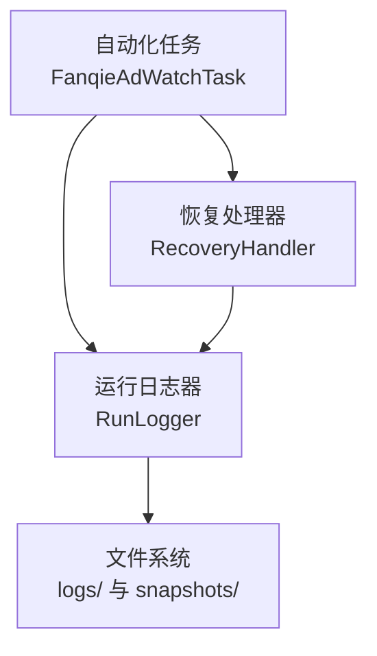
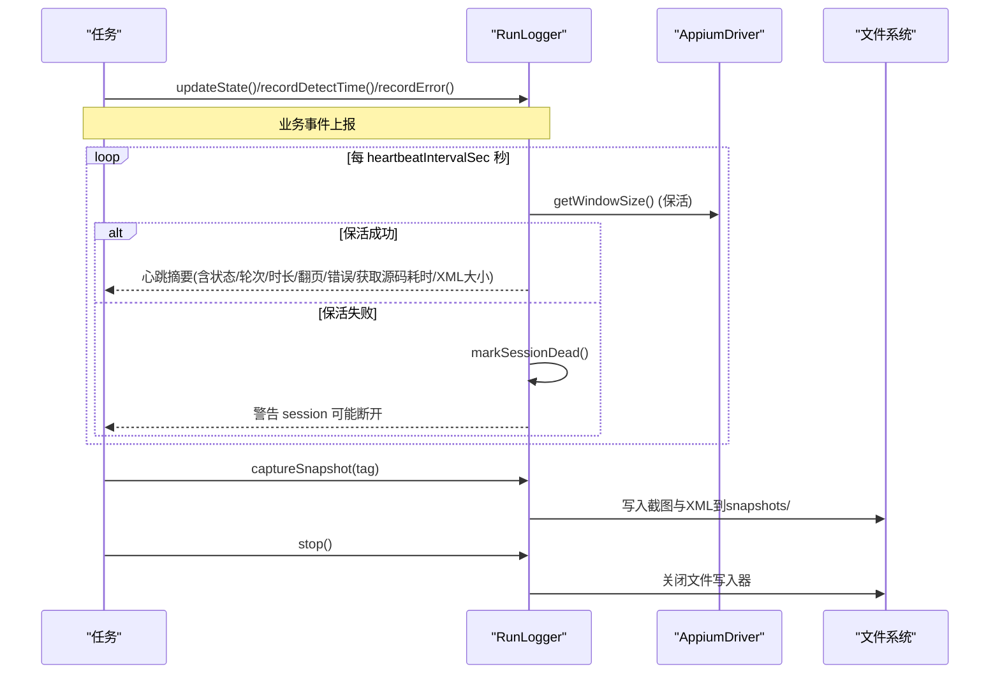
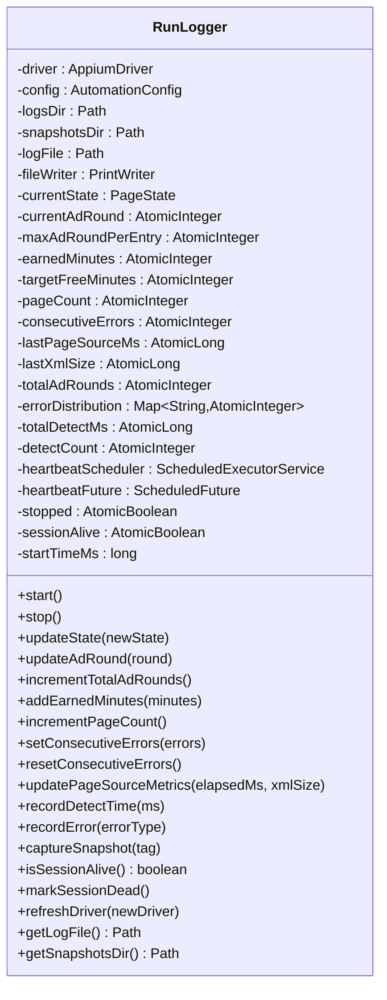
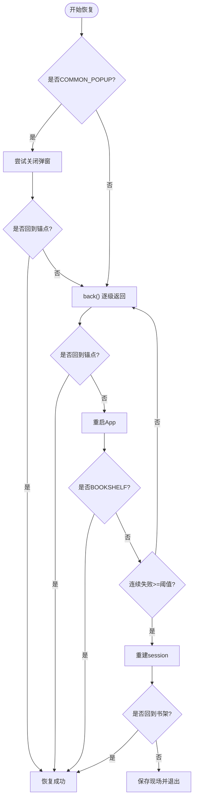
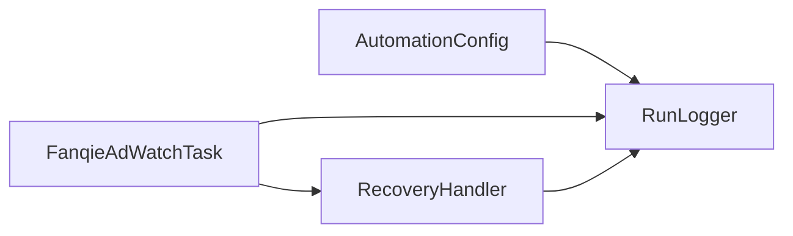

# 运行日志系统

<cite>
**本文引用的文件**
- [RunLogger.java](file://automation/src/main/java/com/fanqie/auto/core/RunLogger.java)
- [AutomationConfig.java](file://automation/src/main/java/com/fanqie/auto/config/AutomationConfig.java)
- [RecoveryHandler.java](file://automation/src/main/java/com/fanqie/auto/task/RecoveryHandler.java)
- [FanqieAdWatchTask.java](file://automation/src/main/java/com/fanqie/auto/task/FanqieAdWatchTask.java)
- [RunLoggerTest.java](file://automation/src/test/java/com/fanqie/auto/core/RunLoggerTest.java)
</cite>

## 目录
1. [简介](#简介)
2. [项目结构](#项目结构)
3. [核心组件](#核心组件)
4. [架构总览](#架构总览)
5. [详细组件分析](#详细组件分析)
6. [依赖关系分析](#依赖关系分析)
7. [性能考量](#性能考量)
8. [故障诊断指南](#故障诊断指南)
9. [结论](#结论)
10. [附录：配置与使用指南](#附录：配置与使用指南)

## 简介
本文件面向自动化任务中的“运行日志系统”，围绕 RunLogger 的分层日志架构、日志级别管理、异步保活与指标收集、结构化日志字段与时间戳规范、快照与聚合分析、持久化策略（落盘、轮转与压缩建议）、性能优化（缓冲写入、批量处理、异步 I/O）以及与状态检测器的集成进行系统化说明。文档同时提供不同环境的配置方法与故障诊断最佳实践，帮助快速定位问题并提升可观测性。

## 项目结构
- 日志输出根目录：automation/logs
- 快照目录：automation/logs/snapshots（截图与 UI XML 快照）
- 日志文件命名：run-YYYYMMDD-HHMMSS.log（按启动时间分文件）
- 快照命名：YYYYMMDD-HHMMSS_tag.png/.xml（tag 由调用方传入，如 recovery-failed、dryrun-bookshelf 等）

图表来源
- [RunLogger.java:94-130](file://automation/src/main/java/com/fanqie/auto/core/RunLogger.java#L94-L130)
- [RecoveryHandler.java:246-252](file://automation/src/main/java/com/fanqie/auto/task/RecoveryHandler.java#L246-L252)
- [FanqieAdWatchTask.java:100-112](file://automation/src/main/java/com/fanqie/auto/task/FanqieAdWatchTask.java#L100-L112)

章节来源
- [RunLogger.java:94-130](file://automation/src/main/java/com/fanqie/auto/core/RunLogger.java#L94-L130)

## 核心组件
- RunLogger：负责长任务可观测性与 Appium session 保活；统一日志落盘、心跳摘要、统计汇总、快照落盘、异常分布与识别耗时统计。
- AutomationConfig：集中加载配置项（包括心跳间隔、目标时长、轮次上限、熔断预算等），为日志与任务行为提供参数支撑。
- RecoveryHandler：在异常路径触发恢复流程，并在最终失败时记录错误类型、保存现场快照、标记 session 断开。
- FanqieAdWatchTask：业务编排入口，贯穿任务生命周期，驱动状态机与页面操作，并通过 RunLogger 更新状态与指标。

章节来源
- [RunLogger.java:31-86](file://automation/src/main/java/com/fanqie/auto/core/RunLogger.java#L31-L86)
- [AutomationConfig.java:10-18](file://automation/src/main/java/com/fanqie/auto/config/AutomationConfig.java#L10-L18)
- [RecoveryHandler.java:23-43](file://automation/src/main/java/com/fanqie/auto/task/RecoveryHandler.java#L23-L43)
- [FanqieAdWatchTask.java:20-41](file://automation/src/main/java/com/fanqie/auto/task/FanqieAdWatchTask.java#L20-L41)

## 架构总览
RunLogger 采用“分层日志 + 独立心跳调度”的架构：
- 应用层：业务任务与状态机通过 updateState/updateAdRound/addEarnedMinutes/incrementPageCount/recordDetectTime/recordError 等方法上报指标与状态。
- 调度层：独立守护线程定时执行轻量保活命令（getWindowSize），避免长静默导致会话超时；同时输出心跳摘要行。
- 存储层：文本日志以 UTF-8 追加写入 run-*.log；异常或恢复关键节点将截图与 UI XML 快照写入 snapshots/。
- 监控层：统计汇总在 stop() 时输出，包含运行时长、免广告时长、翻页数、识别耗时均值、异常分布等。

图表来源
- [RunLogger.java:150-197](file://automation/src/main/java/com/fanqie/auto/core/RunLogger.java#L150-L197)
- [RunLogger.java:239-261](file://automation/src/main/java/com/fanqie/auto/core/RunLogger.java#L239-L261)
- [RunLogger.java:284-345](file://automation/src/main/java/com/fanqie/auto/core/RunLogger.java#L284-L345)

## 详细组件分析

### RunLogger：分层日志与指标采集
- 日志级别与格式
  - 统一时间戳格式 HH:mm:ss，文件名时间戳 yyyyMMdd-HHMMss。
  - 所有日志行先输出至控制台，再追加写入 run-*.log（UTF-8）。
  - 支持预警：当 XML 体积超过阈值（默认 1MB）时输出膨胀预警。
- 异步保活与状态
  - 独立守护线程按 heartbeat.interval.sec 周期执行保活与摘要输出。
  - 保活失败设置 sessionAlive=false，供上层感知并触发重建。
  - refreshDriver(newDriver!=null) 重置 sessionAlive=true，确保重建后恢复保活。
- 指标采集
  - 状态转移、广告轮次、累计时长、翻页数、连续错误次数、getPageSource 耗时、XML 大小、状态识别平均耗时、异常分布等。
- 快照与持久化
  - captureSnapshot(tag) 在异常/恢复关键点保存截图与 UI XML，便于回溯。
  - 停止时输出结构化统计并关闭文件写入器。
- 幂等与健壮性
  - stop() 幂等，防止重复关闭。
  - 心跳任务内部捕获全部异常，不中断调度线程。

图表来源
- [RunLogger.java:46-86](file://automation/src/main/java/com/fanqie/auto/core/RunLogger.java#L46-L86)
- [RunLogger.java:199-229](file://automation/src/main/java/com/fanqie/auto/core/RunLogger.java#L199-L229)
- [RunLogger.java:239-261](file://automation/src/main/java/com/fanqie/auto/core/RunLogger.java#L239-L261)
- [RunLogger.java:284-345](file://automation/src/main/java/com/fanqie/auto/core/RunLogger.java#L284-L345)

章节来源
- [RunLogger.java:31-86](file://automation/src/main/java/com/fanqie/auto/core/RunLogger.java#L31-L86)
- [RunLogger.java:150-197](file://automation/src/main/java/com/fanqie/auto/core/RunLogger.java#L150-L197)
- [RunLogger.java:239-261](file://automation/src/main/java/com/fanqie/auto/core/RunLogger.java#L239-L261)
- [RunLogger.java:284-345](file://automation/src/main/java/com/fanqie/auto/core/RunLogger.java#L284-L345)

### RecoveryHandler：异常恢复与日志联动
- 五级恢复策略：弹窗关闭 → back() 逐级返回 → 重启 App → 导航书架 → 重建 session。
- 每次恢复尝试均更新状态并记录连续错误次数；达到上限后重建 session。
- 最终失败时记录错误类型、保存现场快照、标记 session 断开，避免盲目重试。

图表来源
- [RecoveryHandler.java:100-252](file://automation/src/main/java/com/fanqie/auto/task/RecoveryHandler.java#L100-L252)

章节来源
- [RecoveryHandler.java:100-252](file://automation/src/main/java/com/fanqie/auto/task/RecoveryHandler.java#L100-L252)

### FanqieAdWatchTask：任务编排与日志集成
- 启动阶段：冷启 App，等待到达书架或中间状态，必要时主动切换书架 Tab。
- 主循环：翻页、遇广告进入子循环、章节结束跳转下一章、异常状态交由 RecoveryHandler。
- 熔断保护：墙钟时间预算耗尽、每日配额耗尽、全局目标达成即优雅收尾。
- 日志集成：频繁调用 RunLogger.updateState() 与 recordDetectTime()，保证状态与性能指标同步。

章节来源
- [FanqieAdWatchTask.java:99-314](file://automation/src/main/java/com/fanqie/auto/task/FanqieAdWatchTask.java#L99-L314)

## 依赖关系分析
- RunLogger 依赖 AutomationConfig 获取心跳间隔、目标时长、轮次上限等参数。
- RecoveryHandler 依赖 RunLogger 记录错误、保存快照、更新状态与连续错误计数。
- FanqieAdWatchTask 依赖 RunLogger 更新状态与指标，依赖 RecoveryHandler 处理异常。

图表来源
- [RunLogger.java:87-130](file://automation/src/main/java/com/fanqie/auto/core/RunLogger.java#L87-L130)
- [RecoveryHandler.java:64-76](file://automation/src/main/java/com/fanqie/auto/task/RecoveryHandler.java#L64-L76)
- [FanqieAdWatchTask.java:64-81](file://automation/src/main/java/com/fanqie/auto/task/FanqieAdWatchTask.java#L64-L81)

章节来源
- [AutomationConfig.java:210-230](file://automation/src/main/java/com/fanqie/auto/config/AutomationConfig.java#L210-L230)
- [RunLogger.java:87-130](file://automation/src/main/java/com/fanqie/auto/core/RunLogger.java#L87-L130)
- [RecoveryHandler.java:64-76](file://automation/src/main/java/com/fanqie/auto/task/RecoveryHandler.java#L64-L76)
- [FanqieAdWatchTask.java:64-81](file://automation/src/main/java/com/fanqie/auto/task/FanqieAdWatchTask.java#L64-L81)

## 性能考量
- 缓冲写入：日志写入使用带自动刷新的 PrintWriter，减少频繁 flush 开销。
- 批量处理：心跳摘要周期性输出，避免高频刷屏；XML 体积超限才预警，降低 IO 压力。
- 异步 I/O：心跳调度在独立守护线程执行，不影响主业务流程；保活命令为轻量级 getPageSize，降低网络与设备负载。
- 资源管理：stop() 中取消调度、等待终止并关闭文件写入器，避免资源泄漏。
- 可扩展优化建议：
  - 引入环形缓冲区与批写策略，进一步降低磁盘写入频率。
  - 对大 XML 快照启用压缩归档（如 .gz），节省存储空间。
  - 增加远程上报通道（HTTP/消息队列），实现集中式日志聚合与分析。

[本节为通用性能讨论，不直接分析具体代码文件]

## 故障诊断指南
- 常见问题定位
  - 会话断开：查看心跳摘要中的“session 保活失败”警告；确认是否触发 markSessionDead()。
  - XML 膨胀：关注“XML 体积异常膨胀”预警，检查 UI 树是否存在泄漏。
  - 恢复失败：查看 RecoveryHandler 最终失败时的快照与错误类型记录。
- 常用查询技巧
  - 按任务维度：搜索“[启动]”“[心跳]”“[状态转移]”定位一次运行的起止与关键状态变化。
  - 按页面维度：结合快照 tag（如 dryrun-bookshelf、dryrun-reader-afterturn）定位特定页面场景。
  - 按状态维度：过滤“READER/BOOKSHELF/AD_*”等状态关键字，观察流转路径。
  - 按性能维度：关注“getPageSource=...ms”“XML=...KB”“平均状态识别耗时”等指标。
- 最佳实践
  - 在异常路径务必调用 captureSnapshot(tag)，保留现场证据。
  - 合理设置 heartbeatIntervalSec，平衡保活频率与设备负载。
  - 定期清理历史日志与快照，避免磁盘占用过高。

章节来源
- [RunLogger.java:162-197](file://automation/src/main/java/com/fanqie/auto/core/RunLogger.java#L162-L197)
- [RunLogger.java:239-261](file://automation/src/main/java/com/fanqie/auto/core/RunLogger.java#L239-L261)
- [RecoveryHandler.java:246-252](file://automation/src/main/java/com/fanqie/auto/task/RecoveryHandler.java#L246-L252)

## 结论
RunLogger 提供了稳定可靠的运行期可观测能力：通过分层日志、独立心跳保活、结构化指标采集与快照落盘，有效支撑长任务稳定性与问题回溯。配合 RecoveryHandler 的五级恢复策略与 FanqieAdWatchTask 的任务编排，形成从检测到恢复再到统计闭环的完整链路。建议在后续迭代中引入批写、压缩与远程上报，进一步提升性能与可维护性。

[本节为总结性内容，不直接分析具体代码文件]

## 附录：配置与使用指南
- 日志级别与输出格式
  - 时间戳：HH:mm:ss（日志行），yyyy-MM-dd HH:mm:ss（文件名）。
  - 输出位置：automation/logs/run-*.log；快照：automation/logs/snapshots/*.png/.xml。
  - 可通过 System.setProperty("automation.logs.dir", "...") 指定日志目录（测试中已验证）。
- 关键配置项（来自 AutomationConfig）
  - timing.heartbeat.interval.sec：心跳间隔（秒），默认 30。
  - flow.target.free.minutes：目标免广告时长（分钟）。
  - flow.max.ad.rounds.per.entry：单入口最大广告轮次。
  - flow.max.total.ad.rounds：全局最大广告轮次。
  - flow.max.wall.clock.ms：墙钟时间预算（毫秒），用于熔断保护。
  - flow.max.consecutive.errors：连续错误上限，触发 session 重建。
  - flow.max.recovery.retry：恢复重试次数上限。
- 环境差异调整建议
  - 开发/调试：增大心跳间隔、开启更详细的日志（可在上层日志框架配置），缩短超时以便快速反馈。
  - 生产/长跑：调小心跳间隔但注意设备负载，启用墙钟熔断与每日配额熔断，定期归档日志与快照。
- 与状态检测器集成
  - 任务中每次 detect() 后调用 logger.recordDetectTime(ms) 记录识别耗时，便于评估状态机性能。
  - 状态转移通过 logger.updateState(newState) 记录，便于追踪流程。
- 测试与断言
  - RunLoggerTest 覆盖 sessionAlive 标志、refreshDriver(null) 不误复位、captureSnapshot(driver==null) 安全短路等关键路径。

章节来源
- [AutomationConfig.java:210-260](file://automation/src/main/java/com/fanqie/auto/config/AutomationConfig.java#L210-L260)
- [RunLoggerTest.java:55-89](file://automation/src/test/java/com/fanqie/auto/core/RunLoggerTest.java#L55-L89)