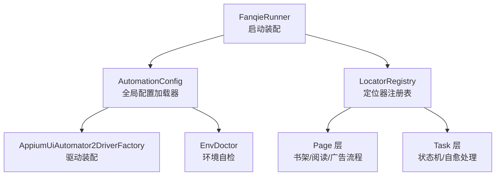
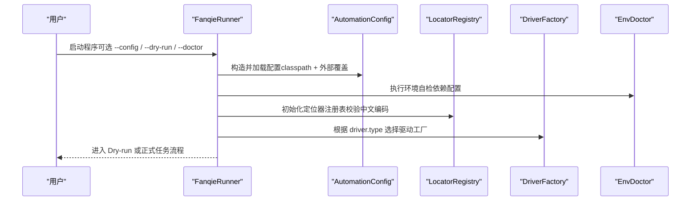
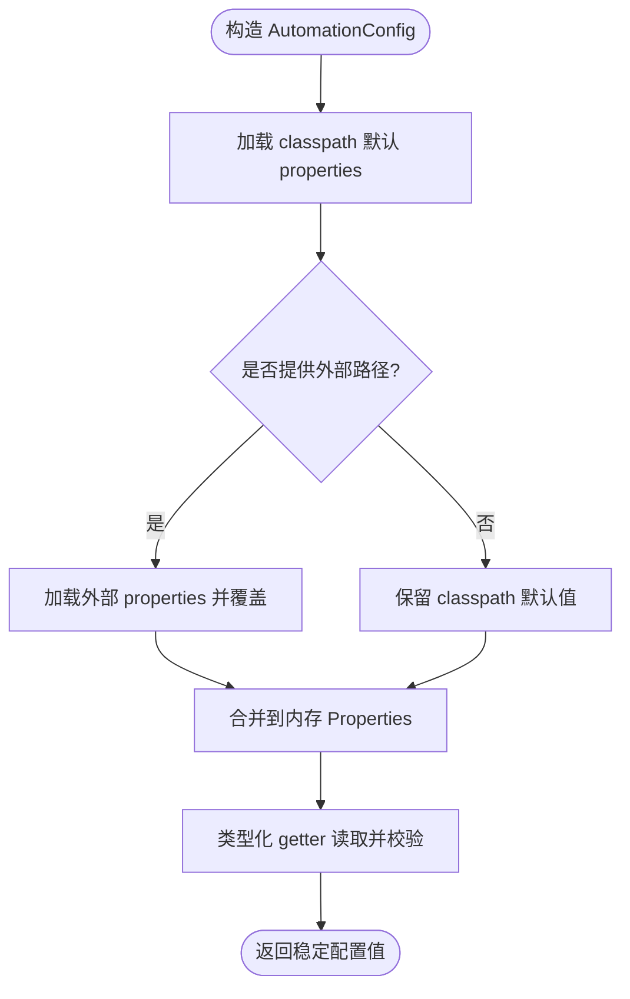
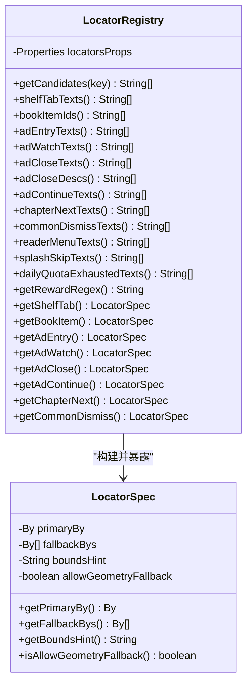
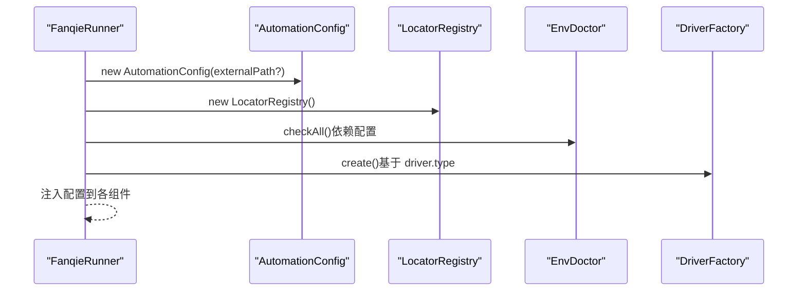
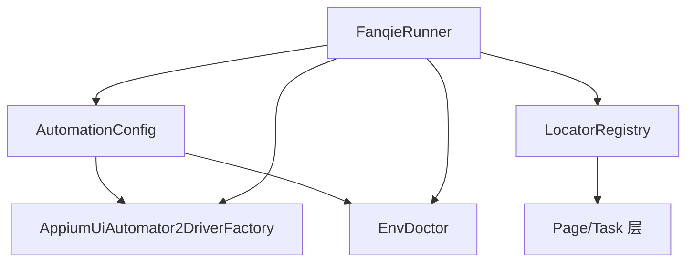

# 配置层设计

<cite>
**本文引用的文件**
- [AutomationConfig.java](file://automation/src/main/java/com/fanqie/auto/config/AutomationConfig.java)
- [LocatorRegistry.java](file://automation/src/main/java/com/fanqie/auto/config/LocatorRegistry.java)
- [FanqieRunner.java](file://automation/src/main/java/com/fanqie/auto/FanqieRunner.java)
- [AppiumUiAutomator2DriverFactory.java](file://automation/src/main/java/com/fanqie/auto/core/AppiumUiAutomator2DriverFactory.java)
- [EnvDoctor.java](file://automation/src/main/java/com/fanqie/auto/core/EnvDoctor.java)
- [ConfigTest.java](file://automation/src/test/java/com/fanqie/auto/config/ConfigTest.java)
- [README.md](file://automation/README.md)
</cite>

## 目录
1. [引言](#引言)
2. [项目结构](#项目结构)
3. [核心组件](#核心组件)
4. [架构总览](#架构总览)
5. [详细组件分析](#详细组件分析)
6. [依赖关系分析](#依赖关系分析)
7. [性能与稳定性考量](#性能与稳定性考量)
8. [故障排查指南](#故障排查指南)
9. [结论](#结论)
10. [附录：配置项清单与使用示例](#附录配置项清单与使用示例)

## 引言
本设计文档聚焦于自动化测试项目的“配置层”，围绕以下目标展开：
- 解释 AutomationConfig 如何统一管理应用配置参数（设备信息、超时设置、重试策略等）。
- 阐述 LocatorRegistry 的定位器注册机制，如何通过集中式管理 UI 元素定位规则提升可维护性。
- 说明配置加载优先级、动态覆盖机制与配置验证策略。
- 给出配置文件结构定义、环境变量支持方案以及多环境切换实现思路。
- 提供具体配置示例与使用模式，展示在不同场景下灵活使用配置系统的方法。

## 项目结构
配置层位于 automation 模块的 config 包中，由两个核心类组成：
- AutomationConfig：全局配置加载器，负责从 classpath 默认 properties 与外部 properties 合并加载，并提供类型安全的访问方法。
- LocatorRegistry：定位器注册表，集中管理 UI 控件的文本候选集、正则表达式与定位规格（含主定位器、备选定位器、区域提示与几何兜底开关）。

启动入口 FanqieRunner 在装配阶段按顺序创建并注入这些配置对象，驱动工厂与环境自检也依赖配置完成行为控制。

图表来源
- [FanqieRunner.java:89-121](file://automation/src/main/java/com/fanqie/auto/FanqieRunner.java#L89-L121)
- [AutomationConfig.java:25-42](file://automation/src/main/java/com/fanqie/auto/config/AutomationConfig.java#L25-L42)
- [LocatorRegistry.java:52-65](file://automation/src/main/java/com/fanqie/auto/config/LocatorRegistry.java#L52-L65)
- [AppiumUiAutomator2DriverFactory.java:130-155](file://automation/src/main/java/com/fanqie/auto/core/AppiumUiAutomator2DriverFactory.java#L130-L155)

章节来源
- [FanqieRunner.java:89-121](file://automation/src/main/java/com/fanqie/auto/FanqieRunner.java#L89-L121)
- [AutomationConfig.java:25-42](file://automation/src/main/java/com/fanqie/auto/config/AutomationConfig.java#L25-L42)
- [LocatorRegistry.java:52-65](file://automation/src/main/java/com/fanqie/auto/config/LocatorRegistry.java#L52-L65)

## 核心组件
- 全局配置加载器（AutomationConfig）
  - 职责：统一读取并暴露所有运行时可调参数；提供类型化 getter；对外部覆盖文件进行安全合并；对非法值回退到内置默认值。
  - 关键能力：classpath 默认加载、外部文件覆盖、UTF-8 编码安全读取、缺失键默认兜底。
- 定位器注册表（LocatorRegistry）
  - 职责：集中管理 UI 控件的识别规则（文案候选、正则、bounds 区域提示、是否允许几何兜底）。
  - 关键能力：UTF-8 安全读取 locators.properties；为每个逻辑控件构建 LocatorSpec（主定位器 + 备选列表 + 区域提示 + 几何兜底开关）。

章节来源
- [AutomationConfig.java:10-17](file://automation/src/main/java/com/fanqie/auto/config/AutomationConfig.java#L10-L17)
- [AutomationConfig.java:67-108](file://automation/src/main/java/com/fanqie/auto/config/AutomationConfig.java#L67-L108)
- [LocatorRegistry.java:16-25](file://automation/src/main/java/com/fanqie/auto/config/LocatorRegistry.java#L16-L25)
- [LocatorRegistry.java:260-298](file://automation/src/main/java/com/fanqie/auto/config/LocatorRegistry.java#L260-L298)

## 架构总览
配置层通过“集中式 + 类型安全”的方式，将运行期可调参数与 UI 定位规则解耦出业务代码，形成稳定的装配契约。启动时，Runner 先装配配置，再基于配置创建驱动与环境检查，随后将配置注入 Page/Task 层，保证全链路一致性与可观测性。

图表来源
- [FanqieRunner.java:89-121](file://automation/src/main/java/com/fanqie/auto/FanqieRunner.java#L89-L121)
- [AutomationConfig.java:25-42](file://automation/src/main/java/com/fanqie/auto/config/AutomationConfig.java#L25-L42)
- [LocatorRegistry.java:52-65](file://automation/src/main/java/com/fanqie/auto/config/LocatorRegistry.java#L52-L65)
- [AppiumUiAutomator2DriverFactory.java:130-155](file://automation/src/main/java/com/fanqie/auto/core/AppiumUiAutomator2DriverFactory.java#L130-L155)

## 详细组件分析

### AutomationConfig：全局配置加载器
- 设计要点
  - 双源加载：优先从 classpath 加载默认 properties，再以外部 properties 覆盖，确保“可插拔”的环境差异。
  - 类型安全：提供 getString/getInt/getLong/getDouble/getBoolean，内部对空值与非法值做防御性解析，失败时回退到默认值并输出告警。
  - 领域分组：按 Appium 配置、时序配置、流程配置、阅读页翻页策略、验证与调试等维度组织 getter，便于理解与维护。
  - 扩展点：driverType 预留未来驱动类型（如 harmony_hdc），上层零改动即可接入新实现。
- 加载优先级
  - 默认值（代码内） < classpath 默认 properties < 外部 properties（命令行 --config 指定）。
- 动态覆盖机制
  - 通过构造函数传入外部路径，即可在不修改代码的情况下覆盖任意配置项。
- 验证策略
  - 非数字/非法布尔值会记录警告并回退默认值，避免启动崩溃。
  - 缺失键直接返回默认值，保障健壮性。

图表来源
- [AutomationConfig.java:25-42](file://automation/src/main/java/com/fanqie/auto/config/AutomationConfig.java#L25-L42)
- [AutomationConfig.java:67-108](file://automation/src/main/java/com/fanqie/auto/config/AutomationConfig.java#L67-L108)

章节来源
- [AutomationConfig.java:25-42](file://automation/src/main/java/com/fanqie/auto/config/AutomationConfig.java#L25-L42)
- [AutomationConfig.java:67-108](file://automation/src/main/java/com/fanqie/auto/config/AutomationConfig.java#L67-L108)
- [AutomationConfig.java:112-178](file://automation/src/main/java/com/fanqie/auto/config/AutomationConfig.java#L112-L178)
- [AutomationConfig.java:182-287](file://automation/src/main/java/com/fanqie/auto/config/AutomationConfig.java#L182-L287)
- [AutomationConfig.java:291-304](file://automation/src/main/java/com/fanqie/auto/config/AutomationConfig.java#L291-L304)

### LocatorRegistry：定位器注册表
- 设计要点
  - 集中管理：所有 UI 控件的识别规则集中在 locators.properties，通过 getCandidates 等方法统一获取候选文案集合。
  - 定位规格（LocatorSpec）：每个逻辑控件包含 primaryBy（主定位器）、fallbackBys（备选定位器列表）、boundsHint（区域比例提示）、allowGeometryFallback（是否允许几何兜底）。
  - 安全约束：ad.watch 与 ad.continue 禁止几何兜底，防止误点浪费每日配额；ad.close 允许几何兜底，因为漏点导致卡死的代价更高。
  - 编码安全：强制使用 UTF-8 Reader 加载 properties，避免中文乱码导致的匹配失败。
- 典型控件
  - 书架 Tab、书籍条目、广告入口、观看广告按钮、关闭按钮、继续获取免费时长按钮、下一章按钮、通用关闭弹窗按钮等。
- 正则与识别
  - 奖励提取正则、阅读进度正则、短剧/小说内容识别正则等，用于页面状态判定与数据抽取。

图表来源
- [LocatorRegistry.java:26-65](file://automation/src/main/java/com/fanqie/auto/config/LocatorRegistry.java#L26-L65)
- [LocatorRegistry.java:95-148](file://automation/src/main/java/com/fanqie/auto/config/LocatorRegistry.java#L95-L148)
- [LocatorRegistry.java:152-256](file://automation/src/main/java/com/fanqie/auto/config/LocatorRegistry.java#L152-L256)
- [LocatorRegistry.java:260-298](file://automation/src/main/java/com/fanqie/auto/config/LocatorRegistry.java#L260-L298)

章节来源
- [LocatorRegistry.java:16-25](file://automation/src/main/java/com/fanqie/auto/config/LocatorRegistry.java#L16-L25)
- [LocatorRegistry.java:52-65](file://automation/src/main/java/com/fanqie/auto/config/LocatorRegistry.java#L52-L65)
- [LocatorRegistry.java:95-148](file://automation/src/main/java/com/fanqie/auto/config/LocatorRegistry.java#L95-L148)
- [LocatorRegistry.java:152-256](file://automation/src/main/java/com/fanqie/auto/config/LocatorRegistry.java#L152-L256)
- [LocatorRegistry.java:260-298](file://automation/src/main/java/com/fanqie/auto/config/LocatorRegistry.java#L260-L298)

### 配置加载与装配流程
- 启动装配
  - FanqieRunner 解析命令行参数（--config/--dry-run/--doctor 等），按需构造 AutomationConfig。
  - 初始化 LocatorRegistry 并打印候选集以核验中文编码。
  - 依据 driver.type 选择 DriverFactory，创建 Appium 会话。
  - 将配置注入 EnvDoctor、GestureSupport、StateDetector、WaitSupport、Page/Task 层。
- 环境变量支持
  - README 明确需要 ANDROID_HOME 与 PATH 配置，EnvDoctor 会检查 Android SDK 与 Appium Server 就绪情况。
  - 当前代码未直接读取系统环境变量作为配置项，但可通过外部 properties 或命令行参数间接影响行为。

图表来源
- [FanqieRunner.java:89-121](file://automation/src/main/java/com/fanqie/auto/FanqieRunner.java#L89-L121)
- [EnvDoctor.java:48-61](file://automation/src/main/java/com/fanqie/auto/core/EnvDoctor.java#L48-L61)
- [AppiumUiAutomator2DriverFactory.java:130-155](file://automation/src/main/java/com/fanqie/auto/core/AppiumUiAutomator2DriverFactory.java#L130-L155)

章节来源
- [FanqieRunner.java:89-121](file://automation/src/main/java/com/fanqie/auto/FanqieRunner.java#L89-L121)
- [README.md:170-213](file://automation/README.md#L170-L213)

## 依赖关系分析
- 耦合与内聚
  - AutomationConfig 与 LocatorRegistry 低耦合，分别关注“数值/开关配置”和“UI 定位规则”。
  - FanqieRunner 作为装配中心，将配置与定位器注入到后续组件，保持高内聚的职责划分。
- 外部依赖
  - Appium UiAutomator2 Driver：通过 DriverFactory 装配，受 AutomationConfig 中的平台名、自动化名称、超时、权限等配置影响。
  - 环境工具：adb/node/npm 等由 README 指导安装，EnvDoctor 负责检测。
- 循环依赖
  - 通过延迟注入（如 RecoveryHandler.setBookshelfPage）避免构造时的循环依赖。

图表来源
- [FanqieRunner.java:89-121](file://automation/src/main/java/com/fanqie/auto/FanqieRunner.java#L89-L121)
- [AppiumUiAutomator2DriverFactory.java:130-155](file://automation/src/main/java/com/fanqie/auto/core/AppiumUiAutomator2DriverFactory.java#L130-L155)
- [EnvDoctor.java:48-61](file://automation/src/main/java/com/fanqie/auto/core/EnvDoctor.java#L48-L61)

章节来源
- [FanqieRunner.java:89-121](file://automation/src/main/java/com/fanqie/auto/FanqieRunner.java#L89-L121)
- [AppiumUiAutomator2DriverFactory.java:130-155](file://automation/src/main/java/com/fanqie/auto/core/AppiumUiAutomator2DriverFactory.java#L130-L155)
- [EnvDoctor.java:48-61](file://automation/src/main/java/com/fanqie/auto/core/EnvDoctor.java#L48-L61)

## 性能与稳定性考量
- 超时与轮次
  - 通过 timing.* 配置项统一控制轮询间隔、状态检测超时、动作超时、应用启动超时、广告视频超时、最大停留时间、心跳间隔等，避免硬编码带来的不稳定。
- 重试与熔断
  - flow.* 配置项控制每轮翻页次数、广告轮次上限、总轮次、目标免费分钟数、墙钟时间预算（熔断保护）、连续错误阈值、恢复重试次数等，保障长任务稳定性。
- 定位鲁棒性
  - LocatorRegistry 为主定位器 + 备选定位器 + 区域提示 + 几何兜底的组合策略，兼顾准确率与容错率；对高风险操作（观看广告、继续领取）禁用几何兜底，降低误点风险。
- 驱动优化
  - 通过配置项调整 Appium 能力（如禁用 ID 自动补全、忽略隐藏 API 策略、抑制杀死 server 等），适配华为/鸿蒙设备特性，提升稳定性与性能。

章节来源
- [AutomationConfig.java:182-287](file://automation/src/main/java/com/fanqie/auto/config/AutomationConfig.java#L182-L287)
- [LocatorRegistry.java:152-256](file://automation/src/main/java/com/fanqie/auto/config/LocatorRegistry.java#L152-L256)
- [AppiumUiAutomator2DriverFactory.java:130-155](file://automation/src/main/java/com/fanqie/auto/core/AppiumUiAutomator2DriverFactory.java#L130-L155)

## 故障排查指南
- 中文乱码问题
  - 现象：locators.properties 中文候选集无法匹配。
  - 原因：Properties.load(InputStream) 默认 ISO-88-59-1 解码。
  - 解决：LocatorRegistry 使用 UTF-8 Reader 加载；启动时调用 dumpToConsole 打印候选集核验。
- 外部配置缺失或非法
  - 现象：外部 properties 不存在或某项值为非法类型。
  - 行为：AutomationConfig 记录警告并回退到默认值，不抛异常。
  - 建议：使用 ConfigTest 的思路编写单测，覆盖缺项与非法值场景。
- 环境未就绪
  - 现象：EnvDoctor 检查失败（ANDROID_HOME、adb、Appium Server、应用安装等）。
  - 解决：按 README 安装并配置环境，重新运行 --doctor 模式。
- 误点广告导致配额消耗
  - 现象：观看广告或继续领取按钮被误点击。
  - 原因：几何兜底开启导致误判。
  - 解决：ad.watch/ad.continue 禁用几何兜底；仅 ad.close 允许几何兜底。

章节来源
- [LocatorRegistry.java:67-81](file://automation/src/main/java/com/fanqie/auto/config/LocatorRegistry.java#L67-L81)
- [LocatorRegistry.java:186-233](file://automation/src/main/java/com/fanqie/auto/config/LocatorRegistry.java#L186-L233)
- [AutomationConfig.java:57-63](file://automation/src/main/java/com/fanqie/auto/config/AutomationConfig.java#L57-L63)
- [ConfigTest.java:60-81](file://automation/src/test/java/com/fanqie/auto/config/ConfigTest.java#L60-L81)
- [README.md:170-213](file://automation/README.md#L170-L213)

## 结论
配置层通过 AutomationConfig 与 LocatorRegistry 的协同，实现了“参数集中化、规则外置化、加载安全化、覆盖灵活化”的目标。配合 FanqieRunner 的装配流程与环境自检，系统在多设备、多环境下具备良好的一致性与可维护性。通过合理的超时、重试与熔断策略，以及严格的定位器约束，显著提升了长任务的稳定性与成功率。

## 附录：配置项清单与使用示例

### 配置项分类与用途
- Appium 配置
  - appium.server.url：Appium 服务地址。
  - appium.platform.name：平台名称（Android/iOS）。
  - appium.automation.name：自动化引擎（UiAutomator2 等）。
  - appium.device.udid：设备序列号（留空则自动选择）。
  - appium.app.package：应用包名。
  - appium.no.reset：是否不清除应用数据（保留登录态）。
  - appium.new.command.timeout.sec：命令超时秒数。
  - appium.uia2.server.launch.timeout.ms：UiAutomator2 Server 启动超时。
  - appium.uia2.server.install.timeout.ms：UiAutomator2 Server 安装超时。
  - appium.skip.server.installation：跳过服务器安装。
  - appium.skip.device.initialization：跳过设备初始化。
  - appium.keep.screen.on：保持屏幕常亮。
- 驱动类型
  - driver.type：驱动类型（uiautomator2/harmony_hdc 等）。
- 时序配置
  - timing.poll.interval.ms：轮询间隔。
  - timing.state.detect.timeout.ms：状态检测超时。
  - timing.action.timeout.ms：动作超时。
  - timing.app.launch.timeout.ms：应用启动超时。
  - timing.ad.video.timeout.ms：广告视频超时。
  - timing.ad.close.ready.timeout.ms：广告关闭就绪超时。
  - timing.max.state.dwell.ms：最大状态停留时间。
  - timing.heartbeat.interval.sec：心跳间隔。
- 流程配置
  - flow.pages.per.cycle：每轮翻页次数。
  - flow.max.ad.rounds.per.entry：每次进入的最大广告轮次。
  - flow.max.total.ad.rounds：总广告轮次上限。
  - flow.target.free.minutes：目标免费分钟数。
  - flow.reward.fallback.minutes：奖励兜底估值（分钟）。
  - flow.max.wall.clock.ms：墙钟时间预算（毫秒，熔断保护）。
  - flow.outer.cycles：外层循环次数。
  - flow.max.consecutive.errors：最大连续错误次数。
  - flow.max.recovery.retry：最大恢复重试次数。
- 阅读页翻页策略
  - reader.turn.strategy：翻页策略（tap/swipe）。
  - reader.next.tap.ratio.x/y：下一页点击比例。
  - reader.prev.tap.ratio.x：上一页点击比例。
  - reader.swipe.percent：滑动百分比。
  - reader.swipe.duration.ms：滑动持续时间。
- 验证与调试
  - verify.page.turned.by.screenshot：截图验证翻页。
  - runtime.dry.run：干跑模式（只探测不点击）。

### 环境变量与多环境切换
- 环境变量
  - ANDROID_HOME：指向 Android SDK 根目录（platform-tools 的父目录）。
  - PATH：包含 node、npm、platform-tools 的路径。
- 多环境切换
  - 使用 --config 指定外部 properties 文件，覆盖 classpath 默认值。
  - 不同环境（开发/测试/生产）准备各自的 properties 文件，通过命令行参数切换。
  - 结合 README 的环境安装步骤，确保各环境工具链一致。

### 使用模式示例
- 默认模式
  - 直接运行，使用 classpath 默认 properties。
- 外部覆盖模式
  - 运行 --config path/to/override.properties，覆盖任意配置项。
- 干跑模式
  - 运行 --dry-run，仅连接 Appium 并抓取 UI 快照，不执行点击。
- 环境自检模式
  - 运行 --doctor，仅执行环境检查，不创建 session。

章节来源
- [AutomationConfig.java:112-178](file://automation/src/main/java/com/fanqie/auto/config/AutomationConfig.java#L112-L178)
- [AutomationConfig.java:182-287](file://automation/src/main/java/com/fanqie/auto/config/AutomationConfig.java#L182-L287)
- [AutomationConfig.java:291-304](file://automation/src/main/java/com/fanqie/auto/config/AutomationConfig.java#L291-L304)
- [FanqieRunner.java:48-94](file://automation/src/main/java/com/fanqie/auto/FanqieRunner.java#L48-L94)
- [README.md:170-213](file://automation/README.md#L170-L213)