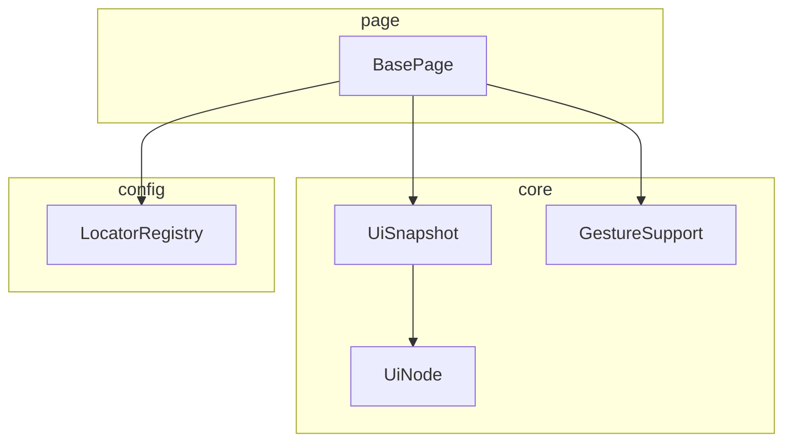
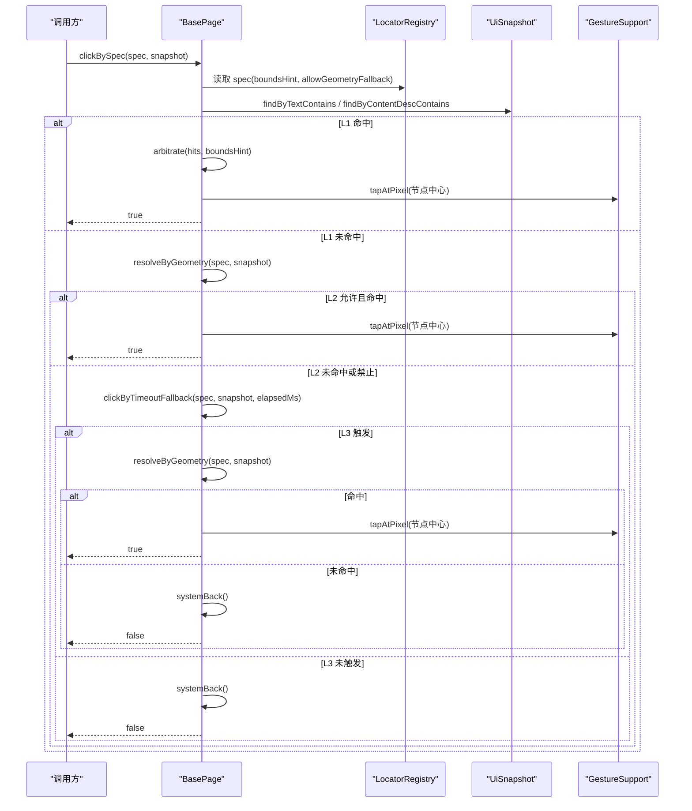
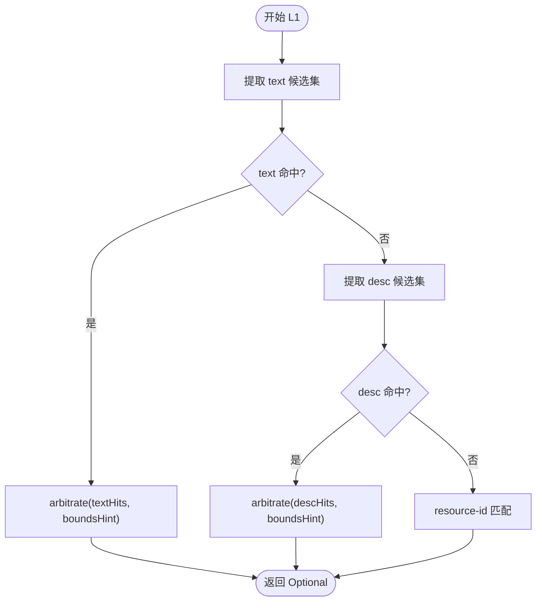
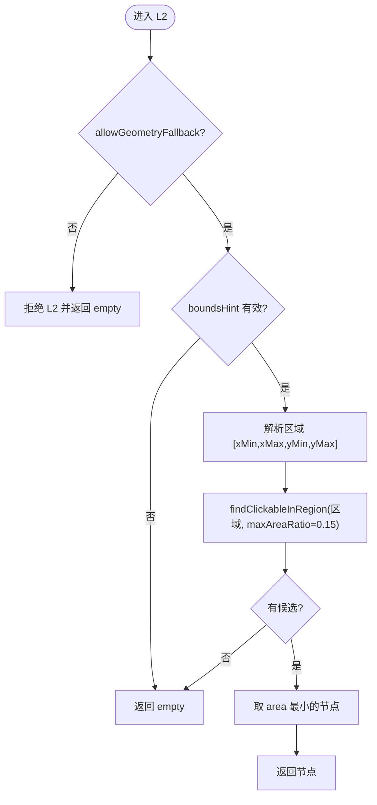
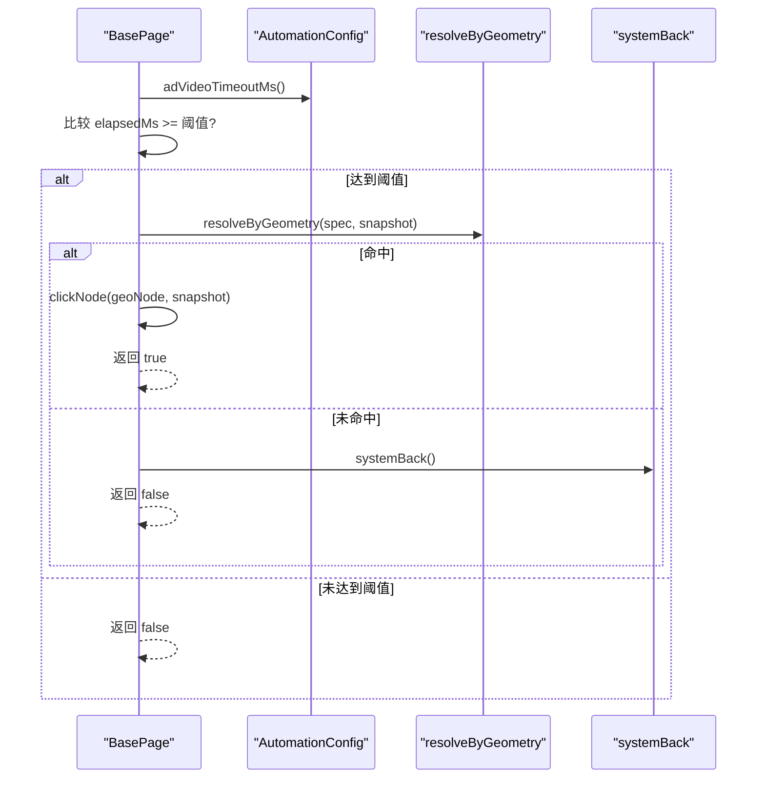
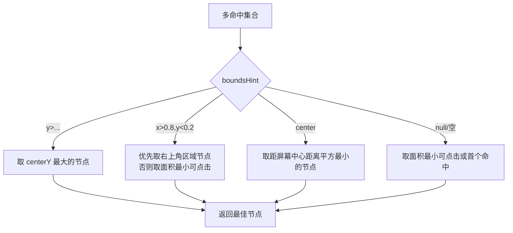
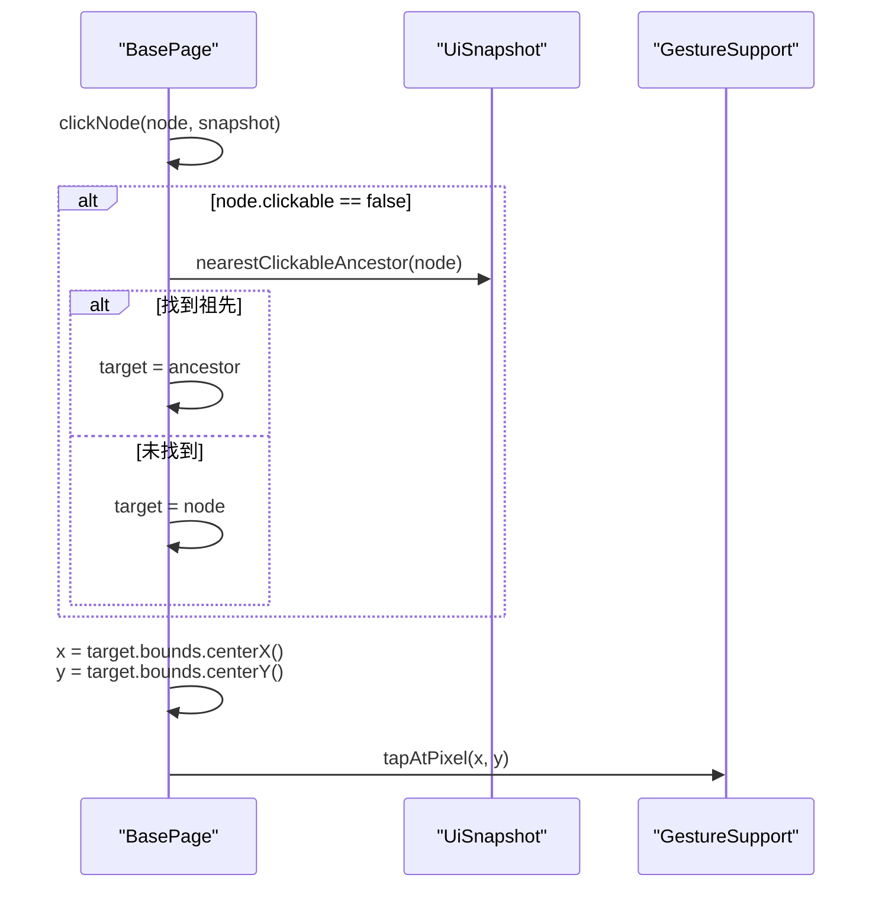
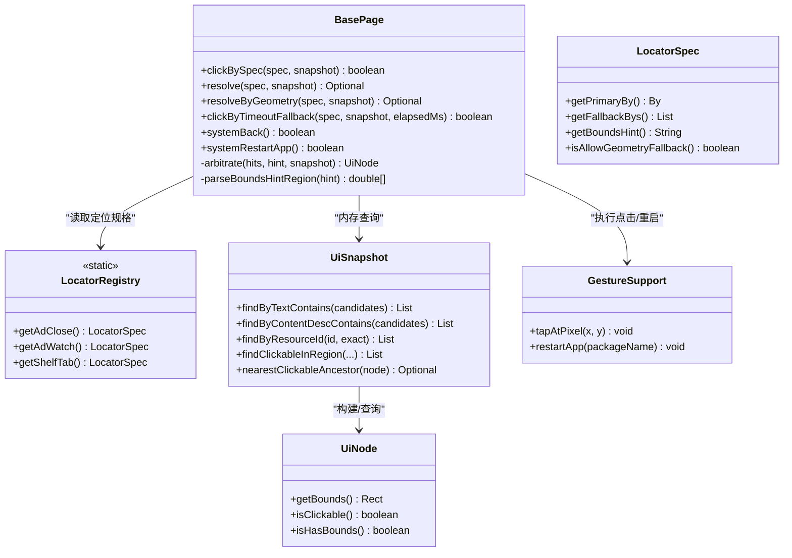

# BasePage基类设计

<cite>
**本文引用的文件**
- [BasePage.java](file://automation/src/main/java/com/fanqie/auto/page/BasePage.java)
- [UiNode.java](file://automation/src/main/java/com/fanqie/auto/core/UiNode.java)
- [UiSnapshot.java](file://automation/src/main/java/com/fanqie/auto/core/UiSnapshot.java)
- [GestureSupport.java](file://automation/src/main/java/com/fanqie/auto/core/GestureSupport.java)
- [LocatorRegistry.java](file://automation/src/main/java/com/fanqie/auto/config/LocatorRegistry.java)
- [BasePageTest.java](file://automation/src/test/java/com/fanqie/auto/page/BasePageTest.java)
- [TestFixtures.java](file://automation/src/test/java/com/fanqie/auto/TestFixtures.java)
</cite>

## 目录
1. [引言](#引言)
2. [项目结构](#项目结构)
3. [核心组件](#核心组件)
4. [架构总览](#架构总览)
5. [详细组件分析](#详细组件分析)
6. [依赖关系分析](#依赖关系分析)
7. [性能考量](#性能考量)
8. [故障排查指南](#故障排查指南)
9. [结论](#结论)
10. [附录：扩展指南](#附录：扩展指南)

## 引言
本文件围绕 BasePage 基类的四级降级定位策略进行系统化文档化，重点解释 L1 语义属性匹配（text→content-desc→resource-id 三通道）、L2 结构化几何推断、L3 时序兜底与 L4 系统兜底的完整算法逻辑；阐述 boundsHint 裁决机制、误点防护策略与坐标计算原理；并说明 clickNode 的节点回溯、可点击祖先查找与像素级点击实现。最后提供扩展指南，指导如何新增定位策略与区域裁决规则。

## 项目结构
BasePage 位于 page 包，作为页面对象基类承载四级定位链；其依赖 core 层的 UiSnapshot（UI 树快照与查询）、UiNode（节点数据与几何能力）与 GestureSupport（手势执行），并通过 config 层的 LocatorRegistry 获取控件的定位规格（primaryBy、fallbackBys、boundsHint、allowGeometryFallback）。测试层通过离线夹具验证 L1/L2 行为。

图表来源
- [BasePage.java:18-39](file://automation/src/main/java/com/fanqie/auto/page/BasePage.java#L18-L39)
- [UiSnapshot.java:21-35](file://automation/src/main/java/com/fanqie/auto/core/UiSnapshot.java#L21-L35)
- [UiNode.java:3-12](file://automation/src/main/java/com/fanqie/auto/core/UiNode.java#L3-L12)
- [GestureSupport.java:12-25](file://automation/src/main/java/com/fanqie/auto/core/GestureSupport.java#L12-L25)
- [LocatorRegistry.java:16-25](file://automation/src/main/java/com/fanqie/auto/config/LocatorRegistry.java#L16-L25)

章节来源
- [BasePage.java:18-39](file://automation/src/main/java/com/fanqie/auto/page/BasePage.java#L18-L39)
- [UiSnapshot.java:21-35](file://automation/src/main/java/com/fanqie/auto/core/UiSnapshot.java#L21-L35)
- [UiNode.java:3-12](file://automation/src/main/java/com/fanqie/auto/core/UiNode.java#L3-L12)
- [GestureSupport.java:12-25](file://automation/src/main/java/com/fanqie/auto/core/GestureSupport.java#L12-L25)
- [LocatorRegistry.java:16-25](file://automation/src/main/java/com/fanqie/auto/config/LocatorRegistry.java#L16-L25)

## 核心组件
- BasePage：封装四级定位链入口与裁决逻辑，统一对外暴露 clickBySpec、resolve、resolveByGeometry、clickByTimeoutFallback、systemBack/systemRestartApp 等方法。
- LocatorRegistry.LocatorSpec：描述单个控件的定位策略（主定位器、备选定位器、boundsHint、是否允许几何兜底）。
- UiSnapshot：一次 UI 树快照的内存表示，提供 text/desc/id 匹配、区域内可点击节点筛选、正则提取、最近可点击祖先回溯等纯内存查询。
- UiNode.Rect：矩形几何工具，提供中心点、面积、面积占比、比例区域包含判断等。
- GestureSupport：基于屏幕尺寸的比例/像素点击与滑动、应用生命周期操作。

章节来源
- [BasePage.java:40-68](file://automation/src/main/java/com/fanqie/auto/page/BasePage.java#L40-L68)
- [LocatorRegistry.java:260-298](file://automation/src/main/java/com/fanqie/auto/config/LocatorRegistry.java#L260-L298)
- [UiSnapshot.java:131-254](file://automation/src/main/java/com/fanqie/auto/core/UiSnapshot.java#L131-L254)
- [UiNode.java:85-216](file://automation/src/main/java/com/fanqie/auto/core/UiNode.java#L85-L216)
- [GestureSupport.java:99-123](file://automation/src/main/java/com/fanqie/auto/core/GestureSupport.java#L99-L123)

## 架构总览
BasePage 的四级定位链以“先语义后几何、先精确后兜底”为原则，结合 boundsHint 裁决与误点防护标志，确保在动态 UI 树中稳定命中目标控件。

图表来源
- [BasePage.java:75-250](file://automation/src/main/java/com/fanqie/auto/page/BasePage.java#L75-L250)
- [UiSnapshot.java:131-200](file://automation/src/main/java/com/fanqie/auto/core/UiSnapshot.java#L131-L200)
- [GestureSupport.java:106-123](file://automation/src/main/java/com/fanqie/auto/core/GestureSupport.java#L106-L123)
- [LocatorRegistry.java:260-298](file://automation/src/main/java/com/fanqie/auto/config/LocatorRegistry.java#L260-L298)

## 详细组件分析

### L1 语义属性匹配（text→content-desc→resource-id 三通道）
- 文本候选集提取：从 LocatorSpec 的 primaryBy/fallbackBys 的 XPath 字符串中提取 contains(@text,'...') 或 @text='...' 的关键词，形成候选列表。
- 第一通道：按候选集对 UiSnapshot.findByTextContains 进行包含匹配，命中则进入裁决。
- 第二通道：若第一通道未命中，则从 XPath 提取 content-desc 候选集，使用 findByContentDescContains 匹配。
- 第三通道：resource-id 通道主要用于明确 id 的场景（如书架条目），通过 findByResourceId 支持精确/包含匹配。
- 多命中裁决：当多个节点命中时，依据 boundsHint 选择最佳节点。

图表来源
- [BasePage.java:103-137](file://automation/src/main/java/com/fanqie/auto/page/BasePage.java#L103-L137)
- [BasePage.java:436-514](file://automation/src/main/java/com/fanqie/auto/page/BasePage.java#L436-L514)
- [UiSnapshot.java:137-178](file://automation/src/main/java/com/fanqie/auto/core/UiSnapshot.java#L137-L178)

章节来源
- [BasePage.java:103-137](file://automation/src/main/java/com/fanqie/auto/page/BasePage.java#L103-L137)
- [BasePage.java:436-514](file://automation/src/main/java/com/fanqie/auto/page/BasePage.java#L436-L514)
- [UiSnapshot.java:137-178](file://automation/src/main/java/com/fanqie/auto/core/UiSnapshot.java#L137-L178)

### L2 结构化几何推断
- 误点防护：必须先检查 spec.isAllowGeometryFallback()，仅当为 true 时才允许 L2。adWatch/adContinue 必须为 false，避免误点浪费用户配额。
- 区域解析：根据 boundsHint 解析出比例区域（如右上角 x>0.8,y<0.2），无区域限制时不执行 L2。
- 候选筛选：在指定区域内查找 clickable=true、hasBounds、areaRatio ≤ 0.15 的节点，取面积最小者（更具体的控件优先）。
- 结果：返回可选节点，供后续点击或时序兜底使用。

图表来源
- [BasePage.java:140-189](file://automation/src/main/java/com/fanqie/auto/page/BasePage.java#L140-L189)
- [BasePage.java:408-434](file://automation/src/main/java/com/fanqie/auto/page/BasePage.java#L408-L434)
- [UiSnapshot.java:180-200](file://automation/src/main/java/com/fanqie/auto/core/UiSnapshot.java#L180-L200)
- [UiNode.java:165-197](file://automation/src/main/java/com/fanqie/auto/core/UiNode.java#L165-L197)

章节来源
- [BasePage.java:140-189](file://automation/src/main/java/com/fanqie/auto/page/BasePage.java#L140-L189)
- [BasePage.java:408-434](file://automation/src/main/java/com/fanqie/auto/page/BasePage.java#L408-L434)
- [UiSnapshot.java:180-200](file://automation/src/main/java/com/fanqie/auto/core/UiSnapshot.java#L180-L200)
- [UiNode.java:165-197](file://automation/src/main/java/com/fanqie/auto/core/UiNode.java#L165-L197)

### L3 时序兜底
- 触发条件：当 elapsedMs ≥ config.adVideoTimeoutMs() 时触发，用于激励视频场景（通常约 30 秒后关闭按钮出现）。
- 执行逻辑：本质强制执行 L2 几何推断，同样受 allowGeometryFallback 约束；命中则点击，否则降级到 L4。
- 日志与回退：记录触发信息，失败时输出警告并继续 L4。

图表来源
- [BasePage.java:191-219](file://automation/src/main/java/com/fanqie/auto/page/BasePage.java#L191-L219)
- [BasePage.java:221-236](file://automation/src/main/java/com/fanqie/auto/page/BasePage.java#L221-L236)

章节来源
- [BasePage.java:191-219](file://automation/src/main/java/com/fanqie/auto/page/BasePage.java#L191-L219)
- [BasePage.java:221-236](file://automation/src/main/java/com/fanqie/auto/page/BasePage.java#L221-L236)

### L4 系统兜底
- navigate().back()：尝试系统返回，异常时记录错误并返回 false。
- restartApp：终极手段，终止并重启 App，使状态机回到锚点重新进入。

章节来源
- [BasePage.java:221-250](file://automation/src/main/java/com/fanqie/auto/page/BasePage.java#L221-L250)
- [GestureSupport.java:182-226](file://automation/src/main/java/com/fanqie/auto/core/GestureSupport.java#L182-L226)

### boundsHint 裁决机制
- 底部裁决（y>0.8/y>0.9）：取 y 最大者，适合底部广告入口或底部 Tab。
- 右上角裁决（x>0.8,y<0.2）：优先取 centerX > 0.8W 且 centerY < 0.2H 的节点，适合广告关闭按钮；若无严格命中，回退到面积最小的可点击节点。
- 居中裁决（center）：取最接近屏幕中心的节点，适合弹窗按钮。
- 无区域限制：取面积最小的可点击节点或第一个命中。

图表来源
- [BasePage.java:338-406](file://automation/src/main/java/com/fanqie/auto/page/BasePage.java#L338-L406)

章节来源
- [BasePage.java:338-406](file://automation/src/main/java/com/fanqie/auto/page/BasePage.java#L338-L406)

### 误点防护策略
- 关键标志：spec.isAllowGeometryFallback() 控制是否允许 L2 几何兜底。
- 业务约束：adWatch 与 adContinue 必须禁用几何兜底，防止误点导致多看一轮视频、浪费每日配额；adClose 允许几何兜底，因为漏点的代价大于误点。
- 测试覆盖：通过 BasePageTest 验证误点防护生效。

章节来源
- [LocatorRegistry.java:186-233](file://automation/src/main/java/com/fanqie/auto/config/LocatorRegistry.java#L186-L233)
- [BasePage.java:140-155](file://automation/src/main/java/com/fanqie/auto/page/BasePage.java#L140-L155)
- [BasePageTest.java:49-78](file://automation/src/test/java/com/fanqie/auto/page/BasePageTest.java#L49-L78)

### 坐标计算原理与 clickNode
- 节点回溯：若命中节点自身不可点击，通过 UiSnapshot.nearestClickableAncestor 回溯至最近的 clickable=true 祖先；找不到则使用自身 bounds 中心（点击事件向上传递）。
- 像素级点击：取目标节点的 bounds 中心坐标 (centerX, centerY)，调用 GestureSupport.tapAtPixel 执行 mobile: clickGesture。
- 优势：坐标由实时 UI 树 bounds 推算，非硬编码；规避自绘控件无属性问题；天然免疫 stale element。

图表来源
- [BasePage.java:300-336](file://automation/src/main/java/com/fanqie/auto/page/BasePage.java#L300-L336)
- [UiSnapshot.java:230-254](file://automation/src/main/java/com/fanqie/auto/core/UiSnapshot.java#L230-L254)
- [GestureSupport.java:113-123](file://automation/src/main/java/com/fanqie/auto/core/GestureSupport.java#L113-L123)

章节来源
- [BasePage.java:300-336](file://automation/src/main/java/com/fanqie/auto/page/BasePage.java#L300-L336)
- [UiSnapshot.java:230-254](file://automation/src/main/java/com/fanqie/auto/core/UiSnapshot.java#L230-L254)
- [GestureSupport.java:113-123](file://automation/src/main/java/com/fanqie/auto/core/GestureSupport.java#L113-L123)

### 数据结构与复杂度
- UiSnapshot 查询均为流式过滤，时间复杂度 O(N)（N 为节点数），空间复杂度 O(K)（K 为命中节点数）。
- L1 三通道顺序执行，最坏情况三次线性扫描；可通过优化候选集减少扫描次数。
- L2 区域筛选额外包含 areaRatio 过滤，常数开销较小。
- 裁决阶段使用 stream 排序/比较，时间复杂度 O(M log M) 或 O(M)（取决于具体选择策略，M 为命中数量）。

章节来源
- [UiSnapshot.java:131-200](file://automation/src/main/java/com/fanqie/auto/core/UiSnapshot.java#L131-L200)
- [BasePage.java:338-406](file://automation/src/main/java/com/fanqie/auto/page/BasePage.java#L338-L406)

## 依赖关系分析
- BasePage 依赖 LocatorRegistry 获取控件定位规格（primaryBy、fallbackBys、boundsHint、allowGeometryFallback）。
- BasePage 依赖 UiSnapshot 进行纯内存查询（text/desc/id 匹配、区域筛选、祖先回溯）。
- BasePage 依赖 GestureSupport 执行像素级点击与应用生命周期操作。
- UiNode.Rect 提供几何计算能力，被 UiSnapshot 与 BasePage 共同使用。

图表来源
- [BasePage.java:40-68](file://automation/src/main/java/com/fanqie/auto/page/BasePage.java#L40-L68)
- [LocatorRegistry.java:260-298](file://automation/src/main/java/com/fanqie/auto/config/LocatorRegistry.java#L260-L298)
- [UiSnapshot.java:131-254](file://automation/src/main/java/com/fanqie/auto/core/UiSnapshot.java#L131-L254)
- [UiNode.java:50-72](file://automation/src/main/java/com/fanqie/auto/core/UiNode.java#L50-L72)
- [GestureSupport.java:113-123](file://automation/src/main/java/com/fanqie/auto/core/GestureSupport.java#L113-L123)

章节来源
- [BasePage.java:40-68](file://automation/src/main/java/com/fanqie/auto/page/BasePage.java#L40-L68)
- [LocatorRegistry.java:260-298](file://automation/src/main/java/com/fanqie/auto/config/LocatorRegistry.java#L260-L298)
- [UiSnapshot.java:131-254](file://automation/src/main/java/com/fanqie/auto/core/UiSnapshot.java#L131-L254)
- [UiNode.java:50-72](file://automation/src/main/java/com/fanqie/auto/core/UiNode.java#L50-L72)
- [GestureSupport.java:113-123](file://automation/src/main/java/com/fanqie/auto/core/GestureSupport.java#L113-L123)

## 性能考量
- 快照复用：同一 tick 内 UiSnapshot 缓存复用，杜绝重复抓取，显著降低 RPC 开销。
- 纯内存查询：所有匹配与筛选均在内存中进行，零额外 RPC。
- 屏幕尺寸缓存：GestureSupport 缓存屏幕尺寸，避免频繁获取窗口大小。
- 建议：合理设置 maxAreaRatio 与 boundsHint 区域，减少候选集规模；必要时对候选文案进行去重与优先级排序。

[本节为通用性能讨论，不直接分析具体文件]

## 故障排查指南
- 快照为空或解析失败：resolve 会直接返回 empty，需检查设备端 XML 是否截断或畸形。
- 几何兜底被禁止：若 allowGeometryFallback=false，L2 将跳过，需确认配置是否正确。
- 区域解析失败：boundsHint 无法识别时将跳过 L2，需检查 hints 格式。
- 点击无效：检查节点是否有有效 bounds；若无，确认是否成功回溯到可点击祖先。
- 系统兜底失败：navigate().back() 可能因页面栈为空而失败，考虑重启 App。

章节来源
- [BasePage.java:103-137](file://automation/src/main/java/com/fanqie/auto/page/BasePage.java#L103-L137)
- [BasePage.java:140-189](file://automation/src/main/java/com/fanqie/auto/page/BasePage.java#L140-L189)
- [BasePage.java:221-250](file://automation/src/main/java/com/fanqie/auto/page/BasePage.java#L221-L250)
- [UiSnapshot.java:52-72](file://automation/src/main/java/com/fanqie/auto/core/UiSnapshot.java#L52-L72)

## 结论
BasePage 通过四级降级定位链实现了高鲁棒性的控件定位与点击能力：L1 语义匹配优先保证准确性，L2 几何推断在语义缺失时提供结构化兜底，L3 时序兜底应对延迟出现的控件，L4 系统兜底保障最终恢复。boundsHint 裁决与误点防护标志进一步提升了稳定性与安全性。配合 UiSnapshot 的纯内存查询与 GestureSupport 的比例坐标点击，整体方案满足动态 UI 树的自动化需求。

[本节为总结性内容，不直接分析具体文件]

## 附录：扩展指南

### 添加新的定位策略
- 在 LocatorRegistry 中定义新的 LocatorSpec：
  - 设置 primaryBy 与 fallbackBys（XPath 或 id）。
  - 配置 boundsHint（如 "y>0.8"、"x>0.8,y<0.2"、"center"）。
  - 谨慎设置 allowGeometryFallback：涉及消耗用户配额的按钮应设为 false。
- 在 BasePage 中无需修改四级链逻辑，新 spec 可直接用于 clickBySpec。

章节来源
- [LocatorRegistry.java:150-256](file://automation/src/main/java/com/fanqie/auto/config/LocatorRegistry.java#L150-L256)
- [BasePage.java:75-91](file://automation/src/main/java/com/fanqie/auto/page/BasePage.java#L75-L91)

### 添加新的区域裁决规则
- 在 BasePage.arbitrate 中增加新的 boundsHint 分支：
  - 例如新增 "left-top" 或 "bottom-left" 等区域语义。
  - 实现相应的筛选逻辑（如取特定区域的节点或距离度量）。
- 在 parseBoundsHintRegion 中增加对应的区域解析，以便 L2 使用。

章节来源
- [BasePage.java:338-406](file://automation/src/main/java/com/fanqie/auto/page/BasePage.java#L338-L406)
- [BasePage.java:408-434](file://automation/src/main/java/com/fanqie/auto/page/BasePage.java#L408-L434)

### 调整误点防护策略
- 对于高风险按钮（如观看广告、继续获取时长），务必设置 allowGeometryFallback=false。
- 对于低风险按钮（如关闭广告），可设置 allowGeometryFallback=true 以提升成功率。
- 通过单元测试验证防护策略生效。

章节来源
- [LocatorRegistry.java:186-233](file://automation/src/main/java/com/fanqie/auto/config/LocatorRegistry.java#L186-L233)
- [BasePageTest.java:49-78](file://automation/src/test/java/com/fanqie/auto/page/BasePageTest.java#L49-L78)

### 自定义点击行为
- 如需自定义点击位置（非中心点），可在 BasePage 中扩展 clickNode 或新增方法，传入偏移参数。
- 保持坐标由 bounds 推算的原则，避免硬编码像素。

章节来源
- [BasePage.java:300-336](file://automation/src/main/java/com/fanqie/auto/page/BasePage.java#L300-L336)
- [GestureSupport.java:113-123](file://automation/src/main/java/com/fanqie/auto/core/GestureSupport.java#L113-L123)