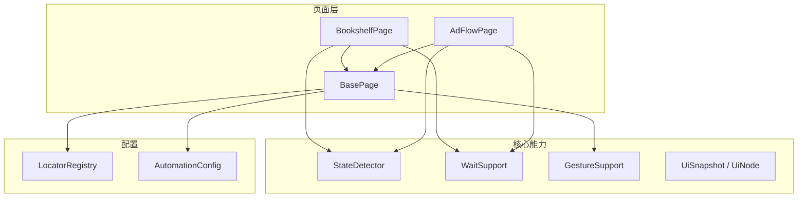
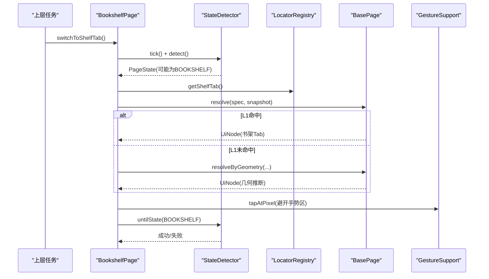
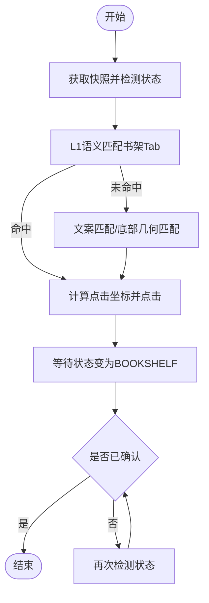
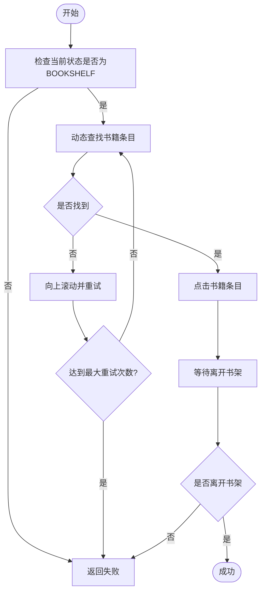
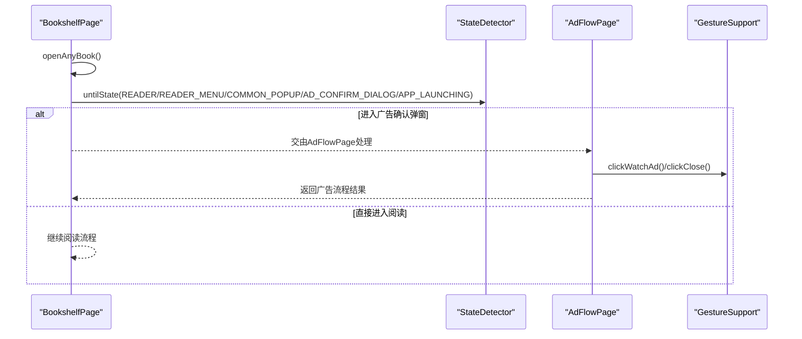
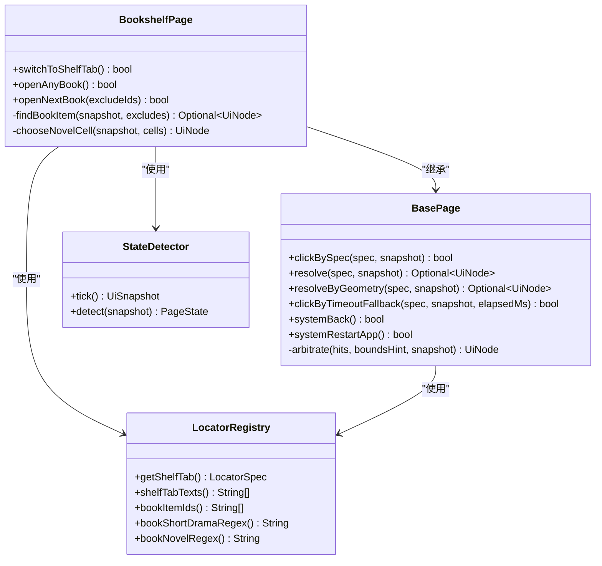
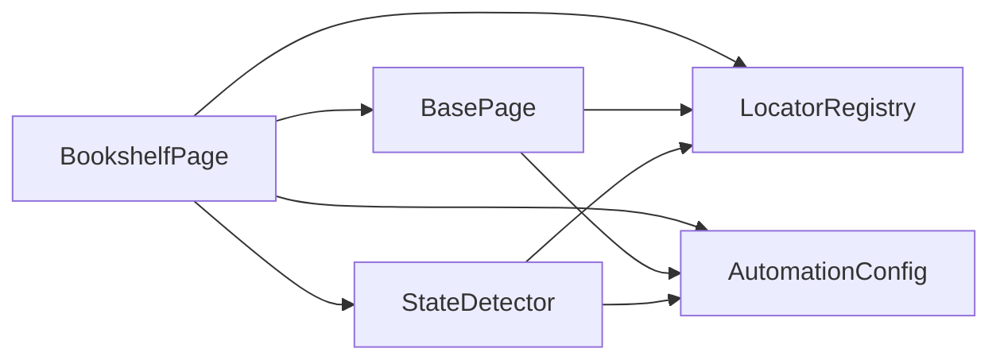

# 书架页面实现

<cite>
**本文引用的文件**
- [BookshelfPage.java](file://automation/src/main/java/com/fanqie/auto/page/BookshelfPage.java)
- [BasePage.java](file://automation/src/main/java/com/fanqie/auto/page/BasePage.java)
- [StateDetector.java](file://automation/src/main/java/com/fanqie/auto/core/StateDetector.java)
- [LocatorRegistry.java](file://automation/src/main/java/com/fanqie/auto/config/LocatorRegistry.java)
- [AutomationConfig.java](file://automation/src/main/java/com/fanqie/auto/config/AutomationConfig.java)
- [AdFlowPage.java](file://automation/src/main/java/com/fanqie/auto/page/AdFlowPage.java)
- [RecoveryHandler.java](file://automation/src/main/java/com/fanqie/auto/task/RecoveryHandler.java)
- [bookshelf.xml](file://automation/src/test/resources/fixtures/bookshelf.xml)
- [two_shelf_tabs.xml](file://automation/src/test/resources/fixtures/two_shelf_tabs.xml)
</cite>

## 目录
1. [简介](#简介)
2. [项目结构](#项目结构)
3. [核心组件](#核心组件)
4. [架构总览](#架构总览)
5. [详细组件分析](#详细组件分析)
6. [依赖关系分析](#依赖关系分析)
7. [性能考量](#性能考量)
8. [故障排查指南](#故障排查指南)
9. [结论](#结论)
10. [附录：扩展开发指南](#附录扩展开发指南)

## 简介
本文件围绕书架页面对象 BookshelfPage 的落地实现，系统阐述其继承 BasePage 后的业务封装与工程化设计。重点覆盖：
- 书架 Tab 切换、状态检测与确认
- 书籍条目动态定位与打开（含短剧/视频卡片过滤）
- 广告入口识别与跨页面交互
- UI 元素定位策略（四级降级链与几何兜底）
- 页面跳转处理与异常恢复机制
- 配置项、操作方法与扩展方式

## 项目结构
本项目采用分层+按职责组织：
- page：页面对象封装（BasePage、BookshelfPage、AdFlowPage、ReaderPage）
- core：通用能力（状态检测 StateDetector、等待 WaitSupport、手势 GestureSupport、快照 UiSnapshot、节点 UiNode）
- config：定位器注册表 LocatorRegistry、全局配置 AutomationConfig
- task：任务编排与恢复（RecoveryHandler、AdWatchStateMachine 等）

图表来源
- [BookshelfPage.java:36-55](file://automation/src/main/java/com/fanqie/auto/page/BookshelfPage.java#L36-L55)
- [BasePage.java:40-68](file://automation/src/main/java/com/fanqie/auto/page/BasePage.java#L40-L68)
- [StateDetector.java:29-54](file://automation/src/main/java/com/fanqie/auto/core/StateDetector.java#L29-L54)
- [LocatorRegistry.java:26-65](file://automation/src/main/java/com/fanqie/auto/config/LocatorRegistry.java#L26-L65)
- [AutomationConfig.java:18-28](file://automation/src/main/java/com/fanqie/auto/config/AutomationConfig.java#L18-L28)

章节来源
- [BookshelfPage.java:36-55](file://automation/src/main/java/com/fanqie/auto/page/BookshelfPage.java#L36-L55)
- [BasePage.java:40-68](file://automation/src/main/java/com/fanqie/auto/page/BasePage.java#L40-L68)
- [StateDetector.java:29-54](file://automation/src/main/java/com/fanqie/auto/core/StateDetector.java#L29-L54)
- [LocatorRegistry.java:26-65](file://automation/src/main/java/com/fanqie/auto/config/LocatorRegistry.java#L26-L65)
- [AutomationConfig.java:18-28](file://automation/src/main/java/com/fanqie/auto/config/AutomationConfig.java#L18-L28)

## 核心组件
- BookshelfPage：书架页业务封装，负责书架 Tab 切换、书籍条目选择与打开、多书轮换、广告入口识别与跳转。
- BasePage：提供四级定位降级链（L1语义→L2几何→L3时序→L4系统），统一点击与兜底逻辑。
- StateDetector：基于内存快照的状态识别，优先级从高到低匹配资源ID、文案、描述、启动态、几何特征。
- LocatorRegistry：集中管理各控件的定位规格（主定位器、回退定位器、boundsHint、是否允许几何兜底）。
- AutomationConfig：集中管理超时、轮次、阈值等运行时参数，避免魔法数字。
- AdFlowPage：广告流程封装，与书架页配合完成“进入广告入口→观看→关闭”的闭环。
- RecoveryHandler：异常恢复处理器，从未知/弹窗等状态尝试回到锚点（READER/BOOKSHELF）。

章节来源
- [BookshelfPage.java:23-55](file://automation/src/main/java/com/fanqie/auto/page/BookshelfPage.java#L23-L55)
- [BasePage.java:18-39](file://automation/src/main/java/com/fanqie/auto/page/BasePage.java#L18-L39)
- [StateDetector.java:12-28](file://automation/src/main/java/com/fanqie/auto/core/StateDetector.java#L12-L28)
- [LocatorRegistry.java:16-25](file://automation/src/main/java/com/fanqie/auto/config/LocatorRegistry.java#L16-L25)
- [AutomationConfig.java:10-17](file://automation/src/main/java/com/fanqie/auto/config/AutomationConfig.java#L10-L17)
- [AdFlowPage.java:32-38](file://automation/src/main/java/com/fanqie/auto/page/AdFlowPage.java#L32-L38)
- [RecoveryHandler.java:92-99](file://automation/src/main/java/com/fanqie/auto/task/RecoveryHandler.java#L92-L99)

## 架构总览
书架页在自动化流程中的角色：
- 作为稳定锚点之一（BOOKSHELF），用于任务重启后回归；
- 通过 switchToShelfTab() 确保当前处于书架 Tab；
- 通过 openAnyBook()/openNextBook() 动态选取并打开书籍，进入阅读或广告流程；
- 与 AdFlowPage 协作，完成广告入口识别与关闭；
- 与 RecoveryHandler 协作，在异常状态下尝试恢复至 BOOKSHELF 或 READER。

图表来源
- [BookshelfPage.java:65-128](file://automation/src/main/java/com/fanqie/auto/page/BookshelfPage.java#L65-L128)
- [BasePage.java:84-189](file://automation/src/main/java/com/fanqie/auto/page/BasePage.java#L84-L189)
- [StateDetector.java:97-170](file://automation/src/main/java/com/fanqie/auto/core/StateDetector.java#L97-L170)
- [LocatorRegistry.java:152-162](file://automation/src/main/java/com/fanqie/auto/config/LocatorRegistry.java#L152-L162)

## 详细组件分析

### 书架 Tab 切换与状态确认
- 使用 LocatorRegistry.getShelfTab() 获取书架 Tab 的定位规格（主定位器+回退定位器+boundsHint="y>0.9"，禁止几何兜底）。
- 先通过 BasePage.resolve() 执行 L1 语义匹配（text/content-desc/resource-id），命中多个时按 boundsHint 裁决。
- 若 L1 未命中，BookshelfPage 额外补充两条路径：
  - 直接用 shelfTabTexts() 做文案匹配；
  - 在底部区域做几何查找并筛选包含“书架”文案的节点。
- 点击时调用 tapTabAvoidingGesture()，将点击点上移至图标上部以避开华为全面屏底部导航手势区。
- 点击后通过 waitSupport.untilState() 等待并确认状态为 BOOKSHELF；若超时再二次检测，避免误判。

图表来源
- [BookshelfPage.java:65-128](file://automation/src/main/java/com/fanqie/auto/page/BookshelfPage.java#L65-L128)
- [BookshelfPage.java:138-153](file://automation/src/main/java/com/fanqie/auto/page/BookshelfPage.java#L138-L153)
- [BasePage.java:103-189](file://automation/src/main/java/com/fanqie/auto/page/BasePage.java#L103-L189)

章节来源
- [BookshelfPage.java:65-128](file://automation/src/main/java/com/fanqie/auto/page/BookshelfPage.java#L65-L128)
- [BookshelfPage.java:138-153](file://automation/src/main/java/com/fanqie/auto/page/BookshelfPage.java#L138-L153)
- [BasePage.java:103-189](file://automation/src/main/java/com/fanqie/auto/page/BasePage.java#L103-L189)
- [LocatorRegistry.java:152-162](file://automation/src/main/java/com/fanqie/auto/config/LocatorRegistry.java#L152-L162)

### 书籍列表操作与短剧/视频过滤
- 动态选取书籍条目：遍历内存节点表，优先按稳定 resource-id 命中书封容器，其次按 content-desc/text 匹配，结合 bounds 中心位置与面积占比过滤。
- 短剧/视频过滤：通过正则 bookShortDramaRegex() 识别短剧特征（如“第N集/全N集/选集”），排除这些卡片；同时优先选择小说特征（bookNovelRegex）。
- 滚动重试：若首屏未找到可点条目，向上滚动并等待 UI 稳定，最多重试 maxRecoveryRetry 次。
- 多书轮换：openNextBook() 支持传入 excludeIds，排除已用过的书籍，适合 per-book 进度记录场景。
- 打开确认：点击后通过 confirmLeftBookshelf() 等待离开书架（进入 READER/READER_MENU/COMMON_POPUP/AD_CONFIRM_DIALOG/APP_LAUNCHING），超时再二次检测。

图表来源
- [BookshelfPage.java:169-216](file://automation/src/main/java/com/fanqie/auto/page/BookshelfPage.java#L169-L216)
- [BookshelfPage.java:229-275](file://automation/src/main/java/com/fanqie/auto/page/BookshelfPage.java#L229-L275)
- [BookshelfPage.java:290-315](file://automation/src/main/java/com/fanqie/auto/page/BookshelfPage.java#L290-L315)
- [BookshelfPage.java:339-431](file://automation/src/main/java/com/fanqie/auto/page/BookshelfPage.java#L339-L431)
- [BookshelfPage.java:442-495](file://automation/src/main/java/com/fanqie/auto/page/BookshelfPage.java#L442-L495)

章节来源
- [BookshelfPage.java:169-216](file://automation/src/main/java/com/fanqie/auto/page/BookshelfPage.java#L169-L216)
- [BookshelfPage.java:229-275](file://automation/src/main/java/com/fanqie/auto/page/BookshelfPage.java#L229-L275)
- [BookshelfPage.java:290-315](file://automation/src/main/java/com/fanqie/auto/page/BookshelfPage.java#L290-L315)
- [BookshelfPage.java:339-431](file://automation/src/main/java/com/fanqie/auto/page/BookshelfPage.java#L339-L431)
- [BookshelfPage.java:442-495](file://automation/src/main/java/com/fanqie/auto/page/BookshelfPage.java#L442-L495)

### 广告入口识别与跨页面交互
- 书架页本身不直接处理广告关闭，但会通过 openAnyBook()/openNextBook() 进入阅读或广告流程，随后由 AdFlowPage 接管广告关闭。
- AdFlowPage 提供 clickWatchAd()/clickClose()/clickContinueGetFreeTime() 等方法，遵循仅 L1 语义匹配（除关闭按钮允许几何兜底）的原则，避免误点导致浪费每日配额。
- 书架页打开书籍后，confirmLeftBookshelf() 会等待进入 READER/READER_MENU/COMMON_POPUP/AD_CONFIRM_DIALOG/APP_LAUNCHING，从而与广告流程衔接。

图表来源
- [BookshelfPage.java:290-315](file://automation/src/main/java/com/fanqie/auto/page/BookshelfPage.java#L290-L315)
- [AdFlowPage.java:67-89](file://automation/src/main/java/com/fanqie/auto/page/AdFlowPage.java#L67-L89)

章节来源
- [BookshelfPage.java:290-315](file://automation/src/main/java/com/fanqie/auto/page/BookshelfPage.java#L290-L315)
- [AdFlowPage.java:67-89](file://automation/src/main/java/com/fanqie/auto/page/AdFlowPage.java#L67-L89)

### UI 元素定位策略与页面跳转处理
- 四级定位降级链：
  - L1 语义属性匹配：text → content-desc → resource-id，命中多个按 boundsHint 裁决。
  - L2 结构化几何推断：在指定区域查找 clickable=true 且 areaRatio<0.15 的节点，受 allowGeometryFallback 控制。
  - L3 时序兜底：达到 adVideoTimeoutMs 后强制执行 L2 几何点击（同样受 allowGeometryFallback 约束）。
  - L4 系统兜底：navigate().back() 强制退出；再失败则 restartApp 重启。
- 页面跳转处理：
  - 书架 Tab 切换后等待状态确认为 BOOKSHELF；
  - 打开书籍后等待离开书架，进入阅读或广告相关状态；
  - 异常时通过 RecoveryHandler 尝试恢复到锚点（READER/BOOKSHELF）。

图表来源
- [BasePage.java:84-236](file://automation/src/main/java/com/fanqie/auto/page/BasePage.java#L84-L236)
- [BookshelfPage.java:65-495](file://automation/src/main/java/com/fanqie/auto/page/BookshelfPage.java#L65-L495)
- [StateDetector.java:97-170](file://automation/src/main/java/com/fanqie/auto/core/StateDetector.java#L97-L170)
- [LocatorRegistry.java:152-256](file://automation/src/main/java/com/fanqie/auto/config/LocatorRegistry.java#L152-L256)

章节来源
- [BasePage.java:84-236](file://automation/src/main/java/com/fanqie/auto/page/BasePage.java#L84-L236)
- [BookshelfPage.java:65-495](file://automation/src/main/java/com/fanqie/auto/page/BookshelfPage.java#L65-L495)
- [StateDetector.java:97-170](file://automation/src/main/java/com/fanqie/auto/core/StateDetector.java#L97-L170)
- [LocatorRegistry.java:152-256](file://automation/src/main/java/com/fanqie/auto/config/LocatorRegistry.java#L152-L256)

### 异常恢复机制
- RecoveryHandler 提供五级恢复流程，从弱到强逐级尝试，超过 maxRecoveryRetry 停止并保留现场。
- 常见恢复步骤包括：关闭弹窗、返回上一页、重启应用等。
- 书架页在切换 Tab 或打开书籍失败时，可借助 RecoveryHandler 回到锚点（BOOKSHELF/READER）。

章节来源
- [RecoveryHandler.java:92-112](file://automation/src/main/java/com/fanqie/auto/task/RecoveryHandler.java#L92-L112)

## 依赖关系分析
- BookshelfPage 依赖 BasePage 提供的定位与点击能力，依赖 StateDetector 进行状态检测，依赖 LocatorRegistry 获取定位规格，依赖 AutomationConfig 获取超时与重试配置。
- BasePage 的四级降级链贯穿所有页面对象，保证定位鲁棒性。
- StateDetector 通过内存快照与优先级匹配，避免 RPC 风暴，提升性能。
- LocatorRegistry 集中管理控件定位规则，便于版本漂移与多设备适配。

图表来源
- [BookshelfPage.java:36-55](file://automation/src/main/java/com/fanqie/auto/page/BookshelfPage.java#L36-L55)
- [BasePage.java:40-68](file://automation/src/main/java/com/fanqie/auto/page/BasePage.java#L40-L68)
- [StateDetector.java:29-54](file://automation/src/main/java/com/fanqie/auto/core/StateDetector.java#L29-L54)
- [LocatorRegistry.java:26-65](file://automation/src/main/java/com/fanqie/auto/config/LocatorRegistry.java#L26-L65)
- [AutomationConfig.java:18-28](file://automation/src/main/java/com/fanqie/auto/config/AutomationConfig.java#L18-L28)

章节来源
- [BookshelfPage.java:36-55](file://automation/src/main/java/com/fanqie/auto/page/BookshelfPage.java#L36-L55)
- [BasePage.java:40-68](file://automation/src/main/java/com/fanqie/auto/page/BasePage.java#L40-L68)
- [StateDetector.java:29-54](file://automation/src/main/java/com/fanqie/auto/core/StateDetector.java#L29-L54)
- [LocatorRegistry.java:26-65](file://automation/src/main/java/com/fanqie/auto/config/LocatorRegistry.java#L26-L65)
- [AutomationConfig.java:18-28](file://automation/src/main/java/com/fanqie/auto/config/AutomationConfig.java#L18-L28)

## 性能考量
- 状态检测使用单次 getPageSource() 构造快照并缓存，同一 tick 内多次 detect() 复用，避免重复 RPC。
- 屏幕尺寸缓存与自愈：横屏/折叠屏旋转时自动重取尺寸，防止比例判定失真。
- 书籍条目选择避免写死索引，基于内存节点表动态筛选，减少不稳定因素。
- 广告关闭允许几何兜底（ad.close），其他关键按钮禁用几何兜底，降低误点风险。

章节来源
- [StateDetector.java:97-170](file://automation/src/main/java/com/fanqie/auto/core/StateDetector.java#L97-L170)
- [StateDetector.java:394-418](file://automation/src/main/java/com/fanqie/auto/core/StateDetector.java#L394-L418)
- [BasePage.java:150-219](file://automation/src/main/java/com/fanqie/auto/page/BasePage.java#L150-L219)

## 故障排查指南
- 书架 Tab 无法定位：
  - 检查 LocatorRegistry.shelfTabTexts() 配置是否正确；
  - 查看 BookshelfPage.switchToShelfTab() 日志，确认 L1/L2 路径是否命中；
  - 真机环境下注意底部手势区干扰，确认 tapTabAvoidingGesture() 是否生效。
- 书籍条目无法打开：
  - 检查 bookItemIds() 与 bookShortDramaRegex()/bookNovelRegex() 配置；
  - 确认 findBookItem() 的区域过滤与面积占比过滤是否合理；
  - 增加滚动重试次数（config.maxRecoveryRetry()）。
- 状态检测异常：
  - 检查 StateDetector.detect() 优先级匹配顺序；
  - 查看 fixture 文件（如 bookshelf.xml、two_shelf_tabs.xml）是否与真机一致；
  - 关注 APP_LAUNCHING 与 AD_VIDEO_PLAYING 的区分条件。
- 广告流程卡住：
  - 确认 AdFlowPage.clickClose() 是否允许几何兜底；
  - 检查 ad.close.text/ad.close.desc 配置；
  - 观察 L3 时序兜底是否触发。

章节来源
- [BookshelfPage.java:65-128](file://automation/src/main/java/com/fanqie/auto/page/BookshelfPage.java#L65-L128)
- [BookshelfPage.java:339-431](file://automation/src/main/java/com/fanqie/auto/page/BookshelfPage.java#L339-L431)
- [StateDetector.java:183-208](file://automation/src/main/java/com/fanqie/auto/core/StateDetector.java#L183-L208)
- [AdFlowPage.java:67-89](file://automation/src/main/java/com/fanqie/auto/page/AdFlowPage.java#L67-L89)
- [bookshelf.xml:1-11](file://automation/src/test/resources/fixtures/bookshelf.xml#L1-L11)
- [two_shelf_tabs.xml:1-7](file://automation/src/test/resources/fixtures/two_shelf_tabs.xml#L1-L7)

## 结论
BookshelfPage 在 BasePage 的四级定位降级链基础上，实现了稳健的书架 Tab 切换、书籍条目动态选择与打开、短剧/视频过滤、广告入口识别与跨页面交互。通过 StateDetector 的高效状态检测、LocatorRegistry 的配置化管理、AutomationConfig 的参数化控制，以及 RecoveryHandler 的异常恢复机制，书架页能够在多设备、多版本环境下保持高鲁棒性与可维护性。

## 附录：扩展开发指南
- 添加新的书架功能：
  - 在 LocatorRegistry 中新增对应控件的 LocatorSpec（主定位器、回退定位器、boundsHint、allowGeometryFallback）；
  - 在 BookshelfPage 中扩展 findBookItem() 或新增筛选规则（如新类型卡片过滤）；
  - 如需新的状态识别，扩展 StateDetector 的匹配优先级与几何特征；
  - 调整 AutomationConfig 中的超时与重试参数，适应新场景。
- 最佳实践：
  - 避免写死坐标与索引，始终基于内存快照与 bounds 计算；
  - 对关键按钮禁用几何兜底，降低误点风险；
  - 使用 fixture 文件验证定位与状态识别逻辑；
  - 通过日志与 RunLogger 输出关键路径信息，便于问题定位。

章节来源
- [LocatorRegistry.java:152-256](file://automation/src/main/java/com/fanqie/auto/config/LocatorRegistry.java#L152-L256)
- [BookshelfPage.java:339-431](file://automation/src/main/java/com/fanqie/auto/page/BookshelfPage.java#L339-L431)
- [StateDetector.java:183-208](file://automation/src/main/java/com/fanqie/auto/core/StateDetector.java#L183-L208)
- [AutomationConfig.java:180-260](file://automation/src/main/java/com/fanqie/auto/config/AutomationConfig.java#L180-L260)