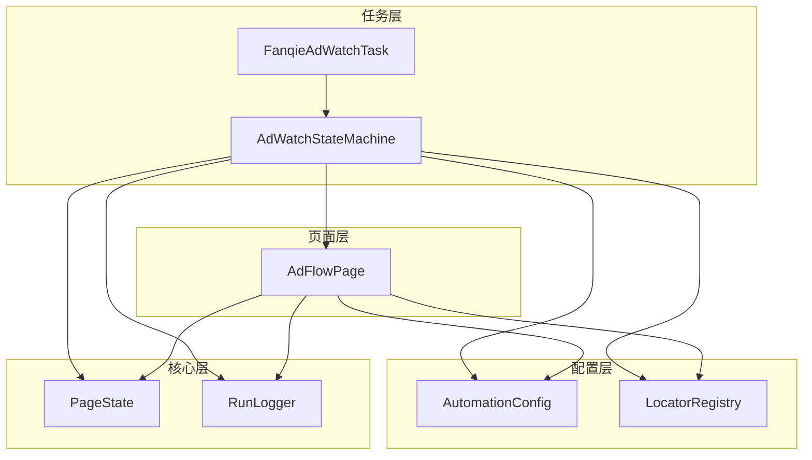
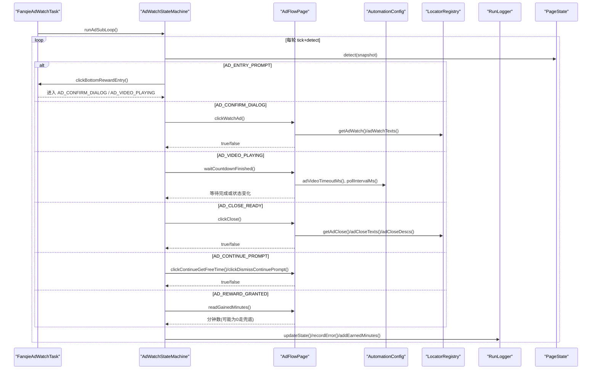
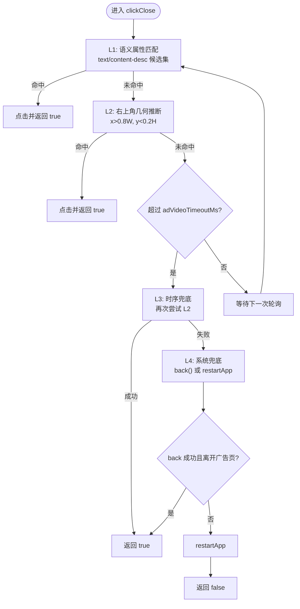
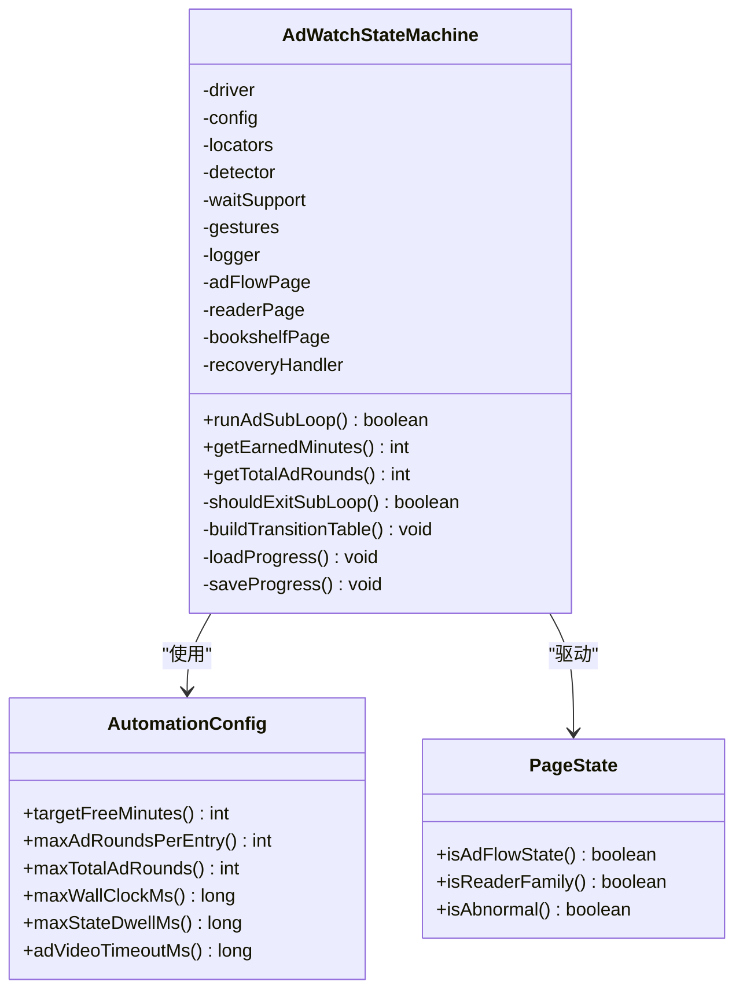
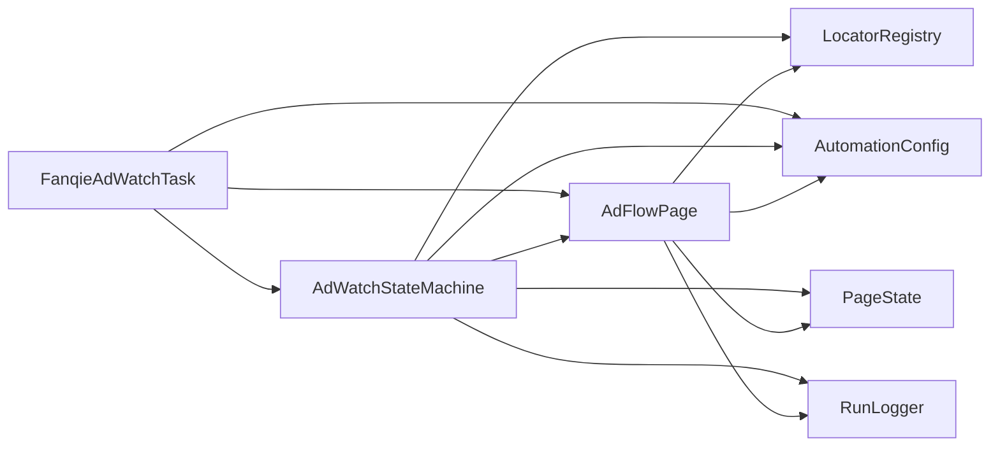

# 广告流程页面实现

<cite>
**本文引用的文件**
- [AdFlowPage.java](file://automation/src/main/java/com/fanqie/auto/page/AdFlowPage.java)
- [AdWatchStateMachine.java](file://automation/src/main/java/com/fanqie/auto/task/AdWatchStateMachine.java)
- [FanqieAdWatchTask.java](file://automation/src/main/java/com/fanqie/auto/task/FanqieAdWatchTask.java)
- [AutomationConfig.java](file://automation/src/main/java/com/fanqie/auto/config/AutomationConfig.java)
- [LocatorRegistry.java](file://automation/src/main/java/com/fanqie/auto/config/LocatorRegistry.java)
- [RunLogger.java](file://automation/src/main/java/com/fanqie/auto/core/RunLogger.java)
- [PageState.java](file://automation/src/main/java/com/fanqie/auto/core/PageState.java)
- [AdFlowPageTest.java](file://automation/src/test/java/com/fanqie/auto/page/AdFlowPageTest.java)
</cite>

## 目录
1. [简介](#简介)
2. [项目结构](#项目结构)
3. [核心组件](#核心组件)
4. [架构总览](#架构总览)
5. [详细组件分析](#详细组件分析)
6. [依赖关系分析](#依赖关系分析)
7. [性能与监控](#性能与监控)
8. [故障排查指南](#故障排查指南)
9. [结论](#结论)
10. [附录：扩展指南](#附录：扩展指南)

## 简介
本文件面向“广告流程页面”的实现，聚焦 AdFlowPage 对广告观看流程的封装，系统阐述以下要点：
- 广告类型的识别逻辑（基于 PageState 与定位器）
- 观看状态检测与等待策略（视频播放期间不点击、仅心跳轮询）
- 关闭按钮定位策略（L1→L2→L3→L4 四级降级）
- 状态机集成（转移表驱动、幂等性、熔断保护）
- 超时处理与异常恢复机制
- 配置参数、性能监控与日志记录
- 扩展指南（如何支持新广告类型与处理逻辑）

## 项目结构
围绕广告流程的核心代码分布在 page、task、config、core 四个层次：
- page：页面操作封装，AdFlowPage 负责广告相关交互
- task：业务编排与状态机，AdWatchStateMachine 管理广告子循环
- config：全局配置与定位器注册，AutomationConfig、LocatorRegistry
- core：运行时支撑，RunLogger、PageState、WaitSupport、GestureSupport 等

图表来源
- [AdFlowPage.java:38-65](file://automation/src/main/java/com/fanqie/auto/page/AdFlowPage.java#L38-L65)
- [AdWatchStateMachine.java:62-157](file://automation/src/main/java/com/fanqie/auto/task/AdWatchStateMachine.java#L62-L157)
- [FanqieAdWatchTask.java:42-81](file://automation/src/main/java/com/fanqie/auto/task/FanqieAdWatchTask.java#L42-L81)
- [AutomationConfig.java:18-306](file://automation/src/main/java/com/fanqie/auto/config/AutomationConfig.java#L18-L306)
- [LocatorRegistry.java:26-148](file://automation/src/main/java/com/fanqie/auto/config/LocatorRegistry.java#L26-L148)
- [PageState.java:11-97](file://automation/src/main/java/com/fanqie/auto/core/PageState.java#L11-L97)
- [RunLogger.java:46-130](file://automation/src/main/java/com/fanqie/auto/core/RunLogger.java#L46-L130)

章节来源
- [AdFlowPage.java:38-65](file://automation/src/main/java/com/fanqie/auto/page/AdFlowPage.java#L38-L65)
- [AdWatchStateMachine.java:62-157](file://automation/src/main/java/com/fanqie/auto/task/AdWatchStateMachine.java#L62-L157)
- [FanqieAdWatchTask.java:42-81](file://automation/src/main/java/com/fanqie/auto/task/FanqieAdWatchTask.java#L42-L81)
- [AutomationConfig.java:18-306](file://automation/src/main/java/com/fanqie/auto/config/AutomationConfig.java#L18-L306)
- [LocatorRegistry.java:26-148](file://automation/src/main/java/com/fanqie/auto/config/LocatorRegistry.java#L26-L148)
- [PageState.java:11-97](file://automation/src/main/java/com/fanqie/auto/core/PageState.java#L11-L97)
- [RunLogger.java:46-130](file://automation/src/main/java/com/fanqie/auto/core/RunLogger.java#L46-L130)

## 核心组件
- AdFlowPage：封装广告页面的关键操作，包括点击「观看广告」、等待倒计时结束、点击「关闭」与「继续获取免费时长」、读取奖励分钟数、关闭继续弹窗。其设计强调在视频播放阶段不做任何点击，避免误触落地页；关闭按钮采用四级降级策略确保鲁棒性。
- AdWatchStateMachine：以转移表驱动的状态机，管理广告子循环，包含四重熔断（目标分钟、单入口轮次、全局轮次、墙钟时间）、幂等性保证、退避重试、每日配额耗尽优雅收尾、进度持久化。
- FanqieAdWatchTask：业务编排，启动 App、进入阅读页、翻页并遇到广告态时进入状态机子循环，完成后确认回到阅读页，必要时轮换书籍。
- AutomationConfig：集中式配置，提供时序、流程、阅读策略等参数，所有超时与阈值均从此处获取。
- LocatorRegistry：定义各逻辑控件的定位策略（主定位器、备选定位器、区域提示、是否允许几何兜底），其中 ad.watch/ad.continue 禁止几何兜底，ad.close 允许。
- RunLogger：运行期日志与保活，周期性心跳保持 Appium session 活跃，输出状态转移、统计汇总、异常快照。
- PageState：页面状态枚举，驱动状态机决策，区分广告流程状态、阅读页家族、异常状态等。

章节来源
- [AdFlowPage.java:38-430](file://automation/src/main/java/com/fanqie/auto/page/AdFlowPage.java#L38-L430)
- [AdWatchStateMachine.java:62-803](file://automation/src/main/java/com/fanqie/auto/task/AdWatchStateMachine.java#L62-L803)
- [FanqieAdWatchTask.java:42-625](file://automation/src/main/java/com/fanqie/auto/task/FanqieAdWatchTask.java#L42-L625)
- [AutomationConfig.java:18-306](file://automation/src/main/java/com/fanqie/auto/config/AutomationConfig.java#L18-L306)
- [LocatorRegistry.java:26-300](file://automation/src/main/java/com/fanqie/auto/config/LocatorRegistry.java#L26-L300)
- [RunLogger.java:46-374](file://automation/src/main/java/com/fanqie/auto/core/RunLogger.java#L46-L374)
- [PageState.java:11-97](file://automation/src/main/java/com/fanqie/auto/core/PageState.java#L11-L97)

## 架构总览
广告流程由任务层编排、状态机驱动、页面层执行具体动作，配置与定位器提供可插拔策略，核心层提供运行时支撑。

图表来源
- [AdWatchStateMachine.java:173-312](file://automation/src/main/java/com/fanqie/auto/task/AdWatchStateMachine.java#L173-L312)
- [AdFlowPage.java:76-430](file://automation/src/main/java/com/fanqie/auto/page/AdFlowPage.java#L76-L430)
- [AutomationConfig.java:182-259](file://automation/src/main/java/com/fanqie/auto/config/AutomationConfig.java#L182-L259)
- [LocatorRegistry.java:123-148](file://automation/src/main/java/com/fanqie/auto/config/LocatorRegistry.java#L123-L148)
- [RunLogger.java:204-229](file://automation/src/main/java/com/fanqie/auto/core/RunLogger.java#L204-L229)
- [PageState.java:69-90](file://automation/src/main/java/com/fanqie/auto/core/PageState.java#L69-L90)

## 详细组件分析

### AdFlowPage：广告观看流程封装
- 广告类型识别：通过 LocatorRegistry 提供的文案候选集与 XPath 匹配，结合 PageState 判断当前处于广告确认、视频播放、可关闭、继续提示、奖励发放等阶段。
- 观看状态检测：waitCountdownFinished 仅做心跳轮询，不点击任何元素，避免误触广告落地页；使用稀疏轮询间隔降低 CPU 与 RPC 压力。
- 关闭按钮定位策略（L1→L2→L3→L4）：
  - L1：语义属性匹配（text/content-desc 候选集）
  - L2：右上角几何推断（x>0.8W && y<0.2H 区域内 clickable 节点）
  - L3：时序兜底（超过 adVideoTimeoutMs 后强制尝试）
  - L4：系统兜底（navigate().back()，失败则 restartApp）
- 奖励分钟提取：readGainedMinutes 使用正则与奖励语义关键词过滤，避免将「剩余N分钟」误计为奖励；无命中返回 0，交由状态机兜底估值。
- 安全设计：对「观看广告」「继续获取免费时长」禁用几何兜底，防止误点浪费配额；仅关闭按钮允许激进兜底。

图表来源
- [AdFlowPage.java:180-262](file://automation/src/main/java/com/fanqie/auto/page/AdFlowPage.java#L180-L262)
- [LocatorRegistry.java:202-218](file://automation/src/main/java/com/fanqie/auto/config/LocatorRegistry.java#L202-L218)

章节来源
- [AdFlowPage.java:76-430](file://automation/src/main/java/com/fanqie/auto/page/AdFlowPage.java#L76-L430)
- [LocatorRegistry.java:186-233](file://automation/src/main/java/com/fanqie/auto/config/LocatorRegistry.java#L186-L233)

### AdWatchStateMachine：状态机集成、超时与恢复
- 转移表驱动：每个 PageState 对应一个 StateHandler，当前状态决定下一步动作，不假设固定顺序。
- 幂等性：执行动作前重新 detect() 确认状态未漂移；动作后校验是否发生预期转移，否则计入失败并退避重试。
- 四重熔断：
  - 目标分钟达成（主退出条件）
  - 单入口视频轮次上限
  - 全局视频轮次上限
  - 墙钟时间预算耗尽
- 每日配额耗尽识别：连续多个 tick 命中配额文案且存在弹窗型关闭按钮才判定，触发优雅收尾。
- 超时处理：单状态滞留熔断（maxStateDwellMs），超时时尝试恢复；视频等待使用 adVideoTimeoutMs。
- 异常恢复：UNKNOWN/RECOVERY_NEEDED/COMMON_POPUP 交由 RecoveryHandler 五级恢复；连续错误达到上限触发恢复。
- 进度持久化：断点续跑，保存 earnedMinutes、totalAdRounds、usedBooks、lastUpdateDate。

图表来源
- [AdWatchStateMachine.java:62-157](file://automation/src/main/java/com/fanqie/auto/task/AdWatchStateMachine.java#L62-L157)
- [AutomationConfig.java:214-259](file://automation/src/main/java/com/fanqie/auto/config/AutomationConfig.java#L214-L259)
- [PageState.java:69-90](file://automation/src/main/java/com/fanqie/auto/core/PageState.java#L69-L90)

章节来源
- [AdWatchStateMachine.java:173-312](file://automation/src/main/java/com/fanqie/auto/task/AdWatchStateMachine.java#L173-L312)
- [AdWatchStateMachine.java:355-394](file://automation/src/main/java/com/fanqie/auto/task/AdWatchStateMachine.java#L355-L394)
- [AdWatchStateMachine.java:398-653](file://automation/src/main/java/com/fanqie/auto/task/AdWatchStateMachine.java#L398-L653)
- [AdWatchStateMachine.java:679-734](file://automation/src/main/java/com/fanqie/auto/task/AdWatchStateMachine.java#L679-L734)

### FanqieAdWatchTask：业务编排与书籍轮换
- 启动与导航：冷启 App，等待到达书架或中间状态，必要时切换书架 Tab。
- 选书与防误开：打开书籍后检测是否为短剧/视频页，若是则返回首页并重新选书。
- 翻页与广告处理：翻页后根据状态进入广告子循环或跳转下一章；广告子循环结束后确认回到阅读页。
- 书籍轮换：当本书广告轮次达上限且全局目标未达成，回书架换下一本未使用书籍；轮换失败时兜底回顶并打开任意书。
- 优雅收尾：墙钟时间预算耗尽或每日配额耗尽时正常结束并汇总统计。

章节来源
- [FanqieAdWatchTask.java:99-314](file://automation/src/main/java/com/fanqie/auto/task/FanqieAdWatchTask.java#L99-L314)
- [FanqieAdWatchTask.java:322-396](file://automation/src/main/java/com/fanqie/auto/task/FanqieAdWatchTask.java#L322-L396)
- [FanqieAdWatchTask.java:527-623](file://automation/src/main/java/com/fanqie/auto/task/FanqieAdWatchTask.java#L527-L623)

## 依赖关系分析
- AdFlowPage 依赖 LocatorRegistry 获取定位策略，依赖 AutomationConfig 获取超时与轮询参数，依赖 PageState 进行状态判断，依赖 RunLogger 更新状态与指标。
- AdWatchStateMachine 聚合 AdFlowPage、ReaderPage、BookshelfPage、RecoveryHandler，并通过 AutomationConfig、LocatorRegistry、StateDetector、WaitSupport、GestureSupport、RunLogger 协同工作。
- FanqieAdWatchTask 作为编排者，协调 ReaderPage、BookshelfPage、AdFlowPage、AdWatchStateMachine、RecoveryHandler。

图表来源
- [AdFlowPage.java:38-65](file://automation/src/main/java/com/fanqie/auto/page/AdFlowPage.java#L38-L65)
- [AdWatchStateMachine.java:62-157](file://automation/src/main/java/com/fanqie/auto/task/AdWatchStateMachine.java#L62-L157)
- [FanqieAdWatchTask.java:42-81](file://automation/src/main/java/com/fanqie/auto/task/FanqieAdWatchTask.java#L42-L81)

章节来源
- [AdFlowPage.java:38-65](file://automation/src/main/java/com/fanqie/auto/page/AdFlowPage.java#L38-L65)
- [AdWatchStateMachine.java:62-157](file://automation/src/main/java/com/fanqie/auto/task/AdWatchStateMachine.java#L62-L157)
- [FanqieAdWatchTask.java:42-81](file://automation/src/main/java/com/fanqie/auto/task/FanqieAdWatchTask.java#L42-L81)

## 性能与监控
- 视频等待稀疏轮询：waitCountdownFinished 使用 pollIntervalMs * 4 的间隔，降低 CPU 与 RPC 压力。
- 心跳保活：RunLogger 每 heartbeat.interval.sec 秒执行轻量 driver.getWindowSize() 保活，避免 newCommandTimeout。
- 指标上报：updatePageSourceMetrics 上报 getPageSource 耗时与 XML 长度；XML 膨胀预警阈值 1MB。
- 统计汇总：结束时输出总运行时间、累计免广告时长、总广告轮次、翻页数、状态识别次数与平均耗时、最终连续错误数、异常分布。

章节来源
- [AdFlowPage.java:116-163](file://automation/src/main/java/com/fanqie/auto/page/AdFlowPage.java#L116-L163)
- [RunLogger.java:150-197](file://automation/src/main/java/com/fanqie/auto/core/RunLogger.java#L150-L197)
- [RunLogger.java:312-345](file://automation/src/main/java/com/fanqie/auto/core/RunLogger.java#L312-L345)

## 故障排查指南
- 常见异常类型：no_handler_XXX、handler_exception_XXX、state_dwell_timeout、daily_quota_exhausted、no_transition_XXX。
- 恢复策略：UNKNOWN/RECOVERY_NEEDED/COMMON_POPUP 交由 RecoveryHandler 五级恢复；连续错误达到上限触发恢复。
- 截图与快照：异常或恢复时调用 captureSnapshot 保存 PNG 与 XML 到 automation/logs/snapshots/。
- 每日配额耗尽：连续多个 tick 命中配额文案且存在弹窗型关闭按钮才判定，触发优雅收尾而非反复重试。
- 调试建议：检查 locator 候选集是否正确加载（UTF-8 编码），确认 ad.watch/ad.continue 禁止几何兜底，ad.close 允许几何兜底；验证 rewardRegex 与奖励语义关键词。

章节来源
- [AdWatchStateMachine.java:235-302](file://automation/src/main/java/com/fanqie/auto/task/AdWatchStateMachine.java#L235-L302)
- [AdWatchStateMachine.java:345-353](file://automation/src/main/java/com/fanqie/auto/task/AdWatchStateMachine.java#L345-L353)
- [RunLogger.java:239-261](file://automation/src/main/java/com/fanqie/auto/core/RunLogger.java#L239-L261)
- [LocatorRegistry.java:71-81](file://automation/src/main/java/com/fanqie/auto/config/LocatorRegistry.java#L71-L81)

## 结论
AdFlowPage 通过严格的点击策略与四级降级定位，确保广告流程在高鲁棒性下运行；AdWatchStateMachine 以转移表驱动、幂等性与四重熔断保障稳定性；FanqieAdWatchTask 提供业务编排与书籍轮换；AutomationConfig 与 LocatorRegistry 提供可配置与可扩展的定位策略；RunLogger 提供运行时观测与保活。整体架构清晰、职责分明，便于扩展与维护。

## 附录：扩展指南
- 支持新广告类型：
  - 在 LocatorRegistry 中新增定位器（primaryBy、fallbackBys、boundsHint、allowGeometryFallback），并确保 UTF-8 编码加载。
  - 在 AdWatchStateMachine 的 buildTransitionTable 中添加对应 PageState 的 StateHandler，实现检测与动作逻辑。
  - 若涉及新的 UI 元素，需在 AdFlowPage 中提供相应操作方法（如 clickNewAdType）。
- 调整处理逻辑：
  - 修改 AutomationConfig 中的超时、轮次、阈值等参数，避免魔法数字。
  - 在 AdFlowPage 中调整点击策略（如是否允许几何兜底），权衡误点风险与漏点后果。
  - 在 AdWatchStateMachine 中增加熔断条件或恢复策略，提升容错能力。
- 监控与日志：
  - 使用 RunLogger.updateState、recordError、captureSnapshot 增强可观测性。
  - 定期检查 XML 体积与getPageSource 耗时，优化 UI 树抓取效率。
- 测试验证：
  - 参考 AdFlowPageTest 对 readGainedMinutes 进行离线单元测试，覆盖奖励语义、非奖励语义、空快照、畸形 XML 等场景。
  - 为新功能补充用例，确保边界条件与异常路径得到验证。

章节来源
- [LocatorRegistry.java:26-300](file://automation/src/main/java/com/fanqie/auto/config/LocatorRegistry.java#L26-L300)
- [AdWatchStateMachine.java:398-653](file://automation/src/main/java/com/fanqie/auto/task/AdWatchStateMachine.java#L398-L653)
- [AdFlowPage.java:76-430](file://automation/src/main/java/com/fanqie/auto/page/AdFlowPage.java#L76-L430)
- [AutomationConfig.java:182-259](file://automation/src/main/java/com/fanqie/auto/config/AutomationConfig.java#L182-L259)
- [AdFlowPageTest.java:26-81](file://automation/src/test/java/com/fanqie/auto/page/AdFlowPageTest.java#L26-L81)