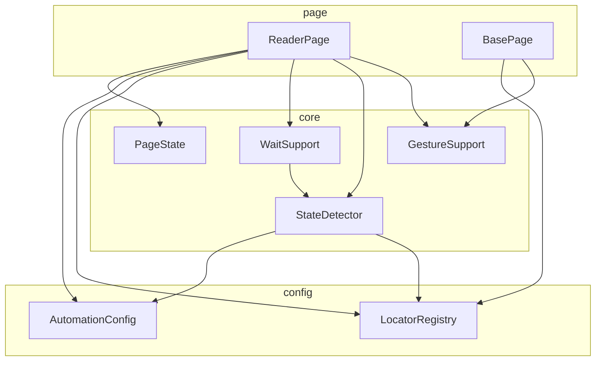
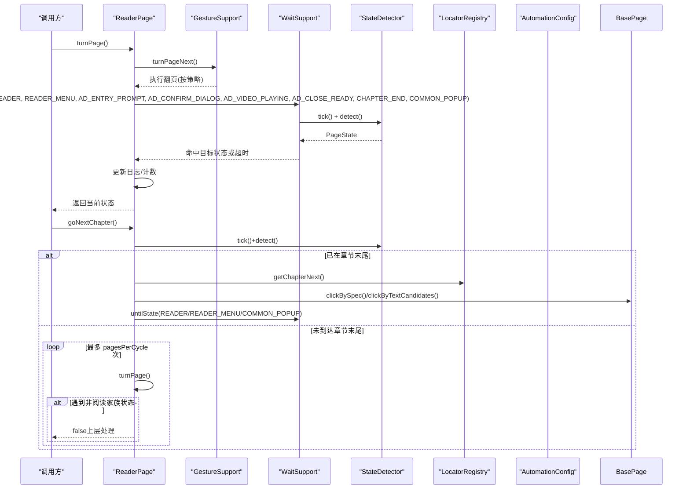
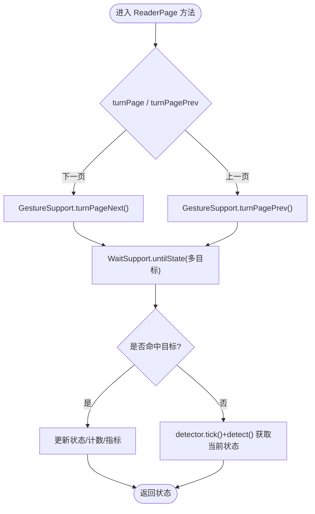
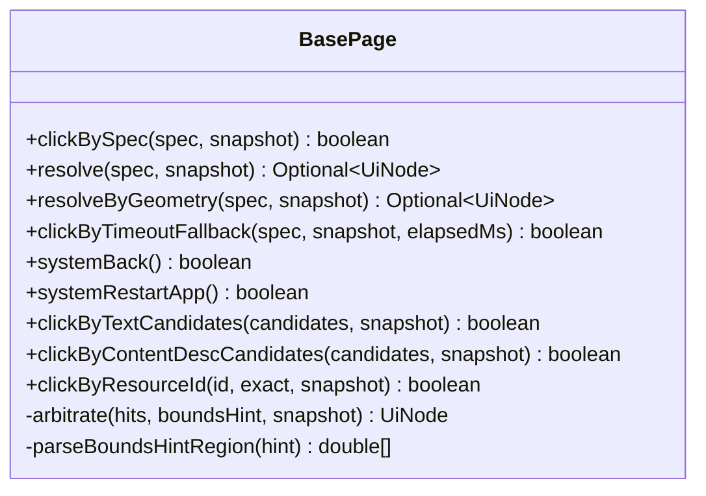
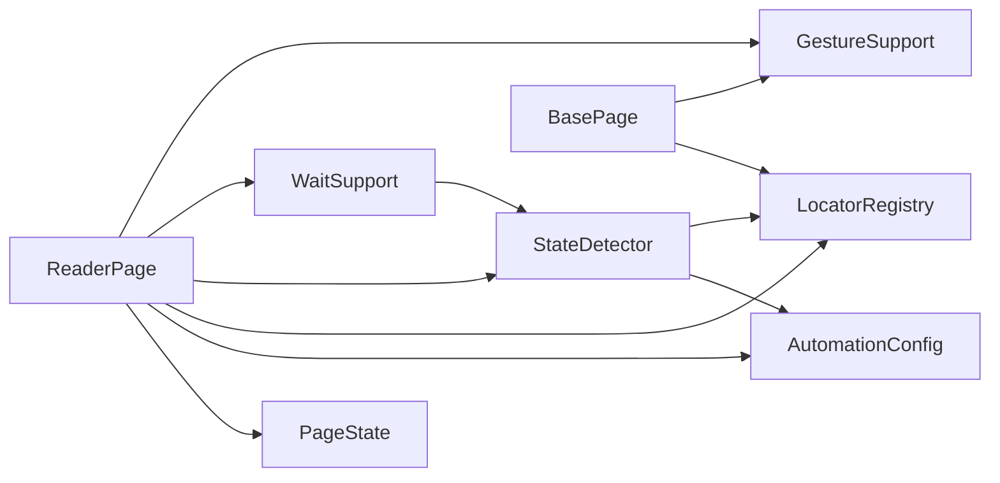

# 阅读器页面实现

<cite>
**本文引用的文件**
- [ReaderPage.java](file://automation/src/main/java/com/fanqie/auto/page/ReaderPage.java)
- [BasePage.java](file://automation/src/main/java/com/fanqie/auto/page/BasePage.java)
- [GestureSupport.java](file://automation/src/main/java/com/fanqie/auto/core/GestureSupport.java)
- [StateDetector.java](file://automation/src/main/java/com/fanqie/auto/core/StateDetector.java)
- [WaitSupport.java](file://automation/src/main/java/com/fanqie/auto/core/WaitSupport.java)
- [AutomationConfig.java](file://automation/src/main/java/com/fanqie/auto/config/AutomationConfig.java)
- [LocatorRegistry.java](file://automation/src/main/java/com/fanqie/auto/config/LocatorRegistry.java)
- [PageState.java](file://automation/src/main/java/com/fanqie/auto/core/PageState.java)
</cite>

## 目录
1. [简介](#简介)
2. [项目结构](#项目结构)
3. [核心组件](#核心组件)
4. [架构总览](#架构总览)
5. [详细组件分析](#详细组件分析)
6. [依赖关系分析](#依赖关系分析)
7. [性能考量](#性能考量)
8. [故障排查指南](#故障排查指南)
9. [结论](#结论)
10. [附录：扩展指南](#附录扩展指南)

## 简介
本文件面向“阅读器页面”的实现，聚焦 ReaderPage 对阅读界面操作的封装与编排。内容涵盖翻页逻辑、菜单与弹窗处理、设置项与进度管理、UI 状态检测、手势操作、页面生命周期、配置选项、性能优化策略、错误处理机制，以及如何在现有框架上扩展新的阅读功能。

## 项目结构
阅读器相关代码位于自动化测试工程内，采用分层组织：
- page：页面对象（ReaderPage、BasePage）
- core：通用能力（手势、等待、状态识别、快照）
- config：定位器与全局配置

图表来源
- [ReaderPage.java:1-271](file://automation/src/main/java/com/fanqie/auto/page/ReaderPage.java#L1-L271)
- [BasePage.java:1-516](file://automation/src/main/java/com/fanqie/auto/page/BasePage.java#L1-L516)
- [GestureSupport.java:1-228](file://automation/src/main/java/com/fanqie/auto/core/GestureSupport.java#L1-L228)
- [StateDetector.java:1-461](file://automation/src/main/java/com/fanqie/auto/core/StateDetector.java#L1-L461)
- [WaitSupport.java:1-234](file://automation/src/main/java/com/fanqie/auto/core/WaitSupport.java#L1-L234)
- [AutomationConfig.java:1-306](file://automation/src/main/java/com/fanqie/auto/config/AutomationConfig.java#L1-L306)
- [LocatorRegistry.java:1-300](file://automation/src/main/java/com/fanqie/auto/config/LocatorRegistry.java#L1-L300)
- [PageState.java:1-97](file://automation/src/main/java/com/fanqie/auto/core/PageState.java#L1-L97)

章节来源
- [ReaderPage.java:1-271](file://automation/src/main/java/com/fanqie/auto/page/ReaderPage.java#L1-L271)
- [BasePage.java:1-516](file://automation/src/main/java/com/fanqie/auto/page/BasePage.java#L1-L516)

## 核心组件
- ReaderPage：阅读页业务编排，封装翻页、跳转下一章、底部广告入口点击等；负责动作后多状态等待与日志记录。
- BasePage：四级定位降级链（语义属性→几何推断→时序兜底→系统兜底），统一点击与区域裁决。
- GestureSupport：手势封装，按配置选择 tap/swipe，坐标基于屏幕比例计算，避免硬编码像素。
- StateDetector：高性能 UI 状态识别，tick 缓存快照，按优先级匹配 resource-id/text/desc/几何特征。
- WaitSupport：显式等待原语，untilState/untilAnyTextPresent/runWithRetry 等，支撑稳定等待。
- AutomationConfig：全局配置加载，提供超时、轮次、阈值、阅读策略等。
- LocatorRegistry：控件定位策略与候选文案注册，含 boundsHint 与几何兜底开关。
- PageState：状态机枚举，定义阅读流程中所有关键状态及家族判定。

章节来源
- [ReaderPage.java:1-271](file://automation/src/main/java/com/fanqie/auto/page/ReaderPage.java#L1-L271)
- [BasePage.java:1-516](file://automation/src/main/java/com/fanqie/auto/page/BasePage.java#L1-L516)
- [GestureSupport.java:1-228](file://automation/src/main/java/com/fanqie/auto/core/GestureSupport.java#L1-L228)
- [StateDetector.java:1-461](file://automation/src/main/java/com/fanqie/auto/core/StateDetector.java#L1-L461)
- [WaitSupport.java:1-234](file://automation/src/main/java/com/fanqie/auto/core/WaitSupport.java#L1-L234)
- [AutomationConfig.java:1-306](file://automation/src/main/java/com/fanqie/auto/config/AutomationConfig.java#L1-L306)
- [LocatorRegistry.java:1-300](file://automation/src/main/java/com/fanqie/auto/config/LocatorRegistry.java#L1-L300)
- [PageState.java:1-97](file://automation/src/main/java/com/fanqie/auto/core/PageState.java#L1-L97)

## 架构总览
ReaderPage 作为“页面控制器”，协调手势、等待与状态检测，完成阅读流程中的关键动作。其核心调用链如下：

图表来源
- [ReaderPage.java:69-160](file://automation/src/main/java/com/fanqie/auto/page/ReaderPage.java#L69-L160)
- [WaitSupport.java:56-86](file://automation/src/main/java/com/fanqie/auto/core/WaitSupport.java#L56-L86)
- [StateDetector.java:97-170](file://automation/src/main/java/com/fanqie/auto/core/StateDetector.java#L97-L170)
- [GestureSupport.java:77-95](file://automation/src/main/java/com/fanqie/auto/core/GestureSupport.java#L77-L95)
- [LocatorRegistry.java:235-244](file://automation/src/main/java/com/fanqie/auto/config/LocatorRegistry.java#L235-L244)
- [AutomationConfig.java:216-287](file://automation/src/main/java/com/fanqie/auto/config/AutomationConfig.java#L216-L287)

## 详细组件分析

### ReaderPage：阅读页操作封装
- 翻页逻辑
  - 下一页：委托 GestureSupport.turnPageNext()，支持 tap 或 swipe 两种策略；随后使用 WaitSupport.untilState 一次等待多个可能状态（阅读页、阅读页菜单、广告入口提示、广告确认弹窗、广告播放中、广告可关闭、章节末尾、通用弹窗）。超时后主动 tick+detect 获取当前状态并返回。
  - 上一页：类似下一页，但等待集合略少。
  - 成功判据：动作后 detect() 仍为阅读家族且未出现异常态；若开启截图对比则额外校验前后帧差异（默认关闭以控制开销）。
- 跳转下一章
  - 若当前已是章节末尾，直接点击“下一章”按钮；否则循环翻页直到出现章节末尾或达到上限（由配置 pagesPerCycle 控制）。
  - 点击“下一章”优先走 LocatorRegistry.getChapterNext() 的四级定位；失败则回退到文案匹配。
  - 点击后等待回到阅读家族状态（允许短暂菜单可见）。
- 底部广告入口
  - hasBottomRewardEntry(snapshot)：在底部区域（y>0.7H）查找匹配 adEntryTexts 的节点。
  - clickBottomRewardEntry()：先按 LocatorSpec 解析（带 boundsHint），再回退到文案直接匹配并点击最底部节点。
- 日志与度量
  - 每次翻页递增计数；等待成功后更新状态与 XML 长度指标，便于监控。

图表来源
- [ReaderPage.java:69-118](file://automation/src/main/java/com/fanqie/auto/page/ReaderPage.java#L69-L118)
- [WaitSupport.java:56-86](file://automation/src/main/java/com/fanqie/auto/core/WaitSupport.java#L56-L86)
- [StateDetector.java:97-170](file://automation/src/main/java/com/fanqie/auto/core/StateDetector.java#L97-L170)

章节来源
- [ReaderPage.java:69-271](file://automation/src/main/java/com/fanqie/auto/page/ReaderPage.java#L69-L271)

### BasePage：四级定位与点击
- 四级降级链
  - L1 语义属性匹配：text → content-desc → resource-id（精确/包含），命中多个时按 boundsHint 裁决。
  - L2 结构化几何推断：在指定区域内查找 clickable=true 且 areaRatio<0.15 的节点；受 allowGeometryFallback 标志保护，防止误点高风险控件。
  - L3 时序兜底：达到 adVideoTimeoutMs 后强制执行 L2（同样受标志约束）。
  - L4 系统兜底：navigate().back() 或重启 App。
- 点击实现
  - 取命中节点的 bounds 中心点击；若节点不可点击则回溯至最近可点击祖先；无有效 bounds 则跳过。
- boundsHint 裁决
  - 底部/极底部/右上角/居中区域规则，确保在多命中情况下选择最合适的控件。

图表来源
- [BasePage.java:84-250](file://automation/src/main/java/com/fanqie/auto/page/BasePage.java#L84-L250)
- [BasePage.java:312-434](file://automation/src/main/java/com/fanqie/auto/page/BasePage.java#L312-L434)

章节来源
- [BasePage.java:1-516](file://automation/src/main/java/com/fanqie/auto/page/BasePage.java#L1-L516)

### GestureSupport：手势与屏幕比例
- 翻页策略
  - 下一页：tap 策略点击右侧热区（默认 x=0.85W, y=0.50H），或 swipe 左滑（percent/duration 来自配置）。
  - 上一页：tap 左侧热区（默认 x=0.15W, y=0.50H）。
- 通用手势
  - 比例点击 tapAtRatio(xRatio, yRatio)，内部转绝对像素后执行 mobile: clickGesture。
  - 滑动 swipeUp/down/left/right 通过 mobile: swipeGesture 执行。
- 应用生命周期
  - activateApp/terminateApp/restartApp 使用 mobile 命令，避免硬编码 Activity 导致权限问题。

章节来源
- [GestureSupport.java:77-228](file://automation/src/main/java/com/fanqie/auto/core/GestureSupport.java#L77-L228)

### StateDetector：状态识别与快照缓存
- tick()
  - 仅一次 getPageSource()，构造 UiSnapshot 并缓存；同一 tick 内多次 detect 复用快照，避免重复 RPC。
  - 自动检测屏幕尺寸是否过期（横屏/折叠屏旋转），自愈重取。
- detect()
  - 纯内存匹配，优先级：resource-id → text → content-desc → APP_LAUNCHING → 几何特征 → UNKNOWN。
  - 针对阅读页：reader 容器存在且命中菜单文案 → READER_MENU；否则 READER。
  - 开屏广告 SPLASH_AD：需满足全屏大面积且无右上角关闭特征，避免与激励视频关闭混淆。
  - 广告关闭 AD_CLOSE_READY：文本/描述/几何右上角小 clickable 均可判定。
  - 章节末尾 CHAPTER_END：命中“下一章”文案。
- 性能
  - 严格禁止逐个状态试 findElement；全部基于内存节点表匹配，降低延迟。

章节来源
- [StateDetector.java:97-461](file://automation/src/main/java/com/fanqie/auto/core/StateDetector.java#L97-L461)

### WaitSupport：统一等待原语
- untilState(targets...)：等待命中任一目标状态，用于翻页后一次性覆盖多种可能状态，提升稳定性。
- untilStateGone(state)：等待某状态消失（如广告播放结束）。
- untilAnyTextPresent(candidates)：等待特定文案出现。
- runWithRetry(supplier, maxAttempts, backoffMs)：指数退避重试，应对偶发时序竞争。

章节来源
- [WaitSupport.java:56-234](file://automation/src/main/java/com/fanqie/auto/core/WaitSupport.java#L56-L234)

### AutomationConfig：配置项与阈值
- 阅读页翻页策略
  - reader.turn.strategy：tap 或 swipe
  - reader.next.tap.ratio.x/y、reader.prev.tap.ratio.x：点击热区比例
  - reader.swipe.percent、reader.swipe.duration.ms：滑动参数
- 超时与轮次
  - timing.action.timeout.ms：动作等待超时
  - timing.ad.video.timeout.ms：激励视频等待阈值（触发 L3 时序兜底）
  - flow.pages.per.cycle：每轮最大翻页次数（用于跳章）
  - flow.max.wall.clock.ms：墙钟熔断保护
- 验证与调试
  - verify.page.turned.by.screenshot：是否启用截图差异校验（默认关闭）

章节来源
- [AutomationConfig.java:180-306](file://automation/src/main/java/com/fanqie/auto/config/AutomationConfig.java#L180-L306)

### LocatorRegistry：定位器与候选集
- 控件定位规格（LocatorSpec）
  - primaryBy + fallbackBys：主/备选定位器
  - boundsHint：区域比例描述（如 y>0.8、x>0.8,y<0.2）
  - allowGeometryFallback：是否允许 L2 几何兜底（ad.watch/ad.continue 必须为 false，ad.close 可为 true）
- 候选文案
  - adEntryTexts、adWatchTexts、adCloseTexts/desc、chapterNextTexts、commonDismissTexts、readerMenuTexts、splashSkipTexts、dailyQuotaExhaustedTexts 等
- 构建规则
  - 各控件根据文案构建 XPath 或资源 id 匹配；底部入口限定 y>0.8，关闭按钮限定右上角区域。

章节来源
- [LocatorRegistry.java:1-300](file://automation/src/main/java/com/fanqie/auto/config/LocatorRegistry.java#L1-L300)

### PageState：状态机枚举
- 阅读家族：READER、READER_MENU（isReaderFamily 用于判断是否属于阅读页家族）
- 广告流程：AD_ENTRY_PROMPT、AD_CONFIRM_DIALOG、AD_VIDEO_PLAYING、AD_CLOSE_READY、AD_CONTINUE_PROMPT、AD_REWARD_GRANTED
- 其他：BOOKSHELF、CHAPTER_END、COMMON_POPUP、UNKNOWN、APP_LAUNCHING、RECOVERY_NEEDED

章节来源
- [PageState.java:1-97](file://automation/src/main/java/com/fanqie/auto/core/PageState.java#L1-L97)

## 依赖关系分析
- ReaderPage 依赖 GestureSupport 执行手势，依赖 WaitSupport 进行多状态等待，依赖 StateDetector 做 UI 状态识别，依赖 LocatorRegistry 获取控件定位策略，依赖 AutomationConfig 读取配置。
- BasePage 提供统一的四级定位与点击能力，被 ReaderPage 复用。
- StateDetector 依赖 LocatorRegistry 的候选文案与正则，依赖 AutomationConfig 的超时与阈值。
- WaitSupport 依赖 StateDetector 的 tick/detect 能力，统一封装等待逻辑。

图表来源
- [ReaderPage.java:1-271](file://automation/src/main/java/com/fanqie/auto/page/ReaderPage.java#L1-L271)
- [BasePage.java:1-516](file://automation/src/main/java/com/fanqie/auto/page/BasePage.java#L1-L516)
- [WaitSupport.java:1-234](file://automation/src/main/java/com/fanqie/auto/core/WaitSupport.java#L1-L234)
- [StateDetector.java:1-461](file://automation/src/main/java/com/fanqie/auto/core/StateDetector.java#L1-L461)
- [LocatorRegistry.java:1-300](file://automation/src/main/java/com/fanqie/auto/config/LocatorRegistry.java#L1-L300)
- [AutomationConfig.java:1-306](file://automation/src/main/java/com/fanqie/auto/config/AutomationConfig.java#L1-L306)
- [PageState.java:1-97](file://automation/src/main/java/com/fanqie/auto/core/PageState.java#L1-L97)

章节来源
- [ReaderPage.java:1-271](file://automation/src/main/java/com/fanqie/auto/page/ReaderPage.java#L1-L271)
- [BasePage.java:1-516](file://automation/src/main/java/com/fanqie/auto/page/BasePage.java#L1-L516)

## 性能考量
- 快照缓存：StateDetector.tick() 单次抓取 UI 树并缓存，同一 tick 内多次 detect 复用，避免重复 RPC。
- 纯内存匹配：detect() 基于 UiSnapshot 内存节点表，不逐状态发起 findElement，显著降低延迟。
- 屏幕尺寸缓存：StateDetector 与 GestureSupport 均缓存屏幕尺寸，减少 getSize() 调用；横屏/旋转时自动失效并重取。
- 等待优化：WaitSupport 使用显式等待 with pollInterval，避免 Thread.sleep；untilState 支持多目标状态，减少多次等待。
- 截图对比可选：verifyPageTurnedByScreenshot 默认关闭，避免长任务累积开销。
- 手势优化：优先使用 mobile: clickGesture/swipeGesture，设备端执行更稳定。

[本节为通用性能讨论，不直接分析具体文件]

## 故障排查指南
- 翻页后等待超时
  - 现象：untilState 抛出超时异常。
  - 处理：ReaderPage 捕获异常后主动 tick+detect，记录当前状态；检查是否因广告弹窗或章节末未纳入等待集合。
  - 建议：确认 actionTimeoutMs 合理，必要时扩大；检查 locator 文案是否漂移。
- 无法定位“下一章”按钮
  - 现象：goNextChapter 返回 false。
  - 处理：检查 chapterNextTexts 是否覆盖实际文案；确认 LocatorSpec 的 primaryBy/fallbackBys 正确；必要时启用 L2 几何兜底（注意 allowGeometryFallback 标志）。
- 底部广告入口未命中
  - 现象：clickBottomRewardEntry 返回 false。
  - 处理：核对 adEntryTexts 与 boundsHint（y>0.8）；确认底部区域确实存在匹配节点；必要时回退到文案直接匹配。
- 误点高风险按钮
  - 风险：ad.watch/ad.continue 误点会浪费每日配额。
  - 防护：ensure allowGeometryFallback=false；仅在 ad.close 允许几何兜底。
- 状态识别错误
  - 现象：READER/READER_MENU/SPLASH_AD/AD_CLOSE_READY 误判。
  - 处理：检查 resource-id 锚点、text/desc 候选集、几何特征阈值；必要时调整 reader.progress.regex 或 reader.container.id。

章节来源
- [ReaderPage.java:69-160](file://automation/src/main/java/com/fanqie/auto/page/ReaderPage.java#L69-L160)
- [BasePage.java:150-250](file://automation/src/main/java/com/fanqie/auto/page/BasePage.java#L150-L250)
- [StateDetector.java:183-461](file://automation/src/main/java/com/fanqie/auto/core/StateDetector.java#L183-L461)
- [LocatorRegistry.java:174-244](file://automation/src/main/java/com/fanqie/auto/config/LocatorRegistry.java#L174-L244)

## 结论
ReaderPage 通过组合手势、等待与状态识别，实现了稳定的阅读页自动化流程。其关键设计包括：
- 翻页后多状态等待，避免白等超时；
- 四级定位降级链保障控件可寻址性；
- 高性能状态识别与快照缓存；
- 配置化策略与阈值，便于调优与扩展；
- 完善的错误处理与恢复路径。

[本节为总结性内容，不直接分析具体文件]

## 附录：扩展指南
- 添加新阅读功能（例如新增“设置”菜单项点击）
  - 在 LocatorRegistry 中添加对应 LocatorSpec（primaryBy/fallbackBys/boundsHint/allowGeometryFallback），并在 locators.properties 补充候选文案。
  - 在 ReaderPage 中新增方法，复用 BasePage.clickBySpec/clickByTextCandidates 进行点击。
  - 如需等待特定状态，使用 WaitSupport.untilState/untilAnyTextPresent。
  - 若涉及高风险操作，务必设置 allowGeometryFallback=false，避免误点。
- 调整翻页策略
  - 修改 AutomationConfig 中 reader.turn.strategy、next/prev tap 比例、swipe 参数。
- 增强状态识别
  - 在 StateDetector 中增加新的匹配分支（resource-id/text/desc/几何特征），并确保优先级合理。
  - 更新 LocatorRegistry 的候选文案与正则，保证鲁棒性。
- 性能调优
  - 调整 timing.action.timeout.ms、timing.poll.interval.ms、timing.ad.video.timeout.ms。
  - 谨慎开启 verify.page.turned.by.screenshot，评估开销。
- 错误恢复
  - 利用 WaitSupport.runWithRetry 进行幂等重试；必要时结合 BasePage.systemBack/systemRestartApp 进行系统级恢复。

章节来源
- [LocatorRegistry.java:174-244](file://automation/src/main/java/com/fanqie/auto/config/LocatorRegistry.java#L174-L244)
- [ReaderPage.java:130-271](file://automation/src/main/java/com/fanqie/auto/page/ReaderPage.java#L130-L271)
- [AutomationConfig.java:262-293](file://automation/src/main/java/com/fanqie/auto/config/AutomationConfig.java#L262-L293)
- [StateDetector.java:183-461](file://automation/src/main/java/com/fanqie/auto/core/StateDetector.java#L183-L461)
- [WaitSupport.java:186-234](file://automation/src/main/java/com/fanqie/auto/core/WaitSupport.java#L186-L234)
- [BasePage.java:221-250](file://automation/src/main/java/com/fanqie/auto/page/BasePage.java#L221-L250)