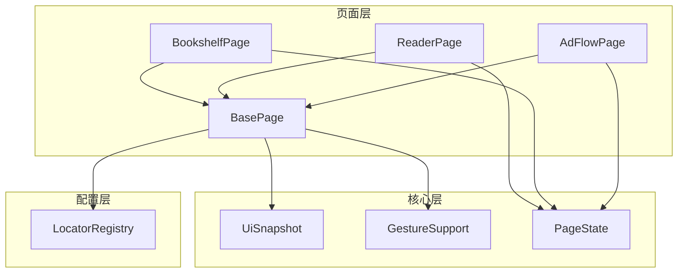
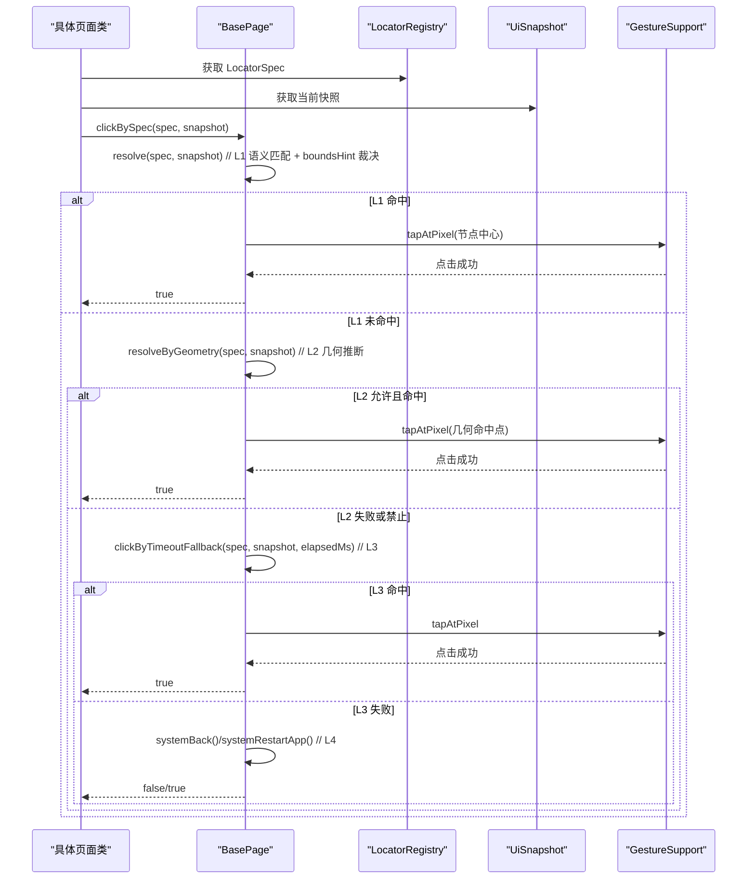
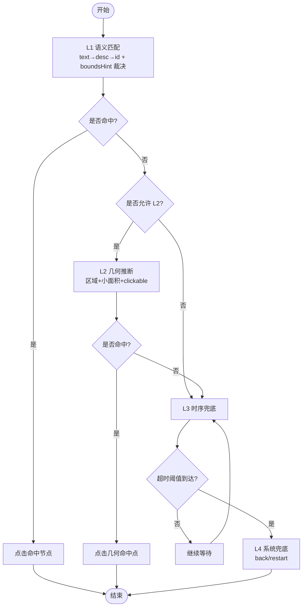
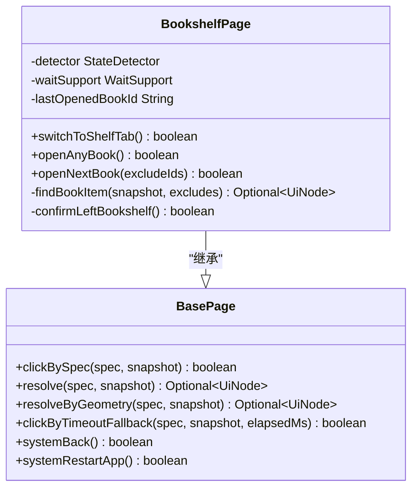
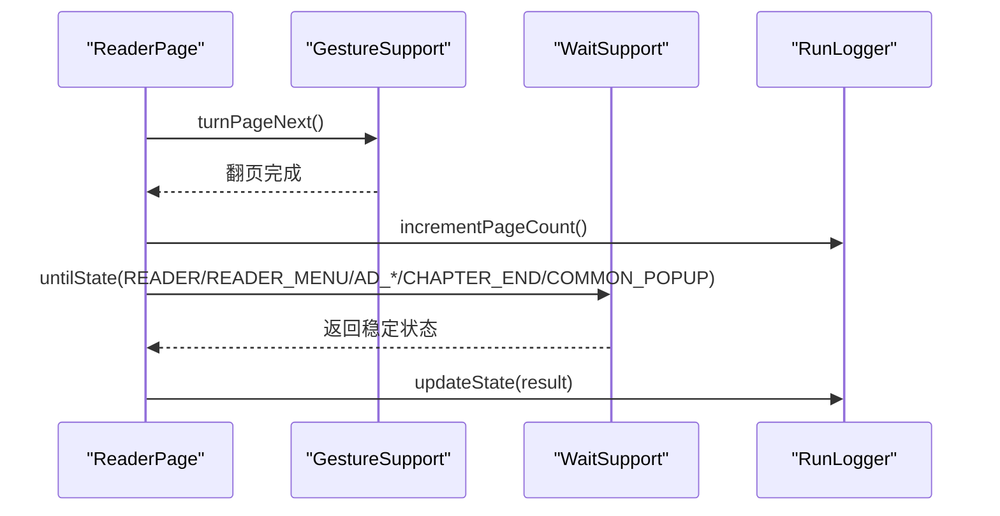
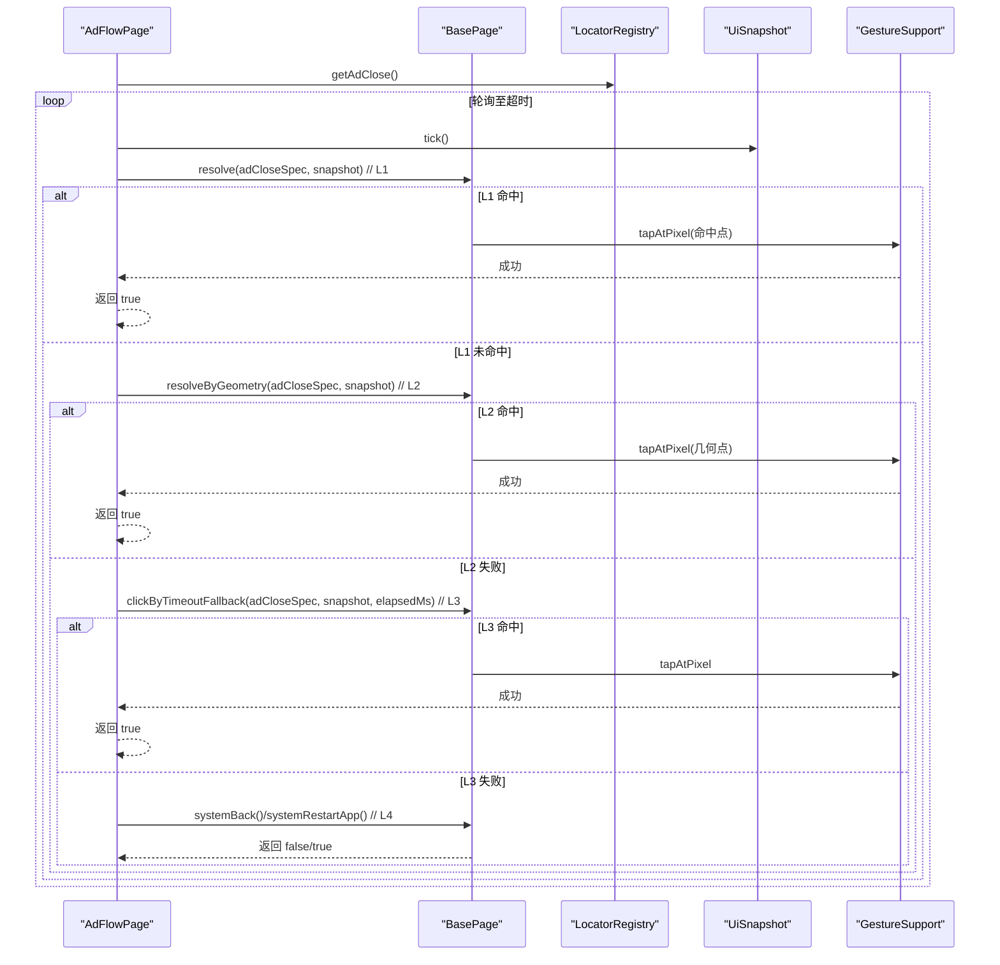
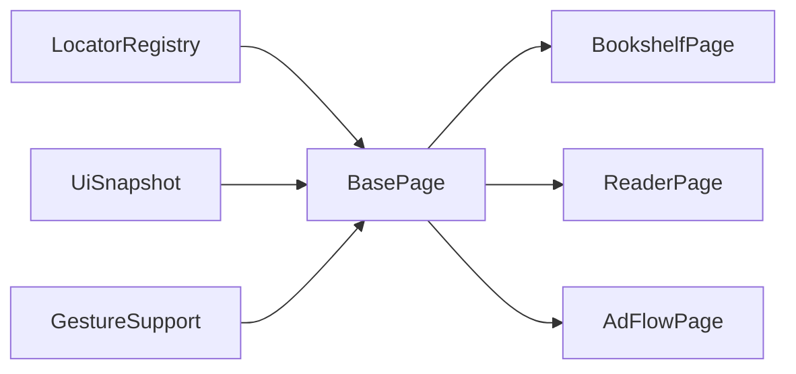

# 页面抽象层设计

<cite>
**本文引用的文件**
- [BasePage.java](file://automation/src/main/java/com/fanqie/auto/page/BasePage.java)
- [BookshelfPage.java](file://automation/src/main/java/com/fanqie/auto/page/BookshelfPage.java)
- [ReaderPage.java](file://automation/src/main/java/com/fanqie/auto/page/ReaderPage.java)
- [AdFlowPage.java](file://automation/src/main/java/com/fanqie/auto/page/AdFlowPage.java)
- [LocatorRegistry.java](file://automation/src/main/java/com/fanqie/auto/config/LocatorRegistry.java)
- [UiSnapshot.java](file://automation/src/main/java/com/fanqie/auto/core/UiSnapshot.java)
- [GestureSupport.java](file://automation/src/main/java/com/fanqie/auto/core/GestureSupport.java)
- [PageState.java](file://automation/src/main/java/com/fanqie/auto/core/PageState.java)
</cite>

## 目录
1. [引言](#引言)
2. [项目结构](#项目结构)
3. [核心组件](#核心组件)
4. [架构总览](#架构总览)
5. [详细组件分析](#详细组件分析)
6. [依赖关系分析](#依赖关系分析)
7. [性能考量](#性能考量)
8. [故障排查指南](#故障排查指南)
9. [结论](#结论)
10. [附录：扩展开发指南](#附录：扩展开发指南)

## 引言
本设计文档围绕页面对象模式的实现，系统性阐述页面抽象层的四级降级定位策略、各页面类的职责边界、页面间数据传递与状态同步机制、生命周期管理、原子化操作设计、异常恢复与性能优化，并给出新增页面类型与操作的扩展指南。该方案以“动态解析 UI 树、不写死坐标”为核心约束，通过内存快照与几何推断提升稳定性与可维护性。

## 项目结构
本项目采用分层组织：
- page：页面对象（BasePage 及具体页面类）
- config：定位器注册表与配置
- core：UI 快照、手势封装、状态枚举等基础设施
- task：任务编排与状态机（不在本文重点）

图表来源
- [BasePage.java:18-39](file://automation/src/main/java/com/fanqie/auto/page/BasePage.java#L18-L39)
- [BookshelfPage.java:23-35](file://automation/src/main/java/com/fanqie/auto/page/BookshelfPage.java#L23-L35)
- [ReaderPage.java:19-41](file://automation/src/main/java/com/fanqie/auto/page/ReaderPage.java#L19-L41)
- [AdFlowPage.java:21-37](file://automation/src/main/java/com/fanqie/auto/page/AdFlowPage.java#L21-L37)
- [UiSnapshot.java:21-35](file://automation/src/main/java/com/fanqie/auto/core/UiSnapshot.java#L21-L35)
- [GestureSupport.java:12-25](file://automation/src/main/java/com/fanqie/auto/core/GestureSupport.java#L12-L25)
- [PageState.java:3-10](file://automation/src/main/java/com/fanqie/auto/core/PageState.java#L3-L10)
- [LocatorRegistry.java:16-25](file://automation/src/main/java/com/fanqie/auto/config/LocatorRegistry.java#L16-L25)

章节来源
- [BasePage.java:18-39](file://automation/src/main/java/com/fanqie/auto/page/BasePage.java#L18-L39)
- [UiSnapshot.java:21-35](file://automation/src/main/java/com/fanqie/auto/core/UiSnapshot.java#L21-L35)
- [GestureSupport.java:12-25](file://automation/src/main/java/com/fanqie/auto/core/GestureSupport.java#L12-L25)
- [LocatorRegistry.java:16-25](file://automation/src/main/java/com/fanqie/auto/config/LocatorRegistry.java#L16-L25)

## 核心组件
- BasePage：承载四级降级定位链（L1 语义属性匹配 → L2 结构化几何推断 → L3 时序兜底 → L4 系统兜底），提供统一点击入口与 boundsHint 裁决逻辑。
- LocatorRegistry：集中管理所有逻辑控件的定位规格（primaryBy、fallbackBys、boundsHint、allowGeometryFallback）与文案候选集。
- UiSnapshot：一次 getPageSource() 的内存快照表示，提供纯内存查询 API（text/desc/id/区域筛选/最近可点击祖先）。
- GestureSupport：手势封装，全部基于比例坐标与 mobile 命令，避免绝对像素硬编码。
- PageState：页面状态枚举，驱动状态机决策与自愈路径。

章节来源
- [BasePage.java:75-250](file://automation/src/main/java/com/fanqie/auto/page/BasePage.java#L75-L250)
- [LocatorRegistry.java:150-298](file://automation/src/main/java/com/fanqie/auto/config/LocatorRegistry.java#L150-L298)
- [UiSnapshot.java:131-254](file://automation/src/main/java/com/fanqie/auto/core/UiSnapshot.java#L131-L254)
- [GestureSupport.java:69-178](file://automation/src/main/java/com/fanqie/auto/core/GestureSupport.java#L69-L178)
- [PageState.java:11-97](file://automation/src/main/java/com/fanqie/auto/core/PageState.java#L11-L97)

## 架构总览
页面抽象层以 BasePage 为基类，具体页面类复用其定位与点击能力，并通过 LocatorRegistry 获取控件定位规格，使用 UiSnapshot 进行内存级查找，最终通过 GestureSupport 执行动作。状态由 PageState 驱动，配合 WaitSupport 完成等待与确认。

图表来源
- [BasePage.java:75-250](file://automation/src/main/java/com/fanqie/auto/page/BasePage.java#L75-L250)
- [LocatorRegistry.java:258-298](file://automation/src/main/java/com/fanqie/auto/config/LocatorRegistry.java#L258-L298)
- [UiSnapshot.java:131-200](file://automation/src/main/java/com/fanqie/auto/core/UiSnapshot.java#L131-L200)
- [GestureSupport.java:106-123](file://automation/src/main/java/com/fanqie/auto/core/GestureSupport.java#L106-L123)

## 详细组件分析

### BasePage 四级降级定位策略
- L1 语义属性匹配：按 text 候选集 → content-desc 候选集 → resource-id（精确/包含）依次查找；多命中时依据 boundsHint 裁决（底部、右上角、居中、面积最小优先）。
- L2 结构化几何推断：在 boundsHint 指定区域内筛选 clickable=true 且 areaRatio < 0.15 的小节点；必须检查 allowGeometryFallback 标志，误点高风险控件禁用 L2。
- L3 时序兜底：达到 adVideoTimeoutMs 后强制尝试 L2；用于激励视频关闭按钮因 SDK 自绘无属性的场景。
- L4 系统兜底：navigate().back() 强制退出；再失败则 restartApp 重启 App，回到书架锚点重新进入。

图表来源
- [BasePage.java:75-250](file://automation/src/main/java/com/fanqie/auto/page/BasePage.java#L75-L250)
- [BasePage.java:300-434](file://automation/src/main/java/com/fanqie/auto/page/BasePage.java#L300-L434)

章节来源
- [BasePage.java:75-250](file://automation/src/main/java/com/fanqie/auto/page/BasePage.java#L75-L250)
- [BasePage.java:300-434](file://automation/src/main/java/com/fanqie/auto/page/BasePage.java#L300-L434)

### BookshelfPage 职责与业务封装
- 切换到底部「书架」Tab：优先走 LocatorSpec 降级链，补充 shelfTabTexts 文案匹配与底部区域几何查找；点击时避开华为全面屏手势区。
- 打开任意书籍：动态选取首个满足条件的书籍条目（clickable、带文案、合理 areaRatio、主体区域），滚动重试；记录 lastOpenedBookId 支持 per-book 进度与轮换排除。
- 打开下一本未使用书籍：在 openAnyBook 基础上排除 excludeIds，增加滚动次数以覆盖更多屏幕。
- 离开书架确认：等待进入 READER/READER_MENU/AD_* 等状态，确保点击有效。

图表来源
- [BasePage.java:75-250](file://automation/src/main/java/com/fanqie/auto/page/BasePage.java#L75-L250)
- [BookshelfPage.java:57-315](file://automation/src/main/java/com/fanqie/auto/page/BookshelfPage.java#L57-L315)

章节来源
- [BookshelfPage.java:57-315](file://automation/src/main/java/com/fanqie/auto/page/BookshelfPage.java#L57-L315)

### ReaderPage 职责与业务封装
- 翻页操作：委托 GestureSupport.turnPageNext/Prev；翻页后一次等待覆盖多个可能状态（READER/READER_MENU/广告态/章节末/弹窗），避免白等到超时。
- 跳转下一章：优先点击「下一章」按钮，否则继续翻页直到 CHAPTER_END；翻页过程中遇到非阅读家族状态暂停交由上层处理。
- 底部奖励入口：检测并点击「观看视频获取免广告时长」入口，优先走 LocatorSpec 降级链，其次用文案直接匹配。

图表来源
- [ReaderPage.java:69-96](file://automation/src/main/java/com/fanqie/auto/page/ReaderPage.java#L69-L96)
- [GestureSupport.java:71-95](file://automation/src/main/java/com/fanqie/auto/core/GestureSupport.java#L71-L95)

章节来源
- [ReaderPage.java:69-160](file://automation/src/main/java/com/fanqie/auto/page/ReaderPage.java#L69-L160)

### AdFlowPage 职责与业务封装
- 点击「观看广告」：仅 L1 语义匹配，禁用几何兜底以防误点浪费配额。
- 等待倒计时结束：不做任何点击，仅心跳轮询等待 AD_CLOSE_READY；稀疏轮询降低 CPU/RPC 压力。
- 点击「关闭」按钮：全链路 L1→L2→L3→L4；关闭按钮是唯一允许激进兜底的控件。
- 点击「继续获取免费时长」：仅 L1，理由同「观看广告」。
- 读取奖励分钟数：基于正则与奖励语义关键词过滤，避免将「剩余 N 分钟」误计为奖励。

图表来源
- [AdFlowPage.java:180-262](file://automation/src/main/java/com/fanqie/auto/page/AdFlowPage.java#L180-L262)
- [BasePage.java:150-250](file://automation/src/main/java/com/fanqie/auto/page/BasePage.java#L150-L250)
- [LocatorRegistry.java:202-218](file://automation/src/main/java/com/fanqie/auto/config/LocatorRegistry.java#L202-L218)

章节来源
- [AdFlowPage.java:67-163](file://automation/src/main/java/com/fanqie/auto/page/AdFlowPage.java#L67-L163)
- [AdFlowPage.java:180-262](file://automation/src/main/java/com/fanqie/auto/page/AdFlowPage.java#L180-L262)
- [AdFlowPage.java:264-388](file://automation/src/main/java/com/fanqie/auto/page/AdFlowPage.java#L264-L388)

## 依赖关系分析
- BasePage 依赖 LocatorRegistry 获取控件定位规格，依赖 UiSnapshot 进行内存查询，依赖 GestureSupport 执行点击。
- 具体页面类依赖 BasePage 提供的通用定位与点击能力，同时组合 StateDetector/WaitSupport 完成状态检测与等待。
- LocatorRegistry 集中管理 primaryBy/fallbackBys/boundsHint/allowGeometryFallback，确保不同控件的降级策略一致且可控。
- UiSnapshot 提供稳定的内存查询 API，屏蔽 XML 解析细节与 XXE 防护。

图表来源
- [BasePage.java:55-68](file://automation/src/main/java/com/fanqie/auto/page/BasePage.java#L55-L68)
- [LocatorRegistry.java:258-298](file://automation/src/main/java/com/fanqie/auto/config/LocatorRegistry.java#L258-L298)
- [UiSnapshot.java:131-200](file://automation/src/main/java/com/fanqie/auto/core/UiSnapshot.java#L131-L200)
- [GestureSupport.java:106-123](file://automation/src/main/java/com/fanqie/auto/core/GestureSupport.java#L106-L123)

章节来源
- [BasePage.java:55-68](file://automation/src/main/java/com/fanqie/auto/page/BasePage.java#L55-L68)
- [LocatorRegistry.java:258-298](file://automation/src/main/java/com/fanqie/auto/config/LocatorRegistry.java#L258-L298)
- [UiSnapshot.java:131-200](file://automation/src/main/java/com/fanqie/auto/core/UiSnapshot.java#L131-L200)
- [GestureSupport.java:106-123](file://automation/src/main/java/com/fanqie/auto/core/GestureSupport.java#L106-L123)

## 性能考量
- 快照缓存复用：同一 tick 内 UiSnapshot 复用，杜绝重复抓取，单 tick 状态识别约 0.5s，相比每次 uiautomator dump 快 4-10 倍。
- 纯内存查询：findByTextContains/findByContentDescContains/findClickableInRegion 均为内存操作，零 RPC。
- 手势优化：GestureSupport 使用 mobile: swipeGesture/clickGesture，单次设备端执行更稳；屏幕尺寸缓存减少 RPC。
- 稀疏轮询：广告视频等待阶段使用 pollIntervalMs * 4 间隔，降低 CPU/RPC 压力。
- boundsHint 裁决：通过区域与面积限制快速缩小候选集，提高命中率与性能。

章节来源
- [UiSnapshot.java:21-35](file://automation/src/main/java/com/fanqie/auto/core/UiSnapshot.java#L21-L35)
- [UiSnapshot.java:131-200](file://automation/src/main/java/com/fanqie/auto/core/UiSnapshot.java#L131-L200)
- [GestureSupport.java:52-67](file://automation/src/main/java/com/fanqie/auto/core/GestureSupport.java#L52-L67)
- [AdFlowPage.java:116-163](file://automation/src/main/java/com/fanqie/auto/page/AdFlowPage.java#L116-L163)

## 故障排查指南
- L1 未命中：检查 LocatorRegistry 中对应控件的 primaryBy/fallbackBys 与文案候选集是否正确；确认 UiSnapshot 解析成功且 nodes 非空。
- L2 被禁止：确认 allowGeometryFallback 标志设置合理；高风险控件（ad.watch/ad.continue）应设为 false。
- L3 超时：调整 adVideoTimeoutMs；确认视频播放状态与关闭按钮出现时机。
- L4 back/restart：确认 navigate().back() 与 restartApp 权限与行为；重启后需重新检测状态。
- 书架 Tab 误判：注意 BOOKSHELF 检测依赖底部 Tab 文案，多主 Tab 共享文案时需主动点击确认。
- 翻页后状态：翻页等待需覆盖广告态/章节末/弹窗等状态，避免白等到超时。

章节来源
- [BasePage.java:150-250](file://automation/src/main/java/com/fanqie/auto/page/BasePage.java#L150-L250)
- [LocatorRegistry.java:186-233](file://automation/src/main/java/com/fanqie/auto/config/LocatorRegistry.java#L186-L233)
- [BookshelfPage.java:65-128](file://automation/src/main/java/com/fanqie/auto/page/BookshelfPage.java#L65-L128)
- [ReaderPage.java:69-118](file://automation/src/main/java/com/fanqie/auto/page/ReaderPage.java#L69-L118)
- [AdFlowPage.java:116-262](file://automation/src/main/java/com/fanqie/auto/page/AdFlowPage.java#L116-L262)

## 结论
本页面抽象层以 BasePage 为核心，结合 LocatorRegistry、UiSnapshot、GestureSupport 与 PageState，构建了高鲁棒性的四级降级定位体系。各页面类职责清晰、封装完整，支持动态 UI 解析与几何推断，兼顾性能与稳定性。通过严格的 allowGeometryFallback 控制与 L3/L4 兜底，有效应对广告 SDK 自绘与状态跳变等复杂场景。

## 附录：扩展开发指南
- 新增页面类型
  - 新建类继承 BasePage，注入 Driver、AutomationConfig、LocatorRegistry、GestureSupport、RunLogger、StateDetector、WaitSupport。
  - 定义页面专属方法（如 openXxx/closeXxx），复用 BasePage 的 clickBySpec/resolve/resolveByGeometry/clickByTimeoutFallback/systemBack/systemRestartApp。
  - 在 LocatorRegistry 中为该页面控件定义 LocatorSpec（primaryBy/fallbackBys/boundsHint/allowGeometryFallback），并在构造时注册。
- 新增操作逻辑
  - 使用 UiSnapshot 的 findByTextContains/findByContentDescContains/findClickableInRegion 进行内存查询。
  - 通过 GestureSupport 执行手势（tapAtRatio/tapAtPixel/swipeUp/swipeDown/swipeLeft/swipeRight）。
  - 使用 WaitSupport.untilState 等待目标状态，确保动作生效。
- 数据传递与状态同步
  - 页面间通过 PageState 与 RunLogger 传递状态与指标；BasePage 提供 heartbeat 钩子输出调试信息。
  - 对需要跨页面跟踪的数据（如 lastOpenedBookId），在页面类中以 volatile 字段保存，供上层读取与去重。
- 原子化设计与异常恢复
  - 每个页面方法应为原子操作：输入明确、输出确定、副作用最小；失败时返回布尔或状态，交由上层决策。
  - 利用 L1→L2→L3→L4 降级链与 back/restart 兜底，确保流程可自愈回到书架锚点。
- 性能优化技巧
  - 合理使用 boundsHint 与 areaRatio 限制候选集规模。
  - 在长耗时等待中使用稀疏轮询与心跳日志。
  - 避免频繁 driver.getPageSource()，复用同一 tick 的 UiSnapshot。

章节来源
- [BasePage.java:75-250](file://automation/src/main/java/com/fanqie/auto/page/BasePage.java#L75-L250)
- [LocatorRegistry.java:150-298](file://automation/src/main/java/com/fanqie/auto/config/LocatorRegistry.java#L150-L298)
- [UiSnapshot.java:131-200](file://automation/src/main/java/com/fanqie/auto/core/UiSnapshot.java#L131-L200)
- [GestureSupport.java:106-178](file://automation/src/main/java/com/fanqie/auto/core/GestureSupport.java#L106-L178)
- [PageState.java:11-97](file://automation/src/main/java/com/fanqie/auto/core/PageState.java#L11-L97)