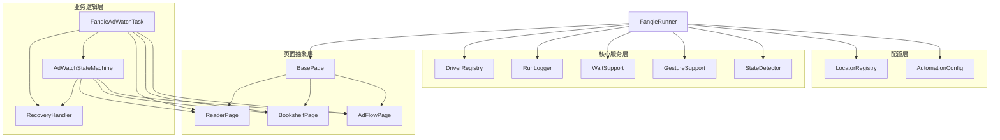
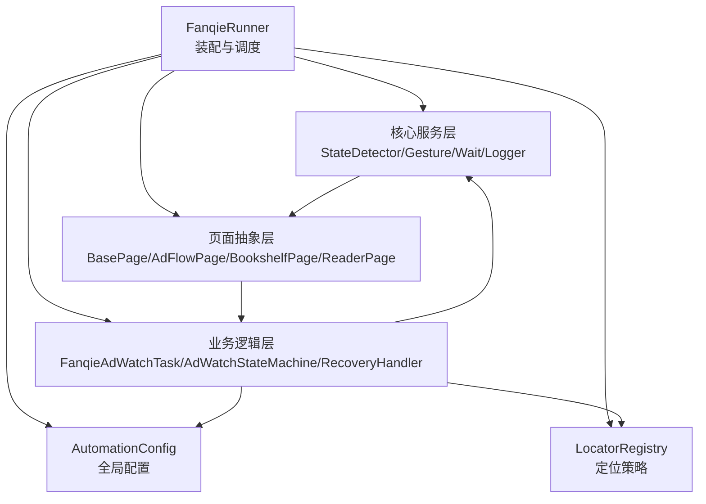
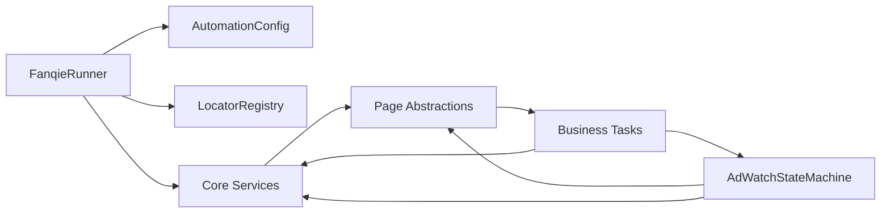

# 整体架构概览

<cite>
**本文引用的文件**
- [FanqieRunner.java](file://automation/src/main/java/com/fanqie/auto/FanqieRunner.java)
- [AutomationConfig.java](file://automation/src/main/java/com/fanqie/auto/config/AutomationConfig.java)
- [LocatorRegistry.java](file://automation/src/main/java/com/fanqie/auto/config/LocatorRegistry.java)
- [StateDetector.java](file://automation/src/main/java/com/fanqie/auto/core/StateDetector.java)
- [BasePage.java](file://automation/src/main/java/com/fanqie/auto/page/BasePage.java)
- [AdFlowPage.java](file://automation/src/main/java/com/fanqie/auto/page/AdFlowPage.java)
- [FanqieAdWatchTask.java](file://automation/src/main/java/com/fanqie/auto/task/FanqieAdWatchTask.java)
- [AdWatchStateMachine.java](file://automation/src/main/java/com/fanqie/auto/task/AdWatchStateMachine.java)
- [pom.xml](file://automation/pom.xml)
</cite>

## 目录
1. [引言](#引言)
2. [项目结构](#项目结构)
3. [核心组件](#核心组件)
4. [架构总览](#架构总览)
5. [详细组件分析](#详细组件分析)
6. [依赖关系分析](#依赖关系分析)
7. [性能与稳定性考量](#性能与稳定性考量)
8. [故障排查指南](#故障排查指南)
9. [结论](#结论)
10. [附录：启动流程时序图](#附录启动流程时序图)

## 引言
本文件面向开发者，系统性阐述番茄免费小说 UI 自动化测试系统的整体设计思路。系统采用分层架构，将配置、驱动与环境、页面抽象、业务编排与状态机解耦，形成高内聚、低耦合、可维护的自动化流水线。文档重点解释各层职责、依赖关系与数据流向，并给出从主入口 FanqieRunner 到广告观看任务执行的完整装配与执行路径，辅以架构图与数据流图，帮助快速理解系统运作机制。

## 项目结构
- 配置层（config）
  - AutomationConfig：集中管理运行参数、超时、轮次、阈值等，支持 classpath 默认值与外部覆盖。
  - LocatorRegistry：统一管理控件定位策略（文本/描述/资源ID候选集、区域提示、是否允许几何兜底）。
- 核心服务层（core）
  - StateDetector：UI 快照抓取与状态识别，提供 tick/detect 能力，缓存优化 RPC 开销。
  - DriverFactory/DriverRegistry：驱动创建与刷新、DriverAware 组件统一注入。
  - GestureSupport/WaitSupport/RunLogger：手势、等待、日志与心跳等通用能力。
- 页面抽象层（page）
  - BasePage：四级定位降级链（语义→几何→时序→系统），点击与裁决逻辑。
  - AdFlowPage/BookshelfPage/ReaderPage：具体页面操作封装（广告流程、书架、阅读页）。
- 业务逻辑层（task）
  - FanqieAdWatchTask：业务流程编排（启动 App、选书、翻页、广告子循环、轮换书籍、熔断收尾）。
  - AdWatchStateMachine：转移表驱动的状态机，处理广告相关状态的幂等流转与四重熔断。
  - RecoveryHandler：异常恢复与兜底策略。



图表来源
- [FanqieRunner.java:89-201](file://automation/src/main/java/com/fanqie/auto/FanqieRunner.java#L89-L201)
- [AutomationConfig.java:10-305](file://automation/src/main/java/com/fanqie/auto/config/AutomationConfig.java#L10-L305)
- [LocatorRegistry.java:16-299](file://automation/src/main/java/com/fanqie/auto/config/LocatorRegistry.java#L16-L299)
- [StateDetector.java:12-461](file://automation/src/main/java/com/fanqie/auto/core/StateDetector.java#L12-L461)
- [BasePage.java:18-516](file://automation/src/main/java/com/fanqie/auto/page/BasePage.java#L18-L516)
- [AdFlowPage.java:21-430](file://automation/src/main/java/com/fanqie/auto/page/AdFlowPage.java#L21-L430)
- [FanqieAdWatchTask.java:20-625](file://automation/src/main/java/com/fanqie/auto/task/FanqieAdWatchTask.java#L20-L625)
- [AdWatchStateMachine.java:40-803](file://automation/src/main/java/com/fanqie/auto/task/AdWatchStateMachine.java#L40-L803)

章节来源
- [FanqieRunner.java:89-201](file://automation/src/main/java/com/fanqie/auto/FanqieRunner.java#L89-L201)
- [pom.xml:15-83](file://automation/pom.xml#L15-L83)

## 核心组件
- 配置层
  - AutomationConfig：集中化配置，类型安全 Getter，支持外部覆盖；所有超时、轮次、阈值从此处获取，避免魔法数字。
  - LocatorRegistry：维护控件定位策略与文案候选集，控制是否允许几何兜底，确保高风险按钮不误点。
- 核心服务层
  - StateDetector：单次 getPageSource() + 内存匹配，按优先级识别 PageState；屏幕尺寸缓存与自愈，降低 RPC 与误判。
  - DriverRegistry/DriverAware：统一刷新 driver 引用，保证 session 重建后组件一致性。
  - GestureSupport/WaitSupport/RunLogger：手势、等待、日志与心跳，支撑稳定执行与可观测性。
- 页面抽象层
  - BasePage：四级定位降级链（L1 语义 → L2 几何 → L3 时序 → L4 系统），boundsHint 裁决，点击坐标由实时 bounds 推算。
  - AdFlowPage：广告流程专用，严格区分“可激进兜底”的关闭按钮与“禁止几何兜底”的观看/继续按钮。
  - BookshelfPage/ReaderPage：书架与阅读页操作封装（选书、翻页、下一章等）。
- 业务逻辑层
  - FanqieAdWatchTask：编排启动 App、导航书架、打开书籍、翻页循环、广告子循环、多本书轮换、熔断收尾。
  - AdWatchStateMachine：转移表驱动，幂等动作、退避重试、四重熔断、每日配额优雅退出、进度持久化。
  - RecoveryHandler：异常恢复（弹窗关闭、回退、重启等）。

章节来源
- [AutomationConfig.java:10-305](file://automation/src/main/java/com/fanqie/auto/config/AutomationConfig.java#L10-L305)
- [LocatorRegistry.java:16-299](file://automation/src/main/java/com/fanqie/auto/config/LocatorRegistry.java#L16-L299)
- [StateDetector.java:12-461](file://automation/src/main/java/com/fanqie/auto/core/StateDetector.java#L12-L461)
- [BasePage.java:18-516](file://automation/src/main/java/com/fanqie/auto/page/BasePage.java#L18-L516)
- [AdFlowPage.java:21-430](file://automation/src/main/java/com/fanqie/auto/page/AdFlowPage.java#L21-L430)
- [FanqieAdWatchTask.java:20-625](file://automation/src/main/java/com/fanqie/auto/task/FanqieAdWatchTask.java#L20-L625)
- [AdWatchStateMachine.java:40-803](file://automation/src/main/java/com/fanqie/auto/task/AdWatchStateMachine.java#L40-L803)

## 架构总览
系统采用分层架构的原因与优势：
- 职责清晰：配置层只负责参数与定位策略；核心服务层提供稳定的 UI 探测与交互能力；页面层封装具体页面操作；业务层编排流程与状态机。
- 可替换性强：DriverFactory 可按配置切换驱动实现；页面与状态机通过接口与注册表松耦合。
- 可维护性与可扩展性：新增页面或状态只需扩展 LocatorRegistry 与 StateDetector/StateMachine，不影响上层。
- 健壮性：四级定位降级链、幂等动作、退避重试、四重熔断、墙钟预算保护，保障长时间运行的稳定性。



图表来源
- [FanqieRunner.java:89-201](file://automation/src/main/java/com/fanqie/auto/FanqieRunner.java#L89-L201)
- [AutomationConfig.java:10-305](file://automation/src/main/java/com/fanqie/auto/config/AutomationConfig.java#L10-L305)
- [LocatorRegistry.java:16-299](file://automation/src/main/java/com/fanqie/auto/config/LocatorRegistry.java#L16-L299)
- [StateDetector.java:12-461](file://automation/src/main/java/com/fanqie/auto/core/StateDetector.java#L12-L461)
- [BasePage.java:18-516](file://automation/src/main/java/com/fanqie/auto/page/BasePage.java#L18-L516)
- [AdFlowPage.java:21-430](file://automation/src/main/java/com/fanqie/auto/page/AdFlowPage.java#L21-L430)
- [FanqieAdWatchTask.java:20-625](file://automation/src/main/java/com/fanqie/auto/task/FanqieAdWatchTask.java#L20-L625)
- [AdWatchStateMachine.java:40-803](file://automation/src/main/java/com/fanqie/auto/task/AdWatchStateMachine.java#L40-L803)

## 详细组件分析

### 配置层：AutomationConfig 与 LocatorRegistry
- AutomationConfig
  - 集中加载 properties，提供类型安全的 Getter；支持外部覆盖；所有超时、轮次、阈值集中管理。
  - 关键配置包括 Appium 连接、时序、流程上限、阅读翻页策略、验证开关、dry-run 等。
- LocatorRegistry
  - 管理控件定位策略（primaryBy + fallbackBys）、boundsHint、allowGeometryFallback。
  - 高风险按钮（观看广告、继续获取时长）禁用几何兜底，防止误点浪费配额；仅关闭按钮允许几何兜底。
  - 提供各类文案候选集（广告入口、关闭、继续、章节、菜单、开屏跳过、每日配额耗尽等）。

章节来源
- [AutomationConfig.java:10-305](file://automation/src/main/java/com/fanqie/auto/config/AutomationConfig.java#L10-L305)
- [LocatorRegistry.java:16-299](file://automation/src/main/java/com/fanqie/auto/config/LocatorRegistry.java#L16-L299)

### 核心服务层：StateDetector、DriverRegistry、Gesture/Wait/Logger
- StateDetector
  - tick() 仅一次 getPageSource()，构造 UiSnapshot 并缓存；detect() 纯内存匹配，按优先级返回 PageState。
  - 屏幕尺寸缓存与自愈，避免横屏/折叠屏旋转导致比例判定失真。
  - 支持 RunLogger 注入，上报 detect 耗时与 XML 大小。
- DriverRegistry/DriverAware
  - 统一刷新 driver 引用，保证 session 重建后各组件引用一致。
- GestureSupport/WaitSupport/RunLogger
  - 手势（点击、滑动、重启 App）、等待（untilState）、日志与心跳（周期输出会话存活与指标）。

章节来源
- [StateDetector.java:12-461](file://automation/src/main/java/com/fanqie/auto/core/StateDetector.java#L12-L461)
- [BasePage.java:18-516](file://automation/src/main/java/com/fanqie/auto/page/BasePage.java#L18-L516)

### 页面抽象层：BasePage 与 AdFlowPage
- BasePage
  - 四级定位降级链：L1 语义属性匹配（text/content-desc/resource-id）+ boundsHint 裁决；L2 几何推断（受 allowGeometryFallback 约束）；L3 时序兜底（达到 adVideoTimeoutMs 后强制 L2）；L4 系统兜底（back/restartApp）。
  - 点击坐标由实时 bounds 中心计算，天然免疫 stale element。
- AdFlowPage
  - clickWatchAd()/clickContinueGetFreeTime()：仅 L1，禁止几何兜底，防误点浪费配额。
  - waitCountdownFinished()：视频播放期间不做任何点击，仅轮询状态变化，避免误触落地页。
  - clickClose()：全链路降级（L1→L2→L3→L4），唯一允许激进兜底的控件。
  - readGainedMinutes()：带奖励语义关键词过滤，避免将“剩余X分钟”误计为奖励。

章节来源
- [BasePage.java:18-516](file://automation/src/main/java/com/fanqie/auto/page/BasePage.java#L18-L516)
- [AdFlowPage.java:21-430](file://automation/src/main/java/com/fanqie/auto/page/AdFlowPage.java#L21-L430)

### 业务逻辑层：FanqieAdWatchTask 与 AdWatchStateMachine
- FanqieAdWatchTask
  - 阶段1：启动 App 并导航至书架，处理开屏广告与通用弹窗。
  - 阶段2：打开任意一本书进入阅读页，自动跳过短剧/视频页。
  - 阶段3：外层循环 outerCycles × 内层翻页 pagesPerCycle；遇广告态进入 AdWatchStateMachine；遇章节末尾跳转下一章；异常交由 RecoveryHandler。
  - 多本书轮换：当单入口达上限且目标未达成时，退回书架换下一本未使用书籍。
  - 熔断：目标分钟、总轮次、墙钟时间预算、每日配额耗尽均触发优雅收尾。
- AdWatchStateMachine
  - 转移表驱动：Map<PageState, StateHandler>，当前状态决定下一步动作，不假设固定顺序。
  - 幂等性：动作前重新 detect，动作后校验状态转移，失败则退避重试。
  - 四重熔断：单入口轮次、全局轮次、目标分钟、单状态滞留超时。
  - 每日配额识别：连续命中去抖 + 上下文约束（弹窗型关闭/取消按钮），优雅收尾。
  - 进度持久化：断点续跑，记录 earnedMinutes、totalAdRounds、usedBooks、lastUpdateDate。

章节来源
- [FanqieAdWatchTask.java:20-625](file://automation/src/main/java/com/fanqie/auto/task/FanqieAdWatchTask.java#L20-L625)
- [AdWatchStateMachine.java:40-803](file://automation/src/main/java/com/fanqie/auto/task/AdWatchStateMachine.java#L40-L803)

## 依赖关系分析
- FanqieRunner 作为唯一入口，解析命令行参数，装配配置、环境自检、驱动工厂、日志器，再依次创建核心服务、页面对象、任务与状态机，最终调用 task.run()。
- 依赖方向：
  - 业务逻辑层依赖页面抽象层与核心服务层。
  - 页面抽象层依赖核心服务层（Driver、Gesture、Wait、Logger）与配置层（Config、Locators）。
  - 核心服务层依赖配置层（Config、Locators）。
  - 配置层无运行时依赖（仅读取 properties）。
- 通过 DriverRegistry 与 DriverAware 接口，session 重建后可统一刷新 driver 引用，避免悬挂引用。



图表来源
- [FanqieRunner.java:89-201](file://automation/src/main/java/com/fanqie/auto/FanqieRunner.java#L89-L201)
- [FanqieAdWatchTask.java:20-625](file://automation/src/main/java/com/fanqie/auto/task/FanqieAdWatchTask.java#L20-L625)
- [AdWatchStateMachine.java:40-803](file://automation/src/main/java/com/fanqie/auto/task/AdWatchStateMachine.java#L40-L803)

章节来源
- [FanqieRunner.java:89-201](file://automation/src/main/java/com/fanqie/auto/FanqieRunner.java#L89-L201)
- [FanqieAdWatchTask.java:20-625](file://automation/src/main/java/com/fanqie/auto/task/FanqieAdWatchTask.java#L20-L625)
- [AdWatchStateMachine.java:40-803](file://automation/src/main/java/com/fanqie/auto/task/AdWatchStateMachine.java#L40-L803)

## 性能与稳定性考量
- 性能优化
  - StateDetector.tick() 仅一次 getPageSource()，同一 tick 内复用快照，避免重复 RPC。
  - 屏幕尺寸缓存与自愈，减少 getSize() 调用与比例误判。
  - 视频等待稀疏轮询（pollIntervalMs * 4），降低 CPU 与 RPC 压力。
  - 构建 fat-jar 打包，脱离 IDE 运行，提升长任务稳定性。
- 稳定性保障
  - 四级定位降级链与 boundsHint 裁决，提高鲁棒性。
  - 幂等动作与退避重试，避免“点了已消失按钮”的竞态问题。
  - 四重熔断与墙钟预算保护，防止无限循环与设备占用。
  - 每日配额耗尽识别与优雅收尾，避免陷入 UNKNOWN 反复重试。
  - 进度持久化（earnedMinutes、totalAdRounds、usedBooks、日期），支持断点续跑。

章节来源
- [StateDetector.java:12-461](file://automation/src/main/java/com/fanqie/auto/core/StateDetector.java#L12-L461)
- [AdFlowPage.java:21-430](file://automation/src/main/java/com/fanqie/auto/page/AdFlowPage.java#L21-L430)
- [AdWatchStateMachine.java:40-803](file://automation/src/main/java/com/fanqie/auto/task/AdWatchStateMachine.java#L40-L803)
- [pom.xml:137-175](file://automation/pom.xml#L137-L175)

## 故障排查指南
- 中文乱码
  - 检查 properties 加载是否使用 UTF-8 Reader；LocatorRegistry.dumpToConsole() 用于核验候选集编码。
- 状态识别不准
  - 查看 StateDetector.detect() 优先级与候选集；必要时调整 text/desc/resource-id 匹配规则。
- 误点风险
  - 确认高风险按钮（观看广告、继续获取时长）的 allowGeometryFallback=false；仅关闭按钮允许几何兜底。
- 视频卡死
  - 检查 AdFlowPage.waitCountdownFinished() 超时与轮询间隔；确认未进行任何点击。
- 会话泄漏
  - 确认 FanqieRunner 的 ShutdownHook 与 finally 中 logger.stop() 与 driver.quit() 被调用。
- 进度丢失
  - 检查 progress.properties 读写权限与 lastUpdateDate；跨天会清空 usedBooks，需重新遍历。

章节来源
- [LocatorRegistry.java:67-93](file://automation/src/main/java/com/fanqie/auto/config/LocatorRegistry.java#L67-L93)
- [StateDetector.java:152-208](file://automation/src/main/java/com/fanqie/auto/core/StateDetector.java#L152-L208)
- [AdFlowPage.java:103-163](file://automation/src/main/java/com/fanqie/auto/page/AdFlowPage.java#L103-L163)
- [FanqieRunner.java:127-238](file://automation/src/main/java/com/fanqie/auto/FanqieRunner.java#L127-L238)
- [AdWatchStateMachine.java:679-734](file://automation/src/main/java/com/fanqie/auto/task/AdWatchStateMachine.java#L679-L734)

## 结论
本系统通过分层架构将配置、驱动、页面与业务解耦，结合四级定位降级链、幂等状态机、四重熔断与墙钟预算保护，实现了高鲁棒性的长时间 UI 自动化。从 FanqieRunner 主入口开始，逐步装配各组件，最终执行广告观看任务，并在异常与边界条件下具备完善的恢复与收尾机制。该设计既满足当前番茄免费小说的自动化需求，也为未来扩展到其他应用或平台提供了良好基础。

## 附录：启动流程时序图
```mermaid
sequenceDiagram
participant User as "用户"
participant Runner as "FanqieRunner"
participant Config as "AutomationConfig"
participant Loc as "LocatorRegistry"
participant Doctor as "EnvDoctor"
participant Factory as "DriverFactory"
participant Logger as "RunLogger"
participant Core as "Core Services"
participant Pages as "Page Layer"
participant Task as "FanqieAdWatchTask"
participant SM as "AdWatchStateMachine"
User->>Runner : 启动程序可选参数
Runner->>Config : 加载配置classpath + 外部覆盖
Runner->>Loc : 初始化定位器并打印候选集
Runner->>Doctor : 环境自检
alt 自检未通过
Runner-->>User : 退出非零码
else 自检通过
Runner->>Factory : 创建 Driver
Runner->>Logger : 创建并启动心跳
Runner->>Core : 创建 Gesture/Wait/Detector/Registry
Runner->>Pages : 创建 Bookshelf/Reader/AdFlow 页面
Runner->>Task : 创建任务注入页面与状态机
Runner->>SM : 创建状态机注入页面与恢复处理器
opt dry-run 模式
Runner->>Task : 执行 DryRunProbe.probe()
Task-->>Runner : 结束
else 正常模式
Runner->>Task : task.run()
Task->>SM : runAdSubLoop()遇到广告态
SM-->>Task : 返回达成目标/熔断/异常
Task-->>Runner : 任务完成统计汇总
end
Runner->>Logger : stop()
Runner->>Factory : quit()
end
```

图表来源
- [FanqieRunner.java:41-238](file://automation/src/main/java/com/fanqie/auto/FanqieRunner.java#L41-L238)
- [AutomationConfig.java:25-42](file://automation/src/main/java/com/fanqie/auto/config/AutomationConfig.java#L25-L42)
- [LocatorRegistry.java:52-65](file://automation/src/main/java/com/fanqie/auto/config/LocatorRegistry.java#L52-L65)
- [FanqieAdWatchTask.java:99-314](file://automation/src/main/java/com/fanqie/auto/task/FanqieAdWatchTask.java#L99-L314)
- [AdWatchStateMachine.java:173-312](file://automation/src/main/java/com/fanqie/auto/task/AdWatchStateMachine.java#L173-L312)